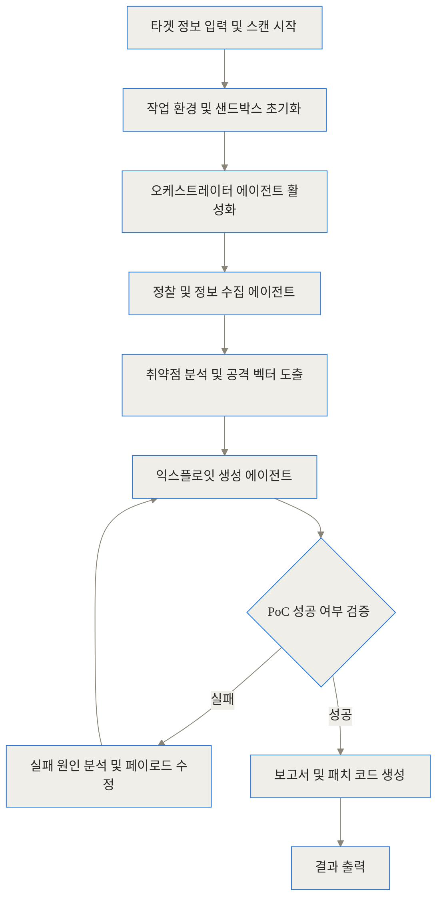
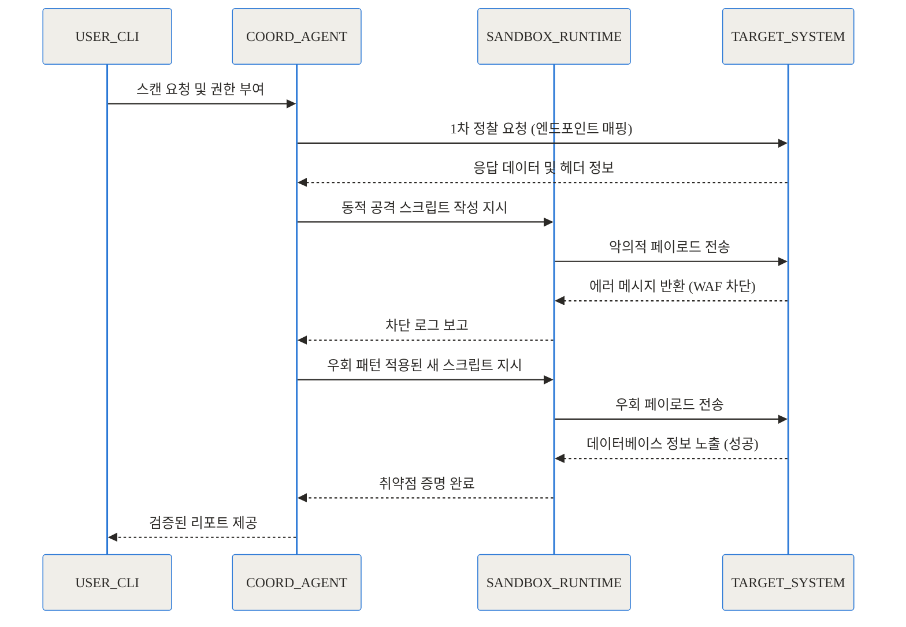
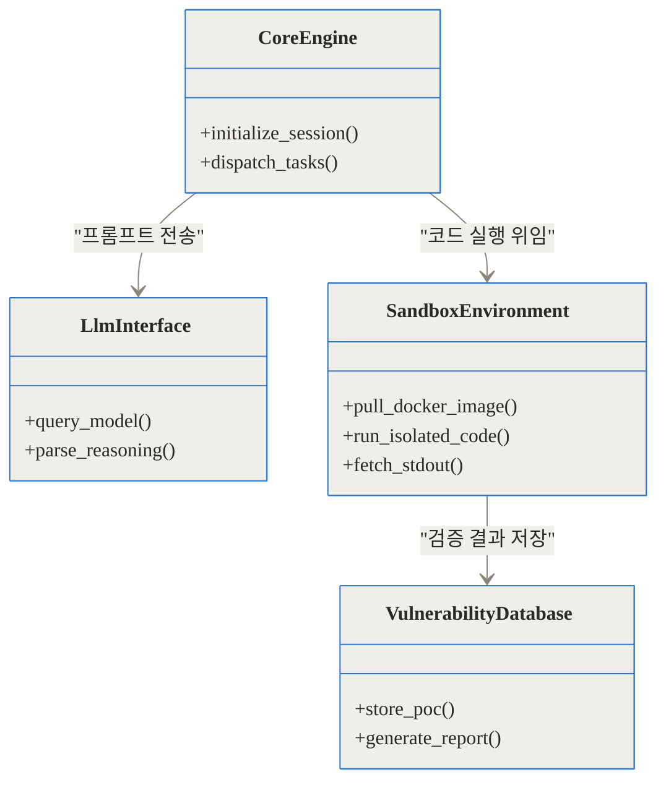
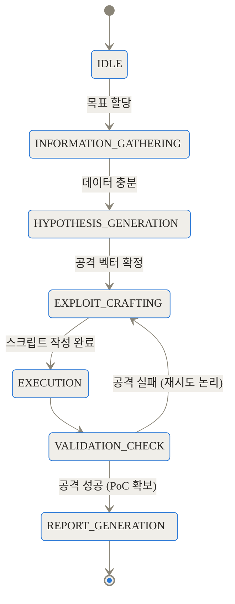
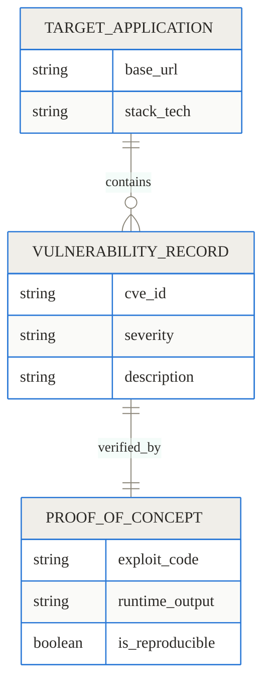
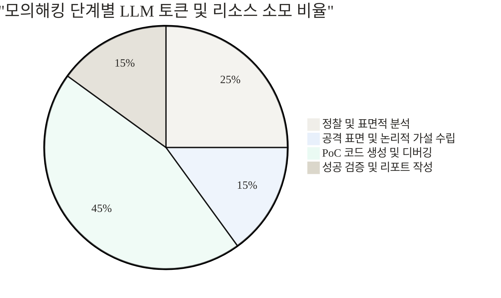
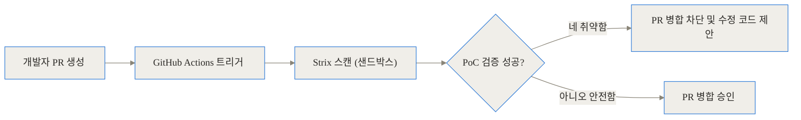

## 오픈소스 AI 모의해킹 도구 Strix 심층 해설: 실제 해커처럼 생각하고 검증하는 자율형 보안 에이전트

이 글에서는 최신 AI 기술을 활용하여 애플리케이션 보안 테스트의 패러다임을 바꾸고 있는 오픈소스 프로젝트, Strix에 대해 아주 깊이 있게 파헤쳐 보겠습니다.

### 핵심 링크 모음

- [Strix GitHub 저장소 공식 페이지](https://github.com/usestrix/strix)
- [Strix 공식 문서 및 빠른 시작 가이드](https://docs.strix.ai)
- [Strix Discord 개발자 커뮤니티](https://discord.gg/strix-ai)

### 서론: 끝나지 않는 오탐지와의 전쟁

현대 소프트웨어 개발 환경은 하루에도 수십 번씩 배포가 일어나는 속도전입니다. 하지만 보안 테스트 단계에 이르면 그 속도는 급격히 느려집니다. 기업들은 배포 전 취약점을 잡기 위해 정적 분석(SAST)이나 동적 분석(DAST) 도구를 파이프라인에 연결해 둡니다. 하지만 여기서 치명적인 문제가 발생하죠. 바로 오탐지(False Positive)입니다. 

보안 스캐너가 수백 개의 취약점 경고를 쏟아내면, 개발자와 보안 담당자는 일일이 코드를 열어보고 "이게 진짜 외부에서 공격 가능한 취약점인가?"를 검증해야 합니다. 이 과정에서 수많은 시간과 감정이 소모됩니다. 그렇다고 외부 보안 업체를 통해 수동 모의해킹(Penetration Testing)을 받자니, 수주일의 시간과 엄청난 비용이 필요합니다.

이 딜레마를 해결하기 위해 등장한 것이 바로 Strix입니다. 한 마디로 요약하자면 어떨까요?

> Strix는 단순한 소스코드 패턴 분석기가 아니라, 보안팀 소속의 천재 해커 인턴처럼 스스로 생각하고, 코드를 실행해 보고, 실제로 시스템을 뚫어낸 증거(PoC)를 가져오는 자율형 AI 모의해킹 도구입니다.

### 배경과 문제 정의: 왜 기존 도구로는 충분하지 않을까?

Strix의 혁신성을 제대로 이해하려면, 먼저 기존 보안 점검 방식이 겪고 있던 구체적인 고통을 들여다봐야 합니다.

정적 분석(SAST) 도구는 코드의 패턴만 읽습니다. 예를 들어, 사용자 입력을 받아 데이터베이스 쿼리를 만드는 코드가 있으면 무조건 "SQL 인젝션 위험!"이라고 경고를 띄웁니다. 하지만 실제 운영 환경에서는 앞단에 웹 방화벽(WAF)이 있거나, 프레임워크 단에서 이미 안전하게 이스케이프 처리를 해두었을 수 있습니다. 도구는 이런 문맥을 전혀 알지 못합니다.

반대로 인간 해커는 문맥을 이해합니다. 에러 메시지를 보고 구조를 유추하고, 우회 기법을 섞어가며 기어코 데이터베이스 버전을 화면에 띄워냅니다. 이것이 진짜 취약점이죠. 기존에는 인간만이 할 수 있었던 이 고도의 논리적 추론과 '시행착오'의 영역을, 이제 대규모 언어 모델(LLM)을 장착한 에이전트가 대신하게 된 것입니다.


### 핵심 개념 쉽게 이해하기: 오케스트라 지휘자와 샌드박스

이 기술의 핵심 아이디어는 마치 체계적으로 분업화된 도둑들의 팀을 꾸리는 것과 같습니다. 은행을 털기(물론 합법적인 모의해킹입니다) 위해 한 명은 건물 도면을 분석하고, 한 명은 경비원의 패턴을 기록하며, 가장 손기술이 좋은 한 명이 금고 다이얼을 돌립니다.

Strix는 하나의 거대한 AI가 모든 것을 처리하는 것이 아니라, 여러 개의 특화된 AI 에이전트가 협업하는 다중 에이전트 오케스트레이션(Multi-agent Orchestration) 구조를 가집니다. 그리고 이 모든 공격 행위가 여러분의 호스트 PC나 운영 서버를 실수로 망가뜨리지 않도록, 완벽하게 격리된 '샌드박스'라는 투명한 유리방 안에서 진행됩니다. AI는 유리방 안에서 마음껏 악성 코드를 작성하고 실행하며 대상 시스템을 테스트합니다.

### 작동 원리 심층 해설 (Under the Hood)

이제 가장 중요한 내부 구조로 깊이 들어가 보겠습니다. Strix가 어떻게 코드 베이스를 분석하고 취약점을 증명하는지 단계별로 살펴보겠습니다.

#### 1. 전체 파이프라인 흐름도

사용자가 CLI를 통해 목표 시스템을 입력하면, Strix는 즉시 초기화 단계를 거쳐 에이전트들에게 임무를 부여합니다.



이 흐름의 핵심은 검증 단계에서 실패했을 때 포기하지 않고, 실패 원인을 분석하여(Reasoning) 다시 공격(Exploiting)을 시도한다는 점입니다. 이는 일반적인 자동화 스캐너와 가장 차별화되는 지점입니다.

#### 2. 에이전트 상호작용 및 공격 타임라인

에이전트들이 타겟과 어떻게 상호작용하는지 시간 순서대로 살펴보면 그 정교함에 놀라게 됩니다.



에이전트는 샌드박스 내부에서 Python이나 Bash 스크립트를 직접 작성하여 실행합니다. 타겟 시스템이 에러를 뱉으면, 그 에러 메시지를 읽고 "아, 홑따옴표가 필터링되고 있구나. 유니코드 인코딩으로 다시 시도해보자"라고 판단합니다.

#### 3. 안전한 샌드박스 아키텍처

AI가 마음대로 시스템 명령어를 실행하도록 두는 것은 대단히 위험합니다. 자칫하면 개발자의 컴퓨터가 망가질 수도 있죠. 이를 방지하기 위해 Strix는 `ghcr.io/usestrix/strix-sandbox`라는 전용 컨테이너 이미지를 활용합니다.



이 구조 덕분에 AI가 실수로 무한 루프를 돌거나 악의적인 패키지를 다운로드하더라도, 컨테이너만 종료하면 메인 호스트는 완벽하게 보호됩니다.

#### 4. 에이전트의 상태 전이 라이프사이클

에이전트 내부의 상태 머신은 어떻게 구성되어 있을까요? ReAct(Reasoning and Acting) 프레임워크를 기반으로 매우 유기적인 상태 변화를 가집니다.



각 상태를 넘어갈 때마다 LLM은 자신의 이전 행동과 그 결과를 반추합니다. "내가 방금 전송한 페이로드가 403 Forbidden을 받았으니, 이번에는 User-Agent를 변조해봐야겠다"라는 식으로 전략을 수정합니다.

#### 5. 데이터 스키마 관계

최종적으로 생성되는 데이터는 단순한 텍스트 덩어리가 아니라, 철저하게 구조화된 레코드입니다.



발견된 취약점 레코드(`VULNERABILITY_RECORD`)는 반드시 하나 이상의 재현 가능한 개념 증명 데이터(`PROOF_OF_CONCEPT`)를 동반해야만 사용자에게 보고됩니다. 이 엄격한 1:1 관계가 오탐지를 제로에 가깝게 만드는 비결입니다.

#### 6. 리소스 사용 분배

실제로 Strix가 모의해킹을 수행할 때 모델의 연산 시간과 API 호출 리소스는 어디에 가장 많이 쓰일까요?



차트에서 볼 수 있듯, 대부분의 리소스는 페이로드를 만들고 실패를 디버깅하는 데 사용됩니다. 인간 해커가 가장 많은 시간을 쏟는 부분과 정확히 일치합니다.

### 구현 및 사용 디테일: 어떻게 시작할까?

강력한 도구지만, 설치와 설정은 현대적인 개발자 도구답게 매우 단순합니다. Python 3.12 이상의 환경에서 동작하며, `pipx`를 통한 설치를 권장합니다.

환경 변수 설정이 가장 중요합니다. Strix는 최신 인공지능 모델의 깊은 추론 능력을 요구합니다. 현재 2026년 기준으로 `openai/gpt-5.4`, `anthropic/claude-sonnet-4-6`, `vertex_ai/gemini-3-pro-preview`와 같은 최상위 모델들을 공식 지원합니다.

```bash
# LLM 제공자 및 모델 설정
export STRIX_LLM="openai/gpt-5.4"
export LLM_API_KEY="sk-your-api-key"

# 실시간 최신 취약점 검색 능력을 부여하려면 Perplexity API 추가 (선택사항)
export PERPLEXITY_API_KEY="pplx-your-api-key"

# 에이전트의 사고 깊이 설정 (빠른 스캔은 medium, 철저한 스캔은 high)
export STRIX_REASONING_EFFORT="high"
```

환경이 준비되었다면 CLI 명령어로 스캔을 시작할 수 있습니다.

```bash
# 로컬 디렉토리의 소스코드 스캔
strix scan ./my-web-app

# 배포된 스테이징 서버 스캔 (반드시 본인이 소유한 서버에만 사용하세요!)
strix scan https://staging.my-company.com
```

### 실전 활용 시나리오: CI/CD 파이프라인 방어막

가장 이상적인 활용법은 GitHub Actions와 연동하여, 개발자가 Pull Request를 올릴 때마다 AI 모의해커가 변경된 코드를 공격해 보게 만드는 것입니다.



이를 구현하기 위한 GitHub Actions 워크플로우 YAML은 아주 간결합니다.

```yaml
name: strix-penetration-test
on: pull_request

jobs:
  security-scan:
    runs-on: ubuntu-latest
    steps:
      - uses: actions/checkout@v4
      - name: Run Strix Agent
        uses: usestrix/strix-action@v1
        with:
          target: './'
        env:
          STRIX_LLM: "anthropic/claude-sonnet-4-6"
          LLM_API_KEY: ${{ secrets.LLM_API_KEY }}
```

이 파이프라인이 구축되면, 취약한 코드가 운영 환경(Production)에 도달하기 전에 완벽하게 차단됩니다.

### 벤치마크 및 비교: 수치로 증명하는 성능

그렇다면 기존 도구와 비교했을 때 성능 차이는 어느 정도일까요? 

가장 큰 차이는 오탐지(False Positive) 비율과 실제 작동하는 익스플로잇 도출 여부에 있습니다.

```chartjs
{
  "type": "bar",
  "data": {
    "labels": ["기존 SAST 도구", "기존 DAST 도구", "Strix (AI 에이전트)"],
    "datasets": [
      {
        "label": "오탐지 보고 비율 (%)",
        "data": [65, 30, 2]
      }
    ]
  }
}
```

기존 SAST 도구는 100개의 경고 중 65개가 무시해도 되는 수준이었다면, Strix는 자신이 직접 코드를 돌려보고 뚫어낸 것만 보고하므로 오탐지율이 2% 미만으로 떨어집니다. 

기존 접근 방식들과의 장단점을 표로 정리해 보았습니다.

| 비교 항목 | 기존 정적 분석 (SAST) | 수동 모의해킹 컨설팅 | Strix AI 모의해킹 |
| :--- | :--- | :--- | :--- |
| **검사 속도** | 분 단위 (매우 빠름) | 주 단위 (매우 느림) | 시간 단위 (중간) |
| **오탐지율** | 매우 높음 (문맥 파악 불가) | 매우 낮음 | 매우 낮음 (PoC 기반) |
| **비즈니스 로직 이해** | 전혀 불가능 | 매우 뛰어남 | 상당히 우수함 (에이전트 추론) |
| **비용** | 라이선스 고정 비용 | 건당 수천만 원 | LLM API 호출 비용 (수백~수천 원 수준) |
| **자동화 여부** | CI/CD 완벽 통합 | 불가능 | CI/CD 완벽 통합 |

레이더 차트를 통해 다각도로 비교해 보면 Strix가 차지하는 훌륭한 스윗스팟을 확인할 수 있습니다.

```chartjs
{
  "type": "radar",
  "data": {
    "labels": ["실행 속도", "오탐지 방어력", "심층 로직 발견율", "파이프라인 연동성", "운영 비용 효율성"],
    "datasets": [
      {
        "label": "Strix AI 에이전트",
        "data": [7, 10, 8, 9, 8]
      },
      {
        "label": "수동 모의해킹",
        "data": [2, 10, 10, 2, 2]
      },
      {
        "label": "전통적 보안 스캐너",
        "data": [9, 2, 3, 9, 7]
      }
    ]
  }
}
```

### 솔직한 평가: 완벽한 마법의 지팡이는 아닙니다

어떤 기술이든 맹신은 금물입니다. Strix 역시 분명한 한계와 트레이드오프가 존재합니다.

1. **비용과 시간의 트레이드오프**: 단순 패턴 매칭 스캐너는 1분이면 끝나지만, Strix는 에이전트가 샌드박스에서 여러 번 테스트를 반복하므로 수십 분이 걸릴 수 있습니다. 또한 최고 성능의 LLM(GPT-5.4, Claude 4.6 등)을 반복적으로 호출하므로 프로젝트 규모가 크면 API 비용이 제법 발생합니다.
2. **환각(Hallucination)과 토끼굴(Rabbit Hole)**: 아주 드물지만, AI가 특정 공격 벡터에 집착하여 불가능한 익스플로잇을 성공시키려고 API 호출 비용만 낭비하며 무한 루프에 빠지는 '토끼굴' 현상이 발생할 수 있습니다. 그래서 `STRIX_REASONING_EFFORT` 설정으로 타임아웃과 시도 횟수를 적절히 제어해야 합니다.
3. **도덕적, 법적 책임의 무게**: 가장 중요한 점입니다. 이 도구는 **진짜로 무언가를 부술 수 있는 무기**입니다. 서드파티 서비스나 인가받지 않은 타인의 시스템에 Strix를 연결하는 것은 명백한 범죄 행위가 될 수 있습니다. 반드시 본인이나 자사에서 완전히 통제하는 개발 및 스테이징 환경에서만 사용해야 합니다.


### 마무리: 방패와 창의 진화, 그 중심에서

지금까지 우리는 애플리케이션 보안 영역을 송두리째 흔들고 있는 오픈소스 프로젝트, Strix에 대해 깊이 알아보았습니다. 

기존의 보안 도구들이 단순한 '방패의 균열 검사기'였다면, Strix는 직접 창을 들고 찔러보며 방패의 강도를 테스트하는 '지치지 않는 스파링 파트너'입니다. 오탐지라는 보안 업계의 해묵은 숙제를 'PoC 자동 생성'이라는 가장 확실하고 공학적인 방법으로 풀어냈다는 점에서 극찬받아 마땅합니다.

여러분의 다음 배포 파이프라인에는 코드를 리뷰해주는 도구뿐만 아니라, 직접 코드를 해킹해 보는 AI 에이전트를 영입해 보는 것은 어떨까요? 불안감은 사라지고, 더 빠르고 안전한 개발의 길이 열릴 것입니다.

## References
- [https://github.com/usestrix/strix](https://github.com/usestrix/strix)
- [https://docs.strix.ai](https://docs.strix.ai)
- [https://discord.gg/strix-ai](https://discord.gg/strix-ai)
