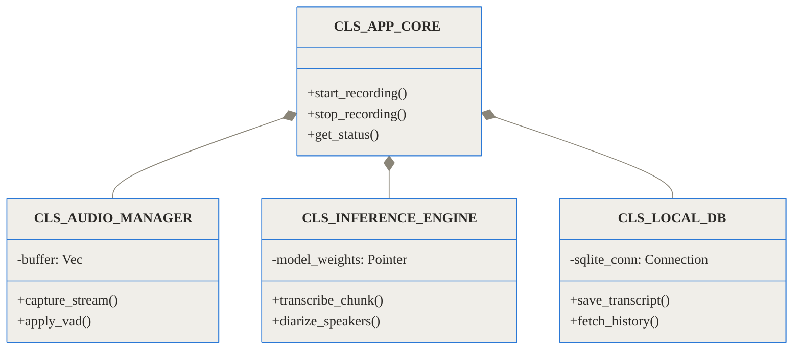
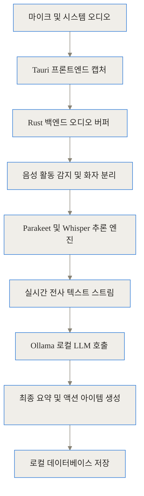
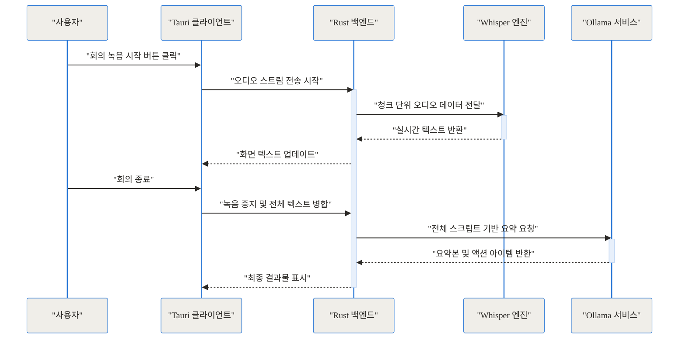
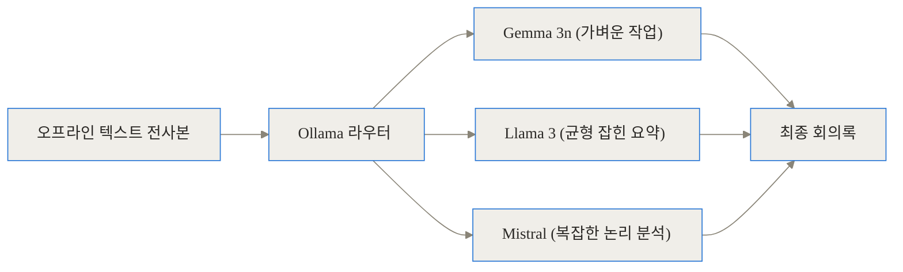
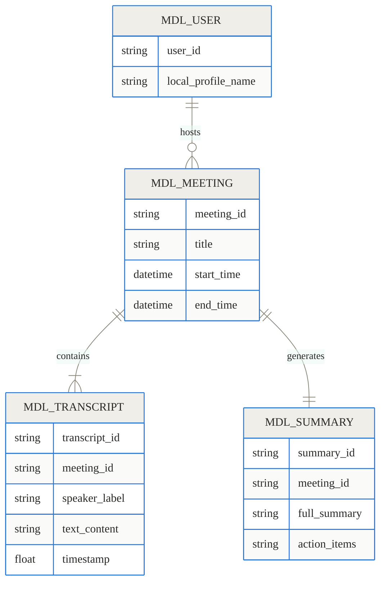
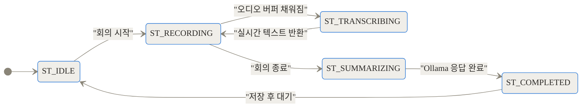
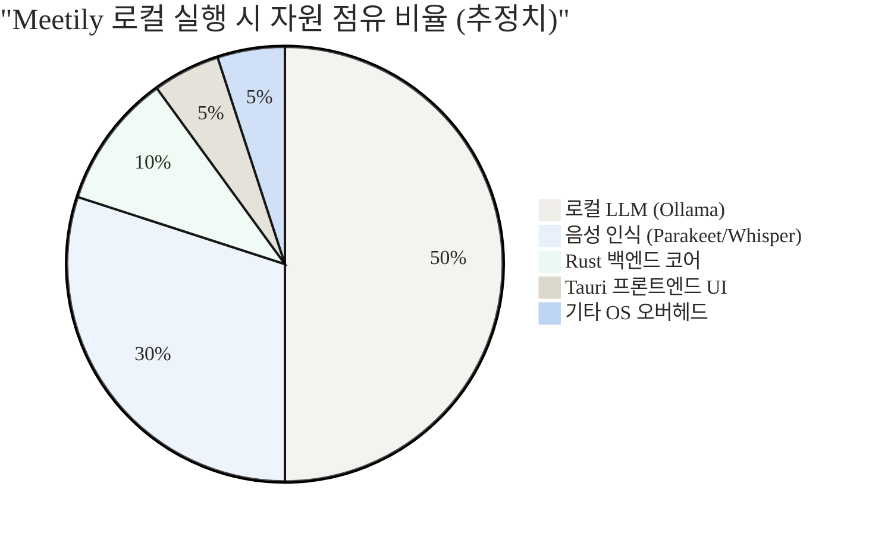

[GitHub 저장소](https://github.com/Zackriya-Solutions/meetily) | [공식 웹사이트](https://meetily.ai) | [Zackriya Solutions](https://www.zackriya.com)

> **TL;DR (한 줄 요약)**
> - 클라우드 서버 전송 없이 내 기기(PC) 내부에서 100% 처리되어 완벽한 데이터 프라이버시를 보장하는 오픈소스 AI 회의 비서입니다.
> - Rust 기반 코어와 NVIDIA Parakeet/Whisper.cpp를 결합해 기존 로컬 모델 대비 최대 4배 빠른 실시간 음성 인식(STT)과 화자 분리를 수행합니다.
> - Ollama와의 연동을 통해 회의 종료 즉시 외부 유출 위험 없이 오프라인 환경에서 요약과 액션 아이템을 추출합니다.

---

## 1. 배경과 문제 정의: 내 회의 데이터는 지금 어디로 가고 있는가

최근 몇 년간 업무 환경에서 AI 회의록 작성 도구는 필수품으로 자리 잡았습니다. 클릭 한 번이면 한 시간짜리 회의를 깔끔한 텍스트로 요약해 주고, 누가 어떤 업무를 맡기로 했는지까지 정리해 줍니다. 하지만 이런 편리함 이면에는 우리가 자주 외면하는 중대한 문제가 숨어 있습니다. 바로 '데이터 프라이버시'입니다.

우리가 흔히 사용하는 상용 AI 회의 도구들은 음성 데이터를 어떻게 처리할까요? 대부분의 서비스는 사용자의 기기에서 캡처한 오디오 스트림을 자사의 중앙 클라우드 서버로 전송합니다. 서버에 도착한 데이터는 대규모 음성 인식 모델을 거쳐 텍스트로 변환되고, 다시 거대한 언어 모델(LLM)을 통해 요약됩니다. 문제는 이 과정에서 발생합니다. 아무리 암호화 통신을 한다고 해도, 음성의 원본 데이터나 변환된 텍스트가 제3자의 서버에 저장된다는 사실 자체는 변하지 않습니다. 

Zackriya Solutions가 Meetily 프로젝트를 시작하게 된 계기도 이와 정확히 맞닿아 있습니다. 개발팀은 과거 민감한 인수합병(M&A) 논의를 위해 법무팀과 화상 회의를 준비하고 있었습니다. 회의록 작성을 위해 상용 AI 도구를 켜자, 법무팀은 단호하게 제동을 걸었습니다. 변호사-의뢰인 비닉특권(Attorney-Client Privilege)을 유지하려면 논의 내용이 제3자 서버로 전송되어서는 안 된다는 이유였습니다. 

실제로 금융 서비스, 의료 산업(HIPAA 규정 적용 대상), 방위 산업, 혹은 기업의 주요 전략을 논의하는 임원진 회의에서는 외부 클라우드 의존성이 치명적인 보안 리스크가 됩니다. 상용 AI 도구들은 사용자 데이터를 AI 학습에 활용하지 않는다고 약속하더라도, 인프라의 통제권이 외부에 있다는 사실 자체가 기업의 보안 지침을 위반하는 경우가 많습니다. Meetily는 바로 이 지점에서 출발했습니다. "가장 강력한 AI 회의 비서를, 인터넷 연결 없이 완전히 통제된 내 로컬 기기 안에서 구동할 수는 없을까?"

## 2. 개념 쉽게 이해하기: 철저히 격리된 나만의 비서

Meetily가 제시하는 해결책을 이해하기 위해 일상적인 비유를 들어보겠습니다. 기존의 클라우드 기반 AI 회의 도구가 '번잡한 카페에서 일하는 외부 프리랜서 비서'라면, Meetily는 '외부와 완전히 단절된 금고실 안에서 나만을 위해 일하는 전담 비서'와 같습니다.

프리랜서 비서에게 회의록 작성을 맡기면, 그는 회의 내용을 카페의 공개된 와이파이를 통해 자신의 회사 서버로 보내고, 그곳에서 동료들과 함께(클라우드 인프라) 문서를 정리한 뒤 다시 당신에게 이메일로 보내줍니다. 이 과정에서 누군가 실수로 문서를 열어보거나, 회사의 서버가 해킹당할 위험이 항상 존재합니다.

반면 Meetily라는 전담 비서는 당신의 노트북이라는 금고실 안에 아예 상주합니다. 귀(음성 캡처), 뇌(Rust 코어와 Parakeet/Whisper), 그리고 기억력(Ollama를 통한 로컬 LLM)을 모두 금고실 안에 갖추고 있습니다. 회의가 시작되면 금고 안에서 모든 대화를 듣고, 그 자리에서 즉시 텍스트로 받아적으며, 회의가 끝나는 즉시 문서를 요약해 당신의 하드 드라이브에만 고스란히 저장해 둡니다. 외부로 나가는 문(인터넷 연결)은 처음부터 필요하지 않습니다. 이것이 Meetily가 표방하는 100% 로컬 프로세싱의 본질입니다.

## 3. 작동 원리 심층 분석 (Under the Hood)

Meetily가 단순한 아이디어를 넘어 실용적인 성능을 내기까지는 상당히 정교한 아키텍처가 필요합니다. 로컬 환경은 클라우드 서버에 비해 연산 자원(CPU, GPU, RAM)이 절대적으로 부족하기 때문입니다. 이 한계를 극복하기 위해 Meetily는 어떻게 설계되었는지 단계별로 파헤쳐 봅니다.

### 3.1. 아키텍처 개요: 왜 Rust와 Tauri인가?

이 프로젝트의 가장 중요한 기술적 선택은 코어 백엔드 언어로 Rust를 채택한 것입니다. 음성 캡처와 실시간 추론(Inference)은 지연 시간(Latency)에 매우 민감한 작업입니다. Python과 같은 인터프리터 언어로 오디오 버퍼를 처리하면 메모리 오버헤드와 가비지 컬렉션(GC)으로 인해 미세한 끊김 현상이 발생할 수 있습니다.

Rust는 메모리 안전성을 보장하면서도 C/C++에 준하는 하드웨어 제어권과 속도를 제공합니다. Meetily는 OS 수준의 오디오 드라이버(macOS의 경우 AVFoundation, Windows의 경우 WASAPI)와 직접 통신하며, 생성된 오디오 버퍼를 복사본 없이(Zero-copy) 추론 엔진으로 전달하는 구조를 갖추고 있습니다.



프론트엔드 UI는 Tauri 프레임워크를 사용합니다. 웹 기술(HTML, CSS, JavaScript)로 데스크톱 앱을 만들 수 있다는 점에서 Electron과 비슷하지만, 무거운 Chromium 엔진 대신 운영체제에 내장된 기본 웹뷰를 사용하여 앱 용량과 메모리 점유율을 획기적으로 낮췄습니다. 시스템 자원을 온전히 로컬 AI 모델이 사용할 수 있도록 양보한 영리한 설계입니다.

### 3.2. 음성 인식 및 화자 분리 파이프라인

Meetily가 자랑하는 또 하나의 강점은 실시간 전사(Transcription) 속도입니다. 단순히 표준 Whisper 모델을 사용한 것이 아니라, NVIDIA의 Parakeet 모델 구조와 Whisper.cpp를 고도로 최적화하여 기존 대비 4배 빠른 실시간 전사 속도를 달성했습니다.

Parakeet은 음성을 텍스트로 변환하는 과정에서 RNN-T(Recurrent Neural Network Transducer) 아키텍처를 기반으로 설계되어, 오디오가 끝날 때까지 기다리지 않고 스트리밍 방식으로 텍스트를 즉각 출력하는 데 탁월합니다.

전체 데이터 파이프라인은 다음과 같이 흐릅니다.



오디오 스트림이 들어오면 우선 VAD(Voice Activity Detection, 음성 활동 감지) 알고리즘이 작동하여 침묵 구간을 잘라냅니다. 이를 통해 불필요한 연산을 줄입니다. 이후 화자 분리(Speaker Diarization) 모듈이 음성의 고유한 특징(Embedding)을 분석하여 "발화자 A", "발화자 B"를 실시간으로 구분해 냅니다. 이 모든 과정이 내 PC의 메모리 위에서만 일어납니다.

회의 중 실시간으로 일어나는 상호작용은 아래 시퀀스 다이어그램으로 확인할 수 있습니다.



### 3.3. 로컬 LLM 통합: Ollama를 통한 지능 부여

텍스트로 변환된 회의 스크립트만으로는 훌륭한 비서라고 할 수 없습니다. 1시간짜리 대본을 처음부터 끝까지 다시 읽는 것은 고통스러운 일이니까요. Meetily는 오픈소스 로컬 LLM 구동기인 Ollama와 통합하여 이 문제를 해결합니다.

사용자는 자신의 하드웨어 사양에 맞게 다양한 모델을 선택할 수 있습니다. 예를 들어, 노트북의 RAM이 8GB로 제한적이라면 가벼운 Gemma 3n이나 Mistral 모델을 사용하고, 16GB 이상의 여유로운 환경이라면 추론 능력이 뛰어난 Llama 3 기반 모델을 돌려 훨씬 깊이 있는 요약과 액션 아이템(해야 할 일 목록)을 추출할 수 있습니다. 



이러한 구조 덕분에 Meetily는 외부 인터넷이 완전히 차단된 비행기 안이나 보안 구역에서도 회의 내용을 완벽하게 녹음하고 텍스트로 변환한 뒤, 논리 정연한 요약본까지 만들어낼 수 있습니다. 회의 데이터 모델의 구조는 대략적으로 다음과 같이 관계를 맺습니다.



회의 생명주기 측면에서 보면 상태 전이는 매우 직관적입니다. 녹음 중(Recording) 상태에서 백그라운드 스레드가 끊임없이 텍스트를 변환(Transcribing)하며, 회의가 끝나는 즉시 요약(Summarizing) 상태로 넘어갑니다.



## 4. 구현 및 사용 디테일: 내 PC에 로컬 AI 비서 구축하기

그렇다면 이 강력한 도구를 내 PC에 어떻게 설치할까요? 복잡한 환경 설정이 필요할 것 같지만, 오픈소스 커뮤니티의 노력 덕분에 설치 과정은 매우 단순화되었습니다. macOS와 Windows 사용자 모두 쉽게 접근할 수 있습니다.

### 4.1. 설치 방법 (macOS 및 Windows)

macOS 사용자의 경우, 친숙한 패키지 관리자인 Homebrew를 통해 단 두 줄의 명령어로 프론트엔드와 백엔드를 동시에 설치할 수 있습니다. FFmpeg 같은 의존성 라이브러리도 자동으로 함께 설치됩니다.

```bash
# 커스텀 탭 추가
brew tap zackriya-solutions/meetily

# 앱 설치 (백엔드 포함)
brew install --cask meetily
```

Windows 사용자는 GitHub 릴리스 페이지나 공식 웹사이트에서 `meetily_x64-setup.exe` 형태의 설치 파일을 직접 다운로드하여 더블 클릭으로 설치를 마칠 수 있습니다.

개발 환경이나 서버에 분리해서 올리고 싶은 전문가를 위해 Docker 방식도 지원합니다.

```bash
git clone https://github.com/Zackriya-Solutions/meetily.git
cd meetily
docker build -t meetily .
docker run -d -p 8080:8080 meetily
```

### 4.2. 백엔드 서버 실행 및 옵션

CLI(명령줄 인터페이스) 환경에 익숙하다면 직접 서버 옵션을 제어할 수 있습니다. 기본적으로 Meetily는 영어 위주로 동작하지만, 명령어를 통해 모델 크기와 언어를 한국어 등 다국어로 쉽게 변경할 수 있습니다.

```bash
# 기본 설정으로 실행
meetily-server

# 더 큰 음성 인식 모델 사용
meetily-server --model large-v3

# 인식 언어를 프랑스어나 스페인어로 지정 (한국어는 ko)
meetily-server --language fr

# 조합해서 사용하기
meetily-server -m small -l es
```

로컬 LLM 요약을 사용하기 위해서는 사전에 Ollama가 시스템에 설치되어 있어야 합니다. 터미널에서 `ollama run llama3` 같은 명령어로 모델을 한 번 다운로드해 두면, Meetily가 회의 종료 후 자동으로 로컬 포트(localhost:11434)를 통해 해당 모델을 호출합니다.

## 5. 실전 활용 시나리오

Meetily의 가치는 프라이버시가 생명인 특수 환경에서 가장 빛납니다. 실무에서 어떻게 활용될 수 있는지 구체적인 시나리오를 살펴봅니다.

**시나리오 1: 법무법인 및 기업 M&A 논의**
기업의 합병 비율이나 특허 소송 전략을 논의하는 화상 회의는 최고의 보안이 요구됩니다. 변호사는 노트북의 마이크를 켜고 Meetily를 실행합니다. 회의 중 오가는 모든 민감한 재무 수치와 전략은 노트북 밖으로 단 한 바이트도 나가지 않습니다. 회의가 끝나면 로컬 하드 드라이브에만 암호화되어 저장되는 완벽한 회의록을 얻을 수 있습니다.

**시나리오 2: 방위산업체 및 정부 기관의 폐쇄망 회의**
정부 기관의 인트라넷 환경이나 방위산업체의 연구실은 애초에 외부 인터넷 접속이 물리적으로 차단(Air-gapped)되어 있습니다. 기존의 클라우드 AI 도구는 이곳에서 무용지물입니다. 하지만 Meetily는 오프라인 설치 파일만 내부망으로 반입하여 설치하면, 인터넷 없이도 완벽한 성능의 회의록 AI를 구축할 수 있습니다.

**시나리오 3: 의료계 종사자 (HIPAA 컴플라이언스)**
환자의 개인 정보와 병력을 논의하는 의료진 간의 컨퍼런스 콜은 엄격한 환자 정보 보호법을 준수해야 합니다. 로컬에서 구동되는 Meetily를 사용하면 클라우드 사업자와 별도의 BAA(Business Associate Agreement)를 맺을 필요 없이 자체적으로 보안 요건을 충족할 수 있습니다.

## 6. 벤치마크 및 비교: 기존 클라우드 솔루션과의 차이점

기존 도구들과 구체적으로 무엇이 다른지 표와 차트로 비교해 보겠습니다.

| 구분 | Meetily | 상용 도구 A (O사) | 상용 도구 B (F사) |
|---|---|---|---|
| 작동 방식 | 100% 로컬 (오프라인) | 클라우드 기반 | 클라우드 기반 |
| 데이터 프라이버시 | 사용자 기기에만 저장 | 서비스 제공자 서버에 저장 | 서비스 제공자 서버에 저장 |
| 비용 구조 | 완전 무료 (오픈소스) | 월 구독료 발생 | 월 구독료 발생 |
| 하드웨어 요구사항 | 4GB 이상 RAM 및 준수한 CPU 필요 | 무관 (브라우저나 앱만 있으면 됨) | 무관 (브라우저나 앱만 있으면 됨) |
| 커스텀 LLM 연동 | 가능 (Ollama를 통해 원하는 모델 교체) | 불가능 (제공자가 정한 모델만 사용) | 불가능 (제공자가 정한 모델만 사용) |

오프라인 도구라면 속도가 느릴 것이라는 편견이 있습니다. 하지만 Meetily는 Parakeet 아키텍처를 도입하여 클라우드 API 호출에 따르는 네트워크 지연(Network Latency)을 없애고 로컬 자원을 극대화했습니다.

```chartjs
{
  "type": "bar",
  "data": {
    "labels": ["표준 Whisper (로컬)", "클라우드 API (네트워크 포함)", "Meetily (Parakeet 최적화)"],
    "datasets": [
      {
        "label": "음성 처리 속도 배수 (실시간 대비, 높을수록 빠름)",
        "data": [1.2, 0.8, 4.0],
        "backgroundColor": ["#cccccc", "#ff9800", "#4caf50"]
      }
    ]
  },
  "options": {
    "responsive": true
  }
}
```

또한 프라이버시 관점에서 보았을 때 데이터 주권의 차이는 극명합니다. Meetily는 100% 사용자의 기기에 데이터를 남깁니다.

```chartjs
{
  "type": "doughnut",
  "data": {
    "labels": ["내 기기에 남는 데이터", "클라우드로 전송되는 데이터"],
    "datasets": [
      {
        "data": [100, 0],
        "backgroundColor": ["#4caf50", "#f44336"]
      }
    ]
  },
  "options": {
    "responsive": true
  }
}
```

## 7. 솔직한 평가: 완벽한 도구는 없다, 한계와 트레이드오프

Meetily가 매력적인 해결책인 것은 분명하지만, 기술적 트레이드오프를 냉정하게 짚고 넘어갈 필요가 있습니다.

가장 큰 진입 장벽은 하드웨어 요구사항입니다. 시스템 권장 사양으로 4GB 이상의 여유 RAM을 요구하지만, 실질적으로 로컬 LLM과 음성 인식 모델을 동시에 쾌적하게 돌리려면 최신 Apple Silicon(M1, M2 등) 칩셋이나 성능이 좋은 외장 GPU가 달린 Windows PC가 필요합니다.

아래의 시스템 자원 점유 비율 차트에서 볼 수 있듯이, 로컬 AI는 기기의 역량을 강하게 요구합니다.



노트북을 배터리 모드로 사용할 때 Meetily를 구동하면 전력 소모가 매우 심해져 배터리가 빠르게 닳을 수 있습니다. 또한, 기술에 익숙하지 않은 일반 사용자가 처음 Ollama를 설치하고 터미널에서 모델을 다운로드하는 과정에서 불편함을 느낄 여지도 존재합니다. 상용 클라우드 서비스들이 제공하는 '로그인 한 번으로 끝나는 마찰 없는 경험'과는 다소 거리가 있습니다.

## 8. 마무리: 데이터 주권의 시대로의 전환

AI가 업무의 모든 영역에 스며들면서 우리는 편리함을 얻은 대신 은연중에 데이터 통제권을 거대 기술 기업들에게 넘겨주었습니다. Meetily는 이러한 흐름에 대한 실용적인 반기입니다.

"AI의 능력은 활용하되, 내 데이터는 내 기기에 남긴다." 이 원칙은 보안이 생명인 기업뿐만 아니라, 개인의 프라이버시를 중요하게 생각하는 모든 사용자에게 울림을 줍니다. Rust의 성능과 오픈소스 생태계(Whisper, Ollama)의 결합을 통해, 우리는 이제 클라우드 없이도 놀랍도록 똑똑한 회의 비서를 데스크톱 안에서 만날 수 있게 되었습니다. 앞으로 로컬 AI 모델들이 더욱 경량화되고 똑똑해짐에 따라, Meetily와 같은 데이터 주권 중심의 도구들은 선택이 아닌 필수가 될 것입니다.

## 자주 묻는 질문 (FAQ)

### 오프라인 상태(인터넷 연결 끊김)에서도 정말 모든 기능이 작동하나요?

네, 완전히 작동합니다. 음성 텍스트 변환에 필요한 Whisper/Parakeet 모델과 요약에 사용되는 Ollama LLM 모델이 모두 사용자의 PC 하드 드라이브에 미리 다운로드되어 구동되기 때문에 외부 네트워크 연결이 전혀 필요하지 않습니다.

### 어떤 운영체제를 지원하나요?

Meetily는 현재 macOS(Apple Silicon 권장)와 Windows 환경을 공식 지원하며 설치 관리자를 제공합니다. 리눅스 사용자나 개발자의 경우 Docker나 소스 코드를 통해 직접 빌드하여 사용할 수 있습니다.

### 로컬 LLM(Ollama)이 설치되어 있지 않으면 요약 기능을 사용할 수 없나요?

네, 회의 내용을 문맥에 맞게 요약하고 액션 아이템을 추출하는 작업은 LLM의 추론 능력을 요구합니다. 따라서 Ollama가 로컬 시스템에 설치되어 있어야 전체 요약 파이프라인이 완성됩니다. 다만 음성 전사(텍스트 변환) 기능 자체는 단독으로 동작합니다.

### 화자 분리(Speaker Diarization)는 여러 명이 겹쳐 말할 때도 정확한가요?

오프라인 환경에서도 음성 임베딩 분석을 통해 발화자를 꽤 훌륭하게 구분합니다. 다만, 클라우드의 거대한 자원을 사용하는 상용 모델보다는 여러 명의 목소리가 심하게 겹치는 상황(Crosstalk)에서 정확도가 다소 떨어질 수 있습니다.

### 기존의 클라우드 상용 도구(Otter.ai 등)와 비교했을 때 가장 큰 단점은 무엇인가요?

가장 큰 단점은 사용자의 PC 자원(CPU, GPU, RAM)을 크게 소모한다는 점입니다. 고사양 작업이 진행되므로 노트북 배터리가 빨리 닳을 수 있으며, 사양이 낮은 구형 사무용 PC에서는 실시간 처리 속도가 지연되거나 끊길 수 있습니다.


## References
- [https://github.com/Zackriya-Solutions/meetily](https://github.com/Zackriya-Solutions/meetily)
- [https://meetily.ai](https://meetily.ai)
- [https://www.zackriya.com](https://www.zackriya.com)
