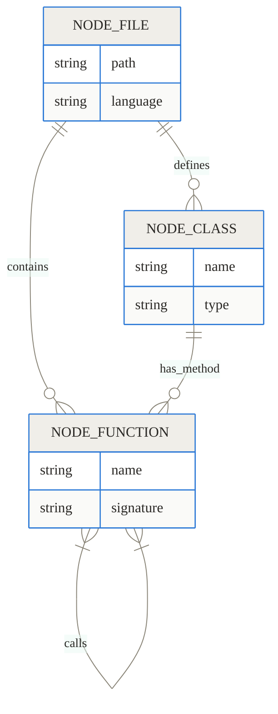
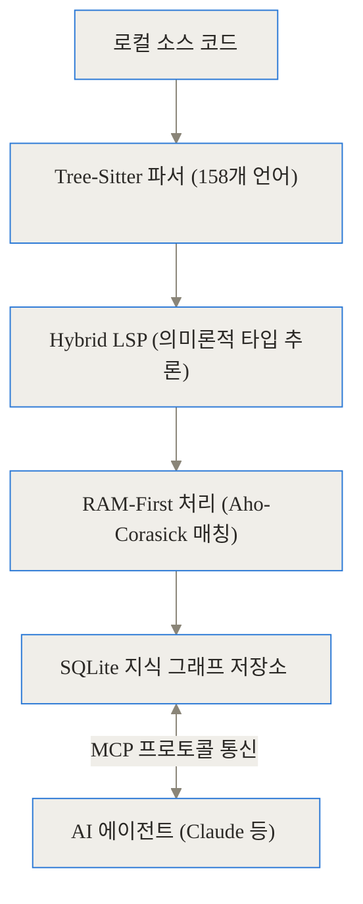
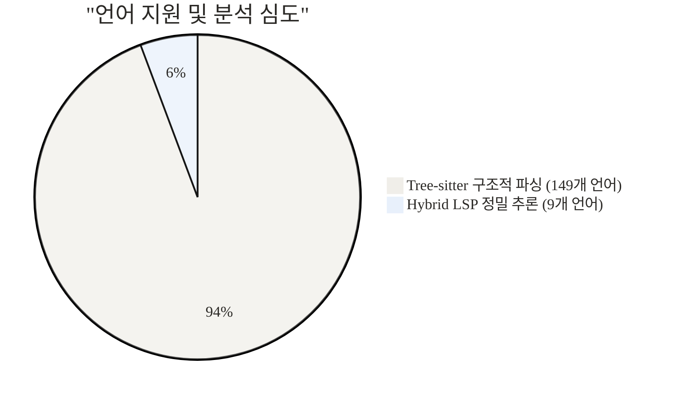
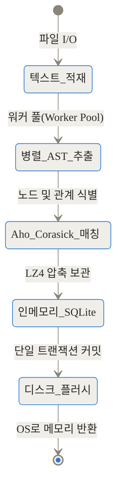
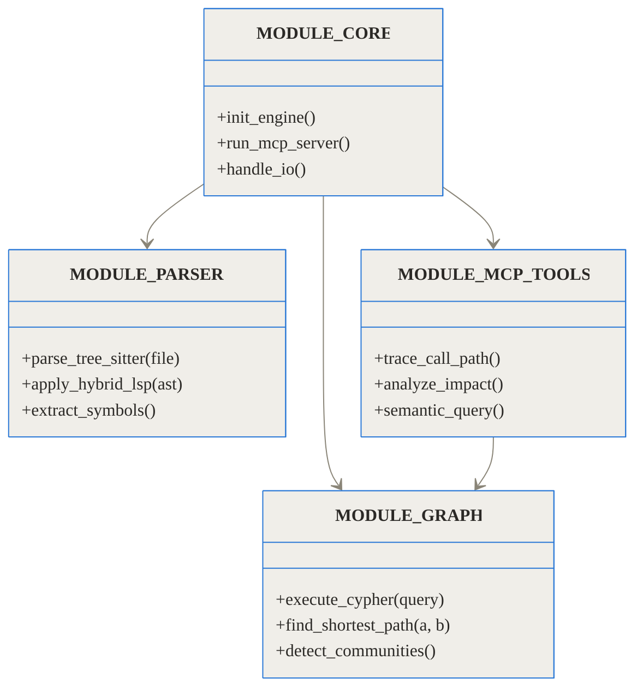
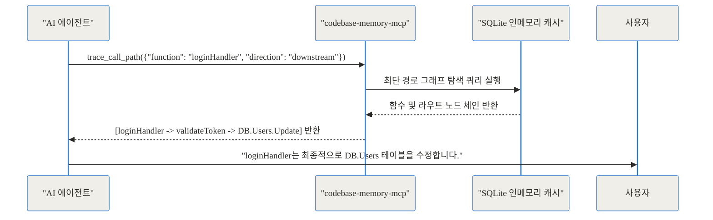
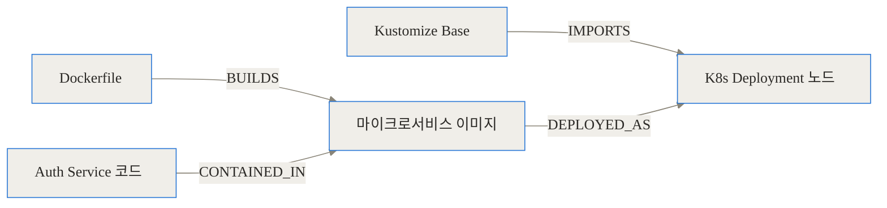

## AI 코딩 에이전트의 치명적인 약점과 새로운 대안

최근 소프트웨어 개발 생태계는 엄청난 변화를 겪고 있습니다. 과거에는 개발자가 직접 모든 코드를 읽고 작성했다면, 이제는 각종 AI 코딩 에이전트가 그 역할을 분담하고 있죠. 하지만 현업에서 AI 에이전트를 실무의 거대한 프로젝트에 투입해 본 분들이라면 공통으로 느끼는 뼈아픈 한계가 있습니다. 바로 **'문맥(Context) 파악의 비효율성'**입니다.

거대한 모노레포(Monorepo) 환경에서 AI 에이전트에게 "결제 처리 로직에서 호출되는 모든 외부 API를 찾아줘"라고 요청한다고 가정해 보겠습니다. 현재 대부분의 AI 에이전트는 사람이 코드를 찾는 방식과 똑같이 행동합니다. 먼저 파일명으로 검색(grep)을 하고, 의심되는 파일을 열어서(read) 처음부터 끝까지 읽어 내립니다. 원하는 함수가 다른 파일에 정의되어 있다면 다시 그 파일명을 검색하고, 열어서 읽는 과정을 끝없이 반복합니다.

이러한 **'탐색(Search) → 읽기(Read) → 재탐색'**의 연쇄 작용은 모델의 컨텍스트 윈도우(Context Window)를 쓰레기 데이터로 가득 채워버립니다. 불필요한 코드 라인까지 모두 읽어 들이면서 API 토큰 비용은 기하급수적으로 치솟고, 정작 중요한 코드를 찾았을 때쯤이면 모델은 앞서 읽은 내용을 잊어버리거나 환각(Hallucination) 현상을 일으키곤 합니다.

이 문제를 근본적으로 해결하기 위해 등장한 프로젝트가 바로 **codebase-memory-mcp**입니다. 이 도구는 AI가 코드를 '텍스트'로 한 줄씩 읽게 두지 않습니다. 대신 전체 코드베이스를 순식간에 분석하여 함수, 클래스, API 라우트 간의 관계를 3차원 지도의 형태인 **지식 그래프(Knowledge Graph)**로 압축해 둡니다. AI 에이전트는 수백 개의 파일을 읽는 대신, 이 지식 그래프에 단 한 번의 구조적 쿼리를 던져 원하는 답을 즉시 얻어냅니다.

이번 글에서는 단순한 유틸리티를 넘어 AI 에이전트의 인지 구조를 완전히 바꿔놓고 있는 codebase-memory-mcp의 내부 원리부터 실전 활용법까지 깊이 있게 파헤쳐 보겠습니다.

---

## 기존 방식의 한계와 codebase-memory-mcp의 핵심 개념

### 왜 코드를 텍스트로 읽으면 안 될까요?

코드베이스는 본질적으로 '텍스트'가 아니라 고도로 얽혀 있는 '그래프(Graph)'입니다. 클래스는 서로를 상속하고, 함수는 다른 함수를 호출하며, 마이크로서비스는 HTTP를 통해 서로 통신합니다.

하지만 AI 모델은 태생적으로 텍스트 예측 엔진입니다. 코드의 구조를 이해하려면 코드 전체를 텍스트로 읽어 들여야만 하죠. 10만 줄의 코드가 있는 프로젝트에서 특정 함수의 호출 경로를 추적하기 위해 수만 개의 토큰을 소모하는 것은 비용적으로도, 성능 면에서도 절대 지속 불가능한 방식입니다.

### 지식 그래프: 코드베이스를 지도로 만들다

codebase-memory-mcp의 핵심 아이디어는 **'코드의 구조적 맥락(Structural Context)을 미리 추출해 두자'**는 것입니다. 이는 마치 처음 방문한 낯선 도시에서 목적지를 찾을 때, 모든 골목길을 직접 걸어보며 헤매는 대신 미리 만들어진 정밀한 '지도'를 보고 최단 경로를 찾는 것과 같습니다.

이 서버는 프로젝트의 모든 소스 코드를 스캔하여 다음 요소들을 지식 그래프의 노드(Node)와 엣지(Edge)로 변환합니다.

- **노드(Node):** 파일, 클래스, 함수, HTTP 라우트, 데이터베이스 스키마, K8s 리소스 등
- **엣지(Edge):** 호출(CALLS), 상속(INHERITS), 정의(DEFINES), 구현(IMPLEMENTS), 임포트(IMPORTS) 등

AI 에이전트가 "A 함수가 어디서 사용돼?"라고 물으면, 이 MCP 서버는 그래프 데이터베이스에서 `MATCH (f:Function)-[:CALLS]->(target) WHERE target.name = 'A'` 형태의 쿼리를 실행하여 단 1밀리초(ms) 만에 호출 체인만을 깔끔하게 발췌해 돌려줍니다.



위 다이어그램은 codebase-memory-mcp가 내부적으로 구축하는 지식 그래프의 단순화된 스키마를 보여줍니다. 이러한 관계형 데이터 모델 덕분에 파일 단위의 텍스트 한계를 벗어날 수 있습니다.

---

## 기술 심층 분석 (Under the Hood)

이 프로젝트가 놀라운 점은 단지 지식 그래프를 만든다는 개념 자체에 있지 않습니다. 그 원대한 개념을 실현하기 위해 도입한 **무자비할 정도의 최적화와 엔지니어링 설계**에 있습니다.

### 1. 파이프라인 아키텍처: 어떻게 작동하는가?

전체 시스템은 로컬 환경에서 단일 정적 바이너리로 구동되며, 크게 4단계의 파이프라인을 거칩니다.



이 파이프라인의 각 구성 요소를 더 깊이 들여다보겠습니다.

### 2. 구문 분석의 한계 돌파: Tree-Sitter와 Hybrid LSP

일반적인 정적 분석 도구들은 언어 서버 프로토콜(LSP)에 의존합니다. LSP는 타입과 참조를 정확히 찾아내지만, 프로젝트를 빌드(Build)할 수 있는 환경과 의존성이 완벽하게 갖춰져 있어야만 동작합니다. AI 에이전트가 수시로 코드를 변경하고 런타임 에러가 발생하는 환경에서는 LSP가 제 기능을 하지 못해 멈춰버리기 일쑤입니다.

반면, codebase-memory-mcp는 **Tree-Sitter**를 기반으로 작동합니다. Tree-Sitter는 에러에 매우 강한(Error-tolerant) 파서로, 코드가 불완전하거나 문법 오류가 있어도 즉시 추상 구문 트리(AST)를 생성해 냅니다. 이 도구는 무려 158개 언어의 문법(Grammar)을 C 바이너리 안에 내장(Vendor)하고 있어, 별도의 언어 런타임을 설치할 필요가 전혀 없습니다.

하지만 Tree-Sitter만으로는 동적 타입 언어에서 '이 함수가 정확히 어느 클래스의 메서드인지'를 추론하기 어렵습니다. 그래서 이 프로젝트는 **Hybrid LSP**라는 독창적인 방식을 도입했습니다. Python, TypeScript, Java 등 9개 주요 언어에 대해서는 내부적인 경량 추론 엔진을 돌려 문맥과 임포트 경로를 바탕으로 타입을 유추합니다. 무거운 빌드 서버 없이도 LSP에 준하는 정확도를 얻어낸 것입니다.



### 3. RAM-First 인덱싱 엔진

수백만 줄의 코드를 가진 저장소를 인덱싱할 때 디스크(Disk)에 즉시 데이터를 쓰면 병목이 발생합니다. 논문에 따르면 codebase-memory-mcp는 2,800만 줄에 달하는 리눅스 커널(Linux Kernel) 코드를 약 3분 만에 인덱싱합니다. 이것이 어떻게 가능할까요?

비밀은 **RAM-First 파이프라인**에 있습니다.



1. 시스템은 모든 소스 코드를 LZ4 알고리즘으로 압축하여 메모리에 올립니다.
2. 멀티스레딩 환경에서 수천 개의 파일이 동시에 파싱됩니다.
3. 융합된 Aho-Corasick 문자열 매칭 알고리즘을 사용해 심볼 간의 참조를 메모리 위에서 즉각 연결합니다.
4. 이 모든 데이터는 디스크가 아닌 인메모리(In-memory) SQLite(`:memory:`)에 먼저 적재됩니다.
5. 모든 분석이 끝나면, 단 하나의 거대한 트랜잭션으로 디스크의 `.mcp_memory.db` 파일에 덤프(Dump)한 뒤 점유했던 메모리를 즉시 OS에 반환합니다.

### 4. Louvain/Leiden 커뮤니티 탐지 및 클러스터링

코드베이스가 커지면 그래프도 비대해집니다. 이 도구는 백그라운드에서 네트워크 이론의 Louvain 및 Leiden 알고리즘을 사용하여 코드 노드들을 논리적인 '커뮤니티(모듈)'로 묶어냅니다. 물리적인 폴더 구조와 상관없이, 서로 빈번하게 호출하는 함수와 클래스들을 하나의 의미론적 그룹으로 클러스터링하여 AI가 시스템 아키텍처를 거시적으로 이해할 수 있게 돕습니다.

---

## 모듈 및 컴포넌트 아키텍처

내부적으로 이 시스템이 어떻게 구성되어 있는지 객체 지향적 관점(모듈 구조)에서 살펴보겠습니다.



시스템은 철저하게 단일 C 언어 바이너리로 컴파일되도록 설계되었습니다. `MODULE_MCP_TOOLS`는 외부 AI 에이전트와 통신하는 접점이며, `MODULE_GRAPH`는 SQLite 엔진을 래핑하여 초고속 그래프 순회를 담당합니다.

---

## 벤치마크: 압도적인 성능과 효율

아무리 이론이 훌륭해도 실제 성능이 뒷받침되지 않으면 의미가 없습니다. codebase-memory-mcp의 벤치마크 결과는 기존의 파일 단위 탐색 방식과 비교해 극적인 차이를 보여줍니다.

### 토큰 절감량 비교

AI 에이전트에게 5가지 구조적 질문(예: 특정 컨트롤러에서 데이터베이스까지의 호출 흐름)을 던졌을 때 소모되는 프롬프트 토큰 양을 측정한 결과입니다.

```chartjs
{
  "type": "bar",
  "data": {
    "labels": ["기존 방식 (파일 열기 및 grep)", "codebase-memory-mcp (그래프 쿼리)"],
    "datasets": [
      {
        "label": "구조적 쿼리 5회 수행 시 소모 토큰",
        "data": [412000, 3400],
        "backgroundColor": ["rgba(255, 99, 132, 0.7)", "rgba(54, 162, 235, 0.7)"]
      }
    ]
  },
  "options": {
    "responsive": true,
    "plugins": {
      "title": {
        "display": true,
        "text": "컨텍스트 윈도우 토큰 사용량 (낮을수록 우수)"
      }
    }
  }
}
```

412,000 토큰과 3,400 토큰. **약 99.2%의 토큰이 절감**되었습니다. AI는 굳이 필요 없는 임포트 구문, 주석, 상관없는 유틸리티 함수 로직을 읽을 필요 없이, JSON 형태로 반환된 정확한 '호출 관계도'만을 컨텍스트에 담게 됩니다.

### 종합 성능 비교 표

| 측정 지표 | 기존 에이전트 (Grep + Read) | codebase-memory-mcp | 개선 효과 |
| :--- | :--- | :--- | :--- |
| **평균 토큰 사용량** | 약 82,400 토큰 / 쿼리 | 약 680 토큰 / 쿼리 | **120배 절감** |
| **도구 호출(Tool Call) 횟수** | 평균 15 ~ 30회 (재귀적 탐색) | 1 ~ 2회 | **극적인 왕복 지연 감소** |
| **리눅스 커널 인덱싱 속도** | (시도조차 불가능) | 약 3분 (2.1M 노드) | **초고속 구조화** |
| **아키텍처 질문 정답률** | 92% (모든 코드를 읽은 경우) | 83% | (약간의 정확도 트레이드오프) |
| **운영 비용 (API 과금)** | 매우 높음 ($$$) | 사실상 무료에 가까움 (¢) | **비용 혁신** |

정답률이 92%에서 83%로 소폭 하락한 것은 정직한 트레이드오프입니다. 함수 내부에 숨겨진 자연어 주석이나 비표준적인 꼼수 코드는 지식 그래프 구조만으로는 완벽히 캡처되지 않기 때문입니다. 하지만 10배 이상의 속도와 비용 절감을 고려하면 현업에서는 비교가 안 될 정도로 유리한 조건입니다.

---

## 설치 및 실전 활용 시나리오

### 의존성 제로(0)의 우아한 설치

Python 기반의 AI 도구들은 수많은 패키지 충돌이나 가상환경 문제로 설치부터 진을 빼는 경우가 많습니다. 반면 이 프로젝트는 C로 짜인 정적 단일 바이너리를 제공합니다. Docker도, 데이터베이스 설치도, API 키도 필요 없습니다.

```bash
# macOS 및 Linux 환경 한 줄 설치
curl -fsSL https://raw.githubusercontent.com/DeusData/codebase-memory-mcp/main/install.sh | bash
```

설치 스크립트는 로컬 환경을 스캔하여 Claude Code, Cursor, Codex CLI, Aider, Zed 등 11종의 AI 에이전트 설정 파일을 찾아내고, MCP 도구를 자동으로 등록해 줍니다.

### 시나리오 1: 마이크로서비스 간의 숨겨진 의존성 추적

여러분이 새로운 마이크로서비스 저장소에 배치되었다고 가정해 보겠습니다. 에이전트에게 이렇게 요청할 수 있습니다.
> "UserAuth 서비스의 로그인 라우트가 최종적으로 어떤 데이터베이스 테이블을 수정하는지 추적해 줘."

에이전트는 내부적으로 `trace_call_path` 도구를 호출합니다.



단 몇 초 만에 데이터베이스와 통신하는 완벽한 흐름을 정리해서 답변해 줍니다.

### 시나리오 2: 인프라스트럭처(IaC) 변경 영향도 분석

이 도구의 숨겨진 강력함은 애플리케이션 코드뿐만 아니라 Dockerfile, Kubernetes 매니페스트, Kustomize 오버레이 같은 인프라 코드까지 그래프로 연결한다는 점입니다.



"내가 이 환경 변수 이름을 바꾸면 어떤 K8s 리소스와 서비스가 터질까?" 같은 복잡한 질문에 대해서도 `analyze_impact` 도구를 통해 즉각적인 파급 효과(Blast Radius)를 계산해 냅니다.

---

## 솔직한 평가: 한계와 적용을 피해야 할 상황

기술의 이면에는 항상 한계가 존재합니다. codebase-memory-mcp를 만능 열쇠로 오해하지 않기 위해 다음 사항들을 숙지해야 합니다.

1. **독립적인 챗봇이 아닙니다:** 이 도구 자체에는 LLM이 내장되어 있지 않습니다. 오직 그래프를 만들고 서빙하는 '백엔드' 역할만 합니다. 반드시 Claude Code나 Cursor 같은 MCP 호환 클라이언트와 결합해야만 의미가 있습니다.
2. **함수 내부의 비즈니스 로직 분석의 한계:** 지식 그래프는 함수의 시그니처와 호출 관계, 반환 타입 등을 매핑합니다. 하지만 함수 내부에 하드코딩된 복잡한 수학 공식이나 자연어로 길게 적힌 주석의 뉘앙스를 파악하려면 여전히 에이전트가 해당 파일의 원본 텍스트를 읽어야 합니다 (물론 도구 내에 `get_code_snippet` 기능이 있어 필요할 때 텍스트를 읽을 수는 있습니다).
3. **동적 런타임 의존성:** Python의 `getattr()`이나 JavaScript의 런타임 프록시(Proxy) 등 코드가 실행되는 시점에 동적으로 결정되는 의존성은 정적 AST 분석의 특성상 그래프에 완벽하게 캡처되지 않을 수 있습니다.

---

## 맺음말: 코드를 데이터베이스처럼 다루는 시대

codebase-memory-mcp는 AI 코딩 에이전트 시장에 중요한 패러다임 전환을 가져오고 있습니다. 그동안 우리는 AI가 코드를 인간의 언어인 '산문(Prose)'처럼 위에서부터 아래로 읽어주기를 바랐습니다. 하지만 코드는 기계를 위해 고도로 구조화된 논리의 집합입니다.

이 도구는 코드를 텍스트가 아닌 '질의 가능한 데이터베이스'로 변환함으로써, 토큰 비용이라는 족쇄를 끊어냈습니다. 대규모 모노레포를 관리하며 AI 에이전트의 속도 저하와 비용 문제로 고통받고 있다면, 단 하나의 정적 바이너리로 구동되는 이 매력적인 지식 그래프 엔진을 도입해 보시길 강력히 권장합니다. 코드를 다루는 당신의 에이전트가 마침내 날개를 달게 될 것입니다.

## References
- [codebase-memory-mcp GitHub Repository](https://github.com/DeusData/codebase-memory-mcp)
- [arXiv Research Paper: Codebase-Memory: Tree-Sitter-Based Knowledge Graphs for LLM Code Exploration via MCP](https://arxiv.org/abs/2603.27277)
- [Model Context Protocol (MCP) Official Site](https://modelcontextprotocol.io/)
