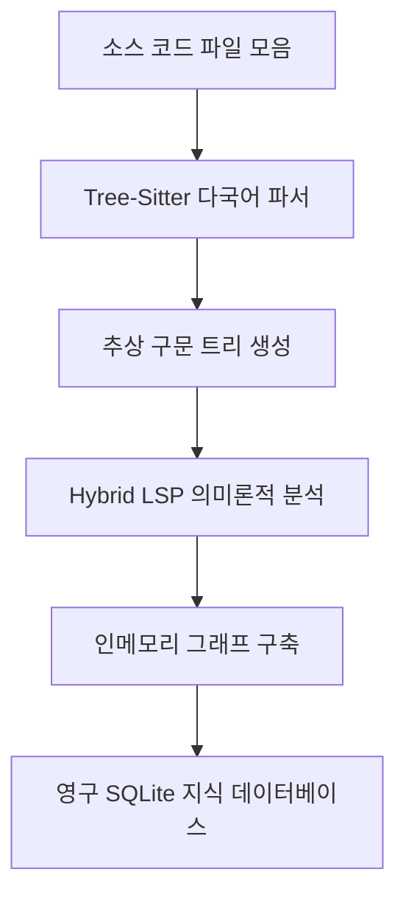
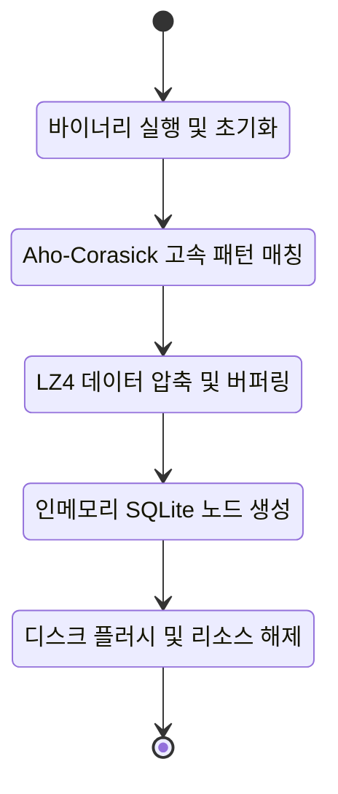
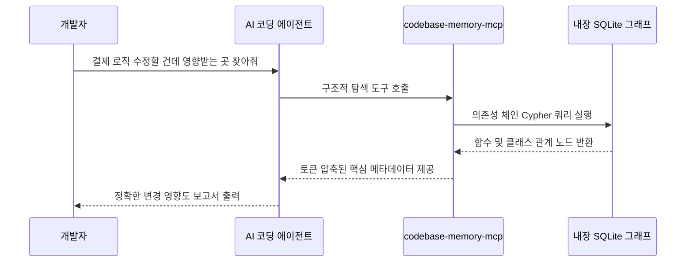

프로젝트 참고 링크 모음
- GitHub 저장소: https://github.com/DeusData/codebase-memory-mcp
- 관련 연구 논문 (arXiv): Codebase-Memory: Tree-Sitter-Based Knowledge Graphs for LLM Code Exploration via MCP (arXiv:2603.27277)
- 공식 문서 및 가이드: 저장소 내 README 및 CLI 도움말 참조

도입: 에이전트는 왜 코드를 읽다가 길을 잃을까요?

최신 AI 코딩 에이전트에게 "주문 처리 로직을 수정하면 어디가 망가지는지 확인해 줘"라고 요청해 본 적이 있으신가요? 작은 프로젝트라면 곧바로 정답을 내놓겠지만, 수백 개의 파일이 얽힌 기업용 저장소에서는 이야기가 다릅니다. 에이전트는 곧장 깊은 고민에 빠지고, 작업 창에는 끝없는 파일 검색과 읽기 과정이 스크롤됩니다. 결국 컨텍스트 윈도우(Context Window)가 꽉 차버려서 앞서 읽은 내용을 잊어버리거나, 수만 토큰을 낭비한 채 엉뚱한 대답을 내놓곤 합니다.

이러한 현상의 근본적인 원인은 AI 모델이 코드를 '이해'하는 방식이 아니라 '텍스트로 검색'하는 방식에 의존하기 때문입니다. 파일을 열고, 정규식으로 검색하고, 또 다른 파일을 여는 비효율적인 반복 작업은 개발자의 API 비용을 폭발적으로 증가시키고 에이전트의 추론 능력을 떨어뜨립니다. 

이 문제를 근본적으로 해결하기 위해 등장한 도구가 바로 DeusData에서 개발한 'codebase-memory-mcp'입니다. 한 마디로 요약하자면 다음과 같습니다.

첫째, 코드베이스 전체를 텍스트가 아닌 연결된 지식 그래프(Knowledge Graph)로 변환합니다.
둘째, AI 에이전트가 파일을 읽는 대신 이 그래프에 구조적 쿼리를 던지게 만들어 토큰 사용량을 최대 99퍼센트까지 줄입니다.
셋째, 순수 C 언어로 작성된 단일 바이너리로 구동되어 2,800만 줄의 리눅스 커널도 단 3분 만에 인덱싱하는 압도적인 속도를 자랑합니다.

배경과 문제 정의: 무한 텍스트 검색의 늪

현재 대부분의 AI 코딩 보조 도구(Claude Code, Cursor, Codex 등)는 코드를 탐색할 때 다음과 같은 단계를 거칩니다.

먼저 저장소 내의 파일 목록을 요청합니다. 그다음 특정 키워드나 함수 이름으로 grep(문자열 검색)을 수행합니다. 매칭된 파일이 나오면 그 파일의 내용을 통째로 읽어 들여 컨텍스트에 추가합니다. 만약 그 함수가 다른 모듈의 클래스를 상속받고 있다면, 다시 그 클래스 이름을 검색하고 파일을 여는 과정을 반복합니다. 

이른바 '검색-읽기-검색'의 굴레입니다. 이 방식에는 세 가지 치명적인 고통(Pain Point)이 따릅니다.

1. 폭발적인 토큰 낭비: 함수 하나의 호출 위치를 찾기 위해 관련 없는 수천 줄의 파일 내용까지 AI의 입력(Prompt)으로 들어가야 합니다. 이는 막대한 API 비용 청구서로 돌아옵니다.
2. 제한된 시야: 모델의 컨텍스트 윈도우는 무한하지 않습니다. 8K에서 32K 수준의 로컬 모델을 사용할 경우, 파일 서너 개만 읽어도 이전 맥락을 밀어내어 '건망증'에 걸리게 됩니다.
3. 구조적 이해의 부재: 텍스트 매칭은 오탐(False Positive)을 낳습니다. 주석에 적힌 단어나 같은 이름의 다른 스코프 변수까지 모두 긁어오기 때문에, 실제 코드의 실행 흐름이나 의존성 트리를 파악하기 어렵습니다.

이러한 상황에서 개발자들은 AI가 저장소 전체의 구조를 한눈에 파악하고 필요한 논리적 연결선만 쏙쏙 뽑아볼 수 있는 방법을 갈망하게 되었습니다.

핵심 개념 쉽게 이해하기: 손전등과 GPS 지도

codebase-memory-mcp의 핵심 아이디어를 이해하기 위해 일상적인 비유를 들어보겠습니다.

기존의 에이전트가 코드를 탐색하는 방식은 '캄캄한 밤에 손전등 하나만 들고 낯선 도시를 헤매는 것'과 같습니다. 손전등 불빛이 닿는 곳(검색된 파일)만 볼 수 있고, 저 멀리 떨어진 목적지로 가려면 골목마다 멈춰서 표지판을 읽어야 합니다. 당연히 시간이 오래 걸리고 길을 잃기 쉽습니다.

반면 codebase-memory-mcp는 에이전트에게 '도시 전체의 GPS 지도'를 쥐여주는 것과 같습니다. 이 지도는 지식 그래프(Knowledge Graph)라는 형태로 만들어집니다. 지식 그래프란 코드베이스 안의 모든 함수, 클래스, 파일, 심지어 인프라 설정까지 하나의 점(Node)으로 만들고, 이들이 서로 어떻게 호출하고 의존하는지를 선(Edge)으로 연결해 둔 거대한 데이터 구조입니다.

이제 에이전트는 손전등으로 골목을 뒤질 필요가 없습니다. 지도에 대고 "A 지점에서 B 지점으로 가는 가장 빠른 호출 경로를 알려줘"라고 물어보기만 하면, 즉시 군더더기 없는 완벽한 경로 지침을 받을 수 있습니다. 토큰 낭비는 사라지고, 속도는 비약적으로 상승합니다.

작동 원리 심층 해설: 압도적 성능의 비밀

가장 많은 분량을 할애하여 이 기술이 어떻게 마법 같은 성능을 내는지 아키텍처와 내부 동작을 단계별로 파헤쳐 보겠습니다.

1. 전체 데이터 처리 파이프라인

codebase-memory-mcp는 별도의 무거운 런타임 환경 없이 순수 C 언어로 정적 컴파일된 단일 바이너리 파일로 동작합니다. 외부 의존성이 전혀 없기 때문에 설치와 실행이 극도로 빠릅니다. 코드를 읽어 그래프로 만들기까지의 전체 흐름은 아래 다이어그램과 같습니다.



먼저 소스 코드가 입력되면 내장된 Tree-Sitter 파서가 작동합니다. Tree-Sitter는 텍스트를 정규식으로 어림짐작하는 것이 아니라, 컴파일러처럼 코드의 문법 구조를 완벽하게 분석하여 추상 구문 트리(AST)를 만듭니다. codebase-memory-mcp 바이너리 안에는 무려 158개 언어의 문법이 미리 탑재(Vendored)되어 있어, 파이썬이나 자바스크립트는 물론이고 러스트나 C++까지 별도 설치 없이 즉시 파싱합니다.

여기에 그치지 않고 Hybrid LSP(Language Server Protocol) 기반의 타입 분석기가 개입합니다. 변수의 추론된 타입이나 복잡한 객체 지향 구조를 추적하여, 껍데기뿐인 문법 트리에 풍부한 의미(Semantic)를 부여합니다.

2. 초고속 RAM 우선 파이프라인 (메모리 생명주기)

리눅스 커널처럼 7만 5천 개의 파일과 2,800만 줄의 코드로 이루어진 초대형 프로젝트를 3분 만에 인덱싱하려면 특별한 메모리 관리 기법이 필요합니다.

이 프로젝트는 철저한 'RAM 우선(RAM-first)' 철학을 따릅니다. 디스크 I/O 병목을 피하기 위해 모든 초기 작업은 시스템 메모리 위에서 폭발적인 속도로 이루어집니다.



문자열 검색 단계에서는 Aho-Corasick 알고리즘이 융합되어 사용됩니다. 이 알고리즘은 수만 개의 키워드를 단 한 번의 텍스트 스캔으로 모두 찾아내는 다중 패턴 검색의 끝판왕입니다. 수집된 거대한 데이터는 즉시 LZ4 알고리즘으로 압축되어 메모리 점유율을 낮춥니다. 최종적으로 인메모리(In-memory) 상태의 SQLite 데이터베이스에 그래프를 완성한 뒤에야 디스크의 영구 저장소로 안전하게 기록(Flush)하고 메모리를 깔끔하게 비웁니다.

3. 데이터 모델과 그래프 스키마

데이터는 철저하게 그래프 형태로 저장됩니다. 각각의 요소는 어떻게 연결될까요? 개체-관계(ER) 다이어그램으로 살펴보겠습니다.

```mermaid
erDiagram
  FILE ||--o{ MODULE : contains
  MODULE ||--o{ CLASS : defines
  CLASS ||--o{ FUNCTION : encapsulates
  FUNCTION ||--o{ FUNCTION : calls
  RESOURCE ||--o{ MODULE : imported_by

  FUNCTION {
    string name
    string file_path
    int start_line
    int complexity
  }
  CLASS {
    string name
    string inherits
  }
  RESOURCE {
    string kind
    string identifier
  }
```

단순한 애플리케이션 코드뿐만 아니라, 이 시스템은 인프라 코드(Infrastructure-as-Code)까지 노드로 취급합니다. Dockerfile, Kubernetes 매니페스트(Manifest), Kustomize 오버레이 등이 모두 그래프에 편입됩니다. 예를 들어, Kustomize 오버레이는 모듈 노드로 생성되고, 참조하는 리소스에 IMPORTS 선(Edge)을 긋습니다. 에이전트는 백엔드 함수부터 배포되는 쿠버네티스 파드(Pod) 설정까지 끊김 없이 추적할 수 있게 됩니다.

4. MCP 서버와 에이전트의 상호작용 흐름

Anthropic이 주도하는 모델 컨텍스트 프로토콜(MCP)은 AI 모델이 외부 도구나 데이터 소스와 안전하게 통신하는 표준 규격입니다. codebase-memory-mcp는 이 규격을 완벽하게 지원하는 서버로 작동합니다. 사용자가 질문을 던졌을 때 내부적으로 어떤 통신이 일어날까요?



과거처럼 수십 개의 파일을 요청하여 토큰을 낭비하는 대신, 에이전트는 도구 호출(Tool Call) 한 번으로 그래프에 쿼리를 던지고 정제된 노드 관계만 JSON 형태로 돌려받습니다. 에이전트의 사고방식이 '텍스트 스캐닝'에서 '데이터베이스 쿼링'으로 진화하는 순간입니다.

구현 및 사용 디테일: 단축키 하나로 끝나는 설정

가장 놀라운 점 중 하나는 이토록 복잡한 시스템을 설치하고 구동하는 과정이 허무할 정도로 간단하다는 것입니다. 외부 의존성 지옥이나 도커(Docker) 컨테이너 설정, 발급받기 복잡한 API 키 따위는 전혀 필요하지 않습니다.

운영체제에 맞게 아래의 설치 스크립트를 터미널에 복사해 붙여넣기만 하면 끝납니다.

macOS 및 Linux 기반 한 줄 설치:
> curl -fsSL https://raw.githubusercontent.com/DeusData/codebase-memory-mcp/main/install.sh | bash

윈도우(Windows) 사용자는 PowerShell을 이용해 손쉽게 설치 스크립트를 다운로드하고 실행할 수 있습니다.

설치 스크립트는 단순히 바이너리를 다운로드하는 데 그치지 않습니다. 시스템에 설치된 11개의 유명 AI 코딩 에이전트(Claude Code, Codex CLI, Gemini CLI, Zed, Cursor 계열 도구 등)를 자동으로 감지합니다. 그리고 각 에이전트의 설정 파일에 MCP 진입점을 등록하고, 에이전트가 이 그래프를 어떻게 활용해야 하는지 알려주는 지침(Instruction)까지 알아서 세팅합니다. 사용자는 에이전트를 재시작하고 "이 프로젝트 인덱싱해 줘(Index this project)"라고 한마디만 건네면 됩니다.

만약 그래프가 어떻게 생겼는지 눈으로 직접 확인하고 싶다면, `--ui` 옵션을 주어 설치해 보세요. 로컬호스트(localhost:9749)에 접속하면 브라우저 안에서 수만 개의 노드가 우주 공간의 은하수처럼 연결된 화려한 대화형 3D 그래프를 탐색할 수 있습니다.

실전 활용 시나리오: 현업 트러블슈팅

codebase-memory-mcp가 제공하는 14개의 강력한 MCP 도구를 활용하면, 실제 현업에서 마주하는 복잡한 문제를 어떻게 해결할 수 있을까요?

시나리오 1: 데이터베이스 스키마 변경 시 폭발 반경(Blast Radius) 파악
핵심 테이블의 컬럼 이름을 바꾸려 합니다. 기존 방식이라면 프로젝트 전체를 정규식으로 검색하며 혹시 문자열이 일치하는 변수가 있는지 불안감에 떨어야 합니다. 하지만 이제 에이전트에게 지시만 내리면 됩니다. 에이전트는 내장된 `query_graph` 도구를 사용해 Cypher 쿼리(그래프 데이터베이스 전용 쿼리 언어)를 실행합니다.

코드 예시(에이전트가 내부적으로 생성하는 쿼리):
MATCH (f:Function)-[:CALLS*1..3]->(db:Resource {name: 'UserRepository'})
RETURN f.name, f.file_path

이 쿼리 한 방으로 데이터베이스 리포지토리를 호출하는 모든 서비스 계층과 컨트롤러 함수가 단 1밀리초 만에 튀어나옵니다.

시나리오 2: 마이크로서비스 간의 숨겨진 HTTP 통신 추적
대규모 백엔드 환경에서는 A 서비스가 B 서비스의 API를 호출하는 구조가 흔합니다. codebase-memory-mcp는 소스 코드 내의 라우팅 설정과 HTTP 클라이언트 호출을 인식하여 '크로스 서비스 링크(Cross-service linking)' 엣지를 생성합니다. 에이전트는 프로젝트 경계를 넘어 요청이 어떤 컨트롤러로 흘러가는지 정확하게 짚어냅니다.

시나리오 3: 아키텍처 결정 기록(ADR) 관리
이 시스템은 단순히 코드를 읽는 데 그치지 않고, `manage_adr` 도구를 통해 아키텍처 설계 결정 사항을 CRUD(생성, 읽기, 수정, 삭제) 방식으로 관리합니다. "왜 여기서 레디스(Redis) 대신 카프카(Kafka)를 썼어?"라는 질문에 에이전트는 이전 세션에서 저장해둔 ADR 노드를 즉시 꺼내어 배경을 설명해 줍니다. 휘발되기 쉬운 설계의 맥락이 그래프 안에 영구적으로 박제되는 것입니다.

벤치마크 및 비교: 수치로 증명하는 혁신

그렇다면 이 지식 그래프 방식이 기존의 파일 읽기 방식보다 얼마나 더 효율적일까요? 논문(arXiv:2603.27277)에서 31개의 실제 프로젝트를 대상으로 진행한 평가 결과를 표로 정리했습니다.

| 비교 항목 | 기존 방식 (파일 하나씩 열어보기) | codebase-memory-mcp (그래프 쿼리) | 개선 효과 |
| :--- | :--- | :--- | :--- |
| **테스트 질문당 평균 토큰 소모** | 약 412,000 토큰 | 약 3,400 토큰 | **약 120배 감소 (99% 절감)** |
| **에이전트의 도구 호출 횟수** | 수십 회 이상 반복 | 평균 2.1배 더 적은 호출 | **네트워크 지연 및 비용 대폭 감소** |
| **리눅스 커널(28M 줄) 처리 시간** | 사실상 불가능 (메모리 초과) | 약 3분 | **초대형 모노레포 지원** |
| **응답 정확도(Answer Quality)** | 92% | 83% | 구조 파악에 집중하여 약간의 정밀도 타협 |

표에서 볼 수 있듯, 5개의 구조적 질문을 해결하는 과정에서 기존 에이전트는 무려 41만 2천 개의 토큰을 태워버렸습니다. 반면 그래프 쿼리를 이용한 에이전트는 고작 3천 4백 토큰만으로 임무를 완수했습니다. 이는 오픈소스 로컬 모델이나 API 예산이 제한된 스타트업에게 가뭄에 단비 같은 성능 향상입니다.

솔직한 평가: 한계와 트레이드오프

모든 기술이 완벽할 수는 없습니다. codebase-memory-mcp 역시 확실한 장점만큼 명확한 한계와 적합하지 않은 상황이 존재합니다.

가장 큰 트레이드오프는 '미세한 정확도의 타협'입니다. 위의 벤치마크 표에서 보듯, 파일을 무식하게 끝까지 다 읽어보는 방식(92%)에 비해 그래프 요약본에 의존하는 방식(83%)은 디테일한 비즈니스 로직의 맥락을 가끔 놓칠 수 있습니다. 큰 숲의 지도를 얻는 대신, 나무껍질의 세밀한 질감은 포기하는 셈입니다. 이 도구는 '구조와 의존성'을 파악하는 백엔드이지, 코드의 문학적 뉘앙스를 평가하는 챗봇이 아니기 때문입니다.

또한 이런 분들에게는 권장하지 않습니다.
- 단일 스크립트 위주 사용자: 파일 1~2개짜리 간단한 파이썬 스크립트나 코딩 테스트 문제를 푼다면, 굳이 그래프 인덱싱을 거칠 필요가 없습니다. 그냥 전체 복사-붙여넣기가 빠릅니다.
- 동적 타입이 남발된 스파게티 코드: 하이브리드 LSP가 타입 추론을 돕긴 하지만, 타입 힌트가 전혀 없고 런타임에 동적으로 속성이 주입되는 극단적인 자바스크립트 레거시 코드에서는 엣지(Edge) 연결이 불완전할 수 있습니다.

하지만 이 도구의 진가는 수십 개의 패키지가 얽혀 있는 엔터프라이즈 모노레포(Monorepo)에서 빛을 발합니다. "이 함수가 어디서 쓰이는가?"라는 지루한 질문에 대한 대답을 찾느라 에이전트가 헛바퀴를 도는 현상을 겪고 있다면, 이 도구를 설치하는 것은 부작용 없이 레버리지를 극대화하는 최고의 선택입니다. 마음에 들지 않는다면 `codebase-memory-mcp uninstall` 명령어 하나로 시스템 파일 건드림 없이 깔끔하게 원상 복구할 수 있습니다.

마무리: 생태계에 미칠 영향과 코드 탐색의 미래

AI 코딩 보조 도구의 발전 방향은 명확합니다. '코드를 텍스트 산문처럼 읽는 시대'에서 '코드를 데이터베이스처럼 쿼리하는 시대'로 넘어가고 있습니다. codebase-memory-mcp는 그 과도기를 이끄는 가장 빠르고 가벼운 징검다리입니다.

특히 오픈소스 개발자 도구 시장에서 골칫거리로 떠오른 보안 문제(Supply-chain trust)를 해결하려는 노력이 돋보입니다. 바이러스토탈(VirusTotal) 70개 이상의 백신 엔진 스캔, SLSA 레벨 3 빌드 출처 증명, Cosign 서명 검증까지 산업 표준 이상의 엄격한 무결성 검증을 거친 후 단일 C 바이너리로 배포됩니다. 당신의 민감한 기업 코드는 단 한 줄도 외부 서버로 전송되지 않고 로컬에서만 처리됩니다.

매번 똑같은 코드를 읽느라 시간과 돈을 낭비하는 AI 에이전트가 답답하셨나요? 지금 터미널을 열고 158개 언어를 지원하는 이 강력한 지식 그래프 엔진을 설치해 보세요. 에이전트의 시야가 좁은 골목길에서 탁 트인 상공으로 넓어지는 놀라운 경험을 하게 될 것입니다.

## References
- https://github.com/DeusData/codebase-memory-mcp
- https://arxiv.org/abs/2603.27277
- https://vertexaisearch.cloud.google.com/grounding-api-redirect/AUZIYQEsltaPRj5m5rEeXT_xdakcovlR863ePqNeq-Qk3bPw48ZQWaPjZNRJdIPzMuS-6WoKRrpGHsT5hjRgToY1d-8n0GjMDDtfb6pZYmnehwQEYNFf7TRfiJqVjrkRZEc7-UQkDGdEpw==
- https://vertexaisearch.cloud.google.com/grounding-api-redirect/AUZIYQGmfSY0ZLGmQt-w2dxgsO-QE2Kuy3QUMNvr4eABEHx8YKz8j0VDBdG6Lx1UlDLOfbstZdhD5RLPErlf0etJQZcBy3vixVjdZ4Esi9JkiiDhmwEU2h82AbViCj_KfojgLnfPydBjBQ==
- https://vertexaisearch.cloud.google.com/grounding-api-redirect/AUZIYQG9ukrYuoiLbGgfedbRuW8PX77BaahARfBGFGQgb48461fEnS6xfyv16uKQxI_2pNWjRKxn6eJkMXkiZgZT4Xt9wPik-iHRLscjbMJxznCZL0IRSO9ENtUh-fJnsPLpYf9OluC8pwLjuTSbAa-5LoiMHO4CR9taIZi6NBI4na7Zv3sPJv2i1wLO1QTKsJUMLXcGT5qw1_rF5GOOQC0HK0mUh0oe
- https://vertexaisearch.cloud.google.com/grounding-api-redirect/AUZIYQHrZpNpIkTUI7sgE0dkjqwvJ9rAzMV7wtpkb8ZmXDt7yDPKZTIk_Swu5AHSrxBvgcUIrMEIycn5bKTD9XpTH0JCfkgLACNLv1W7BitDZXjq1gSw5k2MRF0PvbA5hUmXbYVzjdw4vEed9N0aKt3cwr-K81an2-Ix1nmZ232_yPvowGkQ
- https://vertexaisearch.cloud.google.com/grounding-api-redirect/AUZIYQFDOyoAct8LH9RJVMnayU36e2NaJtwfyzJVm5HDgBbVVLo-tv0O_FO_GUciCGyfhDdGSkBOKNgTBtN-l2s0V-pBQa3ePsZxabWr637gxXiwFT7bUy43MQkS9A==
