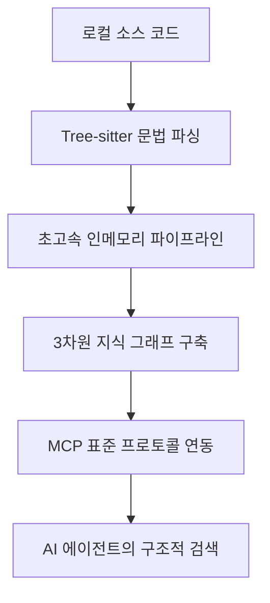
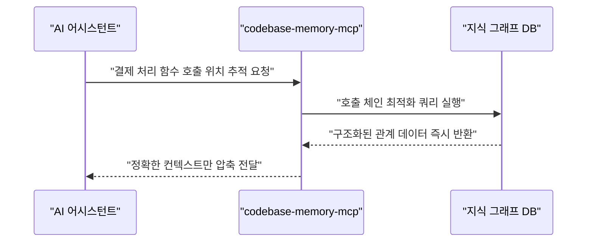

**[관련 링크]**
- GitHub 저장소: https://github.com/DeusData/codebase-memory-mcp
- 관련 논문: Codebase-Memory (arXiv:2603.27277)

### 🔥 AI 코딩 어시스턴트, 왜 큰 프로젝트에서는 버벅거릴까요?

최근 AI 코딩 에이전트(Claude Code, Cursor 등)를 쓰면서 "왜 이렇게 엉뚱한 대답을 하지?" 혹은 "컨텍스트 제한을 초과했습니다"라는 에러를 본 적 있나요? 프로젝트 규모가 커질수록 AI는 코드를 파악하다가 쉽게 지쳐버립니다. 이 문제를 근본적으로 해결하기 위해 등장한 혁신적인 오픈소스가 바로 **codebase-memory-mcp**입니다. 한 마디로, AI가 코드를 무식하게 전부 읽지 않고 '데이터베이스처럼 검색'하게 만들어주는 똑똑한 지도 역할을 합니다.

### 💡 일상 비유로 이해하는 핵심: 간판 읽기 vs 구글 맵

기존의 AI 에이전트는 코드를 분석할 때 마치 **'처음 간 도시에서 길을 찾기 위해 모든 골목의 간판을 하나씩 읽어보는 사람'**과 같았어요. 특정 함수가 어디서 쓰이는지 알기 위해 단어를 검색(grep)하고, 매칭된 파일을 통째로 열어서 읽고, 또 다른 파일을 검색하는 과정을 반복하죠.

이 방식은 엄청난 낭비입니다. 모델의 귀중한 토큰(단어를 처리하는 단위)을 쓸데없이 소모하게 만들거든요. 반면 codebase-memory-mcp는 다릅니다. 코드베이스 전체를 **지식 그래프(코드의 함수, 클래스, API 등이 서로 어떻게 연결되어 있는지 보여주는 구조적 지도)**로 변환합니다. 길을 헤매는 대신 처음부터 '구글 맵'을 켜고 최단 경로만 쏙쏙 찾아내는 것과 같습니다.

### 🛠️ 작동 원리 (Under the Hood)

이 도구가 어떻게 그 놀라운 효율을 내는지 데이터 흐름을 살펴볼까요?

1. **초고속 구문 분석**: 저장소를 연결하면 `Tree-sitter`(다양한 프로그래밍 언어의 문법을 분석하는 고속 파서)를 이용해 코드를 읽어냅니다. 158개 언어를 지원하며, 무려 2800만 줄의 리눅스 커널조차 3분 만에 분석해 냅니다.
2. **지식 그래프 생성**: 함수나 클래스 같은 요소를 노드(점)로 만들고, 이들이 서로 의존하는 관계를 엣지(선)로 연결해 지식 그래프를 완성합니다.
3. **MCP를 통한 연동**: 이렇게 만든 지도는 **MCP(Model Context Protocol, AI 모델이 외부 도구를 쉽게 사용할 수 있게 해주는 개방형 표준)**를 통해 외부 통신 없이 로컬 환경에서 에이전트에 즉시 제공됩니다.

**[표: 기존 코드 탐색과 지식 그래프 탐색 비교]**

| 비교 항목 | 기존 파일 단위 탐색 (Grep) | codebase-memory-mcp |
| --- | --- | --- |
| **작동 방식** | 키워드 검색 후 전체 파일 반복 읽기 | 지식 그래프 노드 및 관계 즉시 쿼리 |
| **평균 토큰 소모량** | 약 412,000 토큰 | **약 3,400 토큰 (최대 99% 절감)** |
| **처리 속도** | 파일을 열고 읽을 때마다 지연 발생 | 대부분 1밀리초 이내 초고속 응답 |
| **설치 및 구동** | 에이전트별 복잡한 스크립트 작성 | 단일 C 바이너리 파일로 즉시 실행 |

위 표의 수치는 논문 벤치마크 테스트의 실제 결과입니다. 에이전트가 코드를 산문처럼 처음부터 끝까지 읽는 대신, 그래프에 구조적 쿼리를 날려 필요한 답변만 받아오기 때문에 토큰 사용량이 120배 이상 줄어들었습니다.

### 🚀 실전 활용 (Use Cases)

현업에서 이 기술이 어떻게 빛을 발하는지 시각화와 함께 알아볼게요.

**🎯 시나리오 1: 복잡한 호출 추적(Trace Call Paths)**
"이 핵심 결제 로직을 수정하면 어디까지 영향이 갈까?" 기존 AI는 이 질문에 답하기 위해 수십 개의 관련 파일을 뒤져야 했습니다. 하지만 이제 AI는 지식 그래프에 단 한 번의 구조적 쿼리를 날립니다. 컨텍스트 낭비 없이 정확한 영향 범위를 단숨에 파악하고 부작용을 경고해 줍니다.

**🎯 시나리오 2: 인프라 및 마이크로서비스 분석**
단순한 애플리케이션 코드를 넘어 Dockerfile이나 쿠버네티스 매니페스트까지 노드로 연결해 줍니다. 마이크로서비스 간의 HTTP 라우팅이나 API 엔드포인트 변경 시, 코드가 아닌 전체 시스템 아키텍처 관점에서 끊어진 링크를 찾아내고 안전한 수정안을 제시합니다.

### ⚖️ 솔직한 평가 (Trade-offs): 만능 열쇠일까요?

모든 기술이 그렇듯, 정직하게 트레이드오프(하나를 얻으면 하나를 잃는 관계)를 짚고 넘어가야 합니다.

**[표: codebase-memory-mcp의 득과 실]**

| 압도적 강점 (Pros) | 솔직한 한계 (Cons) |
| --- | --- |
| **비용 절감** (토큰과 API 호출 10배 이상 감소) | 코드의 아주 미세한 비즈니스 로직(뉘앙스) 파악 약화 |
| **극강의 속도** (단일 바이너리로 밀리초 단위 검색) | 전체 파일을 모두 읽을 때보다 답변 정확도 소폭 하락 |
| **보안성** (코드가 로컬 밖으로 유출되지 않음) | 그래프 기반 사고에 적응하지 못한 에이전트의 한계 |

벤치마크에 따르면 구조를 파악하는 속도와 효율은 천재적이지만, 답변의 절대적인 정답률은 전체 파일을 다 읽는 방식(92%)에 비해 약간 낮은 83%를 기록했습니다. 파일 안에 텍스트로만 숨겨진 독특한 비즈니스 로직의 '뉘앙스'를 놓칠 수 있기 때문입니다. 따라서 큰 숲의 구조를 볼 때는 이 도구를 쓰고, 특정 로직 하나를 깊게 파고들 때는 파일을 직접 열어보게 하는 하이브리드 전략이 가장 효과적입니다.

### 맺음말: 코드를 읽는 시대에서 쿼리하는 시대로

codebase-memory-mcp는 AI 개발 생태계에 중요한 화두를 던졌습니다. "AI가 사람처럼 코드를 줄줄이 읽어야 할까?"라는 질문에, "아니, AI에게는 기계에 맞는 전용 데이터 지도가 필요하다"라고 답한 것이죠. 로컬에서 가볍게 돌아가며 외부로 코드를 유출하지도 않아 기업 환경에서도 안성맞춤입니다. 지금 반복되는 파일 탐색으로 AI의 답변이 느려지고 지갑이 얇아지고 있다면, 이 강력한 지식 그래프 엔진을 당신의 에이전트에 당장 쥐여주세요.

## References
- https://github.com/DeusData/codebase-memory-mcp
- https://arxiv.org/abs/2603.27277
