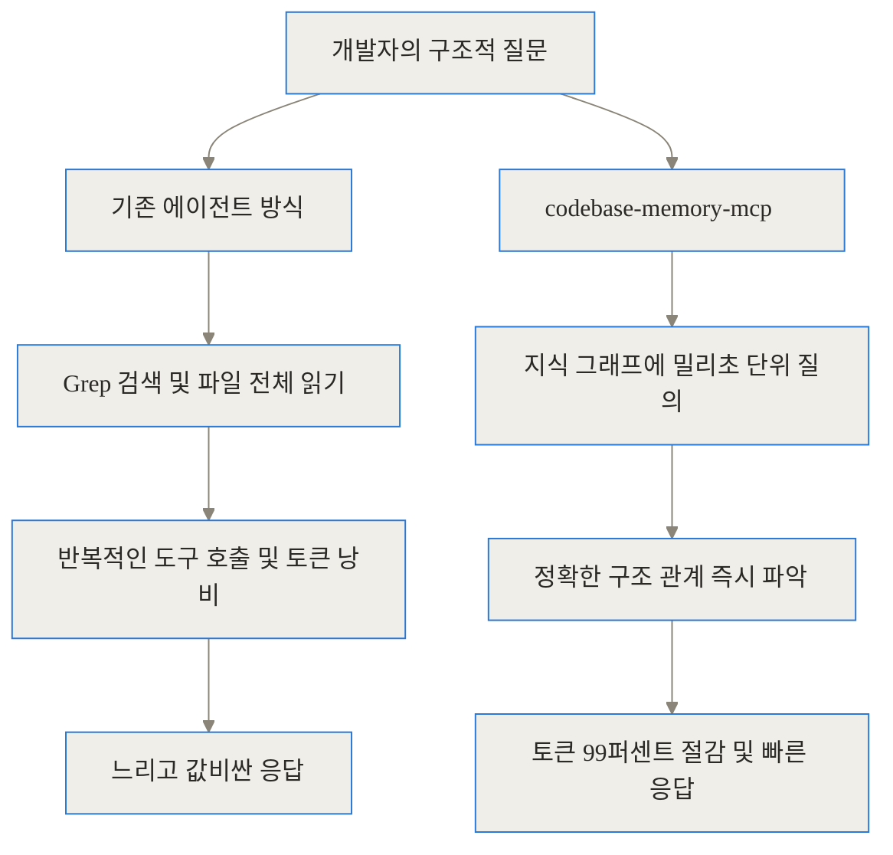
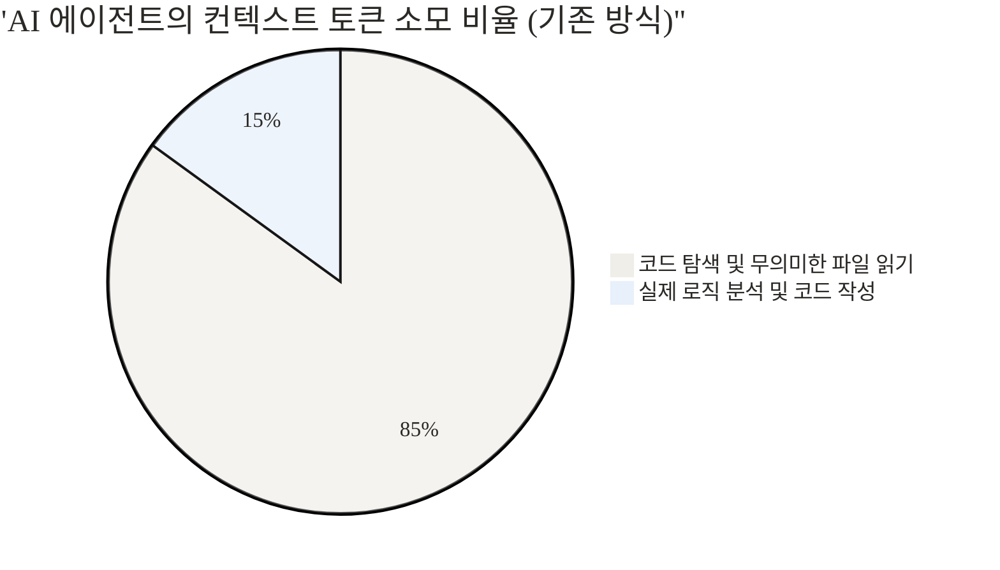
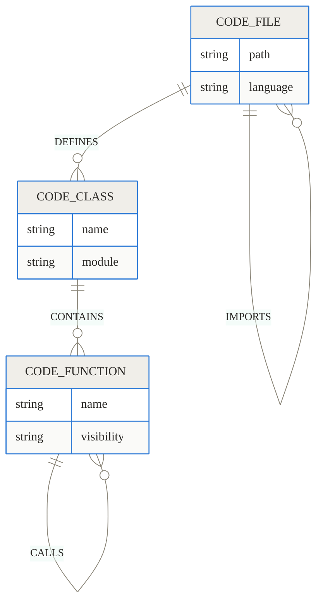
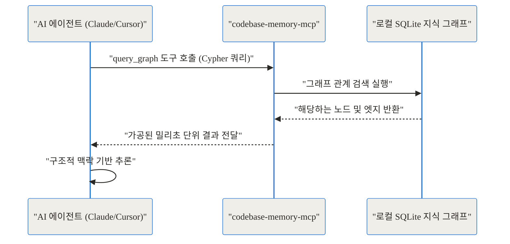
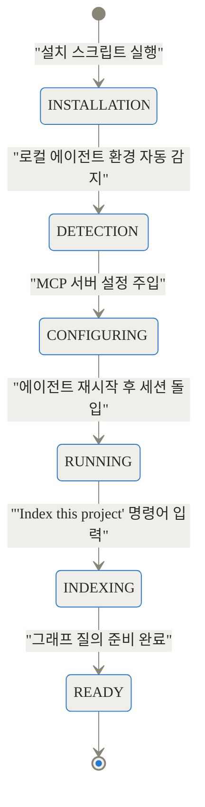
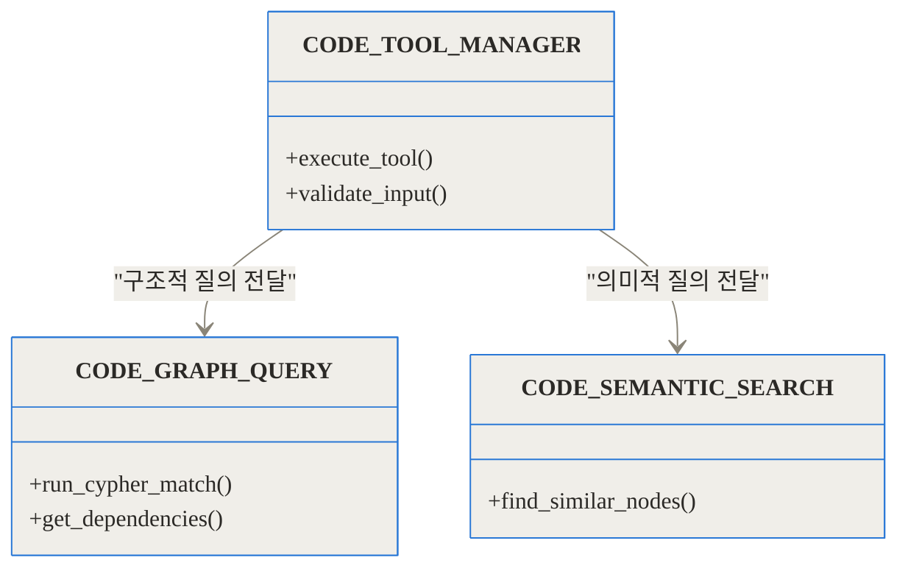

TL;DR
- codebase-memory-mcp는 코드베이스 전체를 관계형 지식 그래프로 변환해 AI 에이전트에게 제공하는 강력한 로컬 도구입니다.
- 에이전트가 파일을 하나씩 읽는 과정(Grep)을 구조적 질의로 대체하여 컨텍스트 토큰 사용량을 최대 99퍼센트까지 극적으로 절감합니다.
- 외부 의존성이나 API 키 없이 단일 C 언어 정적 바이너리로 동작하며, 158개 언어를 지원하고 Linux 커널을 3분 만에 인덱싱하는 압도적 속도를 자랑합니다.

## 관련 링크
- [GitHub 저장소: DeusData/codebase-memory-mcp](https://github.com/DeusData/codebase-memory-mcp)
- [arXiv 연구 논문: Codebase-Memory](https://arxiv.org/abs/2603.27277)
- [공식 문서 페이지](https://deusdata.github.io/codebase-memory-mcp/)

## 도입: AI 코딩 에이전트는 왜 그렇게 많은 토큰을 낭비할까?

AI 코딩 에이전트에게 "이 함수를 수정하면 어디가 깨지나요?" 혹은 "사용자 인증 처리 흐름을 알려주세요"라고 질문해 본 적이 있으신가요? 작은 토이 프로젝트에서는 훌륭한 답변을 내놓지만, 실무의 거대한 프로젝트에 도입하는 순간 에이전트는 깊은 수렁에 빠집니다. 에이전트는 함수 이름을 찾기 위해 전체 저장소를 검색(Grep)하고, 매칭된 파일을 하나씩 열어 처음부터 끝까지 읽습니다. 그리고 거기서 발견된 또 다른 함수를 찾기 위해 다시 검색과 읽기를 반복합니다.

이 과정은 마치 도서관에서 특정 주제의 책을 찾기 위해 모든 책장의 책을 꺼내어 첫 페이지부터 읽어보는 것과 같습니다. 이러한 단순 텍스트 기반 탐색은 답 하나를 얻기까지 수십 번의 도구 호출을 유발하며, 그 과정에서 엄청난 양의 컨텍스트 토큰이 소모됩니다. 최신 AI 모델들은 컨텍스트 윈도우가 길어지면 집중력을 잃거나(Lost in the middle 현상) 환각을 일으키기 쉽습니다. 결과적으로 개발자는 긴 대기 시간과 막대한 API 비용 청구서를 마주하게 됩니다.



이러한 문제를 해결하기 위해 등장한 것이 바로 **codebase-memory-mcp**입니다. 이 프로젝트는 코드를 단순한 텍스트 덩어리가 아니라, 함수와 클래스가 서로 유기적으로 얽힌 **지식 그래프(Knowledge Graph)**로 바라봅니다.

## codebase-memory-mcp란 무엇인가?

codebase-memory-mcp는 오픈 소스 기반의 **모델 컨텍스트 프로토콜(MCP, Model Context Protocol)** 서버입니다. AI 에이전트(Claude Code, Cursor, Zed 등)가 코드를 무식하게 읽어내려가는 대신, 사전에 구조화된 데이터베이스에 직접 SQL을 날리듯 질문할 수 있게 만들어주는 강력한 백엔드 엔진입니다.

이 도구의 철학은 명확합니다. LLM(대형 언어 모델)은 비정형 텍스트를 다루는 데는 탁월하지만, 코드가 가진 본질적인 '구조적 관계(호출 사슬, 의존성, 모듈 경계)'를 파악하는 데는 비효율적입니다. 따라서 코드의 뼈대를 지식 그래프라는 형태로 미리 발라내어 에이전트에게 쥐어주자는 것입니다. 이것은 비유하자면 눈을 가리고 벽을 더듬어 길을 찾는 에이전트에게 **정밀한 3D 아키텍처 지도**를 건네주는 것과 같습니다.



## 핵심 작동 원리 심층 해부 (Under the Hood)

어떻게 텍스트에 불과한 소스 코드가 지능적인 그래프로 변환되는지, 그 내부 아키텍처를 단계별로 살펴보겠습니다.

### 1단계: 다국어 파싱과 하이브리드 타입 추론
가장 먼저, 코드를 정확하게 읽어내야 합니다. codebase-memory-mcp는 158개에 달하는 프로그래밍 언어를 지원하는 **Tree-sitter** 파서를 기반으로 작동합니다. 구문 분석을 통해 단순한 문자열을 AST(추상 구문 트리)로 변환하고, 그 속에서 클래스, 함수, 변수 선언 등을 노드(Node)로 식별합니다.

하지만 구문 분석만으로는 한계가 있습니다. 자바스크립트나 파이썬처럼 동적 타이핑을 사용하는 언어에서는 `user.login()`이라는 코드가 정확히 어느 클래스의 `login` 메서드를 호출하는지 알기 어렵기 때문입니다. 이를 해결하기 위해 내부에 **경량화된 하이브리드 LSP(Language Server Protocol) 해상도 엔진**을 탑재하여, 6가지 전략(6-strategy call resolution)을 통해 모호한 호출 관계를 정확히 찾아냅니다.


### 2단계: 로컬 데이터베이스를 통한 관계 구축
분석이 끝난 요소들은 메모리에서 휘발되지 않고, 로컬 환경의 **SQLite 데이터베이스**에 저장됩니다. 외부 클라우드로 코드를 전송하지 않으므로 철저한 보안이 유지됩니다.

이 데이터베이스 안에서 코드는 다음과 같은 형태의 엔티티(Entity)와 관계(Relationship)로 매핑됩니다.



### 3단계: 커뮤니티 탐지와 아키텍처 식별
단순히 점과 선을 연결하는 데 그치지 않고, **Louvain 커뮤니티 탐지(Community Detection) 알고리즘**을 적용합니다. 이 알고리즘은 촘촘하게 얽힌 함수와 파일 무리를 자동으로 분석하여 "아, 이 부분은 데이터베이스 접근 계층이구나", "여기는 결제 처리 모듈이구나"라고 거시적인 아키텍처 경계를 스스로 찾아냅니다. 에이전트가 단편적인 코드뿐만 아니라 시스템 전체의 그림을 이해할 수 있도록 돕는 핵심 기술입니다.

## 에이전트와 서버의 상호작용 흐름

지식 그래프가 완성되면, AI 코딩 에이전트는 MCP를 통해 서버가 제공하는 14가지의 강력한 도구(Tools)를 사용할 수 있게 됩니다.

가장 대표적인 도구는 다음과 같습니다.
- **`trace_call_path`**: 특정 함수의 호출 사슬을 양방향으로 추적합니다.
- **`query_graph`**: Cypher 질의어(`MATCH (f:Function)-[:CALLS]->(g)`)를 사용해 복잡한 구조적 조건을 한 번에 검색합니다.
- **`semantic_query`**: API 키 없이 로컬 임베딩을 활용해 의미 기반 벡터 검색을 수행합니다.
- **`manage_adr`**: 아키텍처 결정 기록(Architecture Decision Records)을 관리하여 에이전트 세션 간에 설계 철학을 유지합니다.



에이전트 자체에는 내장된 LLM이 존재하지 않으며, 질문을 도구 호출(Tool Call)로 번역하는 역할은 클라이언트(Claude 등)가 온전히 담당합니다. 즉, 기존에 쓰던 똑똑한 AI를 그대로 유지하면서, 그 AI에게 엑스레이 안경을 씌워주는 격입니다.

## 압도적인 성능 벤치마크 및 지표

이론이 훌륭해도 실전에서 느리거나 비용이 크면 의미가 없습니다. codebase-memory-mcp는 외부 종속성이 전혀 없는 **단일 정적 C 언어 바이너리(Single static C binary)**로 컴파일되어 극한의 성능을 뿜어냅니다.

- **인덱싱 속도**: 일반적인 저장소는 눈 깜짝할 새인 수 밀리초에서 수 초 내에 분석을 끝냅니다. 무려 2천8백만 줄, 7만 5천 개의 파일로 이루어진 Linux 커널조차 단 3분이면 인덱싱이 완료됩니다.
- **질의 속도**: 에이전트가 요청하는 대부분의 그래프 질의는 1밀리초(0.001초) 미만의 지연 시간을 갖습니다.
- **토큰 절감 효과**: 5개의 구조적 질의를 연속으로 던지는 실증 테스트에서, 파일 단위 탐색은 412,000 토큰을 소모한 반면, 지식 그래프 질의는 단 3,400 토큰만을 소모하여 **99퍼센트의 절감률**을 달성했습니다.

```chartjs
{
  "type": "bar",
  "data": {
    "labels": ["파일 읽기 탐색 (기존)", "지식 그래프 질의 (코드베이스 메모리)"],
    "datasets": [
      {
        "label": "컨텍스트 토큰 사용량",
        "data": [412000, 3400],
        "backgroundColor": ["#ff6384", "#36a2eb"]
      }
    ]
  },
  "options": {
    "responsive": true,
    "plugins": {
      "title": {
        "display": true,
        "text": "5개 연속 구조적 질의에 대한 토큰 소모량 비교 (단위: 토큰)"
      }
    }
  }
}
```

보안 측면에서도 완벽을 기했습니다. GitHub 릴리스마다 70개 이상의 백신 엔진 검사(VirusTotal)를 거치며, Sigstore cosign 서명과 SLSA Level 3 빌드 검증을 제공하여 로컬 개발 환경의 공급망 공격(Supply Chain Attack) 위험을 원천 차단합니다.

## 설치 및 활용 가이드

복잡한 Docker 환경 설정이나 데이터베이스 설치가 필요 없습니다. 터미널에서 아래의 명령어 한 줄이면 설치가 완료됩니다.

> `curl -fsSL [https://raw.githubusercontent.com/DeusData/codebase-memory-mcp/main/install.sh](https://raw.githubusercontent.com/DeusData/codebase-memory-mcp/main/install.sh) | bash`

이 설치 스크립트는 로컬 환경을 스캔하여 Claude Code, Cursor, Zed, Aider, Codex CLI 등 11개 주요 에이전트를 자동 감지하고, 각각의 환경 설정 파일에 MCP 훅(Hook)을 주입합니다.



에이전트를 재시작한 뒤 채팅창에 **"Index this project"**라고 말하는 것만으로 모든 설정이 끝나며, 이후부터는 AI가 스스로 필요한 그래프 도구를 골라 사용합니다.

## 실전 트러블슈팅 시나리오

이 도구를 실무에 어떻게 적용할 수 있을까요? 현업에서 자주 마주치는 두 가지 시나리오를 살펴보겠습니다.

### 시나리오 1: 영향도 분석과 의존성 추적
거대한 모노레포 환경에서 코어 라이브러리의 `calculateDiscount()` 함수를 수정해야 한다고 가정해 보겠습니다. 이 함수가 어디서 쓰이는지 모르는 상태에서 기존 에이전트에게 수정을 지시하면, 에이전트는 무작위로 파일을 뒤지다 컨텍스트 제한에 걸려 중단되기 십상입니다.
그러나 codebase-memory-mcp가 적용된 에이전트는 즉시 `trace_call_path` 도구를 호출합니다. 수 밀리초 만에 이 함수를 호출하는 결제 모듈과, 그 모듈을 다시 호출하는 백엔드 API 엔드포인트까지의 트리 구조를 반환받습니다. 에이전트는 토큰을 거의 소모하지 않고 정확히 어떤 파일을 수정해야 할지 파악하게 됩니다.

### 시나리오 2: 거대한 낯선 프로젝트 온보딩
새로운 부서에 배치받아 수백 개의 파일로 이루어진 레거시 시스템을 인수인계받았습니다. 문서도 없는 상황에서 에이전트에게 "이 서비스의 전체 아키텍처를 설명해 줘"라고 요청합니다. 서버는 앞서 언급한 Louvain 커뮤니티 탐지 알고리즘 결과를 바탕으로, 파일들이 어떤 논리적 그룹(예: '인증 파트', '데이터베이스 파트')으로 묶여 있는지 깔끔하게 구조화하여 브리핑해 줍니다.

## 기존 RAG 방식과의 비교 및 트레이드오프

코드베이스를 분석하기 위해 흔히 쓰이는 또 다른 기술은 벡터 임베딩을 활용한 RAG(검색 증강 생성)입니다. 두 방식은 해결하려는 문제의 결이 다릅니다.

| 비교 항목 | 벡터 임베딩 RAG (의미적 검색) | codebase-memory-mcp (구조적 지식 그래프) |
|---|---|---|
| **핵심 원리** | 텍스트의 의미적 유사도를 벡터로 변환해 거리 계산 | 코드의 구문 트리와 참조 관계를 노드와 엣지로 명시적 연결 |
| **강점을 보이는 질문** | "이메일을 발송하는 로직이 어디 있지?" (개념적 질문) | "이 인터페이스를 구현하는 모든 클래스를 찾아줘" (구조적 질문) |
| **취약점** | 정확한 호출 체인이나 뎁스(Depth)가 깊은 의존성 추적 불가 | 변수명이나 주석의 의미론적 의도만으로 검색할 때 보완 필요 |
| **데이터베이스 형태** | Vector DB (Pinecone, Milvus 등) | Relational / Graph DB (로컬 SQLite) |

## 한계점과 솔직한 평가

이 도구가 무결점의 마법 지팡이는 아닙니다. 시스템 아키텍처 관점에서 냉정하게 짚어봐야 할 트레이드오프(Trade-off)가 존재합니다.

첫째, 약간의 정확도 손실입니다. 연구 논문의 벤치마크에 따르면 31개의 실제 저장소 테스트에서 기존 파일 단위 읽기 방식은 92퍼센트의 정답률을 기록한 반면, 지식 그래프 방식은 83퍼센트의 정답률을 보였습니다. 즉, 토큰을 10분의 1로 줄이고 도구 호출 횟수를 2.1배 단축하는 대신, 파일의 세세한 컨텍스트(주석의 뉘앙스 등)를 일부 놓칠 수 있다는 의미입니다.

둘째, 소규모 프로젝트에서의 효용성입니다. 코드베이스가 아주 작아서 에이전트가 단숨에 전체 파일을 읽을 수 있는 수준이라면, 이 도구를 굳이 설치할 필요가 없을 수도 있습니다. 그래프 검색은 수백 개 이상의 파일이 얽혀 있는 중대형 저장소에서 빛을 발합니다.



## 마무리: 코드 인텔리전스의 새로운 방향성

codebase-memory-mcp는 AI 소프트웨어 엔지니어링 생태계에 중요한 화두를 던집니다. "LLM의 컨텍스트 윈도우가 무한히 늘어나면 모든 문제가 해결될 것인가?"라는 질문에 대해, 이 프로젝트는 단호하게 "아니요"라고 답합니다. 아무리 컨텍스트가 길어져도 의미 없는 텍스트를 산더미처럼 읽히는 것은 비효율과 혼란을 낳을 뿐입니다.

AI 에이전트가 코드를 산문(Prose)처럼 읽는 시대에서, 데이터베이스처럼 구조적으로 질의(Query)하는 시대로 넘어가고 있습니다. 복잡한 코드의 미로 속에서 토큰 낭비로 고통받고 있다면, 에이전트에게 돋보기 대신 정밀한 지도를 건네줄 때입니다.


## 자주 묻는 질문 (FAQ)

### codebase-memory-mcp는 어떤 에디터나 에이전트와 호환되나요?

Claude Code, Cursor, Zed, Aider, Codex CLI 등 모델 컨텍스트 프로토콜(MCP)을 지원하는 11개 이상의 주요 AI 코딩 에이전트와 완벽히 호환됩니다. 제공되는 단일 설치 스크립트가 로컬 환경의 에이전트를 자동으로 감지하여 구성 파일에 MCP 서버를 등록해 줍니다.

### 대규모 프로젝트에서 토큰 절감 효과는 정말로 극적인가요?

네, 매우 극적입니다. 벤치마크 테스트에 따르면 에이전트가 5개의 구조적 질의를 수행할 때 기존 파일 탐색 방식은 약 41만 2천 토큰을 소모했지만, 지식 그래프를 활용하면 3천 4백 토큰만으로 동일한 답을 얻어 99퍼센트의 토큰 절감을 기록했습니다. 프로젝트 규모가 커질수록 절감 효과는 더욱 뚜렷해집니다.

### 코드가 외부 서버나 클라우드로 전송되어 유출될 위험은 없나요?

전혀 없습니다. codebase-memory-mcp는 외부 종속성이 없는 단일 정적 C 바이너리로, 모든 파싱과 지식 그래프 생성(SQLite)이 100퍼센트 사용자의 로컬 환경에서만 수행됩니다. 내장된 LLM이나 외부 API 호출이 없으므로 엔터프라이즈 환경에서도 안전하게 사용할 수 있습니다.

### 기존의 임베딩 기반 RAG(검색 증강 생성) 방식과는 무엇이 다른가요?

RAG는 코드 문맥의 '의미적 유사도'를 바탕으로 검색하기 때문에 기능의 위치를 찾는 데는 뛰어나지만, 누가 누구를 호출하는지와 같은 구조적 관계를 파악하는 데는 취약합니다. 반면 이 도구는 Tree-sitter 기반으로 실제 코드 문법과 호출 사슬을 관계형 그래프로 그리기 때문에 명확하고 논리적인 아키텍처 의존성 추적이 가능합니다.

### 최초에 프로젝트를 인덱싱할 때 시간이 너무 오래 걸리지 않나요?

C 언어 기반의 고도화된 아키텍처 덕분에 처리 속도가 압도적으로 빠릅니다. 평균적인 프로젝트는 밀리초에서 수 초 내에 인덱싱되며, 약 2천8백만 줄에 달하는 Linux 커널 전체를 분석하는 가혹한 테스트 환경에서도 단 3분밖에 소요되지 않았습니다.


## References
- [https://github.com/DeusData/codebase-memory-mcp](https://github.com/DeusData/codebase-memory-mcp)
- [https://deusdata.github.io/codebase-memory-mcp/](https://deusdata.github.io/codebase-memory-mcp/)
- [https://arxiv.org/abs/2603.27277](https://arxiv.org/abs/2603.27277)
