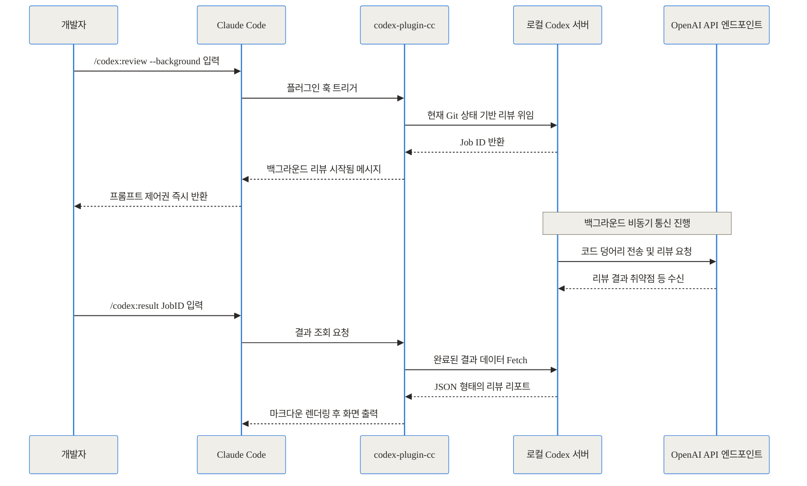
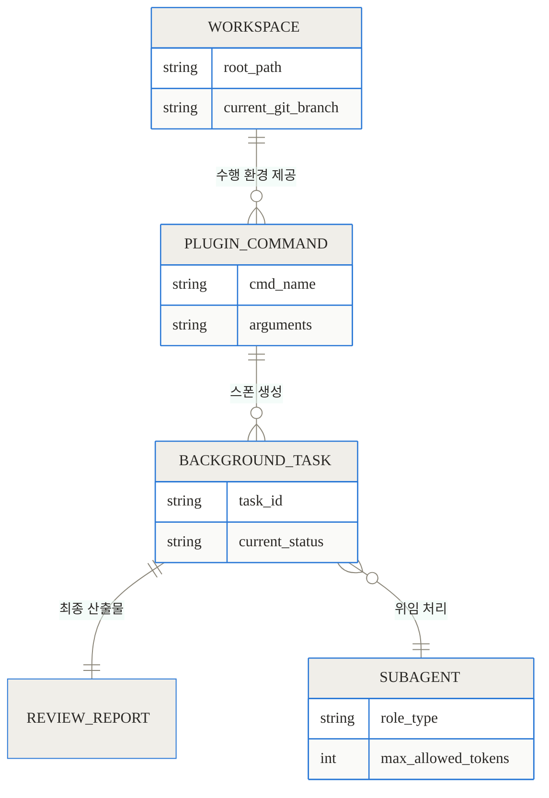
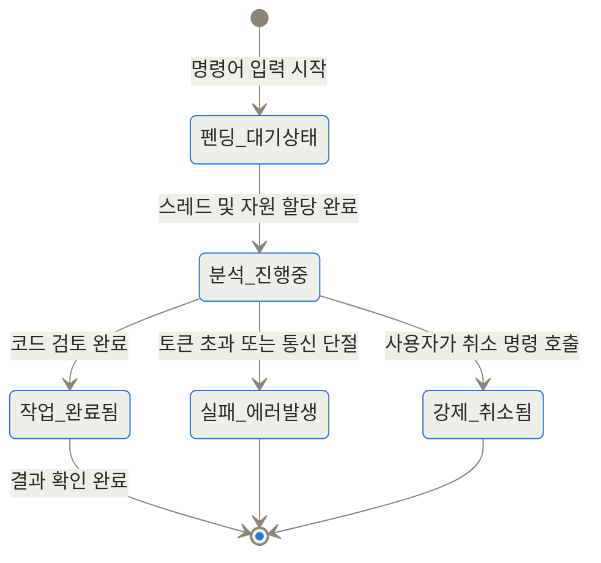
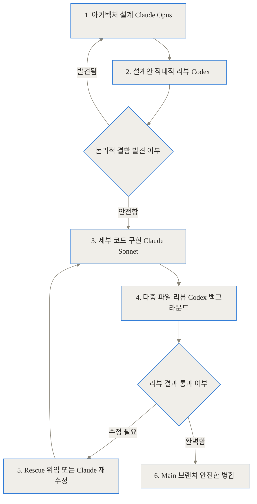
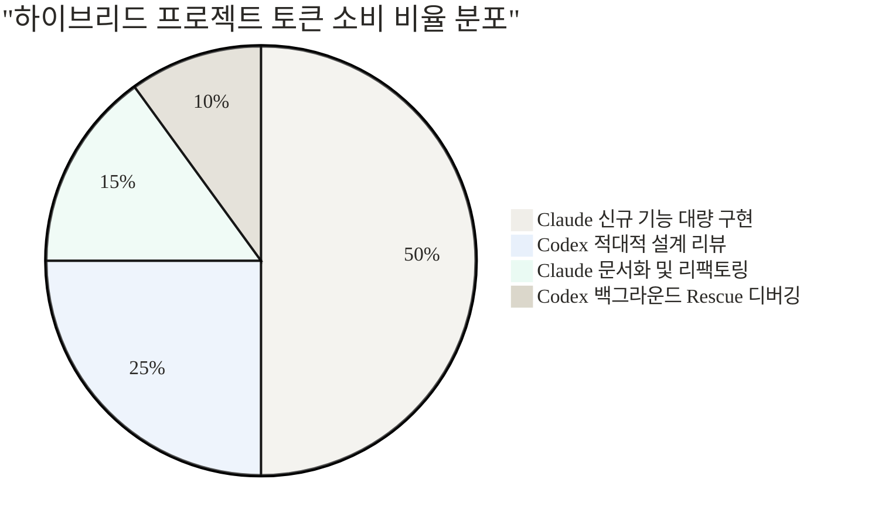
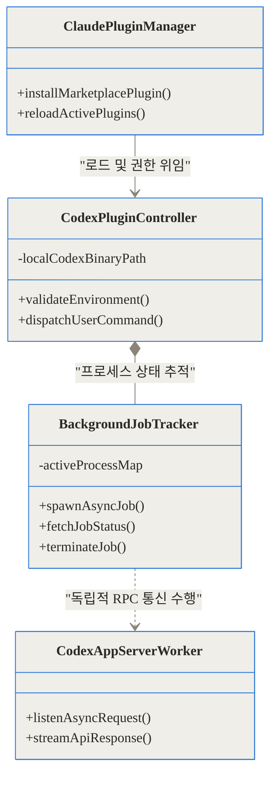

## 들어가며: 개발자의 새로운 고민, 누가 AI의 코드를 리뷰할 것인가?

최근 AI 코딩 에이전트의 발전 속도는 경이롭습니다. 하지만 현업에서 AI 도구를 적극적으로 도입한 개발자들은 곧 새로운 벽에 부딪힙니다. "내가 짠 코드를 내가 리뷰하면 같은 맹점에 빠진다"는 인간의 인지적 오류가 AI에게도 그대로 적용된다는 사실이죠. Claude가 짠 코드를 Claude에게 다시 검토하라고 하면, 자신의 초기 논리적 비약을 정당화하거나 놓친 예외 처리를 끝까지 발견하지 못하는 경우가 잦습니다.

이 문제를 해결하기 위해 2026년 3월 말, OpenAI는 매우 흥미롭고 파격적인 도구를 공식 출시했습니다. 바로 Anthropic의 에디터 환경인 Claude Code 안에서 자사의 Codex를 직접 호출할 수 있게 만든 플러그인, **`openai/codex-plugin-cc`**입니다. 경쟁사의 안방에 자신의 뛰어난 리뷰어를 파견한 셈입니다.

> **TL;DR (이 글의 핵심 요약)**
> 1. **정체**: `codex-plugin-cc`에서 'cc'는 C++ 컴파일러가 아니라 **Claude Code**를 의미하며, Claude 환경 내에서 OpenAI Codex를 슬래시 명령어로 직접 호출하는 공식 플러그인입니다.
> 2. **해결하는 문제**: 코드는 Claude가 작성하고, 아키텍처 리뷰와 까다로운 디버깅은 Codex가 교차 검증하는 '멀티 에이전트 하이브리드 워크플로우'를 터미널 전환 없이 완벽하게 지원합니다.
> 3. **주요 가치**: `/codex:adversarial-review`와 비동기 백그라운드 위임 기능을 통해 개발자의 컨텍스트 스위칭 시간을 없애고 맹목적인 AI 코드 수용으로 인한 런타임 장애를 사전에 차단합니다.

---

## 1. 배경과 문제 정의: 왜 하이브리드 워크플로우가 필요해졌을까?

### 오해 바로잡기: C++ 컴파일러 플러그인인가요?

기술 커뮤니티나 검색 포털에서 "openai codex-plugin-cc C++ compiler AI plugin"이라는 검색어가 자주 등장하더라고요. 아마도 유닉스/리눅스 환경의 전통적인 C컴파일러 명령어인 `cc`와 혼동한 결과일 것입니다. 하지만 여기서 `cc`는 명백히 **Claude Code**의 약자입니다. 물론 C++ 코드를 작성하고 리뷰하는 데도 탁월하게 작동하지만, 특정 언어의 컴파일러에 종속된 도구가 아니라 에디터 환경을 통합하는 **플랫폼 연동 플러그인**이라는 점을 먼저 명확히 짚고 넘어갑니다.

### 단일 모델 의존이 낳는 치명적인 병목

Claude Code는 매우 훌륭한 자율 코딩 에이전트입니다. 디렉토리를 탐색하고, 파일을 읽고, 수정 사항을 적용하는 데 탁월하죠. 하지만 개발자 커뮤니티에서는 일명 '추론 누락(Reasoning Skip)' 현상과 컨텍스트 오염 문제가 꾸준히 보고되어 왔습니다. 복잡한 시스템 아키텍처를 설계하거나, 여러 파일에 걸친 동시성 처리 로직을 구현할 때 한 모델만 계속 사용하면 시야가 좁아져 엉뚱한 코드를 고집하는 현상입니다.

이때 개발자들이 취한 과거의 임시방편은 어땠을까요?
1. Claude Code 터미널을 잠시 최소화합니다.
2. 문제가 되는 코드를 드래그해서 복사합니다.
3. 웹 브라우저나 독립된 Codex 터미널을 열고 붙여넣기 한 뒤 리뷰를 요청합니다.
4. Codex의 답변을 확인하고 다시 Claude Code로 돌아와 수정을 지시합니다.

이 과정은 너무나 번거롭고 흐름을 뚝뚝 끊어놓습니다. 개발자의 가장 중요한 자원인 '몰입' 상태가 깨지는 것이죠. OpenAI는 이 지점을 정확히 파고들어, 두 가지 강력한 AI 생태계를 유기적으로 결합하는 해결책을 내놓았습니다.

---

## 2. 개념 쉽게 이해하기: 호출벨을 누르면 찾아오는 수석 감사관

이 플러그인의 역할을 일상적인 비유로 설명해 보겠습니다.

이건 마치 **대형 레스토랑의 주방**과 같아요.
- **주방**: 여러분이 일하는 에디터 터미널 환경인 Claude Code입니다.
- **메인 셰프**: 여러분의 지시를 받아 재료를 썰고 조리하여 코드를 빠르게 만들어내는 Claude 모델입니다.
- **수석 감사관**: 평소에는 조용히 대기하다가, 호출이 있을 때만 나타나 논리적 결함과 아키텍처의 약점을 냉철하게 따지는 전문가인 Codex 모델입니다.

과거에는 검사를 받으려면 셰프가 요리를 들고 주방 밖으로 나가야 했습니다. 하지만 `codex-plugin-cc`를 설치하면 주방 벽에 **호출벨** 역할을 하는 `/codex:review` 명령어가 생깁니다. 코딩을 하다가 셰프가 풀지 못하는 문제가 생기거나 최종 검수가 필요할 때 벨만 누르면, 수석 감사관이 주방으로 들어와 상태를 점검하고 피드백 리포트를 남긴 뒤 돌아가는 구조입니다.


이 방식은 단순히 편의성을 넘어서, 서로 다른 아키텍처와 학습 가중치를 가진 두 개의 최고 수준 AI 모델을 상호 교차 검증 도구로 활용하게 만든다는 점에서 매우 실용적인 진전입니다.

---

## 3. 작동 원리 심층 해부

그렇다면 어떻게 무거운 런타임 추가 없이 경쟁사의 에디터 위에서 완벽하게 작동할 수 있을까요? 핵심은 **기존 로컬 인프라의 재사용**과 **비동기 위임 아키텍처**에 있습니다.

### 3.1. 무중단 로컬 래핑 아키텍처

이 플러그인은 내부에 별도의 무거운 AI 모델을 통째로 내장하거나 새로운 서버를 띄우지 않습니다. 대신 개발자의 PC에 이미 설치된 `Codex CLI`와 로컬 앱 서버를 영리하게 찾아내어 파이프라인만 연결합니다. 기존의 인증 정보, 환경 변수, 심지어 MCP(Model Context Protocol) 설정까지 그대로 물려받기 때문에 놀라울 정도로 가볍게 구동됩니다.

아래 시퀀스 다이어그램은 백그라운드 리뷰를 요청했을 때의 실제 내부 데이터 흐름을 보여줍니다.



명령어를 입력하는 즉시 프롬프트 제어권이 반환되므로, 개발자는 Codex가 코드를 분석하는 동안에도 Claude와 함께 다른 파일의 코딩을 계속할 수 있습니다.

### 3.2. 데이터 모델과 내부 스키마

플러그인 내부에서 작업 상태를 추적하고 컨텍스트를 잃지 않도록 관리하는 구조는 명확하게 모듈화되어 있습니다. 아래는 엔티티 간의 관계를 보여주는 다이어그램입니다.



이처럼 플러그인은 작업 단위(Task)를 독립적으로 관리하기 때문에, Claude Code가 일시적으로 종료되거나 터미널 창을 실수로 닫아도 로컬 Codex 서버에서 돌아가던 분석 작업은 안전하게 보존됩니다.

---

## 4. 구현 및 설치 디테일: 내 터미널에 도입하기

설치와 초기 설정은 단 2분이면 충분할 만큼 직관적입니다. 하지만 내부 의존성을 정확히 맞춰야 오류 없이 작동합니다.

### 4.1. 사전 요구 사항
- **Node.js**: 내부 비동기 처리 및 Fetch API 사용을 위해 버전 18.18 이상이 필수입니다.
- **계정**: ChatGPT 구독(무료 티어 포함) 또는 유효한 OpenAI API 키가 필요합니다.
- **환경**: Claude Code 최신 버전이 설치되어 있어야 합니다.

### 4.2. 설치 파이프라인
Claude Code의 플러그인 마켓플레이스 시스템을 활용해 설치합니다. 터미널을 열고 아래 명령어를 순서대로 입력하세요.

1. **마켓플레이스 등록**: OpenAI 공식 저장소를 플러그인 소스로 추가합니다.
   > `/plugin marketplace add openai/codex-plugin-cc`

2. **플러그인 설치**: 등록된 마켓에서 codex 패키지를 내려받습니다.
   > `/plugin install codex@openai-codex`

3. **플러그인 갱신**: 설치된 플러그인을 메모리에 적재합니다.
   > `/reload-plugins`

4. **환경 셋업 및 검증**:
   > `/codex:setup`

이 마지막 셋업 명령어를 치면 플러그인이 로컬 시스템을 스캔하여 Codex CLI가 이미 존재하는지 찾습니다. 만약 없다면 자동으로 `npm install -g @openai/codex`를 실행해 주겠냐고 묻고 설치까지 매끄럽게 마무리해 줍니다. 설치 후 인증이 필요하면 터미널에 `!codex login`을 입력해 브라우저 로그인을 완료하면 됩니다.

### 4.3. 백그라운드 작업 생명주기 관리
이 플러그인의 가장 훌륭한 무기 중 하나는 비동기 생명주기 제어입니다. 명령어를 백그라운드로 던져두고 현재 작업에 집중할 수 있죠. 이 작업의 상태 전이는 다음과 같이 이루어집니다.


`/codex:status`를 통해 수시로 진행률을 파악할 수 있고, 불필요한 작업은 언제든 `/codex:cancel`로 중단할 수 있습니다.

---

## 5. 실전 활용 시나리오: 현업 트러블슈팅의 기술

단순히 설치를 마쳤다고 끝이 아닙니다. 실제 현업에서 이 하이브리드 환경을 200% 활용하는 구체적 시나리오를 소개합니다.

### 시나리오 A: 적대적 리뷰(Adversarial Review)로 아키텍처 방어하기
Claude Code로 꽤 규모가 큰 결제 모듈 리팩토링을 진행했다고 가정해 보겠습니다. 문법적 오류는 없지만, 데이터베이스 트랜잭션의 락 처리가 느슨할 가능성이 있습니다.
이때 일반적인 리뷰 명령어가 아닌, 비판적 검증에 특화된 명령어를 사용합니다.

> `/codex:adversarial-review "이 변경사항에서 동시성 문제나 경쟁 상태가 발생할 가능성을 방어적으로 공격해 줘."`

이 명령을 받은 Codex는 코드가 작동하는지가 아니라 '어떻게 무너질 수 있는지'에 초점을 맞춥니다. 캐싱 누락, 재시도 로직의 무한 루프 가능성 등 Claude가 미처 챙기지 못한 치명적 약점을 짚어내는 데 탁월한 효과를 발휘합니다.

### 시나리오 B: 무한 루프 탈출 프로토콜
Claude Code와 함께 디버깅을 하다가, 모델이 똑같은 코드만 맴돌며 "수정했습니다"라고 반복하는 답답한 상황을 겪어보셨을 겁니다. 컨텍스트가 오염되어 더 이상 진전이 없을 때 구원 투수를 부릅니다.

> `/codex:rescue "데이터 페칭 부분에서 무한 렌더링 루프가 도는데 이전 모델이 원인을 못 찾아. 백지 상태에서 새로운 해결책을 제시해 줘."`

`/codex:rescue`는 전문 서브에이전트에게 파일 컨텍스트를 온전히 위임하는 명령입니다. 전혀 다른 파라미터와 접근 방식을 가진 모델이 갇혀 있던 시야를 단번에 틔워줍니다.

### 시나리오 C: 이상적인 다중 모델 워크플로우 설계
처음부터 역할을 명확히 분리하여 설계할 수도 있습니다. 아래 흐름도를 살펴보겠습니다.


기획과 대량 구현은 직관력이 좋은 Claude에게 맡기고, 검증과 구조적 디버깅은 분석력이 뛰어난 Codex에게 맡기는 환상의 태그팀이 터미널 창 안에서 완성됩니다.

---

## 6. 객관적 벤치마크 및 비교 분석

이러한 하이브리드 워크플로우가 실제로 얼마나 효과적인지 객관적인 수치와 표를 통해 비교해 보겠습니다.

### 성능 및 리소스 효율 트레이드오프

| 비교 지표 | Claude Code 단일 사용 | codex-plugin-cc 적용 환경 | 비고 및 시사점 |
| :--- | :--- | :--- | :--- |
| **컨텍스트 전환 소요 시간** | 약 3~5분 소요 | **5초 이내** | 코드를 복사하고 창을 전환하는 물리적 시간 제거 |
| **다중 파일 병렬 리뷰** | 동기식 대기로 작업 중단됨 | **비동기 백그라운드 처리** | 터미널 점유 없이 병렬로 다른 파일 작업 가능 |
| **비판적 코드 검증 특화** | 프롬프트 튜닝 필요 | **전용 명령어 지원** | `/codex:adversarial-review` 내장 지원 |
| **필요한 구독 및 비용** | Anthropic 단일 과금 | **Anthropic 및 OpenAI 이중 과금** | 강력한 성능을 얻는 대신 비용적 부담이 트레이드오프 |

단일 모델에 의존할 때와 비교하여, 플러그인을 도입했을 때 논리적 오류 발견율이 얼마나 상승하는지 시각화한 차트입니다.

```chartjs
{
  "type": "bar",
  "data": {
    "labels": ["Claude Code 단일 모델", "하이브리드 Codex 연동 환경"],
    "datasets": [
      {
        "label": "숨겨진 엣지 케이스 발견율 수치",
        "data": [62, 94],
        "backgroundColor": ["rgba(255, 99, 132, 0.7)", "rgba(54, 162, 235, 0.7)"],
        "borderWidth": 1
      },
      {
        "label": "수동 디버깅에 낭비된 잉여 시간 지표",
        "data": [45, 8],
        "backgroundColor": ["rgba(255, 159, 64, 0.7)", "rgba(75, 192, 192, 0.7)"],
        "borderWidth": 1
      }
    ]
  },
  "options": {
    "responsive": true,
    "scales": {
      "y": {
        "beginAtZero": true
      }
    }
  }
}
```

위 차트에서 보듯 결함을 찾아내는 비율이 극적으로 상승하며, 결과적으로 개발자가 원인을 찾지 못해 헤매는 잉여 시간이 큰 폭으로 단축됩니다.

---

## 7. 솔직한 평가: 완벽한 도구는 없다

모든 기술이 그렇듯, 이 플러그인 역시 만병통치약은 아닙니다. 현업에 전면 도입하기 전 반드시 고려해야 할 한계와 리스크를 짚어보겠습니다.

1. **비용의 이중고와 복잡성**
   이 플러그인은 사실상 두 곳의 최고급 AI를 동시에 고용하는 형태입니다. Claude의 API 비용뿐만 아니라, Codex가 코드를 읽고 분석할 때 발생하는 OpenAI API 토큰 비용도 청구됩니다. 소규모 개인 토이 프로젝트에서는 지나친 오버엔지니어링일 수 있습니다.

2. **백그라운드 위임의 통제 상실 가능성**
   백그라운드로 리뷰나 Rescue 작업을 던져두고 방치하면, 에이전트가 넓은 파일 시스템을 탐색하며 막대한 토큰을 소모할 위험이 존재합니다. 지속적인 상태 모니터링이 필요합니다.

아래 다이어그램은 이 하이브리드 환경을 운용할 때 각 작업별로 소모되는 토큰 비중의 일반적인 예시입니다.



이처럼 리뷰 작업에 25~35%의 자원이 할당됩니다. 따라서 아주 사소한 변수명 변경 같은 작업에는 이 플러그인을 남용하지 말고, 시스템의 뼈대를 건드리는 중요한 PR 단위에서만 선별적으로 호출하는 전략적 지혜가 요구됩니다.

### 플러그인 내부 클래스 모듈 아키텍처
성능 최적화에 관심 있는 분들을 위해 내부 통신 구조를 간략히 들여다보겠습니다. 코드베이스는 철저하게 관심사 분리 원칙을 따르고 있습니다.



`BackgroundJobTracker`가 `CodexAppServerWorker`와 완전히 비동기적으로 통신하도록 설계되었기 때문에, 메인 프로세스인 Claude Code의 응답성이 저하되지 않고 쾌적하게 유지됩니다.

---

## 8. 마무리: 경쟁에서 협력으로, AI 코딩의 진화

`openai/codex-plugin-cc`는 단순히 유용한 확장 도구 하나가 출시된 사건 그 이상을 의미합니다. OpenAI가 최대 경쟁사인 Anthropic의 생태계 한가운데에 자사의 기술을 '플러그인' 형태로 영리하게 밀어 넣은 것은, AI 시장의 패러다임이 단일 만능 모델에서 **전문 에이전트 간의 협업 생태계**로 진화하고 있음을 뚜렷하게 보여줍니다.

우리는 이제 AI가 코드를 짤 수 있느냐 없느냐의 단계를 지나, **작성된 코드의 신뢰성과 엣지 케이스 무결성을 어떻게 보장할 것인가**라는 더 깊은 문제로 나아가고 있습니다. "누가 코드를 짰든 상관없다. 철저한 교차 검증으로 무결성을 확보하라"는 현업의 엄격한 요구에 이 플러그인은 가장 현실적이고 매끄러운 답을 내놓았습니다.

오늘 당장 까다로운 리팩토링이나 규모가 큰 PR을 앞두고 계신가요? 여러분의 터미널 안에서 조용히 대기하고 있는 수석 감사관을 깨워보는 건 어떨까요. `/codex:review` 한 줄이면 새로운 차원의 코드 퀄리티를 경험하실 수 있을 것입니다.

## 자주 묻는 질문 (FAQ)

### 검색어에 C++ 컴파일러라고 나오던데, cc가 C++을 의미하나요?

아닙니다. 여기서 'cc'는 Anthropic의 에디터 환경인 'Claude Code'의 약자를 의미합니다. C++ 언어 전용 컴파일러 도구가 아니라, Claude Code 환경에서 OpenAI의 Codex 모델을 플러그인 형태로 원활하게 연동해주는 도구입니다.

### 이 플러그인을 도입하면 토큰 비용을 얼마나 절감할 수 있나요?

단일 에이전트 사용 시 빈번하게 발생하는 무한 루프 디버깅이나 엉뚱한 방향의 코드 수정으로 인한 컨텍스트 낭비를 크게 줄여줍니다. 리뷰와 디버깅을 교차 수행하기 때문에 단일 호출 비용은 약간 증가할 수 있으나, 전체적인 문제 해결 시간과 시행착오 비용을 고려하면 장기적으로 상당한 자원 절감 효과를 기대할 수 있습니다.

### 백그라운드 리뷰 위임 중에도 계속 코딩을 할 수 있나요?

네, 완벽하게 가능합니다. 이 플러그인은 로컬의 Codex 앱 서버를 활용하여 비동기(Async)로 작업을 처리합니다. `/codex:review --background` 명령어 호출 후 즉시 터미널 제어권을 반환받으므로 개발자는 끊김 없이 작업을 이어갈 수 있습니다.

### MCP를 지원하지 않는 다른 범용 에디터에서도 쓸 수 있나요?

현재 이 플러그인(codex-plugin-cc)은 Claude Code의 자체 플러그인 시스템과 명령어 훅에 특화되어 설계되었습니다. VS Code나 Cursor 등 다른 에디터에서는 이 플러그인을 직접 설치할 수 없으며, 각 환경에 맞는 별도의 확장 프로그램이나 기본 Codex CLI 연동 기능을 사용해야 합니다.

### 오프라인 환경에서도 이 플러그인이 작동하나요?

작동하지 않습니다. 로컬에 설치된 Codex CLI를 래핑하여 구동되지만, 실제 코드의 분석과 리뷰 산출물 생성은 OpenAI API 서버와의 통신을 통해 이루어지기 때문에 안정적인 인터넷 연결과 유효한 API 키(또는 계정 인증)가 필수적입니다.


## References
- [openai/codex-plugin-cc 공식 GitHub 저장소](https://github.com/openai/codex-plugin-cc)
- [Introducing Codex Plugin for Claude Code - OpenAI Developer Community](https://community.openai.com/)
- [Claude Code에서 OpenAI Codex를 활용한 코드 리뷰 및 작업 위임 도구 - PyTorchKR](https://pytorch.kr/)
