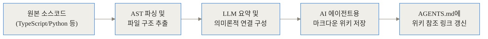
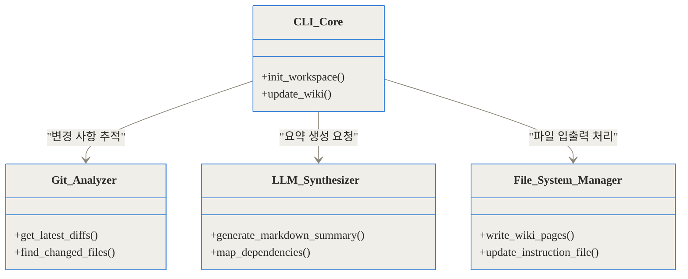
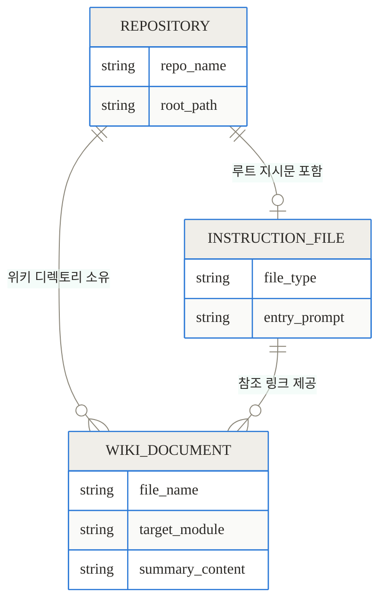
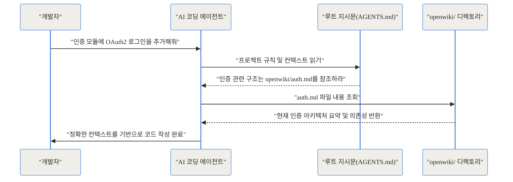
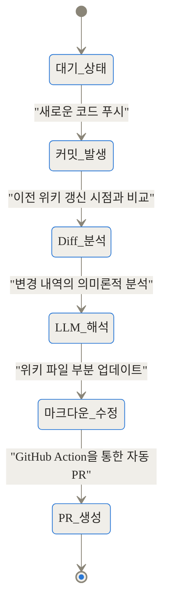
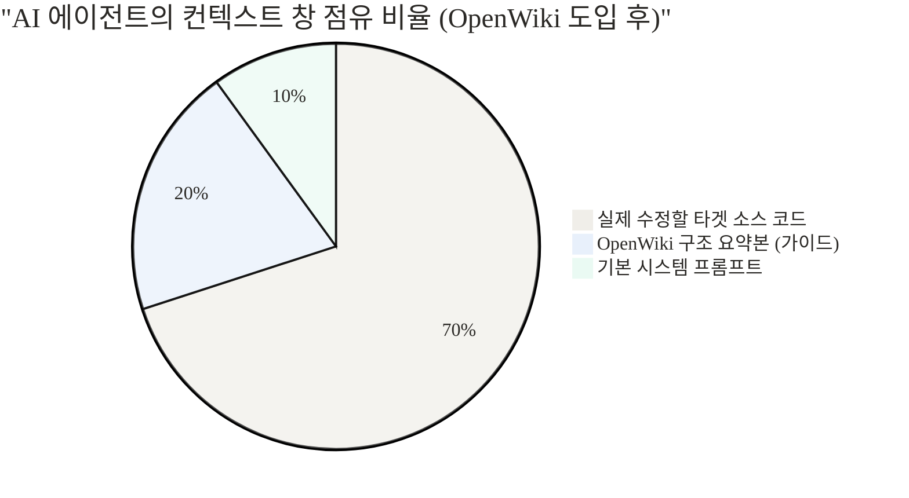

[상단 링크 블록]
- GitHub 저장소: [langchain-ai/openwiki](https://github.com/langchain-ai/openwiki)
- 관련 기술 논의(Andrej Karpathy): [llm-wiki gist](https://gist.github.com/karpathy)

[TL;DR]
- OpenWiki는 LangChain이 개발한 오픈소스 CLI 도구로, AI 코딩 에이전트(Cursor, Copilot 등)가 읽기 편한 전용 마크다운 위키를 자동 생성하고 유지보수합니다.
- 코드를 프롬프트에 전부 욱여넣거나 부정확한 RAG에 의존하던 기존 방식 대신, 작성 시점(Write time)에 전체 구조를 요약해두는 'LLM 위키 패턴'을 구현했습니다.
- GitHub Actions와 연동하여 코드가 변경될 때마다(git diff) 자동으로 위키를 업데이트하고 Pull Request를 생성해 '문서와 코드의 불일치(Drift)' 문제를 해결합니다.

## 배경과 문제 정의: AI에게 내 코드를 이해시키는 일의 고통

AI 기반 코딩 에이전트를 실무에 도입해 본 개발자라면 누구나 한 번쯤 겪는 거대한 장벽이 있습니다. 바로 "이 AI가 우리 프로젝트의 전체 구조를 전혀 모른다"는 답답함입니다. 에이전트가 단일 파일 단위의 코드는 기가 막히게 작성하지만, 여러 모듈이 얽혀 있는 복잡한 아키텍처 안에서는 기존 컨벤션을 무시하거나 엉뚱한 의존성을 끌어다 쓰는 실수를 반복합니다.

이를 해결하기 위해 개발자들은 보통 프로젝트 루트에 `CLAUDE.md`, `.cursorrules`, `AGENTS.md` 같은 지시문(Instruction file)을 만들고, 그 안에 프로젝트의 아키텍처, 데이터베이스 스키마, 폴더 구조 등을 텍스트로 길게 적어 넣기 시작합니다. 하지만 프로젝트가 커질수록 이 방식은 치명적인 한계에 부딪힙니다.

첫째, 프롬프트 비대화(Prompt Stuffing) 문제입니다. AI가 컨텍스트를 잃지 않게 하려고 모든 구조 문서를 지시문에 욱여넣으면, 에이전트가 구동될 때마다 수십만 개의 토큰이 소모됩니다. 이는 곧 막대한 API 비용 청구서로 돌아오며, LLM의 컨텍스트 윈도우 한계를 초과해 AI가 정작 중요한 최근 대화 내용을 잊어버리는 'Lost in the middle' 현상을 유발합니다.

둘째, 단순 검색 증강 생성(RAG)의 맹점입니다. "전부 넣지 말고 필요할 때마다 검색해서 쓰게 하자"는 아이디어로 에이전트 내부의 RAG 시스템을 활용하기도 합니다. 하지만 코드베이스는 일반적인 텍스트 문서와 달리 상호 참조(Cross-reference)와 숨겨진 의존성이 짙게 깔려 있습니다. 질문 시점(Query time)에 키워드 중심으로 코드 조각 몇 개를 검색해 오는 방식으로는, 전체 시스템의 큰 그림을 파악해야 하는 리팩토링이나 아키텍처 설계 작업을 수행할 수 없습니다.

셋째, 문서화 표류(Documentation Drift)입니다. 초기에는 인간 개발자가 꼼꼼히 마크다운 문서를 작성해 두더라도, 코드는 하루에도 수십 번씩 변경됩니다. 바쁜 일정 속에서 문서를 매번 업데이트하는 것은 불가능에 가깝고, 결국 문서와 실제 코드가 달라집니다. AI 에이전트는 이 '과거의 유물'이 된 문서를 진실로 믿고 코드를 작성하다가 치명적인 버그를 양산하게 됩니다.

OpenWiki는 바로 이 세 가지 고통스러운 지점을 정확히 타격하기 위해 등장한 프로젝트입니다.

## 개념 쉽게: 'LLM 위키' 패턴이란 무엇인가

OpenWiki의 작동 철학을 이해하기 위해서는 안드레이 카파시(Andrej Karpathy)가 제안한 'LLM 위키(LLM Wiki)' 패턴을 짚고 넘어가야 합니다.

이 개념은 우리의 일상과 매우 닮아 있습니다. 회사에 신규 입사자가 들어왔다고 가정해 보겠습니다. 이 입사자에게 회사의 모든 부서별 결재 서류와 과거 이메일 원본 1만 장을 한 번에 던져주며 "알아서 읽고 일하세요"라고 말하는 것이 기존의 **프롬프트 비대화(Stuffing)** 방식입니다. 반면, "결재 서류 어딘가에 답이 있으니 필요할 때마다 검색해서 찾아보세요"라고 말하는 것이 **RAG 방식**입니다. 둘 다 신규 입사자에게는 극도로 비효율적입니다.

가장 좋은 방법은 누군가가 신규 입사자를 위해 '부서별 업무 요약 핸드북'을 미리 깔끔하게 정리해 두는 것입니다. 이 핸드북에는 각 부서가 하는 일, 주요 담당자, 시스템 간 연결 고리가 굵직하게 요약되어 있고, 더 깊은 내용이 필요할 때 찾아볼 수 있는 원본 링크가 달려 있습니다.

OpenWiki가 하는 일이 바로 AI 에이전트를 위한 '요약 핸드북'을 만들어주는 것입니다. 원본 소스 코드를 그대로 AI에게 먹이는 대신, LLM을 활용해 전체 코드베이스의 구조, 컴포넌트 역할, 의존성 관계를 요약한 구조화된 마크다운 위키 파일들을 미리 생성해 둡니다.


에이전트는 작업을 시작할 때 `AGENTS.md`와 같은 단일 진입점 파일만 읽습니다. 이 파일 안에는 "결제 모듈을 수정할 때는 `openwiki/payment_architecture.md`를 먼저 읽어라"라는 식의 이정표(Reference)만 존재합니다. AI는 이정표를 따라 자신에게 최적화된 형태의 요약 문서를 필요할 때만 빠르고 정확하게 섭취합니다.

이 패턴의 핵심은 작업을 **검색 시점(Query time)에서 작성 시점(Write time)으로 이동**시켰다는 것입니다. 질문을 받을 때마다 허둥지둥 코드를 검색하는 것이 아니라, 코드가 변경될 때마다 여유롭게 전체 구조를 요약해 문서로 굳혀두는(Baking) 방식을 취합니다. 인간은 유지보수에 지치지만, LLM은 지루함을 느끼지 않고 묵묵히 문서를 최신화할 수 있다는 점을 영리하게 이용한 것입니다.

## 작동 원리 심층 (Under the Hood): OpenWiki는 어떻게 움직이는가

OpenWiki는 겉보기에는 단순한 CLI 도구 같지만, 내부적으로는 코드 분석, LLM 요약, 파일 시스템 조작, Git 버전 관리 연동이 정교하게 맞물려 돌아가는 파이프라인을 가지고 있습니다.

### 1. 전체 아키텍처와 데이터 파이프라인

OpenWiki의 데이터 흐름은 원본 소스코드에서 시작하여 AI 최적화 마크다운 파일로 끝납니다. 이 과정을 시각화하면 다음과 같습니다.



이 파이프라인을 관장하는 핵심 컴포넌트들의 클래스 구조는 어떻게 되어 있을까요?



OpenWiki 코어 모듈이 실행되면, 가장 먼저 `Git_Analyzer`가 저장소의 상태를 파악합니다. 이후 `LLM_Synthesizer`를 호출해 변경되거나 새로 생성된 코드의 맥락을 LLM(OpenAI, Anthropic 등)에게 물어보고 요약문을 받아냅니다. 최종적으로 `File_System_Manager`가 `openwiki/` 디렉토리에 마크다운 파일을 기록합니다.

### 2. 생성되는 위키의 데이터 모델

OpenWiki가 생성하는 데이터 구조는 인간이 읽기 위한 것이 아니라 AI가 구조를 맵핑하기 좋도록 설계되어 있습니다.



위키 문서는 모듈별, 도메인별로 쪼개져 저장됩니다. 각 마크다운 파일 내부에는 명확한 헤딩(Heading)과 핵심 로직에 대한 요약, 그리고 연관된 다른 위키 파일로의 텍스트 링크가 포함되어 있어 AI가 꼬리를 물고 정보를 탐색할 수 있습니다.

### 3. AI 에이전트의 문서 조회 흐름 (Sequence)

실제로 에이전트(예: Cursor)가 개발자의 명령을 받았을 때 OpenWiki가 만들어둔 구조를 어떻게 활용하는지 상호작용 흐름을 살펴보겠습니다.



에이전트는 무거운 전체 코드를 읽는 대신, 루트 지시문이 안내하는 가벼운 마크다운 파일 하나만 읽고도 현재 인증 시스템이 어떤 라이브러리를 쓰고 어떤 폴더 구조를 가지는지 완벽히 파악합니다.

### 4. 지속적 동기화: Git Diff 기반 업데이트

가장 중요한 것은 이 위키가 어떻게 항상 최신 상태를 유지하느냐입니다. OpenWiki는 전체 코드를 매번 다시 요약하지 않습니다. 그것은 너무 느리고 비용이 많이 듭니다. 대신 `git diff`를 활용해 점진적(Incremental) 업데이트를 수행합니다.



스케줄러나 Git Hook에 의해 이벤트가 발생하면, OpenWiki는 이전 실행 이후 추가된 커밋들을 확인합니다. 변경된 파일 목록을 추출하고, 그 변경이 전체 구조에 어떤 의미를 가지는지 LLM에게 묻습니다. "A 파일에서 함수 이름이 바뀌었으니, 이 함수를 설명하던 위키 B 문서의 내용도 이렇게 수정하라"는 지시를 받아 위키를 패치(Patch)하는 것입니다.

## 구현 및 사용 디테일: 내 저장소에 5분 만에 도입하기

이론적인 작동 원리를 알았다면, 실제 프로젝트에 도입하는 과정은 놀랍도록 간단합니다. OpenWiki는 Node.js 환경에서 동작하는 CLI 툴입니다.

### 1. 설치 및 초기화

터미널을 열고 전역으로 OpenWiki를 설치합니다.

```bash
npm install -g openwiki
```

이제 위키를 생성할 프로젝트의 루트 디렉토리로 이동한 뒤, 초기화 명령어를 실행합니다.

```bash
openwiki --init
```

명령어를 실행하면 대화형 프롬프트가 시작됩니다. 어떤 LLM 프로바이더를 사용할 것인지(OpenAI, Anthropic, OpenRouter, Fireworks 등) 선택하고 API 키를 입력하게 됩니다. 설정이 완료되면 OpenWiki가 코드베이스 전체를 훑으며 `openwiki/` 폴더를 생성하고, 내부에 AI용 마크다운 위키를 써 내려갑니다. 동시에 프로젝트 루트에 `AGENTS.md` (또는 `CLAUDE.md`) 파일을 생성하거나 수정하여, 에이전트가 이 위키를 참고하도록 지시문을 삽입합니다.

### 2. GitHub Actions 자동화 설정

수동으로 명령어를 쳐서 위키를 업데이트할 수도 있지만, 가장 강력한 방법은 CI/CD 파이프라인에 태우는 것입니다. 매일 밤, 혹은 메인 브랜치에 코드가 머지될 때마다 OpenWiki가 변경 사항을 감지하고 위키를 업데이트하는 Pull Request를 자동으로 올리게 할 수 있습니다.

프로젝트의 `.github/workflows/openwiki.yml` 파일을 만들고 아래와 같이 구성할 수 있습니다.

```yaml
name: Update OpenWiki
on:
  schedule:
    - cron: '0 0 * * *' # 매일 자정 실행
  workflow_dispatch:

jobs:
  update-wiki:
    runs-on: ubuntu-latest
    steps:
      - uses: actions/checkout@v4
        with:
          fetch-depth: 0
      - uses: actions/setup-node@v4
        with:
          node-version: '20'
      - name: Install OpenWiki
        run: npm install -g openwiki
      - name: Run OpenWiki Update
        env:
          OPENAI_API_KEY: ${{ secrets.OPENAI_API_KEY }}
        run: openwiki --update
      - name: Create Pull Request
        uses: peter-evans/create-pull-request@v6
        with:
          title: 'docs: OpenWiki 자동 업데이트'
          branch: 'chore/update-openwiki'
```

이 워크플로우를 등록해 두면, 인간 개발자는 코딩에만 집중하고 '문서화'는 AI 에이전트가 뒤에서 알아서 처리하는 쾌적한 경험을 할 수 있습니다.

## 실전 활용 시나리오: 현업에서는 어떻게 쓸까

그렇다면 이 강력한 도구를 실제 현업에서는 어떤 상황에서 가장 유용하게 쓸 수 있을까요?

### 시나리오 1: 거대한 모노레포(Monorepo) 구조에서의 길 잃음 방지
수백 개의 패키지와 서비스가 얽혀 있는 모노레포 환경에서 에이전트에게 "B 서비스의 사용자 데이터 조회 로직을 수정해줘"라고 하면, 에이전트는 A 서비스의 비슷한 파일을 건드리거나 완전히 잘못된 공통 모듈을 참조하기 일쑤입니다. 전체 디렉토리 구조를 컨텍스트에 넣는 것조차 불가능하기 때문입니다. OpenWiki를 도입하면, 에이전트는 가장 먼저 `openwiki/architecture.md`를 읽고 모노레포의 패키지 간 의존성 지도를 파악한 뒤 정확히 B 서비스의 폴더로 직행합니다.

### 시나리오 2: 주니어 AI의 팀 컨벤션 위반 방어
AI 에이전트는 기본적으로 자신이 학습한 '일반적인 코딩 스타일'로 코드를 짭니다. 하지만 회사마다 독특한 에러 핸들링 규칙이나 네이밍 컨벤션이 존재합니다. 인간 문서로는 "우리 팀은 에러를 던질 때 반드시 CustomError 클래스를 상속받아라"라고 적어두지만, AI는 이를 무시합니다. OpenWiki가 분석한 위키에는 코드베이스의 실제 컨벤션 패턴이 요약되어 `openwiki/conventions.md`로 유지됩니다. 에이전트는 코드를 짜기 전 이 문서를 강제 참조하게 되어, 시니어 개발자가 작성한 것처럼 일관된 스타일의 코드를 뱉어냅니다.

### 시나리오 3: 레거시 코드 리팩토링 시 사이드 이펙트 최소화
오래된 결제 모듈을 리팩토링할 때, 사람조차 이 모듈이 어디어디에 연결되어 있는지 파악하기 어렵습니다. RAG 검색만으로는 숨겨진 의존성을 찾기 힙듭니다. 반면 OpenWiki는 전체 코드를 스캔하여 위키를 만들었기 때문에, 요약 문서 안에 "이 결제 모듈은 배송 모듈과 쿠폰 모듈에 강한 결합도를 가짐"이라는 사실이 기록되어 있습니다. AI는 이 요약을 읽고 리팩토링 시 쿠폰 모듈까지 함께 수정하는 안전한 계획을 세울 수 있습니다.

## 벤치마크 및 비교: 무엇이 얼마나 좋아지는가

과연 OpenWiki를 썼을 때 기존 방식에 비해 얼마나 극적인 개선이 일어날까요? 다음 표는 다양한 방식의 장단점을 명확히 보여줍니다.


| 비교 항목 | 전체 지시문 주입 (CLAUDE.md Stuffing) | 검색 증강 생성 (RAG) | OpenWiki (LLM Wiki 패턴) |
| :--- | :--- | :--- | :--- |
| **작동 시점** | 개발자가 수동 작성 | 질문 시점 (Query time) | 코드 변경 시점 (Write time) |
| **전체 구조 파악** | 매우 뛰어남 (단, 토큰 초과 위험) | 매우 취약함 (파편화된 정보) | **매우 뛰어남 (요약된 구조)** |
| **유지보수 비용** | 인간의 지속적인 노동력 필요 | 문서화 필요 없음 | **자동화 (GitHub Actions 연동)** |
| **환각(Hallucination) 위험** | 낮음 (문서를 잘 관리했을 때) | 높음 (엉뚱한 코드 검색 시) | 중간 (위키 생성 시 잘못 요약될 위험) |
| **초기 구동 토큰 비용** | **매우 높음 (수십만 토큰)** | 낮음 | **매우 낮음 (참조 위키만 읽음)** |


에이전트가 새로운 세션을 시작할 때마다 소모하는 컨텍스트 토큰 사용량의 차이를 비교해 보면 개선 효과가 더욱 뚜렷하게 나타납니다.

```chartjs
{
  "type": "bar",
  "data": {
    "labels": ["전체 지시문 주입(Stuffing)", "단순 RAG 방식", "OpenWiki 방식"],
    "datasets": [
      {
        "label": "에이전트 구동 시 평균 소모 토큰 수 (개)",
        "data": [120000, 15000, 3500],
        "backgroundColor": ["#ff6384", "#36a2eb", "#4bc0c0"]
      }
    ]
  },
  "options": {
    "responsive": true,
    "plugins": {
      "title": {
        "display": true,
        "text": "방식별 AI 에이전트 초기 컨텍스트 토큰 소모량 비교"
      }
    }
  }
}
```

OpenWiki를 도입하면 프롬프트 스터핑 방식 대비 토큰을 비약적으로 절감할 수 있으며, 이는 응답 속도의 상승으로 이어집니다. AI 에이전트의 컨텍스트 창이 여유로워지면 다음과 같은 비율로 데이터를 밀도 있게 활용할 수 있습니다.



에이전트의 제한된 인지 공간 대부분을 실제 작업해야 할 코드를 싣는 데 쓸 수 있게 되는 것입니다.

## 솔직한 평가: 장점 이면의 한계와 리스크

기술에 완벽한 정답은 없습니다. OpenWiki 역시 'LLM 위키' 패턴을 채택하면서 필연적으로 감수해야 할 트레이드오프와 리스크가 존재합니다.

가장 치명적인 위험 요소는 바로 **내재된 환각(Baked-in Hallucination)**입니다. RAG 방식에서는 AI가 잘못된 답변을 하더라도 원본 코드가 훼손된 것은 아니므로 다음 질문에서 바로잡을 기회가 있습니다. 그러나 OpenWiki는 쓰기 시점(Write time)에 LLM이 원본 코드를 해석하여 요약 문서를 '영구적인 마크다운'으로 박아 넣습니다. 만약 이 요약 과정에서 LLM이 코드의 의도를 오해하고 잘못된 사실을 위키에 기록한다면 어떻게 될까요? 이후 에이전트는 이 '잘못 굳어진 지식'을 절대적인 진실로 믿고 코드를 망가뜨리는 연쇄 작용을 일으킬 수 있습니다. 따라서 자동 생성된 위키 페이지를 주기적으로 인간이 가볍게라도 검수하는 과정이 완전히 생략되어서는 안 됩니다.

또한, **초기 생성 비용과 시간** 문제도 무시할 수 없습니다. 수만 줄에 달하는 거대한 코드베이스에서 처음 `openwiki --init`을 실행하면, 전체 파일을 순회하며 외부 LLM API를 수없이 호출해야 합니다. 이는 상당한 시간 지연과 API 과금 지출을 발생시킵니다. 물론 이후에는 `git diff` 기반으로 차분 업데이트만 수행하므로 비용이 급감하지만, 첫 도입 장벽이 존재하는 것은 사실입니다.

이 도구가 어울리지 않는 프로젝트도 있습니다. 외부 라이브러리 의존성 없이 단일 알고리즘만 수행하는 작고 독립적인 유틸리티 라이브러리나, 하루에도 수백 명의 개발자가 각기 다른 구조를 폭격하듯 수정하여 위키 업데이트 속도가 코드 변경 속도를 미처 따라가지 못하는 초거대 오픈소스 프로젝트에서는 오히려 도입 효용성이 떨어질 수 있습니다.

## 마무리: AI 코딩 생태계의 다음 단계

우리는 불과 얼마 전만 해도 AI가 코드 몇 줄을 자동 완성해 주는 것만으로 크게 만족했습니다. 하지만 이제 AI는 단순한 자동 완성 도구를 넘어 프로젝트의 전체 맥락을 이해하고 주도적으로 시스템을 설계하고 문제를 해결하는 '에이전트'로 진화하고 있습니다. 에이전트의 지능이 올라갈수록, 그들에게 적절한 컨텍스트(Context)를 얼마나 정제된 형태로 제공하느냐가 개발 조직의 생산성을 가르는 핵심 경쟁력이 될 것입니다.

langchain-ai/openwiki는 오로지 인간을 위해 존재하던 '문서화'라는 행위를 AI의 눈높이와 섭취 방식에 맞춰 완전히 뒤집어 놓은 훌륭한 접근입니다. 코드를 무작정 프롬프트에 밀어 넣거나, 엉성한 검색으로 땜질하던 시대를 지나, AI가 직접 자신의 기억 공간을 만들고 정돈하는 시대가 열린 것입니다.

오늘 당장 프로젝트 루트 폴더에 방치되어 있는 비대한 지시문 파일을 정리하고, 대신 AI 스스로 유지보수할 수 있는 위키를 연결해 보는 것은 어떨까요? 에이전트가 우리 팀의 코드를 다루는 정확도와 속도가 확실하게 달라지는 것을 경험하게 될 것입니다.

## 자주 묻는 질문 (FAQ)

### OpenWiki는 기존의 Doxygen이나 JSDoc 같은 문서화 도구와 무엇이 다른가요?

기존 문서화 도구는 '사람'이 브라우저에서 읽기 좋게 HTML 등의 형태로 렌더링하는 데 목적을 둡니다. 반면 OpenWiki는 오직 'AI 코딩 에이전트'가 읽고 섭취하기 좋도록 요약된 텍스트와 상호 참조 구조를 가진 마크다운 파일을 생성한다는 점에서 대상 독자가 완전히 다릅니다.

### 이미 Cursor나 GitHub Copilot을 잘 쓰고 있는데도 OpenWiki가 필요한가요?

단일 파일이나 좁은 범위의 수정 작업만 한다면 기존 툴로도 충분합니다. 하지만 프로젝트 규모가 커져서 AI가 다른 폴더의 컴포넌트 의존성을 자꾸 놓치거나 엉뚱한 아키텍처 패턴으로 코딩하는 빈도가 잦아졌다면, 전체 구조를 요약해 주는 OpenWiki의 도입이 큰 도움이 됩니다.

### 위키를 생성할 때 발생하는 LLM API 비용은 어느 정도인가요?

처음 프로젝트를 스캔하여 위키를 초기화할 때는 전체 코드를 분석하므로 코드베이스 크기에 비례하여 꽤 많은 토큰 비용이 발생합니다. 하지만 이후에는 GitHub Actions 등을 통해 git diff로 변경된 부분만 추출해 점진적으로 업데이트하므로 유지보수 비용은 매우 저렴합니다.

### 지원하는 프로그래밍 언어에 제한이 있나요?

OpenWiki 자체는 TypeScript 기반의 CLI 도구이지만, 분석의 주체를 LLM(OpenAI, Anthropic 등)이 담당하므로 LLM이 이해할 수 있는 대부분의 주류 프로그래밍 언어(Python, Java, Go, JS/TS 등) 프로젝트에서 문제없이 동작합니다.

### GitHub Actions로 자동화할 때 잘못된 위키가 강제로 반영될 위험은 없나요?

OpenWiki의 자동화 워크플로우는 메인 브랜치에 직접 커밋을 밀어 넣는 방식이 아니라, 변경된 마크다운 위키 내용을 담은 Pull Request(PR)를 자동으로 생성하는 방식을 권장합니다. 따라서 개발자가 PR을 머지하기 전에 가볍게 내용을 검수하여 잘못된 환각(Hallucination)이 섞이는 것을 방지할 수 있습니다.


## References
- [https://github.com/langchain-ai/openwiki](https://github.com/langchain-ai/openwiki)
- [https://gist.github.com/karpathy](https://gist.github.com/karpathy)
- [https://raw.githubusercontent.com/langchain-ai/openwiki/main/static/openwiki.png](https://raw.githubusercontent.com/langchain-ai/openwiki/main/static/openwiki.png)
