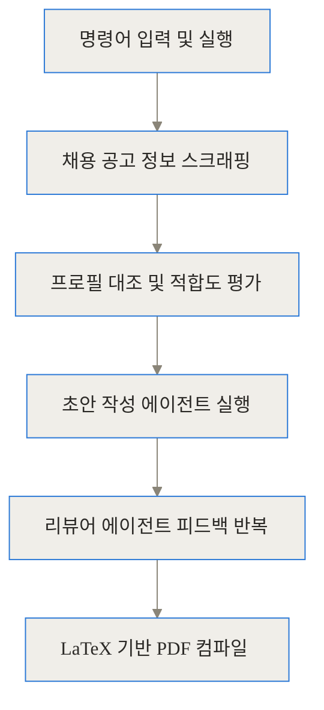
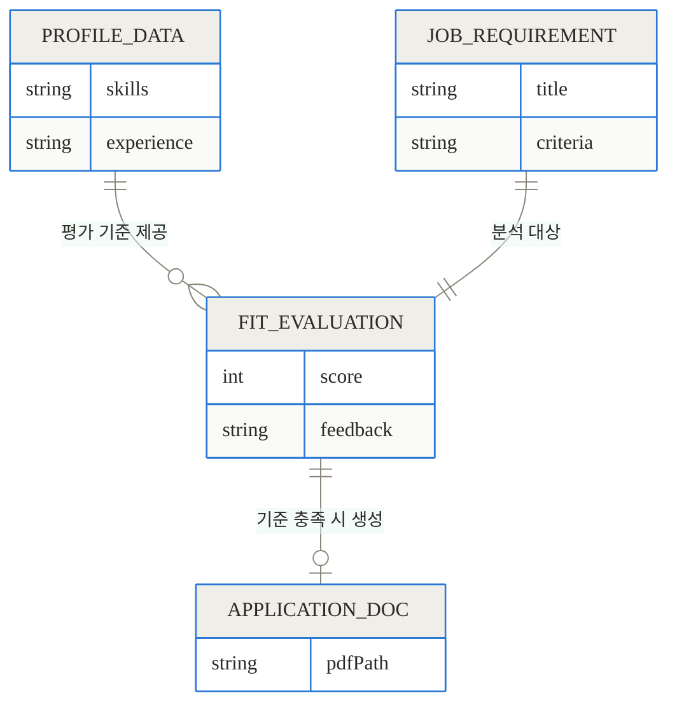
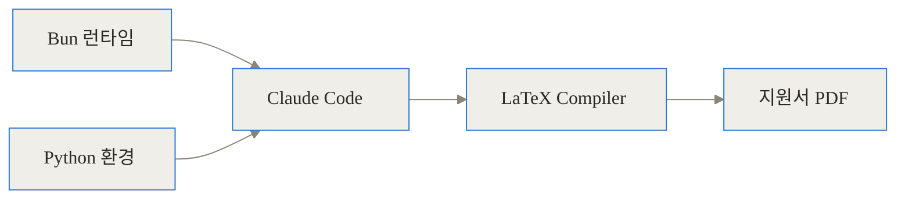
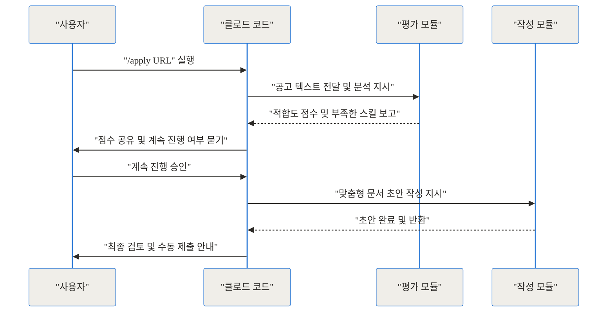
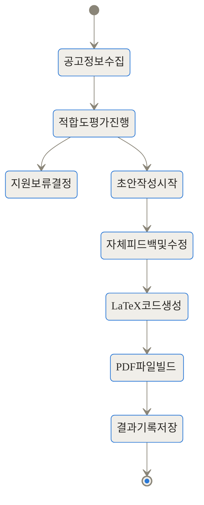
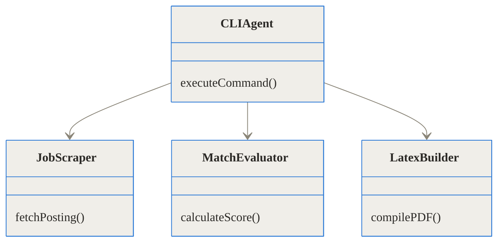
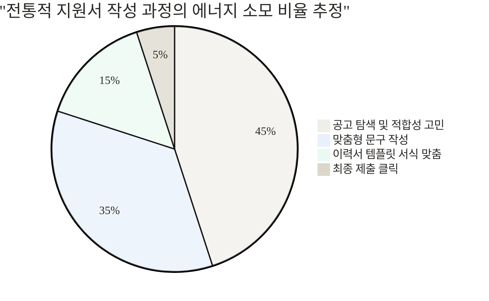

## 참고 링크 및 프로젝트 정보

- [GitHub 저장소: MadsLorentzen/ai-job-search](https://github.com/MadsLorentzen/ai-job-search)
- [Reddit 관련 논의: I built an open-source job search framework](https://www.reddit.com/r/ClaudeAI/)

> **TL;DR (한 줄 요약)**
> - 단순 반복적인 지원과 탈락의 굴레를 끊기 위해 만들어진 오픈소스 구직 자동화 시스템입니다.
> - 공고 적합도를 먼저 평가하고, 기준을 통과한 공고에 한해 맞춤형 문서를 작성하는 파이프라인을 갖췄습니다.
> - 사용자의 실제 프로필 데이터에만 기반해 문서를 생성하므로 사실과 다른 내용을 지어내는 일이 없습니다.

## 구직 과정의 피로감과 자동화의 필요성

최근 채용 시장은 구직자에게 매우 가혹한 환경을 조성하고 있습니다. 수많은 채용 포털을 끝없이 스크롤하고, 회사의 요구사항에 맞춰 이력서를 조금씩 수정하며, 자기소개서를 작성해 제출하지만 돌아오는 것은 기약 없는 기다림뿐인 경우가 많습니다. 데이터 과학자인 Mads Lorentzen 역시 갑작스러운 해고 이후 이러한 소모적인 과정을 겪었습니다. 그는 이 반복적인 과정을 효율적으로 관리하기 위해 자신이 가진 기술을 활용하기로 결심했습니다. 

단순히 챗GPT에 공고를 붙여넣고 "이력서를 써줘"라고 명령하는 방식은 이미 한계가 명확합니다. 이렇게 만들어진 이력서는 너무 뻔한 표현으로 가득 차 있으며, 종종 AI가 사용자가 해본 적 없는 경험을 그럴듯하게 지어내는 환각(Hallucination) 현상을 일으키기도 합니다. 반대로 수백 개의 공고에 이력서를 무차별 살포하는 '대량 지원(Mass Apply) 봇'은 기업의 서류 필터링 시스템(ATS)에서 낮은 품질로 인해 쉽게 걸러집니다. 

ai-job-search는 이 양극단의 문제점을 해결하기 위해 등장했습니다. 철저하게 사용자의 실제 데이터를 바탕으로 작동하면서도, 매 지원서마다 높은 수준의 맞춤화를 제공하는 것이 이 프로젝트의 가장 중요한 목적입니다.

## ai-job-search란 무엇인가?

이 프로젝트는 단순한 문서 생성기가 아닙니다. 클로드 코드(Claude Code)의 명령줄 인터페이스(CLI) 환경 위에서 작동하는 '종합 구직 프레임워크'입니다. 

이해를 돕기 위해 일상적인 상황에 비유해 보겠습니다. 당신의 책상 옆에 세 명의 전문가가 앉아 있다고 상상해 보세요.
첫 번째 전문가는 당신의 경력을 속속들이 알고 있는 **커리어 코치**입니다. 채용 공고를 가져오면 "이 자리는 당신의 기술 스택과 30%밖에 맞지 않으니 지원하지 않는 게 좋겠어요"라고 냉정하게 조언합니다.
두 번째 전문가는 당신을 위해 글을 써주는 **전문 대필가**입니다. 코치가 승인한 공고에 한해, 회사가 원하는 인재상에 맞춰 당신의 진짜 경험을 돋보이게 포장합니다.
세 번째 전문가는 깐깐한 **인사담당자**입니다. 대필가가 쓴 글을 읽어보고 "이 부분은 너무 과장되었고, 저 부분은 구체적인 수치가 부족하네요"라며 수정을 요구합니다.

ai-job-search는 바로 이 세 명의 전문가를 터미널 안에 구현해 놓은 시스템입니다. 공고를 무조건 지원하는 것이 아니라, 먼저 평가하고, 신중하게 작성하며, 깐깐하게 검토한 뒤 깔끔한 PDF 형태로 문서를 출력해 줍니다.

## 전체 시스템 아키텍처와 작동 원리

이 프레임워크가 어떻게 이렇게 정교한 작업을 수행하는지, 파이프라인의 전체적인 흐름부터 단계별로 깊이 파헤쳐 보겠습니다.



### 1. 프로필 기반의 엄격한 데이터 통제

이 시스템이 일반적인 AI 문서 생성기와 구별되는 가장 큰 차이점은 '데이터의 출처'를 철저하게 제한한다는 것입니다. 사용자는 시스템을 시작하기 전, 자신의 기술, 경력, 학력, 선호하는 연봉 수준, 취업 불가능한 조건 등을 엄격한 구조의 문서(프로필)로 작성해 두어야 합니다.

AI는 이 프로필 문서 밖의 내용을 절대 창조하지 않도록 지시받습니다. 이를 통해 채용 과정에서 치명적인 문제가 될 수 있는 허위 경력 기재를 원천적으로 차단합니다. 



### 2. 채용 공고 수집 및 파싱 생태계

공고를 분석하려면 먼저 웹사이트에서 채용 정보를 읽어와야 합니다. ai-job-search는 자바스크립트 런타임인 Bun을 활용하여 CLI 기반의 스크래핑 도구를 구축했습니다. 기본적으로는 덴마크의 채용 포털(Jobindex, Jobnet 등)을 타겟으로 작성되어 있지만, 구조가 모듈화되어 있어 사용자가 원하는 지역의 포털을 쉽게 추가할 수 있습니다.



### 3. 가장 중요한 단계: 적합도 평가(Fit Evaluation)

문서를 작성하기 전, 시스템은 공고를 읽고 사용자의 프로필과 대조하여 '적합도 점수'를 계산합니다. 요구하는 기술 스택이 얼마나 일치하는지, 연봉 수준은 맞는지, 업무 문화가 선호도와 부합하는지를 분석하여 수치화합니다. 점수가 너무 낮다면, 사용자는 이 공고에 시간을 낭비하지 않고 다음 공고로 넘어갈 수 있습니다. 이 과정 하나만으로도 구직 피로도는 급격히 줄어듭니다.



### 4. 대립 구조의 문서 작성: Drafter와 Reviewer

지원이 결정되면, 시스템 내부에서 두 가지 역할을 하는 에이전트가 작동합니다.
첫 번째 에이전트(Drafter)는 초안을 작성합니다. 프로필 데이터 중 공고의 요구사항에 가장 잘 맞는 경험을 선별하여 이력서와 커버레터를 구성합니다.
두 번째 에이전트(Reviewer)는 채용 담당자의 시선에서 이 초안을 비판적으로 검토합니다. "이 문장은 너무 수동적입니다", "해당 프로젝트가 회사에 어떤 기여를 했는지 결과가 빠져 있습니다" 등의 피드백을 생성하며, 이 피드백을 바탕으로 Drafter가 문서를 수정합니다. 이 과정이 완료되어야만 최종 출력 단계로 넘어갑니다.



### 5. 컴파일과 고품질 출력: 왜 LaTeX인가?

이 프로젝트는 완성된 텍스트를 MS Word나 단순 텍스트가 아닌 LaTeX 코드로 변환한 뒤, PDF로 컴파일합니다. 왜 이렇게 복잡한 방식을 택했을까요?
기업에서 사용하는 이력서 필터링 시스템(ATS)은 PDF 파일 내부의 텍스트 구조를 정확히 읽어내야 합니다. 일반적인 편집기로 만든 PDF는 텍스트가 깨지거나 구조가 망가지는 경우가 있지만, LaTeX로 생성된 PDF는 기계가 읽기에 매우 깔끔하고 명확한 구조를 가집니다. 프로젝트 문서에 따르면, 폰트 확장 오류를 피하기 위해 이력서(CV)는 `lualatex`로, 커버레터는 특정 폰트 패키지 요구사항 때문에 `xelatex`로 컴파일하도록 정교하게 설정되어 있습니다.

## 설치 및 주요 명령어 사용법

이 프레임워크를 활용하려면 몇 가지 기술적인 준비가 필요합니다. 터미널 환경에 익숙한 개발자나 기획자에게 적합한 도구입니다.

**사전 요구 사항:**
- Claude Code CLI
- Python 3.10 이상
- Bun (스크래퍼 실행용)
- LaTeX 배포판 (TeX Live 또는 MiKTeX)

**주요 명령어 구조:**



시스템을 클론하고 의존성을 설치한 뒤, 클로드 코드 안에서 다음과 같은 명령어들을 통해 구직 과정을 관리합니다.

- `/setup`: 초기 환경과 프로필 데이터를 설정합니다.
- `/apply <URL>`: 특정 공고의 URL을 입력하면 평가부터 문서 생성까지의 전체 파이프라인을 실행합니다.
- `/outcome`: 면접 결과, 합격, 불합격, 무응답 등의 결과를 기록하여 다음 지원에 반영되도록 학습시킵니다.
- `/expand`: GitHub, 포트폴리오 사이트, 구글 스칼라 등의 공개 정보를 바탕으로 프로필을 풍부하게 업데이트합니다.
- `/upskill`: 평가 과정에서 반복적으로 지적된 부족한 기술(Gap)을 파악하고, 이를 보완하기 위한 학습 계획을 제안합니다.

## 벤치마크 및 트레이드오프 비교

기존의 구직 방식이나 단순 AI 활용과 비교했을 때, ai-job-search는 품질과 효율성 측면에서 뚜렷한 장점을 보여줍니다.

| 비교 항목 | 기존 수작업 지원 | 단순 AI 복사/붙여넣기 | ai-job-search 파이프라인 |
| --- | --- | --- | --- |
| **공고 분석** | 직접 읽고 주관적으로 판단 | 제한적이며 프롬프트에 의존 | 자동화된 정량적/정성적 적합도 평가 |
| **내용 생성** | 처음부터 작성 | 경험을 과장하거나 지어낼 위험 | 프로필 기반의 엄격한 통제, 환각 방지 |
| **품질 검수** | 본인 또는 지인 검토 | 사용자가 직접 수정 | 리뷰어 에이전트의 자동 피드백 사이클 |
| **결과물 포맷** | Word 등 수동 서식 편집 | 단순 텍스트 | ATS 친화적인 고품질 LaTeX PDF |
| **학습 연계** | 불합격 원인 파악이 어려움 | 지원 후 끝 | 결과 기록 및 부족한 기술 학습 경로 제안 |

이 시스템을 도입하면 한 번의 지원에 들어가는 개인의 시간과 에너지가 어떻게 변화하는지, 추정된 시간 절감 효과를 시각화해 보겠습니다.

```chartjs
{"type":"bar","data":{"labels":["전통적 수작업","일반 챗봇 활용","ai-job-search 파이프라인"],"datasets":[{"label":"평균 소요 시간(분)","data":[120,45,15]}]}}
```

전통적인 방식에서는 하나의 완벽한 맞춤형 지원서를 쓰기 위해 2시간 이상이 소요되곤 했습니다. 다음 차트는 전통적 방식에서 에너지가 어떻게 분산되는지 보여줍니다.



하지만 이 시스템을 구축해두면, 공고 탐색과 평가, 서식 맞춤 과정이 현저하게 줄어듭니다. 사용자는 최종적으로 만들어진 고품질의 PDF를 눈으로 읽고 검토한 뒤 '제출' 버튼을 누르는 데에만 집중하면 됩니다.

## 솔직한 평가: 한계와 주의점

모든 도구가 완벽할 수는 없습니다. 이 프레임워크를 실무에 도입하기 전에 반드시 고려해야 할 몇 가지 현실적인 한계점들이 있습니다.

1. **높은 진입 장벽**: Python, Bun, LaTeX 등을 로컬 환경에 설치하고 터미널에서 명령어를 입력하는 방식은 비개발자에게 상당히 까다로울 수 있습니다. 특히 LaTeX 환경 설정 과정에서 폰트 오류를 해결하는 일은 꽤나 피곤한 작업입니다.
2. **지역적 한계**: 기본 내장된 스크래퍼가 덴마크 채용 시장에 맞춰져 있습니다. 한국의 채용 포털 환경에서 원활하게 작동하게 하려면, DOM 구조를 분석하여 직접 스크래퍼 로직(`/add-portal`)을 작성해야 하는 수고가 필요합니다.
3. **API 비용 발생**: 클로드 코드는 앤스로픽(Anthropic)의 API를 사용합니다. 공고 하나를 평가하고 문서를 작성할 때마다 상당량의 프롬프트 토큰이 소비되므로, 지속적으로 사용할 경우 비용이 발생합니다.
4. **결국 마지막은 사람의 몫**: 이 시스템은 알아서 채용 사이트에 로그인하고 지원서를 제출해 주지는 않습니다. 개발자의 철학이 담긴 의도적인 설계이긴 하지만, 완전한 '전자동 무인 구직 봇'을 기대했다면 실망할 수 있습니다. 

## 마무리

ai-job-search는 생성형 AI를 실생활의 고통스러운 문제에 적용한 매우 현실적이고 훌륭한 사례입니다. 양산형 봇들이 인터넷 트래픽을 장악하고 인사담당자들을 괴롭히는 시대에, 오히려 AI를 활용해 '가장 나다운' 맞춤형 지원서를 만들어낸다는 접근이 신선합니다. 

단순히 글을 잘 써주는 도구를 넘어, 나를 객관적으로 평가하고 부족한 점을 채울 학습 경로까지 제시하는 이 시스템은, 앞으로 개인화된 AI 에이전트가 어떤 방향으로 발전해야 하는지를 잘 보여주는 이정표라고 생각합니다. 터미널 환경에 익숙하고 이직을 준비 중이시라면, 당장 이번 주말에 이 프레임워크를 포크(Fork)하여 자신만의 구직 에이전트를 구축해 보시길 권합니다.

## 자주 묻는 질문 (FAQ)

### 클로드 코드(Claude Code)가 꼭 필요한가요?

네, 이 프로젝트는 앤스로픽(Anthropic)의 클로드 코드를 기반으로 작동하는 프레임워크입니다. 클로드의 CLI 환경 위에서 명령어를 통해 스크래핑, 평가, 문서 작성 파이프라인이 순차적으로 실행됩니다.

### 한국의 채용 포털(사람인, 원티드 등)에서도 작동하나요?

기본적으로는 덴마크 시장에 맞춰진 스크래퍼가 내장되어 있습니다. 하지만 구조가 모듈화되어 있어, 사용자가 '/add-portal' 명령어를 활용해 한국 포털의 DOM 구조에 맞는 스크래핑 로직을 추가하면 충분히 활용할 수 있습니다.

### LaTeX를 전혀 모르면 사용하기 어렵나요?

기본 제공되는 템플릿을 그대로 사용한다면 시스템이 텍스트를 채우고 PDF로 자동 컴파일해주므로 깊은 지식이 필요 없습니다. 다만 템플릿의 서식을 세밀하게 수정하려면 기본적인 LaTeX 문법 지식이 요구됩니다.

### AI가 없는 경력을 지어내면 어떻게 하나요?

이 시스템은 사용자가 사전에 직접 작성한 프로필 데이터에만 의존하도록 설계되었습니다. AI가 임의로 경력을 창조하지 않도록 프롬프트 수준에서 엄격하게 통제되어 있어 환각(Hallucination) 현상을 효과적으로 방지합니다.

### 이 도구를 쓰면 입사 지원 버튼도 알아서 눌러주나요?

아니요, 최종 지원서 PDF를 렌더링하는 단계까지만 자동화되어 있습니다. 생성된 모든 지원서는 사용자가 직접 눈으로 읽고 검토한 뒤 채용 사이트에서 제출해야 하며, 이는 품질 관리를 위한 의도적인 설계입니다.


## References
- [https://github.com/MadsLorentzen/ai-job-search](https://github.com/MadsLorentzen/ai-job-search)
- [https://www.reddit.com/r/ClaudeAI/](https://www.reddit.com/r/ClaudeAI/)
