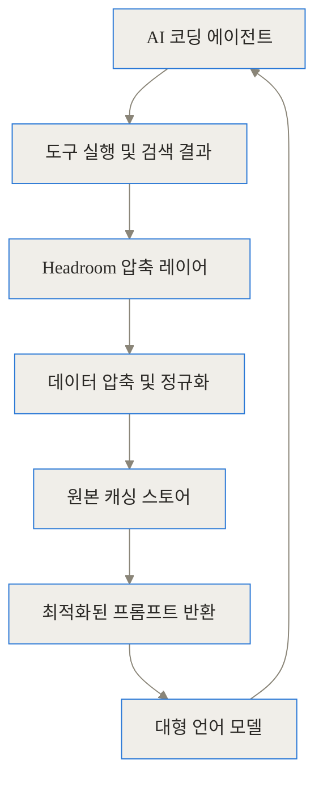
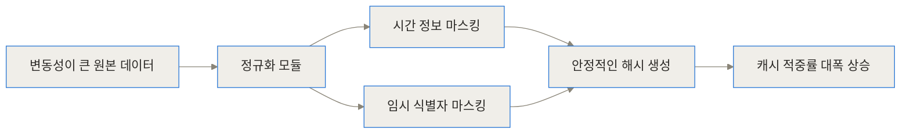
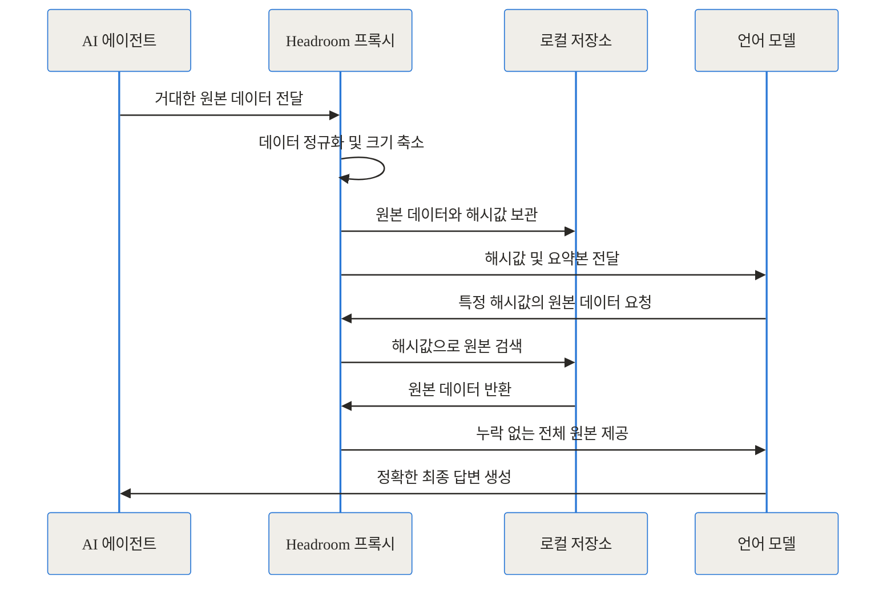
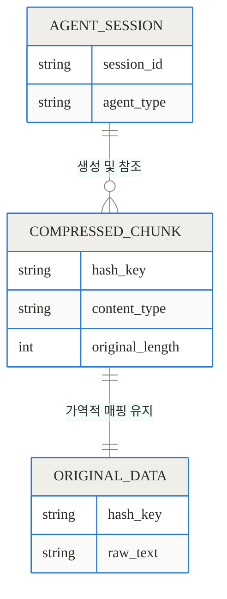
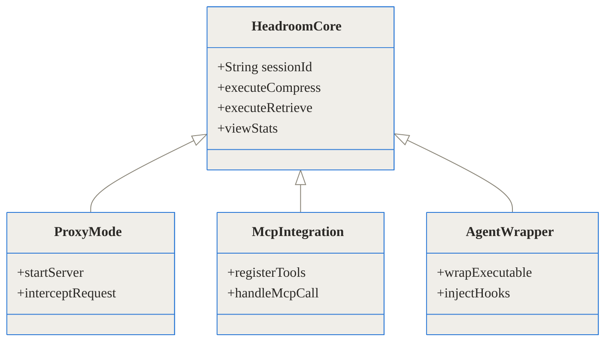
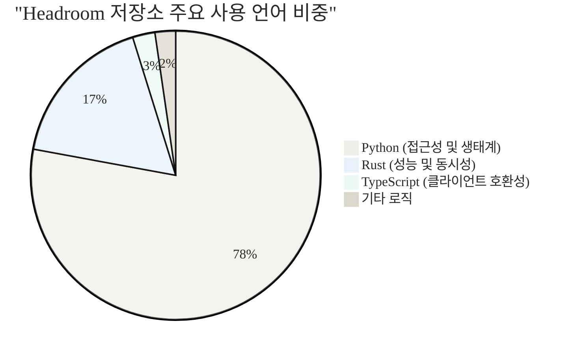

## 관련 링크 모음

- [Headroom GitHub 저장소](https://github.com/chopratejas/headroom)
- [Headroom 공식 문서](https://headroom-docs.vercel.app/docs)
- [Headroom PyPI 패키지](https://pypi.org/project/headroom-ai/)

## 도입 및 요약

최근 개발 생태계에서는 AI 에이전트가 스스로 코드를 찾고 디버깅을 수행하는 모습을 흔히 볼 수 있습니다. 하지만 이 뛰어난 자율성 이면에는 가파르게 상승하는 API 비용과 점차 느려지는 응답 속도라는 현실적인 고통이 따릅니다. 에이전트가 단독으로 실행하는 도구의 결과물이 길어질수록 모델은 중요한 맥락을 놓치고, 처리 비용은 기하급수적으로 늘어납니다.

**TL;DR**
- Headroom은 AI 에이전트와 LLM 사이에 위치해 도구 출력, 로그, RAG 청크를 최대 95%까지 압축하는 오픈소스 컨텍스트 레이어입니다.
- 원본 데이터를 해시값으로 로컬에 캐싱하는 가역적 압축(CCR) 방식을 채택하여 정보 손실의 위험을 근본적으로 방지합니다.
- 라이브러리, 프록시, MCP 서버 등 다양한 방식으로 제공되며 기존 도구의 코드 수정 없이 즉각 도입할 수 있습니다.

## 배경과 문제 정의: 무분별한 컨텍스트가 부르는 비용과 지연

AI 에이전트가 단독으로 작업을 수행하려면 필연적으로 외부 도구와 상호작용해야 합니다. 파일 시스템을 탐색하고, 데이터베이스를 조회하며, 터미널 명령어를 실행합니다. 문제는 이 도구들이 뱉어내는 결과물이 대형 언어 모델이 읽기에는 너무 방대하고 노이즈가 많다는 점입니다.

예를 들어, 에러 원인을 찾기 위해 로그 파일을 검색하는 도구를 실행했다고 가정해 보겠습니다. 이 도구는 단 하나의 'FATAL' 에러를 찾기 위해 수만 줄의 정상 동작 로그까지 모조리 LLM의 제한된 컨텍스트 윈도우에 밀어 넣습니다. 이러한 방식은 심각한 문제를 연쇄적으로 일으킵니다.

첫째, 토큰 사용량이 폭증하여 API 비용이 감당하기 힘들 정도로 커집니다. 둘째, 처리해야 할 텍스트가 많아지면서 첫 응답이 나오기까지의 지연 시간(Latency)이 길어집니다. 셋째, 모델이 너무 많은 노이즈 속에서 정작 중요한 단서를 놓치는 현상이 발생합니다.

## Headroom이란 무엇인가?: LLM을 위한 정보 다이어트

이러한 문제를 해결하기 위해 등장한 프로젝트가 바로 Headroom입니다. Tejas Chopra가 주도하는 이 오픈소스 프로젝트는 "AI 에이전트를 위한 컨텍스트 압축 레이어"를 표방합니다.

일상적인 비유를 들어보겠습니다. 바쁜 경영자에게 부서의 모든 영수증과 날것의 데이터를 결재 서류로 올리는 직원은 없습니다. 유능한 비서는 이 데이터를 한 장으로 요약하고, "상세한 원천 데이터는 첨부 번호 1번을 참조하십시오"라고 덧붙일 것입니다. Headroom은 시스템 내에서 바로 이 유능한 비서 역할을 수행합니다.



모델에 텍스트가 도달하기 전에 중간에서 가로채어, 노이즈를 걷어내고 의미 있는 정보만 남기는 구조입니다. 놀라운 점은 이 과정을 거친 압축 프롬프트가 원본을 그대로 넣었을 때와 동일한 품질의 답변을 유도해낸다는 것입니다.

## 작동 원리 심층: 정보 손실 없는 다단계 압축 파이프라인

단순히 텍스트의 끝을 잘라내는 방식이라면 시장에서 주목받지 못했을 것입니다. Headroom은 매우 정교한 다단계 파이프라인을 거쳐 데이터를 정제합니다.

### 1단계: 변동 데이터를 잡아내는 정규화

로깅 데이터나 API 응답에는 매번 바뀌는 타임스탬프, 무작위로 생성되는 임시 식별자가 포함되어 있습니다. 이러한 변동성은 캐시 시스템을 무력화시킵니다. 내용이 완벽히 같아도 시간값이 다르면 완전히 다른 데이터로 인식하기 때문입니다.

CacheAligner 모듈은 이 문제를 깔끔하게 해결합니다. 동적인 요소를 식별하여 안정적인 값으로 마스킹함으로써 불필요한 캐시 미스를 막고 적중률을 크게 끌어올립니다.



### 2단계: 콘텐츠 맞춤형 구조적 압축

데이터가 정규화되면 Headroom은 입력된 콘텐츠의 타입을 정확히 추론합니다. 그리고 각 타입에 가장 적합한 방식으로 구조적 압축을 진행합니다.

- **JSON 압축**: 배열 요소가 지나치게 많다면 대표적인 소수만 남기고 생략합니다. 값이 없는 필드를 제거하고 길이가 긴 키워드를 짧게 줄여 구조를 파악하기 쉽게 만듭니다.
- **코드 압축**: 모델이 전체 맥락을 이해하는 데 불필요한 긴 주석을 걷어내고, 함수의 시그니처와 클래스 구조 위주로 재편합니다.
- **로그 압축**: 단순 상태 보고 목적의 INFO와 DEBUG는 요약 처리하고, 문제 해결에 직결되는 ERROR와 FATAL 스택 트레이스는 온전히 보존합니다.


### 3단계: 원본을 기억하는 가역적 캐싱 구조

아무리 압축을 정교하게 하더라도, 모델이 원본의 아주 세밀한 부분을 요구할 때가 있습니다. Headroom은 CCR(Compress-Cache-Retrieve)이라는 가역적 메커니즘을 통해 이 잠재적 정보 손실 문제를 완벽하게 우회합니다.

압축된 텍스트와 함께 고유한 해시값을 모델에 전달하고, 원본 데이터는 로컬 스토어에 단단히 저장해 둡니다. 모델이 요약본을 보고 "이 함수의 실제 구현부가 꼭 필요하다"고 판단하면, 제공받은 해시값을 이용해 언제든 원본 전체를 다시 불러올 수 있습니다.



이러한 관계는 단순하면서도 강력한 데이터 매핑 모델을 기반으로 작동합니다.



### 4단계: 실패에서 배우는 자기 발전 기능

Headroom은 단순한 압축 도구를 넘어 에이전트의 행동을 교정하는 지능적인 기능도 품고 있습니다. `headroom learn` 명령어는 과거의 실패한 에이전트 세션을 심층 분석하여, 동일한 실수를 반복하지 않도록 프로젝트 내 `CLAUDE.md` 또는 `AGENTS.md` 파일에 행동 지침을 자동 업데이트합니다.

## 내 프로젝트에 어떻게 설치하고 적용하나요?

이 프로젝트는 Python과 TypeScript 생태계를 모두 아우르며, 사용자의 환경에 맞춰 다양한 계층에서 자유롭게 결합할 수 있습니다.



1. **라이브러리 방식 설치**

Python 환경이라면 아래 명령어로 모든 종속성을 포함해 설치합니다.
> pip install "headroom-ai[all]"

Node.js 생태계에서는 NPM 패키지 관리자를 통해 SDK를 설치하여 코드 레벨에서 직접 호출할 수 있습니다.
> npm install headroom-ai

2. **프록시 서버 실행**

가장 도입하기 쉬운 방식입니다. 기존 코드 수정 없이 Headroom을 로컬 HTTP 프록시로 띄워 투명하게 사용합니다.
> headroom proxy --port 8787

이후 OpenAI 또는 Anthropic 호환 클라이언트의 기본 엔드포인트를 `http://127.0.0.1:8787`로 향하게 하면, 통신하는 모든 데이터가 자동으로 압축됩니다. 도커를 선호한다면 `docker run -p 8787:8787 ghcr.io/chopratejas/headroom:latest`로 간편하게 컨테이너를 실행할 수 있습니다.

3. **기존 에이전트 래핑**

Claude Code, Cursor, Aider 같은 강력한 터미널 기반 에이전트를 이미 사용 중이라면, 실행 명령어 앞에 래퍼를 붙이기만 하면 적용이 완료됩니다.
> headroom wrap claude

## 실전 활용 시나리오

### 대규모 코드베이스 탐색

거대한 모노레포 환경에서 특정 인증 미들웨어의 로직을 찾기 위해 에이전트가 코드 검색을 실행합니다. 수백 개의 파일이 한 번에 반환되지만, Headroom은 전체 내용을 전달하는 대신 각 파일의 클래스 이름과 함수 시그니처만 빠르고 간결하게 추출해 모델에 넘깁니다. 전체 뼈대를 파악한 모델은 꼭 필요한 단 하나의 파일만 해시 번호로 요청하여 구체적으로 읽어냅니다. 이를 통해 수만 토큰의 불필요한 낭비를 막고 검색 속도를 비약적으로 높일 수 있습니다.

### 시스템 장애 로그 심층 분석

새벽에 서버 장애가 발생하여 SRE 엔지니어가 에이전트에게 긴급 원인 분석을 지시합니다. 에이전트는 애플리케이션 로그 파일 5만 줄을 무작정 읽어 들입니다. 기존 방식이라면 컨텍스트 초과 오류로 멈추거나 노이즈에 묻혀 엉뚱한 결론을 냈겠지만, Headroom은 정상적인 INFO 로그를 걷어내고 치명적인 FATAL 에러의 스택 트레이스만 모델에 전달하여 단번에 문제의 핵심을 짚어냅니다.

## 구체적인 절감 수치와 벤치마크

그렇다면 실제로 비용이 얼마나 절약될까요? 벤치마크 테스트 결과, 작업 유형에 따라 차이는 있지만 다루는 데이터가 방대할수록 절감 효과는 극대화되는 경향을 보였습니다.

```chartjs
{"type":"bar","data":{"labels":["코드 검색","SRE 디버깅","GitHub 이슈 분류","코드베이스 탐색"],"datasets":[{"label":"압축 전 토큰 사용량","data":[17765,65694,54174,78502],"backgroundColor":"rgba(201, 203, 207, 0.7)"},{"label":"Headroom 적용 후 토큰 사용량","data":[1408,5118,14761,41254],"backgroundColor":"rgba(54, 162, 235, 0.7)"}]},"options":{"responsive":true,"scales":{"y":{"beginAtZero":true}}}}
```


| 컨텍스트 관리 전략 | 토큰 절감 효과 | 정보의 무결성 보존 | 동적 데이터(노이즈) 처리 | 적용 난이도 |
| :--- | :--- | :--- | :--- | :--- |
| **단순 자르기(Truncation)** | 높음 | 매우 낮음 (중요 데이터 손실) | 무방비 상태 | 쉬움 |
| **네이티브 프롬프트 캐싱** | 중간 (반복 요청 시에만) | 완전함 | 잦은 캐시 미스로 비효율 | 모델 및 API 종속적 |
| **Headroom 압축 레이어** | **매우 높음 (60~95%)** | **완전함 (CCR 가역 구조)** | **CacheAligner로 정규화** | 초기 로컬 세팅 필요 |


테스트 결과를 더 깊이 살펴보면, 코드 검색 작업에서는 무려 92%의 토큰을 절감했으며 복잡한 SRE 디버깅 시나리오에서도 92%라는 놀라운 효율을 입증했습니다. 전체적인 맥락 유지가 중요한 코드베이스 탐색 작업에서도 47%의 토큰을 안정적으로 아낄 수 있었습니다. 여기서 가장 중요한 사실은, 이 모든 압축 과정을 거친 후에도 답변의 정확도(GSM8K 기준 등)가 원본 프롬프트를 사용할 때와 동일하게 유지되었다는 점입니다. 적용 후 절약한 누적 비용은 터미널에서 `headroom stats` 명령어를 통해 언제든 시각적인 지표로 확인할 수 있습니다.

## 솔직한 평가: 장점과 한계

어떤 훌륭한 기술도 모든 상황에 완벽하게 들어맞는 만능일 수는 없습니다. 프로젝트 도입 전 반드시 냉정하게 고려해야 할 트레이드오프가 존재합니다.

가장 두드러지는 한계는 **단일 턴 질의에서의 오버헤드**입니다. 긴 대화나 반복적인 도구 사용이 없는 단순한 텍스트 번역이나 짧은 문답의 경우, 중간에 Headroom을 거치는 과정 자체가 오히려 데이터 처리 레이턴시를 증가시키는 원인이 될 수 있습니다.

또한, 규칙에 따라 구조적인 정제 과정을 거치기 때문에 텍스트의 미세한 뉘앙스가 중요한 문학적 창작, 감정 분석 작업에는 전혀 적합하지 않습니다. 아울러 로컬 환경에 프록시나 MCP 서버 프로세스를 상시로 띄워두어야 하므로, 엄격한 샌드박스 제약이 있는 클라우드 컨테이너 환경에서는 적용이 상당히 까다로울 수 있습니다.

하지만 멀티 턴으로 길게 이어지는 복잡한 에이전트 워크플로우, 특히 코딩 전용 에이전트나 대규모 RAG 시스템에서는 이러한 단점들을 모두 상쇄하고도 남을 만큼 압도적인 토큰 절감률과 비용 최적화 이점을 단단히 챙길 수 있습니다.

## 마무리: 지능형 메모리 계층의 등장

이 프로젝트는 릴리스를 거듭하며 현재 오픈소스 커뮤니티의 폭발적인 참여 속에 빠르게 성장하고 있습니다. 코드베이스를 살펴보면 안정성과 성능을 모두 잡기 위해 매우 전략적인 언어 선택을 한 것을 알 수 있습니다.



AI 에이전트의 발전은 더 이상 모델 내부의 추론 능력만으로 결판나지 않습니다. 외부에서 주어지는 방대한 기억과 맥락을 얼마나 군더더기 없이 효율적으로 모델에게 전달하느냐가 최종적인 시스템의 성능을 가르는 시대로 접어들었습니다. Headroom은 단순한 프롬프트 다이어트 도구를 넘어, 에이전트와 대형 언어 모델 사이에 위치하는 새로운 '지능형 메모리 계층'의 든든한 표준을 제시하고 있습니다. 프로젝트를 운영하며 토큰 비용의 압박과 컨텍스트 윈도우의 물리적 한계로 깊게 고민하는 개발자라면, 지금 당장 워크플로우에 도입을 검토해 볼 가치가 충분합니다.

## 자주 묻는 질문 (FAQ)

### Headroom은 토큰을 얼마나 절감해 주나요?

작업의 특성에 따라 다르지만, 로그 분석이나 코드 검색 같은 데이터 집약적인 도구 사용 환경에서는 통상적으로 60~95%의 토큰을 절감해 줍니다. 전체 코드베이스를 훑는 포괄적 탐색 작업에서도 약 40~50%의 실질적인 절감 효과를 기대할 수 있습니다.

### 압축 과정에서 중요한 정보를 잃어버리면 어떻게 하나요?

Headroom은 CCR(Compress-Cache-Retrieve)이라는 가역적 메커니즘을 사용해 원본 데이터를 로컬에 안전하게 보관합니다. 언어 모델이 요약된 내용을 보고 원본의 구체적인 내용이 필요하다고 판단하면, 함께 제공된 해시값을 통해 언제든 원본 텍스트 전체를 요청할 수 있어 정보 손실의 위험이 없습니다.

### MCP를 지원하지 않는 기존 에디터나 레거시 환경에서도 사용할 수 있나요?

네, 충분히 가능합니다. Headroom은 MCP 서버 모드 외에도 OpenAI 및 Anthropic 호환 HTTP 프록시 서버 모드를 완벽하게 지원합니다. 기존 클라이언트의 API 엔드포인트 주소만 프록시 주소로 변경해 주면 코드의 수정 없이도 압축 혜택을 누릴 수 있습니다.

### Claude나 OpenAI가 자체적으로 제공하는 네이티브 프롬프트 캐싱 기능과 충돌하지 않나요?

전혀 충돌하지 않으며, 오히려 훌륭한 상호 보완재 역할을 합니다. Headroom의 CacheAligner가 잦은 변동을 일으키는 타임스탬프와 임시 ID를 미리 마스킹하여 제거해 주기 때문에, 프로바이더가 제공하는 네이티브 프롬프트 캐시의 적중률(Hit Rate)을 극대화할 수 있습니다.

### Headroom의 설치는 구체적으로 어떻게 진행하나요?

Python 기반 환경이라면 `pip install headroom-ai[all]` 명령어를 통해 모든 부가 기능을 포함하여 한 번에 설치할 수 있습니다. Node.js를 사용한다면 `npm install headroom-ai`로 패키지를 추가하며, 환경 설정이 번거롭다면 제공되는 공식 도커 컨테이너 이미지를 곧바로 실행하는 것도 좋은 방법입니다.


## References
- [https://github.com/chopratejas/headroom](https://github.com/chopratejas/headroom)
- [https://headroom-docs.vercel.app/docs](https://headroom-docs.vercel.app/docs)
- [https://pypi.org/project/headroom-ai/](https://pypi.org/project/headroom-ai/)
