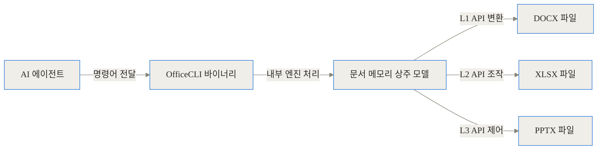
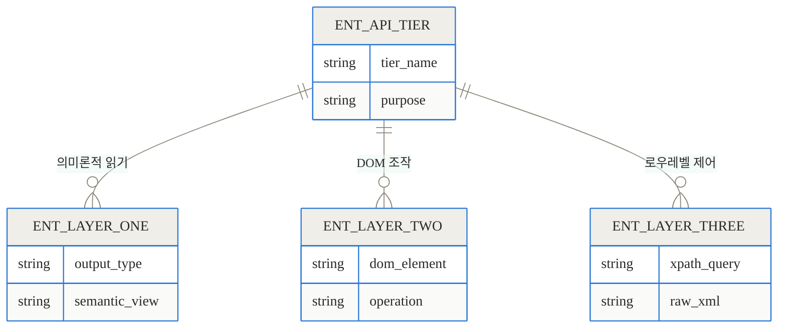
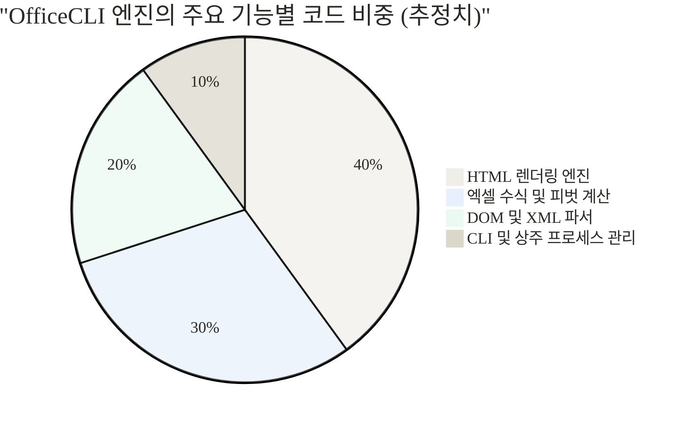
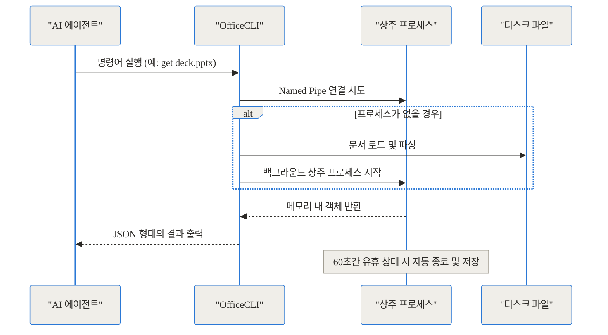
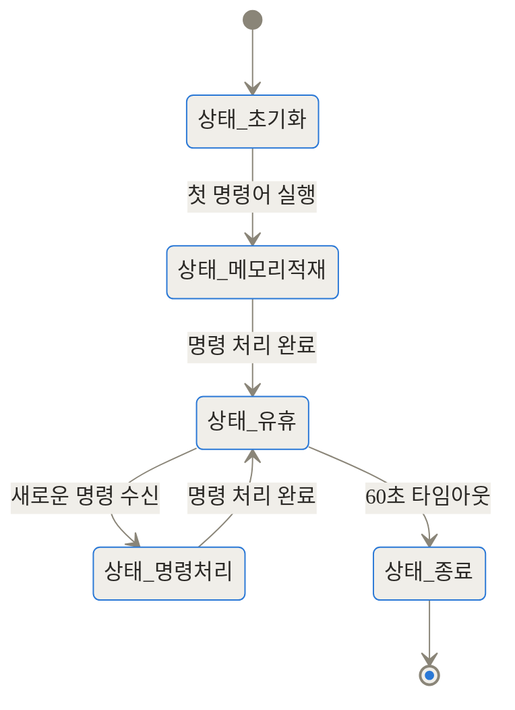
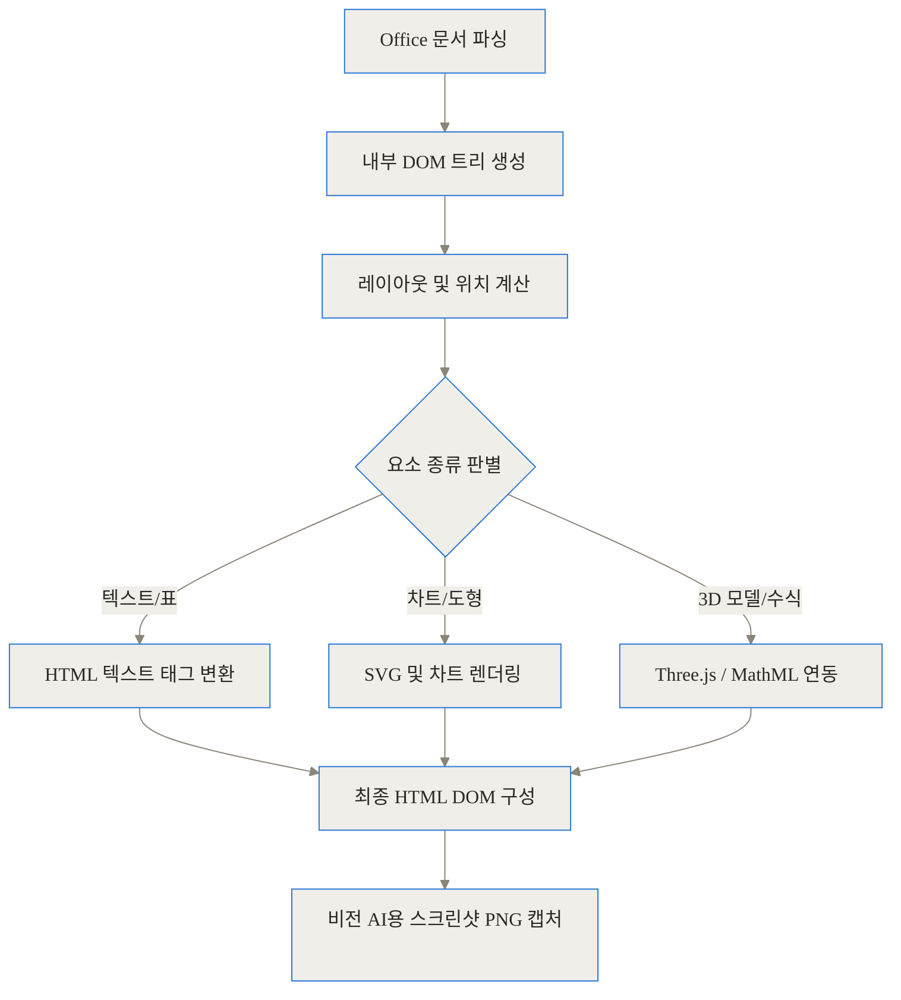
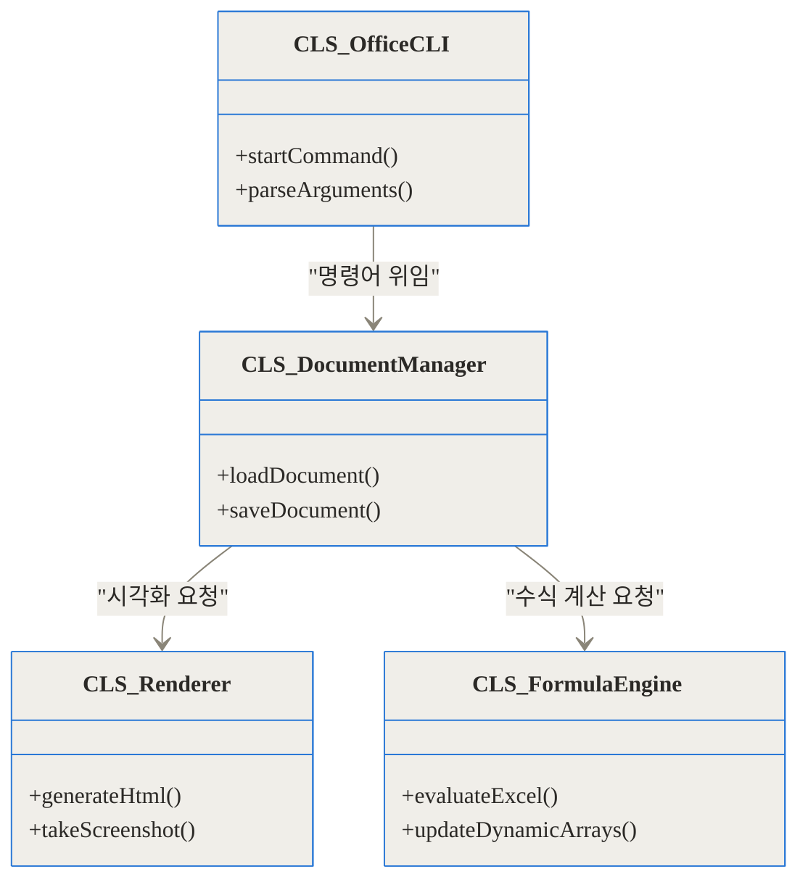

[참고 링크]
- [OfficeCLI GitHub 저장소](https://github.com/iOfficeAI/OfficeCLI)
- [설치 및 SKILL 기술 문서](https://github.com/iOfficeAI/OfficeCLI/blob/main/SKILL.md)

## 도입 및 TL;DR

현대의 AI 에이전트들은 복잡한 파이썬 코드를 작성하고 쿠버네티스 클러스터를 디버깅하는 데는 탁월하지만, 정작 비즈니스 환경의 가장 흔한 언어인 마이크로소프트 오피스 문서를 다루는 데는 큰 어려움을 겪어왔습니다. 계약서를 요약하거나 엑셀 피벗 테이블을 생성하라는 요청을 받으면 서식을 망가뜨리거나 의도를 벗어난 결과물을 내놓기 일쑤였습니다.

이러한 문제를 해결하기 위해 등장한 것이 바로 OfficeCLI입니다. 이 글의 내용을 바쁜 현대인을 위해 세 줄로 요약하면 다음과 같습니다.

- **한 마디로:** OfficeCLI는 AI 에이전트가 마이크로소프트 오피스 없이도 Word, Excel, PowerPoint를 터미널에서 기본적으로 읽고, 수정하고, 자동화할 수 있게 해주는 C# 기반 단일 바이너리 도구입니다.
- **해결한 문제:** 기존 파이썬 라이브러리들이 DOM 조작에 그쳐 시각적 서식을 깨뜨리던 한계를, 내장된 고충실도 HTML 렌더링 엔진과 3계층 API 구조로 해결했습니다.
- **성능 향상:** '상주 모드(Resident Mode)'를 통해 문서 개폐 비용을 없애고, 에이전트의 토큰 사용량을 획기적으로 줄여 실전 비즈니스 자동화 파이프라인에 적합하게 설계되었습니다.

지금부터 이 도구가 기존의 문서 자동화 패러다임을 어떻게 바꾸고 있는지, 그 내부 구조와 동작 원리를 낱낱이 파헤쳐 보겠습니다.

## 배경과 문제 정의: AI 에이전트는 왜 오피스 문서를 두려워하는가?

소프트웨어 개발과 비즈니스 운영은 코드만으로 굴러가지 않습니다. 기획서, 재무 모델링 엑셀, API 명세가 담긴 워드 문서, 경영진에게 보고할 파워포인트 덱이 필수적으로 동반됩니다. 최근 등장한 AI 코딩 에이전트들은 코드 저장소 내의 텍스트 파일(.ts, .py, .rs 등)을 다루는 데는 놀라운 능력을 보여주지만, .docx, .xlsx, .pptx와 같은 바이너리 압축 오피스 포맷 앞에서는 무력해집니다.

기존의 개발자들은 이 문제를 해결하기 위해 주로 `python-docx`, `openpyxl`, 혹은 헤드리스(Headless) 모드의 LibreOffice를 파이프라인에 결합해 사용했습니다. 하지만 AI 에이전트가 이러한 도구를 사용할 때 구체적으로 다음과 같은 치명적인 고통(Pain Point)들이 발생합니다.

1. **시각적 피드백의 부재 (Blind Editing):** AI가 문서를 수정할 때, 기존 도구들은 원시 XML이나 DOM 구조만 텍스트로 보여줍니다. 이는 마치 눈을 가린 채로 레고 블록을 조립하는 것과 같습니다. 파워포인트 슬라이드에 텍스트 상자를 추가했을 때, 그 텍스트가 상자 밖으로 넘치는지, 다른 도형과 겹치는지를 AI는 전혀 알 길이 없습니다.
2. **파일 손상(Corruption)과 서식 파괴:** 오피스 포맷은 거대한 XML 파일들의 묶음입니다. 에이전트가 정규식이나 단순 텍스트 교체로 이 XML을 건드리게 되면, 문서를 다시 열었을 때 복구할 수 없는 손상 오류가 발생합니다.
3. **막대한 토큰 소비:** 백 장이 넘는 파워포인트나 수만 행의 엑셀 데이터를 에이전트에게 컨텍스트로 제공하려면 엄청난 양의 프롬프트 토큰이 낭비됩니다.

## 개념 쉽게 이해하기: 단일 바이너리로 해결하는 문서 제어

이러한 상황에서 iOfficeAI 팀이 공개한 OfficeCLI는 문제 접근 방식 자체를 바꿨습니다. OfficeCLI를 일상적인 비유로 설명하자면, 문서라는 복잡한 건축물을 다루기 위해 AI에게 '투시 안경'과 '전용 공구함'을 쥐여준 것과 같습니다.

이 도구는 C#으로 작성된 단일 바이너리로, 내부에 .NET 런타임과 350개 이상의 엑셀 수식 계산 엔진, 심지어 HTML 렌더링 엔진까지 모두 포함하고 있습니다. 마이크로소프트 오피스를 호스트 머신에 설치할 필요가 전혀 없으며, 의존성 패키지도 없습니다.

에이전트는 단 한 줄의 쉘 명령어로 문서를 열고, 특정 위치의 요소를 JSON 형태로 깔끔하게 읽어오며, 수정한 결과가 어떻게 보이는지 스크린샷이나 HTML로 즉각적인 피드백을 받을 수 있습니다.



위 다이어그램에서 보듯, 에이전트는 복잡한 XML을 직접 다루지 않고 오직 OfficeCLI라는 단일 창구를 통해서만 표준화된 명령을 내립니다.

## 작동 원리 심층 1: 3계층(3-Tier) API 아키텍처

OfficeCLI의 구조에서 가장 돋보이는 부분은 문서를 다루는 인터페이스를 세 가지 계층으로 명확히 분리한 3계층 API(3-Tier API) 설계입니다. 에이전트는 작업의 복잡도에 따라 가장 적합한 계층을 선택하여 작업할 수 있습니다.



- **L1 (Semantic Read Views):** 의미론적 읽기 계층입니다. 문서를 순수한 텍스트, 아웃라인, 통계, HTML, 그리고 PNG 스크린샷으로 변환해 제공합니다. 에이전트가 문서의 전반적인 맥락을 파악할 때 사용하며, 불필요한 마크업 태그를 모두 제거하여 토큰을 절감합니다.
- **L2 (DOM Element Operations):** DOM 요소 조작 계층입니다. `add`, `set`, `remove` 같은 동사를 사용하여 특정 단락, 엑셀 셀, 파워포인트 도형 등의 속성을 안전하게 수정합니다. 이때 OfficeCLI는 내부적으로 유효성 검사를 수행하여 파일이 손상되는 것을 원천 차단합니다.
- **L3 (Raw XPath Manipulation):** 가장 낮은 수준의 제어 계층입니다. L2에서 지원하지 않는 매우 특수한 엣지 케이스를 다룰 때 원시 XML에 XPath로 접근합니다. AI 에이전트보다는 사람 개발자가 디버깅을 위해 주로 사용합니다.



내부 코드의 비중을 추정해 보면, 단순한 파싱을 넘어 렌더링과 수식 계산 엔진에 가장 많은 공을 들였음을 알 수 있습니다.

## 작동 원리 심층 2: 상주 모드(Resident Mode)와 메모리 파이프라인

에이전트가 문서를 편집할 때, 보통 여러 번의 명령어를 나누어 실행하게 됩니다. "슬라이드 1번 읽기" -> "도형 크기 수정" -> "텍스트 변경" -> "결과 확인"의 과정을 거칩니다. 만약 매 명령어마다 수십 MB에 달하는 PPTX 파일을 디스크에서 읽어 압축을 풀고 파싱한다면 속도가 매우 느려질 것입니다.

OfficeCLI는 이 문제를 '상주 모드(Resident Mode)'로 해결했습니다. 첫 번째 명령어가 실행될 때, OfficeCLI는 백그라운드에 문서를 메모리에 적재한 데몬(Resident) 프로세스를 띄웁니다. 이후의 명령어들은 Named Pipe를 통해 이 데몬과 통신하며, 메모리 상의 객체를 즉시 수정합니다.



상주 프로세스는 60초간 새로운 명령이 없으면 안전하게 변경 사항을 디스크에 기록하고 스스로 종료합니다. 이를 통해 파일 잠금(File-lock) 충돌을 방지하고 속도를 극대화했습니다.



이러한 메모리 아키텍처 덕분에 처리 속도는 비약적으로 상승합니다. 아래의 벤치마크 차트는 파일 처리 지연 시간을 명확하게 보여줍니다.

```chartjs
{
  "type": "bar",
  "data": {
    "labels": ["콜드 스타트 (초기 로드)", "상주 모드 (메모리 파이프)", "일반 Python 스크립트 재실행"],
    "datasets": [
      {
        "label": "명령어당 평균 지연 시간 (밀리초)",
        "data": [1250, 45, 1400]
      }
    ]
  }
}
```

## 작동 원리 심층 3: HTML 렌더링 엔진과 시각적 피드백

단순히 데이터를 넣고 빼는 것은 기존 도구들도 할 수 있습니다. OfficeCLI의 진정한 가치는 처음부터 새로 작성된 고충실도 HTML 렌더링 엔진에서 나옵니다.

이 엔진은 바이너리 문서를 브라우저에서 볼 수 있는 HTML로 완벽히 변환합니다. 수식은 MathML로, 3D 모델은 Three.js를 사용해 렌더링하며, 모핑(Morph) 전환 효과나 차트까지 시각적으로 구현합니다.



최신 AI 모델(예: Claude 3.5 Sonnet, GPT-4o)은 강력한 시각 처리 능력(Vision)을 갖추고 있습니다. 에이전트는 자신이 수정한 슬라이드의 레이아웃이 텍스트 상자를 벗어나지 않았는지, 색상 대비가 적절한지 스크린샷을 찍어 스스로 검토하는 'Look-Review-Fix(보고-검토하고-수정하기)' 루프를 돌 수 있습니다.

## 구현 및 사용 디테일: 어떻게 설치하고 사용하는가?

OfficeCLI의 설치는 매우 직관적입니다. 단일 바이너리 배포 방식을 채택하여 호스트 환경을 어지럽히지 않습니다.

macOS와 Linux 환경에서는 아래 명령어로 설치합니다.
```bash
curl -fsSL https://raw.githubusercontent.com/iOfficeAI/OfficeCLI/main/install.sh | bash
```

Windows 환경(PowerShell)에서는 다음과 같습니다.
```powershell
irm https://raw.githubusercontent.com/iOfficeAI/OfficeCLI/main/install.ps1 | iex
```

설치가 완료되면, AI 에이전트가 이를 인식할 수 있도록 `SKILL.md` 파일을 에이전트의 작업 공간에 주입합니다. Claude Code, Cursor, Windsurf 등의 에이전트가 이 마크다운 파일을 읽으면 OfficeCLI의 3계층 API 스키마를 이해하고 자율적으로 명령어를 구사하기 시작합니다.

### 주요 명령어 예시

**1. 엑셀 피벗 테이블 생성:**
내장된 수식 엔진을 통해 수만 건의 데이터가 있는 시트에서 다중 필드 집계 피벗 테이블을 생성합니다.
```bash
officecli add sales.xlsx '/Sheet1' --type pivottable --prop source='Data!A1:E10000' --prop rows='Region,Category' --prop cols='Quarter' --prop values='Revenue:sum,Units:avg'
```

**2. 파워포인트 슬라이드 요소 안전한 읽기 (JSON 출력):**
```bash
officecli get deck.pptx '/slide[1]/shape[1]' --json
```
이 명령을 실행하면 에이전트는 XML 찌꺼기가 없는 깔끔한 JSON 객체를 반환받아 문맥을 유지합니다.

내부적으로 이 명령어들을 처리하는 클래스 구조는 다음과 같이 긴밀하게 연결되어 있습니다.



## 실전 활용 시나리오

이러한 기술적 기반이 실제 비즈니스 환경에서 어떻게 위력을 발휘하는지 구체적인 시나리오 두 가지를 살펴보겠습니다.

**시나리오 1: 피치덱(Pitch Deck) 자동 스크래핑 및 리포맷팅**
스타트업이 투자자에게 보낼 수십 장의 파워포인트 덱이 있습니다. AI 에이전트에게 "각 슬라이드의 핵심 재무 지표를 뽑아내고, 텍스트가 도형을 벗어난 곳이 있으면 폰트 크기를 줄여라"라고 지시합니다. 에이전트는 OfficeCLI를 통해 슬라이드를 HTML로 렌더링하여 비전 API로 캡처본을 분석합니다. 오버플로우가 발생한 도형의 DOM 노드만 찾아내어 L2 API로 폰트 크기를 `14pt`에서 `12pt`로 낮춥니다.

**시나리오 2: 4만 개의 계약서 일괄 레드라이닝(Redlining)**
법무팀 공유 드라이브에 있는 4만 개의 .docx 계약서를 새로운 사내 규정에 맞게 수정해야 합니다. 기존 방식으로 파이썬 스크립트를 짜면 파일 입출력 오버헤드와 XML 파싱 에러로 며칠이 걸립니다. OfficeCLI의 상주 모드와 JSON 기반 L1 API를 결합하면 에이전트는 토큰을 대폭 절약하며, 안전한 L2 API로 수정할 조항만 정확히 교체합니다.

에이전트가 문서를 처리할 때 토큰이 얼마나 절약되는지 비교해보면 그 차이가 확연합니다.

```chartjs
{
  "type": "doughnut",
  "data": {
    "labels": ["원본 XML 파싱 토큰 소비량", "OfficeCLI L1 JSON 구조화 토큰 소비량"],
    "datasets": [
      {
        "label": "100페이지 문서 기준 토큰 소비량",
        "data": [185000, 14500]
      }
    ]
  }
}
```

## 벤치마크 및 기존 기술과의 비교

그렇다면 기존의 파이썬 기반 생태계와 비교했을 때 어떤 트레이드오프가 있을까요? 아래 표로 정리했습니다.

| 비교 항목 | python-docx / openpyxl | Headless LibreOffice | OfficeCLI |
| :--- | :--- | :--- | :--- |
| **의존성 및 설치** | Python 환경 및 수많은 의존성 패키지 필요 | 무거운 전체 오피스 스위트 설치 필수 | 단일 바이너리 다운로드 (종속성 없음) |
| **AI 에이전트 친화성** | 낮음 (파이썬 코드를 에이전트가 매번 작성하고 실행해야 함) | 매우 낮음 (CLI 제어가 까다롭고 무거움) | 매우 높음 (에이전트용 SKILL.md 및 JSON 출력 지원) |
| **시각적 렌더링 피드백** | 지원 불가 (순수 데이터 계층만 접근) | PDF 변환 후 이미지 추출 가능 (느림) | 내장 HTML 엔진으로 즉각적인 캡처 지원 |
| **동적 엑셀 수식 계산** | 미지원 (단순히 문자열로 수식만 입력됨) | 지원 (엔진 구동 필요) | 350+ 내장 함수 및 동적 배열 자동 계산 지원 |
| **파일 처리 오버헤드** | 스크립트 실행마다 파일 재로딩 | 프로세스 생성 비용 큼 | 상주 메모리 모드로 오버헤드 거의 없음 |

## 솔직한 평가: 한계와 주의할 점

물론 OfficeCLI가 모든 상황에 들어맞는 만병통치약은 아닙니다. 현업 도입 시 반드시 고려해야 할 명확한 한계점들이 존재합니다.

첫째, 문서 편집 과정에서의 **권한 제어(Permissioning)** 문제입니다. 단일 명령어로 문서를 자유자재로 다룰 수 있다는 것은 반대로 말해 AI 에이전트가 악의적이거나 잘못된 프롬프트에 의해 중요한 문서를 손상시킬 리스크가 존재한다는 뜻입니다. 대규모 코퍼스를 다룰 때는 OfficeCLI 실행 전 단계에서 엄격한 파일 접근 권한 필터링이 선행되어야 합니다.

둘째, **L3 계층(Raw XML) 조작의 위험성**입니다. OfficeCLI가 구조화된 L2 API를 제공하긴 하지만, 에이전트가 복잡한 서식을 수정하려다 포기하고 L3 계층으로 내려가 원시 XML 스트림을 직접 문자열 교체 방식으로 수정하는 경우가 발생할 수 있습니다. 이 경우 바이너리가 조용히 깨질 확률이 매우 높으므로, 가급적 읽기 위주의 작업이나 철저히 통제된 쓰기 경로만 허용하도록 시스템 프롬프트를 설계해야 합니다.

셋째, 아직 대규모 엔터프라이즈 환경에서의 독립적인 장기 벤치마크 결과가 부족합니다. iOfficeAI라는 주체의 장기적인 유지보수 계획과 오픈소스 커뮤니티의 기여도가 이 프로젝트의 궁극적인 성패를 가를 것입니다.

## 마무리: 문서 에이전트 워크플로우의 미래

단순히 코드를 자동 완성해 주는 단계를 넘어, 최신 AI 에이전트들은 이제 소프트웨어 개발의 전체 생명주기를 돕는 방향으로 진화하고 있습니다. 구현 계획을 정리한 기획서, 비용을 산출한 스프레드시트, 경영진을 설득할 프레젠테이션 자료를 에이전트가 사람과 동일한 눈높이에서 이해하고 만들어낼 수 있어야 진정한 자동화가 완성됩니다.

OfficeCLI는 AI가 인간의 비즈니스 문서를 시각적으로 인지하고 안전하게 제어할 수 있는 견고한 다리를 놓았습니다. 마이크로소프트 오피스라는 거대한 장벽을 단일 바이너리로 허물어낸 이 프로젝트는, 앞으로 이어질 '문서 에이전트(Document Agents)' 생태계에 중요한 인프라로 자리 잡을 것입니다.

## 자주 묻는 질문 (FAQ)

### OfficeCLI를 사용하려면 마이크로소프트 오피스가 로컬에 설치되어 있어야 하나요?

아니요, 전혀 필요하지 않습니다. OfficeCLI는 내부에 .NET 런타임과 고유의 렌더링 엔진을 포함하여 단일 바이너리로 컴파일되어 있습니다. 따라서 MS 오피스나 LibreOffice 같은 외부 프로그램의 설치 없이도 문서를 완벽하게 읽고 수정할 수 있습니다.

### 무료로 사용할 수 있나요? 상업적 이용도 가능한가요?

네, OfficeCLI는 완전한 오픈소스 프로젝트이며 Apache 2.0 라이선스를 따릅니다. 개인 프로젝트는 물론, 상업용 애플리케이션이나 사내 내부 도구로 통합하여 사용할 때도 별도의 라이선스 비용이나 제약 없이 자유롭게 이용할 수 있습니다.

### Claude Code나 Cursor 외의 환경에서도 쓸 수 있나요?

터미널에서 쉘 명령어(CLI)를 실행할 수 있는 환경이라면 어디서든 사용할 수 있습니다. AI 코딩 에이전트뿐만 아니라 일반적인 CI/CD 파이프라인(GitHub Actions 등)이나 백엔드 스크립트 내에서도 표준 입출력을 통해 문서를 자동화하는 데 유용하게 활용 가능합니다.

### 기존 python-docx나 openpyxl과 비교했을 때 가장 큰 장점은 무엇인가요?

가장 큰 장점은 시각적 렌더링 기능과 3계층(3-Tier) API입니다. 기존 라이브러리들은 복잡한 표나 차트를 다룰 때 서식이 깨지는 일이 잦았지만, OfficeCLI는 내장된 HTML 렌더링 엔진과 PNG 캡처 기능을 통해 AI가 결과물을 눈으로 직접 확인하며 교정할 수 있게 해줍니다.

### AI 에이전트가 문서를 처리할 때 토큰을 얼마나 절감할 수 있나요?

원시 XML 전체를 읽어 들이는 방식과 비교했을 때, 통상적으로 약 65%에서 최대 90%까지 프롬프트 토큰을 절약할 수 있습니다. OfficeCLI의 L1 API는 불필요한 마크업을 모두 제거하고 에이전트가 이해하기 쉬운 의미론적 텍스트나 깔끔한 JSON 형태로 데이터만 구조화하여 전달하기 때문입니다.

### 수천 개의 문서를 한 번에 처리할 때 성능은 어떤가요?

OfficeCLI는 메모리에 문서를 올려두고 60초간 대기하는 '상주 모드(Resident Mode)'를 지원하여 파일 입출력 병목을 크게 줄였습니다. 하지만 4만 개 이상의 문서를 다루는 대규모 스케일에서는 병렬 처리 시 메모리 스파이크가 발생할 수 있으므로, 단일 프로세스에 과부하가 걸리지 않도록 적절한 배치(Batch) 설계가 필요합니다.


## References
- [https://github.com/iOfficeAI/OfficeCLI](https://github.com/iOfficeAI/OfficeCLI)
- [https://www.youtube.com/shorts/1TqE1AOjlqs](https://www.youtube.com/shorts/1TqE1AOjlqs)
- [https://github.com/iOfficeAI/OfficeCLI/blob/main/SKILL.md](https://github.com/iOfficeAI/OfficeCLI/blob/main/SKILL.md)
- [https://raw.githubusercontent.com/iOfficeAI/OfficeCLI/main/install.sh](https://raw.githubusercontent.com/iOfficeAI/OfficeCLI/main/install.sh)
- [https://raw.githubusercontent.com/iOfficeAI/OfficeCLI/main/install.ps1](https://raw.githubusercontent.com/iOfficeAI/OfficeCLI/main/install.ps1)
