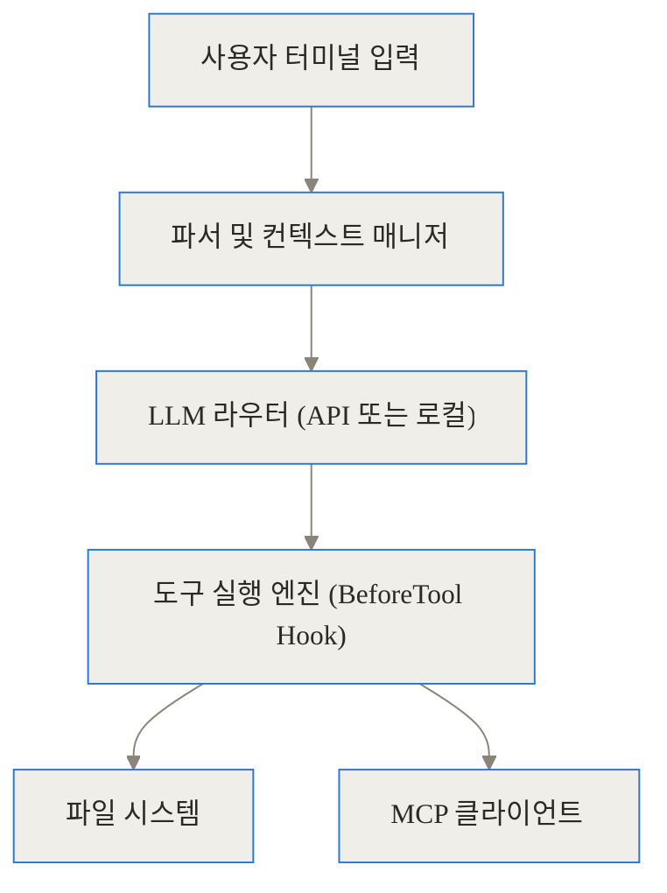
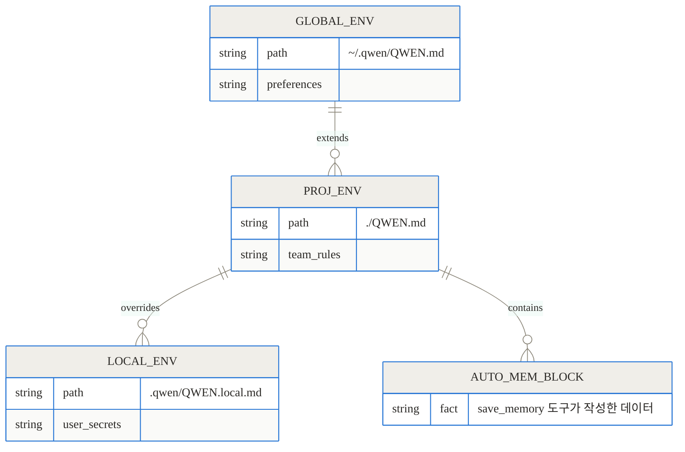
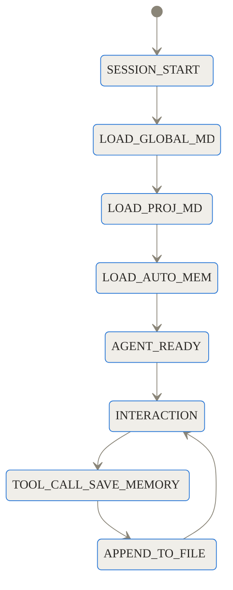
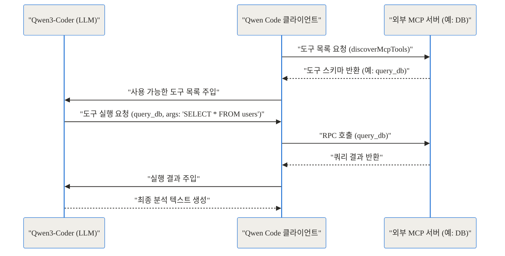
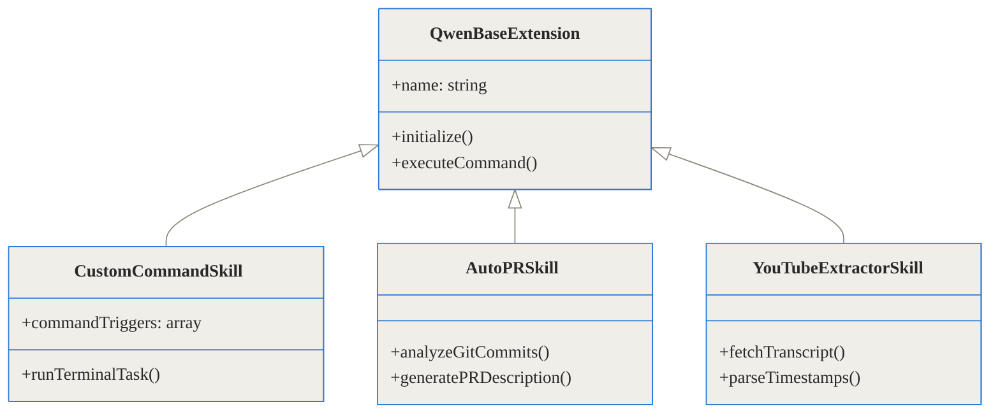
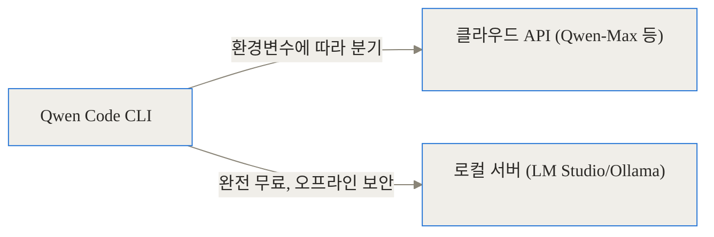
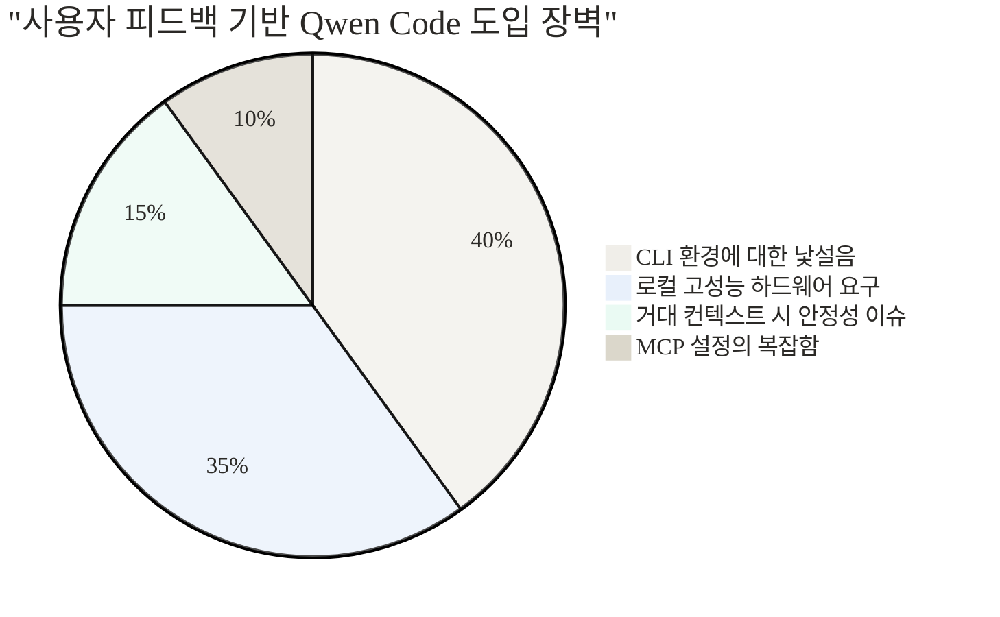

[관련 링크]
- [Qwen Code GitHub 저장소](https://github.com/QwenLM/qwen-code)
- [Qwen3-Coder 모델](https://github.com/QwenLM/Qwen3-Coder)
- [Qwen Code 실제 활용 사례 모음](https://github.com/QwenLM/qwen-code-examples)

---

## 도입

**TL;DR (한 줄 요약)**
- **무엇인가:** 터미널에 상주하며 파일 시스템을 읽고 쓰고 실행할 수 있는 오픈소스 AI 코딩 에이전트(CLI)입니다.
- **핵심 기술:** 단기적인 대화의 한계를 극복하는 **다층 코드베이스 메모리(QWEN.md)**와, 어떤 외부 API나 데이터베이스도 도구로 연결할 수 있는 **MCP(Model Context Protocol)**를 지원합니다.
- **가치:** 로컬 모델(LM Studio 등)과 연결하면 값비싼 클라우드 API 호출 없이, 데이터 유출 걱정 없는 완전한 오프라인 자동화 개발 환경을 구축할 수 있습니다.

개발자의 작업 환경은 빠르게 변하고 있습니다. 단순한 자동완성을 넘어, 복잡한 요구사항을 주고 여러 파일을 동시에 수정하는 에이전트 기반의 개발이 주류로 자리 잡기 시작했습니다. 하지만 기존의 AI 코딩 도구들은 심각한 문제들을 안고 있었습니다. 매번 새로운 세션마다 팀의 코딩 컨벤션을 잊어버리고, 회사 내부의 데이터베이스나 특정 외부 도구에는 접근할 수 없었으며, 대규모 코드베이스를 분석할 때마다 감당하기 힘든 API 청구서를 발행했습니다.

알리바바 Qwen 팀이 공개한 **Qwen Code**는 바로 이러한 고통을 해결하기 위해 등장한 오픈소스 터미널 CLI 도구입니다. 이 글에서는 Qwen Code가 어떻게 '진짜로 코드를 기억'하고, 외부 세계와 소통하며, 종국에는 우리의 터미널을 어떻게 완벽한 자율 에이전트 환경으로 바꾸는지 그 내부 원리를 깊이 파헤쳐 봅니다.

---

## 배경과 문제 정의: 기존 AI 코딩 도구의 한계

Qwen Code가 어떤 기술적 혁신을 이뤘는지 이해하려면, 먼저 우리가 기존 AI 코딩 도구를 사용하며 겪었던 구체적인 불편함(Pain Point)을 짚고 넘어가야 합니다.

1. **컨텍스트 상실(Amnesia)의 고통**
   채팅 기반의 AI 도구는 새로운 스레드를 열 때마다 '백지 상태'가 됩니다. "우리는 React를 쓰지만 상태 관리는 Zustand로 해", "이 프로젝트에서는 무조건 싱글 쿼트를 사용해" 같은 팀의 고유한 규칙을 매 세션마다 다시 설명해야 합니다. 복사해서 붙여넣는 과정은 번거롭고, 사람이 실수로 누락하면 AI는 여지없이 엉뚱한 코드를 생성합니다.

2. **닫힌 생태계와 권한의 부재**
   대부분의 상용 AI 에디터는 철저히 자신들의 샌드박스 안에서만 동작합니다. 사내 깃랩(GitLab) 이슈를 읽어오거나, 로컬에서 실행 중인 포스트그레스(PostgreSQL) 데이터베이스의 스키마를 쿼리해서 코드를 작성하는 것은 불가능했습니다. AI는 코드를 짤 수는 있었지만, 코드가 상호작용해야 할 '외부 세계'와는 단절되어 있었습니다.

3. **비용과 프라이버시 문제**
   대규모 레포지토리를 AI에게 분석시키는 작업은 엄청난 양의 토큰을 소모합니다. 특히 보안이 중요한 금융권이나 엔터프라이즈 환경에서는 회사의 핵심 자산인 소스 코드를 클라우드 API로 전송하는 것 자체가 보안 규정 위반이 되는 경우가 많습니다.

Qwen Code는 이 세 가지 문제를 **메모리 아키텍처**, **MCP 표준 프로토콜**, 그리고 **로컬 모델 연동 지원**이라는 명확한 기술적 해법으로 돌파합니다.

---

## 개념 쉽게 이해하기: 터미널에 출근한 새로운 동료

이해를 돕기 위해 Qwen Code를 '여러분의 터미널에 오늘 첫 출근한 시니어 개발자'라고 상상해 보겠습니다.

이 동료는 아주 똑똑하지만, 여러분 회사의 규칙은 모릅니다. 그래서 여러분은 신입사원 온보딩 문서(`QWEN.md`)를 건네줍니다. 이 문서에는 팀의 아키텍처 규칙과 선호하는 라이브러리 목록이 적혀 있습니다. 이 동료는 매일 아침 업무를 시작할 때(세션 시작) 이 문서를 먼저 읽고 기억합니다.

일을 하다가 이 동료는 중요한 사실을 스스로 깨닫습니다. "아, 이 프로젝트는 빌드할 때 npm 대신 pnpm을 써야 하는구나." 동료는 포스트잇(`save_memory` 도구)에 이 사실을 적어서 모니터에 붙여둡니다. 다음 날이 되어도 이 사실을 잊지 않습니다.

어느 날, 동료가 회사 내부 데이터베이스를 조회해야 하는 상황이 생겼습니다. 여러분은 그에게 만능 전화기(MCP)를 줍니다. 이 전화기에는 내선 번호가 저장되어 있어서, 언제든 데이터베이스 부서나 클라우드 부서로 전화를 걸어 필요한 데이터를 직접 받아올 수 있습니다.

이것이 바로 Qwen Code가 작동하는 방식입니다. 단순한 텍스트 생성기가 아니라, 지시사항을 영구적으로 기억하고, 스스로 메모를 남기며, 프로토콜을 통해 외부 시스템과 대화하는 주체적인 에이전트입니다.

---

## 작동 원리 심층 분석 (Under the Hood)

이제 겉으로 보이는 비유를 걷어내고, Qwen Code의 내부를 소프트웨어 엔지니어링 관점에서 샅샅이 분해해 보겠습니다.


### 1. 아키텍처 파이프라인 (Architecture Pipeline)

Qwen Code는 Node.js 기반의 CLI 애플리케이션으로 구축되어 있습니다. 핵심 아키텍처는 사용자 입력을 해석하고, 컨텍스트를 조립하여 LLM에 전달한 뒤, 그 결과를 터미널 명령이나 파일 시스템 수정으로 번역하는 파이프라인으로 구성됩니다.



사용자가 터미널에 프롬프트를 입력하면, 파서(Parser)가 프로젝트 내의 특정 파일을 지칭하는 `@filename` 문법을 해석하여 해당 파일의 내용을 컨텍스트에 주입합니다. 이후 Qwen3-Coder와 같은 모델이 이 컨텍스트를 바탕으로 추론을 진행하고, 단순히 텍스트를 반환하는 것이 아니라 실행 가능한 JSON 형태의 도구 호출(Tool Calling) 명세를 반환합니다. 도구 실행 엔진은 모델이 내린 명령을 검증하고 실제 파일 변경이나 터미널 스크립트 실행으로 옮깁니다.

### 2. 다층 코드베이스 메모리 엔진 (Codebase Memory)

가장 주목해야 할 부분은 세션이 종료되어도 지식이 유지되도록 설계된 메모리 엔진입니다. Qwen Code는 컨텍스트를 세 가지 계층으로 나누어 관리합니다.



1. **글로벌 스코프 (`~/.qwen/QWEN.md`)**: 사용자의 전역 설정입니다. 어떤 프로젝트를 하든 유지되는 개인적인 코딩 스타일이나 선호하는 셸 환경 등을 기록합니다.
2. **프로젝트 스코프 (`./QWEN.md`)**: 팀 단위로 소스 컨트롤(Git)에 커밋하여 공유하는 규칙입니다. 아키텍처 패턴, 네이밍 컨벤션, 빌드 명령어 등이 포함됩니다.
3. **로컬 프라이빗 스코프 (`.qwen/QWEN.local.md`)**: 개인의 클러스터 ID나 로컬 전용 디버그 명령어 등 Git에 올라가면 안 되는 민감한 정보를 담습니다.

특히 **자동 메모리(Auto-memory)** 기능이 매우 강력합니다. 모델은 내장된 `save_memory` 도구를 사용할 수 있습니다. 대화 중 사용자가 "여기서는 항상 예외 처리를 커스텀 에러 클래스로 감싸줘"라고 지시하면, 모델은 백그라운드에서 `save_memory(fact="예외 처리는 커스텀 에러 클래스 사용")` 함수를 호출합니다. 이 내용은 마크다운 파일 하단의 `## Qwen Added Memories` 섹션에 물리적으로 기록되어 영구적으로 보존됩니다.



### 3. MCP (Model Context Protocol) 기반 도구 확장

MCP는 AI 에이전트가 외부 시스템과 통신하는 방식을 표준화한 프로토콜입니다. Qwen Code는 `packages/core/src/tools/` 디렉토리 하위에 정교한 MCP 통합 계층을 구현했습니다.

- **디스커버리 계층 (`mcp-client.ts`)**: `settings.json`의 `mcpServers` 설정에 등록된 서버들을 순회하며 연결을 맺습니다. Stdio, SSE, HTTP 스트림 등 다양한 트랜스포트 방식을 지원합니다. 연결이 수립되면 서버로부터 사용 가능한 도구들의 JSON 스키마를 가져와(Fetch) 글로벌 도구 레지스트리에 등록합니다.
- **실행 계층 (`mcp-tool.ts`)**: LLM이 특정 도구를 호출하기로 결정하면, `DiscoveredMCPTool` 인스턴스가 이 요청을 가로채 적절한 매개변수와 함께 원격 MCP 서버로 전달합니다. 서버의 응답은 다시 LLM의 컨텍스트로 주입됩니다.



이러한 구조 덕분에 개발자는 `qwen mcp add --transport http my-server [http://localhost:3000/mcp](http://localhost:3000/mcp)` 명령어 한 줄로 사내 시스템을 에이전트의 팔다리로 만들 수 있습니다.

### 4. 거대 컨텍스트 처리와 Qwen3-Coder

Qwen Code의 진정한 위력은 백엔드에서 작동하는 모델의 역량과 결합할 때 나옵니다. 특히 `Qwen3-Coder-480B-A35B-Instruct`와 같은 MoE(Mixture-of-Experts) 모델은 총 4800억 개의 파라미터를 갖추고 있으면서도 추론 시에는 350억 개만 활성화하여 효율성을 극대화합니다.

더 중요한 것은 **컨텍스트 윈도우**입니다. 네이티브 256K 토큰을 지원하며, Yarn 외삽법(extrapolation)을 통해 최대 1M 토큰까지 처리할 수 있습니다. 이는 수백 개의 파일로 이루어진 거대한 엔터프라이즈 코드베이스 전체를 한 번에 메모리에 올리고, 아키텍처 간의 종속성을 파악하며 리팩토링을 수행할 수 있음을 의미합니다.

### 5. 도구 및 확장(Extensions) 생태계

`qwen-code-examples` 저장소를 보면 Qwen Code가 지원하는 확장의 깊이를 알 수 있습니다. 사용자 정의 커맨드, SDK 래핑, 그리고 고차원적인 작업 흐름을 묶어놓은 '스킬(Skills)' 시스템이 존재합니다.



---

## 구현 및 사용 디테일

이 강력한 도구를 내 로컬 환경에 구축하는 과정은 생각보다 훨씬 간단합니다.

### 1. 설치 및 환경 구성

Node.js(v18 이상 권장)가 설치된 환경에서 글로벌 패키지로 설치합니다.

```bash
npm install -g @qwen-code/qwen-code@latest
```

설치 후 터미널에서 `qwen` 명령어를 입력하면 즉시 대화형 인터페이스가 시작됩니다.

### 2. 비용을 0원으로 만드는 로컬 모델 연동

클라우드 API(OpenAI 호환)를 사용할 수도 있지만, Qwen Code의 가장 매력적인 활용법은 LM Studio나 Ollama를 이용해 오프라인 로컬 환경을 구축하는 것입니다.

1. LM Studio에서 `Qwen3-Coder` GGUF 모델을 다운로드합니다.
2. LM Studio의 로컬 서버 기능을 켭니다 (기본 포트: 1234).
3. 터미널에서 Qwen Code가 로컬 서버를 바라보도록 환경변수를 설정합니다.

```bash
export OPENAI_API_KEY="local-dummy-key"
export OPENAI_BASE_URL="http://localhost:1234/v1"
qwen
```

이제 네트워크 연결이 끊긴 비행기 안에서도 최고 수준의 AI 에이전트와 함께 코딩할 수 있습니다. 텔레메트리(원격 데이터 수집)가 걱정된다면 커뮤니티에서 유지보수하는 `qwen-code-no-telemetry` 포크 버전을 사용하는 것도 좋은 선택입니다.



### 3. MCP 서버 등록 및 연동

외부 도구를 연결하려면 설정 파일이나 CLI 명령을 사용합니다. 예를 들어, 데이터베이스나 특정 내부 API를 래핑한 커스텀 MCP 서버가 로컬 3000 포트에서 돌고 있다면 아래와 같이 등록합니다.

```bash
qwen mcp add --transport http my-internal-tool http://localhost:3000/mcp
```

이후 Qwen Code 쉘 내부에서 `/mcp` 명령을 입력하면 연동된 서버와 사용 가능한 도구 목록을 시각적으로 확인할 수 있습니다.

---

## 실전 활용 시나리오

이론을 넘어, 실제 현업 트러블슈팅 관점에서 Qwen Code를 어떻게 활용할 수 있는지 구체적인 시나리오를 살펴보겠습니다.

### 시나리오 A: 레거시 모놀리식 아키텍처의 마이크로서비스(MSA) 분리

수만 줄에 달하는 거대한 레거시 결제 모듈을 세 개의 마이크로서비스로 분리해야 한다고 가정해 보겠습니다. 기존 도구에서는 파일 하나씩 복사해서 함수를 나눠달라고 요청해야 했지만, Qwen Code에서는 다음과 같이 진행됩니다.

1. `QWEN.md`에 새로운 MSA의 의존성 규칙과 폴더 구조(예: "모든 서비스는 개별적인 `package.json`을 가지며, 공유 코드는 `@shared` 로 임포트한다")를 명시합니다.
2. 터미널에서 `qwen`을 실행하고 다음과 같이 프롬프트를 입력합니다.
   > "@src/payments 하위의 모든 코드를 분석해서, 구독(subscription), 단건 결제(one-time), 환불(refund) 세 개의 독립된 서비스 폴더로 코드를 분리하고 필요한 인터페이스를 작성해줘."
3. 모델은 넓은 컨텍스트 윈도우를 활용해 전체 의존성을 맵핑하고, 터미널 명령어를 통해 폴더를 생성한 뒤, 코드를 재배치하고, 스스로 테스트 스크립트를 실행하여 검증까지 완료합니다.

### 시나리오 B: MCP를 활용한 데이터 과학 및 ToolUniverse 연동

과학 연구나 데이터 분석 영역에서도 혁신적입니다. Zitnik Lab의 ToolUniverse 문서에 따르면, 600개 이상의 과학 분석 도구를 MCP 서버로 묶어 Qwen Code와 연결할 수 있습니다.

개발자는 터미널에서 다음과 같이 명령합니다.
> "최근 일주일간의 사용자 트래픽 로그를 내부 DB(MCP 도구)에서 조회한 다음, Pandas를 사용해 이상치(Outlier)를 탐지하는 스크립트를 작성하고 실행 결과를 리포트로 요약해줘."

에이전트는 스스로 DB 조회 도구를 찾아 SQL 쿼리를 실행하고, 반환된 데이터를 바탕으로 파이썬 스크립트를 로컬에 작성한 후 즉시 실행하여 최종 요약본만 개발자에게 전달합니다.

---

## 벤치마크 및 성능 비교

터미널 기반 AI 코딩 도구 생태계에는 Gemini CLI, Claude Code 등 여러 경쟁자가 있습니다. 이들과 Qwen Code를 비교해 보았습니다.

| 비교 항목 | Qwen Code | Claude Code | Gemini CLI |
| :--- | :--- | :--- | :--- |
| **오픈소스 여부** | 완전 오픈소스 (MIT 등) | 비공개 (Closed) | 비공개 (Closed) |
| **로컬 모델 지원** | 완벽 지원 (LM Studio 연동 등) | 미지원 (Anthropic API 필수) | 미지원 (Google API 필수) |
| **코드베이스 메모리** | `QWEN.md` + `save_memory` 자동 기록 | 제한적 히스토리 유지 | 세션별 단발성 |
| **MCP 지원** | 지원 (서버 등록 및 디스커버리) | 지원 (로컬 도구 위주) | 지원 안 함 |
| **컨텍스트 길이** | 256K ~ 최대 1M (모델 의존적) | 최대 200K | 최대 1M ~ 2M |
| **주요 비용** | **무료** (로컬 사용 시) | 높은 API 호출 비용 발생 | API 호출 비용 발생 |

특히 대규모 프로젝트에서 컨텍스트를 로드할 때 발생하는 API 비용은 누적될수록 무시할 수 없는 수준이 됩니다. QWEN.md 메모리와 로컬 모델을 조합했을 때의 토큰 소비 및 비용 절감 효과는 매우 극적입니다.

```chartjs
{
  "type": "bar",
  "data": {
    "labels": ["기존 클라우드 방식 (매번 컨텍스트 전체 전송)", "Qwen Code + 로컬 모델 (자동 메모리 활용)"],
    "datasets": [
      {
        "label": "1주일 작업 기준 누적 API 비용 (달러)",
        "data": [145.5, 0]
      },
      {
        "label": "중복 전송되는 불필요한 프롬프트 토큰 (단위: K)",
        "data": [8500, 250]
      }
    ]
  },
  "options": {
    "responsive": true,
    "plugins": {
      "legend": {
        "position": "bottom"
      }
    }
  }
}
```

위 차트에서 보듯, Qwen Code는 필요한 메모리만 체계적으로 관리하고 로컬에서 추론을 처리할 수 있어, 개발 생산성을 유지하면서도 인프라 비용을 극적으로 낮춥니다.

---

## 솔직한 평가: 한계와 트레이드오프

모든 기술이 그렇듯 Qwen Code 역시 만능은 아닙니다. 현업에 도입하기 전에 반드시 고려해야 할 몇 가지 한계점이 존재합니다.

1. **하드웨어 리소스의 장벽**
   Qwen3-Coder 480B 모델과 같은 고성능 버전을 로컬에서 원활하게 돌리려면 엄청난 VRAM을 갖춘 GPU(또는 클러스터)가 필요합니다. 일반적인 노트북 환경에서는 양자화(Quantization)된 작은 파라미터의 모델을 타협해서 써야 하며, 이는 복잡한 로직 생성 시 품질 저하로 이어질 수 있습니다.

2. **극한의 컨텍스트에서 발생하는 메모리 누수 문제**
   깃허브 이슈 #4254 등에서 보고된 바에 따르면, 수백 개의 파일이 얽힌 거대한 모놀리식 레포지토리를 한 번에 통째로 읽어 들일 때, 애플리케이션이 런타임 메모리를 끝없이 점유하다가 크래시(OOM)가 발생하는 현상이 간혹 나타납니다. 가비지 컬렉션(GC) 최적화가 진행 중이지만, 현시점에서는 `@filename` 문법으로 필요한 파일만 명확히 지정하여 컨텍스트 윈도우를 최적화하는 습관이 필요합니다.

3. **GUI의 부재와 러닝 커브**
   VS Code나 Cursor처럼 마우스 클릭으로 시각적 피드백을 받는 환경에 익숙한 개발자에게 CLI 전용 인터페이스는 다소 답답하게 느껴질 수 있습니다. 마크다운으로 메모리 규칙을 직접 관리해야 하는 점도 초기 진입 장벽으로 작용합니다.



---

## 마무리

Qwen Code의 등장은 AI 코딩 도구의 패러다임이 '인라인 자동완성'에서 '독립된 컨텍스트를 가진 자율 에이전트'로 넘어가고 있음을 상징합니다. 단기 기억상실증에 걸린 것처럼 매번 팀의 규칙을 다시 가르쳐야 했던 과거의 도구들과 달리, Qwen Code는 `QWEN.md`와 `save_memory`를 통해 프로젝트와 함께 성장하는 동료가 됩니다.

무엇보다 가장 큰 가치는 **개방성**입니다. 클라우드 종속성 없이 내 로컬 장비에서 무료로 실행할 수 있고, MCP를 통해 내가 원하는 어떤 도구든 제한 없이 연결할 수 있다는 점은 강력한 자유를 선사합니다. 

완벽한 도구는 아니지만, 터미널과 커맨드라인 환경을 사랑하고 보안과 비용 문제로 상용 AI 코딩 도구 도입을 망설였던 팀이라면 Qwen Code는 지금 당장 시도해 볼 만한 최고의 선택지입니다. 터미널 창을 열고, 여러분만의 든든한 AI 시니어 개발자를 출근시켜 보시기 바랍니다.

## 자주 묻는 질문 (FAQ)

### Qwen Code는 어떤 모델을 사용하나요?

기본적으로 Qwen3-Coder 시리즈(특히 480B-A35B-Instruct 등)에 최적화되어 설계되었습니다. 하지만 OpenAI SDK 인터페이스 호환성을 제공하므로, 로컬 환경의 LM Studio나 Ollama를 통해 Llama 등 다른 오픈소스 모델을 연결하여 사용할 수도 있습니다.

### 기존의 GUI 기반 AI 에디터(Cursor 등)와 무엇이 다른가요?

Qwen Code는 VS Code 같은 GUI 창이 아닌 터미널(CLI) 환경에서 작동하는 자율 에이전트입니다. 단순히 코드만 제안하는 것이 아니라, 파일 시스템을 직접 읽고 쓰고, 깃(Git) 명령어를 실행하며, MCP를 통해 데이터베이스 쿼리나 스크립트 실행까지 터미널에서 한 번에 자동화할 수 있다는 점이 가장 큰 차이입니다.

### API 토큰 비용을 어떻게 절감할 수 있나요?

두 가지 방식으로 비용을 극적으로 낮춥니다. 첫째, LM Studio 등을 활용해 로컬 오픈소스 모델을 연결하면 외부 API 호출 비용이 완전히 0원이 됩니다. 둘째, 자동 메모리(save_memory)와 프로젝트 레벨의 QWEN.md를 통해 매번 반복되는 긴 컨텍스트를 압축하여 전달하므로 불필요한 프롬프트 토큰 낭비를 막아줍니다.

### 회사 내부의 비공개 도구나 데이터베이스도 연결할 수 있나요?

네, 모델 컨텍스트 프로토콜(MCP)을 완벽하게 지원하므로 가능합니다. 회사 내부의 데이터베이스나 커스텀 API를 MCP 서버 형태로 래핑(Wrapping)하기만 하면, Qwen Code가 해당 서버를 자동으로 발견하고 대화 과정에서 도구로 활용할 수 있습니다.

### 메모리 누수나 실행 시 성능 문제는 없나요?

대규모 파일이나 256K 이상의 극단적인 컨텍스트를 한 번에 처리할 때 런타임 메모리를 과도하게 점유하여 크래시가 발생하는 문제(깃허브 이슈 #4254 등)가 일부 보고된 바 있습니다. 아주 방대한 레포지토리 환경에서는 @filename 문법으로 필요한 파일만 명시적으로 참조하여 모델의 컨텍스트 부담을 줄이는 것이 권장됩니다.


## References
- [https://github.com/QwenLM/qwen-code](https://github.com/QwenLM/qwen-code)
- [https://github.com/QwenLM/Qwen3-Coder](https://github.com/QwenLM/Qwen3-Coder)
- [https://github.com/QwenLM/qwen-code-examples](https://github.com/QwenLM/qwen-code-examples)
- [https://qwenlm.github.io/blog/qwen3-coder/](https://qwenlm.github.io/blog/qwen3-coder/)
