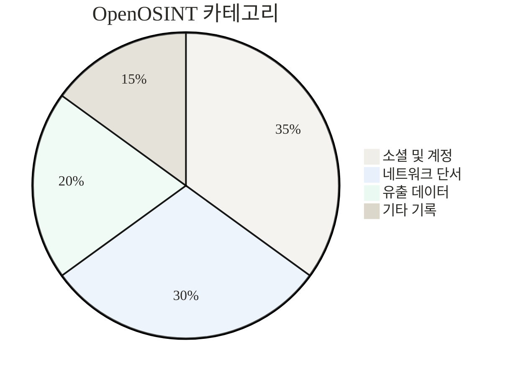
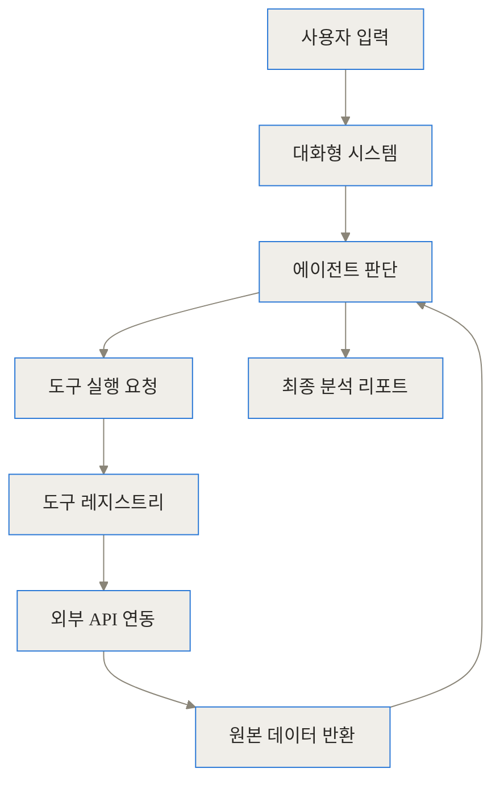
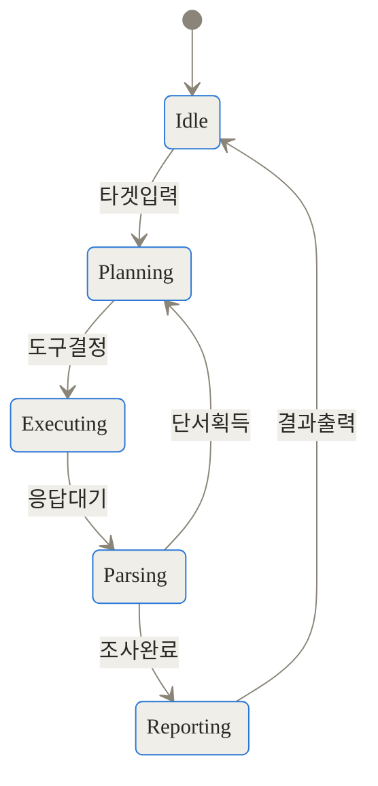
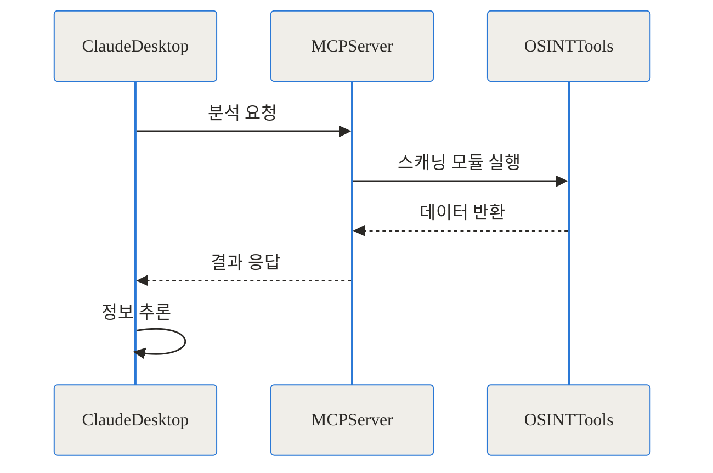
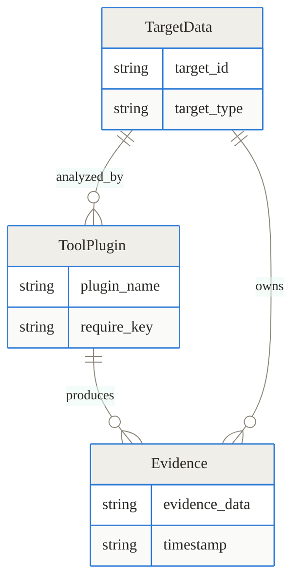
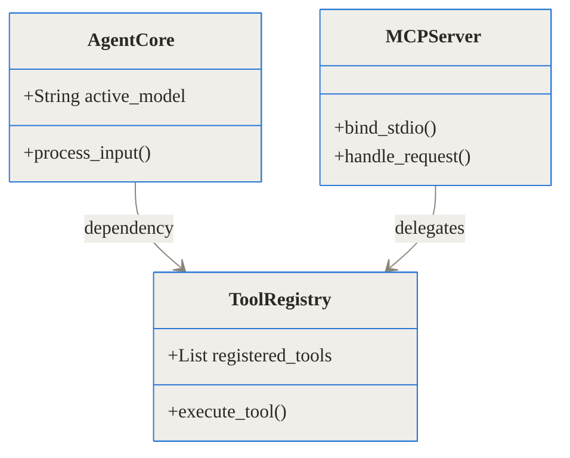

TL;DR
- OpenOSINT는 터미널 환경에서 AI(Claude, GPT-4 등)와 대화하며 대상의 정보를 추적하는 오픈소스 정보 수집 에이전트입니다.
- 16가지 전문 도구를 AI가 스스로 판단하고 연결해 수집 과정을 자동화하며, MCP(Model Context Protocol)를 지원해 다양한 클라이언트 환경에 유연하게 이식할 수 있습니다.
- 단순한 생성형 AI의 한계였던 정보 조작(할루시네이션) 문제를 하드 스탑(Hard Stop) 방식의 실제 도구 실행을 통해 구조적으로 차단합니다.

---

## 수십 개의 탭과 스크립트에 갇힌 정보 수집의 고통

보안 관제 센터(SOC)의 분석가나 모의 해킹 전문가, 혹은 위협 인텔리전스(Threat Intelligence) 연구원들에게 오픈소스 정보 수집(OSINT)은 조사 과정의 가장 첫 단추입니다. 하지만 그 현실은 결코 우아하지 않습니다.

기존 방식에서는 하나의 IP 주소를 추적하기 위해 무수히 많은 과정을 수동으로 반복해야 했습니다. 먼저 터미널을 열어 WHOIS 명령어를 입력해 도메인 등록자의 이메일을 찾고, 그 이메일을 복사해 브라우저 탭을 열어 데이터 유출 확인 사이트(HIBP 등)에 붙여넣습니다. 여기서 특정 사용자 이름(Username)을 발견하면, 다시 터미널로 돌아와 Sherlock 같은 파이썬 스크립트를 실행해 300여 개의 소셜 미디어를 뒤집니다. 이 과정에서 분석가의 모니터는 수십 개의 탭과 터미널 창으로 가득 차게 되며, 각 도구에서 나온 파편화된 데이터는 메모장에 어지럽게 복사 및 붙여넣기 됩니다. 결국 문맥(Context)은 쉽게 유실되고, 분석가의 피로도는 극에 달합니다.

이를 해결하기 위해 등장한 자동화 스크립트 도구들은 특정 순서대로 스캔을 진행하고 결과를 거대한 JSON이나 CSV 파일로 쏟아냅니다. 하지만 사전에 짜여진 로직을 벗어난 새로운 단서가 등장하면 스크립트는 이를 추적하지 못합니다. 생성형 AI에게 "이 IP에 대해 조사해줘"라고 물어보는 시도도 있었지만, 실시간 외부망 접근 권한이 없는 AI는 그럴싸한 가짜 정보(할루시네이션)를 지어내며 신뢰성을 완전히 무너뜨렸습니다.

## OpenOSINT란 무엇인가: AI 기반 자동화 체계의 등장

이러한 정보 수집의 고통을 근본적으로 해결하기 위해 등장한 프로젝트가 바로 OpenOSINT입니다. OpenOSINT는 수동 검색의 정확성과 스크립트의 자동화, 그리고 대형 언어 모델(LLM)의 추론 능력을 하나로 결합한 에이전트 기반의 오픈소스 프레임워크입니다.

이 도구는 마치 현장에 나간 요원들을 지휘하는 베테랑 수사 반장과 같습니다. 사용자가 단 하나의 단서(예: 의심스러운 이메일 주소)를 던져주면, AI 수사 반장은 "이메일이 주어졌으니 먼저 데이터 유출 기록을 확인하고, 거기서 사용자 이름이 나오면 소셜 미디어 플랫폼을 스캔해야겠다"라는 계획을 스스로 수립합니다. 그리고 OpenOSINT에 내장된 16개의 실제 도구(요원)들을 순차적으로 실행해 증거를 수집한 뒤, 하나의 깔끔한 타임라인 보고서로 종합하여 사용자에게 제출합니다.



OpenOSINT는 사용 환경과 목적에 맞춰 세 가지 서로 다른 인터페이스를 제공하여 유연성을 극대화했습니다.

첫째, 대화형 REPL(Read-Eval-Print Loop) 모드입니다. Claude Code나 터미널 환경에 익숙한 개발자를 위해 마련된 기본 모드로, 자연어로 타겟을 지시하고 AI의 진행 상황을 실시간으로 지켜보며 추가적인 질문을 던질 수 있습니다.

둘째, 단일 CLI 모드입니다. AI의 개입이나 토큰 소모 없이 단순히 특정 도구를 빠르게 실행하고 싶을 때 사용합니다. 쉘 스크립트나 파이프라인에 통합하기에 적합합니다.

셋째, MCP(Model Context Protocol) 서버 모드입니다. 이 기능은 OpenOSINT의 16가지 도구를 Claude Desktop 등 외부 AI 클라이언트에 그대로 노출시켜, 사용자가 평소 즐겨 쓰는 AI 환경 안에서 OSINT 수집을 지시할 수 있게 만듭니다.

## 내부 작동 원리 심층 분석 (Under the Hood)

OpenOSINT가 기존의 단순한 래퍼(Wrapper) 스크립트와 가장 차별화되는 지점은 내부 아키텍처에 있습니다. AI가 코드를 진짜로 이해하고 실행 결과를 기억하여 다음 단계의 계획을 수정하는 과정은 매우 정교한 상태 전이(State Transition)와 메시지 파싱에 의해 이루어집니다.

### 전체 데이터 흐름과 아키텍처

사용자 입력부터 최종 보고서 출력까지의 전체적인 흐름은 다음과 같이 구성됩니다.



입력된 쿼리는 시스템 프롬프트 및 도구 사용 명세서(Tool Schema)와 함께 AI 에이전트로 전달됩니다. 에이전트는 현재 보유한 단서와 사용 가능한 도구 목록을 대조하며 계획을 수립합니다.

### 할루시네이션을 원천 차단하는 하드 스탑(Hard Stop) 메커니즘

AI 기반 조사 도구에서 가장 중요한 것은 거짓 정보를 배제하는 일입니다. OpenOSINT는 Anthropic 및 OpenAI의 네이티브 도구 사용(Tool Use) API를 활용해 이 문제를 해결합니다.

AI가 특정 데이터가 필요하다고 판단하면, 임의로 답변을 생성하는 대신 특수한 JSON 형태의 도구 호출(Tool Call) 블록을 출력합니다. 이때 AI의 텍스트 생성은 즉시 강제 중단(Hard Stop)됩니다. OpenOSINT의 도구 디스패처(Tool Dispatcher)는 이 중단 신호를 가로채어 로컬에 구현된 파이썬 함수(예: 네트워크 스캔, 외부 API 호출)를 실제로 실행합니다. 실행이 완료되면 반환된 원본 JSON이나 텍스트 결과값이 다시 AI의 컨텍스트에 주입되며, AI는 오직 이 '검증된 실제 데이터'만을 바탕으로 다음 행동을 추론하거나 보고서를 작성하게 됩니다.

이러한 에이전트의 생명주기는 다음과 같은 상태 다이어그램으로 표현할 수 있습니다.



### Model Context Protocol (MCP) 기반의 확장성

MCP는 AI 모델과 로컬 시스템의 데이터 및 도구를 연결하기 위해 설계된 표준 프로토콜입니다. OpenOSINT는 자체적으로 강력한 MCP 서버 핸들러를 내장하고 있습니다.



이 구조 덕분에 사용자는 별도의 터미널 창을 열 필요 없이, Claude Desktop 앱이나 Cursor 같은 코드 에디터의 채팅창에서 "OpenOSINT 도구를 사용해서 이 도메인의 서브도메인을 찾아줘"라고 명령할 수 있습니다. MCP 서버는 표준화된 JSON-RPC 형식으로 클라이언트의 요청을 받아 내부 도구 레지스트리에 위임하고, 그 결과를 다시 클라이언트에게 안전하게 반환합니다.

### 데이터 모델 및 엔티티 관계도

정보 수집 과정에서 다뤄지는 주요 데이터 단위들은 상호 유기적으로 연결됩니다. 초기 단서인 대상 데이터(Target Data)는 특정 플러그인(Tool Plugin)에 의해 분석되고, 그 결과로 새로운 증거(Evidence)가 도출됩니다. 이 증거는 다시 새로운 대상 데이터가 되어 다음 분석의 입력값으로 재사용됩니다.



## 설치 및 구현 디테일: 직접 구동해보기

OpenOSINT는 파이썬 기반으로 작성되었으며, 모듈화된 구조 덕분에 설치와 설정이 매우 직관적입니다. 주요 구성 요소 간의 의존성은 다음과 같습니다.



설치 과정은 GitHub 저장소를 복제하고 패키지를 설치하는 것으로 시작됩니다.

> git clone [https://github.com/OpenOSINT/OpenOSINT](https://github.com/OpenOSINT/OpenOSINT)
> cd OpenOSINT
> pip install -r requirements.txt

원활한 구동을 위해서는 AI 모델의 API 키(예: `ANTHROPIC_API_KEY`)뿐만 아니라, 특정 OSINT 도구들이 요구하는 외부 서비스의 API 키(예: AbuseIPDB, VirusTotal 등)를 환경 변수에 등록해야 합니다.

환경 설정이 끝나면 터미널에서 대화형 모드를 시작할 수 있습니다.

> python main.py shell


단일 CLI 모드를 사용하여 특정 기능만 독립적으로 실행하는 것도 가능합니다. 예를 들어, 특정 IP의 지리적 위치와 통신사 정보를 빠르고 정확하게 확인하고 싶다면 아래와 같이 명령어를 입력합니다. 내부적으로 IP2Location 플러그인이 단독 실행됩니다.

> openosint ip2location 8.8.8.8 -t 5


## 실전 활용 시나리오: 파편화된 단서를 연결하는 과정

실무에서 OpenOSINT가 어떤 방식으로 문제 해결을 돕는지 두 가지 구체적인 시나리오를 통해 살펴보겠습니다.

### 시나리오 1: 의심스러운 사용자 이름에서 시작된 계정 추적

특정 포럼에서 발견된 사이버 위협 행위자의 핸들(사용자 이름)인 'threat_actor_99'를 추적해야 하는 상황을 가정해 보겠습니다. 분석가가 REPL 환경에서 해당 이름을 조사하라고 지시하면, 다음과 같은 순서로 자동화된 추적이 이루어집니다.


우선 에이전트는 Sherlock 모듈을 호출하여 300개가 넘는 플랫폼을 검색합니다. 깃허브(GitHub)와 특정 블로그 플랫폼에서 동일한 이름의 계정이 발견되면, 에이전트는 그 결과를 바탕으로 깃허브 퍼블릭 커밋 내역을 검색하는 도구를 연이어 호출합니다. 커밋 내역에서 사용자 이메일이 노출된 것을 확인하면, 최종적으로 해당 이메일에 대한 데이터 유출(Data Breach) 검증 도구를 실행하여 과거 어떤 사이트에서 유출되었는지까지 파악해 냅니다. 이 모든 과정이 인간의 중간 개입 없이 하나의 컨텍스트 안에서 연속적으로 일어납니다.

### 시나리오 2: 침해 사고 대응을 위한 IP 및 도메인 분석

서버 로그에서 비정상적인 외부 접속 시도가 발견되어 해당 IP를 조사해야 하는 상황입니다. 에이전트에게 IP 주소를 입력하면, 우선 AbuseIPDB 도구를 실행해 해당 IP가 과거 스팸이나 해킹 시도에 연루된 적이 있는지 평판을 조회합니다. 악성 IP로 확인되면 즉시 WHOIS 및 서브도메인 열거 도구를 실행하여 IP와 연결된 도메인들의 구조를 파악합니다.

수집된 네트워크 인프라 정보는 아래의 데모 이미지처럼 분석가가 시각적으로 이해하기 쉬운 형태로 매핑될 수 있는 훌륭한 원천 데이터가 됩니다.


이처럼 도구 간의 유기적인 연계는 조사 속도를 비약적으로 높여줍니다.

## 벤치마크 및 기존 방식과의 비교

OpenOSINT가 실무자에게 주는 가치는 수치로 명확히 드러납니다. 기존의 파편화된 수동 조사 방식, 정적 스크립트 도구, 그리고 OpenOSINT 에이전트 방식을 비교하면 다음과 같습니다.

| 비교 항목 | 기존 수동 조사 | 자동화 스크립트 도구 | OpenOSINT 에이전트 |
|---|---|---|---|
| 진행 방식 | 복수의 브라우저 탭 및 터미널 오가며 수동 연계 | 사전 정의된 순서대로 일괄 실행 후 대량의 로그 출력 | AI가 결과를 읽고 다음 필요한 도구를 스스로 판단하여 순차 실행 |
| 문맥 유지 | 작업자가 메모장 등에 직접 기록해야 함 | 문맥 유지 불가 | AI의 컨텍스트 윈도우 내에서 타임라인과 관계 자동 유지 |
| 결과물 | 파편화된 화면 캡처 및 텍스트 파일 | 정제되지 않은 대량의 JSON 또는 CSV 파일 | 중요도에 따라 요약된 자연어 기반의 구조화된 리포트 |
| 유연성 | 자유도가 가장 높으나 피로도 극심 | 사전에 짜여진 로직을 벗어난 단서는 추적 불가 | 수집된 데이터에 따라 동적으로 추적 방향을 변경함 |

단일 타겟(이메일과 IP 정보가 혼합된 사례)에 대해 초기 단서부터 최종 관계망 파악까지 걸리는 시간을 벤치마크해 보면, 그 격차는 매우 큽니다. 분석가가 탭을 전환하고 복사/붙여넣기를 반복하는 과정에서 발생하는 인지적 병목 현상이 제거되기 때문입니다.

```chartjs
{"type":"bar","data":{"labels":["기존 수동 검색 방식","OpenOSINT 자동화"],"datasets":[{"label":"평균 조사 소요 시간(분)","data":[45,5]}]}}
```

또한 실행 인터페이스별로도 활용 목적이 명확하게 구분됩니다.

| 인터페이스 방식 | 주요 특징 | 추천 대상 및 상황 |
|---|---|---|
| 대화형 REPL | 터미널 내에서 자연어로 묻고 답하며 조사 진행 | 심층적인 타겟 추적 및 시나리오 기반의 탐색이 필요한 분석가 |
| 단일 CLI | AI 개입 없이 특정 도구(예: IP 조회)만 즉시 실행 | 쉘 스크립트와 연동하거나 단순하고 빠른 사실 확인이 필요한 경우 |
| MCP 서버 모드 | Claude Desktop 등 외부 클라이언트에 도구 노출 | 이미 구축된 AI 작업 환경 내에서 정보 수집 기능을 추가하려는 환경 |

기본적으로 탑재된 도구들은 목적에 따라 세분화되어 있어 외부 API 연동 시 그 효과가 극대화됩니다.

| 카테고리 | 도구 및 모듈 이름 | 역할 및 기능 설명 |
|---|---|---|
| 식별자 추적 | Sherlock 기반 검색 | 300개 이상의 플랫폼에서 동일한 사용자 이름(Handle) 사용 여부 확인 |
| 네트워크 | IP2Location, WHOIS | 타겟 IP의 지리적 위치, 통신사 정보 및 도메인 등록자 정보 조회 |
| 평판 조회 | AbuseIPDB | 해당 IP가 악성 행위(스팸, 해킹 시도 등)에 연루된 과거 기록 확인 |
| 침해 사고 | 이메일 유출 확인 도구 | 특정 이메일 주소가 과거 데이터 침해(Data Breach) 사건에 포함되었는지 검증 |

## 솔직한 평가: 현업 적용 시의 한계와 트레이드오프

모든 기술이 그렇듯 OpenOSINT 역시 몇 가지 한계와 사용 시 고려해야 할 트레이드오프가 존재합니다.

첫째, 외부 의존성 문제와 API 호출 제한(Rate Limit)입니다. OpenOSINT는 직접 인터넷 전체를 크롤링하는 것이 아니라, VirusTotal이나 AbuseIPDB 같은 외부 서비스의 API에 의존합니다. 단기간에 수천 개의 서브도메인을 조회하거나 광범위한 평판 조회를 지시할 경우, 각 서비스의 무료 티어 호출 제한에 걸려 조사가 중단될 수 있습니다. 이를 방지하려면 유료 API 키를 확보하거나, 분석 범위가 넓어질 때 적절한 지연(Delay)을 설정해야 합니다.

둘째, 컨텍스트 윈도우(Context Window)의 압박입니다. AI는 도구 실행 결과를 자신의 기억(컨텍스트) 공간에 담아두고 추론을 진행합니다. 만약 특정 도메인에서 수만 개의 서브도메인 목록이 텍스트 형태로 반환된다면, LLM의 컨텍스트 윈도우가 가득 차버리거나 처리 비용(토큰 사용량)이 급증할 수 있습니다. 따라서 방대한 원시 데이터가 나오는 도구의 경우, AI에게 직접 요약본만 전달되도록 플러그인 레벨에서 데이터 정제 과정을 한 번 더 거쳐야 하는 과제가 남아 있습니다.

셋째, 오판의 리스크입니다. 하드 스탑 메커니즘 덕분에 AI가 존재하지 않는 IP를 지어내지는 않지만, 반환된 실제 데이터를 잘못 해석하여 무관한 두 인물을 동일인으로 단정 지을 위험은 여전히 존재합니다. 따라서 최종 보고서가 작성되더라도, 분석가는 반드시 원본 JSON 로그를 교차 검증하는 습관을 유지해야 합니다.

## 마무리: 텍스트 인터페이스로 돌아온 정보 수집의 미래

수십 개의 그래픽 창과 탭을 오가던 정보 수집의 패러다임이, 역설적이게도 가장 단순한 텍스트 기반의 터미널 인터페이스로 회귀하고 있습니다. 단방향 명령어가 아닌, AI와의 '대화'라는 새로운 무기를 장착하고 말입니다.

OpenOSINT는 단순한 스크립트 모음을 넘어, 보안 분석가가 기계적인 단순 반복 작업에서 벗어나 추론과 의사결정이라는 본연의 임무에 집중할 수 있도록 돕는 든든한 조력자입니다. 오픈소스 생태계를 통해 앞으로 더 많은 도구와 기능이 추가된다면, AI 기반 OSINT 에이전트는 사이버 보안 및 위협 분석 분야에서 없어서는 안 될 핵심 워크플로우로 자리 잡을 것입니다.

## 자주 묻는 질문 (FAQ)

### OpenOSINT를 사용하려면 유료 AI 구독이 필수인가요?

아닙니다. Anthropic의 Claude나 OpenAI의 GPT-4 같은 상용 모델의 API 키를 사용할 수도 있지만, 로컬에서 구동되는 Ollama나 OpenRouter를 통해서도 동작하도록 설계되어 있습니다. 자신의 보안 환경과 예산에 맞게 언어 모델을 자유롭게 선택할 수 있습니다.

### 분석 중 발생하는 할루시네이션(거짓 정보 생성)은 어떻게 방지하나요?

OpenOSINT는 AI가 직접 정보를 유추하여 텍스트를 생성하는 것을 차단합니다. AI는 어떤 도구를 실행할지 결정하는 데스크 역할만 수행하며, 실제 데이터는 외부 API(IP2Location 등)를 직접 호출하여 가져옵니다. 반환된 원본 데이터를 바탕으로만 보고서를 작성하므로 구조적으로 할루시네이션이 발생하기 어렵습니다.

### 터미널 환경이 아닌 기존 웹 기반 AI 클라이언트에서도 사용할 수 있나요?

네, 가능합니다. OpenOSINT는 Model Context Protocol(MCP) 서버 기능을 기본으로 내장하고 있습니다. 따라서 Claude Desktop 같은 데스크톱 클라이언트나 최신 AI 코딩 에디터에 MCP 서버로 등록하면, 익숙한 채팅 인터페이스 안에서 OSINT 도구들을 그대로 호출하여 사용할 수 있습니다.

### 특정 도메인이나 IP 분석 시 주의해야 할 사항이 있나요?

외부 API 서비스들에 의존하는 구조이므로, 각 서비스의 무료 티어 호출 제한(Rate Limit)을 염두에 두어야 합니다. 한 번에 수천 개의 서브도메인을 스캔하는 등 과도한 요청이 발생하면 API 계정이 차단될 수 있으므로, 대규모 분석 시에는 적절한 지연 시간 설정과 상용 API 키 확보가 필요합니다.

### 타겟의 개인정보 수집과 관련해 법적인 문제는 없나요?

OpenOSINT 자체는 웹상에 이미 공개된(Open Source) 퍼블릭 데이터와 API만을 합법적으로 조회합니다. 하지만 프로젝트 라이선스 및 면책 조항에 명시된 대로, 수집된 데이터를 악용해서는 안 되며 오직 인가된 보안 연구(Authorized Security Research) 목적으로만 사용해야 할 책임이 사용자에게 있습니다.


## References
- [https://github.com/OpenOSINT/OpenOSINT](https://github.com/OpenOSINT/OpenOSINT)
- [https://freeosint.org](https://freeosint.org)
