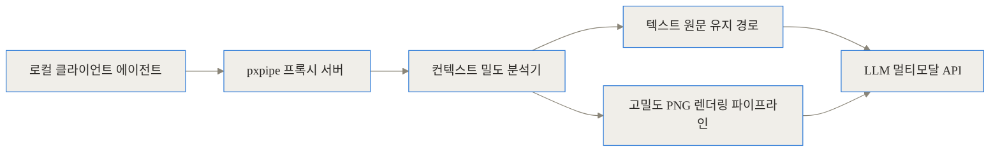
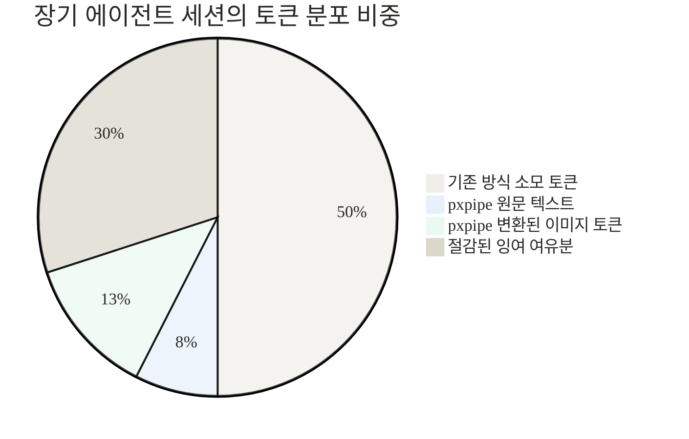
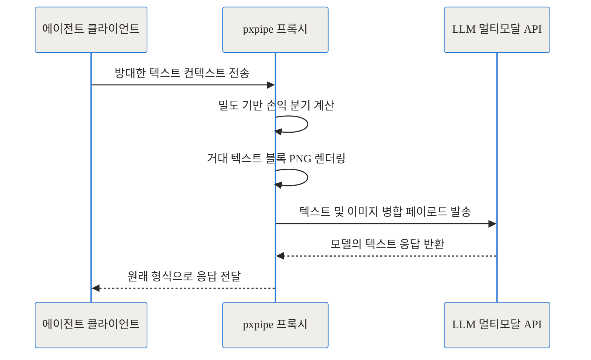
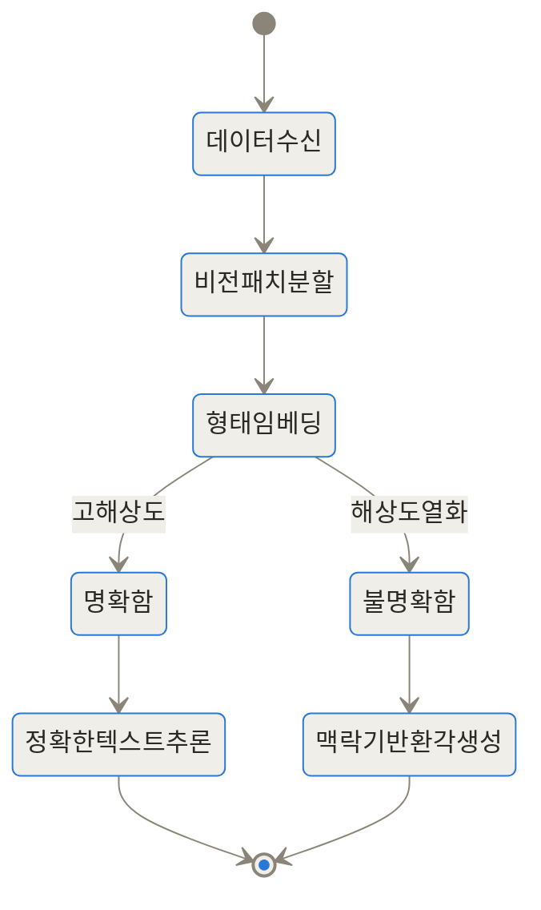
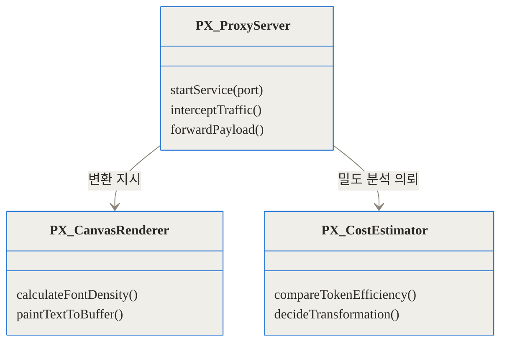
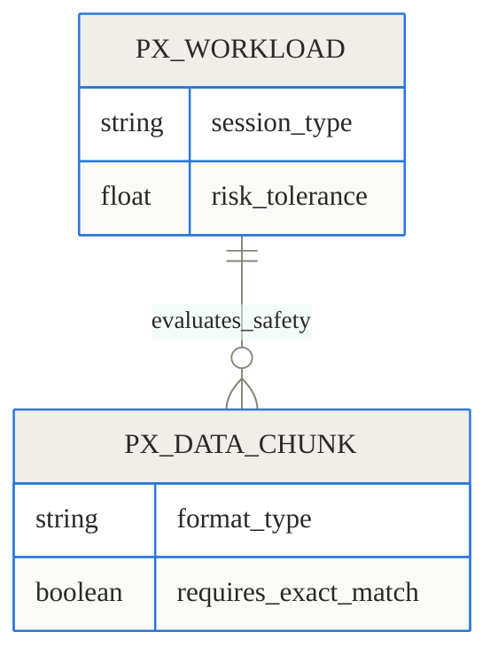

## 관련 링크 모음
- [pxpipe GitHub 공식 저장소](https://github.com/teamchong/pxpipe)

> **TL;DR**
> - pxpipe는 방대한 텍스트 컨텍스트를 고밀도 이미지(PNG)로 변환해 LLM에 전달하는 로컬 프록시입니다.
> - 이미지 픽셀 크기를 기준으로 토큰을 과금하는 비전 모델의 가격 정책을 역이용하여, 입력 토큰 비용을 최대 70%까지 절감합니다.
> - 정확한 문자열 매칭이 필요한 데이터에서는 오독(환각) 리스크가 존재하므로, 워크로드의 특성에 맞는 선택적 도입이 필수적입니다.

## 배경과 문제 정의: 끊임없이 불어나는 컨텍스트 윈도우 택스

최근 개발 생태계에서는 Claude Code, Cursor, Aider 같은 AI 코딩 에이전트가 필수품으로 자리 잡았습니다. 이들은 단순한 자동완성을 넘어 개발자를 대신해 코드베이스를 탐색하고, 복잡한 오류를 디버깅하며, 프로젝트 전체의 구조를 리팩토링합니다. 하지만 이 강력한 능력 뒤에는 무거운 청구서라는 피할 수 없는 그림자가 존재합니다. 에이전트가 복잡한 문제를 해결하려면 방대한 컨텍스트(맥락)를 계속해서 머릿속에 담고 있어야 하기 때문입니다.

에이전트는 작업을 수행할 때마다 시스템 프롬프트, 도구 사용 설명서, 이전 대화 기록, 그리고 길고 복잡한 로그와 파일 내용을 API를 통해 LLM에 전달합니다. 문제는 이러한 데이터가 한 번 전송되고 끝나는 것이 아니라, 새로운 대화가 오갈 때마다 눈덩이처럼 불어나 누적 전송된다는 점입니다. 개발자들은 이를 가리켜 '컨텍스트 윈도우 택스(Context Window Tax)'라고 부릅니다. 방대한 문맥이 유지되어야 똑똑한 추론이 가능하지만, 그 문맥을 유지하는 비용이 선형적으로, 때로는 기하급수적으로 증가하는 모순을 의미합니다.

실제로 긴 호흡으로 진행되는 에이전트 세션의 경우, 입력 토큰 수가 수십만에 달하는 일은 흔합니다. 한 개발자는 Claude Code를 활용해 반복적인 코드와 JSON 로그를 처리하는 단일 세션에서 불과 몇 시간 만에 42달러 이상의 API 비용을 지불해야 했습니다. 단순한 질문 하나를 던지기 위해 그동안 쌓인 수백 킬로바이트의 문맥을 매번 텍스트로 보내는 것은 극도로 비효율적입니다. 모델의 지능은 날이 갈수록 높아지지만, 텍스트 토큰 과금이라는 물리적 한계가 개발자의 자유로운 탐색을 가로막고 있는 상황입니다. 이런 상황에서 과연 컨텍스트의 '형태'를 바꿀 수는 없을까 하는 발상의 전환이 요구되었습니다.

## pxpipe란 무엇인가: 규칙을 깬 토큰 차익거래

이러한 비용 압박 속에서 등장한 프로젝트가 바로 teamchong의 **pxpipe**입니다. 이름에서 유추할 수 있듯, pxpipe는 텍스트를 픽셀 파이프라인으로 통과시키는 도구입니다. 한 마디로 요약하면, 방대한 텍스트 컨텍스트를 빽빽한 글씨가 적힌 고해상도 PNG 이미지로 렌더링한 뒤 이를 텍스트 대신 LLM에 보내는 로컬 프록시 서버입니다.

왜 멀쩡한 텍스트를 굳이 이미지로 바꿀까요? 그 비밀은 바로 최신 멀티모달 LLM들의 과금 정책, 즉 '비전 토큰 차익거래(Vision-Token Arbitrage)'에 있습니다.

이건 마치 우편물을 보낼 때의 상황과 같습니다. 보통 편지를 보낼 때는 종이 무게(텍스트 길이)에 따라 요금이 늘어납니다. 하지만 우체국에 "규격 봉투(이미지)에 담긴 물건은 내용물의 무게와 상관없이 봉투 크기만으로 요금을 매긴다"는 특별한 규정이 있다고 가정해 봅시다. 영리한 사람은 수천 장의 문서를 돋보기로 봐야 할 만큼 아주 작게 축소해 마이크로필름에 인쇄한 뒤, 그 규격 봉투 하나에 가득 담아 보낼 것입니다. 

현재 Anthropic의 Claude나 OpenAI의 GPT 같은 모델들은 텍스트를 처리할 때는 글자 길이에 비례해 과금합니다. 반면, 이미지를 처리할 때는 그 안에 글자가 한 글자 있든 십만 글자가 있든 관계없이 오직 **이미지의 픽셀 해상도**만을 기준으로 토큰을 계산합니다. pxpipe는 바로 이 빈틈을 파고들어, 모델이 읽을 수 있는 최소한의 폰트 크기로 텍스트를 캔버스에 렌더링하여 고정된 이미지 토큰 비용 안에 막대한 양의 텍스트를 욱여넣는 방식을 취합니다.

## pxpipe는 어떻게 작동하는가: 내부 아키텍처와 작동 원리 심층 해설

pxpipe의 내부는 매우 투명하고 효율적인 프록시 아키텍처로 설계되어 있습니다. 클라이언트(에이전트)와 LLM 서버 사이에서 중개자 역할을 하며, 요청을 가로채서 최적화한 뒤 전달합니다. 이 과정을 여러 단계로 나누어 자세히 파헤쳐 보겠습니다.

### 프록시 기반의 투명한 개입

pxpipe는 개발자가 기존에 쓰던 클라이언트의 코드를 전혀 수정할 필요가 없습니다. 로컬 환경에서 프록시 서버로 실행되며, 클라이언트가 `/v1/messages` 엔드포인트로 보내는 API 요청을 중간에서 가로챕니다.



위 다이어그램에서 보듯, 모든 텍스트가 무조건 이미지로 바뀌는 것은 아닙니다. 프록시 내부의 크기 추정기(Estimator)가 메시지 블록의 텍스트 밀도와 길이를 분석합니다. 짧은 일상적인 대화나 단순한 명령어는 텍스트 형태로 두는 것이 오히려 토큰을 적게 소모하기 때문입니다. 일정 임계치(보통 토큰당 19자 수준)를 초과하는 방대한 시스템 프롬프트, 도구 반환값, 긴 로그만이 렌더링 파이프라인을 거치게 됩니다.

### 텍스트와 이미지의 토큰 변환 수학

실제 숫자를 통해 이 절감률의 수학적 근거를 확인해 볼까요?

일반적으로 텍스트 기반 요청에서는 약 1개의 문자가 1개의 텍스트 토큰을 소모합니다. 반면 pxpipe는 `@napi-rs/canvas`를 활용해 1928×1928 픽셀 해상도의 캔버스 이미지를 생성합니다. 이 해상도의 이미지는 Claude API 기준으로 약 4,761개의 비전 토큰을 소모하도록 규정되어 있습니다.

놀라운 점은 이 1928×1928 캔버스 안에 고밀도로 텍스트를 배치하면 무려 약 92,000자를 담아낼 수 있다는 것입니다. 92,000자를 텍스트로 보내면 약 92,000 토큰이 필요하지만, 이미지로 보내면 단 4,761 토큰이면 충분합니다. 텍스트 토큰 방식 대비 효율을 계산하면 임계점 이상에서 **이미지 토큰 1개당 약 19.3자의 텍스트를 처리**할 수 있는 잠재력을 가집니다. 

실제 Claude Code의 프로덕션 트래픽을 분석한 결과, 보수적으로 잡아도 이미지 토큰 1개당 약 3.1자를 처리하며 기존 대비 압도적인 가성비를 증명했습니다. 다음은 이런 처리를 거쳤을 때의 토큰 비중을 나타냅니다.



### 시각적으로 확인하는 렌더링 결과

아래는 pxpipe가 실제로 렌더링한 이미지의 예시입니다.


보시다시피 코딩 에이전트의 시스템 프롬프트와 여러 툴의 문서가 아주 작은 글씨로 한 화면에 빽빽하게 담겨 있습니다. 사람은 돋보기를 써야 간신히 읽을 수 있지만, 훈련된 비전 모델에게는 충분히 판독 가능한 형태입니다. 이 거대한 한 장의 이미지가 수만 개의 텍스트 토큰을 단 몇 천 개의 비전 토큰으로 압축해줍니다.

### 전체 라이프사이클과 요청 조립 과정

클라이언트가 요청을 보낸 순간부터 응답을 받기까지의 과정을 시퀀스 다이어그램으로 살펴보겠습니다.



변환을 거친 결과물은 캐시 친화적으로 다시 조립됩니다. 항상 고정된 내용의 정적 프리픽스(Static Prefix) 부분은 프롬프트 캐싱(Prompt Caching) 정책과 완벽하게 호환되도록 구성되어, 이미 압축된 토큰 위에서 이중으로 비용을 깎아냅니다.

### OCR이 아니다: 패치 임베딩과 환각의 메커니즘

이 도구를 이해할 때 가장 중요한 것은, LLM이 이 이미지를 읽는 방식이 전통적인 OCR(광학 문자 인식)이 아니라는 사실입니다. 모델은 이미지에 적힌 글자를 왼쪽에서 오른쪽으로 한 글자씩 스캔하지 않습니다. 대신 이미지를 여러 개의 '패치(Patch)'로 쪼갠 뒤, 그 패치들의 형태적 특징과 공간적 배열을 신경망을 통해 한 번에 '임베딩(Embedding)'합니다. 

이 차이는 실전에서 매우 중요한 결과를 낳습니다. 전통적인 바코드 리더기나 단순 OCR은 글씨가 뭉개져 읽을 수 없으면 "판독 불가" 에러를 던집니다. 하지만 패치 임베딩을 사용하는 멀티모달 비전 모델은 맥락을 추론하는 능력이 강하기 때문에, 형태가 불분명한 글자를 만나면 에러를 내는 대신 **자신이 학습한 확률에 기반해 가장 그럴듯한 다른 글자로 지어내는 환각(Hallucination)**을 일으킵니다.



이러한 현상을 '조용한 오독(Silent Misread)'이라고 부릅니다. 즉, pxpipe는 태생적으로 **손실 압축(Lossy Compression)** 기술입니다. 일반적인 API 사용 가이드, 코드의 주석, 과거의 대화 기록 등은 약간의 오타나 누락이 생겨도 모델이 전체 맥락을 이해하는 데 큰 지장이 없습니다. 하지만 SHA 커밋 해시값, 고유 세션 ID, 절대 틀리면 안 되는 API 엔드포인트 경로 같은 정보가 이미지로 변환되어 한 글자라도 오독될 경우, 에이전트의 이어지는 작업이 완전히 실패하게 됩니다. pxpipe가 이러한 식별자는 반드시 원문 텍스트로 유지해야 한다고 경고하는 이유입니다.

## 실전 구현: pxpipe 설치 및 설정 방법

pxpipe는 복잡한 시스템 데몬이 아니라 독립적인 로컬 Node.js 프록시이므로, 기존 환경을 훼손하지 않고 언제든 켜고 끌 수 있습니다.

1. **프록시 서버 구동**
   터미널에서 아래 명령어를 실행하면 로컬 머신의 47821 포트에 서버가 뜹니다.
   ```bash
   npx pxpipe-proxy
   ```

2. **클라이언트 환경 변수 설정**
   이제 Claude Code나 커스텀 에이전트가 바라보는 기본 API 주소를 프록시로 변경합니다.
   ```bash
   ANTHROPIC_BASE_URL=http://127.0.0.1:47821 claude
   ```

3. **상태 모니터링 및 킬 스위치**
   프록시가 실행되면 웹 브라우저를 통해 `http://127.0.0.1:47821/` 대시보드에 접속할 수 있습니다. 이곳에서는 현재까지 절감된 토큰의 양, 텍스트가 어떤 형태의 캔버스로 변환되었는지를 보여주는 전후 비교 뷰어, 그리고 긴급 시 모든 이미지 변환을 중지하고 원문으로 통과시키는 킬 스위치를 제공합니다.

이러한 구조는 내부적으로 독립된 모듈들이 협력하여 이루어집니다.



## 실전 활용 시나리오: 어떤 상황에서 진가를 발휘하는가

이 도구는 모든 상황에 어울리는 만병통치약이 아닙니다. 그러나 아래와 같은 특정한 워크로드에서는 거의 마법에 가까운 금전적 효율을 보여줍니다.

- **거대한 JSON 덤프 및 로그 분석**
  에이전트가 서버의 방대한 로그 파일이나 데이터베이스 덤프(예: 수천 줄의 JSON 배열)를 분석해야 할 때가 있습니다. 이 데이터의 전반적인 패턴을 파악하거나 특정 키워드 주변의 구조를 파악하는 작업에서 이미지는 토큰을 극적으로 아껴줍니다. 텍스트가 조금 뭉개져도 데이터의 전반적 흐름을 읽는 데는 지장이 없기 때문입니다.
  
- **긴 코드베이스와 반복적인 문서 히스토리 유지**
  여러 파일로 쪼개진 대규모 프로젝트를 리팩토링할 때, 에이전트는 반복적으로 전체 코드의 골격을 묻고 답하게 됩니다. 이때 에이전트의 자아를 구성하는 시스템 프롬프트와 프로젝트 아키텍처 가이드를 묶어서 이미지로 압축하면, 컨텍스트 윈도우의 여유 공간이 대폭 늘어나 더 깊은 추론이나 더 많은 파일 열람을 지시할 수 있습니다.

## 성능 벤치마크: 기존 텍스트 방식과의 비교

pxpipe의 가장 큰 매력은 실질적인 청구서 감축입니다. GitHub 저장소에 공개된 벤치마크와 실제 유저들의 리포트를 종합해보면 그 위력이 명확히 드러납니다. 

Claude의 강력한 비전 인식 능력을 갖춘 Fable 5 모델을 기준으로 한 입력 토큰 사용량 비교입니다.

```chartjs
{"type":"bar","data":{"labels":["기존 텍스트 전송 방식","pxpipe 렌더링 적용"],"datasets":[{"label":"1회 대규모 요청당 평균 입력 토큰 수","data":[25000,2700]}]}}
```

이 수치에 따르면 약 25,000 토큰을 소모하던 방대한 프롬프트 덩어리가 단 2,700개의 비전 토큰으로 대체됩니다. 이러한 절감이 반복되는 실제 세션에서의 비용 누적 그래프를 비교해보면 그 격차는 더욱 벌어집니다.

```chartjs
{"type":"line","data":{"labels":["1시간 경과","2시간 경과","3시간 경과","세션 종료 시점"],"datasets":[{"label":"순수 텍스트 기준 청구 비용 ($)","data":[10.5,21.2,31.5,42.21]},{"label":"pxpipe 적용 후 청구 비용 ($)","data":[1.5,3.0,4.5,6.06]}]}}
```

기존 방식이었다면 컨텍스트가 누적되면서 42.21달러가 청구될 장기 세션이, pxpipe의 파이프라인을 거친 후에는 6.06달러에 마무리되었습니다. 끝에서 끝(End-to-End) 기준으로 약 59%에서 70%에 달하는 비용 절감 효과입니다. 

기존 텍스트 전송 방식과의 구체적인 차이점을 표로 정리하면 다음과 같은 트레이드오프를 확인할 수 있습니다.


| 비교 기준 | 순수 텍스트 컨텍스트 전송 | pxpipe (이미지 렌더링 변환) |
|---|---|---|
| **토큰 산정 기준** | 텍스트 길이에 정비례 (1자당 약 1토큰) | 이미지 픽셀 크기에 고정 (텍스트 밀도 무관) |
| **평균 토큰 효율** | 1자 / 1 텍스트 토큰 | 3.1자 / 1 비전 토큰 (최대 19자) |
| **정보의 무결성** | 100% 바이트 단위 정확도 보장 | 손실 압축 (조용한 환각 및 오독 리스크 존재) |
| **클라이언트 수정** | 불필요 | 불필요 (프록시로 네트워크 단에서 투명하게 해결) |
| **추천 워크로드** | 짧은 단발성 대화, 정확한 API 키 및 ID 식별 | 거대한 프로젝트 코드베이스, 방대한 반복 로그 분석 |
| **지원 모델 성향** | 텍스트 모델이라면 제한 없음 | 비전 모델의 판독 능력에 크게 의존 (Fable 5 권장) |


참고로 모델의 비전 해상도 인식률에 따라 판독 능력이 다릅니다. 최신 Fable 5에서는 판독률이 높아 기본 옵션으로 권장되지만, Opus 4.8과 같은 이전 세대 모델에서는 오독률(약 7%)이 존재하여 기본적으로 비활성화(Opt-in)되어 있습니다.

## 한계와 리스크: 이 마법이 영원할 수 없는 이유

pxpipe가 보여주는 성과는 놀랍지만, 도입 전 반드시 직시해야 할 냉정한 현실이 있습니다. 

첫째, 앞서 다룬 **데이터 손실(Lossy) 문제**입니다. 에이전트가 코드를 수정하다가 아주 작은 변수명이나 파일 경로를 오독하여 조용히 엉뚱한 이름으로 바꾼다면, 이를 디버깅하는 데 드는 시간적 비용이 토큰 절감액보다 훨씬 클 수 있습니다. 따라서 절대로 틀려서는 안 되는 정보는 명시적으로 텍스트로 유지하도록 설계해야만 합니다.

둘째, **규칙의 유통기한**입니다. pxpipe는 철저히 현행 비전 모델의 가격 정책 허점을 찌른 도구입니다. 모델 제공사 입장에서는 사용자가 텍스트를 이미지로 우회해 매출을 대폭 떨어뜨리는 현상을 오래 방관하지 않을 것입니다. 텍스트가 빽빽하게 담긴 이미지를 감지하여 토큰 요금을 텍스트 수준으로 재산정하거나, 비전 채널의 텍스트 밀도에 페널티를 부과하는 방어 로직을 추가하는 것은 기술적으로 그리 어려운 일이 아닙니다. 따라서 이 도구는 영구적인 인프라라기보다는 가격 정책이 변경되기 전까지 누릴 수 있는 한시적인 '버그 바운티(Bug bounty)'에 가깝습니다.



## 결론: 개발자 생태계에 던지는 메시지

pxpipe는 단순한 꼼수를 넘어, 현재 AI 생태계의 토큰 경제학(Tokenomics)이 가진 구조적 모순을 유쾌하게 꼬집은 프로젝트입니다. 모델 벤더들이 점점 더 넓은 컨텍스트 윈도우를 지원한다고 선전하지만, 막상 살인적인 과금 구조 때문에 정작 그 공간을 마음껏 쓰지 못하는 개발자들의 현실을 적나라하게 보여주었기 때문입니다.

만약 여러분이 잦은 에이전트 사용으로 API 요금 청구서에 피로감을 느끼고 있다면, 그리고 컨텍스트의 일부가 약간 뭉개져도 대세에 지장이 없는 거시적인 워크로드를 다루고 있다면, pxpipe는 즉각적이고 달콤한 혜택을 줄 수 있는 훌륭한 선택지입니다. 하지만 언제나 대시보드의 '킬 스위치'를 손에 쥐고, 중요한 식별자는 원문으로 철저히 보호하는 기본 원칙을 잊지 마시기 바랍니다.

## 자주 묻는 질문 (FAQ)

### pxpipe는 얼마나 많은 토큰을 절감할 수 있나요?

워크로드의 특성에 따라 다르지만, 텍스트 비중이 높은 Claude Code의 방대한 개발 세션 기준으로는 보통 59%에서 최대 70%까지 입력 토큰 비용을 줄일 수 있습니다. 이는 텍스트 길이 대신 이미지의 픽셀 크기로만 고정 과금하는 비전 모델의 요금제 특성을 역이용한 결과입니다.

### 텍스트를 이미지로 바꾸면 모델이 내용을 잃어버리거나 착각하지 않나요?

네, pxpipe는 본질적으로 손실 압축(Lossy Compression)의 특성을 가지므로 오독 리스크가 분명히 존재합니다. 모델은 패치 임베딩 방식을 사용하기 때문에, 글자를 정확히 읽지 못할 경우 에러를 뿜는 대신 자신이 아는 그럴듯한 다른 단어로 지어내는 조용한 환각(Hallucination) 현상이 발생할 수 있습니다.

### Claude가 아닌 GPT나 다른 모델에서도 pxpipe를 사용할 수 있나요?

기본적으로 Claude Code와 Fable 5 환경에 최적화되어 작동하도록 설계되었습니다. 원리상 GPT 5.5 등 다른 멀티모달 모델에서도 적용은 가능하나, 각 모델의 비전 해상도 처리 한계와 판독 능력에 따라 오독률이 크게 달라질 수 있으므로 주의가 필요합니다.

### MCP(Model Context Protocol) 환경에서도 pxpipe가 유효한가요?

네, 프록시 형태로 네트워크 API 요청을 중간에서 가로채 처리하므로 클라이언트의 프로토콜이나 내부 동작 구조와 무관하게 적용 가능합니다. 단, 중요한 MCP 툴의 정확한 매개변수나 해시값은 절대 이미지로 변환되지 않도록 텍스트 원문 유지 설정을 켜두는 것이 권장됩니다.

### pxpipe 사용 시 내 코드가 외부의 허가되지 않은 서버로 전송되지는 않나요?

pxpipe는 사용자의 로컬 환경(127.0.0.1)에서 안전하게 동작하는 오프라인 기반 프록시 도구입니다. 중요한 텍스트 데이터를 고밀도 이미지로 렌더링하는 작업은 모두 사용자 컴퓨터 내부에서만 이루어지며, 최종 변환된 결과물만 공식적인 LLM 제공자(예: Anthropic)의 API 엔드포인트로 전송됩니다.


## References
- [https://github.com/teamchong/pxpipe](https://github.com/teamchong/pxpipe)
