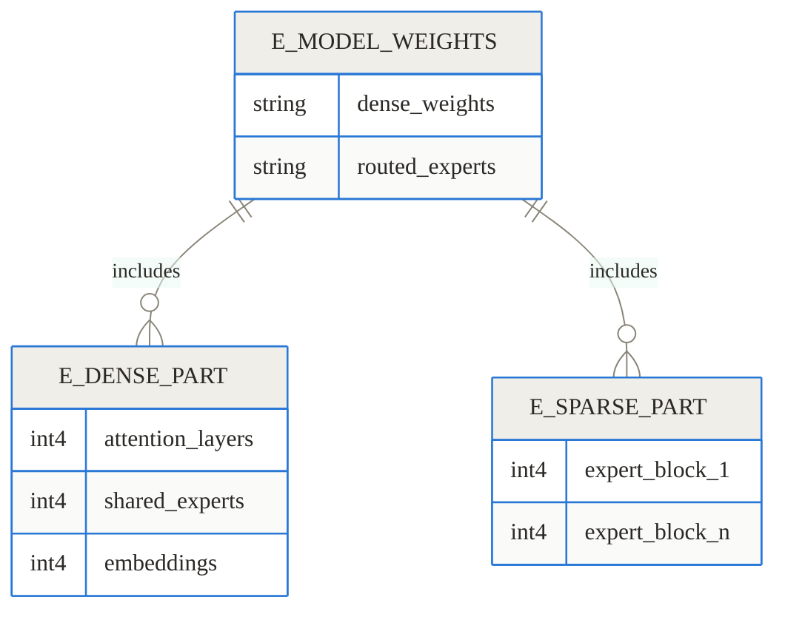
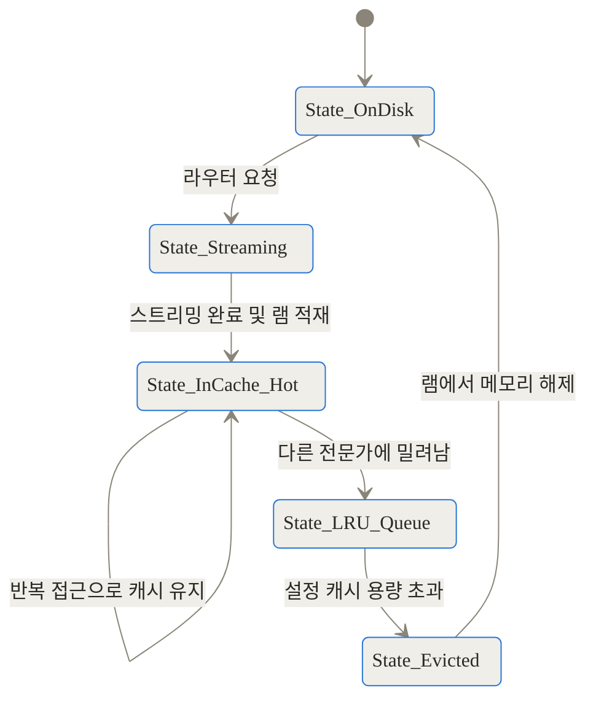
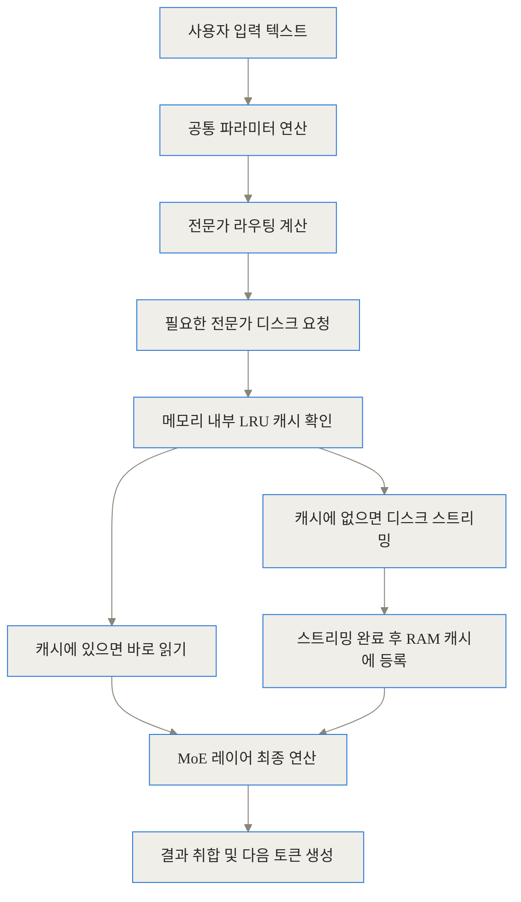
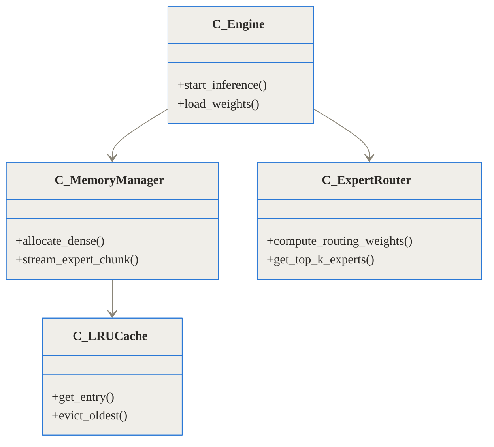
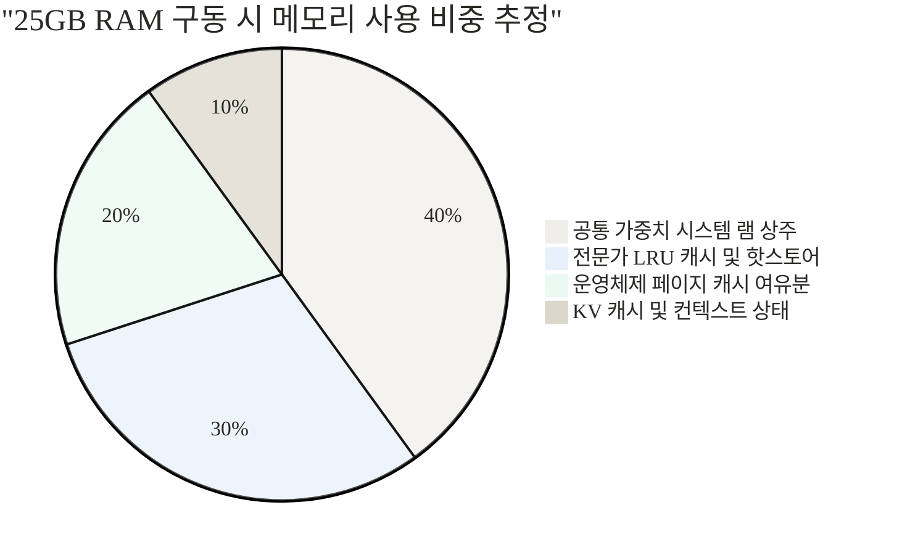
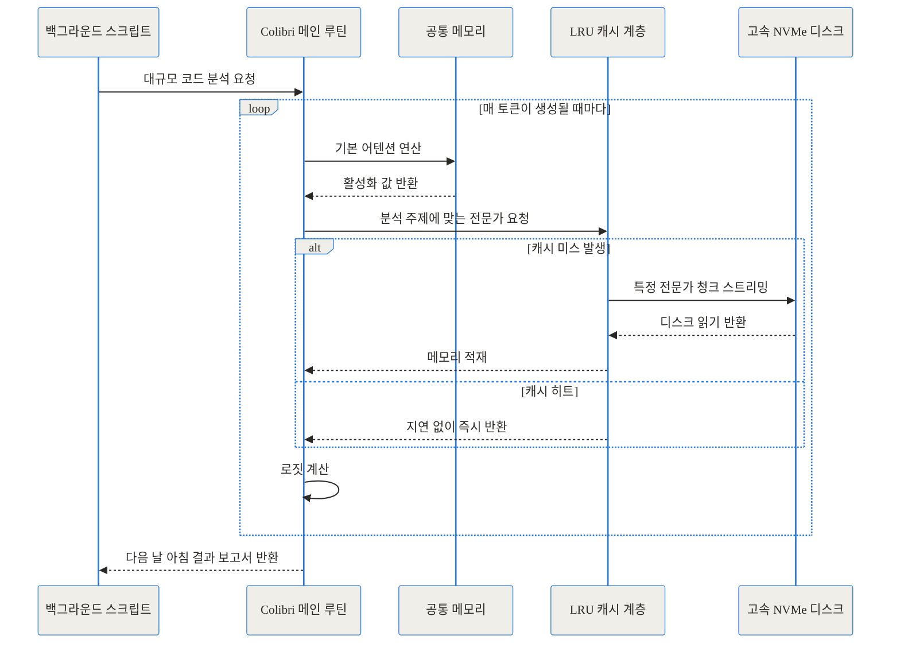

TL;DR (한 줄 요약)
- **무엇인가요**: 7440억(744B) 파라미터 규모의 초거대 언어 모델을 단 25GB 시스템 램으로 구동하는 순수 C 언어 기반 추론 엔진입니다.
- **어떻게 하나요**: 전체 중 항상 활성화되는 9.9GB 분량의 공통 파라미터만 램에 유지하고, 나머지 방대한 데이터는 NVMe 디스크에서 필요할 때마다 스트리밍합니다.
- **왜 중요한가요**: 수백 기가바이트의 VRAM을 갖춘 고가 서버 없이도, 남는 하드웨어를 활용해 프론티어급 AI 모델을 로컬 환경에서 통제하고 활용할 수 있는 구조적 가능성을 열었습니다.

## 1. 배경과 문제 정의: 초거대 모델이 직면한 물리적 메모리 장벽

최근 몇 년간 인공지능 생태계는 폭발적으로 성장하며 파라미터 수가 수천억 개를 넘어 조 단위로 향하고 있습니다. GLM-5.2 모델 역시 7440억 개(744B)의 매개변수를 가진 방대한 혼합 전문가(MoE, Mixture of Experts) 아키텍처를 자랑합니다. 모델이 거대해질수록 추론 능력과 환각(Hallucination) 억제 능력은 비약적으로 상승하지만, 이를 구동해야 하는 하드웨어 요구 사항 역시 기하급수적으로 높아지는 모순에 직면하게 되었습니다.

기존의 널리 쓰이는 추론 엔진인 vLLM이나 llama.cpp 등을 사용하여 이 정도 규모의 모델을 실행하려면, 전체 모델 가중치를 빠짐없이 메모리(VRAM 또는 시스템 RAM)에 적재해야 합니다. INT4와 같은 양자화 기법을 적용해 크기를 획기적으로 줄이더라도 370GB 이상의 여유 메모리가 필요합니다. 만약 물리적 메모리가 1바이트라도 부족하면 시스템은 여지없이 메모리 부족(OOM, Out of Memory) 에러를 뿜어내며 작동을 멈춥니다. 이는 개인 연구자나 소규모 스타트업에게 너무나도 높은 진입 장벽이었습니다.

## 2. 개념 쉽게 이해하기: 도서관의 서고와 책상 비유

이러한 메모리 장벽을 우회하기 위해 등장한 프로젝트가 바로 Colibri입니다. Colibri의 중심 아이디어는 매우 명쾌합니다. **"필요한 것만 책상 위에 올려두고, 나머지는 서고에 둔 채 필요할 때마다 꺼내 읽는다"**는 것입니다.

이를 도서관에 비유해 보겠습니다. 744B 모델을 수만 장으로 이루어진 엄청나게 두꺼운 백과사전 세트라고 상상해 보시죠. 기존의 방식은 이 무거운 백과사전 세트 전체를 책상(RAM) 위에 모두 올려두고 읽어야만 했습니다. 책상이 좁다면 아예 책을 펴볼 시도조차 할 수 없었죠.

하지만 Colibri는 이 백과사전이 사실 '자주 읽는 요약본'과 '특정 분야를 아주 깊게 다루는 2만 개의 전문 서적'으로 나뉘어 있다는 점을 간파했습니다. 그래서 책상(RAM) 위에는 요약본(약 10GB 분량)만 단출하게 올려둡니다. 그리고 질문이 들어올 때마다 어떤 전문 지식이 필요한지 파악한 뒤, 도서관 지하 서고(NVMe SSD)로 달려가 딱 필요한 책자 2~3권만 책상으로 잠시 가져옵니다. 다 읽고 나서 다른 질문이 들어오면 기존 책자를 다시 서고로 돌려보내고 새로운 책자를 가져오는 식입니다. 이것이 Colibri가 단 25GB의 램으로 370GB가 넘는 거대 모델을 성공적으로 실행할 수 있는 원리입니다.

## 3. 작동 원리 심층: Colibri는 어떻게 한계를 넘었는가?

이 엔진이 실제로 어떻게 구동되는지 기술의 밑바닥까지 깊게 파헤쳐 보겠습니다. 단순히 데이터를 디스크에서 읽어오는 것을 넘어, MoE 아키텍처의 구조적 빈틈을 완벽하게 찔러넣은 결과물입니다.

### 3.1. MoE 아키텍처의 특성 활용

GLM-5.2 모델은 7440억 개의 파라미터를 가지고 있지만, 재미있게도 하나의 토큰을 생성할 때 이 모든 파라미터가 사용되지는 않습니다. 혼합 전문가(MoE) 구조의 특성상 텍스트를 생성할 때 토큰당 약 400억 개(40B)의 파라미터만 선별적으로 활성화됩니다. 더욱 중요한 사실은 토큰이 바뀔 때마다 변경되는 데이터는 약 11GB 수준에 불과하다는 점입니다.

Colibri는 전체 모델을 크게 두 부분으로 엄격하게 분리합니다.
- **Dense 파트 (상주 영역)**: 어텐션 레이어, 임베딩, 그리고 모든 과정에서 공유되는 전문가 영역입니다. 약 170억 개(17B)의 파라미터로 구성되며 INT4 양자화 시 약 9.9GB의 용량을 차지합니다. 이 부분은 한순간도 빠짐없이 메모리에 고정(Resident)됩니다.
- **Sparse 파트 (스트리밍 영역)**: 75개의 MoE 레이어에 각각 256개씩 흩어져 있는 21,504개의 라우팅 전문가들입니다. 각 전문가 모듈은 INT4 기준 약 19MB의 크기를 가지며 총합 370GB에 달합니다. 이들은 오로지 NVMe 디스크에 저장됩니다.



### 3.2. INT4 양자화와 독자적인 메모리 매핑

Colibri는 기존의 널리 쓰이는 GGUF나 AWQ 같은 범용 양자화 포맷을 과감히 버리고, 자신만의 독자적인 INT4 양자화 컨테이너를 사용합니다. 이는 C 커널 레벨에서 발생하는 수학적 연산 오차를 극한으로 통제하기 위함입니다.
FP8(e4m3) 기반의 원본 가중치를 F32로 변환한 뒤, 비트 단위의 정확성을 맞추기 위해 엔진의 `lrintf` 함수와 완벽히 동일하게 토큰 단위 매칭을 수행하는 U8 패킹 및 F32 스케일링을 적용했습니다. 이 최적화 덕분에 CPU만으로도 데이터 병목을 줄이면서 연산 정밀도를 유지할 수 있었습니다.

### 3.3. 3단계 캐싱과 디스크 스트리밍 병목 극복

SSD에서 데이터를 매번 읽어오는 작업은 엄청난 지연(Latency)을 발생시킵니다. 이를 극복하기 위해 Colibri는 정교한 3단계 메모리 캐시 전략을 취합니다.

1. **LRU 캐시 (최근 최소 사용 캐시)**: 각 MoE 레이어마다 방금 전까지 사용했던 전문가를 RAM의 한구석에 남겨둡니다. 비슷한 주제의 텍스트가 연속해서 생성될 때 같은 전문가가 다시 호출될 확률이 높기 때문입니다.
2. **Pinned Hot-Store**: 사용자가 설정한 여유 RAM 용량만큼을 완전히 고정된 캐시 풀로 만들어, 가장 빈번하게 호출되는 소수의 전문가를 절대로 디스크로 쫓아내지 않게 만듭니다.
3. **OS Page Cache (운영체제 무료 L2 캐시)**: 엔진이 명시적으로 코딩하지 않아도, 리눅스 운영체제는 디스크에서 읽은 데이터를 남는 램 영역에 몰래 보관해 둡니다. Colibri는 이 운영체제의 기본 동작을 공짜 L2 캐시처럼 활용합니다.



이러한 정교한 파이프라인의 데이터 흐름은 다음과 같이 이루어집니다.



### 3.4. MTP를 통한 투기적 해독과 I/O 비용 절감

가장 흥미로운 최적화 중 하나는 GLM-5.2 모델의 78번째 레이어에 위치한 MTP(Multi-Token Prediction) 헤드를 적극적으로 활용한 점입니다. 이는 한 번에 하나의 토큰만 예측하는 것이 아니라 여러 토큰을 추측한 뒤 이를 검증하는 네이티브 투기적 해독(Speculative Decoding) 기능입니다. 디스크 읽기 속도가 가장 큰 병목인 시스템에서, 한 번 무거운 전문가 데이터를 읽어왔을 때 토큰을 하나만 만들고 버리는 것이 아니라 여러 개의 토큰을 동시에 뽑아낼 수 있어 효율이 크게 상승합니다.

### 3.5. 순수 C 언어 기반의 제로 의존성

이 모든 복잡한 시스템이 놀랍게도 외부 의존성이 전혀 없는 약 1,300줄짜리 단일 C 언어 파일(`glm.c`)로 구현되어 있습니다. Python의 무거운 가상 환경이나 PyTorch, 심지어 선형대수학 처리를 위한 BLAS 라이브러리조차 사용하지 않았습니다. 오직 GCC 컴파일러와 OpenMP, 그리고 AVX2 명령어 셋만으로 완벽하게 구동되는 구조는 리소스가 극도로 제한된 환경에서 빛을 발합니다.



## 4. 구현 및 사용 디테일: 어떻게 설치하고 실행하는가?

이 엔진을 직접 구동하려면 리눅스(또는 WSL2) 환경과 최소 16GB 이상의 여유 RAM, 그리고 약 400GB 이상의 여유 공간이 있는 고속 NVMe 스토리지가 필요합니다. 절대로 네트워크 드라이브(NAS)나 구형 HDD에 설치해서는 안 됩니다.

1. 저장소 복제 및 엔진 빌드
터미널에서 저장소를 내려받고 셋업 스크립트를 실행합니다.
```bash
git clone https://github.com/JustVugg/colibri
cd colibri/c
./setup.sh
```
2. 전용 양자화 가중치 다운로드
Hugging Face에서 전용 컨테이너 모델을 디스크 I/O 속도가 가장 빠른 위치에 다운로드합니다.
```bash
hf download jlnsrk/GLM-5.2-colibri-int4 --local-dir /경로/nvme/glm52_i4
```
3. 추론 실행
환경 변수에 모델 경로를 지정한 뒤 대화형 인터페이스를 엽니다. 엔진이 시스템의 여유 RAM 용량을 자동으로 감지하여 최적의 전문가 캐시 크기를 설정합니다.
```bash
COLI_MODEL=/경로/nvme/glm52_i4 ./coli chat
```

이 과정에서 RAM이 어떻게 분배되는지 시각화하면 다음과 같습니다.



## 5. 실전 활용 시나리오: 느리지만 가치 있는 사용처

초당 0.1토큰이라는 속도는 사용자와 실시간으로 핑퐁 대화를 나누는 챗봇 용도로는 명백히 부적합합니다. 하지만 오프라인 백그라운드 작업 관점에서는 매우 유용합니다.

1. **보안이 격리된 심층 문서 분석**: 클라우드 API로 절대 내보낼 수 없는 회사 내부의 기밀 문서나 수십만 줄의 레거시 코드를 분석할 때, 퇴근 전 스크립트를 걸어두고 밤새워 거대 모델이 이를 분석하도록 지시할 수 있습니다.
2. **남는 구형 워크스테이션의 재생산**: 데이터 센터에 방치된, 램은 32GB 정도지만 저장 공간만 넉넉한 구형 장비들에 최상급 추론 두뇌를 부여하여 독립적인 크롤링-분석 에이전트로 활용할 수 있습니다.

이러한 비동기적 추론 과정은 아래와 같은 흐름으로 진행됩니다.



## 6. 벤치마크 및 비교: 수치로 보는 트레이드오프

전통적인 방식과 Colibri의 접근 방식을 비교해보면, 이 엔진이 목표로 하는 지향점이 극명하게 드러납니다.

| 구분 | 시스템 램 요구량 | 저장 장치 의존도 | 처리 속도 | 비용 및 접근성 |
|---|---|---|---|---|
| **기존 방식 (FP16 전체 로드)** | 약 1,500GB 이상 | 매우 낮음 (초기 부팅 시 1회 읽기) | 매우 빠름 | 수천만 원대 초고가 장비 필요 |
| **기존 방식 (INT4 전체 로드)** | 약 370GB 이상 | 낮음 (초기 부팅 시 1회 읽기) | 빠름 | 고가 장비 필요 |
| **Colibri (INT4 + 스트리밍)** | **약 25GB 내외** | **매우 높음 (실시간 지속 읽기)** | **매우 느림 (0.1 t/s)** | **일반 소비자용 노트북으로 가능** |

<br>

이를 차트로 시각화하면 메모리 요구량의 엄청난 격차를 실감할 수 있습니다.

```chartjs
{"type":"bar","data":{"labels":["기존 방식 (INT4 전체 로드)","Colibri (디스크 스트리밍)"],"datasets":[{"label":"필요 시스템 램 (GB)","data":[370,25]}]}}
```

## 7. 솔직한 평가: 한계와 시스템적 리스크

이 프로젝트는 훌륭한 엔지니어링 성과이지만, 현실적인 한계 또한 명확히 존재하므로 도입 전에 반드시 고려해야 합니다.

- **극도로 느린 속도의 인내심 한계**: 0.1 t/s라는 것은 한 단어를 만들어내는 데 10초 가까이 걸린다는 뜻입니다. 300단어의 짧은 보고서를 작성하는 데에만 1시간 가까이 소요됩니다.
- **NVMe SSD의 가혹한 읽기 부하**: SSD의 수명을 갉아먹는 쓰기(Write) 작업이 아니므로 장치 자체가 금방 고장 나지는 않습니다. 그러나 쉴 새 없이 수 기가바이트의 데이터를 읽어내야 하므로, NVMe 컨트롤러의 심각한 발열을 유발할 수 있습니다. 방열판이 없는 저가형 SSD에서는 스로틀링이 발생해 속도가 기하급수적으로 더 떨어질 위험이 큽니다.
- **폐쇄적인 생태계 호환성**: 널리 쓰이는 llama.cpp의 GGUF 형식을 지원하지 않기 때문에, 향후 다른 오픈소스 모델이 나오더라도 사용자가 직접 엔진에 맞게 C 코드를 수정하고 양자화 스크립트를 다루어야 하는 번거로움이 있습니다.

## 8. 마무리: 하드웨어와 소프트웨어의 새로운 접점

Colibri 프로젝트는 단순히 "느려도 돌아가게 만들었다"는 것을 넘어, 거대 AI 모델의 병목 현상을 연산 장치(GPU)와 메모리 용량(VRAM)에서 디스크 대역폭(I/O)으로 옮겨보는 훌륭한 사고의 전환을 보여주었습니다. 개발자 Vincenzo가 12코어의 평범한 노트북으로 최고급 프론티어 AI의 대답을 얻어냈을 때 느꼈을 성취감은, 기술이 궁극적으로 나아가야 할 '도구의 대중화'라는 방향성을 정확히 가리키고 있습니다.
미래에 통합 메모리(Unified Memory) 대역폭이 비약적으로 넓어지고 SSD와 RAM 사이의 경계가 허물어지는 새로운 하드웨어 아키텍처가 보편화된다면, Colibri가 증명한 이러한 스트리밍 방식의 추론 엔진들이 로컬 AI 생태계의 표준으로 자리 잡을지도 모릅니다.

## 자주 묻는 질문 (FAQ)

### 744B 크기의 거대 모델을 정말 25GB 램만으로 구동할 수 있나요?

네, 가능합니다. Colibri는 7440억 개의 파라미터 전체를 시스템 램에 한 번에 올리는 대신, 토큰 생성 시 반복적으로 사용되는 약 170억 개 규모의 공통 파라미터(약 9.9GB 분량)만 램에 상주시킵니다 [1.1.4]. 나머지 방대한 전문가 네트워크 가중치(약 370GB)는 NVMe SSD에서 실시간으로 스트리밍하여 읽어오기 때문에 25GB의 램 환경에서도 안정적으로 작동합니다.

### 토큰 생성 속도는 어느 정도이며, 실시간 챗봇으로 실사용이 가능한가요?

실시간 챗봇 용도로는 사용할 수 없습니다. 개발자가 테스트한 12코어 노트북 환경 기준으로 콜드 스타트 시 초당 0.05에서 0.1 토큰 정도의 매우 느린 생성 속도를 보여줍니다. 따라서 핑퐁식의 대화보다는 백그라운드 환경에서 긴 텍스트를 분석하거나 코드를 오랫동안 검토하는 등 비동기적이고 시간이 오래 걸리는 작업에 적합합니다.

### SSD에서 계속 데이터를 읽어오면 디스크 수명(TBW)에 악영향을 주지 않나요?

Colibri의 아키텍처는 디스크에 새로운 데이터를 지속적으로 기록하는 쓰기(Write) 작업이 아니라, 오직 읽기(Read) 작업에 집중되어 있습니다. SSD의 수명(TBW)을 결정짓는 것은 쓰기 횟수이기 때문에 수명 자체가 급격히 단축되지는 않습니다. 다만, 고부하의 읽기 작업이 지속되면서 NVMe 컨트롤러의 발열이 심해질 수 있으므로 적절한 쿨링 환경이 권장됩니다.

### 실행을 위해 외장 GPU나 무거운 프레임워크를 설치해야 하나요?

전혀 필요하지 않습니다. 이 엔진은 무거운 Python 런타임이나 PyTorch는 물론이고, 복잡한 선형 대수 계산을 위한 BLAS 외부 라이브러리조차 의존하지 않습니다. 오직 순수 C 언어로만 작성된 약 1,300줄의 코드 기반으로 컴파일되며, CPU와 시스템 메모리, 고속 스토리지 자원만을 활용하여 추론을 수행합니다.

### 기존에 사용하던 GGUF나 AWQ 포맷의 모델을 바로 불러와서 쓸 수 있나요?

불가능합니다. Colibri는 GGUF, AWQ, GPTQ 등 널리 쓰이는 범용 양자화 포맷을 지원하지 않습니다. C 언어 엔진 내부의 수학적 연산과 비트 단위로 일치하도록 정밀하게 조정된 독자적인 INT4 양자화 컨테이너를 사용해야만 하며, 반드시 제공되는 변환 스크립트를 거친 전용 가중치 파일을 사용해야 합니다.


## References
- [JustVugg/colibri GitHub 저장소](https://github.com/JustVugg/colibri)
- [GLM-5.2-colibri-int4 Hugging Face 가중치](https://huggingface.co/jlnsrk/GLM-5.2-colibri-int4)
