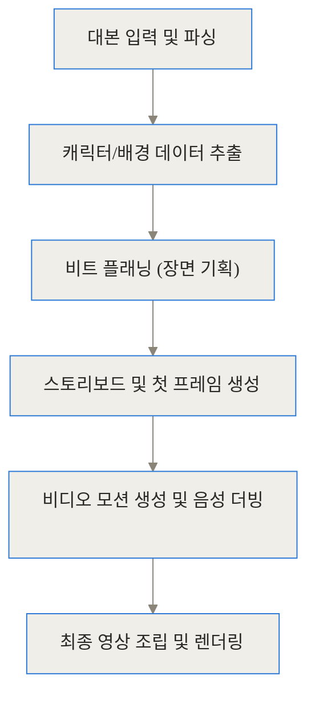
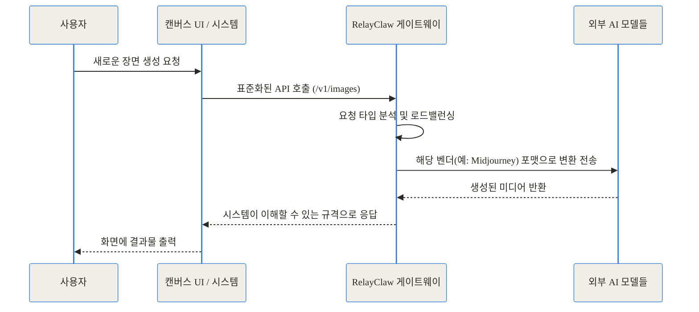
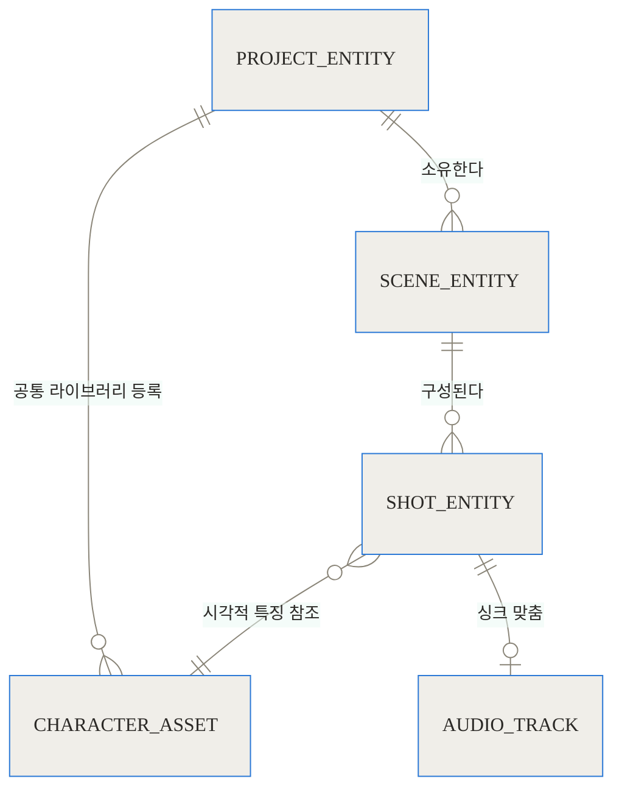
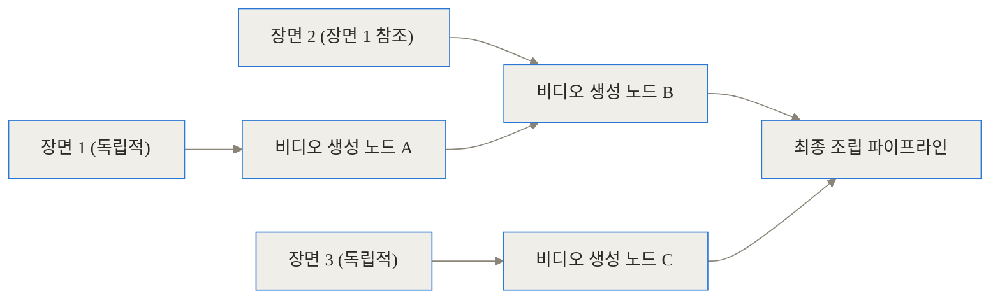
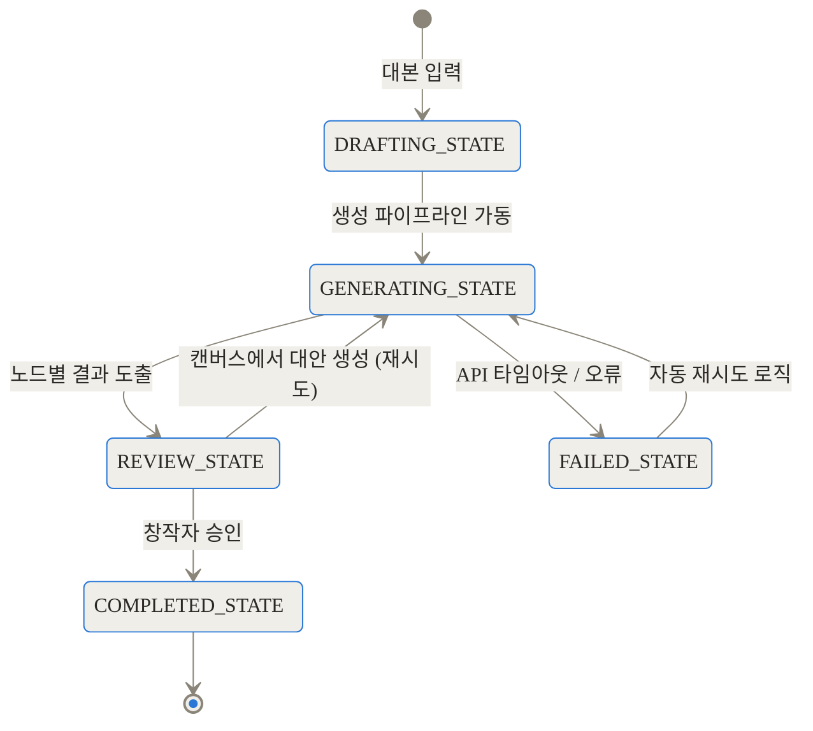
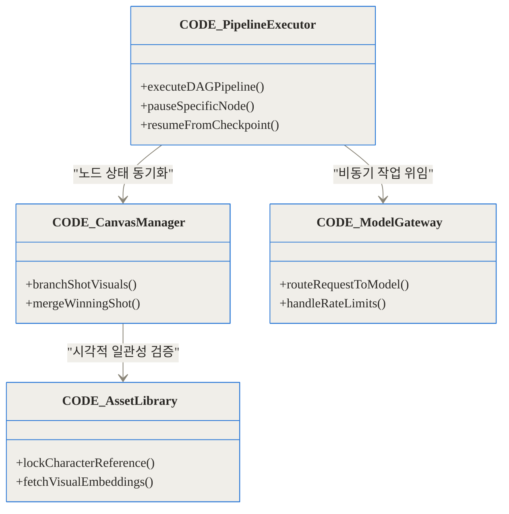
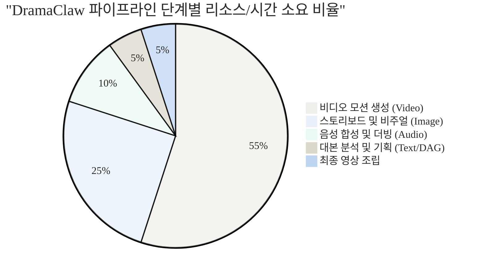

## 상단 링크 블록

- [DramaClaw GitHub 저장소](https://github.com/dramaclaw/dramaclaw)
- [공식 문서 및 가이드](https://github.com/dramaclaw/dramaclaw/tree/main/docs)
- [AI 영상 제작 프레임워크 기술 논의](https://github.com/dramaclaw/dramaclaw/discussions)

## 도입 및 3줄 요약 (TL;DR)

AI를 활용해 짧은 드라마나 광고 영상을 만들어본 적이 있으신가요? 아마 대본은 챗봇(LLM)에서 짜고, 이미지는 미드저니(Midjourney)에서 만들고, 생성된 이미지를 다시 런웨이(Runway)나 클링(Kling)으로 옮겨 움직임을 준 뒤, 일레븐랩스(ElevenLabs)에서 목소리를 입히고, 마지막으로 프리미어 프로(Premiere Pro) 같은 편집기에서 하나하나 조립하셨을 겁니다. 이 과정은 매우 지루하고 고통스럽죠. 오늘 소개할 **DramaClaw(드라마클로)**는 이 끊어진 워크플로우를 하나의 거대한 파이프라인으로 연결해 주는 오픈소스 AIGC(AI가 생성하는 콘텐츠) 비디오 엔진입니다.

**TL;DR**
- **통합된 자동화**: 대본만 넣으면 스토리보드, 캐릭터 추출, 비디오 생성, 더빙, 합성까지 한 줄기의 파이프라인으로 처리합니다.
- **무한 캔버스와 병렬 처리**: 일방통행식 생성이 아니라, 특정 샷만 분기해서 재작업하는 노드 캔버스와 속도를 비약적으로 높이는 DAG(방향성 비순환 그래프) 병렬 스케줄링을 도입했습니다.
- **완전한 소유권**: 기업의 폐쇄적 서비스에 종속되지 않고, 도커(Docker) 기반으로 사용자 개인 서버에 배포하여 프라이빗하게 통제할 수 있습니다.

---

## 배경과 문제 정의: 왜 기존 AI 영상 제작은 고통스러울까?

생성형 AI 기술이 발전하면서 영상 제작의 진입 장벽이 낮아졌다고 하지만, 실무자들의 이야기를 들어보면 오히려 피로감은 커졌다고 말합니다. 왜 그럴까요? 기존 파이프라인이 안고 있던 구체적인 고통(Pain Point)들을 살펴보겠습니다.

### 1. 극심한 도구 피로도와 수작업의 늪
현재 AI 영상 제작은 '자동화'가 아니라 '수작업 공예'에 가깝습니다. 장면이 50개인 숏폼 드라마를 만든다고 가정해 보죠. 기획자는 50개의 프롬프트를 복사해서 이미지 생성기에 붙여넣고, 다운로드한 50장의 이미지를 다시 비디오 생성기에 업로드해야 합니다. 중간에 대사가 수정되면 영상의 길이와 입모양, 더빙 오디오 싱크를 일일이 다시 맞춰야 합니다. 창의성을 발휘해야 할 시간에 파일 복사 및 이동이라는 단순 노동에 갇히게 됩니다.

### 2. 캐릭터와 배경 일관성(Consistency)의 붕괴
아마 가장 큰 문제일 것입니다. AI 모델에게 "빨간 재킷을 입은 짧은 머리 여성"이라고 아무리 자세히 프롬프트를 적어줘도, 장면이 바뀔 때마다 얼굴 생김새나 옷의 디테일이 미묘하게 변합니다. 이를 '프롬프트 표류(Prompt Drift)' 현상이라고 부릅니다. 샷 1번에서는 멀쩡하던 주인공이 샷 2번에서는 전혀 다른 사람이 되어버리면, 영상의 몰입도는 순식간에 깨집니다.

### 3. 선형적 워크플로우의 한계와 수정의 어려움
영상을 만들다 보면 24번째 장면의 애니메이션만 유독 어색할 때가 있습니다. 하지만 많은 기존 텍스트 투 비디오(Text-to-Video) 도구들은 전체 영상을 한 번에 뽑아내거나 선형적으로만 작동하여, 중간의 특정 장면만 섬세하게 수정하고 대안을 비교하는 과정이 매우 번거롭습니다. 파일 이름 끝에 `_v2`, `_final`, `_진짜최종`을 붙이며 버전을 관리하다 보면 결국 프로젝트 전체가 꼬여버리곤 합니다.

---

## 개념 쉽게 이해하기: 공장 조립 라인과 무한 스케치북의 결합

이러한 문제를 해결하기 위해 등장한 DramaClaw의 중심 아이디어를 일상적인 비유로 설명해 보겠습니다. DramaClaw는 마치 **'최첨단 자동차 공장의 컨베이어 벨트'**와 **'수석 디자이너의 무한 스케치북'**을 하나로 합친 것과 같습니다.

자동차 공장(파이프라인)에 철판(대본)을 넣으면 로봇(AI 모델)들이 알아서 프레임을 짜고, 색을 칠하고, 바퀴를 달아 완성된 자동차(영상)를 만들어냅니다. 일일이 사람이 부품을 나를 필요가 없습니다. 하지만 공장 시스템만 있다면 융통성이 없겠죠?

그래서 DramaClaw는 파이프라인 위에 무한 캔버스(Infinite Canvas)라는 스케치북을 올려두었습니다. 조립 라인이 돌아가는 중에 "잠깐, 이 씬에서는 캐릭터 옷 색깔을 세 가지 버전으로 뽑아볼까?" 하고 캔버스로 차를 끌고 옵니다. 노드를 세 갈래로 쪼개어 각각 시안을 만들어보고, 가장 마음에 드는 시안(Winner)을 다시 메인 조립 라인으로 돌려보냅니다. 효율적인 자동화와 자유로운 창작의 장점을 동시에 챙긴 것이죠.


---

## 작동 원리 심층 분석 (Under the Hood)

그렇다면 DramaClaw는 내부적으로 어떻게 이 복잡한 과정을 처리할까요? 겉보기에는 단순한 웹 인터페이스지만, 그 이면에는 엔터프라이즈급의 정교한 아키텍처가 자리 잡고 있습니다. 가장 중요한 네 가지 구조를 단계별로 살펴보겠습니다.

### 1. 단일 워크플로우를 완성하는 파이프라인 구조

대본이 입력되는 순간부터 완성된 영상이 나오기까지의 과정을 다이어그램으로 시각화해 보겠습니다.



위 흐름에서 사용자가 개입하지 않아도 데이터는 자동으로 다음 단계로 흘러갑니다. 대본을 분석해 등장인물이 누구인지, 어떤 장소인지 추출하고(B), 감독처럼 각 장면을 어떻게 나눌지 기획한 뒤(C), 이미지와 영상을 순차적으로 생성합니다.

### 2. 모든 AI 모델을 하나로, 통합 모델 게이트웨이

현재 시장에는 수많은 AI 모델이 존재합니다. Claude, GPT-4, Midjourney, Flux, ElevenLabs 등 모델마다 데이터를 요청하는 방식(API 규격)이 전부 다릅니다. DramaClaw는 이 복잡성을 해결하기 위해 **통합 게이트웨이(RelayClaw)**를 도입했습니다.

이 게이트웨이는 텍스트, 이미지, 비디오, 음성 등 어떤 요청이든 간에 표준화된 OpenAI 호환 형식으로 변환하여 라우팅합니다. 따라서 사용자는 복잡한 API 연동 코드를 짤 필요 없이, 게이트웨이 주소 하나만 입력하면 모든 모델을 끌어다 쓸 수 있습니다.



### 3. 일관성의 비밀: 레퍼런스 잠금(Locked Asset Reference)

앞서 제기한 '프롬프트 표류' 현상을 DramaClaw는 어떻게 해결했을까요? 텍스트로 얼굴을 설명하는 대신, **시각적 자산(Asset)을 고정 데이터로 취급**하는 방식을 채택했습니다. 

프로젝트가 시작되면 캐릭터와 배경에 대한 고유한 참조 자산(Reference Asset)이 라이브러리에 잠깁니다(Lock). 이후 샷을 생성할 때, 텍스트 프롬프트에 의존하는 것이 아니라 이 참조 자산의 이미지를 Vision 모델의 레퍼런스로 직접 주입합니다. 이를 통해 장면이 바뀌거나 카메라 구도가 달라져도 동일한 세계관 내의 동일한 인물임을 보장합니다.



### 4. 속도의 비약적 향상: DAG 기반 병렬 처리

가장 기술적으로 흥미로운 부분입니다. 영상 생성은 시간이 오래 걸리는 작업입니다. 샷이 100개라면 1번부터 100번까지 기다리는 것은 비효율적입니다.

DramaClaw는 씬(Scene) 간의 서사적, 시각적 의존성을 분석하여 **방향성 비순환 그래프(DAG, Directed Acyclic Graph)**를 구성합니다. 만약 씬 1번과 씬 3번이 시각적으로 독립적이라면(예: 서로 다른 장소와 인물), 이 둘을 기다리지 않고 동시에(병렬로) 생성합니다. 최적 경로 탐색(CPM) 알고리즘을 도입하여 렌더링 스케줄을 짜기 때문에, 자원만 충분하다면 작업 속도가 비약적으로 단축됩니다.



아래 차트를 보시면 일반적인 선형 생성 방식과 비교했을 때 DramaClaw의 DAG 병렬 스케줄링이 얼마나 시간을 아껴주는지 확인할 수 있습니다.

```chartjs
{
  "type": "bar",
  "data": {
    "labels": ["기존 수작업(선형) 파이프라인", "DramaClaw DAG 병렬 처리"],
    "datasets": [
      {
        "label": "10샷 영상 제작 소요 시간 (분)",
        "data": [150, 25],
        "backgroundColor": ["#e74c3c", "#2ecc71"]
      }
    ]
  }
}
```

---

## 노드 기반 무한 캔버스와 상태 관리

파이프라인이 멈추지 않고 흘러가더라도, 창작자의 의도가 개입되어야 할 시점이 있습니다. DramaClaw의 각 단계는 독립적인 비동기(Async) 태스크로 분리되어 있습니다.

사용자는 특정 비트(Beat)나 샷 노드에서 작업을 일시정지하고, 캔버스 환경으로 진입하여 여러 대안을 테스트할 수 있습니다. 예를 들어, 동일한 대본으로 스토리보드를 세 방향으로 뽑아보고(Branching), 그중 가장 나은 것을 선택해(Merging) 다음 비디오 생성 단계로 넘기는 식입니다.

이러한 복잡한 상태 관리를 위해 시스템 내부에서는 세밀한 생명주기(Lifecycle) 관리가 이루어집니다.



이러한 모듈화된 아키텍처는 코드 수준에서도 잘 분리되어 설계되어 있습니다.




---

## 구현 및 사용 디테일: 내 서버에 직접 구축하기

가장 매력적인 점 중 하나는 DramaClaw가 개인 서버에 올릴 수 있는 'Self-hosted' 환경을 기본 지원한다는 것입니다. 복잡한 의존성 설치 없이 Docker Compose 하나로 구동됩니다.

커뮤니티 에디션(CE)은 PostgreSQL이나 Redis 같은 무거운 데이터베이스 없이도 SQLite와 로컬 파일 시스템을 통해 가볍게 동작하도록 설계되었습니다. 

### 설치 방법

터미널을 열고 아래 명령어를 순서대로 입력합니다.

```bash
# 1. 저장소 클론
git clone https://github.com/dramaclaw/dramaclaw.git
cd dramaclaw

# 2. 도커 컨테이너 빌드 및 실행 (API 및 Web 서비스)
docker compose up -d --build
```

컨테이너가 정상적으로 실행되었다면 브라우저를 열고 `http://localhost:8080`에 접속하여 웹 UI를 확인할 수 있습니다.

### API 모델 연동 설정 (.env)

사용자 설정에서 공식 채널(Official Channel)인 `RelayClaw` 키를 입력하는 것이 가장 쉽습니다. 만약 CLI나 CI 환경에서 헤드리스(Headless)로 띄우고 싶다면 `.env` 파일에 직접 입력할 수도 있습니다.

```env
# DramaClaw 설정 파일 예시 (.env)
NEWAPI_BASE_URL=https://relayclaw.cdnfg.com/v1
NEWAPI_API_KEY=your_dramaclaw_token_here
```

만약 본인만의 로컬 LLM 환경이나 별도의 API 게이트웨이가 구축되어 있다면, `NEWAPI_BASE_URL`을 해당 주소(예: `http://localhost:3000/v1`)로 변경하여 완벽한 오프라인/프라이빗 생태계를 꾸릴 수도 있습니다.

---

## 실전 활용 시나리오

기술적인 스펙을 넘어, 실제 현장에서 DramaClaw가 어떻게 고통을 줄여주는지 구체적인 시나리오를 통해 살펴보겠습니다.

### 시나리오 1: 50샷짜리 숏폼 드라마의 캐릭터 유지
- **기존 상황**: 샷 15번쯤 넘어가면 주인공의 헤어스타일이 미묘하게 바뀌기 시작합니다. 감독은 프롬프트를 고치고 다시 돌려보지만 엉뚱한 결과가 나옵니다.
- **DramaClaw 해결책**: 프로젝트 셋업 단계에서 주인공의 정면/측면/전신 이미지를 생성하고 `CHARACTER_ASSET`으로 고정합니다. 샷 15번을 생성할 때 엔진은 텍스트 설명뿐만 아니라 고정된 주인공의 얼굴 특징 벡터를 모델로 함께 전송합니다. 그 결과, 사용자는 아무런 추가 입력 없이도 끝까지 동일한 인물을 등장시킬 수 있습니다.

### 시나리오 2: 중간 장면의 더빙 싱크 및 입모양 수정
- **기존 상황**: 30번째 장면에서 캐릭터의 대사와 입모양이 어긋납니다. 기존 선형 도구들은 전체 렌더링을 처음부터 다시 하거나, 별도 프로그램에 해당 영상만 들고 가서 오디오를 재배열해야 합니다.
- **DramaClaw 해결책**: 캔버스 모드를 엽니다. 30번째 샷 노드를 클릭하고 "대사 템포 조절(Branching)"을 선택하여 3가지 버전의 오디오 트랙을 생성합니다. 캔버스 위에서 3가지 영상을 즉석 비교한 뒤, 입모양이 완벽하게 맞는 트랙을 선택해 메인 파이프라인으로 병합(Merge)합니다. 다른 49개의 샷은 재렌더링할 필요가 없습니다.

파이프라인 전체에서 어느 단계가 가장 많은 컴퓨팅 자원과 시간을 쓰는지 분석해 보면, 주로 비디오 모션 생성과 이미지 렌더링이 주를 이룹니다. 엔진이 이 부분을 집중적으로 스케줄링 관리해 줍니다.



---

## 벤치마크 및 트레이드오프 비교

그렇다면 수치적으로는 얼마나 효과적일까요? 아래 표와 차트를 통해 기존 수작업 방식과 DramaClaw의 접근 방식을 비교해 보았습니다.

| 비교 항목 | 기존 수작업 도구 모음 | DramaClaw 파이프라인 |
| :--- | :--- | :--- |
| **워크플로우 형태** | 파편화 (여러 탭과 앱을 오감) | **단일 캔버스 및 통합 라인** |
| **캐릭터 일관성** | 수동 프롬프트 조절 (표류 현상 잦음) | **자산 잠금(Asset Lock) 참조** |
| **오류 복구 능력** | 오류 발생 시 전체 작업 지연 및 롤백 | 노드 단위 재시도 및 독립적 복구 |
| **초기 구축 난이도** | 브라우저만 있으면 당장 시작 가능 | Docker 및 시스템 이해도 약간 필요 |
| **자율성과 데이터 보안**| 플랫폼 정책에 종속 (검열, 락인) | **오픈소스, 100% 자가 호스팅 가능** |


특히 캐릭터 일관성을 유지하기 위해 소모되는 텍스트 컨텍스트 유지 비용과 성공 확률을 차트로 나타내면 다음과 같습니다.

```chartjs
{
  "type": "line",
  "data": {
    "labels": ["샷 1", "샷 2", "샷 3", "샷 4", "샷 5"],
    "datasets": [
      {
        "label": "단순 프롬프트 재작성 방식 (일관성 유지율 %)",
        "data": [90, 70, 50, 35, 15],
        "borderColor": "#e74c3c",
        "fill": false
      },
      {
        "label": "DramaClaw 고정 에셋 참조 방식 (일관성 유지율 %)",
        "data": [95, 94, 96, 95, 94],
        "borderColor": "#2980b9",
        "fill": false
      }
    ]
  }
}
```
단순히 프롬프트만으로 일관성을 유지하려 하면 샷이 거듭될수록 일관성이 급격히 무너지지만, DramaClaw의 에셋 기반 참조 방식은 끝까지 안정적인 형태를 유지합니다.

---

## 솔직한 평가: 완벽한 도구는 없다 (한계와 리스크)

기술의 이면에는 항상 트레이드오프가 존재합니다. DramaClaw 역시 예외는 아니며, 도입 전 몇 가지 한계를 반드시 인지해야 합니다.

1. **인프라 진입 장벽**: SaaS 형태의 웹 서비스처럼 "회원가입 후 바로 사용"하는 방식이 아닙니다. 직접 서버를 구축하거나 Docker를 다룰 줄 알아야 진정한 가치를 100% 뽑아낼 수 있습니다. 물론 개발팀에서는 설치 과정을 간소화하고 있지만, 여전히 일반 창작자에게 터미널 명령어는 부담스러울 수 있습니다.
2. **노드 인터페이스의 학습 곡선**: ComfyUI나 블렌더(Blender) 같은 노드 기반 툴에 익숙하지 않은 사람에게 무한 캔버스는 다소 복잡하게 느껴질 수 있습니다. 선형 편집에 익숙한 기획자라면 적응하는 데 시간이 필요합니다.
3. **라이선스 제한**: DramaClaw는 'Elastic 2.0' 라이선스를 채택하고 있습니다. 무료로 사용하고, 코드를 수정하고, 자체 호스팅하는 것은 완벽히 허용되지만, **이 소프트웨어를 포장하여 다른 사람에게 유료 SaaS 형태로 재판매하는 것은 금지**되어 있습니다. 비즈니스 모델을 구상 중인 기업이라면 이 부분을 주의해야 합니다.

---

## 마무리: AI 시대, 파이프라인의 소유권은 누구에게 있는가

GitHub의 리드미(README) 문서 첫머리에 적힌 문구가 매우 인상적입니다.

> "In the age of AI, the real question isn't whether machines replace people. The real question is: Who owns the machines? Who owns the pipeline?" 
> (AI 시대에 진정한 질문은 기계가 사람을 대체하느냐가 아닙니다. 진정한 질문은 '누가 그 기계를 소유하는가? 누가 파이프라인을 소유하는가?' 입니다.)

AI 모델의 성능이 아무리 뛰어나도, 이를 연결하는 파이프라인이 거대 플랫폼 기업의 폐쇄적인 생태계에 종속되어 있다면 창작자의 자유는 결국 제한될 수밖에 없습니다. 

DramaClaw는 단순히 영상을 편하게 만들어주는 도구 이상의 의미를 지닙니다. 대본 분석부터 렌더링까지 이어지는 전체 워크플로우에 대한 통제권을 창작자 개인과 작은 스튜디오들의 손에 쥐여주는 인프라입니다. 파편화된 AI 도구들 사이에서 복사 및 붙여넣기에 지쳤다면, 지금 당장 빈 서버를 열고 DramaClaw를 띄워 자신만의 영상 공장을 가동해 보시길 권합니다.

## 자주 묻는 질문 (FAQ)

### DramaClaw는 무료로 사용할 수 있나요?

네, DramaClaw는 Elastic 2.0 라이선스 하에 배포되어 개인적인 용도나 기업의 자체 인프라 내 구축용으로는 완전히 무료로 사용할 수 있고 코드 수정도 자유롭습니다. 단, DramaClaw 시스템 자체를 그대로 호스팅하여 제3자에게 유료 서비스(SaaS)로 재판매하는 행위만 제한됩니다.

### 게이트웨이를 거치지 않고 내 PC의 로컬 GPU로만 완전히 구동할 수 있나요?

가능합니다. 기본 추천 설정은 RelayClaw나 외부 모델 API를 쓰는 것이지만, 자체적으로 오픈소스 모델(예: SDXL, 로컬 LLM)을 구동하고 이를 OpenAI 호환 규격(newAPI 등)으로 매핑하여 환경 설정(.env)에 로컬 주소를 입력하면 외부 인터넷 연결 없이 100% 로컬 오프라인 환경에서 돌릴 수 있습니다.

### 기존 ComfyUI와 노드 시스템이 어떻게 다른가요?

ComfyUI는 샘플러(Sampler), 모델 체크포인트, 텐서 연산 같은 '수학적이고 기술적인 단위'로 노드를 연결합니다. 반면 DramaClaw의 노드 캔버스는 씬(Scene), 비트(Beat), 샷(Shot), 캐릭터(Character) 등 철저하게 '영화 연출과 서사 단위'로 구성되어 있어 영상 기획자와 디렉터가 직관적으로 다루기 좋습니다.

### 전체 영상을 다시 뽑지 않고 중간의 어색한 장면만 수정할 수 있나요?

그렇습니다. 파이프라인의 각 과정이 독립된 상태(State)로 저장되기 때문에, 문제가 발생한 특정 샷 노드만 일시정지하거나 캔버스로 빼내어 재작업(Branching)할 수 있습니다. 수정을 완료한 후 해당 노드만 전체 파이프라인에 다시 병합(Merge)하면 되므로 렌더링 시간과 API 비용을 크게 절약합니다.

### Kling 3.0이나 Sora 같은 최신 비디오 모델이 나오면 바로 적용 가능한가요?

네, 매우 쉽게 적용할 수 있습니다. 특정 벤더에 종속된 코드를 쓰지 않고 중간에 통합 모델 게이트웨이를 두고 통신하기 때문에, 게이트웨이 백엔드에 새로운 모델 API 연동만 추가해주면 DramaClaw 코어 코드를 수정할 필요 없이 캔버스 인터페이스 상에서 즉시 최신 모델을 선택해 사용할 수 있습니다.


## References
- [https://github.com/dramaclaw/dramaclaw](https://github.com/dramaclaw/dramaclaw)
- [https://github.com/dramaclaw/dramaclaw/tree/main/docs/en/getting-started](https://github.com/dramaclaw/dramaclaw/tree/main/docs/en/getting-started)
- [https://reddit.com/r/generativeAI/search?q=dramaclaw](https://reddit.com/r/generativeAI/search?q=dramaclaw)
