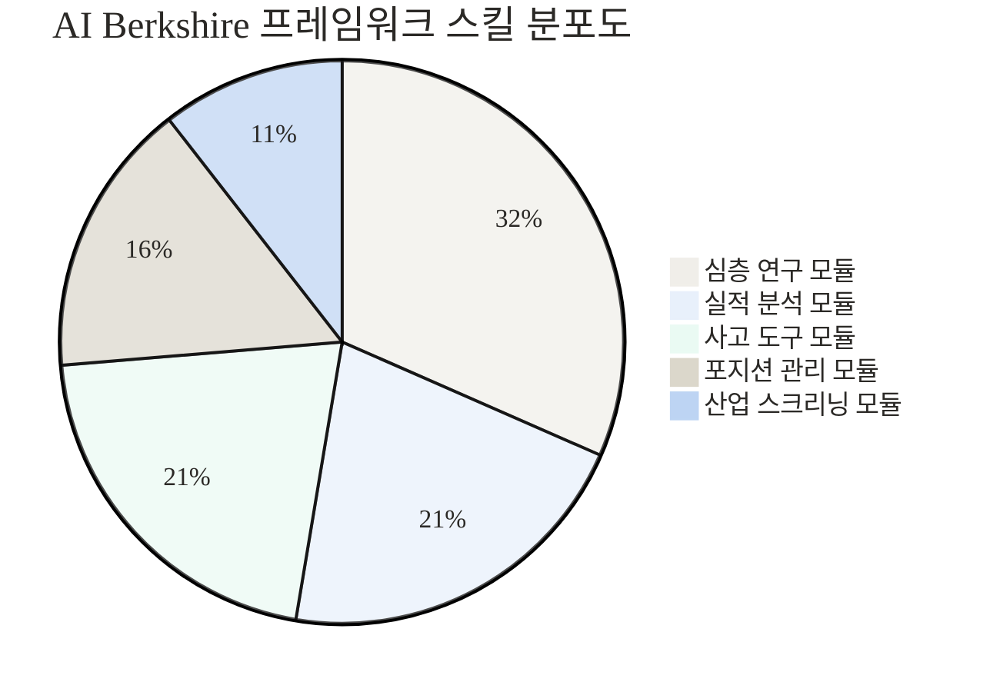
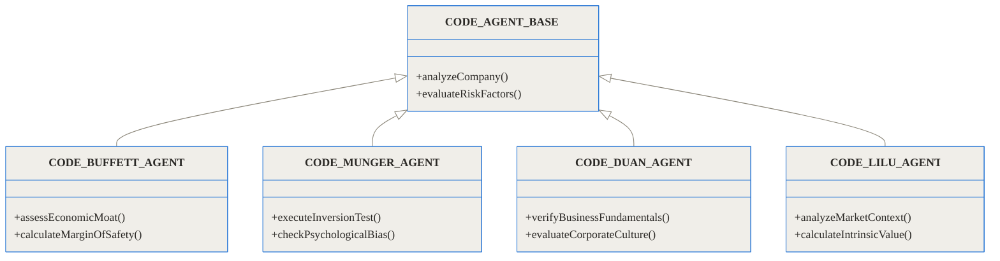
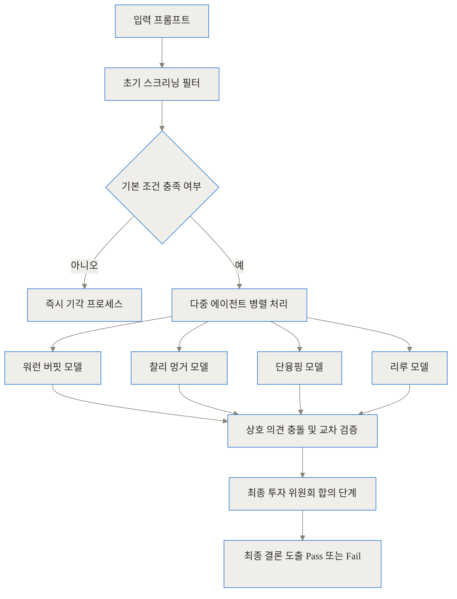
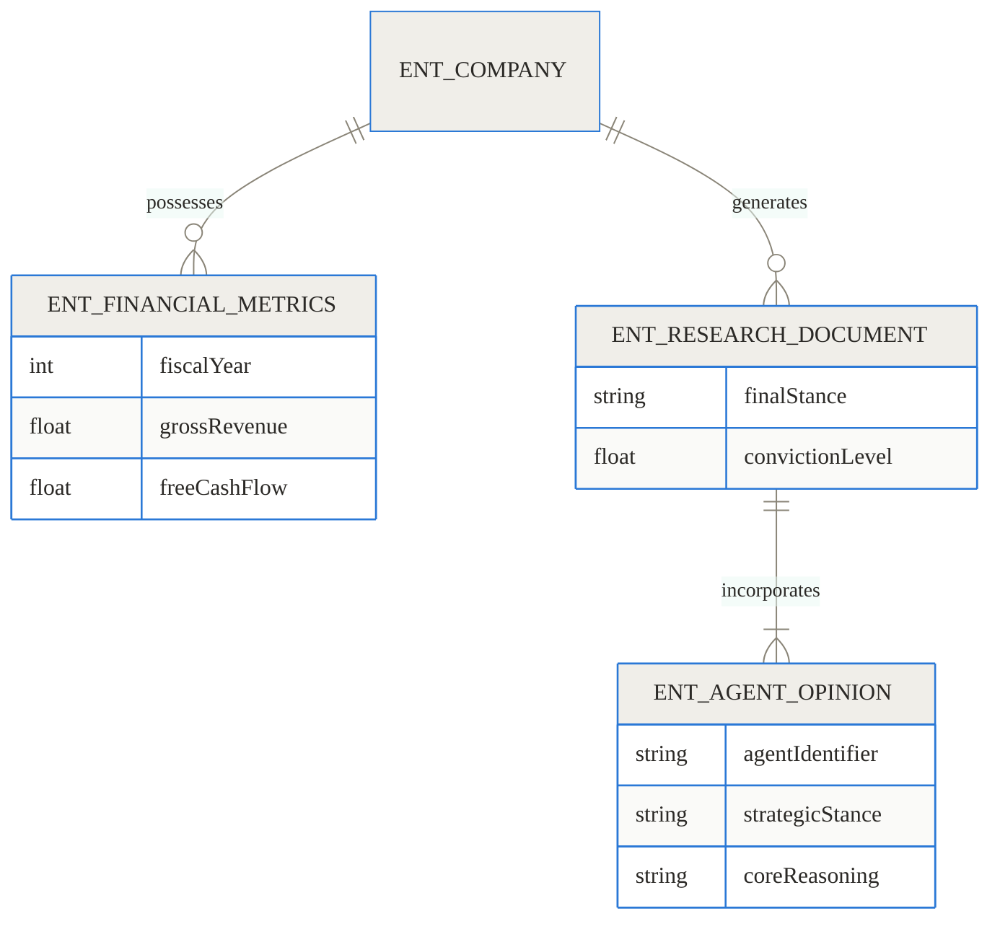
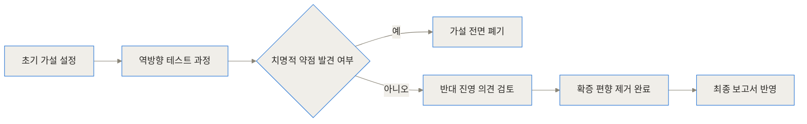
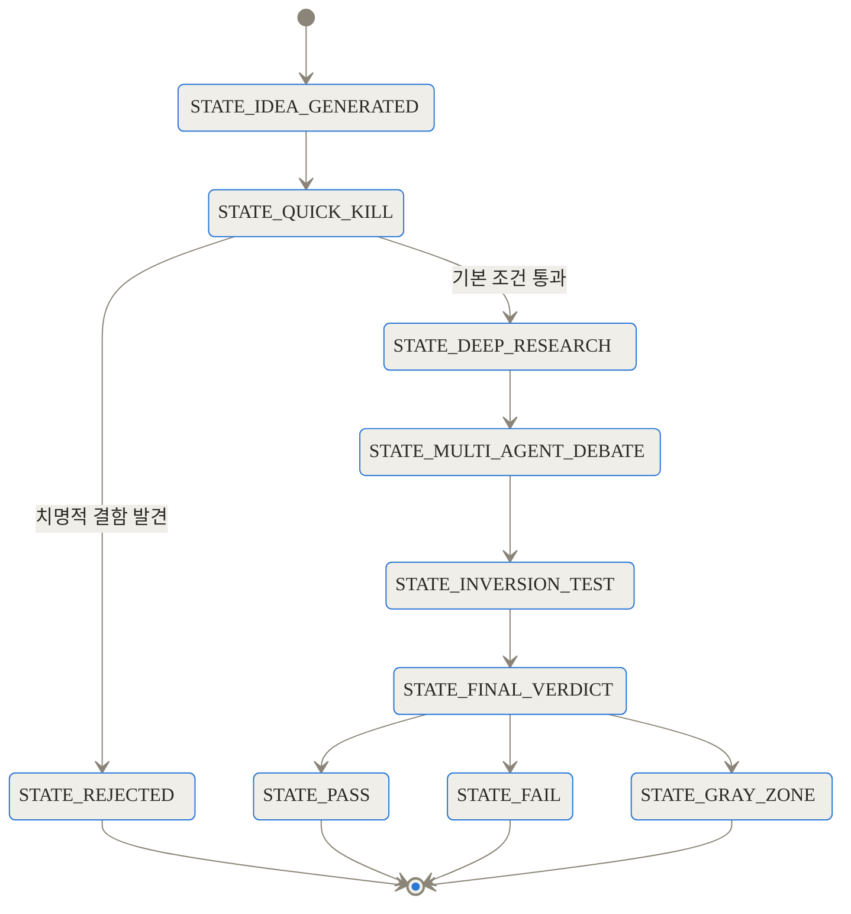
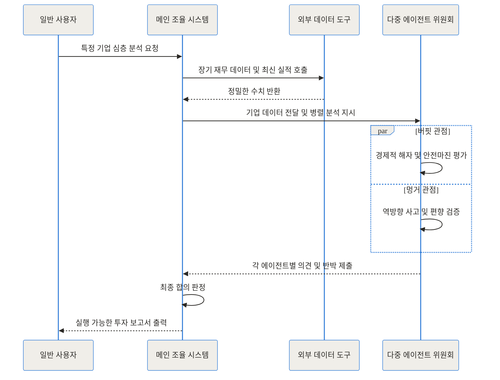

## 관련 링크 모음

- [AI Berkshire 공식 GitHub 저장소](https://github.com/xbtlin/ai-berkshire)

## 도입: 유창한 무능력과 새로운 대안

> **TL;DR (한 줄 요약)**
> 1. 일반적인 인공지능은 주식 분석 시 결론을 회피하고 양비론적인 태도를 취해 실제 투자 결정에 도움을 주지 못합니다.
> 2. AI Berkshire는 워런 버핏, 찰리 멍거 등 4대 투자 대가의 철학을 코드로 구현한 다중 에이전트 프레임워크입니다.
> 3. 엄격한 상호 교차 검증과 편향 제거 시스템을 통해 인간의 감정을 배제하고 명확한 투자 적격 여부를 도출합니다.

거대 언어 모델에게 특정 기업의 주식을 지금 사야 하는지 물어본 적이 있으신가요? 십중팔구 매우 유창하고 구조가 잘 잡힌 답변을 내놓을 것입니다. 긍정적인 전망을 몇 가지 나열하고, 이어지는 문단에서는 거시 경제의 불확실성과 경쟁 심화라는 리스크를 덧붙입니다. 그리고 마지막은 항상 이렇게 끝이 납니다. "모든 투자는 위험이 따르며, 최종 결정은 본인의 몫입니다."

글은 훌륭하지만 실제 행동을 취하기에는 전혀 쓸모가 없습니다. 유창함과 유용성 사이의 이 거대한 간극을 메우기 위해 등장한 오픈소스 프로젝트가 바로 **AI Berkshire**입니다. 이 프로젝트는 단순히 주식 시장의 뉴스를 요약해 주는 도구가 아닙니다. 언어 모델을 단일 챗봇이 아닌 하나의 독립적인 투자 연구 조직으로 탈바꿈시키는 거대한 아키텍처입니다.

## 배경과 문제 정의: 언어 모델은 왜 투자를 못 할까요

기존의 인공지능이 전문적인 재무 분석과 투자 결정에서 참담한 실패를 겪는 이유는 크게 세 가지로 나뉩니다.

첫째, 인간 피드백 기반 강화학습(RLHF)으로 인한 **양비론적 회피**입니다. 현재 대부분의 상용 모델은 사용자에게 단정적인 의견을 주지 않도록, 즉 '가장 안전하고 욕먹지 않을 대답'을 하도록 강하게 훈련되어 있습니다. 투자라는 영역은 불확실성 속에서 확률에 베팅하고 입장을 정해야 하는 분야인데, 안전함만을 추구하는 인공지능은 결코 어느 한쪽의 손을 들어주지 않습니다.

둘째, **수치 환각(Hallucination) 현상**입니다. 재무제표의 복잡한 계정과목을 분석할 때 언어 모델은 계산기라기보다는 문장 생성기에 가깝습니다. 영업이익률을 계산하거나 잉여현금흐름의 10년 치 복리 성장률을 추정할 때, 이들은 종종 그럴싸해 보이는 가짜 숫자를 만들어냅니다. 재무 분석에서 숫자의 작은 오류는 가치 평가 전체를 붕괴시킵니다.

셋째, **일관된 투자 철학의 부재**입니다. 일반적인 모델은 인터넷에 떠도는 모든 투자 이론을 뒤섞어 놓은 상태입니다. 모멘텀 투자, 가치 투자, 매크로 트레이딩, 기술적 분석의 관점이 하나의 답변 안에서 무작위로 혼재되어 나타납니다. 기준이 없으니 도출되는 결론에도 일관성이 없습니다.

이러한 구체적인 고통을 해결하기 위해 AI Berkshire 프레임워크가 탄생했습니다.

## 개념 쉽게 이해하기: 인턴 사원과 전문 투자 위원회

이 프레임워크의 중심 아이디어를 일상적인 상황에 빗대어 보겠습니다.

일반적인 챗봇을 사용하는 것은 마치 똑똑하지만 책임지기 싫어하는 **신입 인턴**에게 리서치를 맡기는 것과 같습니다. 인턴은 기업의 재무제표와 최근 뉴스를 예쁘게 정리해서 보고서를 가져옵니다. 하지만 "그래서 이 회사를 우리 포트폴리오에 편입해야 할까?"라고 물으면, "장점도 있고 단점도 있어서 확답을 드리기 어렵습니다"라고 발을 뺍니다.

반면 AI Berkshire는 노련한 펀드매니저들이 모인 **전문 투자 위원회**와 같습니다. 이 위원회에는 원칙주의자인 워런 버핏, 회의론자인 찰리 멍거, 비즈니스 본질을 파고드는 단융핑, 그리고 시장의 거시적 맥락을 읽는 리루가 앉아 있습니다. 누군가 새로운 투자 아이디어를 내면, 이 네 명은 각자의 철학을 바탕으로 기업을 맹렬히 해부하고 서로 논쟁합니다. 숫자를 검증하는 별도의 시스템이 이들의 논리를 뒷받침하며, 마지막에는 반드시 "투자 적격" 혹은 "기각"이라는 명확한 결론을 도출합니다.

## 작동 원리 심층 1: 4대 대가의 뇌를 복제한 다중 에이전트

AI Berkshire는 단일 프롬프트에 의존하지 않고, 문제를 여러 개의 작은 검증 단계로 쪼개어 다수의 에이전트에게 할당합니다. 총 19개의 전문 스킬 모듈이 준비되어 있으며, 이들은 각자의 역할을 수행합니다.



프레임워크의 가장 두드러진 특징은 4명의 가치투자 거장의 방법론을 독립적인 에이전트로 모델링했다는 점입니다.

1. **워런 버핏 모델**: 경제적 해자(Economic Moat)와 안전마진(Margin of Safety)을 집중적으로 분석합니다. 자본 배분의 효율성을 따지며, 장기적으로 기업이 경쟁 우위를 지킬 수 있는지 평가합니다.
2. **찰리 멍거 모델**: 역방향 사고(Inversion)와 심리학적 편향을 점검합니다. "이 회사가 망한다면 어떤 시나리오일까?"를 먼저 묻고, 경영진의 인센티브 구조가 제대로 작동하는지 검증합니다.
3. **단융핑 모델**: 비즈니스 모델의 단순성과 기업 문화를 살핍니다. 소비자가 이 회사의 제품을 진정으로 사랑하는지, 그리고 회사가 본업에 충실한지를 평가합니다.
4. **리루 모델**: 철저한 펀더멘털 분석과 시장의 거시적 맥락을 조화시킵니다. 가치와 가격의 괴리가 극대화되는 지점을 찾아냅니다.

이들 에이전트는 코드로 명확하게 분리되어 상속 구조를 이룹니다.



이러한 에이전트 구조 덕분에, 모델은 단일한 시각에 매몰되지 않고 다양한 각도에서 기업의 입체적인 모습을 조명할 수 있습니다.

## 작동 원리 심층 2: 의사결정 파이프라인과 교차 검증

데이터가 입력되면 시스템은 일련의 엄격한 파이프라인을 거칩니다. 이 과정의 목표는 단 하나, '매수해야 할 수천 가지 이유'를 찾는 것이 아니라 **'매수하지 말아야 할 단 하나의 치명적 이유'**를 걸러내는 것입니다.



각 에이전트는 다른 에이전트의 분석 결과를 읽고 반박하는 '적대적 분석(Adversarial Analysis)' 과정을 거칩니다. 예를 들어 버핏 에이전트가 높은 영업이익률을 근거로 경제적 해자가 있다고 주장하면, 멍거 에이전트는 최근 경쟁사의 진입으로 인해 그 이익률이 향후 3년 내에 훼손될 가능성을 제시하며 반박합니다.

이러한 상호작용은 전체 시스템 조율기를 통해 제어되며, 각 요소는 명확한 엔티티 구조를 가지고 저장됩니다.



## 작동 원리 심층 3: 인간의 편향을 제거하는 알고리즘

가장 주목할 만한 부분은 프레임워크 내부에 내장된 편향 방지 도구(Anti-bias mechanisms)입니다. 투자자가 흔히 빠지는 확증 편향을 기계적으로 차단합니다.

가장 널리 쓰이는 것은 **역방향 테스트(Inversion Test)**입니다. 어떤 주식을 사고 싶다는 가설이 세워지면, 프레임워크는 그 주식이 5년 뒤 반토막이 났다고 가정하고 그 이유를 역으로 추적하는 강제 시나리오를 작성합니다.



또한 **빠른 기각(Quick Kill)** 체크리스트도 존재합니다. 잉여현금흐름이 3년 연속 마이너스이거나, 경영진의 자본 배분 기록이 불투명한 기업은 심층 연구 단계로 넘어가기도 전에 시스템이 분석을 강제 종료시킵니다. 이는 분석가의 귀중한 컴퓨팅 자원과 시간을 아껴주는 가장 효율적인 방법입니다.



이 과정에서 수치의 신뢰도를 담보하기 위해 모델이 직접 계산하지 않고 외부 API를 호출하여 정밀한 데이터를 받아오는 시퀀스를 따릅니다.



## 구현과 사용 디테일: 내 컴퓨터에 투자 위원회 구축하기

이 거대한 시스템을 구동하는 것은 생각보다 간단합니다. AI Berkshire는 Claude Code와 Codex CLI 환경에서 로컬 스킬 형태로 작동합니다. 즉, 거대한 애플리케이션을 새로 설치하는 것이 아니라 기존의 AI 코딩 에이전트 환경에 전문화된 판단 도구를 얹는 방식입니다.

설치 과정은 저장소를 클론하고 설치 스크립트를 실행하는 것으로 끝납니다.

```bash
# 저장소 클론
git clone https://github.com/xbtlin/ai-berkshire.git
cd ai-berkshire

# Claude Code 전역 커맨드에 스킬 등록
./scripts/install-claude-commands.sh
```

설치가 완료되면, 터미널이나 에디터 통합 환경에서 `/analyze_stock --ticker AAPL`과 같은 간단한 명령어로 전체 위원회를 소집할 수 있습니다. 시스템은 외부 재무 데이터 API와 통신하여 10년 치 실적을 긁어오고, 로컬 환경에서 수십 번의 프롬프트를 백그라운드로 실행하며 토론을 진행한 뒤 최종 요약 보고서만 사용자에게 노출합니다.

## 실전 활용 시나리오: 현업 트러블슈팅

단순히 개념으로만 머물지 않도록, 실제 프레임워크가 어떤 식으로 기업을 걸러내는지 두 가지 시나리오를 살펴보겠습니다.

**시나리오 1: 빠른 기각(Quick Kill)이 작동하는 순간**
사용자가 최근 소셜 미디어에서 화제가 된 전기차 스타트업의 분석을 요청합니다. 일반 언어 모델이라면 "미래 성장성이 기대되지만, 대량 생산에는 리스크가 있습니다"라고 답할 것입니다. 하지만 AI Berkshire는 데이터 API에서 재무제표를 가져온 즉시 프로세스를 멈춥니다. 잉여현금흐름(FCF)이 5년 연속 대규모 적자이며, 유동 비율이 기준치에 미달하기 때문입니다. 시스템은 심층 분석 리소스를 낭비하지 않고 단 3초 만에 **Fail(투자가치 없음)** 판정을 내리고 사유를 출력합니다.

**시나리오 2: 거대 테크 기업에 대한 적대적 토론**
성숙한 거대 테크 기업(예: 텐센트 혹은 메타)을 분석할 때는 상황이 다릅니다. 이들은 수익성이 뛰어나 Quick Kill을 무난히 통과합니다. 이때부터 에이전트 간의 난상토론이 벌어집니다. 버핏 에이전트는 강력한 네트워크 효과와 막대한 현금 창출력을 근거로 Pass 의견을 냅니다. 그러나 멍거 에이전트는 경영진의 최근 자본 배분(예: 메타버스 과잉 투자 등)을 지적하며 역방향 테스트를 가동합니다. 두 의견이 팽팽히 맞서면 시스템은 추가적인 밸류에이션 하락 압력을 계산하여, 현재 가격 대비 충분한 안전마진이 확보되지 않았다면 **Gray Zone(관찰 요망)**으로 분류하여 투자를 유보시킵니다.

## 벤치마크와 수치 비교: 실제로 돈을 벌어다 주는가

아무리 이론이 훌륭해도 투자의 세계에서는 수익률이 모든 것을 증명합니다. 프로젝트 창립자와 커뮤니티가 공개한 실제 포트폴리오 성과를 보면 이 프레임워크가 시장에서 얼마나 경쟁력이 있는지 확인할 수 있습니다.

```chartjs
{"type":"bar","data":{"labels":["2024년 벤치마크","2025년 YTD 벤치마크"],"datasets":[{"label":"AI Berkshire 포트폴리오 수익률","data":[69.29,66.38],"backgroundColor":"rgba(44, 130, 201, 0.8)"},{"label":"S&P 500 지수","data":[23.31,16.39],"backgroundColor":"rgba(149, 165, 166, 0.8)"}]},"options":{"responsive":true,"plugins":{"title":{"display":true,"text":"실제 포트폴리오 성과 비교 (단위: 백분율)"},"legend":{"position":"bottom"}}}}
```

물론 이 수치가 미래의 수익을 보장하지는 않습니다. 하지만 S&P 500 대비 확연한 초과 수익을 달성했다는 것은, 감정을 배제하고 원칙에 기반한 기계적 판단이 시장을 이기는 데 유효하다는 점을 시사합니다.

<br>

| 비교 항목 | 일반 거대 언어 모델 (ChatGPT 등) | AI Berkshire 프레임워크 |
| :--- | :--- | :--- |
| **최종 결론 형태** | 양비론적 문장, 결정 회피 | 명확한 Pass / Fail / Gray Zone 강제 |
| **분석 철학** | 기준 없는 인터넷 정보의 혼합 | 4대 가치투자 대가의 구조화된 원칙 적용 |
| **수치 데이터 처리** | 스스로 계산하여 환각(오류) 발생 빈번 | API를 통한 정밀 데이터 수집 및 교차 검증 |
| **편향 제어 메커니즘** | 없음 (사용자 프롬프트에 동조하는 경향) | 역방향 테스트 및 빠른 기각 프로세스 내장 |

<br>

## 솔직한 평가: 한계와 트레이드오프

이 프레임워크가 주식 시장의 모든 비밀을 푸는 열쇠는 아닙니다. 도입을 고려한다면 다음과 같은 명확한 한계를 인지해야 합니다.

**첫째, 철저한 데이터 API 의존성입니다.** AI Berkshire는 외부에서 제공되는 재무 데이터에 100% 의존합니다. 만약 연동된 금융 API(AlphaVantage 등)가 지연되거나 잘못된 수치를 반환한다면, 에이전트들은 그 잘못된 기초 위에 완벽한 논리의 모래성을 쌓게 됩니다. 쓰레기가 들어오면 쓰레기가 나가는(GIGO) 원칙은 여기서도 유효합니다.

**둘째, 단기 트레이딩에는 전혀 쓸모가 없습니다.** 이 프레임워크는 기업의 펀더멘털을 분석하는 철저한 가치투자 기반입니다. 따라서 차트 패턴, 거래량 폭발, 수급 논리 등 단기적인 모멘텀을 추종하는 투자자에게는 맞지 않습니다. 오히려 주가가 급락하여 공포가 지배할 때 시스템은 '안전마진이 확보되었다'며 매수 시그널을 보낼 수 있습니다.

**셋째, 매크로(거시 경제) 변동에 취약합니다.** 에이전트들은 개별 기업의 비즈니스 모델과 숫자에 집중하도록 설계되어 있습니다. 금리 인상 사이클의 급격한 변화나 지정학적 전쟁 같은 시스템 전체의 위험이 닥쳤을 때, 이를 포트폴리오 전체의 리스크로 환산하여 방어하는 능력은 아직 인간 펀드매니저의 직관에 미치지 못합니다.

<br>

| 장점 (Pros) | 단점 및 트레이드오프 (Cons) |
| :--- | :--- |
| 감정을 배제한 기계적인 규율 유지 | 단기 모멘텀 및 차트 흐름 반영 불가 |
| 다각도 분석으로 인간의 확증 편향 방지 | 외부 재무 데이터 API의 품질에 전적으로 의존 |
| 복잡한 기업 구조를 빠르고 입체적으로 분해 | 거시 경제의 급격한 충격(블랙 스완) 예측 한계 |

<br>

## 마무리: 텍스트 생성기에서 의사결정 엔진으로

과거 인공지능이 텍스트를 그럴싸하게 요약해 주는 '문장 생성기'에 불과했다면, AI Berkshire 프레임워크는 언어 모델이 어떻게 복잡한 비즈니스 환경에서 '의사결정 엔진'으로 진화할 수 있는지를 보여주는 훌륭한 청사진입니다. 

단순히 유명한 투자자의 어록을 학습시킨 것이 아니라, 그들의 사고 과정을 단계별로 분해하고 코드로 강제했다는 점에서 큰 의미가 있습니다. 비록 시장의 모든 변수를 통제할 수는 없겠지만, 적어도 우리가 감정에 휩쓸려 치명적인 실수를 저지르는 것은 확실하게 막아줄 것입니다. 자신의 투자 프로세스를 한 단계 더 객관화하고 싶은 분들이라면, 지금 당장 에디터에 이 작은 투자 위원회를 고용해 보시기 바랍니다.

## 자주 묻는 질문 (FAQ)

### AI Berkshire는 어떤 모델 환경에서 작동하나요?

기본적으로 Claude Code 및 Codex CLI 환경에서 스킬(Skill) 형태로 작동하도록 설계되었습니다. 별도의 거대한 독립 프로그램이 아니라, 기존 AI 에이전트 도구에 플러그인처럼 명령어를 추가하여 사용하는 방식입니다.

### 일반적인 챗GPT 분석과 가장 큰 차이점은 무엇인가요?

가장 중요한 차이는 '결론의 강제'와 '다중 에이전트 구조'입니다. 챗GPT가 장단점을 나열하고 결론을 회피하는 반면, 이 프레임워크는 4명의 투자 대가 관점에서 상호 토론을 거친 뒤 명확하게 Pass, Fail, Gray Zone 중 하나의 입장을 정하도록 강제합니다.

### 언어 모델 특유의 계산 오류(환각) 문제는 어떻게 해결했나요?

AI가 직접 재무제표의 숫자를 유추하거나 계산하지 않도록 통제합니다. 외부 금융 데이터 API와 연동하여 정확한 10년 치 실적 데이터를 호출하고, 모델은 이 확정된 수치를 바탕으로 논리적인 밸류에이션 평가만 수행하는 미러 테스트를 적용합니다.

### 단기 스윙 매매나 데이트레이딩에도 사용할 수 있나요?

아니요, 부적합합니다. 워런 버핏과 단융핑 등의 철학을 코드로 옮긴 만큼 기업의 근본적인 비즈니스 가치와 현금흐름을 분석하는 가치투자에 특화되어 있습니다. 차트 분석이나 모멘텀 트레이딩 기능은 제공하지 않습니다.

### 어떤 투자 대가의 방법론이 코드로 구현되어 있나요?

총 4명의 거장이 포함되어 있습니다. 경제적 해자를 살피는 워런 버핏, 역방향 사고로 편향을 제거하는 찰리 멍거, 비즈니스 본질과 문화를 파고드는 단융핑, 그리고 거시적 맥락을 분석하는 리루의 방법론이 에이전트로 분리되어 있습니다.


## References
- [https://github.com/xbtlin/ai-berkshire](https://github.com/xbtlin/ai-berkshire)
- [https://github.com/explainx/explainx.ai](https://github.com/explainx/explainx.ai)
