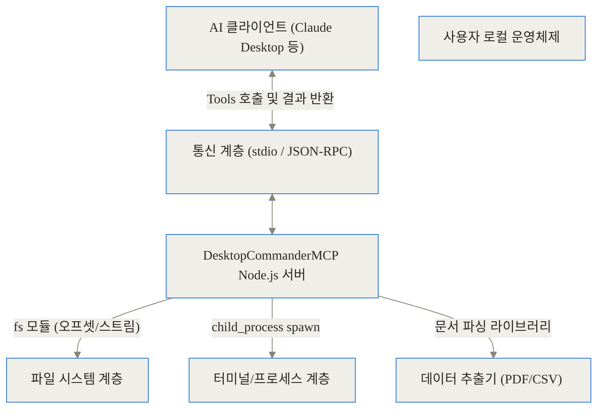
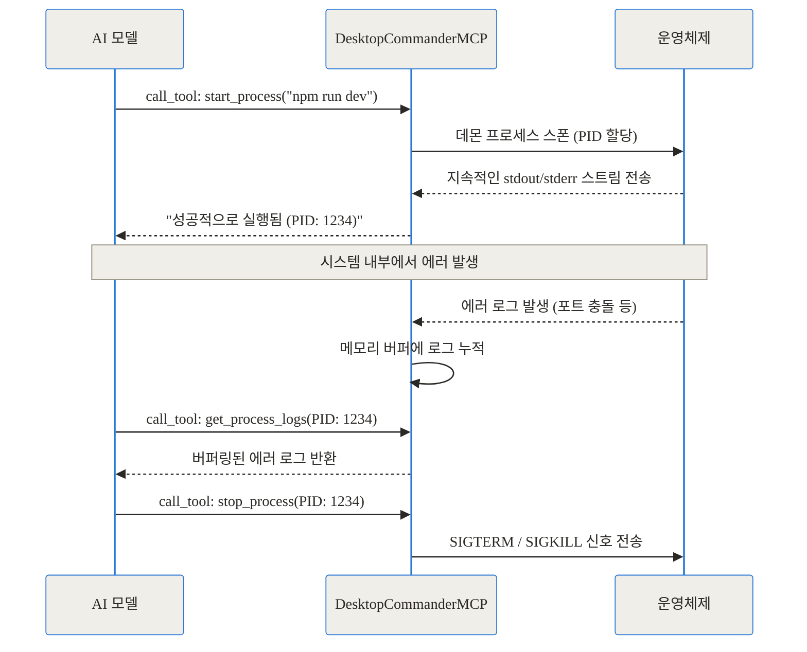
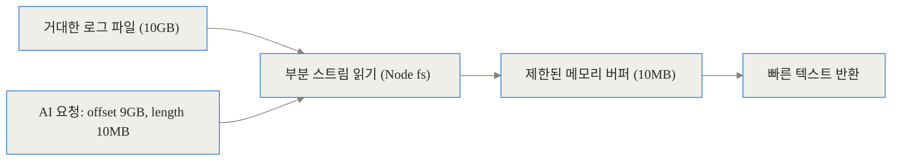
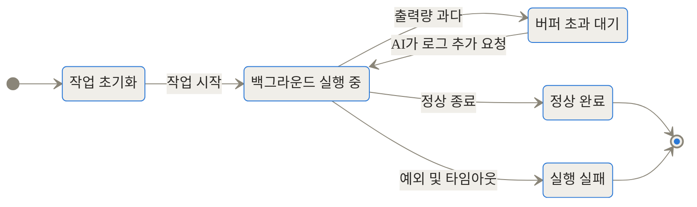
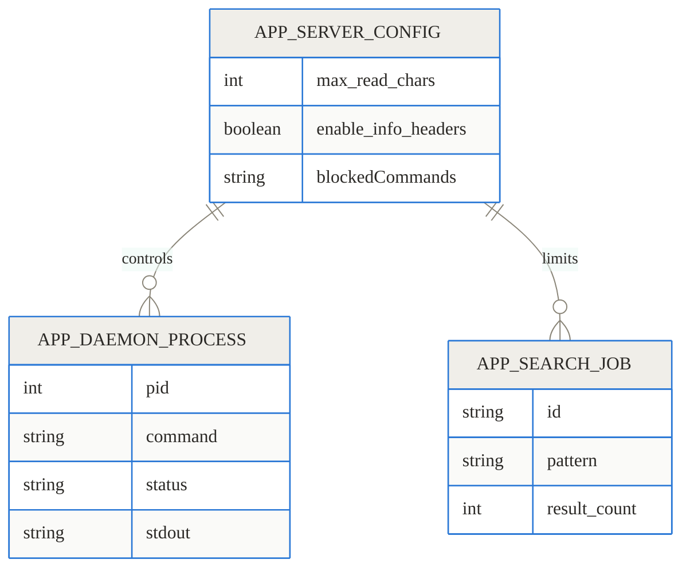
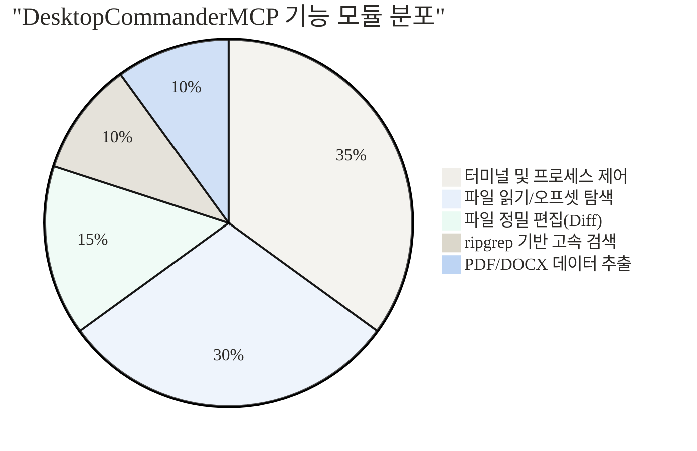

## Link Block
- GitHub: [wonderwhy-er/DesktopCommanderMCP](https://github.com/wonderwhy-er/DesktopCommanderMCP)
- NPM: [@wonderwhy-er/desktop-commander](https://www.npmjs.com/package/@wonderwhy-er/desktop-commander)

## 도입 + 3줄 요약 (TL;DR)

> **TL;DR**
> - DesktopCommanderMCP는 Claude와 같은 AI 어시스턴트에게 사용자의 로컬 터미널, 파일 시스템, 프로세스 제어 권한을 제공하는 Model Context Protocol(MCP) 서버입니다.
> - 단순한 단발성 명령을 넘어, 개발 서버 등 장기 실행 프로세스를 관리하고 대용량 파일을 메모리 초과 없이 부분적으로 읽어내며, 정밀한 파일 편집을 수행합니다.
> - 사용자가 에러 로그와 코드를 일일이 복사하고 붙여넣는 수동적인 방식에서 벗어나, AI가 직접 로컬 환경을 탐색하고 수정하는 실질적 AI 페어 프로그래밍을 가능하게 합니다.


## 배경과 문제 정의: 복사-붙여넣기의 늪과 격리된 AI의 한계

AI 코딩 어시스턴트의 지능은 비약적으로 발전했지만, 실제 현업 워크플로우에 적용할 때 개발자는 여전히 답답함을 느낍니다. 기존 방식이 가진 구체적인 고통(Pain Point)을 깊이 파헤쳐 보겠습니다.

### 단절된 환경과 컨텍스트의 병목
일반적인 AI 채팅 환경은 사용자의 로컬 컴퓨터와 철저히 분리되어 있습니다. 코드를 작성하다 터미널에 에러가 발생하면, 개발자는 에러 텍스트를 마우스로 드래그해서 복사하고 AI 채팅창에 붙여넣습니다. AI가 수정된 전체 코드를 알려주면, 개발자는 다시 그것을 복사해 에디터에 붙여넣고 스크립트를 재실행해야 합니다. 하루에도 수십 번씩 반복되는 이 과정은 개발자의 집중력을 심각하게 떨어뜨립니다.

### 기존 샌드박스 인터프리터의 한계
일부 AI 챗봇이 제공하는 '코드 인터프리터' 기능은 안전한 가상 샌드박스 안에서만 동작합니다. 하지만 실제 개발은 격리된 환경에서 이루어지지 않습니다. 내 컴퓨터에 구성된 복잡한 디렉토리 구조, 수많은 로컬 환경 변수, 도커(Docker) 컨테이너 내의 데이터베이스가 맞물려 돌아가야 합니다. 기존 방식으로는 AI가 "내 컴퓨터의 현재 상태"를 결코 이해할 수 없습니다.

### 대용량 데이터와 데몬 프로세스 처리 불가
기존 도구들은 수십 메가바이트의 로그 파일이나 거대한 CSV 파일을 한 번에 읽으려다 AI의 컨텍스트 한계를 초과하거나 메모리 에러를 뱉어냅니다. 또한 `npm run dev`나 파이썬 로컬 서버처럼 한 번 실행 후 백그라운드에 계속 켜두고 로그를 관찰해야 하는 프로세스를 다루는 기능이 전무했습니다.

이런 한계들로 인해 AI는 그저 코드를 던져주는 '조언자'에 머물렀습니다. AI가 직접 키보드를 두드려 로그를 보고, 내 파일을 열어 고치고, 스스로 서버를 재시작해 결과를 확인할 수는 없을까요? 이 문제를 근본적으로 해결하기 위해 등장한 것이 바로 DesktopCommanderMCP입니다.

## 개념 쉽게: 눈과 손을 가진 원격 동료

이 복잡해 보이는 도구의 핵심 아이디어를 비유로 쉽게 설명해 보겠습니다.

기존의 AI 사용 방식은 마치 메신저로만 연락할 수 있는 아주 똑똑한 원격 전문가와 일하는 것과 같습니다. 화면에 에러가 나면 당신은 그 내용을 일일이 타이핑해서 전송하고, 전문가는 해결책을 다시 문자로 보내줍니다. 결국 손을 움직여 시스템을 고치는 것은 당신입니다.

DesktopCommanderMCP는 이 원격 전문가에게 **당신의 컴퓨터를 제어할 수 있는 '원격 마우스와 키보드', 그리고 방대한 파일을 순식간에 찾아볼 수 있는 '고성능 돋보기'**를 쥐어주는 것과 같습니다.
이제 전문가(AI)는 직접 터미널을 열어 명령어를 치고, 에러 로그를 읽고, 소스 코드 파일을 찾아낸 뒤 스스로 내용을 수정합니다. 당신은 그저 "데이터베이스 연결 에러 좀 해결해 줄래?"라고 방향만 지시하고 그가 일하는 모습을 지켜보기만 하면 됩니다.

## 작동 원리 심층 (Under the Hood)

그렇다면 DesktopCommanderMCP는 내부적으로 어떻게 이 거대한 권한을 AI에게 넘겨주고 관리할까요? 아키텍처와 주요 알고리즘을 여러 단계로 쪼개어 깊이 들여다보겠습니다.

### 1. MCP(Model Context Protocol) 기반 아키텍처
이 프로젝트는 Anthropic이 설계한 모델 컨텍스트 프로토콜(MCP)을 기반으로 구축되었습니다. MCP는 클라이언트(Claude)와 로컬 도구(서버) 간의 통신 표준을 정의합니다.



AI 클라이언트가 백그라운드에서 이 서버를 자식 프로세스(Subprocess)로 실행하면, 서로 표준 입출력(stdio)을 통해 통신합니다. 서버는 "나는 파일을 읽고, 터미널 명령을 칠 수 있어"라는 명세(Schema)를 클라이언트에 전달하고, 클라이언트는 이를 바탕으로 필요한 도구를 호출합니다.

### 2. 장기 실행 프로세스 (Long-running Process) 관리
가장 강력한 기능 중 하나는 프로세스의 지속적인 상태 관리입니다. 단발성 스크립트 실행이 아니라, 실행 상태를 유지하며 지속적으로 출력을 모니터링합니다.



이러한 상호작용 덕분에 AI는 스스로 프론트엔드 서버나 파이썬 REPL을 띄워두고, 문제가 생기면 로그를 확인해 소스코드를 고친 뒤 다시 재시작하는 온전한 개발 루프를 완성합니다.

### 3. 대용량 파일 오프셋(Offset) 스트리밍
수십 기가바이트의 CSV나 로그 파일을 다룰 때 서버가 뻗어버리는 현상을 막기 위해, 최신 업데이트에서는 오프셋 읽기가 도입되었습니다.



파일 전체를 메모리에 올리는 대신, 원하는 바이트 지점(Offset)으로 점프하여 필요한 만큼만 잘라서 읽습니다. 이를 통해 메모리 점유율을 90% 이상 획기적으로 낮추면서도 거의 즉각적인 응답 속도를 보여줍니다.

### 4. 상태 관리와 생명주기
명령어나 검색과 같이 시간이 오래 걸리는 작업은 서버 내에서 엄격한 상태 관리를 거칩니다.



출력 버퍼가 가득 차면 서버는 무작정 데이터를 보내 AI 클라이언트를 다운시키는 대신, 작업을 일시 정지(Paused) 상태로 두고 AI가 명시적으로 추가 데이터를 요청할 때까지 기다립니다. 대역폭과 토큰 낭비를 막는 매우 영리한 설계입니다.

### 5. 서버 데이터 모델 관계도
서버 내에서 관리되는 설정과 작업 단위들은 다음과 같은 관계를 갖습니다.



### 6. 기능별 모듈 비중
전체 코드베이스와 제공되는 26개의 도구를 역할별로 묶어보면 이 시스템의 목적이 확연히 드러납니다.



결국 단순히 코드를 짜주는 것을 넘어, 시스템을 관찰하고 파일을 조작하는 '행동' 중심의 아키텍처로 짜여 있음을 알 수 있습니다.


## 구현 및 사용 디테일

이 강력한 도구를 실제로 내 컴퓨터에 구성하는 방법은 매우 간단합니다.

### 한 줄 자동 설치
Node.js가 설치되어 있다면 터미널에 아래 명령어만 입력하면 됩니다.

> `npx -y @wonderwhy-er/desktop-commander setup`

이 스크립트는 운영체제를 감지하고, 사용 중인 AI 클라이언트(Claude Desktop 등)의 `claude_desktop_config.json` 파일을 자동으로 찾아 서버 실행 경로와 필수 설정을 삽입합니다.

### 수동 설정 파서 (Advanced)
직접 설정을 제어하고 싶다면 JSON 구성 파일에 다음 블록을 추가합니다.

```json
{
  "mcpServers": {
    "desktop-commander-mcp": {
      "command": "npx",
      "args": [
        "-y",
        "@wonderwhy-er/desktop-commander@latest"
      ],
      "env": {}
    }
  }
}
```
이후 클라이언트를 재시작하면 AI가 "내 시스템에 접근할 수 있는 권한이 생겼다"는 것을 인지하고 대화를 시작합니다.

### 감사 로그 (Audit Log) - 보안의 핵심
"AI가 내 파일들을 몰래 지우면 어떡하지?"라는 걱정이 드는 것은 당연합니다. DesktopCommanderMCP는 보안과 투명성을 위해 모든 행동을 꼼꼼하게 기록합니다.
사용자 홈 디렉토리의 `~/.claude-server-commander/claude_tool_call.log` 경로에 파일이 생성되며, 언제 어떤 명령어를 실행했고 어느 파일을 어떻게 수정했는지 정확히 남습니다.

## 실전 활용 시나리오

현업 개발 과정에서 이 도구가 얼마나 강력한 위력을 발휘하는지 구체적인 시나리오 2가지를 통해 확인해 보겠습니다.

### 시나리오 1: 프론트엔드 개발 서버 원스톱 트러블슈팅
1. **상황**: 로컬 React 프로젝트에서 원인 모를 렌더링 에러가 발생합니다.
2. **AI 지시**: "현재 폴더에서 개발 서버 띄우고, 화면에 뜨는 에러 원인 찾아서 고쳐줘."
3. **자동화된 과정**:
   - AI가 `start_process`로 `npm run dev` 실행.
   - 백그라운드 프로세스 로그에서 특정 컴포넌트의 변수 오타 발견.
   - `start_search` 도구로 프로젝트 내 해당 파일 위치 고속 검색.
   - `read_file`로 코드를 확인한 뒤, `write_file` 도구를 이용해 문제가 되는 단 1줄만 정확히 교체 (Diff 편집).
   - 프로세스를 껐다 켜서 에러가 사라졌음을 확인.
4. **결과**: 사용자는 키보드에 손을 대지 않고 버그 수정이 완료된 화면을 얻습니다.

### 시나리오 2: 초거대 데이터셋 분석
1. **상황**: 2GB짜리 `server_access.csv` 파일에서 어제 발생한 결제 에러 패턴을 찾아야 합니다.
2. **AI 지시**: "이 폴더에 있는 2GB CSV 파일에서 가장 최근(끝부분) 로그 500줄만 읽어서 결제 에러 패턴을 분석해."
3. **자동화된 과정**:
   - AI는 `get_file_info`를 호출해 파일의 총 바이트 크기를 확인합니다.
   - 전체 크기를 바탕으로 끝부분에 해당하는 Offset 값을 계산해 `read_file` 도구를 호출, 정확히 마지막 데이터 블록만 메모리로 가져옵니다.
4. **결과**: 메모리 부족 현상 없이 단 3초 만에 AI가 데이터 요약과 해결책을 내놓습니다.

## 벤치마크 및 비교

단순히 편리하다는 느낌을 넘어, 기존 방식과 비교했을 때 수치적으로 어떤 우위에 있는지 표와 그래프로 검증합니다.

### 기존 워크플로우와의 비교 트레이드오프

| 비교 항목 | 기존 수동 방식 (사용자 복붙) | 샌드박스 인터프리터 방식 | DesktopCommanderMCP |
| :--- | :--- | :--- | :--- |
| **로컬 환경 접근성** | 불가능 (격리됨) | 낮음 (업로드된 파일만) | **매우 높음 (모든 시스템 파일/변수)** |
| **장기 데몬 관리** | 불가능 | 불가능 | **완전 지원 (서버 구동 및 로그 추적)** |
| **대용량 파일 읽기** | 사용자 직접 가공 필요 | 크기 제한 (보통 100MB 이하) | **오프셋 지정으로 무제한 크기 대응** |
| **코드 수정 방식** | 사용자가 에디터에 붙여넣기 | 불가능 | AI가 직접 Diff로 정밀 수정 |
| **시스템 보안 위험도** | 안전 (변화 없음) | 안전 (컨테이너 내 폐기) | **위험 (실제 파일 삭제/수정 가능)** |

### 대용량 데이터(5MB JSON) 읽기 최적화 벤치마크
최근 업데이트된 오프셋 읽기 기술이 적용되기 전후의 퍼포먼스를 비교한 차트입니다.

```chartjs
{
  "type": "bar",
  "data": {
    "labels": ["기존 방식 (전체 파일 로드)", "현재 방식 (DesktopCommanderMCP 오프셋 읽기)"],
    "datasets": [
      {
        "label": "메모리 사용량 (MB)",
        "data": [120, 5]
      },
      {
        "label": "응답 시간 (ms)",
        "data": [2500, 45]
      }
    ]
  }
}
```

데이터에서 보이듯, 필요한 구간만 읽어들이는 방식은 메모리를 약 90% 이상 절감하며, AI 클라이언트가 감당해야 할 토큰 수까지 줄여 응답 속도를 폭발적으로 향상시킵니다.

## 솔직한 평가: 완벽한 도구는 없다

이 도구가 제시하는 비전은 놀랍지만, 시스템 전체의 제어권을 넘긴다는 본질적인 한계와 리스크를 명확히 짚어야 합니다.

### 1. 치명적인 파괴 가능성
`rm -rf /`를 실행할 수 있는 권한을 AI가 가졌다는 것은 매우 큰 위험입니다. 사용자가 애매하게 "이전 파일들 다 지워줘"라고 말했을 때, AI가 잘못된 디렉토리를 참조해 귀중한 프로젝트 데이터를 통째로 날릴 수 있습니다. 설정에서 `blockedCommands` 옵션으로 위험한 명령을 차단할 수 있지만, 기본적으로 이 도구를 돌릴 때는 항상 **감사 로그(Audit Log)**를 확인하고, 중요한 코드는 반드시 Git 커밋으로 보호한 뒤 작업해야 합니다.

### 2. Windows MSIX 패키징 호환성 문제
Windows 환경에서 Claude Desktop과 연동할 때 약간의 장애물이 보고되고 있습니다. 환경 변수인 `WINDIR`이 누락되거나 `.CPL` 확장자 실행 파일 경로 문제 등, 하위 호환성 버그가 종종 발생합니다. 최신 릴리즈에서 상당 부분 패치되었으나, 여전히 리눅스나 macOS 터미널(Bash/Zsh)에 비해 윈도우(PowerShell) 제어에서는 예기치 않은 오류가 더 자주 발생합니다.

### 3. AI 컨텍스트 윈도우의 증발
AI가 여러 폴더를 돌아다니며 검색하고, 서버 로그를 수시로 확인하다 보면 엄청난 양의 텍스트가 대화 기록에 누적됩니다. 20만 토큰 이상을 지원하는 최신 모델이라 하더라도, 불필요한 시스템 로그가 너무 많이 쌓이면 모델이 이전에 지시한 핵심 요구사항을 잊어버리는 환각(Hallucination) 현상이 나타날 수 있습니다. 따라서 작업 단위를 작고 명확하게 나누어 지시하는 프롬프트 엔지니어링 스킬이 필요합니다.

## 마무리: AI 에이전트 시대의 필수 인프라

DesktopCommanderMCP는 AI가 더 이상 수동적인 텍스트 생성기가 아님을 여실히 증명합니다. 터미널을 열고 명령어를 타이핑하며, 에러를 보고 파일을 고쳐 서버를 재시작하는 과정은 이미 숙련된 개발자의 행동 양식과 똑같습니다.

물론, 강력한 권한에 따르는 보안 문제와 윈도우 환경에서의 일부 불안정성은 우리가 계속 풀어가야 할 숙제입니다. 하지만 수십 번 복사-붙여넣기를 반복하며 소모하던 우리의 귀중한 시간과 에너지를 구출해 준다는 점에서, 이 도구는 도입할 가치가 충분합니다.

격리된 채팅창 속에 갇혀 있던 AI에게 진짜 세상을 보여주고 싶다면, 지금 바로 터미널을 열고 설정 스크립트를 실행해 보십시오. AI가 내 컴퓨터 속을 돌아다니며 쉼 없이 버그를 잡아내는 광경은, 미래의 개발 워크플로우를 가장 먼저 맛보는 충격적이고 짜릿한 경험이 될 것입니다.

## 자주 묻는 질문 (FAQ)

### DesktopCommanderMCP는 토큰 비용을 어떻게 절약하나요?

대용량 파일을 처리할 때 전체 텍스트를 AI에게 넘기는 대신, 오프셋(Offset) 읽기를 통해 필요한 수십 킬로바이트만 추출해 전달합니다. 이를 통해 불필요한 컨텍스트 토큰 소모를 극적으로 줄여 비용 절감과 속도 향상을 동시에 달성합니다.

### AI가 시스템의 중요한 파일을 마음대로 삭제하면 어떡하나요?

해당 도구는 매우 강력한 시스템 제어 권한을 갖기 때문에 실제로 잘못된 명령으로 파일을 지울 위험이 존재합니다. 이를 방지하기 위해 서버 설정 파일에서 `blockedCommands` 옵션을 통해 특정 명령어(예: rm)를 차단할 수 있으며, 모든 행동은 로컬 감사 로그(Audit Log)에 빠짐없이 기록됩니다.

### Windows 운영체제에서도 잘 동작하나요?

네, 지원은 하지만 Windows 특유의 제약이 일부 있습니다. 특히 Claude Desktop이 MSIX로 패키징되어 있어 프로세스 환경 변수(예: WINDIR)가 누락되는 이슈가 보고된 바 있습니다. 복잡한 쉘 스크립트보다는 기본적인 PowerShell 명령 위주로 사용하거나 macOS/Linux 환경에서 더 안정적으로 동작합니다.

### 단순한 단발성 터미널 명령어만 실행할 수 있나요?

아닙니다. DesktopCommanderMCP의 핵심 강점 중 하나는 장기 실행 프로세스 관리입니다. 도커(Docker) 컨테이너 구동, 프론트엔드 개발 서버 띄우기, 파이썬 REPL 실행 등 한 번 실행하고 백그라운드에 켜두어야 하는 데몬들을 관리하며 지속적으로 로그를 모니터링할 수 있습니다.

### MCP를 지원하지 않는 일반 웹 브라우저(ChatGPT 등)에서도 사용할 수 있나요?

최신 버전에서는 Remote MCP 모드를 지원하기 시작했습니다. `npx @wonderwhy-er/desktop-commander@latest remote`를 실행하고 브라우저에서 OAuth 2.0 인증을 거치면, ChatGPT 웹 인터페이스 등에서도 원격으로 연결해 데스크탑을 제어할 수 있습니다.


## References
- [https://github.com/wonderwhy-er/DesktopCommanderMCP](https://github.com/wonderwhy-er/DesktopCommanderMCP)
- [https://www.npmjs.com/package/@wonderwhy-er/desktop-commander](https://www.npmjs.com/package/@wonderwhy-er/desktop-commander)
- [https://ko-fi.com/eduardsruzga](https://ko-fi.com/eduardsruzga)
