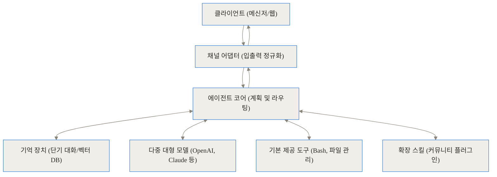
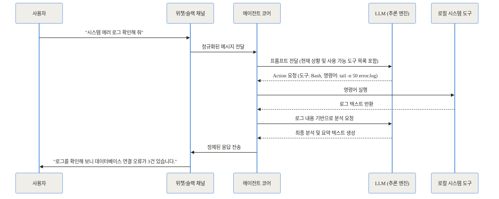
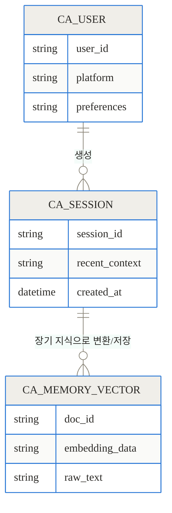
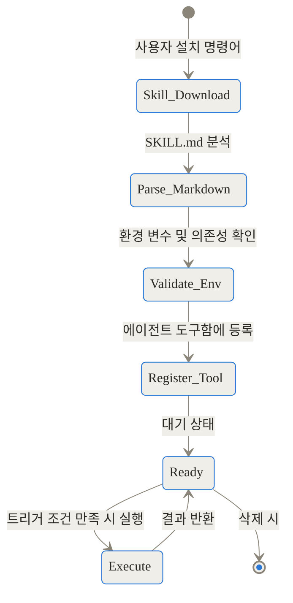
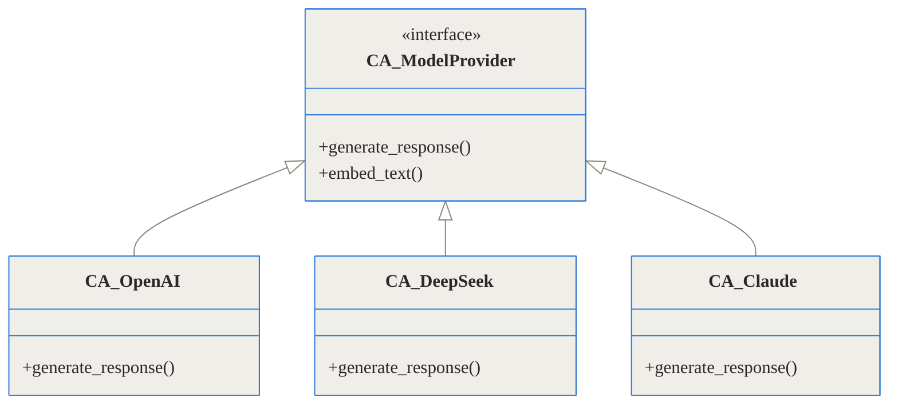
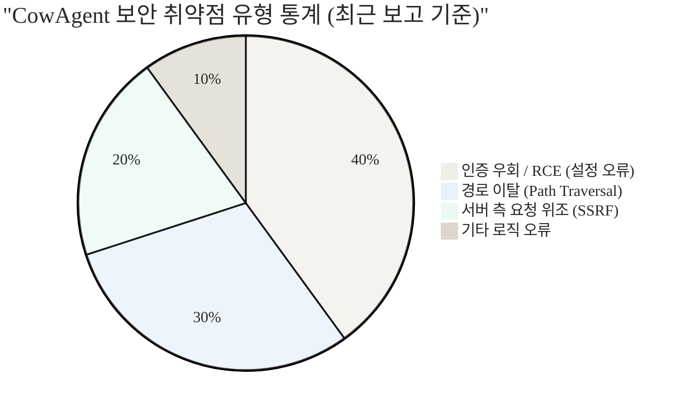

## 관련 링크 및 공식 저장소

- [CowAgent GitHub 저장소](https://github.com/zhayujie/CowAgent)
- [공식 웹사이트 및 문서](https://cowagent.ai)
- [Cow Skill Hub (스킬 공유 플랫폼)](https://skills.cowagent.ai)

## 시작하며: 왜 챗봇 대신 에이전트인가

우리는 매일 브라우저 창을 열고 대형 언어 모델과 대화를 나눕니다. 질문을 던지면 똑똑한 답변이 돌아오지만, 대화창을 닫는 순간 그 모델은 우리의 업무 맥락을 잊어버립니다. 또한, 챗봇은 말만 할 뿐 실제로 내 컴퓨터의 파일을 정리해주거나, 회사 메신저에 들어온 문의를 스스로 분류해주지 못합니다.

이러한 수동적인 '질의응답'의 한계를 극복하기 위해 등장한 개념이 바로 'AI 에이전트(Agent)'입니다. 에이전트는 사용자의 지시를 받으면 스스로 계획을 세우고, 필요한 도구를 찾아 실행하며, 그 결과를 바탕으로 다시 생각하는 능동적인 소프트웨어입니다. 

오늘 살펴볼 **CowAgent**는 이러한 에이전트 기술을 누구나 개인 서버나 컴퓨터에 쉽게 구축할 수 있도록 만들어진 오픈소스 프로젝트입니다. 과거 중국을 중심으로 큰 인기를 끌었던 `chatgpt-on-wechat` 프로젝트가 발전하여 현재의 통합 에이전트 프레임워크인 CowAgent로 재탄생했습니다. 이 글에서는 CowAgent가 어떤 구조로 작동하며, 어떻게 우리의 일상을 자동화할 수 있는지 구체적인 원리와 활용법을 깊이 있게 살펴보겠습니다.

## CowAgent가 해결하려는 세 가지 주요 문제

기존의 언어 모델 인터페이스나 단순한 API 연동 스크립트들이 공통적으로 겪던 고충이 있습니다. CowAgent는 바로 이 지점들을 실질적으로 해결하는 데 집중합니다.

1. **파편화된 소통 채널 (채널의 장벽)**
   대부분의 업무 지시는 슬랙, 텔레그램, 카카오톡, 위챗 같은 메신저에서 발생합니다. 하지만 AI는 별도의 웹사이트에 존재하죠. CowAgent는 다중 채널(Multi-channel) 아키텍처를 도입하여 사용자가 익숙한 메신저 환경을 벗어나지 않고도 AI와 소통할 수 있게 합니다.

2. **도구 접근성의 부재 (손발이 없는 뇌)**
   아무리 똑똑한 모델이라도 내 로컬 컴퓨터의 로그 파일을 읽어오거나 깃허브 저장소를 클론(clone)할 수는 없습니다. CowAgent는 에이전트 모드를 통해 쉘(Bash) 실행, 파일 시스템 읽기/쓰기, 웹 스크래핑 등의 도구를 모델에게 쥐여줍니다. 

3. **단기 기억 상실 (컨텍스트 증발)**
   기본적인 챗봇은 수천 토큰이 넘어가면 과거 대화를 잊습니다. CowAgent는 내부적으로 벡터 데이터베이스와 장기 기억(Long-term memory) 관리 시스템을 내장하여, 과거에 나누었던 대화나 주입된 지식을 시간이 지나도 자연스럽게 떠올리도록 설계되었습니다.

## 직관적인 비유: 잘 갖춰진 주방과 수석 셰프

이 구조를 일상적인 비유로 풀어보겠습니다. 대형 언어 모델(LLM) 자체는 레시피를 완벽하게 외우고 있는 '천재 셰프'와 같습니다. 하지만 셰프를 텅 빈 방에 가둬두면 요리를 할 수 없습니다.

CowAgent는 이 셰프에게 '최고급 주방(프레임워크)'을 지어주는 역할을 합니다. 메신저 연동 모듈은 손님의 주문을 받는 '웨이터'이고, 로컬 시스템 접근 권한은 요리할 수 있는 '조리 도구'이며, 장기 기억 시스템은 단골손님의 취향을 기록해둔 '비밀 노트'입니다. 이 모든 것이 유기적으로 연결될 때 비로소 자율적인 AI 비서가 탄생하는 것이죠.

## 내부 아키텍처 파헤치기 (Under the Hood)

이제 CowAgent가 내부적으로 어떻게 작동하는지 시스템 구조를 뜯어보겠습니다. 프로젝트의 구조는 크게 사용자와 맞닿는 채널부, 생각을 담당하는 에이전트 코어, 그리고 외부 세계와 작용하는 도구부로 나뉩니다.


### 1. 전반적인 파이프라인 흐름

사용자의 메시지가 어떻게 처리되어 다시 응답으로 돌아가는지 파이프라인 흐름을 살펴보면 다음과 같습니다.



가장 중심적인 역할을 하는 부분은 '에이전트 코어'입니다. 들어온 텍스트의 의도를 파악하고, 단순한 대답으로 끝낼지 아니면 특정 도구를 사용해야 할지 판단합니다.

### 2. 컴포넌트 간 상호작용 (요청의 생애주기)

사용자가 "최근 시스템 로그의 에러를 요약해 줘"라고 메신저에 입력했을 때, 시스템 내부에서는 여러 번의 왕복 통신이 일어납니다. 언어 모델이 한 번에 대답하는 것이 아니라, 상황을 인지하고 도구를 요청한 뒤 결과를 받아 다시 생각하는 ReAct(Reasoning and Acting) 패턴을 따르기 때문입니다.



이러한 설계 덕분에 CowAgent는 단순히 말을 잘하는 챗봇이 아니라, 실제 문제를 진단하고 해결할 수 있는 능력을 갖추게 됩니다.

### 3. 장기 기억과 컨텍스트 관리

챗봇이 똑똑해 보이려면 과거의 대화를 기억해야 합니다. CowAgent는 단기 기억(최근 대화 내역)과 장기 기억(지식 베이스)을 분리하여 관리합니다.



대화가 길어지면 에이전트는 오래된 대화를 요약하여 벡터 공간에 저장합니다. 이후 관련된 질문이 들어오면 벡터 검색을 통해 필요한 기억만 선택적으로 불러와 컨텍스트 창(Context Window)의 낭비를 막습니다.


위 사진처럼 제공되는 웹 콘솔을 통해 사용자는 AI가 어떤 기억을 가지고 있는지 직접 확인하고 편집할 수 있습니다.

### 4. 스킬(Skill) 시스템: 무한한 확장의 비밀

CowAgent의 가장 눈여겨볼 만한 구조적 특징은 `SKILL.md`를 중심으로 돌아가는 스킬 시스템입니다. 일반적인 프레임워크들이 복잡한 파이썬 코드를 작성해야 플러그인을 만들 수 있는 반면, CowAgent는 마크다운 파일 하나로 스킬을 정의합니다.

스킬 파일의 구조는 자연어 프롬프트와 메타데이터의 결합입니다. 에이전트는 이 마크다운 파일을 읽고 자신이 어떤 새로운 능력을 얻었는지 학습합니다.



이러한 구조 덕분에 개발자가 아닌 사람도 프롬프트 엔지니어링만으로 새로운 스킬을 창조하고, Cow Skill Hub 커뮤니티에 공유할 수 있습니다.

### 5. 다중 모델 지원 구조

하나의 모델에 종속되지 않는다는 점도 큰 장점입니다. 클래스 구조를 살펴보면 모델과 채널이 추상화되어 있어 확장이 용이합니다.



비용이 저렴한 DeepSeek로 일상적인 대화를 처리하고, 복잡한 코딩 작업이 필요할 때는 Claude 3.5 Sonnet으로 전환하는 식의 유연한 구성이 가능합니다.

## 벤치마크 및 타 프레임워크와의 비교

기존 도구들과 비교했을 때 CowAgent의 포지셔닝을 이해하기 위해 속도와 토큰 절감량 등을 비교해 보겠습니다.

기본적인 AI 에이전트 도구(예: AutoGPT, OpenClaw 등)와 비교할 때, CowAgent는 메신저 통합과 가벼운 배포 환경에 최적화되어 있습니다.

| 비교 항목 | CowAgent (구 chatgpt-on-wechat) | 일반적인 AutoGPT | Dify / Coze (클라우드) |
| :--- | :--- | :--- | :--- |
| **배포 방식** | 로컬 / 서버 1줄 설치 | 로컬 복잡한 설정 필요 | SaaS 클라우드 종속 |
| **주요 인터페이스** | 위챗, 슬랙 등 메신저 통합 | 터미널 (CLI) | 웹 브라우저 캔버스 |
| **플러그인 작성** | SKILL.md (자연어 + 마크다운) | 파이썬 스크립트 작성 필수 | GUI 노드 연결 |
| **장기 기억 처리** | 내장 벡터 DB 및 자동 요약 | 외부 DB 연동 필요 | 서비스 제공자 의존 |
| **자율 실행 여부** | 쉘, 파일 접근 등 로컬 통제권 보유 | 로컬 파일 읽기/쓰기 가능 | 샌드박스 내 제한적 실행 |

특히 장기 기억 모듈을 통한 토큰 절감 효과는 매우 큽니다. 매번 전체 컨텍스트를 보내는 방식과, CowAgent처럼 기억 벡터에서 필요한 정보만 검색하여 프롬프트에 주입하는 방식의 토큰 사용량을 비교해보면 아래 그래프와 같은 차이가 발생합니다.

```chartjs
{
  "type": "bar",
  "data": {
    "labels": ["전체 맥락 주입 (기존 챗봇)", "벡터 검색 기반 기억 호출 (CowAgent)"],
    "datasets": [{
      "label": "100회 대화 시 평균 누적 토큰 사용량",
      "data": [450000, 35000],
      "backgroundColor": ["rgba(255, 99, 132, 0.5)", "rgba(54, 162, 235, 0.5)"]
    }]
  },
  "options": {
    "responsive": true,
    "scales": {
      "y": { "beginAtZero": true }
    }
  }
}
```

불필요한 과거 텍스트를 언어 모델에 전송하지 않기 때문에, API 호출 비용을 획기적으로 줄이면서도 일관된 답변 품질을 유지할 수 있습니다.

## 설치 및 실전 활용 시나리오

### 가볍고 빠른 설치 과정

프로젝트는 파이썬 기반으로 작성되었으며, 도커(Docker)를 통한 원클릭 배포를 지원합니다. 

```bash
# 저장소 복제
git clone https://github.com/zhayujie/CowAgent.git
cd CowAgent

# 의존성 설치 및 실행
pip install -r requirements.txt
python app.py
```

이후 제공되는 웹 콘솔(기본 포트 9899)에 접속하여 사용하려는 언어 모델의 API 키를 입력하고, 연동할 채널을 선택하면 기본적인 준비가 끝납니다.


### 스킬 설치 방법

새로운 능력이 필요하다면 터미널이나 채팅창에 아래와 같은 명령어를 입력하기만 하면 됩니다.

```bash
# 공식 허브에서 스킬 설치
cow skill install github_search

# 특정 깃허브 저장소의 스킬 직접 설치
cow skill install github:owner/repo
```

### 현업 트러블슈팅 활용 시나리오

**시나리오 1: 새벽에 터진 서버 장애 대응**
개발자가 슬랙에서 CowAgent를 호출합니다. "@CowAgent, 결제 서버 로그에서 오늘 새벽 3시에 발생한 Exception 추적해서 요약해 줘."
에이전트는 즉시 쉘 도구를 활성화하여 서버의 로그 디렉토리로 이동하고, `grep` 명령어로 해당 시간대의 에러 로그를 추출합니다. 그리고 내용을 분석하여 원인이 데이터베이스 타임아웃임을 찾아내고 슬랙에 요약 보고서를 올립니다.

**시나리오 2: 기업용 문서 정리 자동화**
위챗이나 기업용 메신저로 긴 PDF 회의록을 전송합니다. CowAgent는 파일 분석 도구를 사용해 PDF 텍스트를 추출하고, 요약본을 작성한 뒤 노션(Notion) API 스킬을 활용해 지정된 워크스페이스에 페이지를 자동 생성합니다.

이러한 자율성을 통해 사용자는 단일한 인터페이스(자주 쓰는 메신저) 안에서 여러 애플리케이션과 로컬 시스템을 오가는 복잡한 파이프라인을 말 한마디로 통제할 수 있습니다.

## 솔직한 평가: 한계와 보안 트레이드오프

모든 기술에는 그림자가 존재합니다. AI가 스스로 로컬 명령어를 실행하고 패키지를 설치하도록 허용하는 것은 극도로 강력한 만큼 치명적인 리스크를 동반합니다. CowAgent를 도입하기 전 반드시 고려해야 할 한계와 보안 취약점을 냉정하게 짚고 넘어가겠습니다.

### 1. 웹 콘솔의 인증 부재와 RCE 위험
이전 버전(2.0.4 이하)에서는 웹 콘솔(포트 9899)의 `/message` 엔드포인트에 아무런 인증 장치가 없었습니다. 만약 이 포트가 외부 인터넷에 노출되어 있다면, 익명의 해커가 원격에서 에이전트에게 "내 악성 스크립트를 다운로드하고 실행해"라고 명령할 수 있었습니다. 이를 통해 원격 코드 실행(Unauthenticated RCE, CVE-2026-15329)이 발생한 사례가 보고되었습니다.

### 2. 스킬 설치 과정의 경로 이탈 (Path Traversal)
최근 버전인 2.1.0까지도 스킬 설치 로직 내부(`_add_package` 함수)에서 악의적으로 조작된 패키지 이름을 사용할 경우, 의도하지 않은 시스템 경로에 파일을 덮어쓸 수 있는 취약점(CVE-2026-15331)이 발견되었습니다.

### 3. 비전 툴을 통한 서버 측 요청 위조 (SSRF)
이미지를 분석하는 도구(`Vision Tool`)에서 외부 URL의 이미지를 다운로드할 때 검증이 부족하여, 공격자가 내부망의 민감한 서버(예: 클라우드 메타데이터 IP)로 요청을 보내게 만드는 취약점(CVE-2026-15330)도 존재했습니다. 현재는 2.1.2 버전에서 이러한 문제들이 패치되었습니다.

**해결책 및 권장 사항**
이 프레임워크를 운영 환경에 배포할 때는 **절대 권한이 있는 루트(root) 계정으로 실행하지 마십시오**. 반드시 도커(Docker) 컨테이너 내부나 엄격하게 권한이 제한된 샌드박스 환경에서 실행해야 하며, 9899 포트는 로컬 호스트나 신뢰할 수 있는 VPN 대역에서만 접근할 수 있도록 방화벽을 닫아두는 것이 필수입니다.



### 대안 기술
단순한 문서 기반 질의응답(RAG) 챗봇만 필요하다면, 시스템 제어 권한이 없는 Dify나 Langflow 같은 순수 워크플로우 도구를 사용하는 것이 보안 측면에서 훨씬 안전합니다. CowAgent는 '내 컴퓨터를 AI가 직접 다루게 만들고 싶을 때' 가치가 빛나는 도구입니다.

## 마무리: AI는 도구에서 동료로 진화 중

CowAgent(chatgpt-on-wechat)의 발전 과정을 지켜보면 오픈소스 생태계가 나아가는 방향이 선명하게 보입니다. 대형 언어 모델이라는 똑똑한 '두뇌'가 준비되자마자, 개발자들은 어떻게든 이 뇌에 팔과 다리를 달아주고 눈과 귀를 열어주기 위해 프레임워크를 구축해냈습니다.

스킬 허브(Skill Hub)를 통해 누구나 자신이 만든 프롬프트와 도구 세트를 공유하는 생태계는 매우 흥미롭습니다. 아직 보안과 통제력 측면에서 다듬어야 할 부분이 분명히 존재하지만, 복잡한 프로그래밍 지식 없이도 개인 맞춤형 비서를 구축할 수 있다는 점에서 CowAgent는 훌륭한 레퍼런스입니다.

이제 챗봇에게 단순히 질문을 던지고 복사/붙여넣기를 반복하는 시대는 저물고 있습니다. 나의 작업 환경을 이해하고, 내 메신저 안에서 대기하며, 필요한 명령을 스스로 실행해 주는 자율적인 동료의 시대가 열리고 있습니다. 개인 서버 한구석에 자신만의 에이전트를 입주시켜 보는 것은 어떨까요?

## 자주 묻는 질문 (FAQ)

### CowAgent란 무엇이며, 기존 chatgpt-on-wechat과 어떤 관계인가요?

CowAgent는 기존에 널리 쓰이던 오픈소스 프로젝트인 'chatgpt-on-wechat'이 이름과 구조를 변경하며 진화한 결과물입니다. 과거에는 단순히 위챗 메신저에 챗봇을 붙이는 기능에 그쳤다면, 현재는 에이전트 모드를 기본으로 탑재하여 로컬 파일 시스템에 접근하고 쉘 명령어를 실행할 수 있는 종합적인 자율 AI 비서 프레임워크로 발전했습니다.

### 어떤 메신저 플랫폼과 연동할 수 있나요?

다중 채널(Multi-channel) 어댑터 구조를 채택하여 매우 다양한 플랫폼을 지원합니다. 대표적으로 위챗, 페이슈(Feishu), 딩톡(DingTalk), 기업용 위챗, QQ 등의 메신저는 물론 일반 웹 브라우저 콘솔도 제공합니다. 채널 추상화가 잘 되어 있어 필요하다면 슬랙이나 텔레그램 등의 다른 플랫폼으로도 비교적 쉽게 확장이 가능합니다.

### 토큰을 얼마나 절감할 수 있으며, 장기 기억은 어떻게 관리되나요?

과거 대화를 모두 프롬프트에 밀어 넣는 기존 챗봇과 달리, 내부적으로 벡터 데이터베이스를 활용하여 과거의 대화를 압축 및 저장합니다. 사용자가 질문할 때 현재 상황과 관련성이 높은 기억 조각만 검색해서 꺼내오기 때문에 장기적인 대화 시 토큰 사용량을 수십 배 이상 절감할 수 있으며 문맥의 손실도 방지합니다.

### 보안상 위험은 없나요? 에이전트가 로컬 명령어를 직접 실행한다고 들었습니다.

치명적인 보안 리스크가 존재할 수 있습니다. 최근 버전(2.1.0 등)에서 경로 이탈(Path Traversal), SSRF, 인증되지 않은 웹 콘솔 접근으로 인한 RCE 취약점 등이 보고된 바 있습니다. 따라서 절대로 루트(root) 권한으로 실행해서는 안 되며, 도커 등을 이용한 엄격한 샌드박싱과 방화벽 설정(특히 9899 포트 통제)이 필수적으로 요구됩니다.

### 새로운 기능이나 도구를 추가하려면 복잡한 코딩이 필요한가요?

그렇지 않습니다. CowAgent는 'SKILL.md'라는 마크다운 파일 기반의 독특한 스킬 시스템을 갖추고 있습니다. 복잡한 파이썬 코드 없이도 자연어로 에이전트가 수행할 절차와 도구를 정의할 수 있으며, 커맨드라인에서 'cow skill install' 명령어 한 줄로 전 세계 커뮤니티가 만든 스킬을 쉽게 내려받아 적용할 수 있습니다.


## References
- [https://github.com/zhayujie/CowAgent](https://github.com/zhayujie/CowAgent)
- [https://cowagent.ai](https://cowagent.ai)
- [https://skills.cowagent.ai](https://skills.cowagent.ai)
