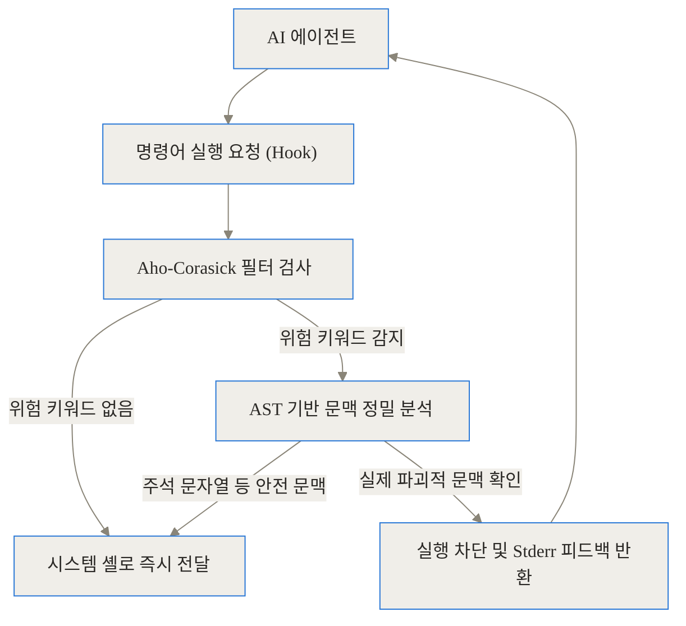
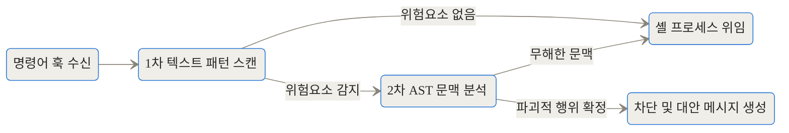
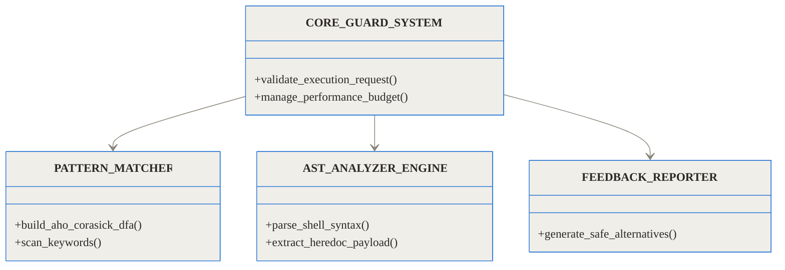
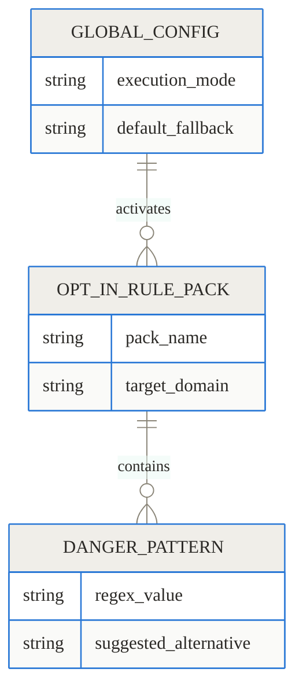
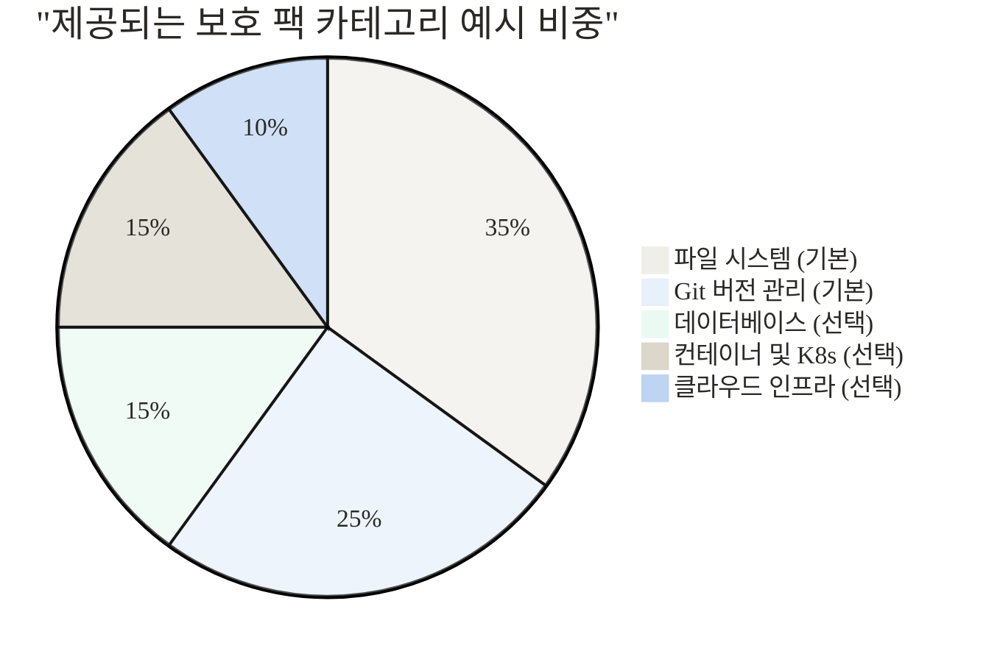

[TL;DR]
- 자율형 AI 코딩 에이전트가 임의로 파괴적인 명령어(예: `rm -rf`, `git reset`)를 실행하는 것을 방지하는 사전 실행 보안 계층(Pre-execution Safety Layer)입니다.
- Rust로 개발되었으며 Aho-Corasick 다중 패턴 매칭과 AST 구문 분석을 통해 서브 밀리초(Sub-millisecond) 단위로 명령어를 검증하여 성능 저하를 방지합니다.
- 단순 차단을 넘어 AI가 스스로 오류를 인지하고 안전한 명령어로 우회할 수 있도록 텍스트 기반의 명확한 피드백 루프를 제공합니다.

## 배경과 문제 정의: AI 에이전트에게 터미널을 맡길 때 생기는 일

최근 소프트웨어 개발의 패러다임은 큰 변화를 겪고 있습니다. Claude Code, Cursor, Copilot Workspace, Aider와 같은 도구들이 등장하면서, AI는 코드를 단순 자동 완성해 주는 조수를 넘어섰습니다. 이제 AI 에이전트는 개발자의 로컬 환경이나 터미널에 직접 접근하여 파일을 생성하고, 패키지를 설치하며, Git 명령어를 자율적으로 실행하는 능동적 주체로 진화했습니다.

이러한 터미널 제어권의 위임은 개발 생산성을 폭발적으로 끌어올리지만, 동시에 치명적인 보안 및 안정성 리스크를 유발합니다. AI 모델은 언제나 완벽하지 않으며, 특정 상황에서 환각(Hallucination)에 빠져 맥락에 맞지 않는 파괴적인 명령어를 제안하고 곧바로 실행에 옮기기도 합니다. 예를 들어, 충돌이 발생한 단일 파일의 변경 사항만 취소해야 할 상황에서, 에이전트가 판단을 잘못하여 프로젝트 전체를 날려버리는 `git reset --hard HEAD~5`를 실행하는 식입니다. 악의적으로 조작된 외부 코드를 분석하다가 숨겨진 프롬프트 인젝션(Prompt Injection)에 속아 시스템 디렉터리를 삭제하는 스크립트를 구동할 위험성도 상존합니다.

과거에는 이런 문제를 막기 위해 두 가지 방식을 주로 사용했습니다.
1. **수동 승인(Manual Approval)**: 에이전트가 셸 명령어를 실행할 때마다 개발자가 직접 엔터 키를 눌러 승인하는 방식입니다. 하지만 이는 에이전트의 '자율성'이라는 본질적 가치를 크게 훼손하며, 반복되는 확인 요청에 지친 개발자가 결국 내용을 읽지 않고 무지성으로 승인을 누르게 되는 '피로도 문제'를 유발합니다.
2. **셸 별칭(Alias)을 통한 강제 인터랙션**: `.bashrc`나 `.zshrc`에 `alias rm="rm -i"`처럼 묶어두는 방식입니다. 사람이 쓸 때는 유용하지만, 대화형(Interactive) 입력을 올바르게 처리하지 못하는 AI 에이전트에게 프롬프트가 주어지면 에이전트는 무한 대기 상태(Deadlock)에 빠져 전체 프로세스가 멈추게 됩니다.

이러한 구체적이고 치명적인 고통(Pain Point)을 해결하기 위해 개발된 도구가 바로 **Destructive Command Guard (이하 dcg)**입니다.

## 개념 쉽게 이해하기: 놀이공원의 지능형 안전바

dcg의 중심 아이디어를 일상에 빗대어 보자면 **'놀이공원 롤러코스터의 지능형 안전바'**와 같습니다. 롤러코스터(AI 에이전트)는 엄청나게 빠른 속도로 코스를 달립니다. 승객(개발자)이 코스 중간마다 속도를 줄이고 안전을 수동으로 점검해야 한다면 롤러코스터를 타는 의미가 없을 것입니다. dcg는 롤러코스터가 제 속도를 내도록 방해하지 않으면서도, 치명적으로 위험한 구간(파괴적 명령어)에 진입하려는 순간에만 물리적으로 궤도를 차단하고 경고를 보냅니다.

이 가드레일은 또 다른 중요한 특징이 있습니다. 단순한 차단벽이 아니라 '길잡이' 역할을 한다는 점입니다. AI가 잘못된 명령어를 실행하려고 하면, 시스템은 터미널 프로세스를 조용히 종료시키는 대신 터미널의 표준 에러(stderr)에 명확한 텍스트를 반환합니다.

> "차단됨: `git reset --hard`는 데이터 유실 위험이 있습니다. 대안: 단일 파일을 되돌리려면 `git restore <file>`을 사용하세요."

이 텍스트를 읽어들인 AI 에이전트는 "아, 이 명령어는 보안에 막혔구나. 제안해 준 안전한 명령어로 다시 시도해야겠다"라고 자율적으로 판단하며 궤도를 수정합니다. 이것이 바로 dcg가 AI 시대의 터미널 보안을 대하는 실질적인 접근법입니다.

## 심층 작동 원리 (Under the Hood): 고성능 명령어 분석 엔진의 내부

명령어 실행을 가로채어 검사하는 과정은 시스템에 엄청난 병목을 일으킬 수 있습니다. 개발자가 수십 개의 빌드 스크립트를 연달아 실행할 때마다 가드레일이 수십 밀리초씩 시간을 갉아먹는다면 도구를 당장 삭제하고 싶어질 것입니다. dcg는 이 문제를 Rust 기반의 고성능 엔진으로 해결했습니다.

### 1단계: Aho-Corasick 알고리즘을 통한 초고속 1차 필터링
dcg는 모든 명령어를 정밀 분석하기 전에, Aho-Corasick 다중 패턴 매칭 알고리즘을 통해 1차 필터링을 수행합니다. 이 알고리즘은 Alfred V. Aho와 Margaret J. Corasick이 고안한 것으로, 수많은 위험 키워드(`rm -rf`, `reset --hard`, `DROP TABLE` 등)를 하나의 결정론적 유한 오토마타(DFA) 상태 머신으로 컴파일해 둡니다. 그 결과, 입력된 명령어 텍스트를 단 한 번만 훑고 지나가면(선형 시간 복잡도 O(n)) 수백 개의 위험 패턴 포함 여부를 100마이크로초(0.1ms) 이내에 판별해 냅니다. 위험 키워드가 없으면 셸에 즉시 제어권을 넘겨 성능 저하를 원천 차단합니다.

### 2단계: AST 기반 문맥 파악과 오탐지 방지
만약 1차 필터링에서 `rm`이나 `reset` 같은 키워드가 발견되었다면 무조건 실행을 차단할까요? 아닙니다. 여기서 오탐지(False Positive) 문제가 발생할 수 있습니다. 예를 들어 스크립트 안에 `echo "데이터를 지우려면 rm -rf를 쓰세요"` 라는 문장이 있다면, 이는 단순한 문자열 출력일 뿐 실제 파괴 행위가 아닙니다.

이때 dcg는 `ast-grep-core` 크레이트를 호출하여 해당 셸 명령어를 추상 구문 트리(AST, Abstract Syntax Tree)로 분해합니다. 지식 그래프(코드 요소들의 관계를 구조적으로 연결해 둔 데이터 뼈대)를 분석하듯, 발견된 위험 키워드가 실제 '명령어(Command)' 위치에 있는지, 아니면 단순한 '문자열(String Literal)'이나 '주석(Comment)' 내부에 있는지를 정밀하게 판별합니다. 문맥상 안전하다고 확인되면 실행을 허용합니다.

### 3단계: Heredoc 및 인라인 스크립트 스캐닝
AI 에이전트나 공격자가 교묘하게 셸의 Heredoc(여러 줄의 텍스트나 스크립트를 한 번에 입력하는 문법, 예: `<<EOF ... EOF`) 안쪽에 파괴적인 코드를 숨길 수도 있습니다. dcg는 단순히 단일 줄만 검사하는 것이 아니라, Heredoc 시작 마커(`EOF` 등)를 인지하고 내부 페이로드를 추출한 뒤 다시 재귀적으로 분석 엔진을 태웁니다. 이 역시 1ms 이하의 엄격한 성능 예산(Performance Budget) 내에서 수행됩니다.

## 아키텍처 및 데이터 흐름 시각화

전체 시스템이 어떻게 상호작용하는지 아래 다이어그램으로 확인할 수 있습니다.



실제로 파괴적인 명령어가 차단되었을 때, 에이전트와 Guard, 그리고 셸 사이의 상태 전이 생명주기는 다음과 같이 진행됩니다.



Rust 코드베이스를 구성하는 주요 모듈의 관계도는 다음과 같습니다.



## Fail-open 설계 사상과 모듈형 확장 팩

이 프로젝트에서 가장 돋보이는 설계 철학은 **'Fail-open(장애 시 개방)'**입니다. 만약 dcg 내부의 파서(Parser)가 알려지지 않은 희귀한 셸 문법을 만나 분석에 실패하거나, 설정된 처리 시간(Timeout)을 초과하게 되면 어떻게 될까요? 시스템을 완전히 멈출까요? 

보안이 최우선인 프로덕션 서버의 방화벽이라면 모든 것을 막는 Fail-closed를 택하겠지만, dcg는 개발자의 생산성 도구이므로 쿨하게 실행을 **허용(Allow)**합니다. 이는 가드레일 자체가 개발을 방해하는 병목이 되는 것을 막고, 일상적인 작업 흐름을 끊지 않겠다는 실용적인 타협입니다.

이를 보완하기 위해 dcg는 모듈형 룰셋(팩) 구조를 취합니다.



기본적으로는 파일 삭제(`rm`)와 Git 리셋(`git reset`) 같은 핵심 룰만 활성화되어 있어 오탐지를 최소화합니다. 하지만 데이터베이스 개발자나 인프라 엔지니어를 위해 50개 이상의 선택적 팩(Opt-in packs)을 제공합니다. 이 팩들을 켜면 `DROP TABLE`, `docker prune`, `kubectl delete` 등 각 도메인의 파괴적 명령어까지 방어망을 넓힐 수 있습니다.



## 구현 및 설치 디테일

### 크로스 플랫폼 설치
dcg는 Linux, macOS, 그리고 Windows(WSL 및 PowerShell)를 모두 지원합니다. 공식 인스톨러를 사용하면 시스템 환경을 자동 감지하여 가장 적합한 바이너리를 받아오고, 환경 변수에 Hook을 주입해 줍니다.

Bash나 Zsh를 사용하는 환경이라면 아래의 스크립트 한 줄로 간단히 설치할 수 있습니다.

```bash
curl -fsSL "https://raw.githubusercontent.com/Dicklesworthstone/destructive_command_guard/main/install.sh?$(date +%s)" | bash -s -- --easy-mode
```

Windows의 PowerShell 환경에서는 전용 ps1 스크립트를 지원합니다.

```powershell
irm https://raw.githubusercontent.com/Dicklesworthstone/destructive_command_guard/main/install.ps1 | iex
```

### 에이전트 Hook 통합
설치 과정에서 `--easy-mode`를 켜면, 시스템에 설치된 12개 이상의 AI 에이전트(Claude Code, Cursor, Aider, Copilot CLI 등)를 자동으로 탐지합니다. 각 에이전트가 내부적으로 명령어를 실행할 때 호출하는 경로(예: 프로필 스크립트나 터미널 래퍼)에 dcg 바이너리를 중간자(Proxy)로 삽입하는 원리입니다. 이제 AI가 셸에 명령을 내릴 때마다 무조건 dcg의 검사대를 거치게 됩니다.

## 실전 활용 시나리오

현업에서 dcg가 어떻게 시스템을 구하는지 두 가지 구체적 시나리오를 살펴보겠습니다.

### 시나리오 1: Git 브랜치 관리 중 발생하는 파괴적 리셋
> **상황**: 에이전트에게 "어제 작업하던 커밋 하나만 되돌려줘"라고 부탁했습니다.
> **AI의 실수**: 로컬 상태를 오판하고 프로젝트의 전체 히스토리를 덮어쓰기 위해 `git reset --hard HEAD~5`를 실행하려 합니다.

에이전트가 명령어를 호출하는 순간, dcg가 이를 나노초 단위로 낚아챕니다. 터미널에는 다음과 같은 에러가 반환됩니다.
```
[Destructive Command Guard] BLOCKED: `git reset --hard` is restricted.
Reason: Destroys uncommitted working directory changes permanently.
Suggestion: Use `git reset --soft` or commit/stash changes first.
```
에이전트는 이 stderr 문구를 읽고 자신의 실수를 인지합니다. 곧바로 "아, 작업 내용이 날아갈 수 있군요. 안전하게 `git reset --soft`를 사용하겠습니다"라며 올바른 명령어를 재전송하게 됩니다. 사람이 개입하지 않아도 시스템이 자정 작용을 한 것입니다.

### 시나리오 2: 인프라 배포 스크립트의 런타임 오류 차단
> **상황**: 에이전트가 로컬 테스트용 Docker 컨테이너를 정리하는 셸 스크립트를 작성합니다.
> **AI의 실수**: 스크립트 내부에 구체적인 이미지 태그 없이 `docker image prune -a -f`를 삽입했습니다. 이대로 실행되면 다른 프로젝트를 위해 받아둔 캐시 이미지 수십 기가바이트가 함께 날아갑니다.

이 경우, dcg의 AST 분석 엔진은 다중 줄 스크립트 내부 구조를 순회합니다.

```mermaid
%%{init: {"theme":"base","themeVariables":{"primaryColor":"#F0EEE9","primaryBorderColor":"#2a78d6","primaryTextColor":"#2b2926","secondaryColor":"#e8f0fb","secondaryBorderColor":"#4a3aa7","secondaryTextColor":"#2b2926","tertiaryColor":"#eafaf3","tertiaryBorderColor":"#1baf7a","tertiaryTextColor":"#2b2926","lineColor":"#8a8578","textColor":"#2b2926","edgeLabelBackground":"#F0EEE9","noteBkgColor":"#F0EEE9","noteTextColor":"#2b2926","noteBorderColor":"#8a8578","clusterBkg":"#faf9f6","clusterBorder":"#d8d4c8","fontFamily":"Pretendard, sans-serif"}}}%%
flowchart LR
  A["다중 줄 셸 스크립트 수신"] --> B["문장 단위 AST 분리"]
  B --> C["Node: Command(docker) 파악"]
  C --> D["Arguments: prune, -a, -f 감지"]
  D --> E["Docker 팩 룰셋 위반 판정 및 차단"]
```


AST 파서가 `docker` 커맨드의 인자로 `-a`와 `-f`가 연속 결합된 노드를 정확히 식별하여 위험을 감지하고 스크립트 실행 자체를 중단시킵니다.

## 벤치마크 및 대안 비교 분석

과연 이 가드레일이 성능을 얼마나 잘 방어하는지 시각적인 벤치마크로 확인해 보겠습니다.

```chartjs
{"type":"bar","data":{"labels":["일반 터미널 직접 실행","Destructive Command Guard 통과","셸 내장 정규식 스크립트","LLM API를 통한 사전 검증"],"datasets":[{"label":"명령어 검사 지연 시간 (밀리초)","data":[0.1,0.8,15.0,1200.0]}]}}
```
차트를 보면 LLM을 통해 한 번 더 검증하는 방식(1.2초 소요)은 실시간 상호작용을 완전히 파괴합니다. 반면, Rust 기반의 dcg는 일반 터미널 실행과 거의 차이가 없는 0.8ms 수준에서 모든 분석을 끝냅니다.

서로 다른 접근 방식을 표로 정리하면 장단점이 더욱 명확해집니다.


| 비교 항목 | 무조건 수동 승인 | 셸 Alias 기반 차단 | LLM API 사전 검증 | Destructive Command Guard | 
|---|---|---|---|---|
| **AI 자율성 보장** |  (매번 사람이 엔터 입력) |  (대화형 프롬프트로 인한 정지) |  (자율성 유지) |  (에러 피드백 기반 자율 수정) |
| **지연 시간 (Latency)** |  (수 초 ~ 수십 초) |  (매우 빠름) |  (1초 이상 병목) |  (서브 밀리초 수준) |
| **문맥/스크립트 이해도** |  (사람이 직접 확인) |  (단순 텍스트 비교) |  (높은 문맥 이해) |  (AST 기반 구조적 이해) |
| **에이전트 호환성** |  (대부분 환경) |  (인터랙션 지원 불가) |  (일부 프레임워크 한정) |  (자동 Hook으로 폭넓게 지원) |


## 솔직한 평가: 한계와 트레이드오프

dcg가 제공하는 보안은 훌륭하지만 맹목적으로 의존해서는 안 될 분명한 한계도 존재합니다.

첫째, **정적 분석의 근본적 한계와 오탐지(False Positive) 가능성**입니다. 아무리 AST 파서가 강력하더라도, 런타임에 동적으로 생성되어 실행되는 문자열 조합이나 심하게 난독화된 악성 코드를 완벽히 잡을 수는 없습니다. 반대로, 개발자가 정말로 의도해서 `git reset`을 강제하려 할 때 팩 설정 때문에 귀찮게 한 단계를 우회해야 할 수도 있습니다.

둘째, **시스템 근본 권한 모델의 대체재가 아닙니다**. dcg는 철저히 사용자 경험(UX) 관점에서 에이전트의 오작동을 막아주는 얇은 애플리케이션 계층 가드레일입니다. Linux의 SELinux, AppArmor, 혹은 파일 시스템의 chown/chmod처럼 운영체제 수준에서 악의적 프로세스를 억제하는 강력한 보안 정책이 아닙니다. 사람 해커가 작정하고 터미널에 접근했다면, 셸 경로를 우회하거나 `.bashrc` 훅을 지워버림으로써 이 가드를 간단히 무력화할 수 있습니다.

따라서 공식 문서에서도 "테스트 가능한 일회성(disposable) 환경에서 훅과 정책을 먼저 시험해 본 후 적용할 것"을 강하게 권고합니다.

## 결론 및 향후 전망

자율형 AI 코딩 에이전트는 앞으로 우리 개발 환경에 더 깊숙이 들어올 것입니다. 비서가 똑똑해질수록, 그 비서가 실수했을 때 치러야 할 대가도 기하급수적으로 커집니다. Destructive Command Guard는 무작정 권한을 빼앗아 AI를 바보로 만드는 대신, '밀리초 단위의 궤도 수정'이라는 지능적이고 실용적인 해답을 제시했습니다.

명확한 피드백을 통해 AI와 협업하는 이 작고 단단한 Rust 도구는, 머지않아 모든 개발자의 로컬 환경에 설치되어야 할 필수 안전장치로 자리 잡을 것입니다.

## 자주 묻는 질문 (FAQ)

### Destructive Command Guard(dcg)는 AI 에이전트의 작동이나 시스템 속도를 크게 늦추지 않나요?

그렇지 않습니다. Rust 언어로 작성되어 0.1밀리초 수준의 Aho-Corasick 알고리즘 1차 필터링을 수행하므로, 사용자가 지연을 체감할 수 없는 서브 밀리초(sub-millisecond) 단위로 동작합니다. 일반적인 명령어는 성능 저하 없이 즉시 통과됩니다.

### 어떤 AI 에이전트들을 지원하며, 설정은 복잡한가요?

Claude Code, Cursor, Copilot CLI, Aider, Gemini CLI 등을 포함하여 12개 이상의 주요 AI 에이전트를 지원합니다. 설치 스크립트 실행 시 `--easy-mode` 플래그를 추가하면 시스템 내의 에이전트를 자동 탐지하여 Hook을 알아서 구성해 주므로 설정이 매우 간단합니다.

### 설명 중 'Fail-open 설계'란 구체적으로 무슨 의미인가요?

분석 엔진이 알 수 없는 셸 문법을 만나 파싱에 실패하거나 검사 시간을 초과하여 크래시(Crash)가 날 경우, 명령어를 차단하는 대신 실행을 허용(Allow)한다는 뜻입니다. 이는 보안 도구의 오류가 개발자의 정상적인 작업 흐름을 중단시키는 것을 막기 위한 실용적인 타협입니다.

### AI 에이전트가 아닌 제가 직접 입력하는 터미널 스크립트 환경에서도 사용할 수 있나요?

네, 가능합니다. 기본적으로는 AI 에이전트의 Hook으로 동작하도록 설계되었으나, 사용자의 셸 설정 파일(.bashrc, .zshrc)에 직접 바이너리를 래핑하도록 구성하면 일반적인 터미널 환경에서도 실수 방지용 가드레일로 훌륭하게 작동합니다.

### 파일 삭제나 Git 명령어 외에 도커나 쿠버네티스 명령어도 막아줄 수 있나요?

네, 기본 팩 외에도 50개 이상의 선택적 팩(Opt-in packs)을 제공합니다. 데이터베이스 스키마 삭제(DROP TABLE), Docker 리소스 강제 정리(prune), Kubernetes 리소스 삭제, AWS/GCP/Azure 인프라 조작 명령어 등을 선택적으로 켜서 보호 범위를 확장할 수 있습니다.


## References
- [GitHub - Dicklesworthstone/destructive_command_guard](https://github.com/Dicklesworthstone/destructive_command_guard)
- [Security Threat Model - Heredoc Detection](https://github.com/Dicklesworthstone/destructive_command_guard/blob/main/docs/security.md)
- [Docs.rs - destructive_command_guard (0.5.6)](https://docs.rs/destructive_command_guard/0.5.6/destructive_command_guard/)
- [YouTube - EP98: Claude Fable 5 Almost Deleted My Project](https://www.youtube.com/watch?v=1L36xbolicRk3VuQQb09bAGcnl1m_curF)
