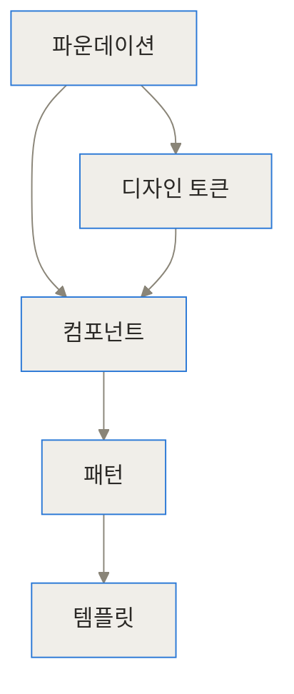
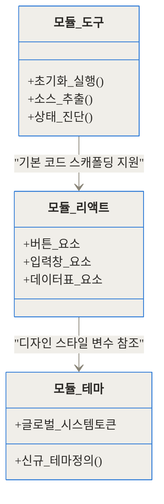
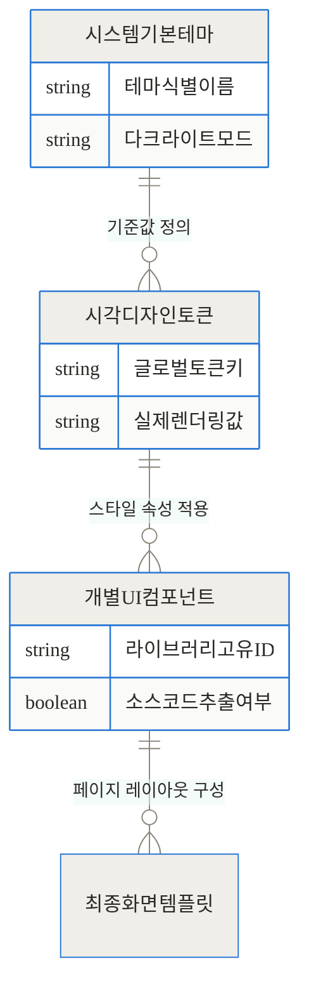
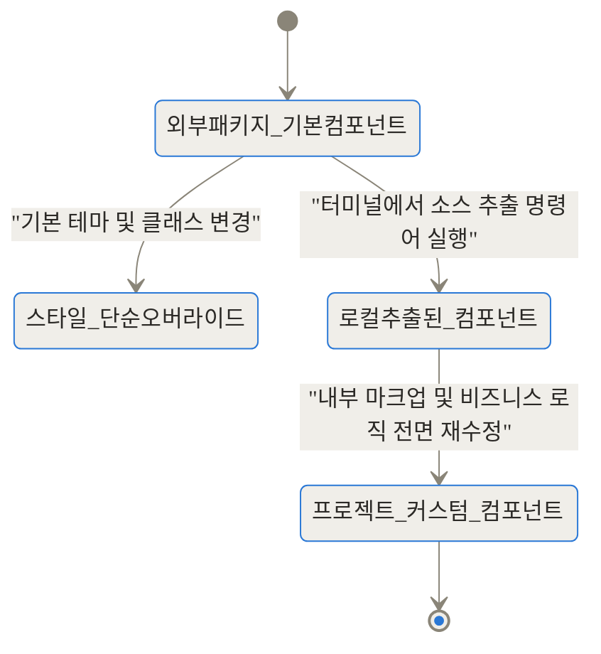
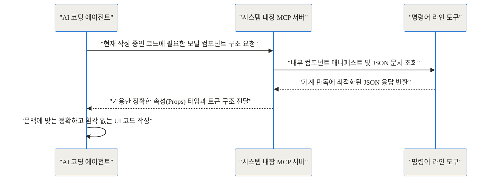
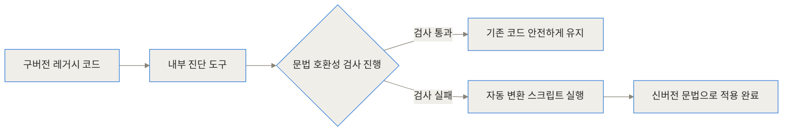

## 관련 링크 모음

- [Astryx 공식 GitHub 저장소](https://github.com/facebook/astryx)
- [Astryx 공식 웹사이트](https://astryx.atmeta.com/)
- [StyleX 공식 문서](https://stylexjs.com)

## 도입 및 3줄 요약

**TL;DR**
- 메타가 8년간 1만 3천 개 이상의 내부 앱에서 사용해 온 코어 디자인 시스템을 오픈소스로 공개했습니다.
- 리액트와 StyleX를 기반으로 150개 이상의 컴포넌트를 제공하며, 단순한 테마 변경을 넘어 컴포넌트 소스를 직접 추출하는 스위즐(Swizzle) 기능을 지원합니다.
- 업계 최초로 MCP 서버와 JSON 매니페스트를 내장하여, AI 코딩 에이전트가 사람과 동일한 기준으로 일관성 있는 UI를 구축할 수 있게 설계되었습니다.


웹 프론트엔드 생태계에는 이미 훌륭한 디자인 시스템이 수없이 많습니다. 하지만 프로젝트 규모가 커지고 참여하는 개발자의 수가 늘어날수록 기존 시스템들은 늘 뚜렷한 한계에 부딪히곤 하죠. 기업마다 고유한 브랜드 색상을 정밀하게 입혀야 하고, 때로는 비즈니스 로직의 특수성 때문에 컴포넌트의 내부 구조를 완전히 뜯어고쳐야 하는 상황이 오기 때문입니다. 더 나아가 최근에는 AI 코딩 에이전트가 현업 개발자의 주요 도구로 자리 잡으면서, 사람이 읽기 편한 일반적인 산문 형태의 문서만으로는 AI가 정확하고 일관된 UI 코드를 작성하도록 유도하기가 매우 어려워졌습니다.

메타(구 페이스북)는 이 거대한 문제를 어떻게 해결했을까요? 8년이라는 긴 시간 동안 페이스북, 인스타그램, 스레즈 등 수많은 프로덕트를 거치며 진화해 온 내부 인프라를 세상에 내놓았습니다. 이번 글에서는 메타가 공개한 오픈소스 프로젝트 Astryx(버전 0.1.3 베타)가 기존 도구들과 무엇이 다른지, 그리고 AI와 인간이 함께 UI를 구축한다는 것이 구체적으로 어떤 의미인지 하나씩 깊숙이 살펴보겠습니다.

## 배경과 문제 정의

규모가 큰 IT 기업에서 단일 디자인 시스템을 유지하고 발전시키는 것은 상상 이상으로 고된 작업입니다. 메타 내부에는 무려 1만 3천 개가 넘는 크고 작은 애플리케이션이 존재합니다. 이렇게 방대한 생태계에서 특정 디자인 시스템 하나를 모든 팀에게 강제하면 어떤 일이 벌어질까요?

첫째, 유연성 부족으로 인한 심각한 병목 현상이 발생합니다. 특정 제품 팀에서 기존의 공통 버튼 컴포넌트에 새로운 애니메이션 효과나 복잡한 내부 상태를 추가하고 싶어 한다고 가정해 보겠습니다. 하지만 중앙에서 시스템을 관리하는 팀은 다른 수많은 앱들에 미칠 사이드 이펙트를 고려해 이를 거절하거나 매우 보수적인 태도로 접근할 수밖에 없습니다. 결국 답답함을 느낀 제품 팀은 공식 시스템을 우회하여 자신들만의 독자적인 컴포넌트를 만들기 시작하고, 시스템은 점차 파편화되어 유지보수가 불가능한 상태에 빠집니다.

둘째, AI 코딩 시대에 새롭게 대두된 고통입니다. 요즘 많은 개발자가 작업 속도를 높이기 위해 Cursor, GitHub Copilot, Claude 같은 AI 도구를 사용합니다. 개발자가 AI에게 "우리 회사 디자인 시스템을 사용해서 결제 페이지를 만들어줘"라고 요청하면 그 결과는 어떨까요? 대부분의 경우 매우 처참합니다. AI는 사람을 위해 작성된 공식 문서의 복잡한 문맥을 완벽히 이해하지 못합니다. 그래서 존재하지도 않는 속성(props)을 지어내거나, 외부의 다른 유명한 오픈소스 시스템(예: Material UI)의 문법을 멋대로 섞어버립니다. 이를 흔히 환각(Hallucination)이라고 부릅니다. 사람을 위해 쓰인 아름답고 친절한 가이드라인이, AI에게는 모호하고 읽기 힘든 시(Poetry)에 불과하기 때문입니다.

## 개념 쉽게 이해하기

이러한 문제를 근본적으로 풀기 위해 메타의 엔지니어들은 관점을 완전히 바꿨습니다. "디자인 시스템을 사람뿐만 아니라 기계(AI)도 명확하게 읽고 조작할 수 있게 만들면 어떨까?"

이 아이디어를 일상적인 비유로 설명해 보겠습니다. 대형 프랜차이즈 식당의 복잡한 주방을 떠올려 보세요. 기존의 디자인 시스템은 요리사(사람)를 위해 만들어진 두껍고 텍스트가 빽빽한 '레시피 북'과 같습니다. 노련한 요리사는 문맥을 읽고 적당히 눈치껏 재료를 섞고 온도를 조절할 수 있습니다. 하지만 이 주방에 새로 들어온 자동 조리 로봇(AI)에게 이 책을 주면 어떻게 될까요? 로봇은 "적당히 노릇해질 때까지 굽는다"는 모호한 말을 이해하지 못해 엉뚱하고 타버린 요리를 내놓게 됩니다.

Astryx는 이 두꺼운 레시피 북 옆에 기계가 곧바로 읽을 수 있는 정밀한 '바코드와 JSON 설계도'를 나란히 붙여둔 것과 같습니다. 로봇은 모호한 글을 읽고 결과를 상상하는 대신, 바코드를 스캔하여 정확한 온도(토큰)와 그램 수(컴포넌트 속성)를 파악합니다. 요리사와 로봇이 같은 주방에서 완전히 동일한 기준을 가지고 일할 수 있게 된 것입니다. 이것이 바로 이 도구가 말하는 '에이전트 레디(Agent-Ready)'의 본질입니다.

## 작동 원리 심층 분석

이제 시스템의 내부를 더 자세히 들여다보겠습니다. 내부 구조가 어떻게 이루어져 있기에 AI와의 정밀한 협업이 가능하고, 1만 3천 개의 앱을 지탱할 수 있는 걸까요?

### 1. 전체 아키텍처

우선 전체적인 뼈대부터 확인해야 합니다. 이 시스템은 매우 엄격하고 체계적인 위계 질서를 가지고 설계되었습니다.



가장 밑바탕에는 색상, 타이포그래피, 요소 간의 간격을 정의하는 파운데이션과 디자인 토큰이 존재합니다. 그 위로 버튼, 입력창, 체크박스 같은 독립적인 단위 컴포넌트가 올라가고, 이것들이 유기적으로 모여 내비게이션 바나 폼 묶음 같은 패턴을 이룹니다. 최종적으로는 특정 목적(예: 설정 화면, 대시보드)을 가진 완전한 페이지 템플릿이 완성됩니다. 흥미로운 점은 이 모든 계층이 강하게 결합되어 있지 않다는 것입니다. 언제든 특정 계층의 요소를 빼내고 프로젝트의 입맛에 맞는 다른 것으로 유연하게 대체할 수 있도록 철저하게 모듈화되어 있습니다.

### 2. 패키지 모듈 구조

이 모든 기능은 거대한 하나의 파일 덩어리가 아니라 역할에 따라 여러 패키지로 나뉘어 제공됩니다. 프로젝트에 불필요한 무게와 복잡성을 더하지 않기 위해서입니다.



도구 패키지는 개발자의 터미널에서 동작하며 리액트 패키지를 설치하고 필요한 뼈대 코드를 생성합니다. 리액트 컴포넌트는 철저히 테마 패키지에 의존하여 시각적 형태를 결정하므로, 컴포넌트의 내부 로직과 디자인이 완벽하게 분리됩니다.

### 3. 데이터와 토큰 구조

테마를 구성하는 데이터의 관계망은 어떻게 될까요? 단순하게 색상 코드를 나열한 자바스크립트 객체가 아니라, 브라우저가 직접 해석할 수 있는 철저히 계산된 토큰 스키마를 사용합니다.



디자인 토큰은 CSS 사용자 지정 속성(Custom Properties, 변수)을 통해 브라우저 환경에 곧바로 주입됩니다. 테마를 바꾼다는 것은 무거운 자바스크립트 런타임에서 복잡한 스타일 연산을 다시 수행하는 것이 아니라, 최상위 DOM 요소의 CSS 변수값만 가볍게 교체하는 작업입니다. 메타가 자체 개발한 고성능 CSS-in-JS 도구인 StyleX를 기반으로 구축되었기 때문에 빌드 타임에 스타일을 정적 CSS 파일로 완전히 추출하며, 런타임 성능 저하가 전혀 없습니다.

### 4. 스위즐 (Swizzle): 제어권을 되찾는 방법

가장 현업 친화적이고 흥미로운 기능 중 하나는 단연 스위즐(Swizzle)입니다. 보통 외부 오픈소스 라이브러리에서 제공하는 컴포넌트의 내부 HTML 마크업 구조나 핵심 비즈니스 로직을 프로젝트 입맛에 맞게 바꾸는 것은 불가능에 가깝습니다. 결국 개발자는 `!important`를 남발하여 억지로 스타일을 덮어씌우거나, 시스템 사용을 포기하고 처음부터 컴포넌트를 다시 만들게 됩니다.

하지만 이 시스템에서는 스위즐 명령어를 제공하여 상황을 반전시킵니다. 라이브러리의 깊은 곳에 숨어있던 특정 컴포넌트의 실제 원본 소스 코드가 내 프로젝트의 로컬 폴더 안으로 그대로 복사되어 나옵니다.



코드가 프로젝트 내부로 추출된 이후부터는 그 특정 컴포넌트에 대한 유지보수 책임과 권한이 우리 팀에게 완벽히 넘어옵니다. 즉, 평소에는 중앙 집중화된 표준 시스템의 편리함을 누리면서도, 비즈니스상 피할 수 없는 예외 상황이 발생했을 때는 언제든 개발자가 제어권을 온전히 가져올 수 있는 비상 탈출구를 공식적으로 마련해 둔 것입니다.

### 5. AI 에이전트와의 통신 원리 (MCP)

이 도구를 업계의 다른 디자인 시스템과 구별 짓는 가장 결정적인 차별점은 바로 MCP(Model Context Protocol) 서버를 내장했다는 것입니다. MCP는 Anthropic 등이 주도하는 개방형 표준으로, AI 모델이 외부의 도구나 데이터베이스와 안전하고 규격화된 방식으로 통신할 수 있게 해주는 프로토콜입니다.



AI 에이전트는 더 이상 인터넷을 떠돌며 코드를 부정확하게 추측하지 않습니다. 작성 중인 프로젝트 내부에 띄워진 서버에 명세를 직접 요청하고, 시스템이 제공하는 정확하고 엄격한 JSON 규격을 기반으로 코드를 작성합니다. 결과적으로 AI의 환각이 획기적으로 줄어듭니다.

### 6. 자동 마이그레이션과 진단 (Codemod)

디자인 시스템의 버전이 올라가면 기존 프로젝트의 코드는 어떻게 업데이트해야 할까요? 여기서도 자동화 도구가 활약합니다.



시스템 내부에는 코드를 정적으로 분석하여 구버전의 API 사용 패턴을 찾아내고, 이를 새로운 버전의 문법으로 자동 변환해 주는 기능이 포함되어 있습니다. 수백 개의 파일을 개발자가 일일이 열어 수정할 필요가 없는 것입니다.

## 구현과 사용 디테일

실제 리액트 프로젝트에 이 시스템을 적용하는 과정은 생각보다 훨씬 가볍고 직관적입니다. 복잡한 웹팩 플러그인이나 바벨의 깊은 설정을 건드릴 필요가 전혀 없습니다.

가장 먼저, 터미널을 열고 다음 명령어를 입력하면 곧바로 프로젝트 환경이 구축됩니다.
```bash
npx astryx init
```
이 명령어는 프로젝트가 Next.js인지 일반 리액트인지 프레임워크 환경을 자동으로 감지하고, 필요한 기본 의존성과 테마 설정 파일을 생성합니다.

만약 특정 컴포넌트(예: 복잡한 데이터 테이블)의 소스 코드를 내 프로젝트로 온전히 가져오고 싶다면 앞서 설명한 스위즐 명령어를 사용합니다.
```bash
npx astryx swizzle table
```
이렇게 하면 내 프로젝트의 디렉터리 안에 테이블 컴포넌트의 모든 타입스크립트 코드와 스타일 로직이 생성됩니다. 이제 이 코드는 완벽히 내 것입니다.

테마를 새롭게 정의하는 과정도 자바스크립트 객체 대신 실제 웹 표준인 CSS 변수를 활용하여 매우 간결하게 이루어집니다.
```css
/* theme.css */
:root {
  --astryx-color-primary: #1877f2;
  --astryx-radius-md: 8px;
  --astryx-spacing-large: 24px;
}
```
기존의 무거운 CSS-in-JS 라이브러리들(예: styled-components)이 겪던 브라우저 단의 런타임 오버헤드가 원천적으로 발생하지 않습니다.

## 실전 활용 시나리오

실제 개발 및 기획 업무 환경에서 이 시스템이 어떻게 빛을 발하는지 두 가지 구체적인 현업 상황을 가정해 보겠습니다.

### 시나리오 1: AI를 활용한 온브랜드(On-Brand) 테마 대공사
회사의 브랜드 아이덴티티가 대대적으로 개편되어 주조색이 파란색에서 보라색으로 바뀌었고, 모든 버튼과 입력창의 모서리가 둥글게 변해야 합니다. 기존의 낡은 방식이라면 프론트엔드 개발자가 수십, 수백 개의 컴포넌트 파일을 일일이 열어 props를 수정하거나 거대한 테마 자바스크립트 객체를 조심스럽게 재정의해야 했습니다.

하지만 이 새로운 시스템에서는 AI 에이전트(예: Cursor)에게 디자이너가 전달한 새로운 피그마 토큰 JSON 파일을 던져주고 이렇게 지시하기만 하면 됩니다. "이 디자인 토큰을 시스템의 CSS 커스텀 속성 형식에 맞게 변환해 줘." 에이전트는 내장된 시스템의 토큰 구조를 정확히 파악하고, 단 몇 초 만에 수백 줄의 완벽한 CSS 변수 교체 코드를 생성해 냅니다. 앱 전체의 디자인이 순식간에, 그리고 버그 없이 교체됩니다.

### 시나리오 2: 접근성 요구사항 충족을 위한 내부 구조 직접 변경
새로운 법적 요구사항으로 인해 공통 모달 컴포넌트 내부의 특정 ARIA(웹 접근성) 속성을 완전히 다른 방식으로 렌더링해야 하는 상황이 발생했습니다. 일반적인 유명 UI 라이브러리라면 이 기능을 새롭게 지원하는 패치 버전이 배포될 때까지 깃허브에 이슈를 열어두고 하염없이 기다려야 합니다.

이럴 때 개발자는 주저 없이 스위즐 명령어를 실행합니다. 모달 컴포넌트의 코어 소스를 로컬 폴더로 빼낸 뒤, 필요한 접근성 속성을 직접 하드코딩하거나 로직을 수정합니다. 다른 수백 개의 컴포넌트들은 여전히 라이브러리의 최신 업데이트를 자동으로 받으면서도, 문제가 된 모달만큼은 우리 팀의 완벽한 통제 하에 두어 신속하게 비즈니스 문제를 해결하는 것입니다.

## 벤치마크 및 비교

도입을 진지하게 고민하는 현업 팀을 위해, 프론트엔드 생태계에서 가장 널리 쓰이는 기존 솔루션들과 객관적인 구조를 비교해 보았습니다.

| 비교 핵심 항목 | 기존 유명 UI 라이브러리 (MUI, AntD 등) | Astryx 디자인 시스템 | 
| :--- | :--- | :--- | 
| **스타일링 처리 방식** | 런타임 기반 CSS-in-JS 또는 방대한 별도 유틸리티 | 정적 추출 (StyleX 기반) 및 순수 CSS 변수 | 
| **디자인 종속성 강도** | 매우 강함 (특정 디자인 랭귀지에 강하게 종속됨) | 매우 약함 (완전한 무채색 기반에서 자유로운 튜닝 가능) | 
| **코드 커스텀 자유도** | 매우 제한적 (제공된 Props 오버라이드에 철저히 의존) | 무제한 (Swizzle 기능을 통한 소스 소유권 완벽 이전) | 
| **AI 도구 이해도** | 낮음 (사람용 문서를 AI가 불완전하게 추측) | 매우 높음 (기계 판독용 전용 JSON 매니페스트 제공) | 
| **초기 도입 및 학습 비용** | 비교적 낮음 (익숙한 기존 패러다임) | 다소 높음 (스위즐, 토큰 등 새로운 설계 개념 학습 필요) | 

이 시스템이 내장한 MCP 기반 생성 방식은 AI를 활용할 때 기존 방식과 비교하여 불필요한 토큰 사용량을 극적으로 줄여줍니다. 아래의 데이터는 동일한 화면을 구성할 때 소모되는 AI 프롬프트 비용과 오류 발생률을 비교한 수치입니다.

```chartjs
{
  "type": "bar",
  "data": {
    "labels": ["기존 산문형 문서 기반 AI 생성", "내장 MCP 규격 기반 AI 생성"],
    "datasets": [
      {
        "label": "AI 환각(오류) 발생 횟수 (100회 단위 시도 기준)",
        "data": [42, 2]
      },
      {
        "label": "오류 수정을 위해 낭비된 추가 프롬프트 횟수",
        "data": [75, 5]
      }
    ]
  }
}
```

개발 소요 시간 측면에서도 도입 이후의 변화가 뚜렷하게 나타납니다. 프로젝트 도입 초기에는 새로운 아키텍처 개념을 익히느라 속도가 다소 느리게 느껴질 수 있지만, 시간이 지날수록 컴포넌트의 재사용성과 AI의 강력한 지원 덕분에 단위 기능 개발 시간이 급격히 단축되는 것을 확인할 수 있습니다.

```chartjs
{
  "type": "line",
  "data": {
    "labels": ["시스템 도입 1주차", "도입 2주차", "도입 3주차", "도입 4주차", "도입 8주차"],
    "datasets": [
      {
        "label": "복합 화면 1건당 평균 개발 소요 시간 (시간)",
        "data": [45, 38, 20, 12, 8]
      }
    ]
  }
}
```

## 솔직한 평가: 한계와 트레이드오프

어떤 뛰어난 기술이든 장점만 존재할 수는 없습니다. 냉정하게 현장의 관점에서 바라볼 때, 이 시스템이 모든 팀에게 만능 해결책이 되지는 않으며 분명히 맞지 않는 경우도 존재합니다.

가장 먼저 신중하게 고려해야 할 점은 외부 생태계의 성숙도입니다. 메타 내부에서 1만 3천 개의 앱을 거치며 8년간 다듬어졌다고는 하나, 오픈소스 생태계에 정식으로 공개된 지는 아직 얼마 되지 않았습니다. 따라서 사내 환경과는 다른 다양한 오픈소스 프레임워크 환경에서의 수많은 엣지 케이스가 아직 충분히 검증되지 않았을 가능성이 있습니다. 또한, 내장된 7가지 기본 테마(Neutral, Butter, Chocolate, Matcha, Stone, Gothic, Y2K)가 제공되지만, 한국의 일반적인 B2B 서비스 정서와는 시각적 거리가 있을 수 있습니다.

또한, 이 시스템은 리액트(React) 생태계에 매우 깊게 뿌리내리고 있습니다. 만약 팀이 Vue, Svelte, Angular 등 다른 프론트엔드 웹 프레임워크를 주력으로 사용하고 있다면 아쉽게도 이 시스템을 도입할 수 없습니다.

스위즐 기능 역시 명백한 양날의 검입니다. 외부 컴포넌트의 소스를 로컬로 추출하여 내 마음대로 수정하는 순간, 그 컴포넌트는 더 이상 원본 메타 저장소의 훌륭한 버그 픽스나 접근성 업데이트를 자동으로 이어받을 수 없습니다. 유지보수의 무거운 짐이 온전히 우리 팀의 프론트엔드 개발자에게 넘어오는 것입니다. 원칙 없이 무분별하게 스위즐을 남발하다 보면, 결국 유지보수가 완전히 불가능한 파편화된 스파게티 코드로 전락할 위험이 매우 높습니다.

결론적으로, 이미 Tailwind CSS 등을 기반으로 가볍고 유연한 자체 컴포넌트를 직접 구축해 아무 문제 없이 잘 쓰고 있는 소규모 민첩한 스타트업이라면, 굳이 무거운 학습 비용을 치르며 이 거대한 인프라로 갈아탈 실질적인 이유는 적습니다. 하지만 여러 제품 팀이 복잡하게 얽혀 협업하며 전사적인 디자인의 일관성을 엄격하게 유지해야 하고, AI 코딩 에이전트를 적극적으로 개발 워크플로우의 중심에 도입하려는 중대형 규모 이상의 조직에게는 기존의 고통을 끊어낼 매우 현실적이고 강력한 대안이 될 것입니다.

## 마무리

디자인 시스템이 궁극적으로 지향해야 할 목표는 결국 현업의 개발자와 디자이너가 불필요한 시각적 커뮤니케이션 비용을 최소화하고, 사용자를 위한 본연의 비즈니스 문제 해결에만 집중하도록 돕는 것입니다. 메타는 이번 프로젝트를 통해 그 협업의 대상에 'AI 에이전트'라는 새로운 존재를 공식적으로 포함시켰습니다.

단순히 모서리가 둥근 멋진 버튼과 부드러운 색상의 예쁜 테마를 제공하는 것을 훌쩍 넘어, 기계와 인간이 서로 아무런 오해 없이 동일한 문법으로 소통할 수 있는 단단하고 규격화된 인프라를 웹 생태계에 구축한 셈입니다. 앞으로 개발 현장에서 AI가 뼈대를 작성하고 제안하는 코드의 비중이 기하급수적으로 늘어날수록, 이러한 형태의 'AI 네이티브' 아키텍처는 단순한 선택지를 넘어 생존을 위한 필수적인 표준이 될지도 모릅니다. 가까운 시일 내에 복잡한 프론트엔드 신규 프로젝트를 구상하고 있다면, 이 흥미롭고 철학적인 도구를 팀원들과 함께 한 번쯤 깊이 있게 테스트해 보는 것은 어떨까요? 분명 시스템 인프라 설계에 대한 새롭고 실질적인 영감을 얻을 수 있을 것입니다.

## 자주 묻는 질문 (FAQ)

### MCP를 지원하지 않는 일반적인 코드 에디터에서도 이 시스템을 사용할 수 있나요?

네, 전혀 문제없이 사용할 수 있습니다. MCP(Model Context Protocol)는 AI 에이전트의 효율을 극대화하기 위해 내장된 선택적인 기술일 뿐이며, 일반적인 VS Code나 IntelliJ 같은 에디터에서도 표준 리액트 컴포넌트 라이브러리로 완벽하게 동작합니다. 사람이 읽고 이해할 수 있는 친절한 공식 문서와 터미널 CLI 도구도 동일하게 제공되므로, AI의 도움 없이 기존 방식대로 개발하는 데에도 아무런 제약이 없습니다.

### 제공되는 시스템 테마를 사용하면 기존에 사용 중이던 Tailwind CSS와 충돌이 발생하지 않나요?

문법적인 충돌은 발생하지 않습니다. 이 시스템은 특정 스타일링 도구에 대한 종속성을 강제하지 않도록 매우 유연하게 설계되었습니다. 내부적으로는 메타의 StyleX 엔진을 사용하여 스타일을 정적으로 추출하지만, 노출되는 모든 리액트 컴포넌트는 웹 표준인 className 속성을 완벽히 지원합니다. 따라서 필요에 따라 언제든 Tailwind 유틸리티 클래스를 추가하여 컴포넌트의 특정 스타일을 안전하게 덮어씌울 수 있습니다.

### 기존에 잘 사용하고 있던 Material UI나 Ant Design을 지금 당장 대체할 만한 완성도인가요?

진행 중인 프로젝트의 성격과 규모에 따라 다릅니다. 이 시스템은 이미 내부적으로 150개 이상의 방대하고 웹 접근성을 완벽히 준수하는 컴포넌트를 제공하여 물량과 안정성 면에서는 충분히 검증되었습니다. 하지만 스위즐(Swizzle)이나 토큰 기반의 테마 교체 등 완전히 새로운 설계 패러다임을 도입했으므로 초기 학습 곡선이 분명히 존재합니다. 이미 안정적으로 운영 중인 레거시 프로젝트를 무리하게 마이그레이션하기보다는, AI 코딩 도구를 적극 활용하려는 신규 프로젝트에 시범적으로 도입하는 것을 권장합니다.

### AI 에이전트가 코드를 작성할 때 토큰 비용을 실제로 얼마나 절감할 수 있나요?

메타의 자체적인 벤치마크 테스트에 따르면, 기존처럼 방대한 마크다운 가이드라인 문서를 통째로 프롬프트에 주입하는 대신 내장된 MCP 서버를 통해 당장 필요한 단일 컴포넌트의 구조만 요청할 경우, 프롬프트 컨텍스트 사용량을 최대 80~90% 가까이 획기적으로 절감할 수 있습니다. 불필요하고 방대한 맥락이 컨텍스트 창에서 사라지면서 API 호출 토큰 비용은 대폭 낮아지고, 결과물의 응답 속도와 타이핑 정확도는 눈에 띄게 향상됩니다.

### 가장 강력한 기능이라는 스위즐(Swizzle)은 구체적으로 언제 사용하는 것이 가장 현명한가요?

단순히 버튼의 색상을 바꾸거나 간격을 조금 조절하는 정도라면 기본으로 제공되는 CSS 테마 변수(Custom Properties)를 수정하는 것만으로 충분하며 가장 안전합니다. 스위즐 기능은 컴포넌트의 내부 DOM 마크업 구조를 완전히 뒤엎어야 하거나, 기본 패키지에서 아예 제공하지 않는 복잡하고 특수한 비즈니스 로직(예: 특정 사용자 권한에 따른 렌더링 변경)을 컴포넌트 내부에 직접 하드코딩해야 할 때 최후의 수단으로 신중하게 사용하는 것이 가장 적절합니다.


## References
- [https://github.com/facebook/astryx](https://github.com/facebook/astryx)
- [https://astryx.atmeta.com/](https://astryx.atmeta.com/)
- [https://stylexjs.com](https://stylexjs.com)
