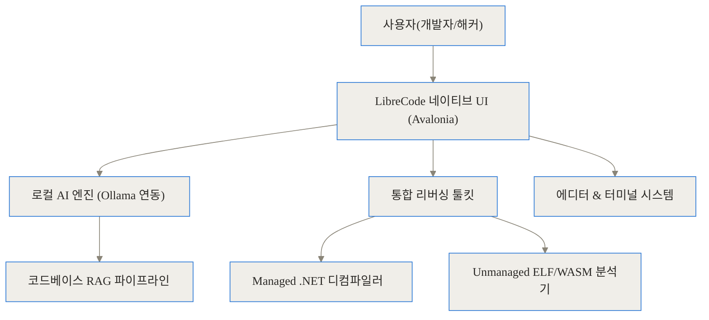
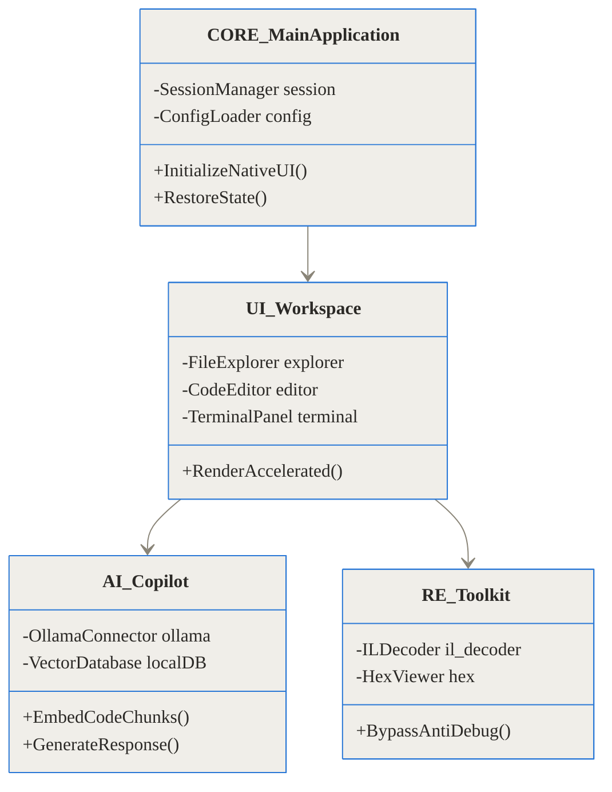
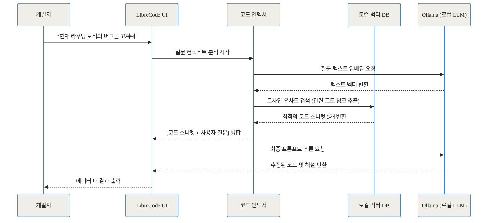
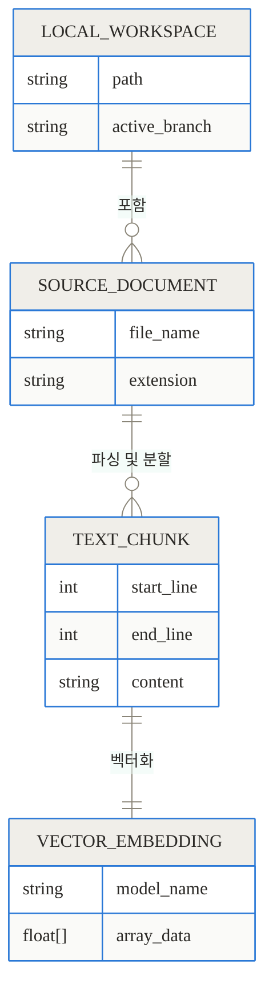
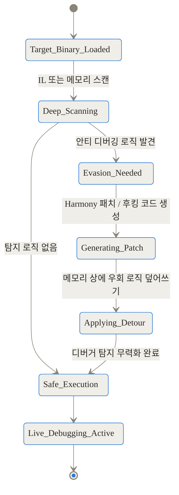
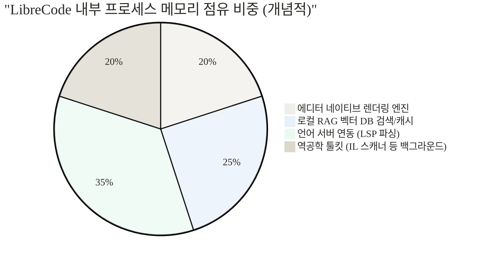

> **TL;DR**
> 1. LibreCode는 일렉트론(Electron) 없이 .NET 10과 Avalonia로 만들어진 가볍고 빠른 크로스플랫폼 네이티브 코드 에디터입니다.
> 2. 코드는 외부 서버로 단 한 줄도 유출되지 않으며, Ollama를 활용해 100% 로컬 환경에서 작동하는 RAG 기반 AI 코딩 어시스턴트를 제공합니다.
> 3. 단순한 에디터를 넘어 .NET, ELF, WASM 바이너리를 디컴파일하고 안티 디버깅을 우회하는 강력한 리버싱(역공학) 툴킷을 내장하고 있습니다.

## 프라이버시와 리소스의 딜레마: 우리는 왜 새로운 에디터가 필요한가

최근 개발자들의 작업 환경을 살펴보면 AI 코딩 어시스턴트가 없는 삶은 상상하기 어렵습니다. 코드를 짰을 때 다음 줄을 제안해 주고, 거대한 프로젝트의 아키텍처를 분석해 주는 도구들은 생산성을 크게 높여주었죠. 하지만 기존의 주류 도구들(예: Cursor, GitHub Copilot)은 분명한 한계를 가지고 있습니다.

첫 번째 문제는 **프라이버시와 보안**입니다. 기업의 중요한 핵심 소스 코드나 제로데이 취약점을 분석하는 보안 연구원의 데이터가 클라우드 서버(OpenAI, Anthropic 등)로 전송된다는 사실은 언제나 껄끄러운 문제입니다. 인터넷이 차단된 폐쇄망 환경에서는 아예 사용할 수 없다는 제약도 따릅니다.

두 번째 문제는 **일렉트론(Electron)의 무거움**입니다. 웹 기술로 데스크톱 앱을 만드는 일렉트론은 개발이 편하다는 장점이 있지만, 브라우저 엔진 전체를 메모리에 올려야 하므로 항상 무겁고 배터리 소모가 극심합니다. 에디터를 몇 개만 띄워도 시스템 램(RAM)을 수 기가바이트씩 차지하는 현상에 피로감을 느끼는 개발자가 적지 않습니다.

이러한 문제를 정면으로 돌파하며 등장한 프로젝트가 바로 오늘 살펴볼 **re4/LibreCode**입니다.

## 일렉트론을 버린 네이티브의 귀환, 그리고 로컬 AI

LibreCode는 브라우저 엔진을 과감히 덜어내고, .NET 10과 Avalonia UI 프레임워크를 기반으로 바닥부터 새롭게 설계된 오픈소스 크로스플랫폼 에디터입니다. Windows, Linux, macOS 환경에서 운영체제 고유의 네이티브 렌더링을 사용하여 매우 빠르고 쾌적하게 동작합니다.

가장 중요한 특징은 **100% 로컬 AI**를 지향한다는 점입니다. 이 도구는 사용자의 컴퓨터에 설치된 Ollama와 직접 통신합니다. 코드는 외부 네트워크로 한 글자도 나가지 않으며, 오프라인 환경에서도 프로젝트 코드베이스 전체를 이해하고 답변하는 강력한 AI 어시스턴트를 구동할 수 있습니다.

여기에 한 가지 더, LibreCode는 일반적인 프론트엔드/백엔드 개발자를 넘어 시스템 해커와 보안 연구원을 위한 **전문적인 역공학(Reversing) 툴킷**을 기본으로 내장하고 있습니다. 분석하기 까다로운 악성 바이너리를 뜯어보고, 디버깅 방지 기술을 무력화하는 도구들이 에디터 탭 하나에 자연스럽게 녹아들어 있습니다.

## 마치 만능 공구함 같은 구조 (개념 이해하기)

이 프로젝트를 일상적인 비유로 설명해 보겠습니다. 

기존의 클라우드 기반 AI 에디터가 '항상 외부 전화를 통해 전문가에게 조언을 구하는 넓고 화려한 사무실'이라면, LibreCode는 **'가볍고 튼튼하게 지어진 개인용 차고(네이티브 에디터) 안에, 내 말만 듣는 전속 정비사(로컬 Ollama)와 엑스레이 투시 안경(리버싱 툴킷)이 함께 구비된 공간'**과 같습니다.

이 구조가 실제로 어떻게 연결되어 있는지 다음 다이어그램으로 살펴보겠습니다.



이처럼 LibreCode는 단순히 텍스트를 편집하는 기능을 넘어, 코드를 지능적으로 검색하고(RAG) 컴파일된 바이너리를 역추적하는(Reversing) 독립적인 모듈들이 중앙 UI를 통해 매끄럽게 통신하는 구조를 가집니다.

## LibreCode의 심장부: 작동 원리 심층 분석

이제 프로젝트의 내부 기술을 구체적인 세 가지 기둥으로 나누어 깊이 파헤쳐 보겠습니다.

### 1. 웹뷰가 없는 100% 네이티브 Avalonia UI

Avalonia UI는 .NET 생태계에서 '크로스플랫폼 WPF'라고 불릴 정도로 고성능과 유연성을 자랑하는 기술입니다. HTML/CSS/JavaScript로 화면을 그리는 일렉트론과 달리, Avalonia는 운영체제의 그래픽 API(DirectX, Metal, OpenGL)를 직접 호출하여 화면의 픽셀을 렌더링합니다.

덕분에 타이핑 지연(Latency)이 극도로 낮고, 대용량 로그 파일이나 수만 줄의 바이너리 헥스(Hex) 코드를 스크롤할 때도 버벅임이 발생하지 않습니다. 메모리 점유율 측면에서도 압도적인 차이를 보입니다.

아래의 클래스 다이어그램은 LibreCode의 내부 모듈이 어떻게 객체지향적으로 분리되어 관리되는지 보여줍니다.



에디터는 세션 지속성(Session Persistence)을 자체적으로 관리합니다. 프로그램을 껐다 켜도 열려 있던 탭, 작업 중이던 파일, 프로젝트 폴더, 우측 패널의 상태, 심지어 AI와의 채팅 내역까지 이전 상태 그대로 즉시 복원됩니다.

### 2. 코드를 완벽하게 이해하는 로컬 RAG 파이프라인

단순히 프롬프트를 로컬 언어 모델에 전달하는 것만으로는 훌륭한 AI 에디터가 될 수 없습니다. 수백 개의 파일로 이루어진 프로젝트 구조를 AI가 파악해야만 의미 있는 코드 작성이 가능하죠. LibreCode는 이를 RAG(Retrieval-Augmented Generation, 검색 증강 생성) 아키텍처로 해결합니다.

과정은 다음과 같이 진행됩니다.
1. **인덱싱(Indexing)**: 프로젝트 폴더를 열면 백그라운드에서 소스 코드들을 일정 크기의 조각(Chunk)으로 잘게 나눕니다. 
2. **임베딩(Embedding)**: 나누어진 코드 조각들을 Ollama(예: nomic-embed-text 모델)를 이용해 수학적 벡터(숫자 배열)로 변환하고 로컬 데이터베이스에 저장합니다.
3. **질의(Querying)**: 사용자가 "사용자 인증 로직이 어디 있지?"라고 물으면, 이 질문 역시 벡터로 변환합니다.
4. **유사도 검색(Cosine Similarity)**: 질문 벡터와 가장 거리가 가까운(관련성 높은) 코드 조각 5~10개를 데이터베이스에서 찾습니다.
5. **생성(Generation)**: 찾아낸 코드 조각을 프롬프트에 숨겨서 LLM(예: Llama 3.2)에 전달하여 정확한 답변을 받아냅니다.

이 흐름을 시퀀스 다이어그램으로 시각화하면 그 구조가 더욱 명확해집니다.



이러한 로컬 인덱싱 구조를 지탱하는 데이터 모델 간의 관계는 아래와 같이 구성됩니다.



사용자는 'Custom rules(사용자 지정 규칙)'를 설정하여 "항상 TypeScript를 사용해라", "함수형 프로그래밍 스타일을 선호해라" 같은 전역 지침을 영구적으로 AI에게 주입할 수도 있습니다.

### 3. 해커와 리버서를 위한 전문가급 리버싱 툴킷

LibreCode를 다른 모든 에디터와 차별화하는 가장 강력한 무기가 바로 '리버싱(역공학) 툴킷'입니다. 일반적인 IDE에서는 볼 수 없는 이 기능은 악성코드 분석가나 보안 전문가들이 환호할 만한 심층적인 시스템 제어를 제공합니다.

#### Managed 환경 (.NET) 역공학 및 회피
.NET으로 컴파일된 프로그램은 IL(Intermediate Language)이라는 중간 언어로 번역됩니다. 분석을 피하려는 악성 앱들은 내부적으로 `Debugger.IsAttached`, `IsDebuggerPresent`, `CheckRemoteDebuggerPresent` 같은 API를 호출하여 디버거가 붙어 있는지 감시합니다.

LibreCode는 이러한 IL 코드를 실시간으로 디코드하고 스캔하여 감시 로직을 찾아냅니다. 그리고 'Evasion(회피)' 탭을 통해 관리되는 `.NET` 검사 로직이 항상 "디버거가 연결되지 않음"을 반환하도록 강제하는 **Harmony 패치(런타임 코드 조작 기법)**를 자동으로 생성해 줍니다.

#### Unmanaged 환경 (ELF) 및 WASM 역공학
리눅스 환경의 C/C++ 프로그램(ELF)은 `ptrace(PTRACE_TRACEME)`나 `/proc/self/status`의 `TracerPid` 값을 읽어 디버거를 탐지합니다. LibreCode는 이러한 네이티브 호출을 탐지하고, `rdtsc` 명령어 기반의 타이밍 체크 로직이나 가짜 procfs(프로세스 파일 시스템)를 덮어씌워 탐지를 무력화하는 'Evasion Playbook'을 생성합니다.

또한 웹어셈블리(WASM) 바이너리의 경우 자바스크립트 호스트 환경에서 디버거 문자열이나 타이밍을 속이는 방법론을 제시하며, 크롬 개발자 도구 프로토콜(CDP)을 통한 라이브 브라우저 디버깅까지 에디터 내에서 처리합니다.

이러한 안티 디버깅(Anti-Debugging) 탐지 및 우회 흐름은 다음과 같은 상태 전이 구조를 갖습니다.



애초에 LibreCode의 내부 디버거는 인터프리터(해석기) 방식으로 동작하므로, 실제 운영체제 수준의 디버거 프로세스를 타겟에 붙이지 않습니다. 따라서 타겟 프로그램은 '구조적으로' 디버거의 존재를 눈치챌 수 없습니다. 진정한 의미의 스텔스 분석 환경입니다.

## 설치부터 실행까지: 데스크톱에 LibreCode 올리기

강력한 기능에 비해 설치 과정은 매우 간결합니다. 100% 로컬 구동을 위해 다음 두 가지 필수 요건이 필요합니다.
- **.NET 10 SDK**: 에디터 자체를 빌드하고 실행하기 위한 프레임워크.
- **Ollama**: 로컬 언어 모델 구동 및 관리 도구.

터미널(명령 프롬프트)을 열고 아래 명령어를 순서대로 입력합니다.

```bash
# 1. 저장소 클론
git clone https://github.com/re4/LibreCode.git
cd LibreCode/LibreCode

# 2. 에디터 빌드 및 실행 (.NET 10 환경)
dotnet run
```

AI 기능을 사용하려면 Ollama를 통해 모델을 미리 내려받아야 합니다. 시스템 메모리에 여유가 있다면 최신 경량 모델인 `llama3.2`를 추천합니다.

```bash
# 백그라운드 터미널에서 모델 다운로드
ollama pull llama3.2
```

물론 LibreCode 내부의 'Models' 탭을 통해서도 클릭 몇 번만으로 원하는 모델을 탐색하고 설치할 수 있습니다.

### 생산성을 높이는 핵심 단축키

마우스를 쓰지 않는 개발자를 위해 핵심 동작은 단축키로 맵핑되어 있습니다.

| 단축키 | 동작 설명 |
| :--- | :--- |
| `Ctrl` + `S` | 현재 포커스된 파일 저장 |
| `Ctrl` + `` ` `` | 내장 터미널 열기/숨기기 |
| `Ctrl` + `Shift` + `P` | 커맨드 팔레트 실행 (명령어 검색) |
| `Tab` 또는 `Enter` | AI가 제안한 자동완성 코드 수락 (Accept) |
| `Escape` | AI의 자동완성 제안 닫기/취소 |

<br>

## 실전 시나리오: 현업에서는 어떻게 쓰일까?

이 도구가 실제 현업에서 어떻게 빛을 발하는지 구체적인 시나리오 두 가지를 살펴보겠습니다.

**시나리오 1: 난독화된 악성 .NET 바이너리 분석 (보안 연구원)**
분석가가 출처가 불분명한 `.exe` 파일을 건네받았습니다. 이 파일을 일반 디버거로 열면 프로그램이 곧바로 종료되어 버립니다. 
이때 LibreCode로 파일을 엽니다. 리버싱 툴킷이 백그라운드에서 IL 코드를 스캔하고, "Debugger.IsAttached 호출 3건, 환경변수 프로파일링 감지 1건"이라는 결과를 띄웁니다. 분석가는 'Evasion' 탭으로 이동해 '우회 패치 생성' 버튼을 누릅니다. 에디터가 자동으로 Harmony 패치를 짜서 메모리에 덮어씌우면, 그제야 악성코드는 정상적인 일반 프로그램인 척 실행을 계속하며 내부에 숨겨둔 실제 악성 로직을 드러내게 됩니다.

**시나리오 2: 인터넷이 차단된 금융권 망분리 환경 (엔터프라이즈 개발자)**
엄격한 보안 규정 때문에 외부망 접속이 차단된 사내 PC에서 거대한 결제 시스템 레거시 코드를 리팩토링해야 합니다. Copilot은 접속 오류만 뿜어냅니다.
LibreCode를 켜고 500개의 C# 소스 파일이 있는 폴더를 엽니다. 로컬 Ollama가 프로젝트 전체를 인덱싱합니다. 개발자가 채팅 패널에 "기존 결제 모듈에서 사용 중인 암호화 알고리즘을 모던 방식으로 변경하는 코드를 짜줘"라고 입력하면, RAG 엔진이 현재 사내 코드의 정확한 네이밍 규칙과 구조를 반영하여 완벽하게 오프라인에서 코드를 생성해 냅니다.

## 기존 클라우드 기반 에디터와의 상세 비교 (벤치마크)

기술 도입을 고민할 때 가장 중요한 것은 기존 도구들과의 냉정한 비교입니다.

| 비교 항목 | LibreCode | Cursor (또는 VS Code + AI) | 
| :--- | :--- | :--- |
| **기반 UI 프레임워크** | **.NET 10 / Avalonia (Native)** | Electron (Web / Chromium) |
| **AI 구동 위치** | **100% 로컬 (Ollama 연동)** | 클라우드 API (OpenAI, Anthropic 등) |
| **정보 유출 리스크** | 원천 차단 (망분리 환경 완벽 지원) | 프롬프트 및 코드베이스 전송에 따른 리스크 존재 |
| **리버싱/역공학 도구** | **전문가급 툴킷 내장 (IL, ELF 분석, 우회)** | 미지원 (별도 전용 도구 수십 개 필요) |
| **플러그인 생태계** | 상대적으로 부족 (신규 아키텍처) | **압도적으로 풍부 (VS Code 마켓플레이스)** |
| **최고 성능 모델 접근성**| 하드웨어(VRAM) 스펙에 철저히 종속됨 | 최상급 거대 모델(GPT-4o, Claude 3.5 Sonnet) 즉시 사용 가능 |

<br>

시스템 리소스 소모량에서도 극적인 차이를 보입니다. 일렉트론 에디터들은 빈 창을 하나 띄우기만 해도 무거운 브라우저 프로세스를 실행해야 하지만, 네이티브로 렌더링되는 LibreCode는 대기 메모리가 매우 적습니다.

```chartjs
{
  "type": "bar",
  "data": {
    "labels": ["LibreCode (Native UI)", "VS Code (Electron)", "Cursor (Electron)"],
    "datasets": [
      {
        "label": "초기 유휴 상태 RAM 사용량 (MB)",
        "data": [145, 780, 890],
        "backgroundColor": ["rgba(54, 162, 235, 0.6)", "rgba(255, 99, 132, 0.6)", "rgba(255, 159, 64, 0.6)"]
      }
    ]
  },
  "options": {
    "responsive": true,
    "scales": {
      "y": {
        "beginAtZero": true
      }
    }
  }
}
```
*(참고: 위 수치는 플러그인 설치 여부 및 운영체제에 따라 달라질 수 있는 상대적 비교 값입니다. 로컬 AI(Ollama) 구동에 필요한 VRAM은 별도로 측정해야 합니다.)*

LibreCode 내에서 시스템 메모리가 어떻게 분배되는지 파이 차트로 대략적인 비율을 확인해 볼 수 있습니다.



## 솔직한 평가: 완벽한 도구는 없다 (한계점과 트레이드오프)

분명 혁신적이고 파격적인 도구이지만, 무조건적인 찬양을 경계해야 합니다. 현업에 도입하기 전에 고려해야 할 명확한 한계(Trade-off)들이 존재합니다.

1. **하드웨어의 한계가 곧 지능의 한계입니다.**
   로컬 AI의 성능은 오롯이 당신이 가진 컴퓨터의 그래픽 카드(VRAM)와 시스템 RAM에 좌우됩니다. RTX 4090 수준의 그래픽카드가 있다면 쾌적하게 쓸 수 있지만, 일반적인 사무용 노트북 환경에서는 최신 클라우드 모델(GPT-5 등)이 보여주는 번뜩이는 추론 능력에 비해 아쉬움을 느낄 수밖에 없습니다.

2. **확장성 생태계의 부재.**
   일렉트론과 VS Code 확장을 버렸기 때문에 수백만 명의 커뮤니티가 쌓아 올린 수만 개의 익스텐션(테마, 포매터, 린터 등)을 그대로 가져다 쓸 수 없습니다. 모든 기능은 C#과 Avalonia로 새롭게 구현되거나 포팅되어야 합니다.

3. **오버스펙의 딜레마.**
   웹 프론트엔드 개발만 하는 사람에게는 하드코어한 '.NET 디컴파일러'나 'ELF 디버깅 우회' 기능이 불필요한 기능일 수 있습니다. 반면 보안이나 커널 레벨 시스템 분석을 겸하는 인력에게는 최고의 무기가 될 수 있습니다.

## 결론: 코딩 환경의 새로운 주권 선언

re4/LibreCode는 단순히 기존 도구들의 외형을 모방한 대안(Alternative)이 아닙니다. 이 프로젝트는 **"개발자의 코드는 개발자의 기기 안에서 분석되고 처리되어야 하며, 시스템의 가장 깊숙한 밑바닥(바이너리)까지 하나의 도구에서 제어할 수 있어야 한다"**는 강력한 철학적 선언에 가깝습니다.

클라우드 서비스 구독료가 부담되거나, 보안상의 이유로 코드를 외부로 내보낼 수 없거나, 무거운 일렉트론 에디터에 지친 분들, 혹은 역공학과 악성코드 분석에 열정을 가진 해커라면 오늘 당장 .NET 10 SDK를 깔고 이 혁신적인 도구를 직접 빌드해 보시길 적극 권장합니다.

## 자주 묻는 질문 (FAQ)

### 기존 VS Code의 익스텐션(확장 프로그램)을 LibreCode에서 그대로 사용할 수 있나요?

아니요. 웹 기반 기술인 일렉트론 대신 네이티브 UI인 Avalonia 프레임워크로 처음부터 새롭게 작성되었기 때문에, 기존 VS Code용 확장은 호환되지 않습니다. 필요한 확장 기능은 커뮤니티를 통해 C# 기반으로 새롭게 포팅되거나 개발되어야 합니다.

### 오프라인 환경(인터넷 차단)에서도 AI 코드 자동완성이 제대로 작동하나요?

네, 완벽하게 작동합니다. 외부 클라우드 API를 호출하는 대신 사용자의 PC에 설치된 Ollama 서버와 직접 통신하므로, 망분리된 기업 환경이나 비행기 안에서도 AI 챗, RAG 검색, 코드 자동완성을 모두 제한 없이 사용할 수 있습니다.

### LibreCode 내부에 있는 보안/분석 도구(리버싱 툴킷)는 어떤 종류의 파일을 분석할 수 있나요?

크게 세 가지 주요 포맷을 지원합니다. C# 등으로 빌드된 .NET 어셈블리의 중간 언어(IL), 리눅스 환경의 C/C++ 기반 ELF 바이너리, 그리고 웹 브라우저에서 실행되는 WebAssembly(WASM) 바이너리입니다. 이들의 디컴파일뿐만 아니라 안티 디버깅 로직 탐지와 회피용 패치 생성까지 수행합니다.

### 이 에디터를 구동하는 데 필요한 시스템 사양이 어떻게 되나요?

에디터 자체는 .NET 10 네이티브 기반이므로 일렉트론 에디터보다 적은 메모리(RAM)를 소모하며 가볍게 실행됩니다. 하지만 함께 동작해야 하는 '로컬 언어 모델(Ollama)'의 성능을 위해 최소 8GB 이상의 VRAM을 갖춘 외장 그래픽카드와 16GB 이상의 시스템 RAM을 권장합니다.

### 프로젝트 코드를 분석하는 RAG 엔진은 내부적으로 어떻게 동작하나요?

프로젝트 폴더를 열면 로컬 환경에서 소스 코드들을 일정 크기의 조각(Chunk)으로 나누고, 이를 수학적 벡터 형태(Embeddings)로 변환해 내장형 데이터베이스에 저장합니다. 사용자가 코딩 관련 질문을 하면 코사인 유사도(Cosine Similarity)를 통해 가장 관련성이 높은 코드 조각을 찾아내어 AI 프롬프트에 주입하는 방식으로 작동합니다.


## References
- [https://github.com/re4/LibreCode](https://github.com/re4/LibreCode)
