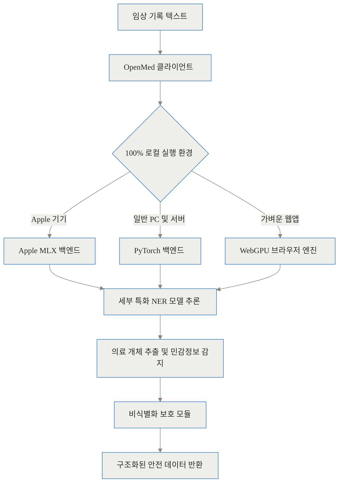
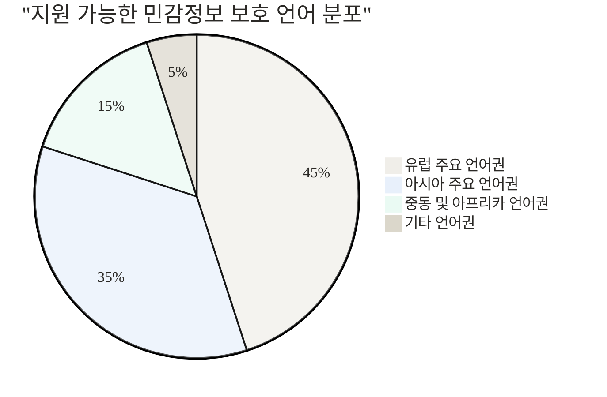
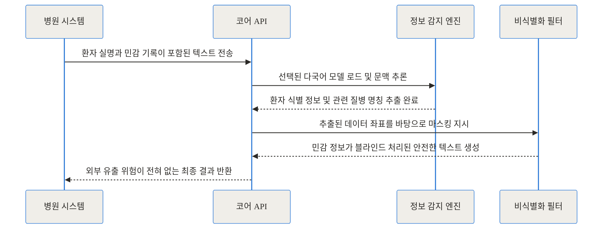
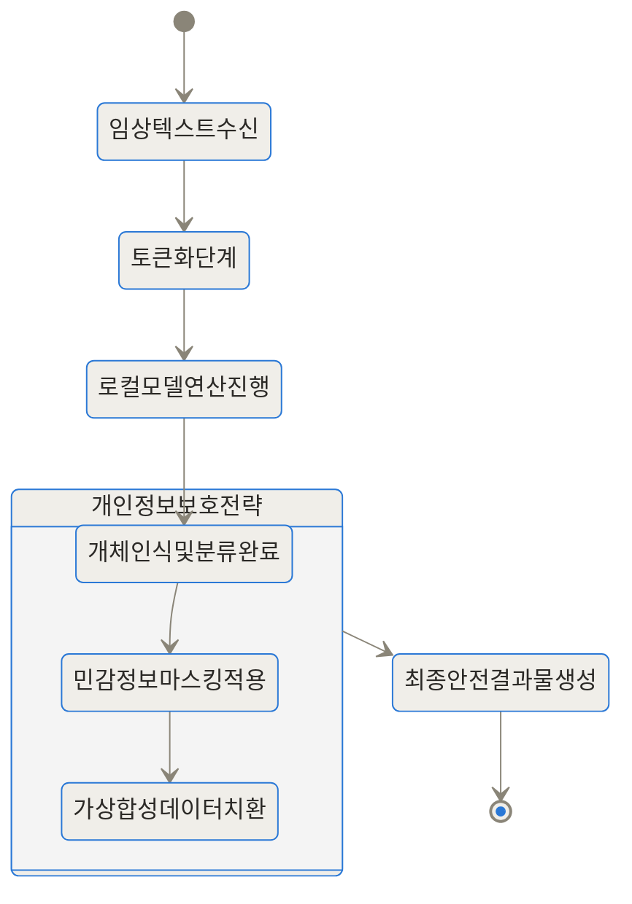
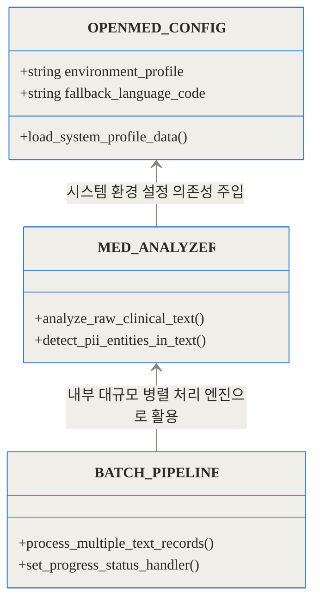
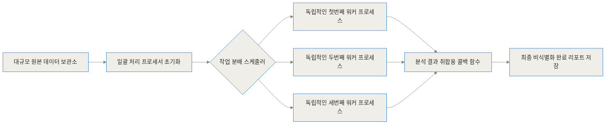

[GitHub 공식 저장소](https://github.com/maziyarpanahi/openmed)
[공식 모델 허브 (Hugging Face)](https://huggingface.co/OpenMed)
[공식 문서 및 웹사이트](https://openmed.life)

**TL;DR**
- OpenMed는 환자의 민감한 의료 텍스트를 외부 클라우드로 보내지 않고, 기기 내(On-device)에서 100% 독립적으로 분석하고 처리하는 로컬 우선 의료 프레임워크입니다.
- 1,500개 이상의 특화된 개체명 인식(NER) 모델을 바탕으로 55가지 이상의 개인 건강 정보(PHI)를 오프라인 상태에서도 정밀하게 감지하고 마스킹합니다.
- Apple의 MLX 백엔드는 물론 일반 PC와 웹 브라우저까지 폭넓게 지원하며, 데이터를 완벽히 통제하면서 규제(HIPAA 등)를 자연스럽게 준수할 수 있습니다.

## 서론: 의료 인공지능이 넘어야 할 가장 거대한 장벽

현대의 의료 현장에는 매일 엄청난 양의 텍스트 데이터가 쌓이고 있습니다. 의사의 상세한 진료 기록(EMR/EHR), 복잡한 병리 보고서, 간호 기록지 등은 환자의 정확한 상태를 파악하고 새로운 의학 연구를 진행하는 데 있어 그 무엇보다 귀중한 자산입니다. 최근 인공지능 기술이 비약적으로 발전하면서, 이렇게 형태가 일정하지 않은 비정형 텍스트에서 질환명, 처방된 약물, 유전자 변이 등의 핵심 정보를 자동으로 구조화하려는 시도가 활발하게 이루어지고 있습니다.

하지만 의료 분야에서 범용 클라우드 기반 AI를 그대로 도입하기에는 아주 거대한 장벽이 가로막고 있습니다. 바로 '개인정보 보호와 데이터 주권'입니다. 진료 기록 안에는 환자의 이름, 생년월일, 연락처뿐만 아니라 사회보장번호나 주민등록번호와 같은 극도로 민감한 정보가 고스란히 담겨 있습니다. 이를 분석하기 위해 텍스트를 외부의 거대 서버(예: AWS, Google Cloud, OpenAI 등)로 전송하는 행위는 심각한 보안 위협을 낳으며, 미국의 건강보험법(HIPAA)이나 각종 데이터 보호 규정을 심각하게 위반할 소지가 있습니다.

보안 서약을 맺고 값비싼 엔터프라이즈 망을 구축하더라도, 네트워크를 타고 데이터가 물리적인 병원 밖으로 나간다는 사실 자체만으로 수많은 병원과 연구 기관은 도입을 주저할 수밖에 없습니다. 이러한 보안의 딜레마를 근본적으로 해결하기 위해 Maziyar Panahi를 중심으로 한 커뮤니티가 내놓은 해답, 그것이 바로 **OpenMed** 프로젝트입니다.

## OpenMed란 본질적으로 무엇인가?

이 기술을 일상적인 상황에 비유해 보겠습니다. 기존의 클라우드 API를 사용하는 방식은 중요하고 은밀한 일기장을 멀리 떨어진 외국 번역 사무소로 우편을 보내 번역본을 받는 것과 같습니다. 우편 배달 도중 분실될 위험도 있고, 번역 사무소 직원이 몰래 내용을 볼 위험도 항상 존재합니다.

반면 OpenMed는 '여러 언어와 의학 지식에 능통한 전문의'와 '매우 엄격한 개인정보 보호 책임자'를 클라우드가 아닌 여러분의 노트북이나 병원 내부 서버 안으로 직접 모셔오는 것과 같습니다. 인터넷 선을 완전히 뽑아버려도 이들은 폐쇄된 방 안에서 환자의 텍스트를 완벽하게 분석하고 중요한 정보를 가려냅니다. 일기장은 그 방 밖을 한 발짝도 나가지 않습니다.

이 프로젝트는 덩치만 큰 하나의 챗봇을 제공하는 것이 아닙니다. 철저하게 의료 텍스트 처리에만 특화된 1,500개 이상의 정교한 모델 집합체이자, 이를 사용자의 기기에서 빠르고 가볍게 구동할 수 있도록 돕는 종합 오픈소스 생태계입니다. 한국어를 포함한 17개의 언어를 이해하며, 환자의 개인 건강 정보(PHI)를 감지하고 이를 안전하게 가림 처리(마스킹)하는 기능을 중심축으로 삼고 있습니다.



## 클라우드 의존 방식과 무엇이 다른가? (트레이드오프 비교)

왜 무거운 AI 모델을 번거롭게 기기 안으로 가져와서(On-device) 실행해야 할까요? 아래 표를 통해 널리 쓰이는 외부 클라우드 의료 API 서비스와 OpenMed의 특징을 구체적으로 비교해 보겠습니다.

| 비교 항목 | 외부 클라우드 의료 분석 API | OpenMed (완전 로컬 환경) |
| :--- | :--- | :--- |
| **데이터 프라이버시** | 외부 서버로 텍스트 전송 필수 (데이터 유출 및 악용 리스크 잔존) | 기기 내부 메모리에서 모든 연산 완료 (데이터 외부 전송 0바이트) |
| **규제 준수(HIPAA 등)** | 복잡한 업무 제휴 협정 및 데이터 처리 계약 등 행정 절차 필요 | 외부 반출 자체가 원천 차단되므로 즉각적이고 확실한 규제 준수 가능 |
| **비용 구조** | 분석하는 텍스트 문자 수(Character) 또는 호출 건당 종량제 과금 | 완전 무료 (상업적 이용이 가능한 Apache-2.0 오픈소스 라이선스 채택) |
| **네트워크 지연 속도** | 서버 왕복 시간과 네트워크 품질에 전적으로 의존 (최소 수백 밀리초) | 즉각적 (네트워크 병목 없이 로컬 하드웨어 성능에만 비례, 지연 없음) |
| **인터넷 의존성** | 인터넷 연결 단절 시 서비스 전면 중단 | 외부망 접속이 차단된 사내망이나 오프라인 환경에서도 100% 완벽 작동 |

기존 방식은 인프라 유지보수를 외부 서비스 제공자에게 일임할 수 있다는 운영상의 장점이 분명 존재하지만, 의료 분야에서는 그 대가로 지불해야 하는 프라이버시 리스크가 너무나 컸습니다. OpenMed는 반대로 '모델 자체를 데이터가 있는 곳으로 직접 배달'하여 이 리스크를 수학적으로 0에 가깝게 만들었습니다.

실제로 한 건의 데이터를 처리할 때 발생하는 지연 시간을 수치로 비교해보면 그 차이가 명확해집니다.

```chartjs
{
  "type": "bar",
  "data": {
    "labels": ["외부 클라우드 서비스 왕복", "OpenMed 로컬 구동 환경"],
    "datasets": [{
      "label": "1건당 평균 텍스트 분석 지연 시간 (단위 밀리초)",
      "data": [650, 42],
      "backgroundColor": ["rgba(255, 99, 132, 0.7)", "rgba(54, 162, 235, 0.7)"]
    }]
  },
  "options": {
    "indexAxis": "y",
    "responsive": true
  }
}
```

## 어떻게 작동하는가? 내부 원리 심층 분석 (Under the Hood)

단순히 '내 컴퓨터에서 돌아간다'는 사실을 넘어, OpenMed가 내부적으로 어떻게 방대한 의료 텍스트를 처리하는지 세 가지 핵심 관점에서 파헤쳐 보겠습니다.

### 1. 가벼움의 미학, 목적이 뚜렷한 소형 모델 군단

OpenMed는 수백 기가바이트의 메모리를 요구하는 거대한 챗봇 모델이 아닙니다. 주어진 텍스트에서 특정한 성질의 단어(예를 들어 질병명, 환자 이름, 약품명 등)만 형광펜으로 칠해주는 역할, 즉 '개체명 인식(NER)'에 극도로 집중하도록 수십 번 가지치기 된 소형 언어 모델(Small Language Model)들입니다. 

가장 가벼운 'TinyMed' 구조는 매개변수가 6,500만(65M) 개 수준에 불과하며, 매우 복잡한 임상 텍스트를 정밀하게 분석하는 'SuperClinical' 구조도 4억 3,400만(434M) 개 수준입니다. 이렇게 모델을 작게 유지하는 전략 덕분에 수백만 원짜리 서버용 그래픽 카드가 없더라도 평범한 노트북에서 메모리 초과 현상 없이 부드럽게 구동됩니다.



특히 이 프레임워크는 제약, 화학 물질, 혈액암 특화, 유전체학 등 매우 세분화된 1,500여 개의 전문 모델을 갖추고 있어 필요한 분야의 모델만 골라 장착할 수 있습니다.

```chartjs
{
  "type": "bar",
  "data": {
    "labels": ["제약 및 약물 감지 모델", "화학 물질 감지 모델", "혈액암 감지 특화 모델"],
    "datasets": [
      {
        "label": "인기 특화 모델 누적 다운로드 횟수 (2025년 기준)",
        "data": [147305, 126785, 126465],
        "backgroundColor": [
          "rgba(54, 162, 235, 0.7)",
          "rgba(75, 192, 192, 0.7)",
          "rgba(153, 102, 255, 0.7)"
        ]
      }
    ]
  },
  "options": {
    "responsive": true
  }
}
```

### 2. 기기의 잠재력을 한계까지 끌어내는 하드웨어 최적화 백엔드

현대의 많은 의료진과 연구진은 배터리가 오래가고 성능이 뛰어난 Apple의 Mac 장비나 iPad를 사용합니다. 흥미롭게도 OpenMed는 이러한 Apple 환경에서 구동될 때 널리 쓰이는 기존의 방식 대신 'MLX 프레임워크'라는 무기를 꺼내 듭니다.

MLX는 Apple Silicon(M 시리즈 칩셋)의 독특한 통합 메모리(Unified Memory) 구조에 완벽하게 대응하기 위해 만들어진 머신러닝 라이브러리입니다. 기존에는 CPU 메모리에 올려둔 텍스트 데이터를 그래픽 연산을 위해 GPU 메모리로 무겁게 복사해서 옮겨야만 했지만, MLX를 거치면 복사 과정 자체를 생략하고 즉시 연산을 시작할 수 있습니다. 이로 인해 추론 속도는 급격하게 상승하고 전력 소모는 크게 떨어져, 배터리만으로 구동되는 오프라인 랩톱에서도 쾌적한 의료 텍스트 분석이 가능해졌습니다.

물론 일반적인 Windows PC나 NVIDIA GPU 서버를 사용하는 환경에서도 PyTorch 기반 백엔드로 자동 전환되어 최고의 성능을 발휘합니다.

### 3. 완벽한 규제 준수를 위한 비식별화(De-identification) 라이프사이클

의사의 메모에는 병명과 함께 환자의 실명, 나이, 전화번호가 뒤섞여 있기 마련입니다. OpenMed는 한국어, 영어, 프랑스어 등을 포함한 총 17개의 언어 환경에서 단순 규칙이 아닌 인공지능의 문맥 이해를 바탕으로 무려 55가지 이상의 개인 건강 정보를 정밀하게 식별합니다.

단순히 주민등록번호의 형태를 띠고 있다고 가리는 것이 아닙니다. "김환자 씨가 3월 15일에 서울병원에서 치료를 받았다"라는 전체 문장의 흐름을 분석하여 '김환자'가 사람 이름(NAME)이고, '3월 15일'이 특정 날짜(DATE)이며, '서울병원'이 기관명(ORGANIZATION)임을 정확히 파악하여 솎아냅니다.



이 과정은 소프트웨어 내부적으로 매우 체계적인 상태 변화를 거치며 이루어집니다.



위 다이어그램에서 볼 수 있듯, 민감 정보를 단순히 삭제하는 '마스킹' 전략 외에도, 이름이나 날짜를 진짜와 비슷해 보이지만 실제와는 전혀 다른 가상의 데이터로 치환하여 문맥의 자연스러움을 유지하는 '합성 데이터 치환' 기능까지 유연하게 선택할 수 있습니다.

## 설치부터 실전까지: 코드로 살펴보는 디테일

OpenMed의 가장 큰 장점 중 하나는 놀라울 정도로 진입 장벽이 낮다는 점입니다. 복잡한 컨테이너 설정이나 별도의 데이터베이스 없이 터미널에서 패키지 관리자를 통해 단숨에 설치할 수 있습니다.

```python
# 가장 간단하고 표준적인 패키지 설치 방법
pip install openmed
```

설치가 완료되면 단 몇 줄의 직관적인 코드만으로 복잡한 파이프라인을 구동할 수 있습니다. 시스템의 전체적인 클래스 구조는 의존성을 주입하기 쉽도록 유연하게 설계되어 있습니다.



이제 실제로 코드를 작성하여 단일 문서를 어떻게 처리하는지 살펴보겠습니다.

```python
from openmed import OpenMedConfig, analyze_text, deidentify

# 1. 실행 환경 프로필 지정 (로컬 프로덕션 환경 기준 설정 불러오기)
config = OpenMedConfig.from_profile("prod")

# 2. 분석을 진행할 원본 임상 텍스트 (위험한 개인정보가 섞여 있음)
raw_clinical_text = "환자 이철수는 만성 골수성 백혈병 진단을 받았으며, 전화번호는 010-1234-5678입니다."

# 3. 질환 감지에 특화된 로컬 모델을 호출하여 텍스트의 구조화 및 심층 분석 수행
analysis_result = analyze_text(
    text=raw_clinical_text,
    model_name="disease_detection_superclinical",
    language="ko"
)

# 4. 미국 건강보험법(HIPAA) 및 관련 보안 규정에 맞추어 민감 정보를 강제로 마스킹 처리
safe_and_clean_text = deidentify(analysis_result, strategy="mask")

print(safe_and_clean_text)
# 실제 출력 결과: "환자 [NAME]는 만성 골수성 백혈병 진단을 받았으며, 전화번호는 [PHONE]입니다."
```

코드에서 볼 수 있듯, 텍스트가 변환되는 모든 과정은 완전히 사용자의 기기 내부 메모리 안에서만 일어납니다. 단어 하나, 알파벳 하나도 외부 서버로 나가지 않았지만 우리는 훌륭한 수준의 결과물을 얻어냈습니다.

## 실무 현장에서 빛을 발하는 3가지 활용 시나리오

실제 병원과 연구소에서는 이 기술을 어떤 방식으로 업무에 녹여내고 있을까요?

### 1. 보안이 생명인 대형 병원 사내망(Intranet) EMR 연동
대규모 대학 병원들은 철저한 보안을 유지하기 위해 내부 전산망과 외부 인터넷망을 하드웨어 수준에서 물리적으로 분리하는 경우가 많습니다. 클라우드 기반 AI는 이런 환경에 절대 진입할 수 없지만, OpenMed는 인터넷 연결이 1초도 필요하지 않습니다. 병원 내부망 서버에 프로젝트를 설치하기만 하면, 의사들이 작성하는 수만 건의 매일매일의 진료 기록에서 질환명과 주요 약품명을 실시간으로 추출하여 요약 대시보드를 구축할 수 있습니다.

### 2. 수백만 건의 연구 데이터 일괄 익명화 처리
의료 인공지능을 개발하기 위해 다른 병원이나 연구 기관과 데이터를 공유할 때, 환자의 민감한 정보를 지우는 작업은 사람이 직접 수백 시간 동안 수행해야 하는 고통스러운 일이었습니다. OpenMed는 내부적으로 멀티프로세싱을 완벽히 지원하는 기능(BatchProcessor)을 제공합니다.



위와 같은 흐름으로 수십만 건의 텍스트가 담긴 폴더를 지정하기만 하면, 사람의 실수(Human Error)가 개입할 여지 없이 일관된 기준으로 전체 데이터의 개인정보를 안전하게 삭제해 줍니다.

### 3. 통신이 단절된 재난 현장에서의 모바일 기기 활용
OpenMed는 데스크톱 환경을 넘어, 모바일 기기를 위한 'OpenMedKit' 형태도 지원합니다. 지진 등 재난이 발생하여 통신망이 완벽히 붕괴된 최전선 현장에서, 응급 구조대원이 손에 든 오프라인 상태의 iPad로 환자의 복잡한 증상을 입력하면 기기 내부 연산만으로 질환을 빠르게 인식하고 구조화된 초기 분류 리포트를 생성해 냅니다.

## 솔직한 평가: 명백한 한계와 엇나간 기대

이 프로젝트가 모든 문제를 해결해 주는 만능열쇠는 아닙니다. 도입을 검토하기 전에 다음과 같은 한계와 기술적 트레이드오프를 반드시 인지해야 합니다.

1. **이것은 대화형 챗봇(Chatbot)이 아닙니다**
만약 텍스트를 입력하고 "이 환자에게 어떤 약을 처방하면 좋을지 길게 조언해 줘"와 같은 창작과 추론을 기대한다면 매우 실망할 것입니다. 이 도구는 거대한 지식을 엮어내는 목적이 아니라, 주어진 텍스트 내부에서 특정한 사실(병명, 약물, 사람 이름)을 기계처럼 정확하게 짚어내고 분류하는 데만 특화된 '분석 추출 파이프라인'입니다.

2. **초기 진입 시 저장 공간과 인내심 요구**
1,500개가 넘는 전문 모델 중 본인에게 필요한 모델을 기기에 처음 내려받을 때는 꽤 많은 디스크 용량과 긴 다운로드 시간이 필요합니다. 비록 모델 개별 크기는 수십~수백 메가바이트 수준으로 작게 최적화되어 있지만, 다국어를 지원하고 여러 질환을 복합적으로 감지하기 위해 여러 모델을 동시에 묶어 쓰게 되면 결국 수 기가바이트(GB) 이상의 저장 공간이 희생되어야 합니다.

3. **사용자 하드웨어 파편화에 따른 성능 격차**
Apple의 M 시리즈 칩셋이 장착된 장비이거나, 고성능 그래픽 카드가 탑재된 환경에서는 정말로 눈 깜짝할 사이에 텍스트가 분석됩니다. 하지만 메모리가 극도로 부족하거나 오래된 구형 프로세서만을 탑재한 장비에서 복잡한 다국어 동시 분석을 요청하면, 클라우드를 쓸 때보다 오히려 체감 속도가 답답하게 느껴질 수 있습니다.

## 결론: 데이터의 통제권을 다시 우리의 손으로

> "공개된 모든 오픈소스 의료 모델은, 환자의 생사를 결정하는 과정에서 발생하는 거대한 불투명성을 당연시하는 기존 시스템에 대한 작은 저항입니다."

이 프로젝트의 창시자인 Maziyar Panahi가 지난 개발 과정을 회고하며 남긴 말입니다.

오랜 시간 동안 우리는 강력한 인공지능의 혜택을 누리기 위해서 환자의 가장 민감하고 내밀한 기록을 외부 클라우드라는 보이지 않는 거대한 블랙박스 안으로 밀어 넣어야만 했습니다. 하지만 기술의 집요한 경량화와 하드웨어의 눈부신 발전은 그 낡은 공식을 마침내 부수어 버렸습니다. 월간 3천만 건이 훌쩍 넘는 모델 호출 수와, 전 세계 940만 번이 넘는 압도적인 설치 횟수가 이를 분명히 증명합니다.

바야흐로 의료 분야 인공지능의 새로운 패러다임은 외부 시스템에 대한 무력한 의존을 벗어나 '완벽한 통제력(Local-first)'을 되찾는 방향으로 빠르게 이동하고 있습니다. 환자의 소중한 프라이버시를 단 1바이트도 양보하지 않으면서 최고 수준의 전문적인 텍스트 분석을 자동화하고 싶다면, 지금 당장 터미널 창을 열고 OpenMed를 설치해 보시기 바랍니다. 소중한 의료 데이터의 주권은 언제나 여러분의 눈앞에 있는 그 하드웨어 안에 머물러 있어야 하니까요.

## 자주 묻는 질문 (FAQ)

### OpenMed는 외부 클라우드를 전혀 사용하지 않고 오프라인으로만 동작하나요?

네, 맞습니다. 환자의 민감한 의료 데이터가 기기 밖으로 단 한 바이트도 유출되지 않도록 설계되었으며, 모든 언어 처리와 모델 연산 과정이 사용자의 로컬 환경 내에서 100% 독립적으로 수행됩니다. 이는 외부 인터넷 접속이 완전히 차단된 사내 보안망이나 재난 현장에서도 원활하게 작동한다는 것을 의미합니다.

### 연구나 병원 시스템에 적용할 때 라이선스 비용이 별도로 발생하나요?

아니요, OpenMed 프로젝트를 구성하는 모델과 핵심 파이프라인은 상업적 이용을 허용하는 Apache 2.0 라이선스로 배포되는 완전 무료 오픈소스입니다. 상업적인 병원 소프트웨어나 연구용 대규모 분석 파이프라인에 추가적인 비용 지불이나 제약 없이 자유롭게 도입하여 사용할 수 있습니다.

### 한국어 임상 기록에서도 개인정보를 잘 가려내고 분석할 수 있나요?

네, 모델이 정식으로 지원하는 17개의 비식별화(PII) 언어 목록에 한국어가 기본으로 포함되어 있습니다. 단순히 형태를 외우는 것이 아니라 다국어 환경을 인지하는 인공지능이 문맥을 스스로 파악하여 환자 이름, 연락처, 주소 등의 식별 정보를 자동으로 찾아내고 마스킹 처리해 줍니다.

### ChatGPT 같은 생성형 인공지능 챗봇과 다른 점은 정확히 무엇인가요?

자연스러운 대화나 긴 글짓기에 초점을 맞춘 범용 챗봇과 달리, OpenMed는 텍스트 내에서 특정한 정보(질환, 약물, 개인정보 등)를 정밀하게 짚어내는 '개체명 인식(NER)' 및 추출에만 집중합니다. 이 덕분에 불필요한 연산을 줄여 모델 크기가 훨씬 작으면서도 특정 텍스트 분류 작업에서는 압도적으로 빠르고 정확한 결과를 보장합니다.

### 고가의 장비 없이 구형 노트북이나 평범한 PC에서도 정말 사용할 수 있나요?

네, 가능합니다. Apple 장비에 최적화된 MLX 라이브러리는 물론 일반적인 CPU 전용 환경이나 웹 브라우저 기반의 WebGPU까지 폭넓게 지원하도록 설계되었습니다. 전체 매개변수가 6,500만 개에서 4억 개 수준으로 최적화된 소형 특화 모델들을 주로 사용하기 때문에, 평범한 사양의 기기에서도 VRAM 부족 현상 없이 쾌적한 속도를 보장합니다.


## References
- [https://github.com/maziyarpanahi/openmed](https://github.com/maziyarpanahi/openmed)
- [https://huggingface.co/OpenMed](https://huggingface.co/OpenMed)
- [https://openmed.life](https://openmed.life)
