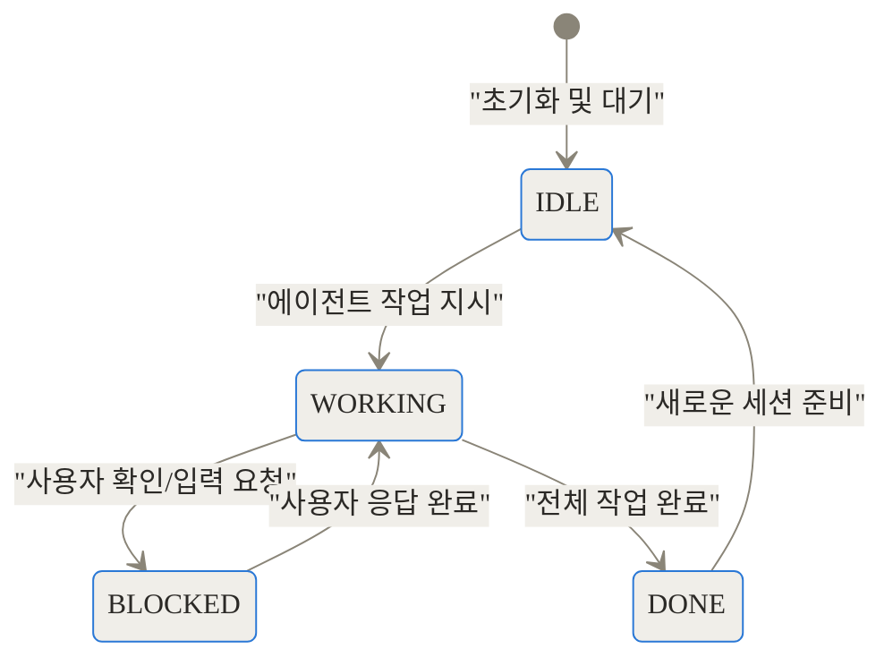
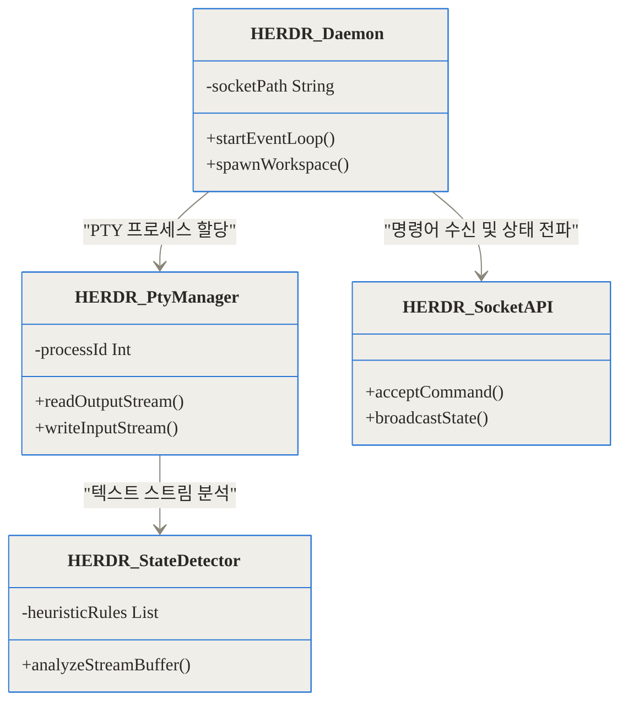
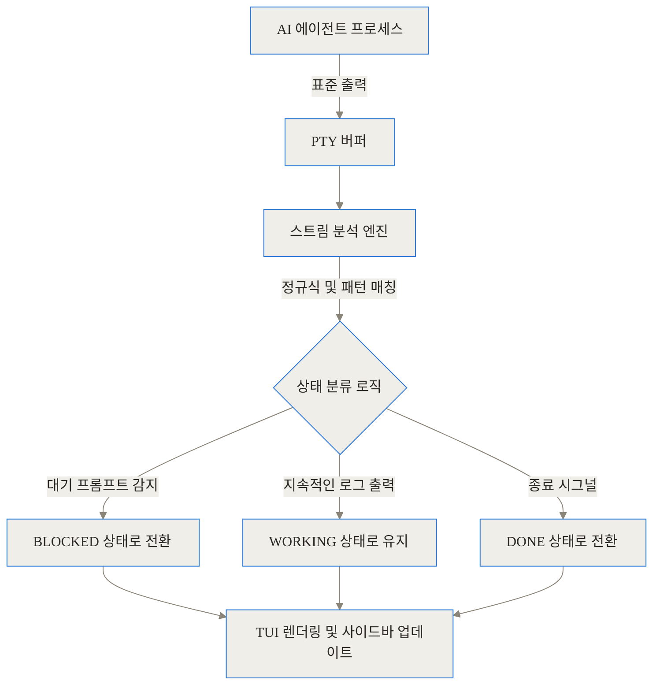
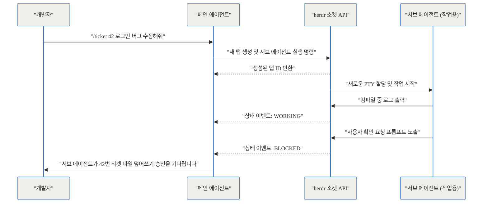
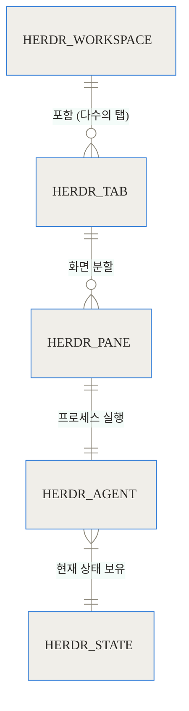
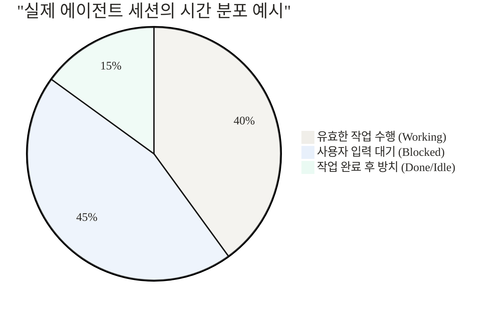

상단 링크 블록
- [herdr 공식 GitHub 저장소](https://github.com/ogulcancelik/herdr)
- [herdr 공식 웹사이트](https://herdr.dev/)

## 도입부 및 요약

여러분의 터미널 화면을 떠올려 보시길 바랍니다. 첫 번째 탭에서는 Claude Code가 코드를 리팩토링하고 있고, 두 번째 탭에서는 Codex가 테스트 코드를 작성하고 있으며, 세 번째 탭에서는 서버 로그가 흘러갑니다. 10분이 지나고 탭들을 하나씩 열어보면, Claude Code는 사용자에게 파일 덮어쓰기 권한을 물으며 5분째 멈춰 있고, Codex는 이미 작업을 끝낸 채 방치되어 있습니다. 우리는 코딩을 자동화하려고 AI를 도입했는데, 어느새 수많은 AI 에이전트가 제대로 일하고 있는지 감시하는 관리자가 되어버렸습니다.

이러한 문제를 해결하기 위해 등장한 도구가 바로 herdr입니다. 터키의 개발자 Oğuz Çelik이 개발하여 GitHub에서 큰 주목을 받고 있는 이 프로젝트는, AI 코딩 에이전트의 상태를 이해하고 관리하는 터미널 멀티플렉서입니다.

**TL;DR (한 줄 요약)**
- 기존 tmux와 달리, 터미널 내에서 실행되는 AI 에이전트의 상태(작업 중, 대기 중, 완료)를 실시간으로 감지하고 시각화합니다.
- 단일 Rust 바이너리로 가볍게 동작하며, 소켓 API를 통해 에이전트가 다른 에이전트를 직접 생성하고 지휘하는 오케스트레이션이 가능합니다.
- 세션 유지, SSH 원격 접속 등 터미널 멀티플렉서의 본연의 기능을 완벽히 지원하면서 마우스 친화적인 UI를 제공합니다.

## AI 코딩 에이전트 시대, 기존 터미널이 겪는 고통

개발 환경이 터미널 중심에서 크게 변하지 않았음에도, 우리가 터미널을 사용하는 방식은 근본적으로 달라졌습니다. 과거의 터미널은 개발자가 직접 명령어를 입력하고 그 결과를 확인하는 일대일 대화형 창구였습니다. 복수의 작업을 위해 tmux나 Zellij 같은 멀티플렉서(하나의 터미널 창을 여러 구역으로 나누고 세션을 유지해주는 도구)를 도입했지만, 근본적인 주도권은 여전히 사람에게 있었습니다.

하지만 AI 코딩 에이전트가 등장하면서 상황이 역전되었습니다. 이제 우리는 터미널에 상주하는 독립적인 작업자(에이전트)들에게 목표를 던져주고 병렬로 작업을 지시합니다. 여기서 기존 멀티플렉서의 맹점이 드러납니다.

기존 멀티플렉서는 PTY(Pseudo-Terminal, 가상 터미널) 수준에서 단순히 텍스트 바이트 입출력만 관리할 뿐, 그 텍스트가 의미하는 바를 알지 못합니다. 에이전트가 열심히 코드를 컴파일하며 로그를 뿜어내는 상태와, 사용자에게 "이 파일을 수정해도 될까요? (y/n)"라고 묻고 멈춰 있는 상태를 시스템적으로 구분하지 못합니다. 화면 분할이 4개, 8개로 늘어나면 개발자는 일일이 화면을 전환하며 상태를 수동으로 확인해야 하는 심각한 인지적 과부하에 빠집니다.

## herdr의 작동 개념: 에이전트를 이해하는 터미널

herdr는 이러한 배경에서 '에이전트 인지형(Agent-Aware)'이라는 새로운 패러다임을 들고 나왔습니다. 쉽게 비유하자면, 기존의 터미널이 단순히 여러 개의 독립된 독서실 책상을 제공하는 것이라면, herdr는 각 책상 위에 작업자의 현재 상태를 알려주는 신호등을 달아둔 중앙 통제실과 같습니다.

herdr는 내부적으로 각 패널에서 실행 중인 프로세스의 텍스트 스트림을 분석하여 에이전트의 상태를 크게 4가지로 분류합니다.



이 4가지 상태는 터미널 사이드바에 실시간으로 표시됩니다. 따라서 사용자는 현재 어떤 탭에 있는 에이전트가 자신의 입력을 기다리고 있는지(BLOCKED) 한눈에 파악할 수 있고, 불필요한 탭 전환을 최소화할 수 있습니다.

## 내부 작동 원리 심층 분석 (Under the Hood)

herdr가 에이전트의 상태를 어떻게 정확히 알아내고, 또 어떻게 빠르고 안정적으로 터미널을 렌더링하는지 내부 구조를 파헤쳐 보겠습니다.

### 아키텍처와 데이터 흐름

이 프로젝트는 런타임 성능을 극대화하기 위해 전적으로 Rust로 작성되었습니다. 약 10MB 크기의 단일 바이너리 안에 서버(데몬), 클라이언트, TUI 렌더링 엔진, 그리고 상태 감지기가 모두 통합되어 있습니다.



가장 흥미로운 부분은 상태 감지(State Detection) 메커니즘입니다. 에이전트들은 제각기 다른 언어와 프레임워크로 만들어져 통일된 상태 보고 API가 존재하지 않습니다. herdr는 에이전트의 코드를 직접 수정하지 않고도 상태를 알아내기 위해, PTY 버퍼의 출력 스트림을 실시간으로 가로채어 분석하는 휴리스틱(Heuristics) 엔진을 사용합니다.

예를 들어, 터미널 출력 마지막 줄이 특정 프롬프트 문자열(예: `> `, `Proceed? [y/N]`)로 끝나고 일정 시간 동안 추가 출력이 없다면 이를 `BLOCKED` 상태로 추론합니다. 반면, 텍스트가 쉴 새 없이 스크롤되고 있다면 `WORKING`으로 간주합니다.



이러한 구조 덕분에 사용자는 Claude Code, Codex 등 특정 벤더에 종속되지 않고 다양한 에이전트를 동일한 방식으로 관리할 수 있습니다.

## 에이전트가 에이전트를 지휘한다: Socket API의 구체적 활용

herdr의 진정한 가치는 단순한 상태 시각화를 넘어, 외부 프로세스가 터미널 환경 자체를 제어할 수 있도록 열어둔 Unix Socket API에 있습니다. 이 API를 통해 '에이전트 오케스트레이션(Agent Orchestration)'이라는 완전히 새로운 워크플로우가 가능해집니다.

일반적으로 개발자가 직접 에이전트에게 일을 시키는 구조였다면, API를 활용하면 메인 에이전트(Coordinator)가 백그라운드 서브 에이전트를 생성하고 그들의 상태를 추적하며 협업하게 만들 수 있습니다.



위 다이어그램처럼 메인 에이전트는 herdr의 CLI나 소켓을 직접 호출하여 화면을 분할(`split`)하거나 특정 탭에 연결(`attach`)할 수 있습니다. 데이터를 구조화하여 관리하기 때문에 워크스페이스 내의 복잡한 계층 구조도 쉽게 다룰 수 있습니다.



## 설치 방법과 기본 사용법 알아보기

설치 과정은 매우 직관적입니다. 단일 바이너리 형태이므로 복잡한 의존성 설정이 필요 없습니다. 운영체제나 패키지 매니저에 맞춰 아래 명령어 중 하나를 선택하면 됩니다.

- **curl을 이용한 설치 (Linux/macOS):**
  `curl -fsSL [https://herdr.dev/install.sh](https://herdr.dev/install.sh) | sh`
- **Homebrew를 이용한 설치 (macOS):**
  `brew install herdr`
- **Cargo를 이용한 소스 빌드:**
  `cargo build --release`

설치 후 터미널에서 `herdr`를 입력하면 즉시 새로운 세션이 시작됩니다. 기존 tmux 사용자를 배려하여 기본 Prefix 키는 `ctrl+b`로 설정되어 있습니다. 하지만 tmux와 결정적으로 다른 점은 마우스 조작을 기본으로 지원(Mouse-first)한다는 것입니다. 단축키를 외우지 않아도 패널 테두리를 마우스로 드래그하여 크기를 조절하거나, 우클릭 컨텍스트 메뉴로 화면을 분할할 수 있습니다.

특히 재미있는 점은 초기 설정을 AI에게 맡길 수 있다는 것입니다. 저장소에 포함된 `SKILL.md` 문서나 공식 가이드 URL을 에이전트에게 읽히면, 에이전트가 알아서 herdr의 단축키와 개념을 학습하고 여러분의 워크플로우에 맞춰 환경을 구성해 줍니다.

## 실전 활용 시나리오 3가지

단순히 여러 터미널을 띄워놓는 것을 넘어, 현업에서 이 도구를 어떻게 활용하는지 구체적인 시나리오를 살펴봅니다.

### 시나리오 1: 티켓 기반의 병렬 작업 (Coordinator Pattern)
큰 프로젝트에서는 프론트엔드 UI 수정, 백엔드 API 추가, 데이터베이스 스키마 마이그레이션이 동시에 이루어집니다. 메인 터미널에서 `/ticket`과 같은 명령어를 입력하면, 메인 에이전트가 herdr 소켓을 통해 새로운 탭 3개를 동시에 만듭니다. 각 탭에서는 독립적인 Git Worktree가 설정된 서브 에이전트가 할당되어 각자의 작업을 수행합니다. 개발자는 사이드바의 상태 아이콘만 보면서 막힌(Blocked) 에이전트 탭으로 넘어가 권한만 승인해주면 됩니다.

### 시나리오 2: 원격 서버의 씬 클라이언트(Thin Client) 접속
무거운 AI 모델 추론이나 빌드 작업은 로컬 노트북보다 고성능 원격 서버에서 실행하는 경우가 많습니다. 이때 SSH를 통해 터미널을 연결하게 되는데, 기존 방식은 원격 서버에서 렌더링된 수많은 ANSI 이스케이프 코드를 네트워크로 전송하므로 지연(Latency)이 발생하기 쉽습니다. herdr는 `--remote ssh://user@server` 옵션을 통해 렌더링 데이터를 구조화하여 전송하고, 최종 UI는 로컬 노트북에서 부드럽게 그려내는 씬 클라이언트 방식을 지원하여 쾌적한 작업 환경을 제공합니다.

### 시나리오 3: 안전한 샌드박스와 컨텍스트 격리
여러 에이전트가 같은 디렉토리에서 작업하면 파일 충돌이 발생하기 쉽습니다. herdr의 워크스페이스 개념을 활용하면, 개인 프로젝트용 워크스페이스와 회사 업무용 워크스페이스를 완전히 분리할 수 있습니다. 각 패널은 독립된 PTY와 환경 변수를 가지므로, 에이전트들이 서로의 컨텍스트를 침범하지 않고 안전하게 격리된 상태에서 작업을 수행합니다.

## 기존 도구들과의 냉정한 비교 및 벤치마크

그렇다면 기존에 잘 사용하던 tmux나 화려한 UI를 자랑하는 최신 터미널 에뮬레이터들과 비교하면 어떨까요? 아래 표와 차트를 통해 장단점을 객관적으로 비교해 봅니다.

| 비교 항목 | herdr | tmux / Zellij | Warp / Ghostty (데스크톱 앱) |
| :--- | :--- | :--- | :--- |
| **실행 환경** | 기존 터미널 내부에서 실행 | 기존 터미널 내부에서 실행 | 자체 GUI 애플리케이션 |
| **세션 영속성 (Detach)** | 완벽 지원 | 완벽 지원 | 미지원 (앱 종료 시 날아감) |
| **에이전트 상태 인지** | 지원 (Blocked, Working 등) | 미지원 (단순 프로세스로 취급) | 제한적 (일부 내장 AI에 한함) |
| **오케스트레이션 API** | 소켓/CLI를 통한 제어 지원 | 스크립팅 제한적 | 앱 전용 API로 제한 |
| **주요 활용 목적** | AI 에이전트 군집 관리 및 제어 | 사람 중심의 화면 분할 및 원격 작업 | 사람 중심의 현대적인 UI/UX |


```chartjs
{
  "type": "bar",
  "data": {
    "labels": ["기존 방식 (tmux 수동 전환)", "herdr (상태 자동 감지)"],
    "datasets": [
      {
        "label": "에이전트 5개 상태 파악 평균 소요 시간 (초)",
        "data": [28, 3],
        "backgroundColor": ["rgba(201, 203, 207, 0.6)", "rgba(75, 192, 192, 0.6)"]
      }
    ]
  },
  "options": {
    "responsive": true,
    "plugins": {
      "title": {
        "display": true,
        "text": "인지적 과부하 비교 (에이전트 상태 파악 속도)"
      }
    }
  }
}
```

위 차트에서 보듯, 에이전트 개수가 늘어날수록 어느 탭에서 작업이 끝났는지 일일이 확인하는 데 걸리는 시간은 선형적으로 증가합니다. herdr는 사이드바의 시각적 지표를 통해 이 시간을 극적으로 단축시킵니다.



실제로 AI 코딩 에이전트를 돌려보면, 연산을 수행하는 시간(Working)만큼이나 파일 권한 요청이나 추가 컨텍스트를 요구하며 멈춰있는 시간(Blocked)의 비중이 큽니다. 이 대기 시간을 방치하지 않고 즉시 대응하게 해주는 것이 성능 향상의 핵심입니다.

## 도입 전 반드시 알아야 할 한계와 리스크

아무리 훌륭한 도구라도 모든 상황에 만능일 수는 없습니다. 현업에 도입하기 전에 고려해야 할 몇 가지 뚜렷한 한계점과 주의사항이 있습니다.

1. **Windows 환경의 제한적 지원 (Beta)**
   현재 Windows 지원은 초기 베타 단계입니다. 내부적으로 ConPTY 백엔드를 사용하고 있는데, 아직 `--remote` 기능이 완벽히 호환되지 않아 SSH 원격 접속 기능을 사용할 수 없습니다. 로컬 개인 작업용으로는 무리가 없으나, Windows 기반의 프로덕션 환경이나 원격 컨테이너 환경에서는 도입을 미루는 것이 좋습니다.

2. **프로토콜 버전 업데이트 시의 세션 단절**
   아직 1.0 정식 버전이 아닌 만큼, 프로토콜 구조가 바뀌는 메이저 업데이트가 발생하면 이전 버전의 클라이언트가 서버 데몬에 재접속하지 못하는 문제가 있습니다. CI/CD 파이프라인 등 24시간 무중단 환경에 배치할 경우, 버전 업데이트 시 데몬을 재시작해야 하는 런북(Runbook)을 반드시 마련해야 합니다.

3. **tmux와의 중첩 사용 금지**
   기존 워크플로우에 익숙해서 herdr 세션 내부의 특정 패널에서 다시 tmux를 실행하는 경우가 있습니다. 이렇게 하면 herdr의 상태 감지기(State Detector)가 텍스트 스트림을 제대로 파싱하지 못해, 에이전트 인지 기능이 완전히 무력화됩니다. 둘 중 하나만 선택해서 사용하는 결단이 필요합니다.

4. **단일 에이전트 사용자에게는 과분한 스펙**
   만약 여러분이 터미널 창 하나만 띄워놓고 간헐적으로 Claude Code 한 개만 사용한다면, 굳이 herdr를 설치할 필요가 없습니다. 본연의 가치는 다수의 에이전트가 병렬로 돌아갈 때 빛을 발합니다.

## 생태계에 미치는 영향과 개인적 견해

코드를 직접 타이핑하던 시대에서, 에이전트에게 지시를 내리고 검토하는 시대로 넘어가는 변곡점에 서 있습니다. 초기에는 똑똑한 단일 AI 모델을 만드는 데 집중했다면, 이제는 여러 특화된 에이전트들을 어떻게 오케스트레이션할 것인가가 생산성의 기준이 되고 있습니다.

herdr는 그 변곡점을 정확히 짚어낸 도구입니다. 에이전트를 단순한 셸 스크립트 프로세스가 아니라 '상태를 가진 작업자'로 대우하기 시작했다는 점이 가장 큰 실질적 변화입니다. 무거운 GUI 애플리케이션으로 이주할 필요 없이, 우리가 매일 사용하는 가볍고 친숙한 터미널 환경 위에 이러한 자동화 계층을 성공적으로 구현해냈다는 점에서 충분히 주목할 가치가 있습니다.

에이전트가 에이전트를 고용하고 통제하는 진정한 의미의 멀티 에이전트 워크플로우를 구축하고 싶다면, herdr는 여러분의 터미널 환경을 한 단계 끌어올릴 견고한 인프라가 될 것입니다.

## 자주 묻는 질문 (FAQ)

### 기존 멀티플렉서(tmux)와 함께 사용할 수 있나요?

동시에 설치해두고 각각 독립적으로 사용하는 것은 가능합니다. 하지만 herdr 내부의 패널에서 tmux 세션을 열 경우, 터미널 출력 스트림이 이중으로 캡슐화되어 herdr의 에이전트 상태 감지 기능이 정상적으로 작동하지 않습니다. 두 도구를 중첩해서 사용하는 것은 권장하지 않습니다.

### 윈도우(Windows) 환경에서도 사용할 수 있나요?

현재 윈도우용 베타 버전을 제공하고 있으며 로컬 환경에서는 대부분의 기능을 사용할 수 있습니다. 단, 윈도우의 ConPTY 백엔드 특성상 SSH를 통한 원격 접속(--remote) 기능은 아직 지원하지 않으므로, 원격 서버 작업이 주된 목적이라면 제약이 있습니다.

### 에이전트가 대기 중인지 작업 중인지 어떻게 자동으로 감지하나요?

herdr는 에이전트가 터미널 버퍼에 출력하는 텍스트 스트림을 실시간으로 감시하는 휴리스틱 방식을 사용합니다. 예를 들어 사용자 입력을 기다리는 특정 프롬프트 문자열 패턴을 발견하거나 일정 시간 동안 추가 출력이 멈추면 'BLOCKED(대기 중)' 상태로 판단합니다.

### herdr를 사용하려면 Warp나 Ghostty 같은 최신 터미널 에뮬레이터가 필요한가요?

아닙니다. herdr는 백그라운드 데몬과 TUI 렌더러로 구성된 단일 바이너리 프로그램이므로 iTerm2, macOS 기본 터미널, GNOME 터미널 등 여러분이 이미 사용하고 있는 기존 터미널 내부에서 그대로 실행됩니다.

### 상용 SaaS 서비스나 제품에 herdr를 내장해서 판매해도 되나요?

herdr는 AGPL-3.0 라이선스를 따릅니다. 따라서 내부 조직에서 개인 용도나 팀 워크플로우용으로 사용하는 것은 무료이지만, 이를 수정하거나 포함하여 외부 사용자에게 상용 서비스(SaaS 등)로 제공하려면 여러분의 코드도 오픈소스로 공개하거나 별도의 상업용 라이선스 계약을 맺어야 합니다.


## References
- [https://github.com/ogulcancelik/herdr](https://github.com/ogulcancelik/herdr)
- [https://herdr.dev/](https://herdr.dev/)
