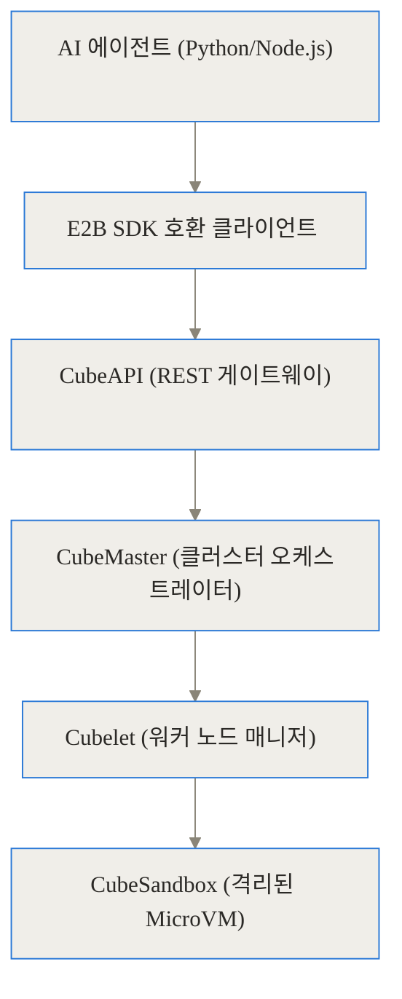
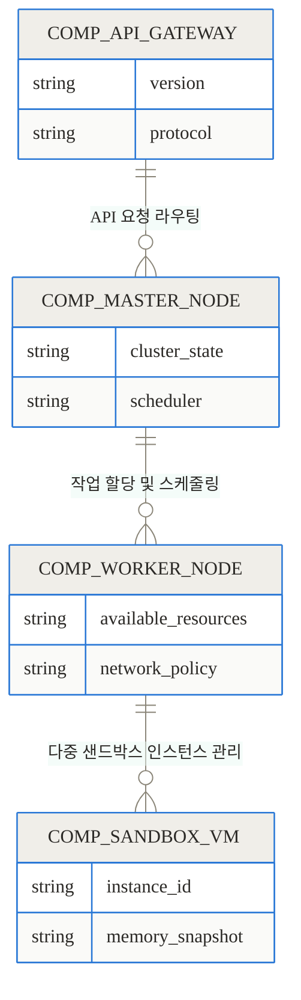
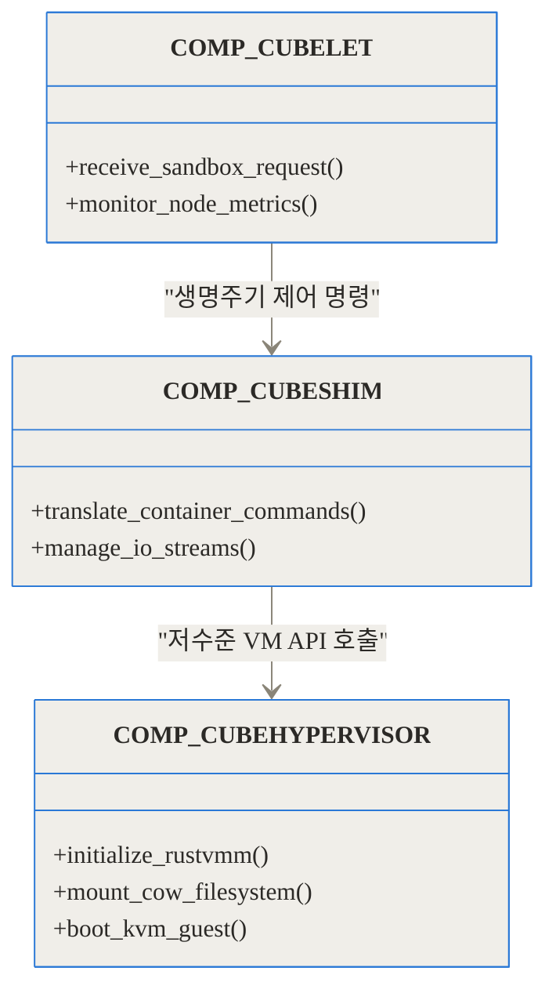
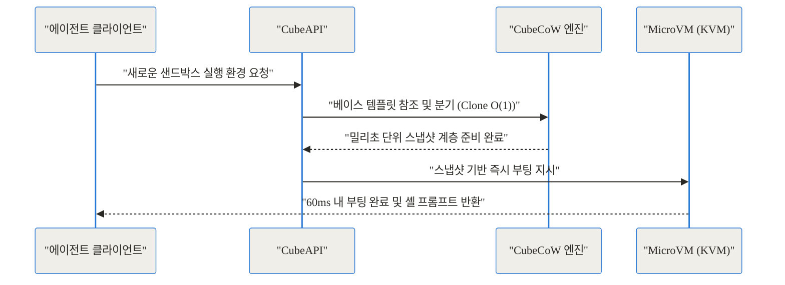
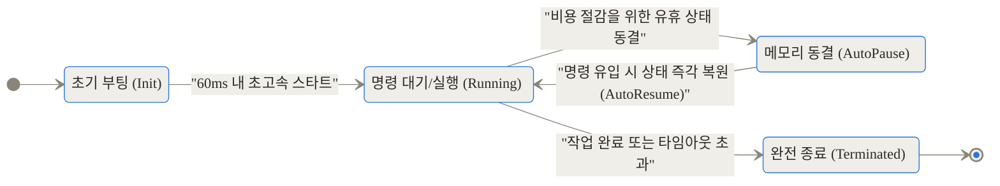
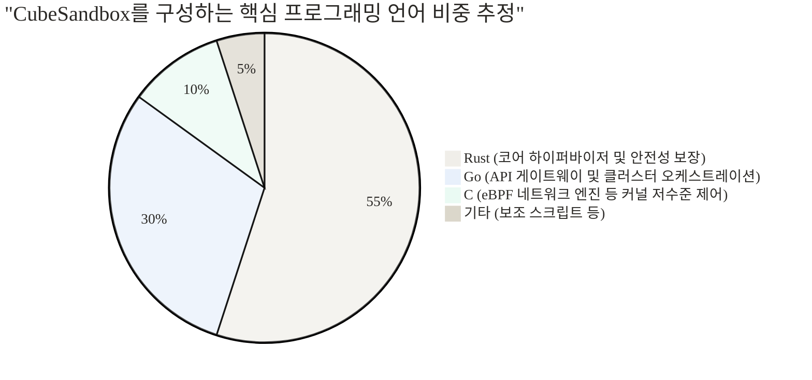

## 들어가며

AI가 그저 텍스트 문장만을 작성하던 시대를 지나, 스스로 터미널을 열고 파이썬 스크립트를 실행하며 외부 패키지를 능동적으로 설치하는 자율형 에이전트(Autonomous Agent) 시대가 되었습니다. 이러한 자율형 에이전트는 애플리케이션 개발과 데이터 분석에 엄청난 생산성 향상을 가져왔지만, 동시에 극단적인 인프라 재앙을 일으킬 잠재력을 품고 있습니다. 에이전트가 환각(Hallucination) 상태에 빠져 운영 서버의 핵심 파일 시스템을 지워버리거나, 악성 코드가 심어진 파이썬 라이브러리를 무심코 다운로드하여 권한을 탈취당한다면 어떻게 될까요?

이러한 치명적인 사고를 막으려면 환각이 있는 에이전트에게 권한을 쥐여주기 전에 강력하고 빠른 격리 환경, 즉 전용 샌드박스(Sandbox) 인프라를 구축하는 것이 필수적입니다.

이 글의 핵심을 한 마디로 요약하면 다음과 같습니다.
- 텐센트 클라우드(Tencent Cloud)가 2026년 4월 아파치(Apache) 2.0 라이선스로 오픈소스화한 CubeSandbox는 에이전트의 무결성을 지키며 코드를 안전하게 실행하는 고성능 샌드박스입니다.
- RustVMM과 KVM을 활용하여 하드웨어 수준의 철저한 격리를 제공하면서도 60ms 이하의 콜드 스타트 시간과 5MB 이하의 극도로 낮은 메모리 오버헤드를 달성했습니다.
- E2B SDK와 100% 호환되므로 기존 애플리케이션 코드 수정 없이 즉시 마이그레이션할 수 있으며 단일 노드에서 수천 개의 샌드박스를 동시에 띄울 수 있습니다.

## AI 에이전트의 딜레마: 속도냐 보안이냐

AI 에이전트를 제품 레벨로 개발하다 보면 누구나 피할 수 없는 커다란 벽에 부딪힙니다. 바로 "에이전트가 즉석에서 생성한 신뢰할 수 없는 코드를 어디에서 실행할 것인가?"라는 문제입니다.

가장 흔히 떠올리는 대안은 도커(Docker) 기반의 컨테이너 환경입니다. 도커는 부팅이 빠르고 가볍다는 명확한 장점이 있습니다. 하지만 치명적인 보안 결함이 존재합니다. 컨테이너는 본질적으로 호스트 운영체제의 리눅스 커널을 공유하기 때문에, 공격자가 제로데이 커널 취약점을 이용하면 샌드박스를 뚫고 나오는 탈옥(Container Breakout)이 발생하여 호스트 서버 전체를 장악할 수 있습니다.

그렇다면 AWS EC2와 같은 표준 가상머신(VM)은 어떨까요? 보안 측면에서는 가장 이상적입니다. 각각의 VM이 고유하고 독립적인 커널을 가지므로 하드웨어 수준의 격리가 보장됩니다. 문제는 '속도'와 '비용'입니다. 가상머신 하나를 부팅하려면 최소 수십 초에서 몇 분이 소요되고, 기본적으로 기가바이트(GB) 단위의 막대한 메모리가 필요합니다. 수백, 수천 개의 에이전트가 매우 짧은 파이썬 코드를 1초마다 수시로 실행하고 종료하는 마이크로서비스 패턴에는 근본적으로 맞지 않습니다.

최근에는 E2B 플랫폼처럼 클라우드 기반의 관리형 샌드박스 서비스가 개발자들 사이에서 인기를 끌고 있습니다. 하지만 사내 망에서만 내부 데이터를 처리해야 하는 금융권이나 대기업, 혹은 코드 실행 횟수가 너무 많아 매번 발생하는 네트워크 지연(Latency)과 막대한 API 호출 비용을 감당하기 어려운 기업에게는 외부 종속형 클라우드 샌드박스마저도 완전한 정답이 될 수 없었습니다.

결국 개발자들은 도커의 민첩한 속도와 가상머신의 완벽한 보안성, 그리고 자체 인프라(온프레미스) 구축을 통한 데이터 통제력을 모두 한데 모은 '이상적인 인프라 도구'를 절실히 원하게 되었습니다.

## CubeSandbox란 무엇인가: 가장 가볍고 견고한 일회용 금고

텐센트 클라우드가 발표한 CubeSandbox는 이러한 딜레마를 정확히 해결하기 위해 밑바닥부터 설계된 오픈소스 프로젝트입니다. 

이 기술의 작동 방식을 직관적인 일상 비유로 설명해 보겠습니다. 폭발할 위험이 다분한 미지의 화학 물질(AI가 즉석에서 생성한 검증되지 않은 코드)을 계속해서 테스트해야 하는 연구원이 있다고 상상해 보십시오.

> 기존의 범용 가상머신(VM) 방식은 화학 테스트를 할 때마다 튼튼한 콘크리트 연구 건물을 매번 새로 짓는 것과 같습니다. 안전하지만 시간과 예산이 천문학적으로 낭비됩니다. 반면 도커 컨테이너는 커다란 공용 연구실 안에 얇은 유리 칸막이만 쳐두고 위험한 실험을 하는 것과 같습니다. 빠르고 간편하지만, 만약 강력한 폭발이 일어나면 유리 칸막이가 산산조각 나며 연구실 전체가 오염될 수 있습니다.

CubeSandbox는 마치 마법 같은 **'일회용 초경량 전용 금고 생성기'**입니다. 버튼을 누르는 순간 0.06초(60ms) 만에 외부와 완벽히 밀폐된 전용 티타늄 금고가 눈앞에 나타납니다. 화학 물질을 그 튼튼한 금고 안에서 마음껏 터뜨려본 뒤, 실험이 완료되면 금고 내부 상태를 초기화할 필요도 없이 금고째로 즉시 흔적도 없이 소멸시킵니다. 더욱 놀라운 것은, 이 금고 하나를 만드는 데 소모되는 자원(메모리)이 고작 5MB밖에 되지 않아 연구실 바닥 하나에 2,000개 이상의 금고를 동시에 띄워도 무리가 없다는 점입니다.

이 놀라운 속도와 고밀도 집적성의 비밀은 바로 무거운 범용 운영체제의 짐을 다 덜어내고 오직 코드 실행에 필수적인 핵심 요소만 최소한으로 남긴 '마이크로VM(MicroVM)' 기술에 있습니다.

## 돋보기로 들여다보는 내부 아키텍처 (Under the Hood)

가장 많은 엔지니어들이 궁금해할 내부 동작 원리를 파헤쳐 보겠습니다. CubeSandbox는 단순한 래퍼(Wrapper) 스크립트 모음이 아니라, 커널 수준의 네트워크 제어 계층과 하이퍼바이저를 치밀하게 결합한 거대한 분산 샌드박스 시스템입니다.

### 전체 시스템의 흐름과 주요 컴포넌트

전체 아키텍처는 효율적인 작업 스케줄링과 빠르고 안전한 샌드박스 생명주기 관리를 위해 여러 컴포넌트로 나뉘어 있습니다.



가장 앞단에는 E2B SDK와 호환되는 REST 기반의 게이트웨이인 **CubeAPI**가 자리 잡고 있습니다. Rust의 Axum 프레임워크로 튼튼하게 작성된 이 API 서버는 외부 E2B 방식의 호출을 내부 gRPC로 번역하고 인증을 거쳐 마스터 노드로 전달합니다.

그 뒤를 이어 전체 클러스터 자원의 두뇌 역할을 하는 **CubeMaster**가 등장합니다. Go 언어로 작성된 이 오케스트레이터는 현재 어느 워커 노드(Worker Node)에 리소스가 남는지 실시간으로 모니터링하여 최적의 노드에 작업을 지시합니다.

이해를 돕기 위해 각 핵심 컴포넌트 간의 상호작용 및 데이터 관계를 나타낸 모델링 다이어그램을 살펴보겠습니다.



작업을 할당받은 워커 노드 내부에서는 **Cubelet**이라는 관리 데몬이 인스턴스의 생성부터 소멸까지를 전담합니다. 특히 기존 컨테이너 생태계의 도구들과 매끄럽게 호환되도록 containerd의 Shim v2 인터페이스를 그대로 구현한 **CubeShim** 계층이 존재하여 하부의 하이퍼바이저와 통신하게 됩니다.

### KVM과 RustVMM: 하드웨어 격리를 달성하는 원리

도커 컨테이너의 보안 약점을 극복하기 위해 CubeSandbox가 선택한 무기는 **KVM(Kernel-based Virtual Machine)**과 **RustVMM**입니다. KVM은 리눅스 내장 하드웨어 가상화 기술로 CPU 레벨에서 완전히 분리된 메모리 공간과 명령어 실행 권한을 제공합니다.

하지만 KVM을 제어하는 전통적인 도구인 QEMU는 플로피 디스크, 구형 마우스 포트, 모니터 출력 인터페이스 등 현대 클라우드에서는 전혀 쓰지 않는 수많은 구형 하드웨어를 에뮬레이션하느라 덩치가 매우 큽니다. AI 에이전트는 코드만 실행하면 될 뿐 화면을 모니터로 출력할 필요가 없습니다. CubeSandbox는 QEMU를 과감히 버리고 RustVMM 생태계를 채택했습니다.

RustVMM은 하이퍼바이저를 레고 블록 조립하듯 필요한 부품만 골라서 만들 수 있게 해주는 도구 상자입니다. 이를 통해 철저하게 AI 코드 실행 환경에만 필요한 최소한의 장치만 남긴 초경량 맞춤형 하이퍼바이저(CubeHypervisor)를 벼려냈습니다.



이렇게 불필요한 장치 초기화 단계를 모두 생략한 결과, 가상머신 하나가 차지하는 메모리 오버헤드가 단 5MB 수준으로 쪼그라들었습니다. 다음의 수치 비교를 보면 그 극단적인 경량화를 체감할 수 있습니다.

```chartjs
{"type":"bar","data":{"labels":["표준 가상머신(VM)","일반 마이크로VM","CubeSandbox"],"datasets":[{"label":"인스턴스당 메모리 오버헤드 (MB)","data":[1024,15,4.5]}]}}
```

### CubeVS와 eBPF: 보이지 않는 네트워크 방화벽

에이전트가 격리된 가상 공간에서 코드를 실행한다고 모든 보안 문제가 끝나는 것은 아닙니다. 샌드박스가 외부 인터넷과 자유롭게 통신하도록 내버려 두면, 악의적인 코드가 회사의 내부망을 스캐닝하거나 암호화폐 채굴을 위한 디도스(DDoS) 공격의 진원지로 변질될 수 있습니다.

기존 방식은 호스트의 iptables를 복잡하게 설정해야 했지만, 속도 저하와 관리의 한계가 있었습니다. CubeSandbox는 최신 커널 기술인 **eBPF(Extended Berkeley Packet Filter)**를 활용한 전용 네트워크 엔진 **CubeVS**를 내장했습니다.

```mermaid
%%{init: {"theme":"base","themeVariables":{"primaryColor":"#F0EEE9","primaryBorderColor":"#2a78d6","primaryTextColor":"#2b2926","secondaryColor":"#e8f0fb","secondaryBorderColor":"#4a3aa7","secondaryTextColor":"#2b2926","tertiaryColor":"#eafaf3","tertiaryBorderColor":"#1baf7a","tertiaryTextColor":"#2b2926","lineColor":"#8a8578","textColor":"#2b2926","edgeLabelBackground":"#F0EEE9","noteBkgColor":"#F0EEE9","noteTextColor":"#2b2926","noteBorderColor":"#8a8578","clusterBkg":"#faf9f6","clusterBorder":"#d8d4c8","fontFamily":"Pretendard, sans-serif"}}}%%
flowchart LR
  A["외부 네트워크 (World)"] -->|from_world BPF 훅| B["CubeVS 인그레스 엔진"]
  B --> C["네트워크 정책 검증 (커널 레벨)"]
  C --> D["CubeEgress L7 프록시 (도메인 필터 등)"]
  D -->|from_cube BPF 훅| E["샌드박스 내부 게스트 OS"]
```



eBPF는 운영체제의 핵심 커널 코드를 건드리지 않고도 커널 공간 내부에서 안전하게 샌드박스 코드를 실행하게 해주는 혁명적인 기술입니다. 샌드박스가 유해한 네트워크 패킷을 보내면, 그 패킷이 사용자 공간으로 느리게 복사되기도 전에 커널 공간의 eBPF 프로그램이 즉시 낚아채어 차단합니다. 이를 '제로 카피(Zero-Copy)' 데이터 플레인이라고 부릅니다.

뿐만 아니라 **CubeEgress**라는 L7 애플리케이션 계층 프록시를 통해 단순히 IP 단위가 아니라 "openai.com 도메인으로 가는 API 요청만 허용한다" 같은 세밀한 정책 설정과 크리덴셜(인증 키) 자동 주입이 가능하여, 에이전트의 프롬프트나 샌드박스 내부에는 실제 API 키가 절대 노출되지 않는 강력한 보안 구조를 자랑합니다.

### CubeCoW와 상태 관리: 초고속 스냅샷의 비밀

60ms 이하라는 비현실적인 콜드 스타트 속도를 달성한 결정적 무기는 바로 자체 스토리지 엔진인 **CubeCoW(Copy-on-Write)**입니다. 

만약 96코어 서버에서 1,000개의 샌드박스를 동시에 구동한다고 가정해 봅시다. 각 샌드박스가 필요로 하는 파이썬 리눅스 환경 이미지가 1GB라면, 1,000번을 복사할 경우 1TB의 디스크 쓰기 작업이 발생하여 디스크 I/O가 멈춰버릴 것입니다.

CubeCoW는 베이스 이미지를 단 하나만 생성하고 모든 샌드박스가 이를 '읽기 전용'으로 얇게 공유하도록 합니다. 샌드박스가 특정 파일을 수정하거나 `pip install`로 패키지를 설치할 때만, 수정된 블록만을 별도의 변경 레이어에 기록합니다. 이 덕분에 새로운 샌드박스 복제(Clone) 작업의 시간 복잡도는 O(1) 수준으로 즉각적입니다.



더 나아가 사용하지 않고 대기 중인 유휴 에이전트의 메모리 상태를 디스크에 그대로 얼려두어 물리 서버의 RAM을 절약하는 **AutoPause**, 그리고 새로운 코드 실행 요청이 들어오는 순간 디스크의 상태를 다시 메모리로 퍼 올려 실행을 재개하는 **AutoResume** 기능까지 완벽하게 지원합니다.



## 설치부터 실행까지: 얼마나 쉽게 쓸 수 있을까?

이토록 복합적이고 심오한 기술 스택이 융합되어 있지만, 최종 사용자가 이를 도입하는 과정은 믿기 힘들 만큼 단순합니다. 테라폼(Terraform) 프로비저닝을 적극 지원하며 단일 스크립트로 클러스터 구성이 가능합니다.

무엇보다 가장 강력한 개발자 경험(DX)은 **E2B SDK와의 100% 드롭인(Drop-in) 호환성**입니다. 기존에 E2B 클라우드 환경에서 에이전트를 개발하던 팀이라면 비즈니스 로직 코드를 단 한 줄도 바꿀 필요가 없습니다. 아래 파이썬 코드 예제처럼 클라이언트 객체를 생성할 때 API 호출 주소(base_url)만 자신이 구축한 자체 로컬 서버 주소로 변경하면 그만입니다.

```python
from e2b import Sandbox

# 기존 E2B 코드에서 API URL만 자체 구축한 CubeSandbox 로컬 주소로 변경합니다.
# 이제 수백 번을 실행해도 클라우드 과금이 발생하지 않고 데이터가 외부에 유출되지 않습니다.
sandbox = Sandbox(
    api_key="your-local-key", 
    base_url="http://localhost:8080"
)

# 완벽하게 하드웨어 격리된 KVM 내부에서 코드가 안전하게 실행됩니다.
sandbox.run_code("print('CubeSandbox 환경에서 철저히 격리되어 실행 중입니다.')")
```

## 실전 활용 시나리오: 현업 트러블슈팅 관점

현장에서는 구체적으로 어떤 상황에서 CubeSandbox가 압도적인 가치를 제공할까요?

**1. 보안 규제가 엄격한 금융권 및 엔터프라이즈의 사내망 AI 비서 구축**
망 분리 요건이나 사내 컴플라이언스 문제로 인해 내부 소스코드나 민감한 트랜잭션 데이터를 외부 퍼블릭 클라우드 샌드박스로 전송하는 것이 원천 금지된 기업이 많습니다. 자체 베어메탈 서버에 CubeSandbox 클러스터를 구축하면 망 분리 정책을 완벽하게 준수하면서도, 최신 LLM이 작성한 데이터 분석 스크립트를 강력한 보안 통제 속에서 안심하고 실행시킬 수 있습니다.

**2. 극한의 동시성이 필요한 대규모 브라우저 자동화 및 QA 테스트 봇**
단일 서버에서 수천 개의 플레이라이트(Playwright)나 셀레니움(Selenium) 인스턴스를 동시에 띄워 웹 스크래핑을 수행하거나 소프트웨어 QA 자동화를 진행한다고 가정해 봅시다. 기존 관리형 서비스를 쓰면 초당 과금액이 천문학적으로 치솟고, 무거운 VM을 띄우자니 메모리가 금세 고갈됩니다. 오버헤드가 5MB에 불과한 CubeSandbox를 활용하면 96코어 물리 서버 단 한 대에서 2,000개 이상의 브라우저 에이전트를 고밀도로 띄울 수 있어 인프라 비용을 극단적으로 낮출 수 있습니다.

## 성능과 효율성: 다른 방식과의 객관적 비교

부팅 시간을 비교해 보면 CubeSandbox가 지닌 속도의 우위를 명확히 알 수 있습니다.

```chartjs
{"type":"bar","data":{"labels":["기존 도커(Docker)","표준 가상머신(VM)","Firecracker 마이크로VM","CubeSandbox"],"datasets":[{"label":"콜드 스타트 시간 (ms)","data":[500,2000,120,58]}]}}
```

다음 표는 기존의 널리 쓰이던 샌드박스 기술들과 CubeSandbox의 아키텍처 특성을 다각도로 비교 분석한 내용입니다.

| 비교 항목 | 일반 컨테이너 (Docker) | 표준 가상머신 (EC2 등) | 클라우드 관리형 샌드박스 (E2B Cloud) | CubeSandbox (오픈소스) |
|---|---|---|---|---|
| **운영체제 격리 수준** | 호스트 커널 공유 (가장 낮음) | 개별 커널 할당 (매우 높음) | 서비스 플랫폼 정책에 따름 | 전용 커널 기반 하드웨어 격리 (매우 높음) |
| **콜드 스타트 부팅 속도** | 빠름 (수백 ms 수준) | 가장 느림 (수십 초~수 분 소요) | 네트워크 지연 및 플랫폼 대기시간 발생 | **60ms 이하 (초고속)** |
| **메모리 자원 오버헤드** | 낮음 | 매우 큼 (수 GB 단위) | 클라우드 호출 비용으로 과금됨 | **5MB 미만 (극도로 낮음)** |
| **네트워크 보안 제어** | iptables 의존 (우회 위험 존재) | 강력함 | 관리자 정책에 제한적 의존 | **eBPF 기반 제로 카피 차단 및 L7 프록시** |
| **프라이버시 및 데이터 통제** | 자체 망에서 통제 가능 | 자체 망에서 통제 가능 | 외부 서버로 데이터 전송 필수 (유출 위험) | 사내 구축을 통해 완벽한 데이터 격리 보장 |

이러한 극한의 최적화가 가능했던 이유는 내부 모듈의 요구사항에 맞춰 개발 언어를 철저히 분업화했기 때문입니다. 메모리 안전성이 생명인 가상화 엔진은 Rust로 작성하고, 높은 생산성이 필요한 스케줄러 계층은 Go 언어로 구현했습니다.



## 도입 전 반드시 알아야 할 한계점

세상에 모든 문제를 해결하는 완벽한 은탄환(Silver Bullet)은 없습니다. 현업에 이 기술의 도입을 심도 있게 검토 중이라면 다음의 트레이드오프와 물리적 제약을 반드시 인지해야 합니다.

1. **엄격한 하드웨어 가상화 요구사항**  
가장 중요한 제약 조건입니다. CubeSandbox는 KVM 기반의 리눅스 하드웨어 가상화를 직접 호출합니다. 따라서 운영체제가 호스트 CPU의 가상화 명령어를 직접 제어할 수 있는 '베어메탈(물리 서버)' 환경이 필수적이거나 클라우드 환경일 경우 반드시 '중첩 가상화(Nested Virtualization)'를 정식으로 지원하는 특수한 인스턴스를 대여해야 합니다. 일반적인 저가형 VPS 가상머신 위에서는 정상적으로 엔진이 동작하지 않습니다.

2. **신생 오픈소스 특유의 학습 곡선과 생태계**  
2026년 4월에 대중에게 공개된 비교적 최신의 프로젝트이므로, 수십 년간 다져진 쿠버네티스(Kubernetes) 생태계만큼 관리용 플러그인이나 커뮤니티 튜토리얼이 방대하지 않습니다. 시스템을 온전히 파악하고 자체 클러스터를 트러블슈팅하기 위해서는 Rust 프로그래밍 언어, KVM 동작 원리, eBPF 커널 기술 등 깊고 넓은 시스템 소프트웨어 지식이 폭넓게 요구됩니다.

## 마무리하며

텐센트 클라우드가 CubeSandbox의 전체 코드를 세상에 공개한 것은 다가오는 AI 에이전트 인프라 생태계에 매우 굵직한 이정표가 되었습니다. 도커가 제공하는 유연하고 빠른 속도, 표준 가상머신이 보장하는 철통같은 보안성, 그리고 자체 인프라를 통한 온프레미스 통제권이라는 이질적인 세 마리 토끼를 단 하나의 프로젝트 안에서 성공적으로 엮어낸 훌륭한 엔지니어링의 정수입니다.

인공지능 모델이 스스로 추론하고 외부 환경과 교류하며 실시간으로 코드를 실행해 나가는 미래에는 '어떤 똑똑한 LLM을 선택하는가' 못지않게 '그 위험한 코드를 어떤 인프라 샌드박스 안에서 안전하게 억제하고 실행할 것인가'가 서비스 전체의 안정성과 기업의 명운을 좌우하는 핵심 경쟁력이 될 것입니다. 속도와 인프라 운영 비용, 그리고 무엇보다 보안에 깊이 목마른 개발 팀이라면 CubeSandbox는 아키텍처 회의에서 가장 먼저 논의되어야 할 최우선 선택지입니다.

## 자주 묻는 질문 (FAQ)

### 기존 도커(Docker) 환경에서 바로 CubeSandbox로 넘어갈 수 있나요?

애플리케이션 코드는 E2B 호환 SDK를 통해 거의 수정할 필요 없이 마이그레이션할 수 있습니다. 다만, 실행 인프라 측면에서는 KVM 기반의 하드웨어 가상화를 사용하므로 물리 서버(베어메탈) 환경이거나 중첩 가상화(Nested Virtualization)를 명시적으로 지원하는 클라우드 인스턴스가 반드시 준비되어야 합니다 [2.2.8].

### E2B 클라우드 서비스를 쓰는 것과 자체 서버에 구축하는 것 중 어떤 것이 유리할까요?

사내 망의 강력한 보안 컴플라이언스 규정 때문에 내부 데이터를 외부 퍼블릭 망으로 절대 내보낼 수 없거나, 에이전트의 코드 실행 횟수가 너무 많아 클라우드 API 호출 비용이 기하급수적으로 커진다면 자체 인프라 구축이 압도적으로 유리합니다. 반면 인프라 관리 전담 인력이 부족한 작은 팀이라면 유지보수 부담이 없는 E2B 관리형 서비스가 합리적일 수 있습니다.

### 60ms라는 비현실적인 콜드 스타트 부팅 속도는 기술적으로 어떻게 가능한가요?

무겁고 불필요한 레거시 장치가 포함된 범용 운영체제 대신 코드 실행에만 초점을 맞춘 최소한의 초경량 커널(RustVMM 기반)을 사용하기 때문입니다. 또한 CubeCoW 스토리지 엔진을 통해 무거운 복잡한 부팅 절차를 생략하고, 밀리초 단위로 생성된 메모리 스냅샷 레이어에서 상태를 즉시 복원하므로 극적인 시간 단축이 이루어집니다.

### 인스턴스당 메모리 오버헤드가 5MB 이하라는 것은 실제로 어떤 의미를 가지나요?

완전히 새로운 샌드박스 가상머신을 하나 더 띄울 때 호스트 서버에서 추가로 낭비되는 메모리가 고작 5MB에 불과하다는 뜻입니다. 이 극단적인 경량화 덕분에 96코어를 장착한 물리 서버 단 한 대에서 무려 2,000개 이상의 샌드박스를 동시에 띄우는 고밀도 집적 실행 환경을 구성할 수 있어 서버 임대 비용을 기적적으로 낮출 수 있습니다.

### CubeSandbox 내부에서 외부망으로 통신하는 네트워크는 완전히 차단되어 있나요?

기본적으로는 호스트망 및 외부망과 철저히 격리됩니다. 하지만 AI 에이전트가 외부 API와 통신해야 하는 경우, eBPF 기술 기반의 커널 레벨 네트워크 엔진인 CubeVS와 L7 애플리케이션 프록시를 통해 세밀한 제어가 가능합니다. 이를 통해 에이전트가 특정 도메인(예: OpenAI API)에만 접근할 수 있도록 안전한 화이트리스트 정책을 손쉽게 부여할 수 있습니다.


## References
- [https://github.com/TencentCloud/CubeSandbox](https://github.com/TencentCloud/CubeSandbox)
- [https://github.com/TencentCloud/CubeSandbox/tree/master/docs](https://github.com/TencentCloud/CubeSandbox/tree/master/docs)
