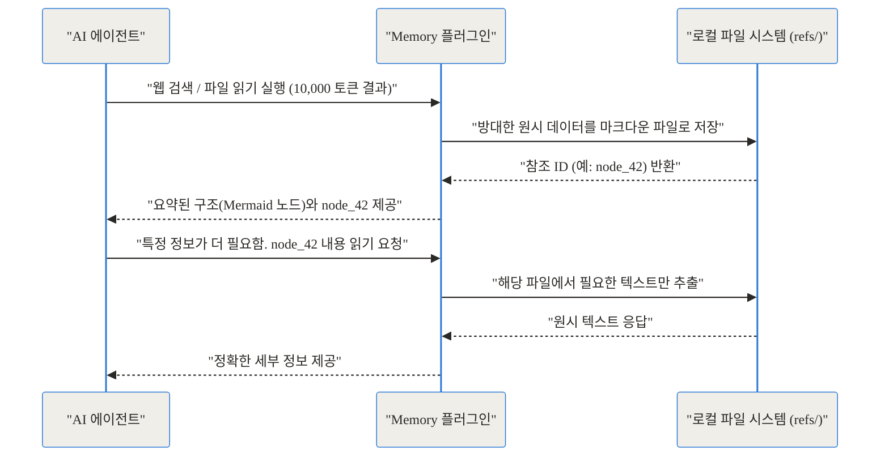
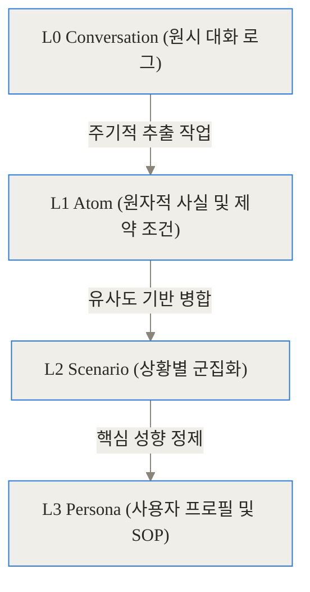
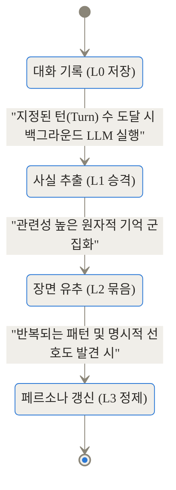
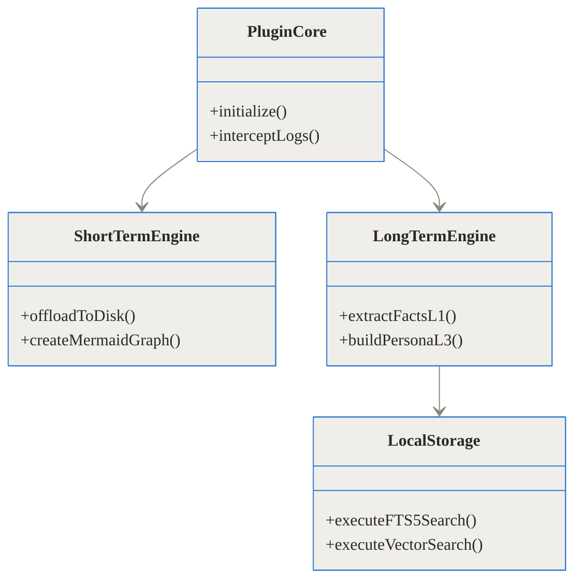
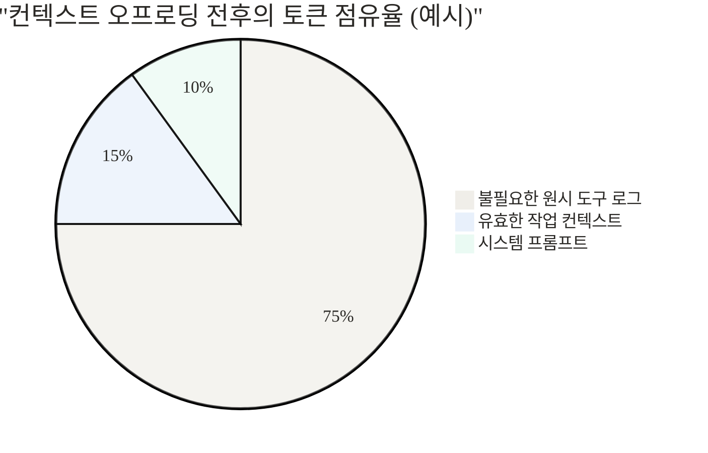

## 참고 링크 모음

- [TencentDB-Agent-Memory 공식 GitHub 저장소](https://github.com/TencentCloud/TencentDB-Agent-Memory)
- [Tencent Cloud OpenClaw 커뮤니티 가이드](https://cloud.tencent.com/)

## 도입: 에이전트는 왜 금방 바보가 될까요?

**TL;DR (한 줄 요약)**
1. TencentDB-Agent-Memory는 외부 API 없이 완전 로컬에서 동작하는 AI 에이전트 전용 장기 기억 시스템입니다.
2. 방대한 도구 실행 로그를 파일로 빼내는 '컨텍스트 오프로딩'으로 단기 맥락 폭발을 방지합니다.
3. 모든 대화 기록을 단순 벡터화하는 대신, 4단계(L0~L3)로 정제하고 압축하여 진정한 의미의 장기 기억을 구현합니다.

AI 에이전트를 실무에 도입해 본 개발자라면 누구나 한 번쯤 겪는 좌절이 있습니다. 처음 몇 번의 지시를 내릴 때만 해도 천재 같던 에이전트가, 대화가 20턴을 넘어가고 여러 코드를 수정하기 시작하면 갑자기 원래 목표를 잊어버립니다. 방금 알려준 코딩 규칙을 어기고, 검색했던 문서를 또 검색하며 제자리걸음을 하죠. 

왜 그럴까요? 에이전트가 처리해야 하는 맥락(Context)이 감당할 수 없이 비대해지기 때문입니다. 에이전트가 파일을 읽거나 웹을 검색할 때 반환되는 방대한 텍스트와 로그 찌꺼기가 컨텍스트 창을 가득 채우고 나면, 대형 언어 모델(LLM)은 정작 중요한 핵심 목표에 주의력을 할당하지 못하는 '주의력 세금(Attention Tax)'을 치르게 됩니다.

텐센트 클라우드(Tencent Cloud)가 오픈소스로 공개한 **TencentDB-Agent-Memory**는 이 문제를 구조적으로 해결하기 위해 등장했습니다. 이 프로젝트는 단순히 과거 기록을 어딘가에 저장하는 것을 넘어, 에이전트가 단기적인 작업 흐름을 유지하면서도 장기적인 사용자 성향을 학습하도록 돕습니다. 외부 API에 의존하지 않고 전면 로컬에서 구동되며, OpenClaw 같은 에이전트 환경에 플러그인 형태로 즉시 결합할 수 있는 이 기술의 내부를 깊이 파헤쳐 보겠습니다.

## 기존 에이전트 기억 장치의 한계: 평면적 벡터 저장소의 비극

기존에 에이전트에게 기억을 부여하는 가장 흔한 방식은 검색 증강 생성(RAG, Retrieval-Augmented Generation)이었습니다. 모든 대화 기록과 문서를 잘게 쪼개어 임베딩하고 벡터 데이터베이스에 쏟아부은 뒤, 새로운 질문이 들어오면 유사도 검색을 통해 비슷한 조각을 꺼내오는 식이죠.

하지만 이 방식에는 치명적인 문제가 있습니다. 이건 마치 범죄 수사 현장의 모든 증거물, 녹취록, 영수증을 하나의 거대한 상자에 마구 섞어 던져 넣는 것과 같습니다. 수사관(에이전트)이 "범인의 동기가 뭐지?"라고 물으면, 상자 안에서 '동기'라는 단어와 텍스트가 비슷한 영수증 쪼가리나 의미 없는 대화 스크립트 파편을 무작위로 꺼내주는 꼴입니다. 구조도 없고, 시간적 흐름도 없으며, 거시적인 통찰력도 잃어버리게 됩니다.

TencentDB-Agent-Memory 팀은 이 문제를 다음과 같이 진단했습니다.
- **무분별한 조각화**: 데이터를 파편으로 찢어 평면적인(Flat) 벡터 저장소에 넣으면 문맥이 단절됩니다.
- **맹목적인 유사도 검색**: 사용자의 최상위 선호도나 제약 조건보다, 단순히 단어가 겹치는 쓸모없는 과거 로그가 검색될 확률이 높습니다.

이를 해결하기 위해 이 프로젝트는 완전히 새로운 두 가지 기둥(Pillar)을 세웠습니다. 바로 **심볼릭 단기 기억(Symbolic Short-Term Memory)**과 **계층형 장기 기억(Layered Long-Term Memory)**입니다.

## 작동 원리 1: 심볼릭 단기 기억과 컨텍스트 오프로딩

가장 먼저 해결해야 할 문제는 현재 진행 중인 작업에서 토큰 창이 터져버리는 현상입니다. 복잡한 문제를 푸는 에이전트는 필연적으로 장황한 도구 로그(웹 크롤링 결과, 긴 파일 내용, 길고 복잡한 에러 스택 트레이스)를 생성합니다. 

TencentDB-Agent-Memory는 **컨텍스트 오프로딩(Context Offloading)**이라는 기술을 통해 이 장황한 로그를 모델의 눈앞에서 치워버립니다.

### 컨텍스트 오프로딩의 흐름

이 과정은 마치 능숙한 프로젝트 매니저가 두꺼운 100페이지짜리 기술 명세서를 책상 서랍에 넣어두고, 화이트보드에는 핵심 흐름도(Mermaid)와 참조 번호만 그려두는 것과 같습니다.



1. **도구 실행 로그 격리**: 에이전트가 도구를 호출해 거대한 결과값을 받으면, 플러그인이 이를 낚아채어 로컬 디스크의 `refs/*.md` 파일로 저장합니다.
2. **심볼릭 그래프 주입**: 에이전트의 컨텍스트 창에는 장황한 텍스트 대신 깔끔하게 구조화된 Mermaid 형태의 심볼 그래프(약 500토큰 수준)만 남깁니다.
3. **필요 시 호출 (Grep)**: 에이전트는 심볼 그래프를 보고 작업 흐름을 파악하며, 특정 세부 내용이 진짜로 필요할 때만 `node_id`를 통해 해당 파일의 내용을 다시 불러옵니다.

이러한 구조적 압축 방식은 단순한 '텍스트 요약'과는 다릅니다. 원본 데이터는 하나도 손실되지 않고 디스크에 보존되며, 정보로 향하는 경로는 결정론적으로 유지됩니다.

## 작동 원리 2: 4단계 시맨틱 피라미드 장기 기억

단기적인 작업이 끝난 후, 이 경험을 어떻게 장기 기억으로 넘길 것인가가 두 번째 과제입니다. TencentDB-Agent-Memory는 사람의 뇌가 경험을 처리하는 방식을 모방해, 모든 기억을 **L0에서 L3까지 4단계의 시맨틱 피라미드**로 구축합니다.



각 계층은 서로 다른 목적과 데이터 형태를 가집니다.

| 계층 (Layer) | 설명 및 목적 | 저장 형태 | 쿼리 우선순위 |
| :--- | :--- | :--- | :--- |
| **L3 Persona** | 사용자의 핵심 선호도, 표준 작업 절차(SOP). 가장 고차원적인 지식. | 사람이 읽기 쉬운 Markdown 파일 | 1순위 (프롬프트에 상시 주입) |
| **L2 Scenario** | 특정 작업이나 상황(예: '파이썬 백엔드 배포')에 관련된 기억 묶음. | SQLite 기반 구조화 데이터 | 2순위 |
| **L1 Atom** | 대화에서 뽑아낸 단편적인 사실, 제약 사항, 결론. | 벡터 임베딩 + FTS5 검색 | 3순위 |
| **L0 Conversation** | 편집되지 않은 원시 대화 로그 전체. 증거 보존용. | JSONL 형식 | 가장 낮음 (디버깅/원문 확인용) |

에이전트에게 새로운 작업이 주어지면, 평면적 검색을 하는 대신 **L3 페르소나를 가장 먼저 읽습니다**. 만약 사용자가 "결과물은 항상 한국어로 출력해 줘"라고 여러 번 말했다면, 이 정보는 L1을 거쳐 L3 프로필로 승격되어 마크다운 파일에 영구 기록됩니다. 이후 에이전트는 검색조차 할 필요 없이 시스템 프롬프트를 통해 이 규칙을 인지합니다. 아주 구체적이고 미세한 사실 관계가 필요할 때만 L1이나 L0로 깊숙이 파고듭니다(Drill-down).

### 상태 전이 프로세스

이러한 계층 간의 이동은 어떻게 이루어질까요? 플러그인 내부의 백그라운드 프로세스가 이 작업을 자동으로 처리합니다.



## 하드웨어와 백엔드: 전면 로컬, 무거운 외부 의존성 제거

이토록 복잡한 계층형 데이터와 벡터를 다루면서도, TencentDB-Agent-Memory는 외부 클라우드 데이터베이스 API를 단 하나도 요구하지 않습니다. 개인정보 보호가 필수적인 엔터프라이즈 환경이나 닫힌 망 내에서도 에이전트를 안심하고 구축할 수 있습니다.

내부적으로는 **로컬 SQLite**에 의존하며, 벡터 검색을 위해 **sqlite-vec** 확장 모듈을 결합했습니다. 텍스트 기반의 전통적인 키워드 검색(FTS5)과 임베딩 기반의 벡터 검색을 결합한 **하이브리드 리콜(Hybrid Recall)** 방식을 사용하여, 키워드의 정확성과 의미적 유사성을 동시에 잡아냅니다.



## 어떻게 설치하고 설정할까? (OpenClaw 통합)

이 프로젝트는 단독 실행 프로그램이 아니라 에이전트 프레임워크에 얹어 쓰는 **플러그인** 형태로 개발되었습니다. 현재 가장 완벽하게 지원되는 호스트는 **OpenClaw**입니다. 

설치 과정은 놀랍도록 단순합니다. Node.js 22.16.0 이상, OpenClaw 2026.3.13 이상의 환경이 준비되었다면 터미널에서 다음을 실행합니다.

```bash
# 플러그인 설치
openclaw plugins install @tencentdb-agent-memory/memory-tencentdb

# 변경 사항 적용을 위해 게이트웨이 재시작
openclaw gateway restart
```

이후 사용자 홈 디렉토리의 `~/.openclaw/openclaw.json` 파일에 간단한 활성화 설정을 추가하면 끝입니다.

```json
{
  "memory-tencentdb": {
    "enabled": true,
    "capture": {
      "enabled": true,
      "l0l1RetentionDays": 90
    },
    "pipeline": {
      "everyNConversations": 5
    }
  }
}
```

설정이 완료되면 `~/.openclaw/memory-tdai/` 디렉토리에 시스템 파일들이 생성됩니다. 에이전트와 대화를 나눌수록 백그라운드에서 L1 추출기가 워밍업을 시작하며, 몇 번의 대화 턴(Turn)이 지나면 마크다운 형태로 깔끔하게 정리된 사용자의 L3 페르소나 파일이 폴더에 등장하는 것을 직접 확인할 수 있습니다.

## 성능 벤치마크: 토큰은 절반으로, 성공률은 위로

구조가 아무리 아름다워도 실전 성능이 뒷받침되지 않으면 의미가 없죠. 텐센트 연구진은 연속된 장기 실행 작업을 시뮬레이션하기 위해 가혹한 벤치마크를 수행했습니다. 그 결과는 매우 인상적입니다.

```chartjs
{
  "type": "bar",
  "data": {
    "labels": ["WideSearch (검색 집약)", "SWE-bench (코딩 환경)", "AA-LCR"],
    "datasets": [
      {
        "label": "기존 방식 토큰 사용량 (백만 토큰)",
        "data": [221.31, 3474.1, 112.0],
        "backgroundColor": "rgba(200, 200, 200, 0.8)"
      },
      {
        "label": "도입 후 토큰 사용량 (백만 토큰)",
        "data": [85.64, 2375.4, 77.3],
        "backgroundColor": "rgba(54, 162, 235, 0.8)"
      }
    ]
  }
}
```

특히 무분별한 웹 크롤링과 노이즈가 많은 **WideSearch** 환경에서 토큰 소비량이 **221.31M에서 85.64M으로 무려 61.38%나 급감**했습니다. 단순히 토큰만 아낀 것이 아닙니다. 컨텍스트가 쾌적해지자 모델의 추론 능력이 살아나며 작업 성공률(Pass Rate)이 대폭 상승했습니다.

| 측정 항목 (Benchmark) | 기존 오픈클로 성공률 | 메모리 플러그인 적용 | 상대적 성능 향상 (Δ) |
| :--- | :--- | :--- | :--- |
| **WideSearch (단기 기억)** | 33.0% | 50.0% | **+51.52%** |
| **SWE-bench (단기 기억)** | 58.4% | 64.2% | **+9.93%** |
| **AA-LCR (단기 기억)** | 44.0% | 47.5% | **+7.95%** |
| **PersonaMem (장기 개인화)** | 48.0% | 76.0% | **+58.33%** |

*데이터 출처: TencentCloud/TencentDB-Agent-Memory 공식 GitHub 벤치마크 (2026)*



```chartjs
{
  "type": "bar",
  "data": {
    "labels": ["WideSearch 성공률(%)", "SWE-bench 성공률(%)", "PersonaMem 정확도(%)"],
    "datasets": [
      {
        "label": "기존 (Base)",
        "data": [33.0, 58.4, 48.0]
      },
      {
        "label": "Memory-TencentDB 적용",
        "data": [50.0, 64.2, 76.0]
      }
    ]
  }
}
```

이러한 결과가 말해주는 것은 명확합니다. 에이전트의 지능을 떨어뜨리는 가장 큰 원인은 '모든 것을 모델의 뇌(Context)에 욱여넣으려는 시도' 그 자체였던 것입니다.

## 실전 활용 시나리오: 이렇게 달라집니다

### 시나리오 1: 거대한 레거시 코드베이스 마이그레이션
개발자가 수만 줄에 달하는 자바(Java) 프로젝트를 타입스크립트(TypeScript)로 포팅하라고 에이전트에게 지시합니다. 기존 방식에서는 에이전트가 자바 파일 3~4개를 읽는 순간 이미 수만 토큰을 소진해버리고, 자신이 지금 어떤 모듈을 포팅 중인지 잊어버리거나 에러 로그를 무한 반복하며 헤맵니다. 

TencentDB-Agent-Memory가 켜져 있다면, 에이전트는 전체 작업 구조를 Mermaid 그래프로 인지하고, 자바 파일의 원시 텍스트는 로컬 파일 시스템에 저장해 둡니다. 필요할 때만 특정 메서드(Node)를 들여다보므로 50턴 이상 대화가 지속되어도 길을 잃지 않습니다.

### 시나리오 2: 개인화된 비서로의 진화
"나는 프론트엔드 코드 짤 때 무조건 Tailwind CSS만 쓰고, 설명은 생략하고 코드만 바로 줬으면 해."
매 세션마다 이 말을 반복해야 했던 고통이 사라집니다. 에이전트는 백그라운드에서 이 패턴을 인식하고 L3 Persona 계층에 마크다운 파일로 정제해 둡니다. 다음날 새 채팅 창을 열어도, 에이전트는 자동으로 L3 파일을 참조하여 인사말 없이 완벽한 Tailwind 코드를 뱉어냅니다.

## 솔직한 평가: 한계와 도입 전 고려해야 할 점

모든 기술이 그렇듯 은탄환은 아닙니다. 현업 도입을 고려할 때 냉정하게 따져봐야 할 트레이드오프(Trade-off)가 있습니다.

1. **백그라운드 토큰 소모의 역설**
   앞선 벤치마크에서 메인 태스크의 토큰 사용량을 60% 가까이 줄였다고 했지만, 이는 에이전트의 '전면 컨텍스트 창'을 비워준 결과입니다. 그 이면에서는 L0에서 L3로 정보를 추출하고 정제하는 과정(백그라운드 LLM 호출)에서 별도의 토큰이 지속적으로 소모됩니다. 전체 시스템 차원에서 보면 압축을 위한 인지 비용을 백그라운드로 전가한 셈이므로 비용 계산을 꼼꼼히 해야 합니다.

2. **에코시스템 종속성**
   이 프로젝트는 범용 REST API 서버로 동작하는 Mem0나 Zep 등과 달리, OpenClaw 프레임워크와 밀접하게 결합된 내부 플러그인 아키텍처를 가집니다. 만약 Cursor나 VS Code 등 다른 툴에 직접 연동하고 싶다면, 현재 제공되는 Gateway 어댑터 사양에 맞춰 중간 계층을 직접 개발해야 하는 수고가 따릅니다.

3. **오프로딩 한계 상황**
   코딩 작업(SWE-bench)에서는 절감률이 약 33%에 그쳤습니다. 이는 코드는 웹 검색 찌꺼기와 달리 구조적으로 이미 빽빽하고 압축하기 어려운 정보이기 때문입니다. 지나치게 복잡한 단일 로직을 한 번에 처리해야 하는 경우 심볼릭 메모리로 압축하기 까다로울 수 있습니다.

## 마무리: 에이전트가 진짜 똑똑해지는 길

"기억이란 모든 것을 긁어모으는 것이 아니라, 사람이 똑같은 말을 두 번 하지 않게 만들어 주는 것이다."

TencentDB-Agent-Memory 팀의 철학은 AI 에이전트가 나아가야 할 정확한 방향을 짚고 있습니다. 데이터를 파편화시켜 맹목적으로 집어넣던 시대를 지나, 이제 에이전트도 사람처럼 중요도와 맥락에 따라 기억을 계층화하고 버릴 것은 파일로 미뤄두는 '인지적 여유'를 갖게 되었습니다.

복잡한 장기 태스크를 수행하다가 맥락의 늪에 빠져 허우적대는 에이전트에게 지쳤다면, 컨텍스트 오프로딩과 4단계 기억 피라미드를 제공하는 완전 로컬 솔루션, TencentDB-Agent-Memory를 여러분의 에이전트 파이프라인에 적용해 볼 시점입니다.


## 자주 묻는 질문 (FAQ)

### 토큰을 실제로 얼마나 절감할 수 있나요?

공식 벤치마크에 따르면 웹 검색이 빈번한 WideSearch 환경에서 최대 61.38%의 토큰을 절감했습니다. SWE-bench 같은 소프트웨어 엔지니어링 작업에서도 약 33%의 절감 효과를 보였습니다. 이는 불필요한 원시 로그를 컨텍스트 창에 넣지 않고 파일로 오프로딩하는 아키텍처 덕분입니다.

### 기존 RAG(검색 증강 생성) 방식의 평면적 벡터 저장소와 무엇이 다른가요?

기존 RAG는 모든 대화와 문서를 파편화하여 한 공간에 넣고 유사도 검색만 수행하므로 맥락이 단절됩니다. 반면 이 시스템은 대화(L0), 사실(L1), 상황(L2), 페르소나(L3)로 기억을 계층화합니다. 즉, 사용자의 상위 성향(L3)을 우선 적용하고 필요할 때만 하위 계층의 세부 증거를 찾아보는 사람의 인지 과정을 모방합니다.

### OpenClaw 외부의 에디터나 프레임워크에서도 쓸 수 있나요?

현재는 기본적으로 OpenClaw 환경에 최적화된 플러그인(@tencentdb-agent-memory/memory-tencentdb) 형태로 동작하며, 추가로 Hermes 에이전트를 지원하는 Gateway 어댑터를 제공합니다. 범용 클라우드 API 형태가 아니므로 그 외의 독자적인 프레임워크에 적용하려면 소스코드를 참고해 어댑터를 별도로 개발해야 합니다.

### 데이터를 저장하기 위해 클라우드 데이터베이스 서비스가 필수적인가요?

전혀 그렇지 않습니다. 이 시스템은 철저하게 '완전 로컬'을 지향합니다. 외부 API 종속성 없이 내부적으로 로컬 SQLite 데이터베이스와 벡터 검색을 위한 sqlite-vec 확장 모듈을 기본 백엔드로 사용하여 보안이 중요한 환경에서도 안전하게 구동됩니다.

### 백그라운드에서 정보를 정제할 때 사용하는 모델을 따로 지정할 수 있나요?

네, 가능합니다. ~/.openclaw/openclaw.json 설정 파일 내에 embedding 속성을 구성하여 API 키, 사용할 모델명, 차원 수 등을 자유롭게 정의할 수 있습니다. OpenAI와 호환되는 로컬 및 원격 엔드포인트를 모두 지원합니다.


## References
- [https://github.com/TencentCloud/TencentDB-Agent-Memory](https://github.com/TencentCloud/TencentDB-Agent-Memory)
