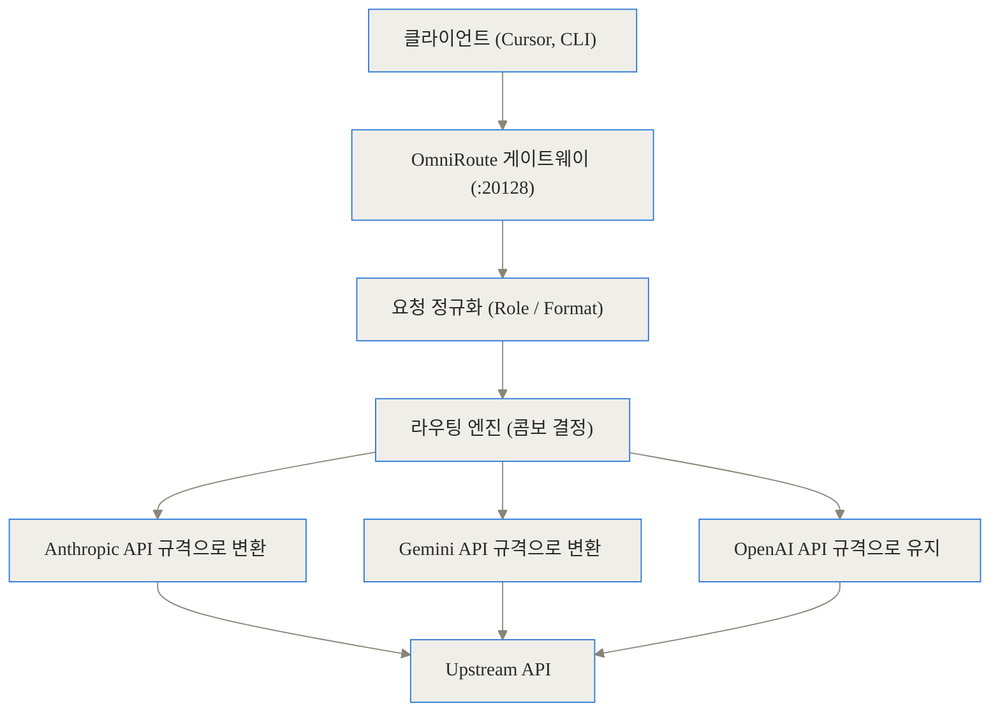
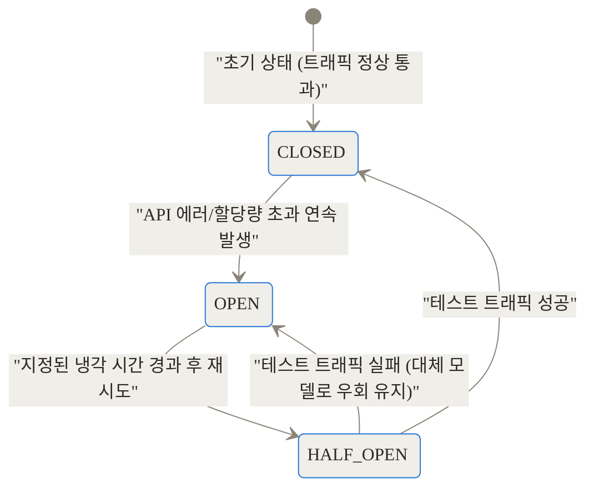
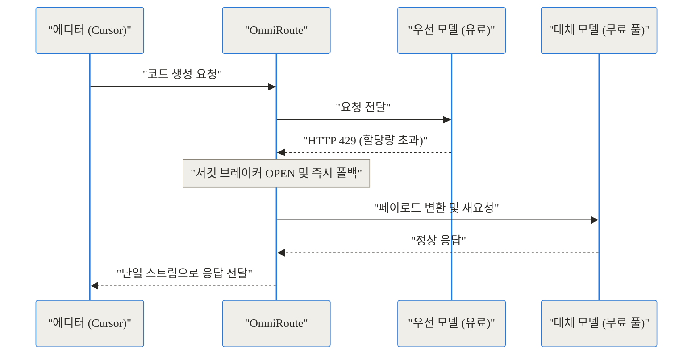
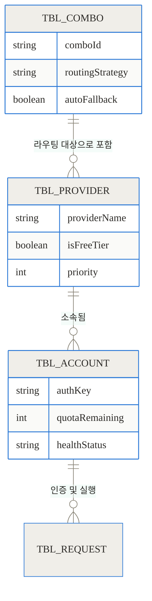
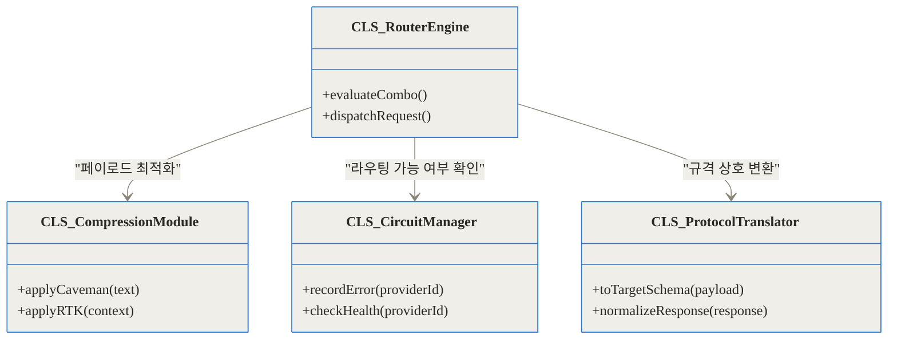
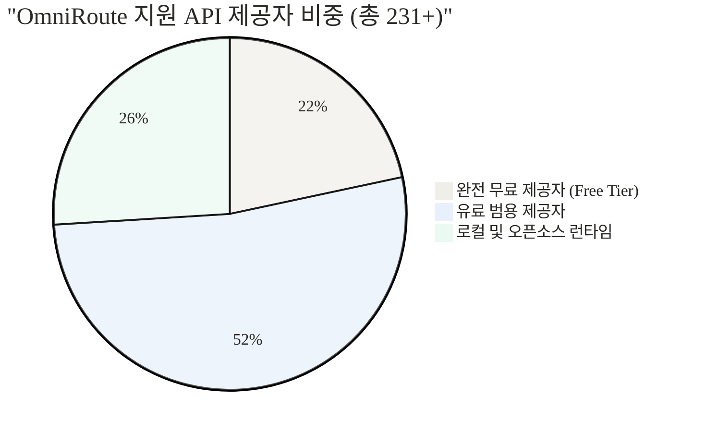

## 참고 자료 및 링크

- [OmniRoute 공식 GitHub 저장소](https://github.com/diegosouzapw/OmniRoute)
- [OmniRoute 사용자 가이드](https://github.com/diegosouzapw/OmniRoute/blob/main/docs/guides/USER_GUIDE.md)
- [무료 제공자(Free Tiers) 참고 문서](https://github.com/diegosouzapw/OmniRoute/blob/main/docs/reference/FREE_TIERS.md)

## 도입: 할당량의 벽에 부딪힌 AI 코딩의 한계

거대한 코드베이스를 리팩토링하거나 복잡한 버그를 추적해 본 개발자라면, AI 코딩 도우미가 주는 생산성의 쾌감을 잘 알고 계실 겁니다. 하지만 그 쾌감은 종종 차가운 경고 메시지와 함께 끊어집니다. **"429 Too Many Requests"** 또는 **"할당량을 초과했습니다."** 

유료 구독을 유지하고 있음에도 불구하고 5시간 단위로 제한되는 모델의 사용량 제한에 걸리거나, 갑자기 API 제공자의 서버가 다운되어 흐름이 끊기는 일은 현업에서 빈번하게 일어납니다. 이때마다 개발자는 환경 변수를 수정하고, 다른 모델로 설정을 변경하며, 맥락(Context)을 잃어버린 채 귀중한 시간을 낭비하게 됩니다. 오늘 소개할 [OmniRoute](https://github.com/diegosouzapw/OmniRoute)는 바로 이 지루하고 고통스러운 문제를 근본적으로 해결하기 위해 등장한 강력한 로컬 AI 게이트웨이입니다.

> **TL;DR (한 줄 요약)**
> - **통합 엔드포인트**: 231개 이상의 AI 제공자(무료 50개 이상 포함)를 `localhost:20128`이라는 단일 OpenAI 호환 API로 묶어냅니다.
> - **비용과 토큰 압축**: RTK 및 Caveman 스택 압축 기술을 통해 불필요한 토큰 사용량을 15%에서 최대 95%까지 획기적으로 줄입니다.
> - **무중단 코딩**: 계정 할당량이 고갈되거나 서버가 다운되면 미리 설정된 다른 모델로 즉시 우회(Auto-fallback)하여 작업의 흐름을 끊지 않습니다.

## 배경과 문제 정의: 왜 로컬 AI 라우터가 필요한가?

OmniRoute가 어떤 문제를 해결하는지 이해하려면, 현재 AI 코딩 생태계가 안고 있는 세 가지 구체적인 고통(Pain Point)을 들여다보아야 합니다.

### 1. 할당량의 장벽 (Quota Walls)
개발자들은 보통 한 달에 20달러 수준의 구독료를 내고 최고 성능의 모델을 사용합니다. 그러나 대부분의 서비스는 실시간 서버 부하를 막기 위해 짧은 시간 내의 요청 횟수나 토큰 양을 엄격하게 제한합니다. 수만 줄의 코드를 읽고 분석해야 하는 에디터(Cursor, Cline 등)를 사용하다 보면, 이 할당량은 단 몇 시간의 집중적인 코딩만으로도 바닥납니다. 결과적으로 개발자는 돈을 지불하고도 작업을 멈춰야 하는 모순에 빠집니다.

### 2. 제공자 종속 (Provider Silos)
각 AI 코딩 도구는 특정 제공자와 강하게 결합되어 있습니다. 특정 도구는 오직 Anthropic의 API만 통신하도록 하드코딩되어 있거나, 다른 도구는 OpenAI 규격만 지원합니다. 만약 새로운 고성능 오픈소스 모델이나 완전히 새로운 API 제공자가 등장하더라도, 도구 자체가 업데이트되지 않으면 이를 활용할 방법이 없습니다.

### 3. 낭비되는 리소스와 파편화된 계정
팀 단위로 일하거나 개인이 여러 개의 무료/유료 계정을 가지고 있을 때, 이 계정들의 할당량은 서로 단절되어 있습니다. A 계정의 할당량은 텅 비었는데 B 계정의 할당량은 100% 남아있는 상황이 발생합니다. 이를 유연하게 공유하거나 순차적으로 소모할 수 있는 중앙 통제 시스템이 없기 때문입니다.

## 개념 쉽게 이해하기: 지능형 무정전 배전반

이 복잡한 시스템을 일상생활에 비유해 보겠습니다. OmniRoute는 마치 **'지능형 무정전 배전반'**과 같습니다.

집 안의 가전제품(코딩 에디터, AI 에이전트)들은 콘센트에 플러그를 꽂기만 하면 전기를 씁니다. 가전제품은 그 전기가 태양광(무료 API)에서 오는지, 값비싼 한전 전기(유료 API)에서 오는지, 아니면 이웃집에서 빌려온 전기(다른 계정)인지 알 필요가 없습니다. 

OmniRoute라는 배전반은 평소에는 가장 저렴한 태양광 전기를 끌어다 쓰다가, 구름이 껴서 전기가 끊길 것 같으면(할당량 초과) 0.1초 만에 유료 전기로 스위치를 전환합니다. 심지어 전기를 보낼 때 압축기(RTK+Caveman)를 거쳐 불필요한 전력 낭비까지 막아줍니다. 가전제품 입장에서는 단 한 번의 깜빡임도 없이 전기가 무한히 공급되는 것처럼 느껴집니다.

## 작동 원리 심층 (Under the Hood)

OmniRoute의 진가는 겉으로 보이는 대시보드가 아니라, 그 이면에 숨겨진 견고한 아키텍처와 라우팅 알고리즘에 있습니다. 구체적으로 어떻게 요청을 가로채고, 변환하며, 압축하는지 단계별로 파헤쳐 보겠습니다.

### 1. 단일 진입점과 실시간 규격 변환 (API Surface & Translation)

모든 AI 도구는 OmniRoute가 띄워놓은 로컬 주소(`http://localhost:20128/v1/chat/completions`)로 요청을 보냅니다. OmniRoute는 이 요청을 받아 목적지 모델의 규격에 맞게 실시간으로 페이로드(Payload)를 재작성합니다.



예를 들어, OpenAI 호환 도구가 시스템 프롬프트를 `system` 역할(Role)로 보냈는데 최종 목적지가 Anthropic의 Claude 모델이라면, OmniRoute는 이를 내부적으로 Anthropic이 요구하는 `developer` 역할이나 별도의 `system` 필드로 자동 매핑합니다. 구조화된 출력(Structured Output) 역시 `json_schema`를 Gemini의 `responseSchema`로 변환하는 식으로 매끄럽게 처리합니다. 도구는 자신이 오직 OpenAI와 통신하고 있다고 착각하게 됩니다.

### 2. 혁신적인 토큰 절감: RTK + Caveman 스택 압축

이 프로젝트에서 가장 돋보이는 기술적 성취는 **토큰 압축 파이프라인**입니다. 대규모 코드 컨텍스트를 다룰 때 토큰 비용은 기하급수적으로 늘어납니다. OmniRoute는 두 가지 레이어를 겹쳐(Stack) 이 문제를 해결합니다.

- **Caveman (원시인) 압축**: 코드를 분석할 때 불필요한 자연어 장식, 과도한 공백, 마크다운의 구조적 군더더기를 극단적으로 제거합니다. 마치 원시인이 "나, 밥, 먹는다"처럼 핵심 의미만 남기는 것과 같아 이런 이름이 붙었습니다. 코딩 에이전트의 AI는 문법적 수사가 없어도 코드의 논리를 완벽히 파악할 수 있기 때문입니다.
- **RTK (Retained Token Knowledge)**: 이전 대화 턴에서 이미 전송되어 AI가 '알고 있는' 코드 블록이나 컨텍스트를 추적합니다. 프롬프트 캐싱과 유사하지만, 로컬에서 지능적으로 페이로드를 줄여 서버로 보내는 텍스트 자체를 잘라냅니다.

이 두 가지가 결합되면 방대한 코드베이스를 통째로 넘길 때 토큰 사용량을 15%에서 최대 95%까지 줄일 수 있습니다.


이 압축의 실제 효과를 수치로 비교해 보겠습니다. 아래 차트는 동일한 리팩토링 작업을 수행할 때 전송되는 토큰의 양을 보여줍니다.

```chartjs
{
  "type": "bar",
  "data": {
    "labels": ["직접 통신 (기존 방식)", "Caveman 단일 적용", "RTK + Caveman 스택 적용"],
    "datasets": [
      {
        "label": "평균 토큰 전송량 (단위: Tokens)",
        "data": [45000, 28000, 4500],
        "backgroundColor": ["#e74c3c", "#f39c12", "#2ecc71"]
      }
    ]
  },
  "options": {
    "responsive": true,
    "plugins": {
      "title": {
        "display": true,
        "text": "대규모 리팩토링 시 페이로드 크기 비교"
      }
    }
  }
}
```

### 3. 무중단을 보장하는 서킷 브레이커와 지능형 콤보

OmniRoute의 또 다른 핵심은 '콤보(Combo)' 시스템입니다. 콤보란 특정 순서나 규칙에 따라 제공자와 모델을 묶어둔 라우팅 전략입니다. 단순히 A가 안 되면 B로 간다는 수준을 넘어, **상태 전이 생명주기(State Lifecycle)**를 관리하는 서킷 브레이커(Circuit Breaker) 패턴을 내장하고 있습니다.



요청이 들어왔을 때 기본 계정(예: Claude Pro)이 429 에러(Rate Limit)를 반환하면, 해당 제공자의 서킷을 'OPEN(차단)' 상태로 만들고, 즉각적으로 다음 우선순위인 대체 모델(예: 구글 Gemini 무료 티어)로 트래픽을 넘깁니다. 클라이언트(코딩 도구) 입장에서는 약간의 지연 시간만 발생할 뿐, 에러 메시지 없이 정상적인 코드 답변을 돌려받게 됩니다.



### 4. 데이터 모델과 확장성

내부적으로 26개 이상의 데이터베이스 모듈을 활용하여 계정, 콤보, 제공자 정보를 로컬에 안전하게 영속화(Persistence)합니다. 



### 5. 구조적 설계 및 클래스 상호작용

TypeScript 기반의 Next.js 백엔드로 구현된 시스템은 철저하게 모듈화되어 있습니다. 외부의 새로운 API가 등장하더라도, `Translator` 인터페이스만 새로 구현하면 전체 라우팅 엔진을 수정할 필요 없이 즉시 호환성을 확보할 수 있습니다.



## 구현 및 사용 디테일: 어떻게 도입하는가?

이러한 강력한 기능에도 불구하고 사용법은 놀랍도록 직관적입니다. 코딩 에이전트가 사용하는 기반 URL(Base URL) 하나만 바꿔주면 모든 마법이 시작됩니다.


### 1. 설치 및 서버 구동
가장 권장되는 방식은 데스크탑 앱을 설치하거나 Docker를 활용해 로컬 백그라운드 서비스로 띄우는 것입니다.

```bash
# 저장소 클론 및 패키지 설치
git clone https://github.com/diegosouzapw/OmniRoute.git
cd OmniRoute
npm install

# 로컬 게이트웨이 시작 (기본 포트 20128)
npm run dev
```

서버가 구동되면 `http://localhost:20128`에서 직관적인 웹 대시보드(PWA)에 접속할 수 있습니다. 여기서 자신이 보유한 각종 API 키(OpenAI, Anthropic, Gemini 등)를 등록하고 '콤보'를 생성합니다.

### 2. 코딩 에디터 설정 (Cursor 예시)
Cursor와 같은 에디터의 설정 창에 들어가서, 기존의 OpenAI API URL을 OmniRoute의 로컬 주소로 변경합니다.

- **Base URL**: `http://localhost:20128/v1`
- **API Key**: OmniRoute 대시보드에서 발급한 로컬 접속 키(또는 더미 키 지정 가능)
- **Model Name**: 대시보드에서 만든 콤보의 이름 (예: `my-unlimited-combo`)

이제 Cursor에서 요청을 보내면, 트래픽은 곧바로 로컬 게이트웨이로 향하고 거기서 압축과 지능형 분배가 이루어집니다.

## 실전 활용 시나리오

현업에서 맞닥뜨리는 구체적인 상황 속에서 OmniRoute가 어떻게 구원투수가 되는지 살펴보겠습니다.

### 시나리오 A: 영혼까지 끌어모은 50개의 무료 티어 결합
현재 전 세계 수많은 AI 스타트업과 클라우드 플랫폼(Groq, Together AI, OpenRouter 등)은 개발자 유치를 위해 관대한 무료 티어(Free Tier)를 제공합니다. OmniRoute는 이 50개 이상의 무료 제공자를 공식 지원합니다.

개인 프로젝트를 진행하는 학생이나 주니어 개발자는 이 무료 티어 계정들을 모두 OmniRoute에 등록하고 하나의 'Free Pool Combo'로 묶을 수 있습니다. 코딩 중 A 제공자의 일일 무료 제한이 끝나면 0.1초 만에 B 제공자의 무료 API로 넘어갑니다. 사실상 **비용 0원으로 상업용 수준의 무제한 AI 코딩 환경**을 구축할 수 있습니다.



### 시나리오 B: 코딩 성능(Coding Score) 기반의 품질 방어 라우팅
GitHub 이슈 트래커(#2132)에서 논의된 바와 같이, 코딩 작업에서는 모델의 '코딩 능력'이 가장 중요합니다. 단순히 응답이 빠르거나 저렴하다고 해서 성능이 떨어지는 모델로 폴백(Fallback)되면 오히려 버그가 발생해 개발 시간이 늘어납니다.

이를 방지하기 위해 OmniRoute는 최소 품질 기준선(Minimum Coding Score)을 설정하는 스마트 라우팅 개념을 도입할 수 있습니다. 폴백이 발생하더라도 사전에 정의된 코딩 벤치마크 점수를 만족하는 모델(예: DeepSeek Coder, Llama 3 70B 등) 사이에서만 우회하도록 강제하여, 끊김 없는 환경 속에서도 답변의 퀄리티를 타협하지 않게 만듭니다.

## 벤치마크 및 비교: 대안 기술들과의 차이

단순한 프록시 도구(예: LiteLLM)나 클라우드 기반 라우터(OpenRouter)와 비교했을 때 OmniRoute가 갖는 포지셔닝을 마크다운 표로 명확히 정리했습니다.

| 비교 항목 | 기존 직접 연결 (Direct API) | 클라우드 라우터 (OpenRouter 등) | **OmniRoute (로컬 배포)** |
| :--- | :--- | :--- | :--- |
| **단일 엔드포인트** |  (각각 설정 필요) |  지원됨 | ** 완벽 지원 (OpenAI 규격)** |
| **프라이버시/보안** | API 키가 에디터에 저장됨 | 중앙 서버에 트래픽 집중 | **로컬에서 키 관리 및 통신 통제** |
| **토큰 압축 (비용 절감)**|  미지원 |  미지원 | ** RTK + Caveman 스택 압축** |
| **계정 통합 (Quota Pooling)**|  미지원 |  미지원 (단일 계정 종속) | ** 무제한 계정 풀링 및 자동 폴백** |
| **응답 속도 (지연 시간)** | 빠름 (직접 통신) | 약간 느림 (라우터 서버 경유) | **매우 빠름 (로컬 경유 10~20ms 추가에 불과)** |


## 솔직한 평가: 한계와 트레이드오프

모든 기술에는 득과 실이 있습니다. 만병통치약처럼 보이는 OmniRoute도 도입 전 반드시 고려해야 할 사항들이 있습니다.

1. **초기 설정의 복잡성과 유지보수 비용**
   자동화된 마법을 누리기 위해서는 처음에 수많은 API 제공자에 가입하고 키를 발급받아 등록하는 지루한 과정이 필요합니다. 또한 무료 티어 제공자들은 약관(ToS)을 변경하거나 갑자기 서비스를 종료할 수 있으므로, 주기적으로 라우팅 상태를 모니터링해야 합니다.

2. **로컬 리소스의 점유와 네트워크 오버헤드**
   가벼운 Next.js 기반이라고는 하지만, 백그라운드에서 항상 켜두어야 하므로 시스템 메모리를 일부 점유합니다. 또한 코딩 에이전트 -> 로컬 라우터 -> 외부 API로 이어지는 홉(Hop)이 하나 늘어나기 때문에, 로컬 네트워크 환경에 따라 수십 밀리초(ms)의 미세한 지연(Latency)이 발생할 수 있습니다.

3. **새로운 모델의 컨텍스트 윈도우 문제**
   RTK+Caveman 압축은 토큰 비용을 줄여주지만, 매우 미묘한 뉘앙스나 포매팅이 중요한 프롬프트(예: 시인성 높은 마크다운 문서를 요구하는 경우)에서는 압축 과정에서 정보가 훼손될 가능성이 존재합니다. 코딩 논리에는 완벽하지만 디자인 문서 작성에는 부적합할 수 있습니다.

## 마무리: AI 도구의 파편화를 끝낼 구원자

AI 모델의 성능이 상향 평준화되면서, 이제 개발자들에게 중요한 것은 '어떤 모델이 최고인가'가 아니라 **'어떻게 이 모델들을 중단 없이, 가장 저렴하고 효율적으로 연결할 것인가'**가 되었습니다. 

OmniRoute는 단순한 API 프록시를 넘어섰습니다. 파편화된 제공자들의 규격을 통일하고, 버려지는 할당량을 극한까지 재활용하며, 강력한 압축 알고리즘으로 물리적인 토큰 한계까지 극복해 냈습니다. 코딩의 흐름이 끊기는 스트레스에서 해방되고 싶다면, 지금 당장 로컬 환경에 OmniRoute라는 든든한 배전반을 설치해 보시길 강력히 권장합니다.

## 자주 묻는 질문 (FAQ)

### RTK와 Caveman 압축을 사용하면 토큰 비용을 실제로 얼마나 절감할 수 있나요?

공식 문서와 사용자 벤치마크에 따르면, 코드베이스의 성격에 따라 15%에서 최대 95%까지 토큰 사용량을 절감할 수 있습니다. 불필요한 공백과 장식을 제거하는 Caveman과 이전 컨텍스트를 재사용하는 RTK가 겹쳐져 작동하기 때문에, 특히 장문의 코드를 반복적으로 리뷰하는 환경에서 극적인 절감 효과를 보입니다.

### MCP(Model Context Protocol)를 지원하지 않는 기존 에디터나 CLI 도구에서도 사용할 수 있나요?

네, 완벽히 사용할 수 있습니다. OmniRoute는 기본적으로 업계 표준인 OpenAI의 `/v1` 엔드포인트 규격을 100% 호환하는 형태로 요청을 주고받습니다. 따라서 에디터의 Base URL만 `http://localhost:20128/v1`로 변경할 수 있다면 어떤 구형 도구라도 연결이 가능합니다.

### 로컬 프록시를 거치면 코딩 에이전트의 응답 속도(Latency)가 눈에 띄게 느려지지 않나요?

로컬 환경에서 Node.js/Next.js를 거치는 오버헤드는 보통 10~50ms 수준으로, 코딩 에이전트를 사용할 때 체감될 만큼의 지연을 유발하지는 않습니다. 오히려 페이로드를 압축하여 네트워크 전송량 자체를 줄이기 때문에, 대형 코드를 전송할 때는 전체적인 응답 속도가 더 빨라지는 경우도 많습니다.

### 무료 티어 계정(Free Providers)들만 모아서 실무적인 대규모 코딩 작업이 가능한가요?

50개 이상의 무료 제공자를 콤보로 묶으면 산술적으로 한 달에 약 16억 개의 토큰을 비용 없이 사용할 수 있어 개인 개발자 수준에서는 차고 넘치는 양입니다. 다만 무료 API들은 유료 API에 비해 일시적 서버 불안정이나 속도 저하가 자주 발생할 수 있으므로, 지능형 오토 폴백(서킷 브레이커) 기능을 필수적으로 활성화해두는 것이 좋습니다.

### 개인이 아닌 팀 단위로 API 할당량을 공유하거나 중앙 관리할 수도 있나요?

현재 OmniRoute는 로컬 배포에 최적화되어 있지만, 팀의 내부 서버나 클라우드 인스턴스에 설치하여 공용 게이트웨이로 활용할 수 있습니다. 이렇게 구성하면 팀원 전체의 API 요청이 하나의 OmniRoute 서버를 거치게 되므로, 팀 전체의 남는 API 키 할당량을 낭비 없이 효율적으로 묶어서 사용할 수 있습니다.


## References
- [https://github.com/diegosouzapw/OmniRoute](https://github.com/diegosouzapw/OmniRoute)
- [https://github.com/diegosouzapw/OmniRoute/blob/main/docs/guides/USER_GUIDE.md](https://github.com/diegosouzapw/OmniRoute/blob/main/docs/guides/USER_GUIDE.md)
- [https://github.com/diegosouzapw/OmniRoute/blob/main/docs/reference/FREE_TIERS.md](https://github.com/diegosouzapw/OmniRoute/blob/main/docs/reference/FREE_TIERS.md)
- [https://github.com/diegosouzapw/OmniRoute/issues/2132](https://github.com/diegosouzapw/OmniRoute/issues/2132)
- [https://github.com/diegosouzapw/OmniRoute/issues/4155](https://github.com/diegosouzapw/OmniRoute/issues/4155)
