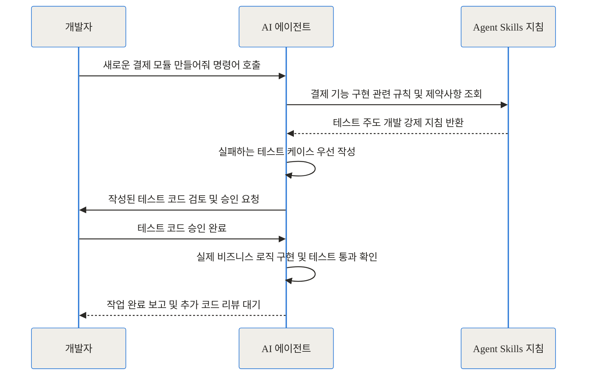
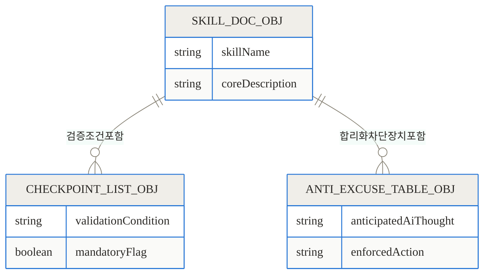
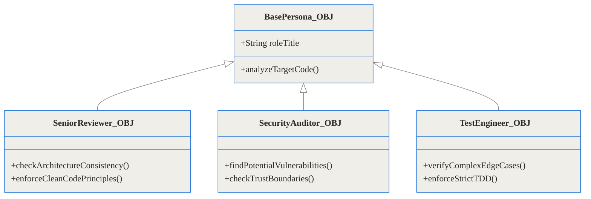
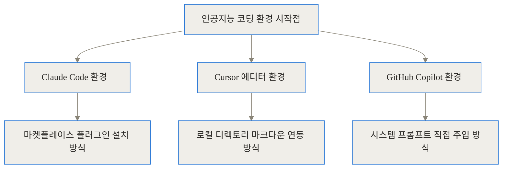
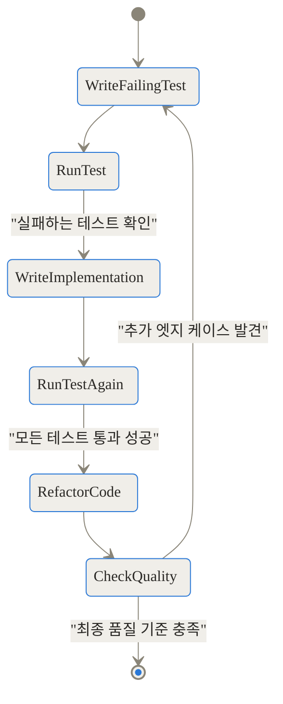
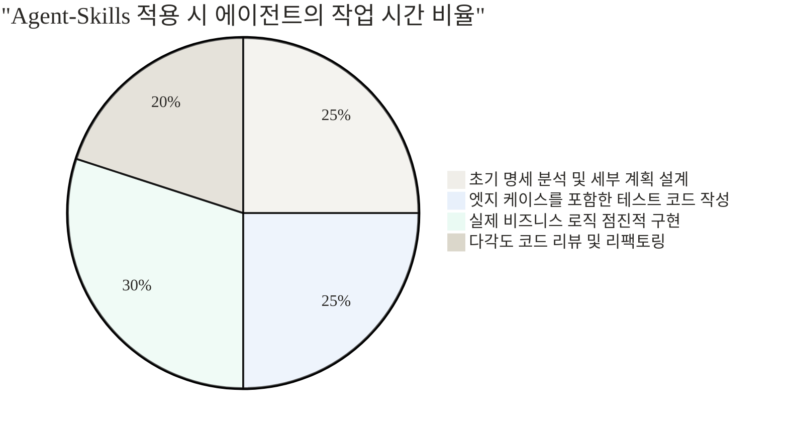

TL;DR
- agent-skills는 구글 크롬팀 리더 애디 오스마니가 만든 AI 코딩 에이전트용 프로덕션급 워크플로우 오픈소스입니다.
- AI가 설계와 테스트를 건너뛰는 문제를 해결하기 위해 시니어 개발자의 깐깐한 프로세스를 마크다운 문서로 강제합니다.
- 7가지 핵심 명령어와 안티 합리화 장치를 통해 어떤 에디터에서도 일관되고 유지보수 가능한 고품질 코드를 생산합니다.

## 도입: AI 코딩 에이전트의 치명적인 함정, 바이브 코딩

요즘 AI 코딩 도구를 사용해보면 그 생성 속도에 감탄하게 됩니다. 채팅창에 기능을 설명하면 순식간에 수백 줄의 코드를 쏟아내고, 브라우저를 열어보면 그럴싸하게 작동하죠. 최근 사람들은 이를 두고 느낌대로 빠르게 코딩한다는 뜻에서 바이브 코딩이라고 부릅니다. 기능이 눈앞에서 당장 돌아가면 성공이라고 믿고 넘어가는 개발 방식입니다.

하지만 이 바이브 코딩에는 치명적인 함정이 숨어 있습니다. AI는 본질적으로 가장 짧은 경로를 통해 작업을 완료 상태로 만들려는 경향이 있습니다. 이러한 AI의 행동 방식은 마치 의욕만 넘치는 주니어 개발자와 비슷합니다. 코드는 빠르게 짜지만, 그 이면에 반드시 존재해야 하는 보이지 않는 작업들을 전부 건너뜁니다.

요구사항 명세서를 작성하지 않고, 아키텍처에 대한 깊은 고민 없이 구현부터 시작하며, 엣지 케이스를 검증하는 테스트 코드는 완전히 생략합니다. 보안상 취약점이나 성능 저하 가능성에 대한 리뷰도 당연히 없습니다. 결과적으로 당장 눈앞에서는 작동하지만 몇 달 뒤에는 원작자조차 손댈 수 없는 거대한 레거시 코드가 탄생하게 됩니다.

> 
> 구글 크롬 팀의 엔지니어링 리더인 애디 오스마니는 바로 이 지점에 주목했습니다.

그는 시니어 개발자가 오랜 경력을 쌓으며 뼈저리게 배운 보이지 않는 엔지니어링 작업들을 AI에게 강제할 방법이 절실히 필요하다고 판단했습니다. 그렇게 탄생한 프로젝트가 바로 오늘 깊이 있게 분석해 볼 agent-skills입니다.

## agent-skills란 무엇인가?

개념부터 명확히 짚고 넘어가겠습니다. agent-skills는 새로운 AI 모델이나 복잡한 실행 프로그램이 아닙니다. 이것은 순수한 마크다운 형식의 파일들의 모음입니다. 하지만 그저 그런 평범한 문서가 아닙니다. AI 에이전트가 코드를 작성하는 매 순간 반드시 지켜야 하는 시니어 개발자의 깐깐한 프로세스와 품질 검증 기준을 완벽하게 코드화해 둔 워크플로우 지침서입니다.

이 기술의 핵심 아이디어는 튼튼한 엔지니어링 발판을 세우는 것입니다. 고층 건물을 지을 때 작업자들이 안전하게 움직일 수 있도록 임시 발판을 꼼꼼하게 설치하는 것처럼, AI가 코드를 생산할 때 함부로 지름길로 빠지지 못하도록 검증된 프로세스의 발판을 세워두는 것입니다.


## 기존 방식이 겪던 구체적인 고통

이 도구가 왜 필수적인지 이해하려면, 아무런 통제 없이 AI 에이전트를 방치했을 때 현업 프로젝트에서 구체적으로 어떤 문제들이 발생하는지 들여다볼 필요가 있습니다.

1. 테스트 부채의 누적
AI에게 코드를 짜고 테스트도 만들어달라고 지시하면, 대부분 이미 완성된 메인 코드를 바탕으로 무조건 통과하는 허수아비 테스트를 작성합니다. 구현 로직에 맞춰 억지로 짜맞춘 테스트는 향후 코드 리팩토링 시 아무런 보호막 역할을 하지 못합니다.

2. AI의 합리화와 핑계
에이전트는 종종 작업을 회피하려 듭니다. 이 코드는 너무 단순해서 테스트가 필요하지 않다거나, 우선 빠르게 구현부터 하고 코드 최적화는 나중에 별도의 작업으로 진행하겠다는 식의 그럴싸한 변명을 늘어놓으며 중요한 품질 검증 단계를 회피합니다.

3. 거대한 단일 작업과 리뷰 불가능성
복잡한 요구사항을 주면 수십 개의 파일을 한 번에 수정하려 듭니다. 사람이 논리적으로 추적하고 리뷰하기 불가능한 크기의 변경사항을 무작위로 만들어내어, 팀의 코드 리뷰 프로세스 자체를 무력화시킵니다.

agent-skills는 위에서 언급한 고질적인 문제들을 정확히 조준하여, 에이전트가 임의로 타협하지 못하도록 설계되었습니다.

## 작동 원리 심층 해부

이 프로젝트가 어떻게 AI의 행동을 근본적으로 교정하는지 그 내부 아키텍처와 원리를 깊이 파헤쳐 보겠습니다. 가장 중요한 개념은 소프트웨어 개발 생명주기를 강제하는 파이프라인과 그 파이프라인을 구동하는 마크다운 문서의 치밀한 구조입니다.

```mermaid
%%{init: {"theme":"base","themeVariables":{"primaryColor":"#F0EEE9","primaryBorderColor":"#2a78d6","primaryTextColor":"#2b2926","secondaryColor":"#e8f0fb","secondaryBorderColor":"#4a3aa7","secondaryTextColor":"#2b2926","tertiaryColor":"#eafaf3","tertiaryBorderColor":"#1baf7a","tertiaryTextColor":"#2b2926","lineColor":"#8a8578","textColor":"#2b2926","edgeLabelBackground":"#F0EEE9","noteBkgColor":"#F0EEE9","noteTextColor":"#2b2926","noteBorderColor":"#8a8578","clusterBkg":"#faf9f6","clusterBorder":"#d8d4c8","fontFamily":"Pretendard, sans-serif"}}}%%
flowchart LR
    A["요구사항 명세 설계"]
    B["세부 작업 계획 수립"]
    C["점진적 기능 구현"]
    D["엄격한 테스트 검증"]
    E["다각도 코드 리뷰"]
    F["안전한 운영 배포"]
    A --> B
    B --> C
    C --> D
    D --> E
    E --> F
```



위 다이어그램처럼 개발의 모든 단계를 명시적으로 나누고, 각 단계마다 슬래시 명령어를 통해 AI의 작업 컨텍스트를 통제합니다.

### 7가지 주요 슬래시 명령어

agent-skills는 크게 7가지의 진입점 명령어를 제공합니다. 각 명령어는 AI가 현재 어떤 맥락에서 어떤 목표를 달성해야 하는지 명확히 규정합니다.

- /spec: 코드를 짜기 전에 요구사항을 묻고 인터페이스를 명확히 정의합니다. 사용자의 모호한 아이디어를 구체적인 기획서 수준으로 끌어올립니다.
- /plan: 거대한 작업을 검증 가능한 가장 작은 단위로 쪼개어 계획 문서를 작성합니다.
- /build: 한 번에 하나씩, 철저하게 범위를 제한하여 코드를 점진적으로 작성합니다. 파일 하나를 수정할 때마다 계획서와 대조합니다.
- /test: 구현된 코드가 올바르게 작동한다는 물리적 증거를 요구합니다. 유효한 테스트 코드가 통과해야만 다음 단계로 넘어갈 수 있습니다.
- /review: 머지하기 전 보안, 성능, 유지보수성 등 다각도에서 코드를 꼼꼼히 점검합니다.
- /webperf: 웹 애플리케이션의 성능을 측정하고, 무분별한 최적화 대신 실제 병목 구간을 찾아 개선합니다.
- /code-simplify: 똑똑해 보이지만 읽기 어려운 복잡한 코드보다, 지루할 정도로 직관적이고 명확한 코드를 지향하도록 코드를 정리합니다.
- /ship: 최종적으로 안전하게 운영 환경으로 내보낼 준비를 마칩니다.



### 마크다운 스킬 문서의 데이터 모델 구조

단순한 텍스트 파일이 어떻게 AI의 자유분방한 행동을 통제할 수 있을까요? 애디 오스마니는 각 마크다운 파일을 정교한 데이터베이스 스키마처럼 체계적으로 설계했습니다.



여기서 가장 독창적이고 빛나는 부분은 바로 안티 합리화 테이블입니다. AI가 핑계를 대려는 순간을 미리 예측하고 원천적으로 차단합니다. 스킬 문서 내부에는 다음과 같은 지침이 명시적인 표 형태로 존재합니다.

- AI의 예상되는 생각: 이 변경사항은 너무 작고 단순해서 굳이 테스트를 작성할 필요가 없다.
- 강제된 행동 지침: 크기와 상관없이 반드시 테스트를 작성한다. 가장 사소해 보이는 한 줄의 변경이 프로덕션 환경에서 대형 장애를 일으키는 법이다.

이러한 강력한 안전 장치 덕분에 AI는 스스로 타협하려는 성향을 억누르고, 지루하지만 필수적인 프로세스를 끝까지 완수하게 됩니다.

## 3가지 시니어 페르소나의 다각도 검증

코드를 검증할 때 단순히 코드가 잘 짜였는지 묻는 것은 효과가 없습니다. agent-skills는 AI에게 특정한 역할을 강제로 부여하여, 철저하게 비판적인 사고를 유도합니다.



- 코드 리뷰어 페르소나: 시니어 스태프 엔지니어의 관점에서 접근합니다. 아키텍처의 일관성과 미래의 유지보수성을 감시하며, 과도하게 복잡한 디자인 패턴의 사용을 지양하고 단순성을 요구합니다.
- 테스트 엔지니어 페르소나: QA 스페셜리스트의 관점입니다. 정상적인 해피 패스뿐만 아니라 발생할 수 있는 모든 엣지 케이스와 비정상 입력 상황을 집요하게 파고들어 테스트 코드를 요구합니다.
- 보안 감사자 페르소나: 데이터 흐름의 경계를 꼼꼼히 확인하고, 외부 입력값에 대한 인젝션 취약점이나 권한 누락 같은 크리티컬한 보안 이슈를 릴리스 전에 찾아냅니다.

> 
> 오픈소스 생태계의 다양한 커뮤니티 개발자들은 이러한 다중 페르소나 기반 접근법이 실제 깐깐한 팀 동료들과 협업하는 것과 완벽히 동일한 긴장감을 제공한다고 극찬합니다.

## 구현 및 설치 디테일

이 시스템은 단일 도구에 종속되지 않으며, 놀라울 정도로 다양한 AI 코딩 환경을 지원합니다. 여러분의 작업 환경에 맞춰 유연하게 도입할 수 있습니다.



### Claude Code 환경에서의 원클릭 설치

가장 권장되며 완벽하게 연동되는 방식입니다. 터미널 환경에서 아래 명령어 두 줄을 입력하면 Anthropic 마켓플레이스를 통해 20여 개의 스킬 세트가 즉시 에이전트에 주입됩니다.

```bash
/plugin marketplace add addyosmani/agent-skills
/plugin install agent-skills@addy-agent-skills
```

### NPM CLI를 통한 범용 환경 설치

CLI 래퍼를 활용하면 단말기에서 매우 직관적으로 스킬을 관리할 수 있습니다. 70여 개 이상의 도구 환경에 호환됩니다.

```bash
# 전체 24개의 스킬을 한 번에 설치합니다.
npx skills add addyosmani/agent-skills

# 특정 스킬, 예를 들어 TDD 스킬만 개별적으로 핀셋 설치합니다.
npx skills add addyosmani/agent-skills --skill test-driven-development
```

### Cursor 및 직접 파일 연동 방식

만약 플러그인이나 npm을 사용하고 싶지 않다면 가장 원초적인 방식으로도 훌륭하게 작동합니다. GitHub 저장소를 클론한 뒤, 제공되는 마크다운 파일들을 프로젝트 최상단의 `.cursor/rules/` 디렉토리에 복사해 넣기만 하면 됩니다. 에디터는 코드를 생성할 때 이 디렉토리 안의 파일들을 시스템 프롬프트로 최우선적으로 참조하여 AI의 행동을 억제하고 교정합니다.

## 실전 활용 시나리오

### 시나리오 1: 빈틈없는 테스트 주도 개발 강제하기

새로운 결제 금액 계산 함수를 작성한다고 가정해 보겠습니다. 일반 AI에게 맡기면 화려한 구현 코드를 먼저 짜고, 그에 맞춰 대충 에러만 나지 않는 무의미한 테스트를 붙여 제출합니다.

하지만 agent-skills를 활성화하면 상황이 완전히 달라집니다.



AI는 반드시 실패하는 테스트 코드를 먼저 작성해야 합니다. 개발자가 그 실패하는 테스트 코드를 승인하기 전까지는 절대로 실제 로직을 구현하지 않습니다. 실패를 증명한 후에야 비로소 구현 코드를 작성하고, 테스트가 통과하면 안전하게 코드 리팩토링을 수행하는 엄격한 사이클을 기계적으로 반복하게 됩니다.

### 시나리오 2: 얽혀있는 레거시 코드의 안전한 리팩토링

수천 줄에 달하는 복잡한 클래스를 수정할 때, 자유도를 부여받은 AI는 종종 관련 없는 다른 파일들까지 무분별하게 건드리며 프로젝트를 통제 불능 상태에 빠뜨립니다.

이때 명령어 조합이 진가를 발휘합니다. 먼저 `/plan`을 호출하여 이 거대한 클래스를 분리하기 위한 5단계의 독립적이고 안전한 작업 계획 문서를 작성하라고 지시합니다. 사용자가 그 계획서를 읽고 타당하다고 승인하면, 그제야 `/build` 명령어를 통해 한 번에 오직 한 단계의 계획만을 수행하도록 강제합니다. 하나의 작은 변경이 완료되고 테스트로 검증되기 전까지는 절대 다음 단계의 코드를 건드리지 않습니다.

## 벤치마크와 데이터 비교

agent-skills 프로세스를 밟았을 때와 그렇지 않을 때의 차이는 결과물의 견고함에서 아주 극명하게 드러납니다.

다음은 토큰 사용량 증가율 대비 프로덕션 코드 품질 간의 트레이드오프를 보여주는 시뮬레이션 지표입니다.

```chartjs
{
  "type": "bar",
  "data": {
    "labels": ["일반 바이브 코딩 에이전트", "Agent-Skills 프로세스 적용 에이전트"],
    "datasets": [
      {
        "label": "배포 후 발견된 치명적 버그 수 (1000줄 당)",
        "data": [14, 2],
        "backgroundColor": "rgba(255, 99, 132, 0.8)"
      },
      {
        "label": "유효한 엣지 케이스 테스트 커버리지 (%)",
        "data": [15, 85],
        "backgroundColor": "rgba(54, 162, 235, 0.8)"
      }
    ]
  },
  "options": {
    "responsive": true
  }
}
```

아래 마크다운 표를 통해 구체적인 작업 방식의 차이를 한눈에 비교해 보겠습니다.

| 핵심 비교 항목 | 일반 AI 에이전트 | agent-skills 적용 AI |
|---|---|---|
| 작업 접근 방식 | 즉각적인 코드 작성과 최단 경로 추구 | 요구사항 분석 및 구조 설계 우선 진행 |
| 테스트 코드 품질 | 구현 코드 통과를 위한 형식적이고 무의미한 검증 | TDD 기반 실패 테스트 우선 작성 및 엣지 케이스 검증 |
| 소스 코드 변경 범위 | 한 번에 수십 개의 파일을 무분별하게 대규모 수정 시도 | 매우 작고 독립적인 단위로 쪼개어 단계별 안전한 수정 |
| 컨텍스트 토큰 소모량 | 상대적으로 매우 적음 (생성 속도 빠름) | 다수의 검증 과정과 사고 과정으로 인해 토큰 소모량 높음 |
| 가장 적합한 도입 상황 | 일회용 스크립트 작성, 빠른 프로토타이핑 및 아이디어 검증 | 장기적으로 유지보수해야 하는 현업 프로덕션 레벨 프로젝트 |




위 다이어그램에서 흥미로운 점은 전체 작업 시간 중 순수하게 제품 코드를 짜는 시간은 30% 남짓에 불과하다는 것입니다. 나머지 70%의 시간은 모두 시스템을 튼튼하게 만들기 위한 설계, 테스트, 그리고 검증 과정에 아낌없이 투자됩니다. 이것이 바로 시니어 개발자의 진정한 작업 비율입니다.

## 솔직한 평가: 한계점과 트레이드오프

어떤 훌륭하고 체계적인 도구라도 모든 상황에 완벽히 들어맞는 만능일 수는 없습니다. 현업에 이 기술을 전면 도입하기 전에 반드시 고려해야 할 냉정한 현실과 한계점들이 존재합니다.

1. 막대한 시간과 토큰 비용의 증가
이 워크플로우를 사용하면 AI가 스스로에게 끊임없이 질문을 던지고, 테스트를 돌리고, 긴 리뷰 문서를 작성하느라 엄청난 양의 컨텍스트 토큰을 소모하게 됩니다. 아주 간단한 파이썬 데이터 추출 스크립트 하나를 짤 때도 명세서를 쓰려고 들기 때문에, 단순 작업에서는 작업 속도가 답답할 정도로 느려질 수 있습니다.

2. 반복적인 프롬프트 응답 피로도
철저하고 깐깐한 확인 과정을 거치다 보니, AI가 개발자에게 이 테스트 코드를 지금 승인하시겠습니까, 아니면 이 계획서대로 다음 단계를 진행할까요라고 반복해서 물어보게 됩니다. 에이전트에게 전적으로 맡겨두고 쉬고 싶었던 사용자라면 모든 과정에 일일이 개입하고 승인해야 하는 피로감이 크게 다가올 수 있습니다.

3. 기반 언어 모델의 한계 종속성
agent-skills는 훌륭한 행동 규칙을 제시할 뿐, 근본적인 AI의 추론 능력 자체를 물리적으로 높여주지는 않습니다. 기반이 되는 LLM 모델의 컨텍스트 윈도우가 좁거나 논리 추론 능력이 떨어지면, 작업 중반부에 자신이 지켜야 할 규칙을 잊어버리거나 엉뚱한 결론을 내리기도 합니다. 반드시 Claude 3.5 Sonnet이나 GPT-4o 수준의 최고 성능 모델과 결합해야만 원래 의도한 시너지 효과를 온전히 얻을 수 있습니다.

## 마무리: 결국 프로세스가 산출물을 만든다

소프트웨어 공학에서 지속 가능한 고품질의 산출물은 뛰어난 천재 한 명의 번뜩이는 머리에서 나오는 것이 아니라, 누구도 쉽게 실수할 수 없도록 치밀하게 짜인 촘촘한 프로세스에서 나옵니다.

agent-skills는 AI 코딩 에이전트를 대하는 우리의 안일했던 관점을 근본적으로 바꾸어 놓습니다. 더 이상 AI를 생각 없이 코드를 빨리 짜주는 타자기 정도로 취급하지 않고, 명확한 프로세스를 지키며 일하는 진정한 엔지니어링 파트너로 대우하게 만듭니다. 

여러분이 지금 팀의 프로젝트에 AI를 적극적으로 투입하고 있다면, 그 AI에게 맹목적인 코딩 지시를 내리기 전에 애디 오스마니의 깊은 지혜가 담긴 이 튼튼한 발판을 먼저 깔아주는 것은 어떨까요? 당장의 초기 속도는 조금 느려지고 깐깐한 절차에 답답함을 느낄지 몰라도, 그 AI가 짜놓은 코드는 다가오는 주말에 여러분의 꿀 같은 단잠을 깨우지 않을 만큼 놀랍도록 견고할 것입니다.

## 자주 묻는 질문 (FAQ)

### Agent Skills는 어떤 에디터나 코딩 환경에서 사용할 수 있나요?

Claude Code, Cursor, GitHub Copilot, Gemini CLI 등 마크다운 기반의 시스템 프롬프트 지침을 온전히 이해하는 거의 모든 AI 코딩 도구에서 무리 없이 사용할 수 있습니다. 터미널 명령어를 통해 전역으로 설치하거나, 프로젝트 내부의 규칙 폴더에 파일을 직접 복사하는 방식으로 아주 쉽게 연동됩니다.

### 모든 스킬을 한 번에 다 적용해서 사용해야만 하나요?

전혀 그렇지 않습니다. 사용자의 필요와 프로젝트 성격에 맞춰 필요한 스킬만 선택적으로 적용할 수 있습니다. 예를 들어 팀 내에 테스트 코드 작성 문화 정착이 시급하다면 테스트 주도 개발 스킬만 단독으로 설치하여 사용할 수 있으며, 코드 리뷰가 고민이라면 리뷰 관련 페르소나 스킬만 추가하여 시스템을 가볍게 유지할 수 있습니다.

### 이 워크플로우를 적용하면 API 토큰 소모 비용이 크게 증가하나요?

네, 토큰 소모량은 필연적으로 크게 증가합니다. 단순한 기능 구현 외에도 요구사항 분석, 세부 설계 문서 작성, 테스트 검증, 안티 합리화 점검 등 에이전트 내부적인 사고 과정과 대화 턴이 대폭 늘어나기 때문에, 작업의 복잡도에 따라 기존 방식 대비 2배 이상의 토큰을 소모할 수도 있습니다.

### 매우 간단한 유틸리티 스크립트를 작성할 때도 Agent Skills를 써야 하나요?

개인적으로는 추천하지 않습니다. 일회성 데이터 파싱 스크립트나 매우 빠르게 버려질 프로토타입을 만들 때는 기본 AI가 제공하는 압도적인 생성 속도를 그대로 활용하는 것이 훨씬 효율적입니다. Agent Skills는 장기적으로 팀 단위에서 유지보수해야 하는 프로덕션 레벨의 소프트웨어 개발에 초점이 맞춰진 강력한 도구입니다.

### 안티 합리화(Anti-rationalization) 테이블이란 정확히 어떤 역할을 하는 장치인가요?

AI가 귀찮거나 복잡한 작업(예: 실패하는 테스트 코드 작성, 대규모 구조 리팩토링)을 교묘하게 회피하기 위해 내세우는 핑계들을 사전에 정의해 둔 장치입니다. AI가 그 핑계를 대려고 할 때마다 강제로 수행해야 할 올바른 행동 지침을 마크다운 표 형태로 짝지어 놓아, 에이전트가 프로세스를 건너뛰는 것을 원천적으로 봉쇄합니다.


## References
- [agent-skills GitHub Repository](https://github.com/addyosmani/agent-skills)
- [Addy Osmani Blog - Agent Skills](https://addyosmani.com/blog/agent-skills/)
