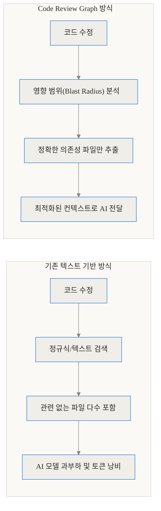
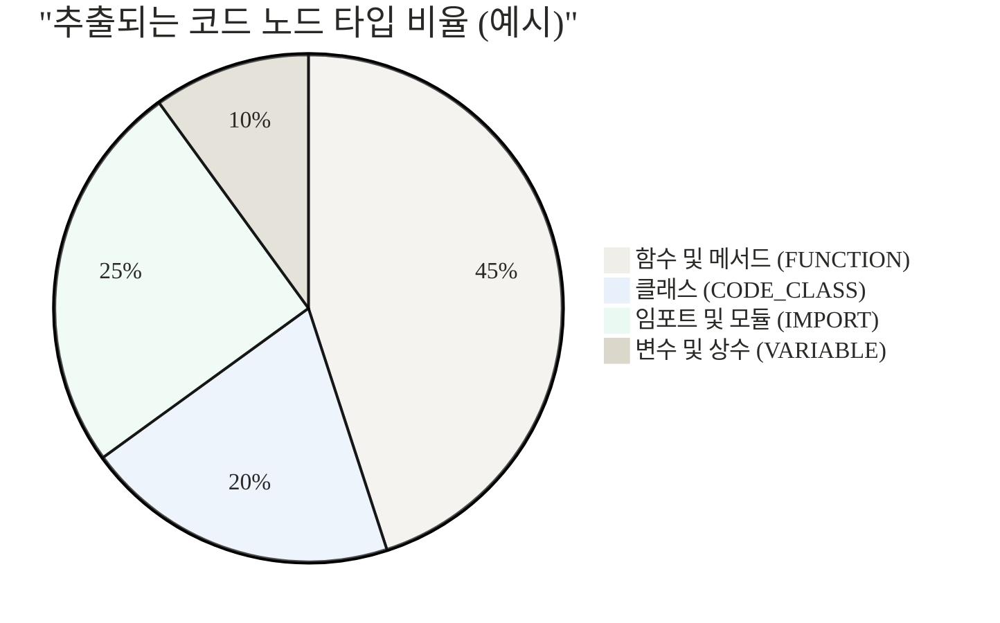
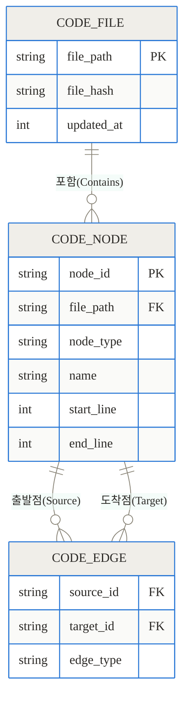
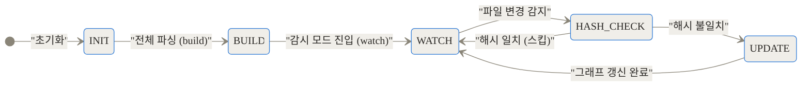
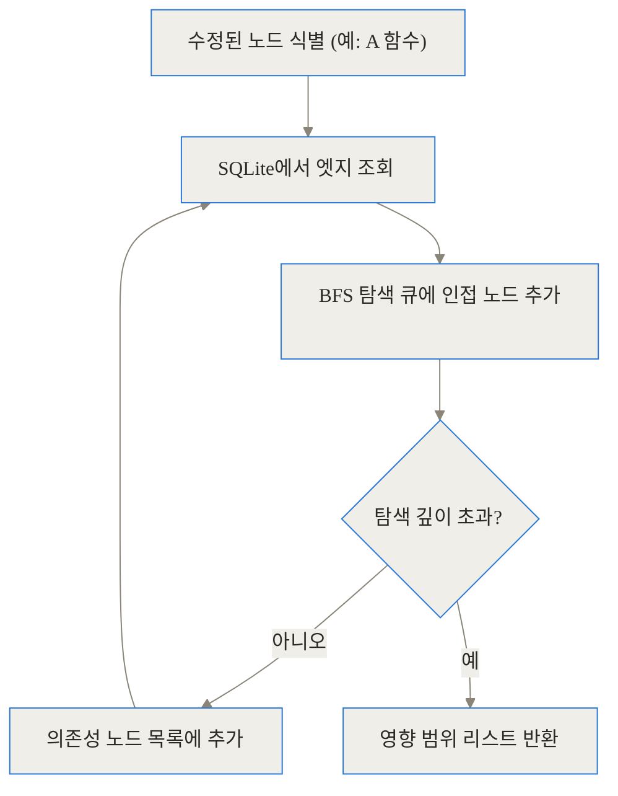
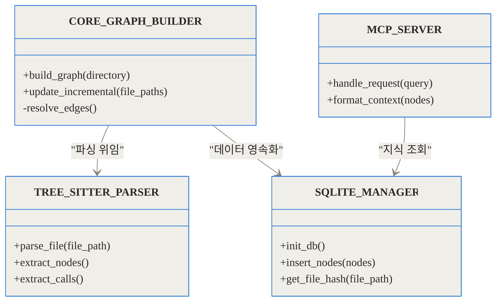
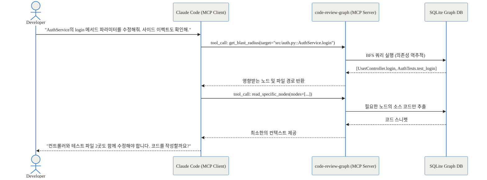

## 관련 링크 및 참고 자료

- [code-review-graph GitHub 저장소](https://github.com/tirth8205/code-review-graph)
- [PyPI 프로젝트 페이지](https://pypi.org/project/code-review-graph)
- [Model Context Protocol 공식 문서](https://modelcontextprotocol.io)

## 도입 및 TL;DR

최근 AI 기반 코딩 에이전트가 급격히 발전하고 있지만, 현업 개발자들은 여전히 큰 답답함을 호소합니다. 프로젝트 규모가 커질수록 AI가 코드의 전체적인 구조를 파악하지 못해 엉뚱한 코드를 수정하거나, 반대로 전혀 상관없는 수백 개의 파일을 읽어 들이며 막대한 토큰 비용을 발생시키기 때문입니다. 

이러한 문제를 근본적으로 해결하기 위해 등장한 오픈소스 프로젝트가 바로 **code-review-graph**입니다. 이 도구는 거대한 코드베이스를 효율적으로 처리하기 위해 고안된 구조적 메모리 계층입니다.

> **TL;DR (3줄 요약)**
> 1. code-review-graph는 트리시터(Tree-sitter)와 SQLite를 활용해 코드베이스의 함수, 클래스, 호출 관계를 영구적인 지식 그래프로 구축합니다.
> 2. 클라우드나 외부 서버 전송 없이 100% 로컬 환경에서 밀리초 단위의 증분 업데이트(Incremental Update)를 수행하여 토큰 사용량을 최대 26배까지 줄입니다.
> 3. MCP(Model Context Protocol) 1.0을 완벽하게 지원하므로 Claude Code, Cursor 등 다양한 AI 도구에서 즉시 활용할 수 있습니다.

이 글에서는 code-review-graph가 어떻게 코드의 지도를 그리고, AI 에이전트에게 꼭 필요한 정보만 제공하여 리뷰 품질과 속도를 혁신적으로 끌어올리는지 그 내부 원리를 밑바닥부터 낱낱이 파헤쳐 보겠습니다.

## 배경과 문제 정의: AI는 왜 코드를 제대로 읽지 못할까

### 컨텍스트 윈도우의 물리적 한계

AI 에이전트가 코드를 분석할 때 마주하는 가장 큰 장벽은 컨텍스트 윈도우(Context Window)의 한계입니다. 아무리 거대한 모델이라 하더라도 수만 개의 파일로 이루어진 프로젝트를 한 번에 읽어 들이는 것은 불가능에 가깝습니다. 설령 읽어 들인다고 해도 중간에 있는 중요한 정보를 잊어버리는 현상(Lost in the Middle)이 발생합니다.

### 무식한 텍스트 기반 검색의 한계

기존의 많은 AI 코딩 도구들은 RAG(검색 증강 생성) 방식을 차용하여 파일 단위의 텍스트 청크나 단순 임베딩 벡터를 활용했습니다. 사용자가 특정 함수 이름을 질문하면, 해당 텍스트가 포함된 파일들을 무작위로 가져와 프롬프트에 끼워 넣는 방식입니다.

이 방식은 치명적인 단점이 있습니다. 코드의 '의미적 연결고리'를 전혀 이해하지 못한다는 점입니다. 예를 들어 인터페이스를 수정했을 때, 그 인터페이스를 구현하는 3단계 아래의 자식 클래스가 어떤 영향을 받는지 단순 텍스트 검색으로는 추론하기 어렵습니다. 결과적으로 AI는 불필요한 파일을 읽어 들이며 노이즈를 키우고, 정작 중요한 파일은 놓쳐 잘못된 코드 리뷰나 버그를 양산하게 됩니다.

## 개념 쉽게 이해하기: 코드베이스를 도로망으로 바꾸다

code-review-graph의 접근 방식을 일상생활에 비유해 보겠습니다. 

기존 방식이 배달 기사에게 '서울시 전체의 전화번호부'를 던져주고 목적지를 찾으라고 하는 것이라면, code-review-graph는 배달 기사에게 '정밀한 내비게이션 지도'를 쥐여주는 것과 같습니다.

이 지식 그래프(코드 요소들의 관계를 지도처럼 연결해 둔 데이터 구조) 안에서 각각의 건물은 '함수'나 '클래스'가 되고, 건물과 건물을 잇는 도로는 '함수 호출'이나 '상속 관계'가 됩니다. 배달 기사(AI)는 특정 건물(수정된 함수)에 볼일이 생겼을 때, 전화번호부를 처음부터 끝까지 뒤질 필요 없이 그 건물로 연결된 도로(의존성)만 따라가면 됩니다. 이것이 바로 컨텍스트 절감의 핵심 아이디어입니다.



## 작동 원리 심층 분석 (Under the Hood)

code-review-graph가 빠르고 정확하게 동작할 수 있는 이유는 세 가지 주요 기술의 결합 덕분입니다. 트리시터(Tree-sitter)를 통한 빠르고 정확한 파싱, SQLite WAL 모드를 활용한 영구적이고 동시성 높은 로컬 저장소, 그리고 네트워크X(NetworkX)를 이용한 효율적인 그래프 탐색입니다.

### 1. 트리시터(Tree-sitter)를 이용한 AST 파싱

코드를 분석하기 위해서는 먼저 코드를 기계가 이해할 수 있는 형태인 추상 구문 트리(AST)로 변환해야 합니다. code-review-graph는 12개 이상의 언어를 지원하는 트리시터를 사용합니다. 트리시터는 코드를 단순히 줄 단위로 읽는 것이 아니라, 문법적 구조를 완벽하게 분해합니다.

파이썬 파일을 예로 들면, 모듈 레벨의 임포트 선언, 클래스 정의, 메서드 선언, 그리고 그 내부의 함수 호출까지 각각 독립적인 노드(Node)로 인식합니다.



### 2. 고유 식별자(Qualified Name)를 통한 충돌 방지

수천 개의 파일이 있는 프로젝트에서는 동일한 이름의 함수나 클래스가 존재하기 마련입니다. 이를 그래프에 그대로 저장하면 노드가 충돌하여 엉뚱한 의존성이 생길 수 있습니다. 

이를 해결하기 위해 code-review-graph는 정규화된 이름(Qualified Name) 전략을 사용합니다. 예를 들어 `auth.py` 안의 `AuthService` 클래스 내에 있는 `login` 메서드는 `src/auth.py::AuthService.login`이라는 고유한 문자열로 식별됩니다. 이로 인해 스코프 해석 문제 없이 각 노드의 신원을 명확히 보장합니다.

### 3. 데이터베이스 스키마와 물리적 저장소

추출된 모든 정보는 단일 SQLite 파일(`.code-review-graph/graph.db`)에 저장됩니다. 외부 클라우드나 무거운 그래프 데이터베이스(Neo4j 등)를 띄울 필요 없이, 프로젝트 디렉터리 안에 로컬 파일 하나로 관리됩니다.

SQLite는 WAL(Write-Ahead Logging) 모드로 설정되어 있어, 백그라운드에서 그래프를 업데이트하는 동안에도 AI 에이전트가 데이터베이스를 읽을 수 있도록 완벽한 동시성을 제공합니다.



이러한 관계형 구조 덕분에 특정 함수가 어디서 정의되었고, 어떤 함수들을 호출하고 있는지 SQL 쿼리 한 번으로 빠르게 가져올 수 있습니다.

### 4. 증분 업데이트 (Incremental Update)

전체 코드베이스를 매번 다시 파싱하는 것은 엄청난 낭비입니다. code-review-graph는 각 파일의 SHA-256 해시를 계산하여 데이터베이스에 저장해 둡니다. 사용자가 파일을 수정하고 저장하면, 도구는 전체 파일의 해시를 비교하여 '실제로 내용이 변경된 파일'만 정확히 골라냅니다.

해시가 동일한 파일은 트리시터 파싱을 완전히 건너뜁니다. 이 메커니즘 덕분에 수만 개의 파일이 있는 프로젝트라도, 단일 파일 수정 시 200ms(0.2초) 이내에 그래프 업데이트가 완료됩니다.



### 5. 영향 범위(Blast Radius) 분석 알고리즘

그래프가 완성되면, 이를 활용해 변경된 코드의 파급 효과를 분석할 수 있습니다. 내부적으로는 네트워크X(NetworkX) 라이브러리를 사용하여 너비 우선 탐색(BFS)을 수행합니다.

예를 들어 A 함수를 수정했다면, A 함수를 호출하는 B 함수, B 함수를 상속받은 C 클래스 등을 역추적합니다. 



이 분석을 통해 AI는 '내가 수정한 이 함수 때문에 다른 모듈의 테스트가 깨질 수 있겠구나'라는 사실을 사람처럼 인지하게 됩니다.

## 아키텍처 및 내부 모듈 구조

파이썬으로 작성된 code-review-graph는 높은 유지보수성을 위해 각 역할이 명확히 분리된 객체 지향 구조를 가집니다.



위 다이어그램에서 볼 수 있듯, 핵심 빌더는 언어 종속적인 파서를 추상화하여 사용하고, 저장소 매니저를 통해 데이터를 관리합니다. MCP 서버 계층은 이 저장소에 안전하게 접근하여 외부 AI 툴의 요청에 응답합니다.

## 벤치마크 및 성능 평가

이러한 구조적 접근은 실제 숫자로 그 가치를 증명합니다. 단순한 텍스트 기반 RAG나 전체 파일을 컨텍스트에 쑤셔 넣는 방식과 비교했을 때 압도적인 효율성을 보여줍니다.

### 토큰 절감량 비교

아래 차트는 실제 상용 오픈소스 저장소에서 동일한 코드 리뷰 작업을 수행할 때 소모되는 토큰 수를 배수(Multiplier)로 나타낸 것입니다. 숫자가 클수록 기존 방식 대비 토큰을 많이 절감했다는 의미입니다.

```chartjs
{
  "type": "bar",
  "data": {
    "labels": ["httpx (125 files)", "FastAPI (2,915 files)", "Next.js (27,732 files) - Review", "Next.js (27,732 files) - Live Coding"],
    "datasets": [
      {
        "label": "토큰 절감 비율 (기존 방식 대비 N배 절감)",
        "data": [26.2, 8.1, 6.0, 49.0],
        "backgroundColor": ["rgba(54, 162, 235, 0.6)", "rgba(75, 192, 192, 0.6)", "rgba(255, 206, 86, 0.6)", "rgba(153, 102, 255, 0.6)"]
      }
    ]
  },
  "options": {
    "responsive": true
  }
}
```

Next.js와 같은 거대한 리포지토리에서 라이브 코딩 태스크를 수행할 때 토큰 사용량을 무려 49배나 줄일 수 있습니다. 이는 AI API 호출 비용을 98% 이상 절감한다는 것을 의미하며, 동시에 AI의 응답 속도(Time to First Token)를 비약적으로 단축시킵니다.

### 리뷰 품질 점수 비교

토큰만 줄인 것이 아니라 결과물의 질도 향상됩니다. 상황에 맞지 않는 노이즈가 제거되었기 때문입니다.

```chartjs
{
  "type": "bar",
  "data": {
    "labels": ["기존 방식 (전체 컨텍스트 주입)", "code-review-graph 적용"],
    "datasets": [
      {
        "label": "코드 리뷰 품질 점수 (10점 만점)",
        "data": [7.2, 8.8],
        "backgroundColor": ["rgba(201, 203, 207, 0.6)", "rgba(255, 99, 132, 0.6)"]
      }
    ]
  },
  "options": {
    "scales": {
      "y": {
        "min": 0,
        "max": 10
      }
    }
  }
}
```

## 구현 및 사용 디테일

code-review-graph는 개발자의 일상적인 워크플로우를 방해하지 않도록 설계되었습니다. 설치부터 실제 활용까지의 과정을 살펴보겠습니다.

### 1. 설치와 초기화

파이썬 환경이 구축되어 있다면 단 세 줄의 명령어로 모든 준비가 끝납니다.

```bash
# 1. 패키지 설치
pip install code-review-graph
# (또는 격리된 환경을 위해 pipx 권장: pipx install code-review-graph)

# 2. MCP 환경 구성 (Cursor, Claude Code 등 자동 감지)
code-review-graph install

# 3. 프로젝트 그래프 빌드 (프로젝트 루트 디렉터리에서 실행)
code-review-graph build
```

`build` 명령을 실행하면 프로젝트 내의 파일들을 순회하며 SQLite 데이터베이스를 생성합니다.

### 2. 백그라운드 동기화 (Watch 모드)

그래프를 한 번 만들고 끝나는 것이 아니라, 개발 중인 코드가 실시간으로 반영되어야 합니다.

```bash
code-review-graph watch
```

이 명령을 백그라운드에 띄워두면, 파일이 저장될 때마다 파일 시스템 이벤트를 감지하여 밀리초 단위로 데이터베이스를 갱신합니다. 에디터에서 코드를 수정하고 곧바로 AI에게 질문해도 최신 상태의 문맥을 기반으로 답변합니다.

### 3. 주요 명령어 요약

| 명령어 | 설명 | 비고 |
|---|---|---|
| `build` | 전체 리포지토리를 스캔하여 그래프 DB를 초기화합니다. | 처음 한 번만 실행 |
| `update` | 변경된 파일만 해시 비교를 통해 증분 업데이트합니다. | 수동 동기화 시 사용 |
| `watch` | 파일 시스템을 실시간으로 감시하며 자동 업데이트합니다. | 터미널 탭에 띄워두기 권장 |
| `status` | 현재 그래프 DB의 상태(노드 수, 엣지 수, 파일 수)를 출력합니다. | 헬스 체크용 |
| `visualize` | 현재의 코드 구조를 로컬 웹 브라우저에서 HTML/JS 다이어그램으로 렌더링합니다. | 아키텍처 파악에 유용 |

## 실전 활용 시나리오: MCP와의 상호작용

가장 강력한 기능은 Model Context Protocol(MCP)을 통한 AI 에이전트와의 직접 연동입니다. Claude Code나 Cursor 같은 에디터는 MCP를 통해 외부 도구의 기능을 자신의 내장 함수처럼 호출할 수 있습니다.

실제 개발 중 인터페이스를 변경했을 때 일어나는 상호작용 흐름을 살펴보겠습니다.



위 다이어그램처럼 AI는 전체 프로젝트 파일을 읽지 않고, 오직 `code-review-graph`가 제공하는 정밀한 분석 결과와 최소한의 코드 스니펫만을 사용하여 완벽한 추론을 해냅니다.

## 기존 방식과의 트레이드오프 및 한계

기술에는 완벽함이 없습니다. code-review-graph 역시 도입하기 전 고려해야 할 트레이드오프가 존재합니다.

| 비교 항목 | 기존 RAG (임베딩+벡터DB) | code-review-graph (구조적 맵핑) |
|---|---|---|
| **컨텍스트 정확도** | 낮음 (단순 텍스트 유사도 기반) | **매우 높음 (실제 호출/상속 관계 기반)** |
| **업데이트 속도** | 느림 (전체 재임베딩 필요 시) | **매우 빠름 (해시 기반 증분 업데이트)** |
| **운영 비용** | 높음 (벡터 DB 유지 및 외부 API 통신) | **무료/낮음 (로컬 SQLite 사용)** |
| **지원 언어 제약** | 제한 없음 (모든 텍스트 처리 가능) | **트리시터 파서가 지원하는 언어만 가능** |
| **비정형 문서 이해도** | 높음 (마크다운, PDF 등 문서 처리에 강함) | 낮음 (순수 소스 코드 분석에 특화) |

### 솔직한 평가와 한계점

가장 명확한 한계는 **지원 언어의 제약**입니다. 현재 Python, TypeScript, JavaScript, Go, Rust, Java, C#, Ruby, Kotlin, Swift, PHP, C/C++ 등 12개 주요 언어를 지원하지만, 이 외의 마이너한 언어나 특수한 템플릿 언어(예: 엑셀 매크로, 특정 사내 DSL)는 파싱하지 못합니다. AST를 추출할 수 없으면 그래프를 그릴 수 없기 때문입니다.

또한, **문서화 파일 처리의 약점**이 있습니다. 코드와 강하게 결합된 마크다운 문서나 기획서를 연결하는 기능은 부족합니다. 만약 순수 코드 아키텍처보다 '다양한 포맷의 문서와 코드의 혼합'이 중요한 프로젝트라면 다른 도구(예: Graphify)를 병행해서 사용하는 것을 고민해 보아야 합니다.

## 마무리

AI가 개발자를 대체할 것이라는 자극적인 전망이 난무하지만, 현업에서 느끼는 AI는 여전히 잦은 환각(Hallucination)과 맥락 상실을 겪는 불완전한 조수에 가깝습니다. 그 원인의 대부분은 AI 모델 자체의 지능 부족이 아니라, **우리가 AI에게 정보를 떠먹여 주는 방식이 너무 원시적이었기 때문**입니다.

`code-review-graph`는 이 문제를 근본적인 아키텍처 차원에서 풀어냈습니다. 코드를 텍스트의 나열이 아닌 '논리적인 유기체'로 바라보고, 이를 구조화하여 AI의 뇌에 직접 꽂아주는 이 접근법은 매우 실용적이며 경제적입니다. 더 이상 AI가 수만 줄의 코드를 무의미하게 읽느라 시간을 낭비하게 두지 마십시오. 로컬 환경에 작고 똑똑한 지식 그래프를 구축하는 것만으로도, 여러분의 AI 코딩 에이전트는 한 차원 높은 수준의 통찰력을 발휘하게 될 것입니다.

## 자주 묻는 질문 (FAQ)

### AI 분석 시 토큰을 구체적으로 얼마나 절감할 수 있나요?

프로젝트 규모에 따라 다르지만, 벤치마크 결과에 따르면 평균적으로 기존 방식 대비 토큰 사용량을 크게 줄입니다. 예를 들어 2,900여 개의 파일이 있는 FastAPI 프로젝트에서는 8.1배, 약 2만 7천 개의 파일이 있는 Next.js 프로젝트에서는 리뷰 작업 시 6배, 라이브 코딩 태스크에서는 최대 49배까지 토큰을 절감했습니다.

### 로컬에서 동작한다고 했는데, 내 코드가 외부 서버로 전송되지 않나요?

네, 절대 전송되지 않습니다. code-review-graph는 클라우드 연결이나 텔레메트리(사용자 데이터 수집) 로직이 전혀 없습니다. 모든 파싱과 그래프 구축은 사용자 PC 내부의 로컬 SQLite 데이터베이스에만 저장되므로 기업의 보안 가이드라인을 완벽하게 준수합니다.

### MCP를 지원하지 않는 구형 에디터나 IDE에서도 사용할 수 있나요?

MCP(Model Context Protocol)를 기본으로 활용하도록 설계되었으나, CLI(명령줄 인터페이스) 도구를 독립적으로 제공합니다. 따라서 에디터 연동 없이도 터미널에서 명령어를 실행해 코드의 구조를 분석하거나 영향 범위(Blast Radius)를 파악할 수 있으며, HTML 시각화 기능도 사용할 수 있습니다.

### 파일을 하나만 수정해도 수만 개의 코드를 전부 다시 분석해야 하나요?

아닙니다. 모든 파일의 SHA-256 해시값을 기록해 두고 있어, 변경이 일어난 파일과 그에 의존하는 일부 관련 노드만 선별적으로 다시 파싱합니다. 이 증분 업데이트(Incremental Update) 기술 덕분에 파일 수정 시 전체 그래프 갱신에 걸리는 시간은 보통 200ms 이하로 매우 빠릅니다.

### 이 도구가 지원하는 프로그래밍 언어는 어떤 것들이 있나요?

현재 트리시터(Tree-sitter) 파서를 통해 총 12개의 언어를 공식 지원합니다. Python, TypeScript, JavaScript, Go, Rust, Java, C#, Ruby, Kotlin, Swift, PHP, C/C++ 프로젝트에서 AST를 추출하여 지식 그래프를 구성할 수 있습니다.


## References
- [https://github.com/tirth8205/code-review-graph](https://github.com/tirth8205/code-review-graph)
- [https://pypi.org/project/code-review-graph/](https://pypi.org/project/code-review-graph/)
