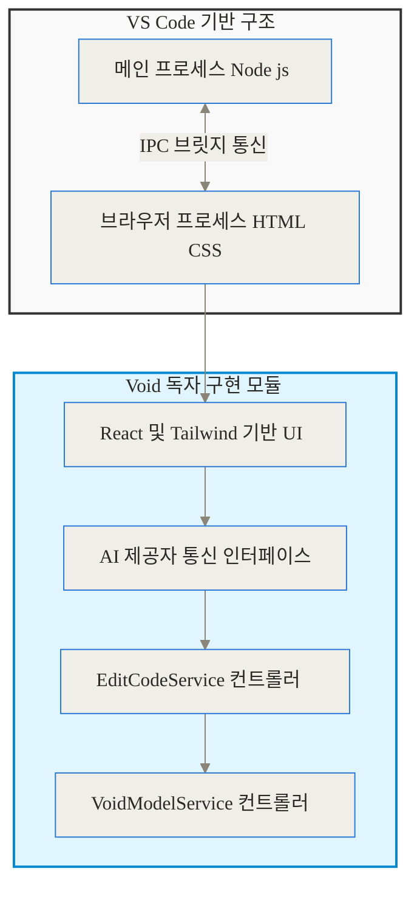
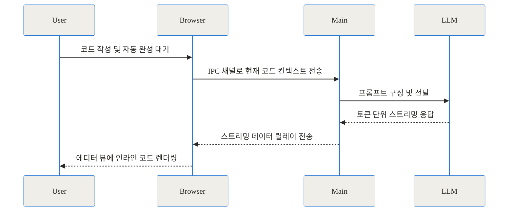
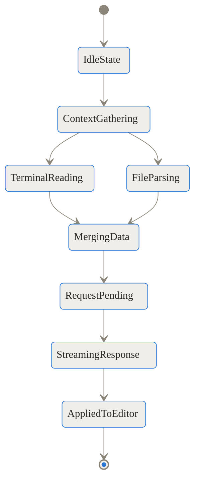
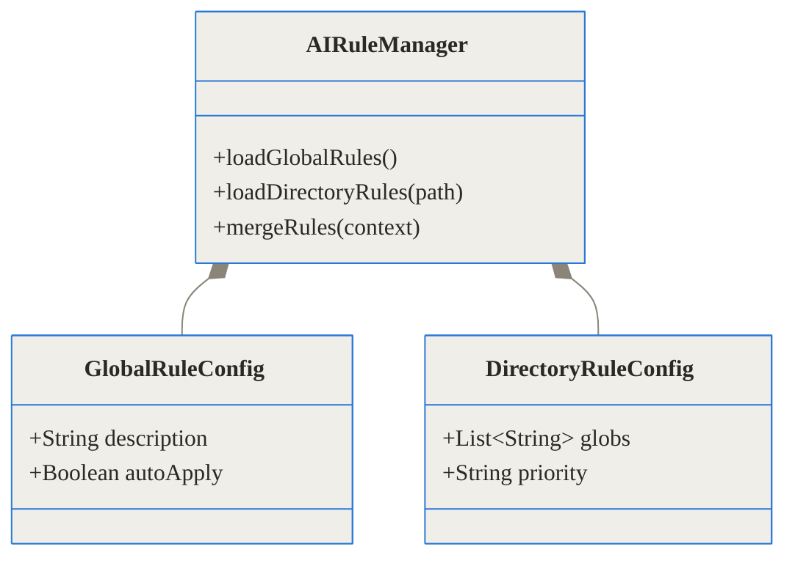
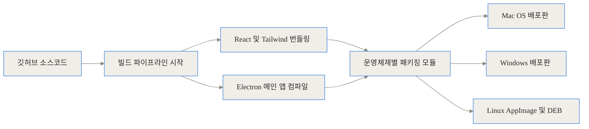

TL;DR
- 외부 서버에 내 코드를 전송하지 않고 로컬 환경에서 완벽히 통제할 수 있는 오픈소스 AI 코드 에디터입니다.
- VS Code를 포크하여 React와 Tailwind를 브라우저 프로세스에 결합하는 독창적인 아키텍처를 적용했습니다.
- 특정 기업에 종속되지 않고, Ollama나 커스텀 API를 통해 원하는 언어 모델을 자유롭게 연결할 수 있습니다.

## 개발자를 괴롭히던 문제: 왜 새로운 AI 코드 에디터가 필요한가

최근 몇 년간 개발자들의 생산성은 크게 향상되었습니다. 코드를 자동 완성해 주고 복잡한 오류의 원인을 찾아주는 AI 도구 덕분입니다. 하지만 현업에서 이러한 상용 도구를 적극적으로 도입할 때 가장 먼저 부딪히는 커다란 장벽이 존재합니다. 바로 보안 및 프라이버시 문제, 그리고 특정 서비스에 대한 벤더 종속성입니다.

대부분의 상용 AI 코딩 도구는 개발자가 작성한 소스 코드를 외부 클라우드 서버로 끊임없이 전송하여 분석합니다. 기업의 핵심 자산이자 경쟁력인 소스 코드가 외부에 상시 노출된다는 것은 심각한 보안 위협이 될 수 있습니다. 특히 보안 규정이 엄격한 금융권이나 국방, 의료 분야에서는 이러한 상용 클라우드 기반 AI 에디터의 도입 자체가 원천적으로 차단되기도 합니다. 

또한, 특정 기업의 모델과 과금 체계에 한 번 묶이게 되면, 서비스 제공자의 정책이 바뀌거나 구독료가 인상되었을 때 유연하게 다른 대안으로 넘어가기 어렵습니다. 이러한 개발자들의 현실적인 고통과 제약을 해결하기 위해 등장한 것이 바로 Void 프로젝트입니다. 코드를 외부로 단 한 줄도 보내지 않으면서도 강력한 AI 어시스턴트 기능을 유지하고, 사용자가 원하는 언어 모델을 자유롭게 선택할 수 있는 완전한 오픈소스 환경을 제공하는 데 집중하고 있습니다.

## Void란 무엇인가: 내 컴퓨터 안의 전담 코드 정비사

Void를 가장 직관적인 일상 비유로 설명하자면, 자동차를 고치기 위해 멀리 있는 브랜드 공식 정비소에 차를 통째로 맡기는 대신, 내 집 차고 안에 최고급 공구함과 나만의 전담 정비사를 두는 것과 같습니다. 상용 도구가 내 코드를 밖으로 가지고 나가서 수정한 뒤 가져오는 방식이라면, Void는 내 컴퓨터라는 완전히 안전한 울타리 안에서 모든 코드 분석과 수정을 처리합니다.

구체적으로 Void는 전 세계에서 가장 널리 쓰이는 오픈소스 에디터인 VS Code를 기반으로 만들어졌습니다. 개발자는 이미 익숙한 단축키, 테마, 확장 프로그램 생태계를 그대로 활용할 수 있으며, 그 내부에 자연스럽게 녹아든 AI 에이전트 모드, 채팅, 자동 완성(FIM, Fill-In-the-Middle) 기능을 경험할 수 있습니다. 가장 중요한 차별점은 이 모든 기능이 100% 오픈소스로 공개되어 있으며, 사용자가 자신의 데이터를 온전히 통제한다는 것입니다.

## Void의 독창적인 아키텍처: VS Code 위에 React를 올리다

Void의 가장 흥미로운 기술적 성취 중 하나는 바로 내부 아키텍처입니다. 일반적인 VS Code 확장 프로그램은 기능 구현에 많은 제약이 따릅니다. 에디터의 고유한 사용자 인터페이스를 마음대로 변경하거나, 코드 입력 스트림을 토큰 단위로 세밀하게 제어하는 것은 확장 프로그램이 갇혀 있는 샌드박스 환경에서는 불가능에 가깝습니다.

Void 팀은 이러한 한계를 극복하기 위해 단순히 확장 프로그램을 만드는 대신, VS Code 자체를 포크(Fork)하여 근본적인 구조를 수정하고 완전히 새로운 사용자 경험을 덧입혔습니다.



VS Code는 근본적으로 Electron 기반의 애플리케이션으로, 파일 시스템과 운영체제 자원을 관리하는 메인 프로세스와 화면의 UI를 그리는 브라우저 프로세스로 철저히 나뉘어 동작합니다. Void는 바로 이 브라우저 프로세스 내부에 현대적인 웹 프레임워크인 React와 스타일링 도구인 Tailwind를 직접 마운트하는 과감한 시도를 했습니다. 이를 통해 기존 VS Code 확장 프로그램에서는 상상할 수 없었던 미려하고 반응성 높은 채팅 인터페이스와 부드러운 인라인 코드 수정 UI를 성공적으로 구현해 냈습니다.

### 데이터 흐름과 프로세스 간 통신 (IPC)

VS Code의 브라우저 환경에서는 보안 및 아키텍처상의 이유로 외부 라이브러리인 `node_modules`를 직접 임포트하여 사용할 수 없습니다. 따라서 Void는 AI 언어 모델로 복잡한 네트워크 요청을 보내거나 무거운 연산을 수행하는 작업을 백그라운드의 메인 프로세스에 위임하고, 프로세스 간 통신(IPC) 채널을 구축하여 결과를 실시간으로 주고받는 구조를 택했습니다.



이러한 구조 덕분에 사용자는 에디터가 버벅거리는 느낌 없이 부드럽게 코드가 작성되는 것을 볼 수 있으며, 에디터의 메인 UI 스레드가 블로킹되지 않고 최적의 성능을 유지할 수 있습니다.

## 핵심 기능 분석: 토큰 단위의 세밀한 렌더링

Void의 진가는 내부적으로 구현된 `EditCodeService`와 `VoidModelService`라는 독자적인 서비스 컨트롤러에서 극명하게 드러납니다.

### EditCodeService: 살아 숨쉬는 코드 렌더링
일반적으로 구조가 단순한 AI 확장 프로그램들은 모델로부터 완성된 텍스트 덩어리를 한 번에 받아와서 에디터의 특정 영역을 통째로 교체합니다. 그러나 Void의 `EditCodeService`는 AI가 생성하고 있는 코드를 실시간 토큰 단위의 스트림으로 받아와 화면에 점진적으로 렌더링합니다. 이것은 마치 내 옆에 앉은 동료 시니어 개발자가 내 모니터를 보며 키보드를 직접 타이핑하는 것처럼 생동감 있게 코드 변경(Diff) 과정을 눈으로 쫓아갈 수 있게 해줍니다.

### 상태 및 생명주기 관리와 터미널 통합
터미널의 출력값이나 현재 편집 중인 여러 파일의 컨텍스트를 AI에게 정확히 전달하기 위해, Void는 매우 정교한 내부 상태 관리 파이프라인을 운영합니다.



특히 주목할 만한 기능은 터미널 통합 기능입니다. 코딩 중 빌드 에러가 발생했을 때, 에러 로그를 마우스로 직접 복사할 필요가 없습니다. 채팅창에서 특수 명령어인 `@terminal`을 입력하면 Void가 백그라운드에서 실행 중인 터미널의 상태를 읽어옵니다. 이때 매우 긴 터미널 로그로 인해 발생할 수 있는 메모리 부족(OOM) 현상을 방지하기 위해, 터미널 버퍼를 최신 로그부터 역순으로 영리하게 읽어오는 `xterm.getBufferReverseIterator()` 전략을 채택하여 퍼포먼스를 극대화했습니다.

## 디렉터리 기반의 지능형 AI 규칙 시스템

단순히 코드를 자동 완성해 주는 것을 넘어, Void가 진정한 에이전트로 동작하게 만드는 핵심 요소는 고도화된 AI 규칙(AI Rules) 시스템입니다. 프로젝트 규모가 커지면 하나의 설정 파일에 모든 코딩 컨벤션을 적어두는 방식은 금세 한계에 부딪힙니다.



Void는 특정 폴더마다 다르게 적용되는 세밀한 규칙 시스템을 지원합니다. 예를 들어 프론트엔드 폴더 내부에서는 React 컴포넌트의 훅(Hook) 사용 규칙을, 백엔드 폴더에서는 데이터베이스 ORM 쿼리 작성 규칙을 분리하여 마크다운 파일로 관리할 수 있습니다. AI가 코드를 생성하기 직전, `AIRuleManager`가 현재 열려 있는 파일의 경로를 분석하여 해당 스코프에 맞는 규칙들만 병합한 뒤 프롬프트에 주입합니다. 이는 AI가 현재 작업 맥락에 전혀 맞지 않는 엉뚱한 패턴의 코드를 작성하는 것을 원천적으로 차단합니다.

## 데이터 모델의 구조적 이해

Void가 에디터 화면의 수많은 정보와 사용자의 규칙을 어떻게 하나로 묶어 AI에게 전달하는지 데이터 모델의 관계로 살펴보면 다음과 같습니다.

```mermaid
%%{init: {"theme":"base","themeVariables":{"primaryColor":"#F0EEE9","primaryBorderColor":"#2a78d6","primaryTextColor":"#2b2926","secondaryColor":"#e8f0fb","secondaryBorderColor":"#4a3aa7","secondaryTextColor":"#2b2926","tertiaryColor":"#eafaf3","tertiaryBorderColor":"#1baf7a","tertiaryTextColor":"#2b2926","lineColor":"#8a8578","textColor":"#2b2926","edgeLabelBackground":"#F0EEE9","noteBkgColor":"#F0EEE9","noteTextColor":"#2b2926","noteBorderColor":"#8a8578","clusterBkg":"#faf9f6","clusterBorder":"#d8d4c8","fontFamily":"Pretendard, sans-serif"}}}%%
erDiagram
    WORKSPACE_INSTANCE ||--o{ EDITOR_INSTANCE : contains
    EDITOR_INSTANCE ||--o{ MODEL_DOCUMENT : displays
    WORKSPACE_INSTANCE ||--o{ AI_RULE_CONFIG : enforces
    MODEL_DOCUMENT {
        string URI
        string textBuffer
    }
    AI_RULE_CONFIG {
        string scope
        string instructions
    }
    AI_CONTEXT_DATA ||--o| MODEL_DOCUMENT : references
    AI_CONTEXT_DATA ||--o{ AI_RULE_CONFIG : includes
    AI_CONTEXT_DATA {
        string terminalOutput
        string selectedText
    }
```



개발자가 에디터에서 파일을 열면 `MODEL_DOCUMENT` 인스턴스가 생성됩니다. Void는 프로젝트 전반에 선언된 `AI_RULE_CONFIG`와 사용자가 선택한 텍스트, 그리고 터미널의 출력을 모두 모아 거대한 `AI_CONTEXT_DATA`를 조립해 냅니다. 이 구조화된 컨텍스트 덕분에 모델은 현재 프로젝트의 상태를 입체적으로 이해할 수 있습니다.

## 기존 상용 에디터와의 비교 및 벤치마크

왜 수많은 개발자들이 익숙한 상용 도구를 두고 초기 설정이 필요한 오픈소스 프로젝트로 시선을 돌리는 것일까요? 벤치마크 및 비교 수치를 보면 그 명확한 이유를 알 수 있습니다.

특히 유지 비용 측면에서의 트레이드오프가 극적입니다. 기업 단위로 수십 명의 개발자가 매월 상용 AI 도구를 구독하는 비용은 무시할 수 없는 수준입니다. 반면 Void와 로컬 모델(Ollama 등)을 결합하면 라이선스 비용이 전혀 발생하지 않습니다.

```chartjs
{
  "type": "bar",
  "data": {
    "labels": ["기존 방식 상용 도구 구독", "Void 에디터 및 로컬 모델"],
    "datasets": [
      {
        "label": "개발자 1인 기준 연간 예상 라이선스 비용 단위 달러",
        "data": [240, 0],
        "backgroundColor": ["#ef4444", "#10b981"]
      }
    ]
  },
  "options": {
    "responsive": true
  }
}
```

주요 스펙과 특성을 비교하면 다음과 같습니다.

| 비교 항목 | 기존 상용 에디터 | Void 에디터 |
| :--- | :--- | :--- |
| **코드 프라이버시 수준** | 기업 서버로 상시 전송 | 100% 로컬 처리 가능 (유출 차단) |
| **언어 모델 선택권** | 서비스 제공자가 강제한 모델 | 자유로운 연결 (로컬 및 클라우드 API) |
| **운영 비용 구조** | 인당 고정적인 월 구독료 | 전면 무료 (API 사용 시 해당 사용량만) |
| **투명성 및 오픈소스** | 블랙박스 형태의 독점 소프트웨어 | 투명한 Apache 2.0 라이선스 기반 |
| **오프라인 동작 여부** | 인터넷 연결 필수 | 로컬 모델 사용 시 완벽한 오프라인 동작 |

## 실전 활용 시나리오

실제 현업의 다양한 상황에서 Void를 어떻게 효과적으로 활용할 수 있는지 구체적인 시나리오를 제시합니다.

### 1. 보안이 철저히 통제된 금융권 폐쇄망에서의 개발
보안 규정상 외부 인터넷 접속이 전면 차단된 사내망 환경에서는 일반적인 클라우드 기반 AI 에디터를 전혀 사용할 수 없습니다. 이때 사내 서버에 Ollama와 강력한 오픈소스 모델인 Llama 3를 띄우고, 각 개발자의 PC에 Void를 설치하여 내부망 API로 연결합니다. 소스 코드가 사내 네트워크를 1바이트도 벗어나지 않으면서도, 개발자는 실시간 코드 리뷰와 자동 완성을 쾌적하게 누릴 수 있습니다.

### 2. 복잡한 빌드 에러의 즉각적인 트러블슈팅
대규모 프로젝트를 빌드하다가 이해하기 어려운 수십 줄의 스택 트레이스 에러가 쏟아졌습니다. 기존 방식이라면 터미널 창을 스크롤하여 에러를 복사하고, 브라우저를 열어 AI 챗봇에게 컨텍스트를 설명해야 합니다. 하지만 Void에서는 에디터 내부 채팅창에 `@terminal`을 입력해 에러가 발생한 터미널 인스턴스를 지정하고, "이 에러 로그를 기반으로 현재 열려있는 설정 파일에서 잘못된 부분을 찾아 인라인으로 고쳐줘"라고 지시하기만 하면 됩니다.

### 3. 멀티 플랫폼 및 CI/CD 환경에서의 빌드
자신만의 특별한 AI 에디터를 만들고 싶은 조직이라면 Void의 빌드 파이프라인을 그대로 활용할 수 있습니다. Void 팀이 구성해 둔 GitHub Actions 워크플로우를 참조하면 커스텀 빌드가 매우 용이합니다.



## 냉정하게 바라본 솔직한 평가와 한계점

아무리 뛰어난 철학을 가진 기술이라도 모든 상황에 완벽하게 들어맞을 수는 없습니다. 현업에 도입하기 전에 반드시 고려해야 할 명확한 트레이드오프가 존재합니다.

1. **초기 인프라 설정의 허들**
   상용 도구들은 설치 후 이메일 로그인 한 번이면 모든 준비가 끝납니다. 반면, Void를 완전한 프라이버시 모드로 사용하려면 사용자가 직접 Ollama를 설치하거나 GPU 환경을 구성해야 하며, 클라우드 API를 쓰더라도 각 벤더의 사이트에서 API 키를 발급받아 환경 변수에 등록해야 합니다. 인프라 설정에 익숙하지 않은 개발자나 학생에게는 진입 장벽이 다소 높게 느껴질 수 있습니다.

2. **공식 생태계 동기화 기능의 부재**
   Void는 VS Code의 기본 확장 프로그램들을 충실히 지원하지만, 프로젝트 자체가 독립적으로 포크된 버전이기 때문에 Microsoft가 제공하는 공식 계정 기반의 동기화(Settings Sync) 기능 등 특정 독점 서비스와는 매끄럽게 연동되지 않을 수 있습니다. 현재 오픈소스 커뮤니티 내부에서 자체적인 백엔드 동기화 기능을 구현하자는 논의가 활발히 진행 중입니다.

3. **로컬 소형 모델의 추론 능력 한계**
   데이터 보호를 위해 완벽히 로컬 소형 모델(sLLM)만 사용할 경우, 복잡한 비즈니스 로직을 설계할 때 현존 최고 수준의 거대 상용 모델 성능에 미치지 못할 수 있습니다. 이는 에디터의 문제라기보다는 로컬 하드웨어에서 구동할 수 있는 모델 자체의 한계이지만, 실사용 시 체감 성능에 영향을 미칩니다.


## 마치며: 개발 도구에 대한 진정한 통제권을 되찾다

Void는 단순히 구독료를 아끼기 위해 쓰는 가벼운 대안 도구가 아닙니다. AI가 코드를 직접 읽고 쓰는 거대한 변화의 흐름 속에서, 개발자가 자신의 코드베이스에 대한 통제권과 주권을 잃지 않도록 도와주는 강력하고 주체적인 플랫폼입니다.

단일 클라우드 벤더가 주도하는 폐쇄적인 에디터 시장에서, 아키텍처를 밑바닥부터 다시 설계해 현대적인 React 컴포넌트를 이식하고, 철저히 프라이버시를 지켜내는 Void의 접근 방식은 전체 오픈소스 생태계에 매우 긍정적인 자극을 줍니다. 당장 팀 전체의 메인 에디터를 바꾸는 것이 부담스럽더라도, 보안이 중요한 주말 개인 프로젝트나 사내 스터디에 Void를 우선적으로 적용해보며 그 무한한 가능성을 직접 체감해 보시기를 강력히 권장합니다.

## 자주 묻는 질문 (FAQ)

### Void는 코드와 데이터를 외부 서버로 전송하나요?

기본적으로 설정된 로컬 언어 모델(Ollama 등을 통한 구동)을 사용할 경우, 코드는 사용자의 컴퓨터를 전혀 벗어나지 않아 프라이버시가 완벽히 보장됩니다. 단, 사용자가 자발적으로 외부 클라우드 API 키를 입력하여 사용할 때만 해당 제공자에게 데이터가 전송됩니다.

### 기존 VS Code에서 사용하던 확장 프로그램과 단축키를 그대로 쓸 수 있나요?

네, 호환됩니다. Void는 VS Code의 소스코드를 직접 포크하여 기반을 다졌기 때문에, 기존에 익숙하게 사용하시던 테마, 단축키 체계, 수많은 확장 프로그램들을 거의 동일한 환경에서 매끄럽게 이어서 사용할 수 있습니다.

### 터미널에서 발생한 복잡한 에러 로그를 AI에게 어떻게 전달하나요?

복사 및 붙여넣기 과정이 필요 없습니다. 에디터 내부의 AI 채팅창에서 특정 기호를 통해 터미널을 호출하면, 시스템이 메모리 오버플로우를 방지하는 역순 탐색 방식을 이용해 터미널 버퍼를 직접 읽어와 AI에게 즉각적인 컨텍스트로 전달합니다.

### 로컬에서 AI 모델을 돌리려면 무조건 최고급 그래픽 카드가 필요한가요?

로컬 모델을 직접 추론할 때만 일정 수준 이상의 그래픽 카드나 메모리가 요구됩니다. 만약 외부 벤더의 API 키를 연동해 클라우드 방식으로 통신한다면, 일반적인 사양의 사무용 노트북에서도 아무런 제약 없이 매우 쾌적하게 동작합니다.

### 디렉터리 기반의 AI 규칙 시스템은 어떤 장점이 있나요?

프로젝트 전체에 일괄적인 규칙을 적용하는 것을 넘어, 백엔드 폴더와 프론트엔드 폴더 등 특정 작업 영역마다 고유한 코딩 가이드라인을 분리하여 적용할 수 있습니다. 이를 통해 AI가 현재 작업 중인 스코프의 맥락에 맞지 않는 엉뚱한 코드를 생성하는 것을 효과적으로 차단합니다.


## References
- [https://github.com/voideditor/void](https://github.com/voideditor/void)
- [https://voideditor.com/](https://voideditor.com/)
- [https://github.com/microsoft/vscode/wiki/](https://github.com/microsoft/vscode/wiki/)
