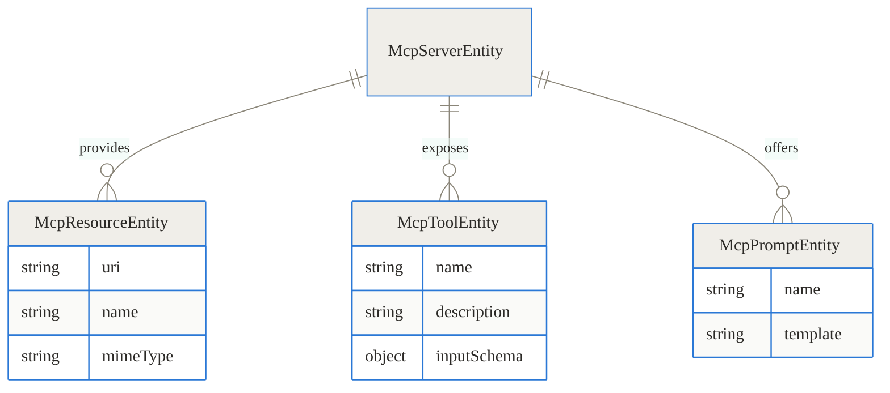
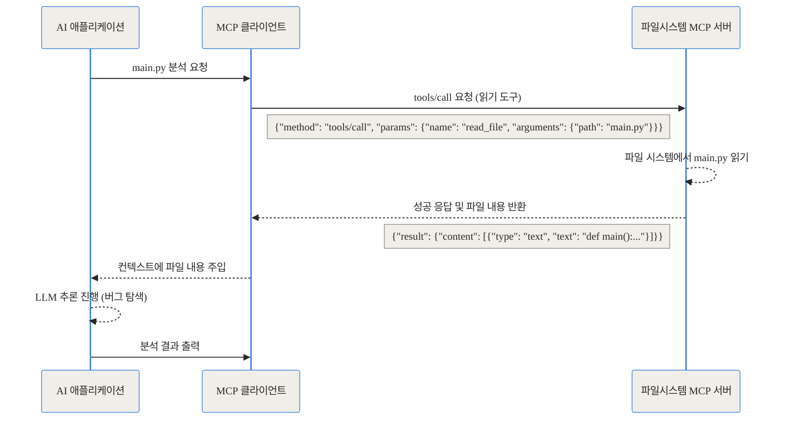
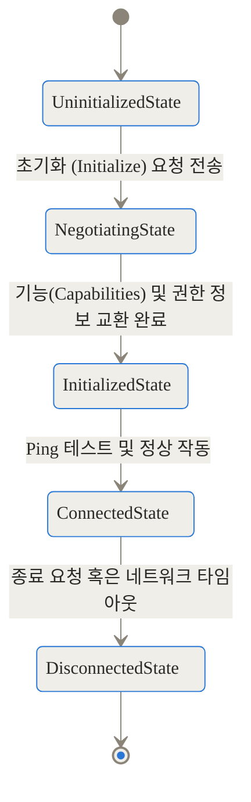
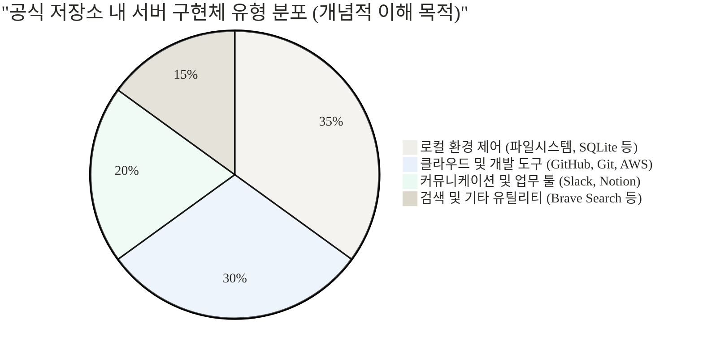
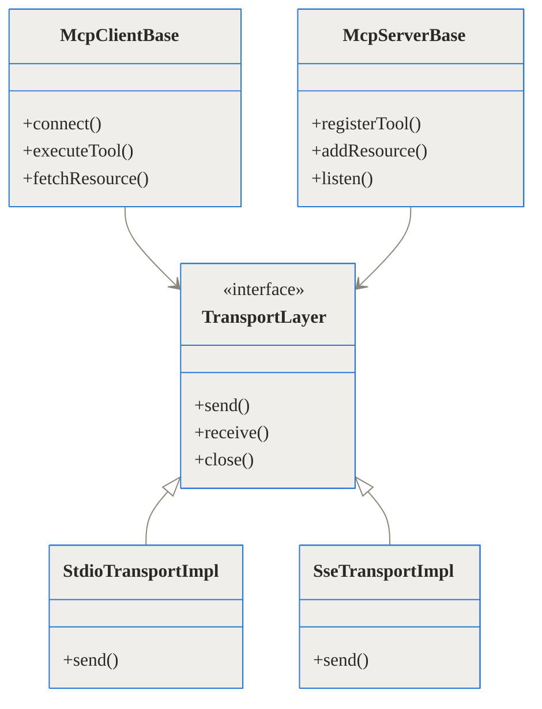
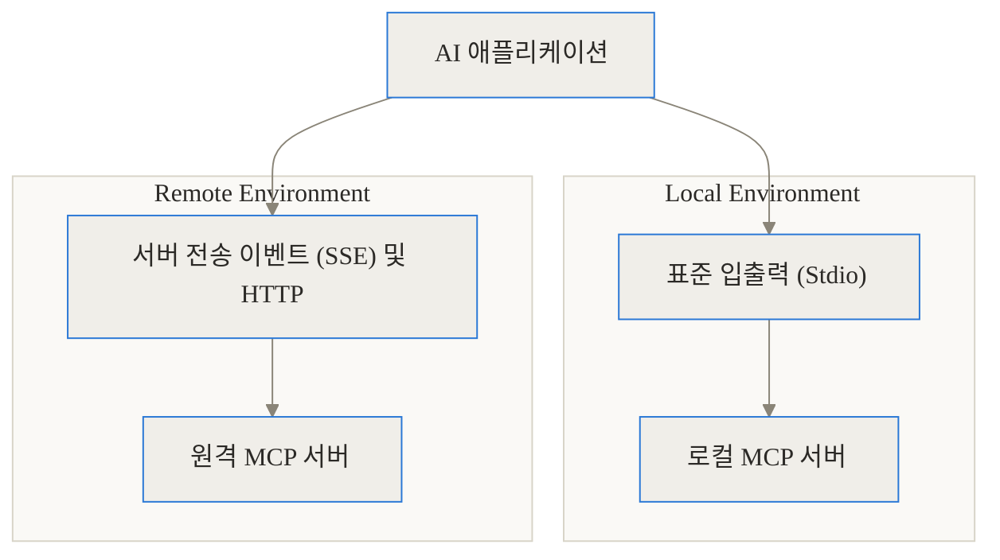

TL;DR (한 줄 요약)
- 문제: AI 모델은 똑똑하지만 로컬 파일이나 사내 데이터베이스 같은 외부 세계와 단절되어 있어 실질적인 작업에 한계가 있었습니다.
- 해결: Model Context Protocol(MCP)은 AI와 외부 시스템을 연결하는 '범용 USB 포트' 같은 역할을 하여, 단일 프로토콜로 모든 데이터 소스와 상호작용하게 해줍니다.
- 결과: 개발자는 각 AI 앱마다 별도의 통합 코드를 짤 필요 없이, 표준화된 MCP 서버 하나만 구축하면 모든 AI 클라이언트에서 해당 도구를 사용할 수 있습니다.

---

## 참조 링크 모음

- 공식 저장소 (서버 구현체): [modelcontextprotocol/servers](https://github.com/modelcontextprotocol/servers)
- 공식 웹사이트 및 문서: [modelcontextprotocol.io](https://modelcontextprotocol.io/)

---

## 배경과 문제 정의: 단절된 AI와 통합의 딜레마

오늘날 대규모 언어 모델은 뛰어난 논리적 추론 능력과 방대한 지식을 자랑합니다. 하지만 정작 현업에서 AI를 활용하려 할 때 우리는 거대한 벽에 부딪히게 됩니다. 바로 모델이 우리의 최신 업무 컨텍스트를 전혀 모른다는 점입니다. 예를 들어, 어제 수정한 로컬 코드베이스의 내용, 1시간 전에 업데이트된 사내 데이터베이스의 스키마, 또는 방금 도착한 슬랙(Slack) 메시지를 AI는 스스로 읽어올 수 없습니다.

이 문제를 해결하기 위해 과거에는 각 AI 애플리케이션 개발자가 필요한 외부 도구마다 일일이 전용 통합(Integration) 코드를 작성해야 했습니다. 이것이 바로 기술 업계에서 악명 높은 'N x M 통합의 고통'입니다.

만약 5개의 서로 다른 AI 애플리케이션(예: Claude Desktop, GitHub Copilot, 로컬 터미널 AI 등)이 있고, 이들이 접근해야 할 10개의 데이터 소스(파일 시스템, GitHub API, PostgreSQL, Slack 등)가 있다고 가정해 봅시다. 기존 방식대로라면 총 50개(5 x 10)의 서로 다른 맞춤형 커넥터가 개발되고 유지보수되어야 합니다. 각 API의 사양, 인증 방식, 데이터 포맷이 모두 다르기 때문에 이는 엄청난 시간과 비용의 낭비로 이어집니다.

```chartjs
{
  "type": "bar",
  "data": {
    "labels": ["기존 개별 통합 방식 (N x M)", "MCP 표준화 방식 (N + M)"],
    "datasets": [
      {
        "label": "필요한 커스텀 커넥터의 수 (AI 앱 5개, 데이터 소스 10개 기준)",
        "data": [50, 15],
        "backgroundColor": ["rgba(255, 99, 132, 0.8)", "rgba(54, 162, 235, 0.8)"]
      }
    ]
  },
  "options": {
    "responsive": true,
    "plugins": {
      "title": {
        "display": true,
        "text": "통합 복잡도 감소 비교"
      }
    }
  }
}
```

위 그래프에서 볼 수 있듯, 각 도구가 개별적으로 연동되는 방식은 생태계가 확장될수록 기하급수적인 복잡도를 낳습니다. 결국 AI 도구들은 자신이 기본적으로 제공하는 몇 가지 한정된 연동 기능 안에 갇히게 되고, 사용자는 복사하여 붙여넣기(Copy & Paste)라는 원시적인 방식으로 AI에게 컨텍스트를 전달해야만 했습니다.

## 개념 쉽게 이해하기: AI를 위한 범용 USB 포트

이러한 구조적 문제를 타파하기 위해 등장한 것이 바로 Model Context Protocol (이하 MCP)입니다. MCP는 Anthropic에서 처음 도입하고 이후 GitHub과 Linux Foundation 등 다양한 산업계 리더들이 참여하여 오픈소스화된 범용 통신 표준입니다.

가장 쉬운 비유는 'USB 포트'입니다. 과거에는 컴퓨터에 키보드, 마우스, 프린터를 연결하려면 각각 완전히 다른 모양의 케이블과 전용 포트가 필요했습니다. 하지만 USB라는 범용 규격이 등장한 이후, 우리는 어떤 기기든 USB 포트에 꽂기만 하면 즉시 사용할 수 있게 되었습니다.

MCP는 바로 AI 애플리케이션(컴퓨터)과 외부 데이터 소스(주변기기) 사이의 USB 포트 역할을 합니다. 데이터베이스, 파일 시스템, 외부 API 등은 자신만의 'MCP 서버'를 구축하기만 하면 됩니다. 그러면 이 프로토콜을 이해하는 어떤 AI 클라이언트(Claude Desktop, Cursor, Copilot 등)라도 추가적인 개발 없이 해당 데이터를 자유롭게 읽고 쓸 수 있게 됩니다.

이 철학은 과거 통합 개발 환경(IDE) 시장을 혁신했던 Language Server Protocol(LSP)과 매우 흡사합니다. LSP 덕분에 모든 에디터가 모든 프로그래밍 언어를 지원할 수 있게 된 것처럼, MCP는 모든 AI가 모든 데이터를 이해할 수 있도록 만드는 지렛대입니다.

## 아키텍처 및 작동 원리 심층 분석 (Under the Hood)

단순한 비유를 넘어, 소프트웨어 엔지니어링 관점에서 MCP가 어떻게 설계되었고 작동하는지 세밀하게 파헤쳐 보겠습니다.

### 1. 전체 구조와 데이터 흐름

MCP 아키텍처는 클라이언트-서버 모델을 엄격하게 따릅니다. 여기서 혼동하지 말아야 할 점은, '클라이언트'가 보통 우리가 쓰는 AI 애플리케이션(호스트) 내부에 위치한다는 것입니다.

```mermaid
%%{init: {"theme":"base","themeVariables":{"primaryColor":"#F0EEE9","primaryBorderColor":"#2a78d6","primaryTextColor":"#2b2926","secondaryColor":"#e8f0fb","secondaryBorderColor":"#4a3aa7","secondaryTextColor":"#2b2926","tertiaryColor":"#eafaf3","tertiaryBorderColor":"#1baf7a","tertiaryTextColor":"#2b2926","lineColor":"#8a8578","textColor":"#2b2926","edgeLabelBackground":"#F0EEE9","noteBkgColor":"#F0EEE9","noteTextColor":"#2b2926","noteBorderColor":"#8a8578","clusterBkg":"#faf9f6","clusterBorder":"#d8d4c8","fontFamily":"Pretendard, sans-serif"}}}%%
flowchart LR
    AiHostApp["AI 애플리케이션 (Host)"]
    McpClientNode["MCP 클라이언트"]
    JsonRpcProtocol["JSON-RPC 계층"]
    McpServerNode["MCP 서버"]
    ExternalSystem["외부 데이터 및 API"]

    AiHostApp --> McpClientNode
    McpClientNode --> JsonRpcProtocol
    JsonRpcProtocol --> McpServerNode
    McpServerNode --> ExternalSystem
```



1. AI 애플리케이션(예: Claude Desktop)은 사용자의 입력을 받아들입니다.
2. 애플리케이션 내부에 내장된 MCP 클라이언트는 등록된 MCP 서버들에게 "너희들은 어떤 기능을 가지고 있니?"라고 질의합니다.
3. 클라이언트와 서버는 JSON-RPC라는 가볍고 표준화된 포맷을 통해 메시지를 주고받습니다.
4. MCP 서버는 외부 시스템(예: 로컬 폴더, 사내 Jira 시스템 등)과 직접 통신하여 데이터를 가져오거나 동작을 수행합니다.

### 2. 세 가지 핵심 기능: Resources, Tools, Prompts

서버가 AI 클라이언트에게 제공할 수 있는 기능은 크게 세 가지로 분류됩니다. 이 세 가지 요소의 목적과 차이점을 정확히 이해하는 것이 핵심입니다.



| 컴포넌트 명칭 | 주요 목적 및 특징 | 일상적인 비유 | 구체적인 사용 예시 |
| --- | --- | --- | --- |
| **Resources** | 읽기 전용 데이터 제공. 정적이거나 동적인 데이터를 URI 형태로 노출합니다. | 웹 브라우저로 정보성 웹페이지를 읽는 것 | 특정 로그 파일 읽기, 데이터베이스 스키마 조회, API 응답 가져오기 |
| **Tools** | 실행 가능한 작업 노출. 상태를 변경하거나 부수 효과(Side Effect)를 일으키는 작업을 정의합니다. | 버튼을 눌러 온라인 폼을 제출하고 작업을 실행하는 것 | GitHub에 새 이슈 생성하기, DB에 UPDATE 쿼리 실행하기, 특정 코드 라인 수정하기 |
| **Prompts** | 재사용 가능한 지시문 템플릿 제공. 사용자가 자주 하는 요청을 템플릿화하여 제공합니다. | 복잡한 검색 조건이 미리 입력된 즐겨찾기 북마크 | "이 코드베이스의 스타일 가이드에 맞춰 코드를 리뷰해줘"라는 사전 정의된 템플릿 |

특히 **Tools** 기능은 AI가 스스로 행동하는 에이전트(Agent)로 진화하는 데 결정적인 역할을 합니다. 서버는 도구의 입력 형식을 JSON Schema로 명확히 정의하여 클라이언트에 전달하며, AI 모델은 이 스키마를 바탕으로 정확한 인자(Arguments)를 생성하여 서버로 호출 요청을 보냅니다.

### 3. 클라이언트-서버 통신 방식 및 프로토콜

통신은 철저히 비동기적이며 JSON-RPC 2.0 규격을 따릅니다. 사용자가 AI에게 "내 로컬 프로젝트의 main.py 파일을 읽어서 버그를 찾아줘"라고 요청했을 때 내부적으로 일어나는 통신 과정을 살펴보겠습니다.



위 시퀀스에서 보듯, 프로토콜 계층은 매우 얇고 투명합니다. 클라이언트는 단순히 서버가 정의한 메서드를 호출하고, 그 결과를 텍스트 혹은 바이너리 형태의 배열로 반환받을 뿐입니다. 복잡한 파일 I/O나 권한 관리는 전적으로 서버가 책임집니다.

### 4. 서버의 상태 전이와 생명주기

MCP 연결은 무상태(Stateless) REST API와 달리, 지속적인 연결(Stateful)을 유지하며 초기 협상 과정을 거칩니다.



가장 중요한 단계는 `NegotiatingState`(기능 협상 단계)입니다. 이 시점에 서버는 자신이 어떤 기능(예: "나는 Tools만 지원하고 Resources는 지원하지 않아")을 가졌는지 클라이언트에게 알립니다. 이를 통해 서로 다른 버전의 SDK나 클라이언트-서버 조합에서도 유연하게 호환성을 유지할 수 있습니다.

## 공식 서버 저장소 집중 탐구

GitHub의 `modelcontextprotocol/servers` 저장소는 MCP 생태계의 중심이자, 개발자들이 참고할 수 있는 훌륭한 레퍼런스 구현체 모음집입니다. 이 저장소에는 처음부터 바닥에서 서버를 구축할 필요 없이 즉시 가져다 쓸 수 있는 다양한 오픈소스 서버들이 포함되어 있습니다.



이 저장소에서 주목할 만한 주요 서버들은 다음과 같습니다.

1. **FileSystem 서버**: 지정된 디렉토리 내의 파일을 읽고 쓸 수 있는 도구를 제공합니다. 이를 통해 AI가 내 로컬 코드베이스를 직접 탐색하고 코드를 수정할 수 있습니다.
2. **GitHub 서버**: 특정 저장소의 이슈, 풀 리퀘스트, 커밋 히스토리를 조회하고 조작할 수 있습니다. AI에게 "내 저장소에 올라온 최신 버그 리포트를 읽고 해결책을 코딩한 뒤 PR을 올려줘"라고 명령할 수 있게 해줍니다.
3. **PostgreSQL / SQLite 서버**: 데이터베이스 스키마를 읽어오고, AI가 직접 SQL 쿼리를 작성해 데이터를 추출할 수 있게 하는 서버입니다. 복잡한 데이터 분석 작업을 채팅만으로 수행할 수 있습니다.
4. **Brave Search 서버**: AI 모델이 학습하지 못한 최신 정보가 필요할 때, 직접 웹 검색을 수행하여 결과를 컨텍스트로 가져옵니다.

### 클래스 구조와 구현체 (TypeScript SDK 기준)

실제로 서버를 구현할 때 내부 코드는 어떻게 구성될까요? SDK의 핵심 클래스 구조를 살펴보면 그 견고함을 엿볼 수 있습니다.



개발자는 통신 방식(Transport Layer)에 대해 깊이 고민할 필요 없이, 단순히 `McpServerBase` 객체를 생성하고 거기에 도구(Tools)의 이름과 동작 로직만 등록(`registerTool`)하면 됩니다. 나머지는 SDK가 모두 알아서 처리합니다.

## 로컬 통신과 원격 통신의 차이

MCP는 실행 환경에 따라 두 가지 완전히 다른 전송(Transport) 계층을 지원합니다. 이 두 가지를 목적에 맞게 선택하는 것이 중요합니다.



| 구분 | Stdio (표준 입출력) | SSE / HTTP (원격 통신) |
| --- | --- | --- |
| **물리적 위치** | 클라이언트와 동일한 로컬 PC | 클라우드 또는 내부망의 별도 서버 |
| **데이터 흐름** | 프로세스의 stdin/stdout을 통한 파이프 통신 | HTTP 요청 및 Server-Sent Events 스트림 |
| **주요 장점** | 네트워크 지연(Latency) 없음, 설정이 매우 단순 | 여러 사용자가 하나의 서버를 공유 가능, 중앙 집중식 권한 통제 |
| **적합한 유즈케이스**| 개인 개발자의 로컬 코드 에디터, 로컬 파일 탐색 | 팀 전체가 공용으로 쓰는 사내 위키 조회용 AI, 프로덕션 DB 연동 |

특히 Stdio 방식은 가장 널리 쓰이는 형태입니다. 개발자가 로컬 터미널에서 Node.js나 Python 스크립트를 백그라운드로 띄워두고, Claude Desktop 같은 앱이 그 스크립트의 입출력 채널을 낚아채서 통신하는 직관적인 방식입니다.

## 구현 및 사용 디테일: 내 AI에 서버 연결하기

그렇다면 실제 사용자 입장에서 이 서버들을 어떻게 연결할 수 있을까요? Claude Desktop을 예로 들어 가장 단순한 형태의 설정을 살펴보겠습니다.

Claude Desktop의 설정 파일(`claude_desktop_config.json`)을 열고 아래와 같이 몇 줄의 JSON을 추가하기만 하면 됩니다.

```json
{
  "mcpServers": {
    "my_local_files": {
      "command": "npx",
      "args": [
        "-y",
        "@modelcontextprotocol/server-filesystem",
        "/Users/developer/my_projects"
      ]
    }
  }
}
```

이 설정이 의미하는 바는 명확합니다. Claude Desktop이 켜질 때, 내부적으로 `npx` 명령어를 실행하여 파일시스템 MCP 서버를 구동시키라는 것입니다. 그리고 해당 서버가 접근할 수 있는 최상위 디렉토리를 `/Users/developer/my_projects`로 엄격히 제한합니다. 이제 Claude에게 "my_projects 폴더 안에 있는 에러 로그를 읽고 원인을 찾아줘"라고 말하면, AI는 즉시 파일 내용을 읽고 완벽한 컨텍스트 위에서 답변을 생성합니다.

## 실전 활용 시나리오

MCP가 도입되었을 때 개발자와 기획자의 업무가 어떻게 달라지는지 구체적인 시나리오를 통해 확인해 보겠습니다.

**시나리오 1: 복잡한 로컬 코드베이스 트러블슈팅**
기존에는 서버에서 에러가 발생하면, 개발자가 터미널을 열어 로그를 복사하고, 에러가 발생한 소스코드 파일을 찾아 복사한 뒤, 이들을 모두 텍스트 파일로 묶어 AI 채팅창에 붙여넣어야 했습니다.
MCP를 활용하면 단순히 이렇게 지시할 수 있습니다. "어제 발생한 500 에러 로그를 읽고, 해당 에러를 뱉어낸 컨트롤러 코드를 찾아서 수정한 뒤 커밋해줘." AI는 파일시스템 도구를 사용해 로그를 읽고, 코드 검색 도구로 위치를 찾고, 깃(Git) 도구를 이용해 커밋까지 단번에 수행합니다.

**시나리오 2: 사내 데이터 기반의 고객 CS 자동 응답**
CS 담당자는 고객의 문의가 들어오면 기존의 고객 정보 DB와 최신 사내 정책 위키를 모두 확인해야 합니다. 만약 'PostgreSQL 서버'와 'Notion 서버'를 원격 MCP(SSE 방식)로 구축해 두었다면, AI 챗봇이 고객 ID를 기반으로 DB를 자동 조회하고, Notion에서 최신 환불 정책을 읽어온 뒤 고객에게 보낼 답변의 초안을 완벽하게 작성해 냅니다.

## 솔직한 평가: 한계와 트레이드오프

물론 이 기술이 완벽한 '만능열쇠'는 아닙니다. 도입하기 전 반드시 고려해야 할 냉정한 한계점들이 존재합니다.

1. **보안 및 권한 통제(Security Risks)**
   - 가장 큰 허들은 보안입니다. AI에게 파일 시스템이나 데이터베이스를 변경할 수 있는 '쓰기 권한(Write Access)' 도구를 쥐여주는 것은 잠재적인 폭탄을 안고 있는 것과 같습니다. 환각(Hallucination) 현상으로 인해 AI가 엉뚱한 테이블을 DROP 하거나 중요 파일을 덮어쓸 위험이 있습니다.
   - **대안**: MCP 프로토콜 설계자들은 이러한 위험을 인지하고, 파괴적인 행동을 수행할 때는 반드시 사용자에게 확인을 받는 'Human-in-the-loop(인간 개입)' 과정을 클라이언트 단에서 강제할 것을 권장하고 있습니다.
2. **네트워크 및 추론 지연(Latency)**
   - AI가 답변을 생성하는 과정 중간에 외부 데이터를 조회해야 하므로, 필연적으로 응답 속도가 느려집니다. 도구를 호출하고 서버의 응답을 기다렸다가 다시 추론을 재개하는 과정은 실시간 대화가 필요한 서비스에서는 꽤 큰 제약으로 다가올 수 있습니다.
3. **초기 생태계의 불안정성**
   - 프로토콜 자체는 훌륭하지만, 아직 초기 단계인 만큼 `servers` 저장소에 있는 도구들이 모든 엣지 케이스를 커버하지는 못합니다. 대규모 프로덕션 환경에 적용하기 위해서는 서버 구현체들의 안정성과 에러 핸들링을 직접 꼼꼼히 보강해야 합니다.

## 마무리: 에이전틱 AI의 미래를 여는 표준

Model Context Protocol은 단순한 통신 규격을 넘어, 우리가 AI를 대하는 방식을 근본적으로 바꿔놓고 있습니다. 과거의 AI가 우리의 질문에 수동적으로 대답하는 갇힌 형태의 '오라클(Oracle)'이었다면, MCP를 등에 업은 AI는 우리를 대신해 시스템을 탐색하고 작업을 수행하는 진정한 의미의 '에이전트(Agent)'로 거듭나고 있습니다.

Language Server Protocol이 전 세계 개발자들의 에디터 환경을 상향 평준화했던 것처럼, MCP 역시 파편화된 AI 도구 시장을 하나의 거대한 생태계로 통합해 낼 잠재력을 지니고 있습니다. 복잡한 통합 코드 작성을 멈추고, 공식 서버 저장소를 활용해 여러분만의 컨텍스트를 AI에게 연결해 보세요. AI가 코드를 읽고 시스템을 이해하는 순간, 개발 생산성은 새로운 차원으로 도약할 것입니다.

## 자주 묻는 질문 (FAQ)

### Model Context Protocol(MCP)은 기존의 일반 API 연동과 구체적으로 무엇이 다른가요?

기존 API 연동은 개발자가 특정 도구(예: Slack)의 스펙에 맞춰 AI 앱 내부에 전용 코드를 짜야 하는 1:1 종속적인 방식이었습니다. 반면 MCP는 중간에 통신 표준(프로토콜)을 두어, 한 번 만들어 둔 MCP 서버는 이 규격을 이해하는 모든 AI 애플리케이션(클라이언트)에서 수정 없이 재사용할 수 있다는 점이 가장 큰 차이입니다.

### modelcontextprotocol/servers 공식 저장소에는 구체적으로 어떤 것들이 포함되어 있나요?

이 저장소는 개발자들이 즉시 가져다 쓸 수 있는 다양한 레퍼런스 서버 구현체들의 모음집입니다. 대표적으로 로컬 디스크를 읽고 쓰는 파일시스템(filesystem) 서버, GitHub 리포지토리와 연동되는 서버, PostgreSQL/SQLite 같은 데이터베이스 연결 서버, 웹 검색을 위한 Brave Search 서버 등이 포함되어 있습니다.

### 로컬 파일 시스템에만 접근할 수 있나요, 아니면 외부 원격 데이터도 연동 가능한가요?

둘 다 가능합니다. MCP는 실행 환경에 맞게 두 가지 전송 방식을 지원합니다. 내 PC의 파일을 다룰 때는 지연이 없는 표준 입출력(Stdio) 방식을 사용하고, 클라우드나 사내망에 있는 외부 데이터를 다룰 때는 Server-Sent Events(SSE)나 HTTP 방식을 통해 원격 서버와 통신할 수 있습니다.

### AI가 제 로컬 컴퓨터의 파일을 마음대로 삭제하거나 시스템을 망가뜨리면 어떡하나요?

보안은 MCP 설계의 최우선 고려 사항입니다. 기본적으로 서버를 구동할 때 접근 가능한 최상위 디렉토리를 제한하여 시스템 전체 접근을 막을 수 있습니다. 또한 데이터를 변경하거나 파괴적인 작업을 수행하는 도구를 호출할 때는, AI 클라이언트(예: Claude Desktop)가 사용자에게 명시적인 승인(Human-in-the-loop)을 요구하도록 설계되어 있습니다.

### 현재 개발 중인 나만의 커스텀 AI 앱에도 이 기능을 추가할 수 있나요?

네, 가능합니다. MCP는 완전히 오픈소스로 공개되어 있으며 TypeScript, Python, Kotlin 등 다양한 언어를 위한 공식 SDK를 제공합니다. 사용자는 이 SDK를 활용하여 자신만의 AI 클라이언트를 만들거나 사내 레거시 시스템을 위한 전용 MCP 서버를 아주 쉽게 구축할 수 있습니다.


## References
- [https://github.com/modelcontextprotocol/servers](https://github.com/modelcontextprotocol/servers)
- [https://modelcontextprotocol.io/](https://modelcontextprotocol.io/)
- [https://github.com/modelcontextprotocol](https://github.com/modelcontextprotocol)
