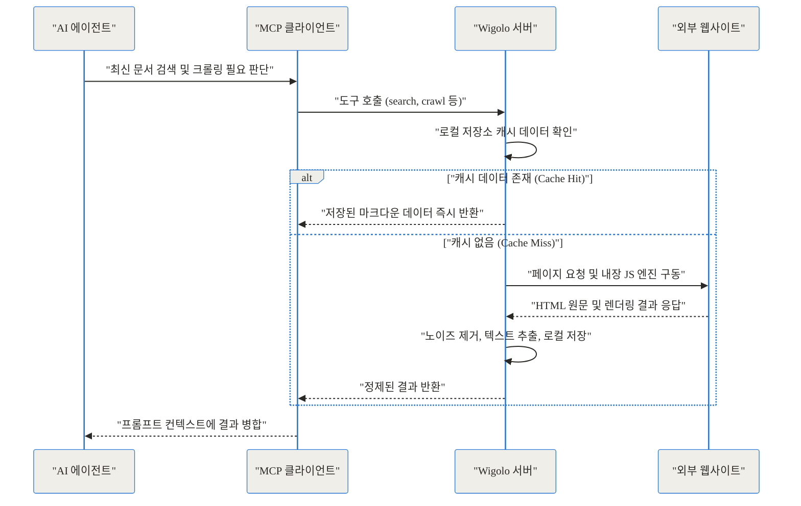
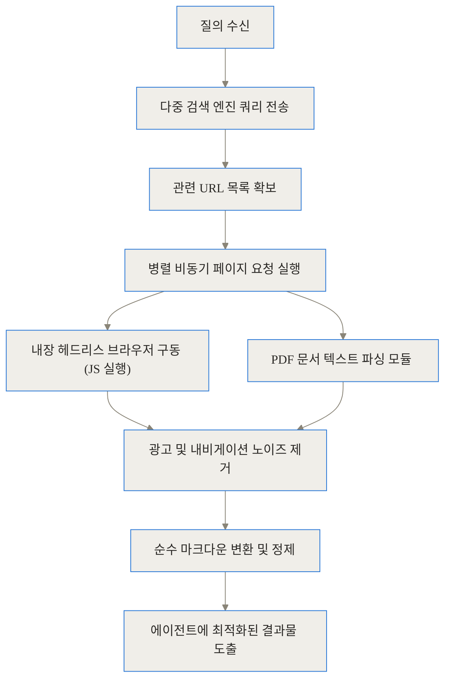
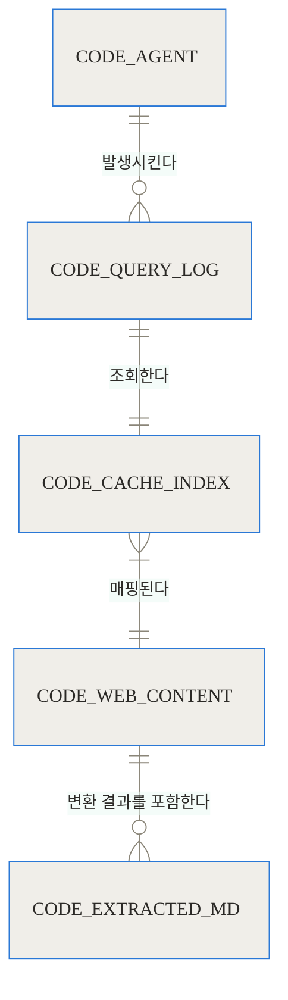
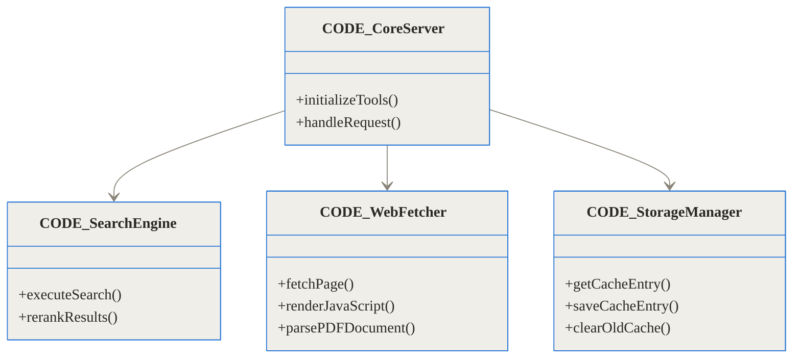
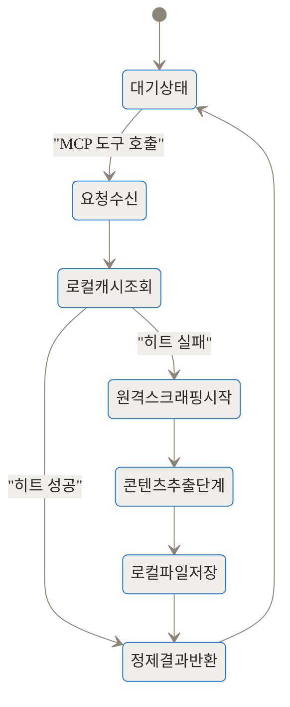
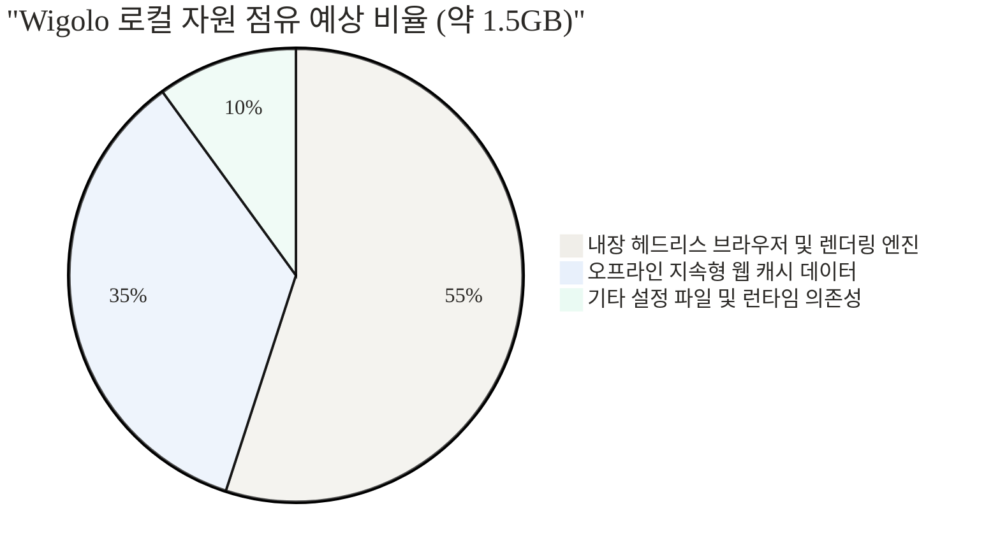

## Wigolo 소개: AI 에이전트의 한계를 부수는 로컬 웹 계층

최근 AI 코딩 에이전트가 개발자들의 필수 도구로 자리 잡았습니다. 코드를 작성하고 버그를 찾아주는 능력은 탁월하지만, 치명적인 약점이 하나 있습니다. 바로 세상의 변화를 실시간으로 쫓아가지 못한다는 점입니다. 이 글에서 다룰 Wigolo 프로젝트는 이러한 에이전트의 한계를 근본적으로 해결해 주는 오픈소스 도구입니다.

### TL;DR (세 줄 요약)
- Wigolo는 AI 코딩 에이전트(Claude Code, Cursor 등)에게 과금 없이 무제한 웹 검색, 크롤링, 캐싱 능력을 제공하는 로컬 기반 MCP 서버입니다.
- 외부 클라우드 API에 의존하지 않고 내 PC의 자원만 활용하므로, 비용 걱정 없이 깊이 있는 병렬 웹 리서치가 가능합니다.
- 단 한 줄의 명령어로 설치되며, 과거 데이터에 갇힌 AI가 최신 공식 문서나 에러 해결책을 실시간으로 학습하고 기억하게 만듭니다.

---

## 1. 배경과 문제 정의: 왜 기존 방식은 고통스러운가?

AI 코딩 도구를 사용하다 보면 답답한 순간이 반드시 찾아옵니다. 방금 업데이트된 프레임워크의 새로운 문법을 묻거나, 어제 발생한 따끈따끈한 라이브러리 충돌 이슈를 물어보면 에이전트는 오래된 과거의 지식을 바탕으로 엉뚱한 코드를 짜주곤 합니다. 이것은 모델의 훈련 데이터가 과거의 특정 시점에 멈춰 있기 때문입니다.

이를 극복하기 위해 많은 개발자가 유료 웹 검색 API를 에이전트에게 쥐여줍니다. 하지만 여기서 두 번째 문제가 발생합니다. 에이전트가 문제를 해결하기 위해 스스로 여러 페이지를 탐색하고 문서를 읽어올 때마다 검색 API 요금이 청구된다는 사실입니다. 자율성이 높은 에이전트일수록 더 많은 웹 요청을 보내고, 이는 곧 예측할 수 없는 요금 폭탄으로 이어질 수 있습니다. 개발자는 요금이 두려워 에이전트의 탐색 범위를 제한하게 되고, 결국 AI의 자율성을 100% 활용하지 못하는 역설에 빠집니다.

게다가 기존 에디터들에 내장된 얕은 웹 검색 기능은 근본적인 한계가 뚜렷합니다.
- **얕은 탐색 깊이**: 보통 한 번에 페이지 하나를 읽는 데 그칩니다. 라이브러리의 전체 공식 문서 사이트를 크롤링하는 것은 불가능합니다.
- **렌더링 실패**: 자바스크립트로 무겁게 렌더링되는 현대의 SPA(Single Page Application) 공식 문서를 제대로 읽지 못하거나, PDF로 제공되는 레퍼런스는 아예 열어보지도 못합니다.
- **기억 상실**: 에이전트가 방금 읽은 문서를 다음 세션에서는 까맣게 잊어버립니다. 매번 똑같은 문서를 다시 검색하고 가져오며 네트워크 자원과 시간을 낭비합니다.

Wigolo는 바로 이 구체적이고 뼈아픈 고통을 해결하기 위해 등장한 혁신적인 대안입니다.

---

## 2. 개념 쉽게 이해하기: 내 PC 안에 구축하는 에이전트 전용 도서관

이 프로젝트의 중심 아이디어를 이해하기 위해 일상적인 비유를 들어보겠습니다. 여러분에게 아주 똑똑하지만 세상과 단절된 방 안에 갇힌 개인 비서가 있다고 상상해 보세요. 이 비서에게 최신 정보를 알려주기 위해, 지금까지는 외부 심부름센터(클라우드 검색 API)에 매번 돈을 주고 자료를 구해오라고 시켰습니다.

Wigolo는 심부름센터에 돈을 내는 대신, 비서의 방 바로 옆에 거대한 '전용 도서관'을 통째로 지어주는 것과 같습니다. 이 도서관은 전 세계의 웹 페이지를 마음껏 복사해 올 수 있는 무제한 대출증을 가지고 있습니다. 비서가 "이 라이브러리의 전체 공식 문서를 가져와"라고 요구하면, 도서관(Wigolo)은 여러 직원을 동시에 파견해 문서를 전부 긁어오고 깔끔하게 정리해서 건네줍니다.

가장 중요한 점은, 한 번 가져온 책은 도서관 창고(로컬 캐시)에 영구히 보관한다는 것입니다. 내일 비서가 똑같은 자료를 다시 찾으면, 외부로 나갈 필요 없이 창고에서 즉시 책을 꺼내줍니다. 이 모든 과정이 내 컴퓨터 안에서, 과금 없이 100% 무료로 이루어집니다. 외부 API 키도, 클라우드 의존성도 필요 없습니다. 오직 당신의 로컬 자원만 사용할 뿐입니다.

---

## 3. 작동 원리 심층 분석 (Under the Hood)

Wigolo가 어떻게 이렇게 강력한 웹 계층을 로컬에 구축할 수 있는지 내부 아키텍처를 깊이 파헤쳐 보겠습니다. 크게 세 가지 파이프라인으로 구성되어 있습니다.

### 3.1. MCP 기반의 통신 아키텍처

Wigolo는 단독으로 동작하는 애플리케이션이 아니라, 최근 업계 표준으로 자리 잡고 있는 MCP(Model Context Protocol) 서버로서 기능합니다. 에이전트는 Wigolo가 제공하는 여러 도구(검색, 가져오기, 크롤링 등)를 마치 자신이 원래 가지고 있던 네이티브 기능처럼 자연스럽게 호출합니다.



위 시퀀스 다이어그램에서 보듯, 에이전트와 Wigolo는 표준 입출력(stdio) 채널을 열어두고 지속적으로 소통합니다. 에이전트가 "내가 이 정보를 모르니 웹을 뒤져봐야겠다"라고 판단하는 순간, 스스로 Wigolo의 도구를 호출하는 자율적인 흐름이 완성됩니다.

### 3.2. 웹 크롤링과 데이터 정제 파이프라인

단순히 HTML 소스코드를 다운로드하는 기능이라면 기존 내장 검색과 다를 바가 없을 것입니다. Wigolo의 진정한 강력함은 현대 웹의 복잡성을 우회하는 렌더링 파이프라인에 있습니다.



Wigolo는 내장된 헤드리스 브라우저를 구동해 자바스크립트를 완전히 실행합니다. SPA로 만들어져 처음 요청 시 텅 빈 HTML을 반환하는 사이트라도, 실제 화면에 그려진 텍스트를 정확히 추출해 냅니다. 또한 에이전트가 읽기 쉽도록 웹페이지의 불필요한 레이아웃(헤더, 푸터, 광고)을 걷어내고 순수한 마크다운 포맷으로 가공하는 과정이 파이프라인에 깊게 통합되어 있습니다.

### 3.3. 영속성을 보장하는 데이터 모델과 캐싱

AI 에이전트는 문제를 해결하는 과정에서 동일한 레퍼런스를 반복적으로 참조하는 경향이 있습니다. Wigolo는 오프라인 상태에서도 과거의 지식을 꺼내 쓸 수 있도록 정교한 캐시 스키마를 유지합니다.



이러한 관계형 캐시 구조 덕분에, 방대한 문서를 한 번만 크롤링해 두면 이후의 접근은 수 밀리초 내에 즉시 응답합니다.

### 3.4. 내부 모듈의 클래스 구조

Wigolo의 코드베이스는 단일 책임 원칙을 철저히 따르며 여러 모듈로 분리되어 있습니다. TypeScript 기반의 객체 지향 설계를 엿볼 수 있습니다.



이 구조 덕분에 특정 검색 엔진의 정책이 바뀌거나 새로운 파싱 방식이 도입되더라도, 다른 모듈에 영향을 주지 않고 유연하게 업데이트가 가능합니다.

### 3.5. 스크래핑 라이프사이클의 상태 전이

에이전트가 대규모 크롤링을 지시했을 때, 단일 스레드가 블로킹되지 않도록 비동기 상태 전이가 정교하게 관리됩니다.



### 3.6. 1.5GB 디스크 점유율의 진실

Wigolo를 처음 설치하면 약 1.5GB의 디스크 공간을 요구합니다. 클라우드 기반 도구에 비하면 무겁게 느껴질 수 있지만, 이 용량은 진정한 '독립성'을 위한 필수 자원입니다.



차트에서 보듯 절반 이상의 용량은 자바스크립트 렌더링을 위한 자체 브라우저 엔진이 차지하며, 나머지는 에이전트의 지식을 축적하는 지속형 캐시가 차지합니다.

---

## 4. 벤치마크 및 비교: 수치로 증명하는 가치

Wigolo를 기존 방식들과 직접 비교해 보겠습니다. 과연 로컬 환경으로 옮겨왔을 때 얻는 이득이 디스크 용량의 트레이드오프를 상쇄할 만큼 클까요?

### 4.1. 기능별 비교 표

| 비교 항목 | 기존 에디터 내장 웹 검색 | 유료 클라우드 검색 API (Tavily 등) | Wigolo (로컬 MCP) |
| --- | --- | --- | --- |
| **비용** | 기본 제공 (무료이나 제한적) | 쿼리당 과금 (비싼 유지비용) | **$0 (완전 무료)** |
| **탐색 깊이** | 단일 페이지 스니펫 | 단일 또는 다중 페이지 | **사이트 전체 크롤링 가능** |
| **JS 렌더링 지원** | 제한적이거나 실패가 잦음 | 외부 서버에서 지원함 | **내장 브라우저로 완벽 지원** |
| **데이터 영속성** | 세션 종료 시 기억 소멸 | 캐시 없음 (매번 새롭게 요청) | **로컬 디스크에 영구 캐싱** |
| **오프라인 사용** | 불가능 | 불가능 | **캐시된 문서에 한해 즉시 가능** |
| **프라이버시** | 에디터 제조사 서버로 전송됨 | 외부 API 벤더로 데이터 전송됨 | **100% 로컬 처리 (매우 안전함)** |

이 표에서 가장 눈에 띄는 것은 '데이터 영속성'입니다. 한 번 크롤링한 문서는 더 이상 네트워크를 타지 않기 때문에 속도와 비용 면에서 압도적인 우위를 점합니다.

### 4.2. 비용 및 응답 속도 시각화

아래는 쿼리 누적에 따른 비용 증가 곡선입니다. API를 맹목적으로 호출하다 보면 비용이 기하급수적으로 늘어나지만, Wigolo는 평행선을 유지합니다.

```chartjs
{
  "type": "line",
  "data": {
    "labels": ["100건", "500건", "1,000건", "5,000건", "10,000건"],
    "datasets": [
      {
        "label": "유료 클라우드 검색 API 누적 예상 비용 ($)",
        "data": [2, 10, 20, 100, 200],
        "borderColor": "rgba(255, 99, 132, 1)",
        "backgroundColor": "rgba(255, 99, 132, 0.2)",
        "fill": true
      },
      {
        "label": "Wigolo 로컬 MCP 누적 예상 비용 ($)",
        "data": [0, 0, 0, 0, 0],
        "borderColor": "rgba(54, 162, 235, 1)",
        "backgroundColor": "rgba(54, 162, 235, 0.2)",
        "fill": true
      }
    ]
  }
}
```

다음은 첫 네트워크 요청과 로컬 캐시 히트 시의 응답 속도 차이입니다.

```chartjs
{
  "type": "bar",
  "data": {
    "labels": ["최초 크롤링 (네트워크 요청 및 JS 렌더링)", "동일 페이지 재요청 (로컬 캐시 적중)"],
    "datasets": [
      {
        "label": "응답 소요 시간 (밀리초)",
        "data": [3850, 85],
        "backgroundColor": ["rgba(255, 159, 64, 0.7)", "rgba(75, 192, 192, 0.7)"]
      }
    ]
  }
}
```

3초 이상 걸리던 무거운 페이지 렌더링 작업이 캐시 히트 시 0.1초 미만으로 단축되는 극적인 성능 향상을 확인할 수 있습니다.

---

## 5. 구현 및 사용 디테일: 단 한 줄로 시작하는 셋업

Wigolo의 가장 놀라운 점 중 하나는 이토록 복잡한 시스템을 구축하는 데 필요한 설정이 극도로 간결하다는 것입니다. 복잡한 환경 변수나 설정 파일을 직접 만질 필요가 없습니다.

### 5.1. npx를 통한 자동 초기화

Node.js 환경(버전 20 이상 권장)이 준비되어 있다면 터미널에 단 한 줄만 입력하면 됩니다.

```bash
npx wigolo init
```

이 명령어는 현재 시스템에 설치된 Claude Code, Cursor, Codex 등 주요 MCP 호환 클라이언트들을 자동으로 스캔하고, 적절한 설정 파일에 Wigolo 서버 진입점을 자동으로 등록합니다. 모든 과정이 스크립트로 처리되어 1분 안에 셋업이 끝납니다.

### 5.2. Docker를 이용한 격리 환경 구축

시스템에 직접 패키지를 설치하는 것이 부담스럽거나 의존성 충돌을 원천 차단하고 싶다면, 제공되는 공식 Docker 이미지를 활용하는 것이 가장 좋습니다. 아래는 Claude Code 환경에 Docker 기반 Wigolo를 연동하는 명령어입니다.

```bash
claude mcp add wigolo --scope user -- docker run -i --rm -v wigolo-data:/data ghcr.io/knockoutez/wigolo
```

여기서 주목해야 할 부분은 `-v wigolo-data:/data` 볼륨 마운트 옵션입니다. 이 옵션을 통해 컨테이너가 종료되더라도 로컬 캐시와 모델 파일들이 호스트 스토리지에 영구적으로 보존됩니다. 내일 컨테이너를 다시 띄워도 에이전트는 어제 공부했던 문서를 즉각적으로 기억해 냅니다.

### 5.3. 주요 에디터별 수동 설정 방법

자동화 스크립트를 사용하지 않고 직접 환경을 제어하고 싶은 분들을 위해 표로 정리했습니다.

| AI 에디터 / 환경 | 설정 파일 경로 및 방식 | 수동 설정 입력 구문 예시 |
| --- | --- | --- |
| **Claude Code** | CLI 전용 명령어 입력 | `claude mcp add wigolo --scope user -- npx -y wigolo` |
| **Cursor** | Cursor 세팅 > Features > MCP 메뉴 | Name: `wigolo`, Type: `command`, Command: `npx -y wigolo` |
| **Codex** | 로컬 TOML 설정 파일 수정 | `[mcp_servers.wigolo]` 아래 `command = "npx"` 및 `args = ["-y", "wigolo"]` 입력 |

### 5.4. 선택적 기능: LLM 기반의 중간 데이터 정제

방대한 공식 문서를 여러 페이지에 걸쳐 크롤링하다 보면, 아무리 마크다운으로 깔끔하게 정제했더라도 메인 에이전트의 컨텍스트 윈도우 한계를 금방 초과하게 됩니다. 이를 방지하기 위해 Wigolo는 추출된 원시 데이터를 가벼운 외부 LLM이 먼저 읽고 요약하도록 지시할 수 있는 환경 변수를 제공합니다.

```bash
export WIGOLO_LLM_PROVIDER=gemini
export GEMINI_API_KEY=당신의_무료_API_키
```

구글의 Gemini 무료 티어(가장 추천됨)나 로컬에 설치된 Ollama를 연결하면, Wigolo가 무거운 리서치 결과를 에이전트에게 넘기기 전에 스스로 핵심만 추려냅니다. 비싼 메인 에이전트 모델의 토큰 소모를 극적으로 아끼는 현명하고 경제적인 방법입니다.

---

## 6. 실전 활용 시나리오: 현업에서 Wigolo가 빛나는 순간

단순한 기능 설명을 넘어, 실제 개발 워크플로우에서 Wigolo가 어떻게 코딩 경험을 완전히 바꾸는지 구체적인 시나리오를 통해 살펴보겠습니다.

### 시나리오 1: 낯선 최신 라이브러리 기반의 프로젝트 시작하기

당신은 새로운 프로젝트에서 한 번도 써본 적 없는 최신 오픈소스 라이브러리를 도입해야 합니다. 기존 방식대로 에이전트에게 코드를 짜달라고 하면, 에이전트는 구버전 문법을 섞어 쓰며 치명적인 환각 현상을 일으킬 것입니다. 하지만 Wigolo가 있다면 다음과 같이 지시할 수 있습니다.

> "에이전트야, 먼저 Wigolo를 사용해서 이 프레임워크의 공식 문서 사이트 전체를 깊게 크롤링해 줘. 변경된 최신 API 스펙과 컴포넌트 구조를 완벽히 파악한 다음, 내 요구사항에 맞춰 초기 보일러플레이트 코드를 작성해."

명령을 받은 에이전트는 즉시 Wigolo의 크롤링 툴을 호출합니다. Wigolo는 병렬로 문서를 긁어오고 렌더링하여 로컬 지식을 축적합니다. 에이전트는 이 신뢰할 수 있는 최신 문맥을 바탕으로 단 한 줄의 오차도 없는 정확한 코드를 작성해 냅니다.

### 시나리오 2: 깊은 콜스택을 동반한 원인 불명의 버그 추적

서버가 갑자기 뻗으면서 수십 줄의 생소한 에러 로그를 뱉어냈습니다. 단순한 웹 검색 한 번으로는 해결책을 찾기 어렵습니다. 과거라면 개발자가 직접 수많은 스택오버플로우 창을 띄워놓고 삽질을 해야 했습니다.

이제 에이전트는 Wigolo의 다중 검색 기능을 이용해 여러 포럼과 깃허브 이슈 트래커에 5~6개의 쿼리를 동시에 던집니다. 병렬로 수집된 수십 개의 페이지를 순식간에 캐싱하고 읽어 들인 에이전트는, 여러 문서를 대조 분석하여 가장 유사하고 성공 확률이 높은 과거의 핫픽스 코드를 찾아내어 당신의 프로젝트에 적용합니다. 이 방대하고 복잡한 리서치 과정에 사용된 클라우드 검색 비용은 완벽히 '0원'입니다.

---

## 7. 솔직한 평가: 장점과 함께 짚고 넘어가야 할 한계점

Wigolo는 분명 생태계에 큰 파장을 일으킬 훌륭한 도구이지만, 맹목적으로 도입하기 전에 프로젝트 환경에 맞춰 냉정하게 고려해야 할 트레이드오프들이 존재합니다.

### 긍정적인 측면 (Pros)
- **압도적인 경제성**: 기존 방식이 쿼리당 과금되는 종량제였다면, Wigolo는 평생 무료입니다. 에이전트의 자율성을 극대화할 수 있습니다.
- **깊고 넒은 탐색 역량**: 단순한 스니펫 검색을 넘어 사이트 단위의 크롤링과 JS 렌더링, PDF 파싱을 아우르는 전천후 웹 계층을 에이전트에게 제공합니다.
- **오프라인 캐싱 방어 로직**: 동일한 문서를 반복해서 네트워크로 가져오지 않으므로, 작업이 지속될수록 응답 속도가 눈에 띄게 향상됩니다.

### 고려해야 할 한계점 (Cons)
- **로컬 리소스 부담**: 앞서 확인했듯 최소 1.5GB 이상의 묵직한 디스크 공간을 요구하며, 구동 시 로컬 머신의 CPU와 RAM 자원을 직접 소모합니다. 초경량 환경을 지향한다면 다소 무겁게 느껴질 수 있습니다.
- **초기 베타 버전의 불안정성**: 현재 퍼블릭 베타(버전 0.1) 상태이며, 단일 유지보수자(Solo Maintainer)가 관리하는 오픈소스입니다. 상업용 크롤러가 기본적으로 갖춘 고도의 캡차(CAPTCHA) 우회 기능이나 방화벽 회전(Proxy Rotation) 로직은 제한적이므로 강한 보안이 걸린 사이트에서는 차단될 수 있습니다.
- **단순 쿼리에서의 비효율성**: "파이썬에서 리스트를 정렬하는 방법" 같은 빠르고 가벼운 단발성 질문이라면, 굳이 Wigolo를 깨우기보다 에디터에 내장된 기본 검색이나 모델의 사전 지식을 쓰는 편이 훨씬 합리적입니다. Wigolo는 깊고 복잡한 리서치에 특화되어 있습니다.

---

## 8. 마무리: 스스로 진화하는 로컬 AI 인프라의 시대

과거에는 개발자가 직접 구글링을 하고, 수많은 탭을 오가며 지식을 직접 짜맞춰 코드를 짰습니다. 이제는 AI 에이전트가 그 역할을 대신해 주고 있지만, 에이전트에게 정보를 공급하는 인프라는 여전히 폐쇄적이고 비싼 외부 클라우드 벤더에 종속되어 있었습니다.

Wigolo 프로젝트가 시사하는 바는 매우 명확합니다. 에이전트에게 탐색의 통제권과 자유를 동시에 돌려주는 것입니다. 요금 미터기의 압박 없이 로컬 머신 안에서 무제한으로 웹을 탐색하고, 파싱하며, 영구적으로 기억할 수 있는 환경은 진정한 의미의 '자율적 코딩 에이전트' 시대를 앞당기는 가장 튼튼한 인프라가 될 것입니다.

외부 서비스에 기대지 않고, 내 컴퓨터 안에서 안전하고 빠르고 깊게 동작하는 전용 웹 계층. 오래된 지식에 갇혀 엉뚱한 코드를 짜내는 에이전트에게 답답함을 느끼셨다면, 오늘 당장 터미널을 열고 Wigolo라는 무한한 정보의 도서관을 선물해 보는 것은 어떨까요? 에이전트의 문제 해결 능력이 완전히 새로운 차원으로 도약하는 것을 목격하실 수 있을 것입니다.

## 자주 묻는 질문 (FAQ)

### 기존 에디터에 있는 내장 웹 검색과는 무엇이 다른가요?

기존 내장 검색은 보통 한 번에 한 페이지의 얕은 스니펫만 가져옵니다. 반면 Wigolo는 전체 문서 사이트를 크롤링하고, 자바스크립트 기반 페이지나 PDF까지 파싱하며, 모든 결과를 로컬에 영구적으로 캐시하여 에이전트의 깊은 리서치를 돕습니다.

### API 키 없이 어떻게 검색을 수행하나요?

Wigolo는 사용자의 로컬 머신에서 직접 다중 검색 엔진 쿼리와 내장 헤드리스 브라우저를 구동합니다. 클라우드 서비스나 검색 벤더를 거치지 않기 때문에 별도의 API 키 발급이나 요금 청구 없이 완전히 무료로 동작합니다.

### Wigolo가 지원하는 주요 AI 코드 에디터는 무엇인가요?

Claude Code, Cursor, Codex, Gemini CLI 등 MCP(Model Context Protocol) 규격을 지원하는 거의 모든 AI 코딩 환경과 에이전트에서 활용할 수 있도록 설계되었습니다.

### 1.5GB의 디스크 용량은 주로 어디에 쓰이나요?

로컬 환경에서 웹 페이지를 렌더링하기 위한 헤드리스 브라우저 엔진 파일과 오프라인 처리를 돕는 로컬 모델, 그리고 반복적인 쿼리 속도를 획기적으로 높여주는 지속형 캐시 데이터를 저장하는 데 주로 사용됩니다.

### 옵션으로 제공되는 LLM 요약(WIGOLO_LLM_PROVIDER) 기능은 왜 필요한가요?

방대한 문서를 그대로 크롤링하면 에이전트의 컨텍스트 창(Context Window)이 금방 가득 찰 수 있습니다. Gemini 무료 티어나 로컬 Ollama 등을 연결해 두면, Wigolo가 무거운 문서를 미리 정제하고 핵심만 요약하여 메인 에이전트의 토큰 소모를 크게 절약해 줍니다.


## References
- [Wigolo GitHub 저장소 (KnockOutEZ/wigolo)](https://github.com/KnockOutEZ/wigolo)
- [Wigolo 공식 문서 및 소개 사이트](https://knockoutez.github.io/wigolo/)
- [Model Context Protocol (MCP) 공식 홈페이지](https://modelcontextprotocol.io/)
