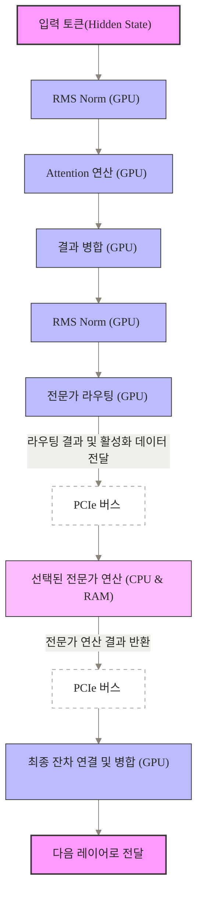
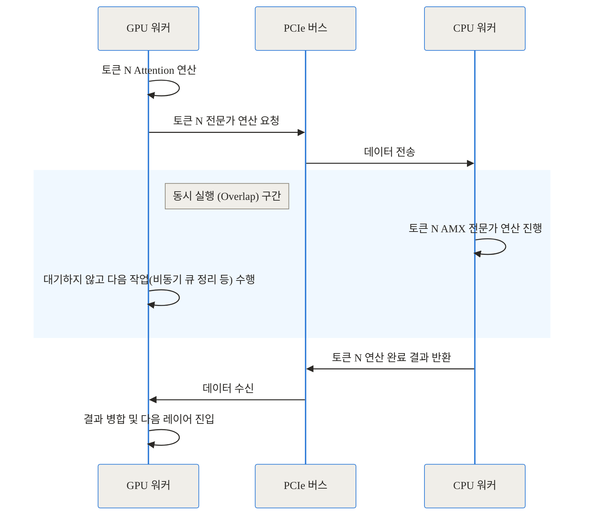
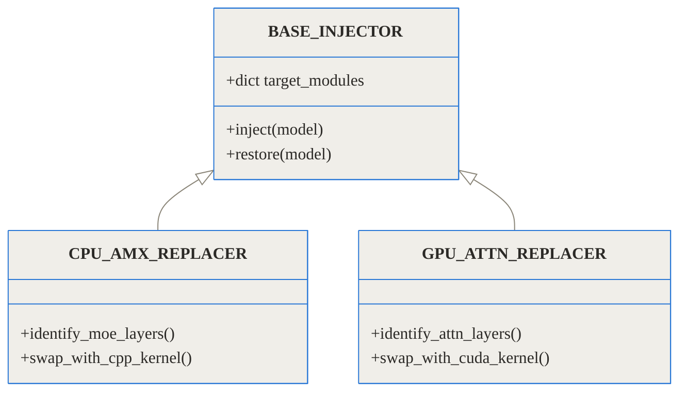
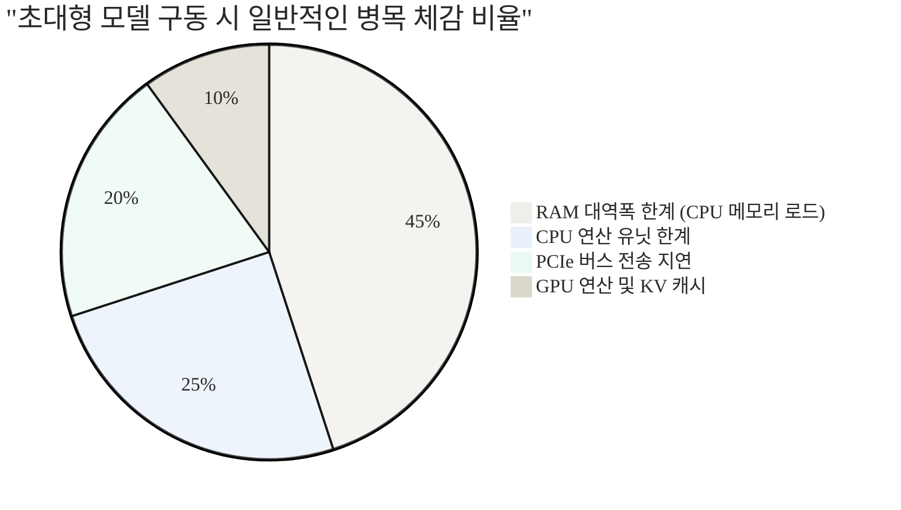

[관련 리소스]
- [KTransformers GitHub 저장소](https://github.com/kvcache-ai/ktransformers)
- [KTransformers 공식 문서](https://kvcache-ai.github.io/ktransformers)
- [MADSys Lab SOSP '25 논문: KTransformers](https://madsys.cs.tsinghua.edu.cn/publication/ktransformers-unleashing-the-full-potential-of-cpu/gpu-hybrid-inference-for-moe-models/)

---

## KTransformers, 한 줄 요약 (TL;DR)

- 초대형 언어 모델의 연산 중 고대역폭이 필요한 Attention 연산은 GPU에, 용량이 많이 필요한 전문가(Experts) 연산은 CPU와 시스템 메모리에 분산 배치합니다.
- 최신 CPU의 특수 벡터 연산 명령어(Intel AMX 등)와 캐시 친화적인 타일링 메모리 구조를 적용하여 CPU 연산 병목을 획기적으로 줄였습니다.
- 8대의 H100 GPU 클러스터가 필요했던 DeepSeek-R1(671B) 모델을 단일 RTX 4090(24GB VRAM)과 넉넉한 RAM을 갖춘 데스크톱에서 초당 10~14 토큰의 속도로 구동하게 해줍니다.

---

## 1. 배경과 문제 정의: 거대 모델과 VRAM의 거대한 장벽

최근 오픈소스 언어 모델 생태계는 폭발적으로 발전하고 있습니다. 특히 수천억 개의 파라미터를 갖춘 DeepSeek-V3, R1 혹은 Qwen과 같은 모델들은 상용 모델에 필적하는 뛰어난 성능을 자랑합니다. 하지만 개발자나 기획자가 이 모델들을 사내망이나 개인 워크스테이션에서 직접 구동해보려 할 때면 곧바로 거대한 하드웨어의 장벽에 부딪히게 됩니다. 바로 VRAM(비디오 메모리) 용량 문제입니다.

파라미터가 6,710억 개에 달하는 모델을 구동하기 위해서는 16비트 부동소수점(FP16) 기준으로 약 1.3TB의 메모리가 필요합니다. 이를 4비트로 강력하게 양자화(Quantization)하더라도 여전히 300GB 이상의 공간이 요구됩니다. 일반적인 최고 사양 소비자용 GPU인 RTX 4090의 VRAM이 24GB에 불과하다는 점을 생각하면, 이 수치는 절망적입니다. 이를 해결하기 위해 기존에는 대당 수천만 원에 달하는 서버용 GPU를 여러 대 묶어 클러스터를 구축해야만 했습니다.

물론, 부족한 VRAM을 극복하기 위한 오픈소스 진영의 시도가 없었던 것은 아닙니다. 가장 널리 알려진 도구인 `llama.cpp`는 모델의 일부 레이어를 GPU에 적재하고, 남은 레이어는 시스템 메모리(DRAM)에 올린 뒤 CPU 연산을 통해 처리하는 오프로딩(Offloading) 방식을 제공해 왔습니다. 하지만 이 물리적 분할 방식은 심각한 고통을 수반합니다.

순차적으로 모델의 레이어를 통과하는 과정에서 GPU가 연산을 마치면 결과를 느린 PCIe 버스를 통해 CPU로 넘겨야 하고, CPU는 GPU에 비해 턱없이 부족한 메모리 대역폭과 연산량(FLOPs)으로 인해 심각한 병목 현상을 일으킵니다. 결국 토큰 하나를 생성하는 데 수 초가 걸리는 비실용적인 속도에 머물게 되는 것이죠. 모델의 앞부분 레이어는 빠르지만 뒷부분 레이어에서 교통 체증이 발생하는 셈입니다.

이러한 상황에서 KTransformers(kvcache-ai/ktransformers)는 레이어를 물리적으로 반 자르는 일차원적인 접근을 버리고, 모델의 구조적 특성 자체를 해부하여 새로운 해답을 제시했습니다.

---

## 2. 개념 쉽게 이해하기: 밀도와 희소성의 영리한 분업

KTransformers의 중심 아이디어를 이해하기 위해서는 최근 거대 모델들이 채택하고 있는 전문가 혼합(MoE, Mixture-of-Experts) 아키텍처의 특징을 알아야 합니다. 

MoE 모델은 단일한 거대한 신경망이 아니라, 여러 개의 작은 서브 신경망(전문가)들이 병렬로 늘어선 형태를 띱니다. 입력된 데이터(토큰)에 따라 전체 전문가 중 가장 적합한 소수의 전문가만 선택되어 연산을 수행합니다. 예를 들어 64개의 전문가 그룹이 있다면 한 토큰을 처리할 때 단 2개의 전문가만 활성화되는 식입니다. 전체 모델의 덩치는 600B 단위로 거대하지만, 실제 한 번의 연산에 참여하는 활성 파라미터는 40B 수준에 불과한 희소성(Sparsity)을 가지게 됩니다.

반면, 문맥을 이해하고 단어 간의 관계를 파악하는 Attention 연산은 모델에 입력된 모든 토큰이 서로 상호작용해야 하므로 모든 파라미터가 쉴 새 없이 움직이는 밀집(Dense) 연산입니다.

KTransformers는 바로 이 점을 파고들었습니다. 

이 구조는 마치 대형 종합병원의 진단 시스템과 같습니다. 
응급 환자(입력 토큰)가 들어오면 병원의 중앙 관제 센터(GPU)가 전체적인 바이탈 사인과 병력을 종합하여 문맥을 파악합니다. 이곳은 처리 속도와 대역폭이 생명이므로 가장 비싸고 빠른 장비를 씁니다. (이것이 Attention 연산입니다.) 
이후 구체적인 세부 질환을 진단하기 위해 64명의 세부 전문의(MoE Experts)가 대기하고 있는 거대한 연구동(시스템 메모리, RAM)으로 데이터를 보냅니다. 환자의 증상에 맞는 전문의 2명만 호출되어 진단을 내리고 결과를 다시 중앙 센터로 보냅니다. 전문의 전원을 비싸고 좁은 관제 센터(VRAM)에 밀어 넣을 필요가 없는 것이죠.

즉, VRAM에는 적은 용량을 차지하지만 높은 메모리 대역폭과 막대한 연산량이 필요한 Attention 모듈과 KV 캐시를 상주시키고, 무려 300GB 이상의 거대한 용량을 차지하지만 한 번에 소수만 호출되는 MoE 전문가 레이어는 저렴하고 광활한 시스템 메모리에 배치하여 CPU가 계산하도록 분업화한 것입니다. 

---

## 3. 작동 원리 심층 (Under the Hood)

단순히 데이터를 쪼개어 배치하는 것만으로는 압도적인 성능을 낼 수 없습니다. KTransformers가 이기종 컴퓨팅 환경에서 경이로운 속도를 낼 수 있었던 구체적인 내부 구조와 최적화 기술들을 단계별로 파헤쳐 보겠습니다.

### 3.1. 이기종 연산 파이프라인 아키텍처

KTransformers는 사용자 요청을 처리할 때 GPU와 CPU 사이에서 데이터를 유기적으로 교환합니다. 아래는 단일 토큰이 모델의 한 트랜스포머 블록을 통과할 때의 데이터 흐름을 보여주는 다이어그램입니다.



위 흐름에서 볼 수 있듯, GPU는 밀도 높은 Attention과 라우팅(어떤 전문가를 호출할지 결정하는 작업)까지 담당합니다. 라우팅 결과가 나오면, 64개의 전문가 행렬 중 실제로 계산해야 할 몇 개의 행렬 연산 지시만을 CPU로 내립니다. 이를 통해 PCIe 버스를 타고 넘어가는 데이터의 양을 최소화합니다.

### 3.2. CPU 연산의 한계 돌파: AMX 커널과 타일링 구조

CPU로 무거운 행렬 곱셈을 넘겼다 하더라도, 기존 방식대로 연산하면 속도가 심각하게 저하됩니다. KTransformers는 인텔 사파이어 래피즈(Sapphire Rapids) 프로세서 이후 도입된 AMX(Advanced Matrix Extensions) 명령어 셋을 적극 활용합니다. AMX는 CPU 내부에 탑재된 인공지능 가속 전용 타일 매트릭스 곱셈 유닛입니다.

단순히 AMX를 호출하는 데 그치지 않고, 메모리 병목을 피하기 위해 **타일링 어웨어 메모리 레이아웃(Tiling-aware Memory Layout)**을 고안했습니다. L1, L2, L3 캐시의 크기에 정확히 맞물려 데이터가 한 번에 쏙 들어가도록 거대한 가중치 행렬을 잘게 쪼개어(Tiling) 저장합니다.


이렇게 하면 연산 유닛이 데이터를 기다리느라 놀고 있는 시간을 없앨 수 있습니다. 한 논문에 따르면 이 메모리 재배치 구조 덕분에 CPU의 L1 캐시 적중률이 극도로 높아져, CPU의 한계치에 가까운 TOPS(초당 조 번의 연산) 성능을 이끌어냅니다.

### 3.3. 비동기 스케줄링과 전문가 지연(Expert Deferral)

여기서 가장 놀라운 기술적 성취가 등장합니다. 일반적인 파이프라인에서는 CPU가 전문가 계층의 연산을 수행하는 동안 GPU는 아무것도 하지 않고 대기해야 합니다. 이는 막대한 컴퓨팅 자원의 낭비입니다.

KTransformers는 **전문가 지연(Expert Deferral)**이라는 영리한 비동기 알고리즘을 도입했습니다. 현재 레이어의 전문가 연산을 CPU에 맡겨둔 상태에서, GPU가 결과를 마냥 기다리지 않고 미리 다음 토큰의 Attention 연산을 준비하거나 백그라운드 작업을 처리하도록 스케줄링하는 방식입니다.



이러한 CPU-GPU 중첩(Overlapping) 기술 덕분에 CPU의 활용률이 기존 70% 대에서 거의 100%에 가깝게 치솟으며, 전체 시스템의 처리량(Throughput)이 극대화됩니다.

### 3.4. 커널 주입(Kernel Injection) 프레임워크

KTransformers는 개발자가 PyTorch 코드를 처음부터 다시 짤 필요가 없도록, 기존 모델의 특정 모듈만 런타임에 바꿔치기하는 유연한 프레임워크를 제공합니다. 이를 커널 주입(Kernel Injection)이라고 부릅니다.



Hugging Face의 `transformers` 라이브러리로 모델을 불러온 뒤, 단 몇 줄의 코드만 추가하면 원래 모델의 순정 파이썬 코드가 KTransformers가 C++과 CUDA로 고도로 최적화한 커널로 대체됩니다.


> KTransformers의 이기종 주입 프레임워크는 사용자 코드의 수정 없이 내부 연산 모듈만 투명하게 최적화 코드로 치환합니다.

---

## 4. 구현과 사용 디테일: 어떻게 설치하고 구동할까?

이러한 복잡한 내부 구조와 달리 사용법은 직관적으로 설계되었습니다. 로컬 환경에서 KTransformers를 설정하고 구동하는 구체적인 과정을 살펴보겠습니다.

### 환경 요구 사항
성능을 최대로 이끌어내기 위해 하드웨어 제약이 존재합니다.
- **운영체제**: Linux 환경 (Ubuntu 권장)
- **CPU**: Intel AMX 명령어셋을 지원하는 프로세서(4세대 제온 Sapphire Rapids 이상) 또는 AVX-512를 원활하게 지원하는 최신 AMD EPYC 프로세서. (RAM 대역폭이 넓을수록 극도로 유리합니다.)
- **GPU**: 24GB 이상의 VRAM을 갖춘 GPU (RTX 3090, 4090 등)
- **RAM**: 구동할 모델의 양자화 크기 + 30GB 여유 공간 (예: 671B INT8 모델 구동 시 1TB 이상의 램 필요, INT4 구동 시 최소 400GB 필요)

### 설치 과정
저장소를 복제하고 빌드 스크립트를 실행하여 C++ 커널을 컴파일해야 합니다.

```bash
git clone https://github.com/kvcache-ai/ktransformers.git
cd ktransformers
bash install.sh
```

정상적으로 컴파일과 설치가 끝났다면 버전 확인 명령어로 검증합니다.

```bash
ktransformers --version
```

### 로컬 챗 서버 실행
KTransformers는 자체적인 CLI 도구를 제공합니다. 예를 들어 DeepSeek-R1 양자화 모델을 다운로드받아 로컬 챗 서버를 띄우려면 다음과 같이 실행합니다.

```bash
kt run --model_path path/to/DeepSeek-V3-Base \
       --gguf_path path/to/DeepSeek-V3-GGUF \
       --max_new_tokens 1024
```

내부적으로 이 명령어는 앞서 설명한 `BASE_INJECTOR`를 통해 Hugging Face 모델 껍데기를 불러온 후, Attention은 CUDA 최적화 커널(SGLang 연계)로, MoE 레이어는 CPU 양자화 커널(GGUF 활용)로 투명하게 주입하여 실행합니다.

---

## 5. 실전 활용 시나리오

실제 현업에서는 어떤 상황에 KTransformers가 가장 강력한 무기가 될까요?

### 시나리오 1: 최고 수준의 사내 온프레미스 보안 AI 구축
금융권이나 의료계, 또는 핵심 기술을 다루는 연구소에서는 법적인 이유나 보안 지침 때문에 퍼블릭 클라우드 API(OpenAI, Anthropic 등)로 데이터를 전송할 수 없습니다. 따라서 사내망(On-Premise)에 자체 AI를 두어야 합니다.
하지만 기존에는 오픈소스 생태계 최고봉인 DeepSeek-R1(671B)을 로컬에 올리려면 H100 8대가 꽂힌 수천만 원대 서버 장비가 필수였습니다. KTransformers를 활용하면 1TB 메모리를 장착한 듀얼 제온 CPU 워크스테이션에 RTX 4090 단 한 장만 꽂아도 완벽하게 구동 가능합니다. 모델 내부 구조를 디버깅하거나 사내 규정 문서를 안전하게 RAG(검색 증강 생성)하는 용도로 최적입니다.

### 시나리오 2: 로컬 자원을 활용한 파인튜닝(LoRA)
KTransformers는 추론뿐만 아니라 파인튜닝에도 이기종 컴퓨팅을 지원합니다. 100B 이상의 거대 모델을 파인튜닝할 때 파라미터 업데이트가 일어나는 어댑터(Adapter) 부분만 GPU VRAM에 올려 빠르게 학습시키고, 동결된 거대 기본 파라미터는 CPU RAM에서 Forward Pass 연산만 하도록 분리할 수 있습니다. 덕분에 개인이 보유한 단일 데스크톱에서도 100B 단위 모델의 도메인 특화 학습이 가능해집니다.

---

## 6. 벤치마크 및 기존 방식과의 비교

과연 KTransformers는 기존 도구에 비해 얼마나 빠른 걸까요? 동일한 24GB VRAM 환경(GPU 물리적 제약)에서 기존 방식과 KTransformers의 접근 방식을 표로 비교해 보았습니다.

| 비교 항목 | vLLM (단일 GPU) | llama.cpp (레이어 분할) | KTransformers (아키텍처 분할) |
| :--- | :--- | :--- | :--- |
| **671B 구동 가능 여부** | 불가능 (OOM 에러 발생) | 가능 (RAM 오프로딩 활용) | 가능 (CPU/GPU 이기종 분할) |
| **분할 방식** | 미지원 (Multi-GPU 필수) | 트랜스포머 레이어 단위 순차 분할 | Attention(GPU) / MoE(CPU) 분할 |
| **연산 중첩 (Overlap)**| 해당 없음 | 불가능 (CPU 계산 시 GPU 대기) | 가능 (전문가 지연 방식 비동기 처리) |
| **주요 활용 사례** | 대규모 트래픽 클라우드 서빙 | 저사양 기기에서의 소형 모델 구동 | 단일 노드에서의 초대형 MoE 모델 구동 |

<br>

가장 확실한 비교 대상인 `llama.cpp`와 속도를 비교한 데이터입니다. (환경: 1x RTX 4090 24GB + 2x AMD EPYC 9355)

```chartjs
{
  "type": "bar",
  "data": {
    "labels": ["llama.cpp (Q8 양자화)", "KTransformers (이기종 혼합)"],
    "datasets": [
      {
        "label": "Prefill 속도 (tokens/s)",
        "data": [6.1, 27.6],
        "backgroundColor": ["rgba(153, 102, 255, 0.5)", "rgba(54, 162, 235, 0.8)"]
      },
      {
        "label": "Decode 속도 (tokens/s)",
        "data": [3.2, 14.1],
        "backgroundColor": ["rgba(153, 102, 255, 0.8)", "rgba(255, 99, 132, 0.8)"]
      }
    ]
  },
  "options": {
    "responsive": true,
    "plugins": {
      "title": {
        "display": true,
        "text": "DeepSeek-R1(671B) 단일 노드 추론 성능 비교"
      }
    }
  }
}
```

결과를 보면 KTransformers가 프롬프트를 최초로 소화하는 Prefill 속도에서 약 4.5배, 답변을 생성하는 Decode 속도에서 4배 이상 빠릅니다. 이 차이는 바로 CPU AMX 최적화와 메모리 타일링, 그리고 비동기 스케줄링이 만들어낸 기술의 격차입니다.

---

## 7. 솔직한 평가: 한계와 트레이드오프

이처럼 강력한 기능을 제공하지만, KTransformers가 언제나 정답인 것은 아닙니다. 기술의 본질적인 한계와 솔직한 트레이드오프를 짚어보겠습니다.

1. **클라우드 대규모 서빙에는 부적합합니다.**
   KTransformers는 '배치 사이즈가 작을 때(Low Concurrency)' 단일 사용자의 생성 지연 시간을 최소화하는 데 극도로 최적화되어 있습니다. 수십, 수백 명의 사용자가 동시에 API를 호출하는 서비스 환경이라면 대규모 서버 클러스터를 구성하여 vLLM이나 SGLang을 단독으로 사용하는 것이 훨씬 유리합니다.

2. **메모리 채널과 메인보드 제약**
   CPU가 아무리 AMX 연산을 빠르게 수행해도, 시스템 메모리에서 데이터를 퍼 올리는 속도(RAM Bandwidth)가 느리면 병목이 생깁니다. KTransformers의 진가를 발휘하려면 일반적인 데스크톱용 2채널 메모리 구성으로는 부족하며, 8채널 또는 12채널을 지원하는 서버용 듀얼 소켓 메인보드와 대용량 RAM이 뒷받침되어야 합니다. 

3. **종속적인 하드웨어 아키텍처**
   극단적인 최적화를 위해 특정 CPU 제조사의 하드웨어 명령어셋(Intel AMX, AVX-512)에 의존합니다. 따라서 구형 CPU 환경이나 ARM 기반의 Mac(Apple Silicon) 환경에서는 KTransformers의 핵심 가속 기술을 활용하기 어렵습니다.



전체 병목의 절반 가까이가 여전히 RAM 대역폭에서 발생합니다. KTransformers는 연산 유닛의 한계와 PCIe 지연을 소프트웨어 알고리즘으로 극복한 훌륭한 사례이지만, 물리적인 메모리 속도의 한계까지 마법처럼 없애주지는 못합니다.

---

## 8. 마무리: 로컬 AI 생태계의 새 지평

KTransformers는 단순히 '코드를 조금 빠르게 최적화한 도구'가 아닙니다. 하드웨어의 구조와 모델의 아키텍처(MoE) 양쪽의 본질을 정확히 꿰뚫어 보고, 장점들만 결합하여 완전히 새로운 패러다임을 제시한 엔지니어링의 정수입니다.

과거에는 자본력이 풍부한 빅테크 기업이나 대형 연구소만이 거대 모델의 내부를 뜯어보고 실험할 수 있었습니다. 하지만 KTransformers 덕분에 약간의 노력과 상대적으로 저렴한 장비만으로도 누구나 600B 급 모델을 온프레미스에서 쾌적하게 다룰 수 있는 길이 열렸습니다. 모델 경량화(양자화) 기술과 이러한 하드웨어 이기종 분산 프레임워크가 계속 발전한다면, 멀지 않은 미래에 일반적인 고사양 게이밍 PC에서도 초거대 AI가 온전히 당신만의 비서로 작동하는 날이 올 것입니다.

## 자주 묻는 질문 (FAQ)

### KTransformers는 어떤 하드웨어 환경에서 가장 잘 작동하나요?

성능을 극대화하기 위해서는 Intel AMX 명령어셋을 지원하는 4세대 제온 이상의 CPU나 AVX-512를 지원하는 최신 AMD EPYC 프로세서가 필요합니다. 또한 Attention 연산을 처리할 24GB 이상의 VRAM을 가진 단일 GPU(예: RTX 3090/4090)와 모델의 가중치를 담을 광활한 시스템 RAM(일반적으로 400GB~1TB 이상)이 요구됩니다.

### 기존에 많이 쓰이던 llama.cpp와 가장 큰 차이점은 무엇인가요?

llama.cpp는 모델의 레이어를 앞뒤로 잘라 순차적으로 GPU와 CPU에 할당하므로 필연적으로 통신 병목이 발생합니다. 반면 KTransformers는 모델의 Attention 구조(GPU 적재)와 MoE 전문가 구조(CPU 적재)를 논리적으로 분할하고 비동기적으로 동시에 연산하도록 설계되어 압도적인 속도 향상을 이루어냈습니다.

### KTransformers는 모든 종류의 오픈소스 LLM을 다 지원하나요?

다양한 모델을 지원하도록 설계되었으나, 가장 큰 강점을 발휘하는 것은 모델 파라미터가 성소성(Sparsity)을 가지는 MoE(Mixture-of-Experts) 아키텍처 모델들입니다. 대표적으로 DeepSeek-V3/R1, Qwen 모델 계열 등에서 극한의 최적화된 성능을 발휘합니다.

### 수많은 사용자가 동시에 접속하는 클라우드 웹 서비스용으로 적합한가요?

적합하지 않습니다. KTransformers는 극도로 제한된 자원에서 단일 사용자(또는 매우 적은 수의 배치)의 추론 지연 시간을 줄이는 데 최적화되어 있습니다. 대규모 동시 트래픽을 처리해야 하는 프로덕션 환경이라면 Multi-GPU 클러스터를 구성하여 vLLM이나 SGLang을 사용하는 것이 훨씬 효율적입니다.

### 설치 과정에서 C++ 컴파일이 필요한데, 설정이 많이 복잡한가요?

파이썬 패키지를 단순 설치하는 것보다는 진입 장벽이 조금 있습니다. 하드웨어에 맞춰 최적화된 커널을 빌드해야 하므로 Linux 환경에서 제공되는 `install.sh` 스크립트를 통해 소스 코드를 직접 컴파일해야 하며, 이 과정에서 C++ 빌드 환경(GCC, CMake 등)과 CUDA 툴킷이 사전에 올바르게 세팅되어 있어야 합니다.


## References
- [https://github.com/kvcache-ai/ktransformers](https://github.com/kvcache-ai/ktransformers)
- [https://kvcache-ai.github.io/ktransformers](https://kvcache-ai.github.io/ktransformers)
- [https://madsys.cs.tsinghua.edu.cn/publication/ktransformers-unleashing-the-full-potential-of-cpu/gpu-hybrid-inference-for-moe-models/](https://madsys.cs.tsinghua.edu.cn/publication/ktransformers-unleashing-the-full-potential-of-cpu/gpu-hybrid-inference-for-moe-models/)
