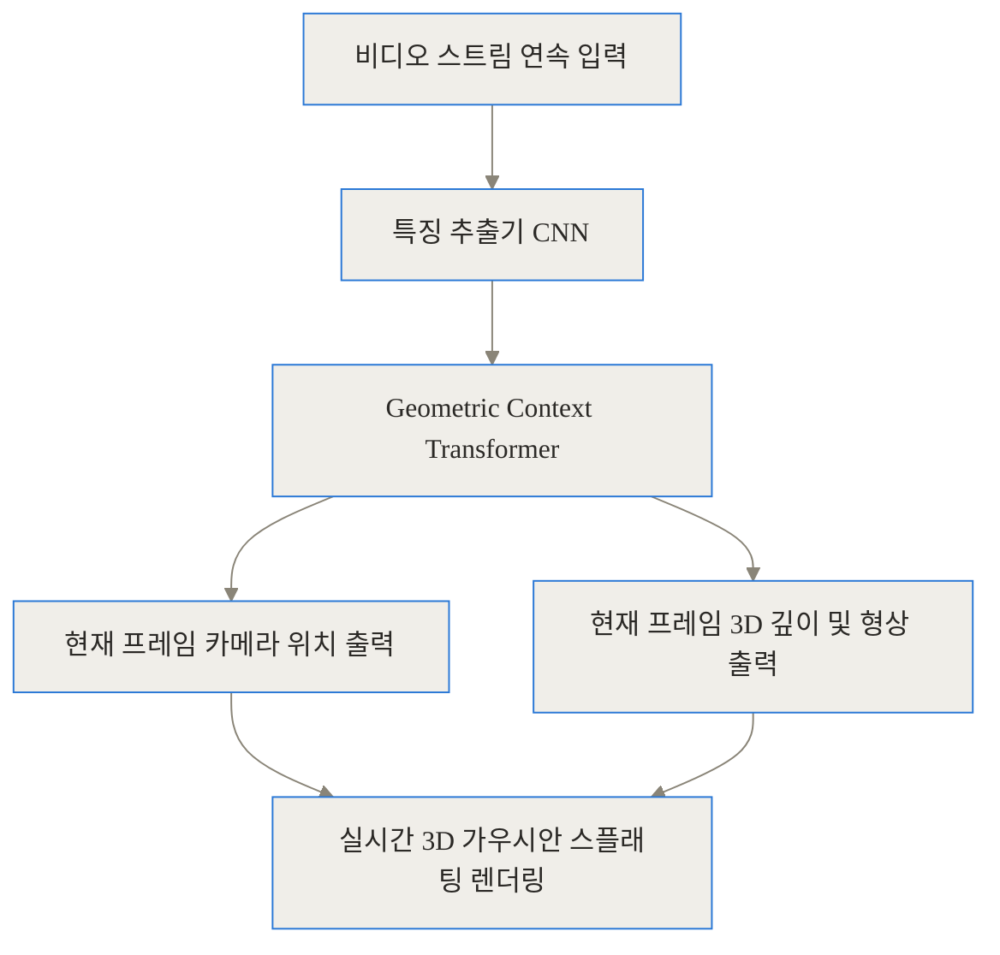
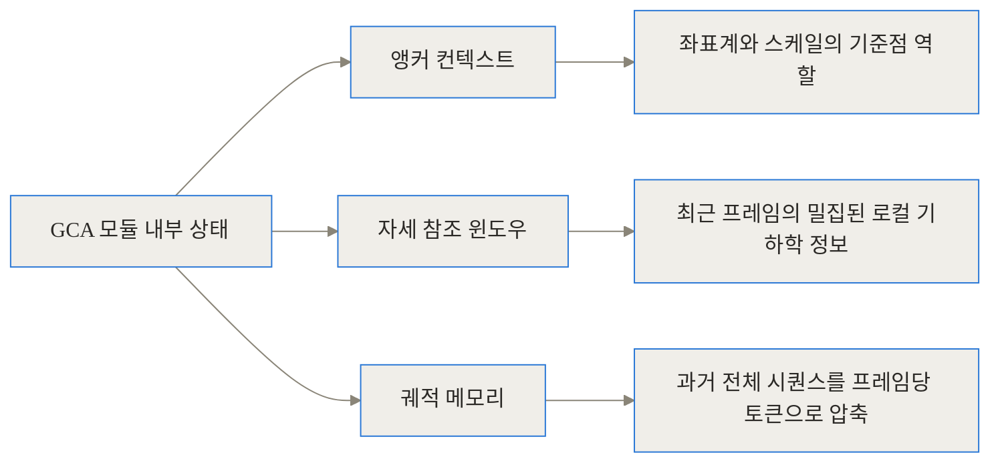
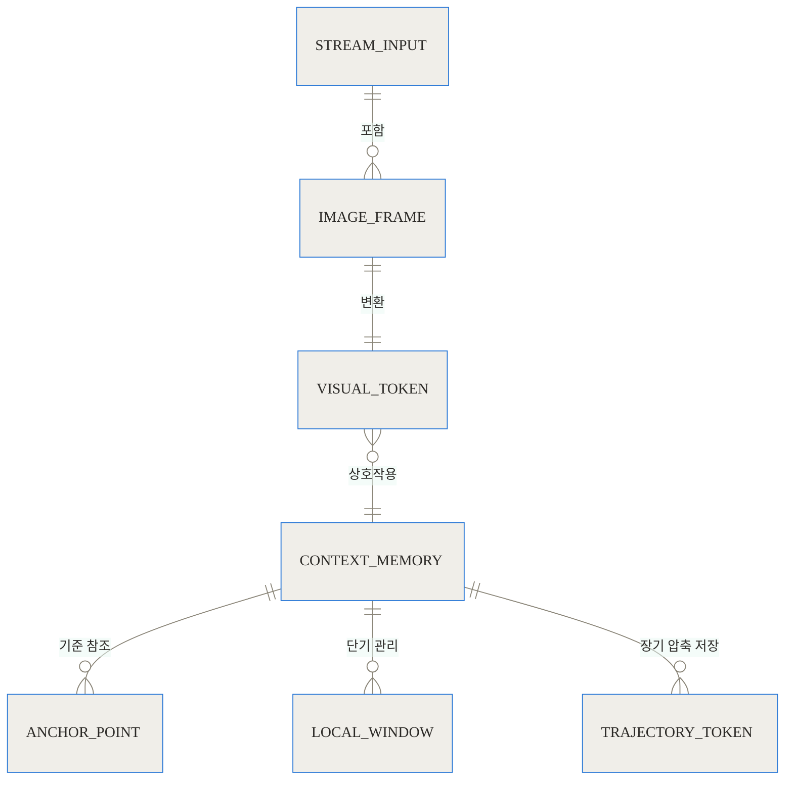
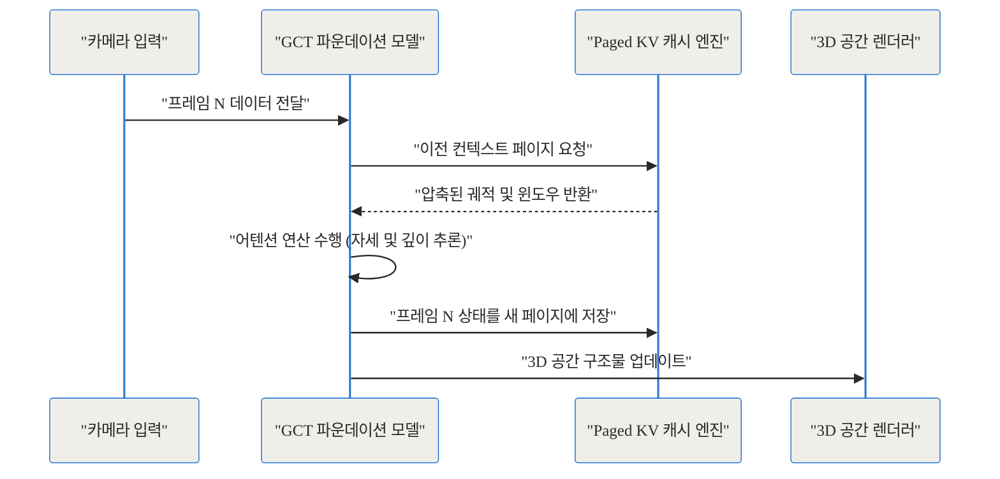
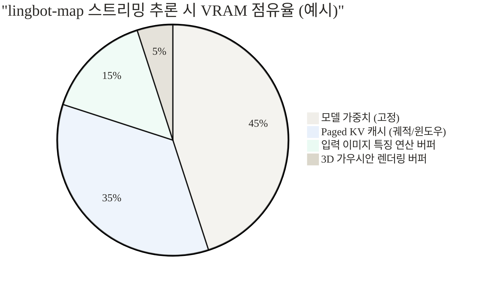

## 관련 링크 정리

- [lingbot-map GitHub 저장소](https://github.com/Robbyant/lingbot-map)
- [Robbyant 공식 기술 웹사이트](https://technology.robbyant.com/lingbot-map)
- [논문: Geometric Context Transformer for Streaming 3D Reconstruction](https://arxiv.org/abs/2604.14141)
- [Hugging Face 모델 가중치](https://huggingface.co/robbyant/lingbot-map)

## 도입 및 3줄 요약 (TL;DR)

로봇이 미지의 공간에 들어섰을 때, 고가의 라이다(LiDAR) 센서 없이 평범한 카메라 하나만으로 주변의 3D 지도를 실시간으로 그릴 수 있을까요? Ant Group 산하의 로봇 공학 및 구체화된 인공지능(Embodied AI) 기업인 Robbyant가 공개한 **lingbot-map**은 이 질문에 대한 가장 최신의 해답입니다. 복잡한 사후 최적화 과정 없이, 영상을 보는 즉시 공간을 이해하는 이 놀라운 시스템의 핵심을 세 줄로 요약하면 다음과 같습니다.

- **순방향(Feed-forward) 단일 패스 구조:** 반복적인 최적화 연산 없이, 영상을 스트리밍으로 입력받는 즉시 카메라 자세와 3D 깊이 지도를 20 FPS 수준으로 실시간 추론합니다.
- **세 가지 구조화된 기억 장치:** 앵커(Anchor), 자세 참조 윈도우, 궤적 메모리로 구성된 'Geometric Context Attention'을 통해 과거의 시각적 맥락을 효율적으로 압축하고 유지합니다.
- **무한한 확장성:** FlashInfer를 활용한 Paged KV 캐시 기술을 도입하여, 1만 프레임이 넘는 긴 영상을 처리해도 메모리 점유율이 일정하게 유지됩니다.

이 글에서는 lingbot-map이 기존 3D 재구성 기술이 겪던 고통을 어떻게 해결했는지, 그 내부 아키텍처는 어떻게 설계되었는지, 그리고 실제 현업에서 어떻게 활용할 수 있는지 깊이 파헤쳐 보겠습니다.

## 배경과 문제 정의: 기존 3D 재구성 기술의 한계

공간을 3D로 스캔하고 재구성하는 기술은 자율주행, AR/VR, 로보틱스 분야에서 필수적입니다. 하지만 기존의 기술들은 각기 다른 뚜렷한 한계점, 이른바 '페인 포인트(Pain Point)'를 가지고 있었습니다.

### 1. 선 촬영, 후 처리의 고통 (Photogrammetry 및 NeRF)

가장 널리 쓰이는 사진 측량(Photogrammetry)이나 초기 NeRF(Neural Radiance Fields), 그리고 최근 유행하는 가우시안 스플래팅(Gaussian Splatting) 최적화 방식은 기본적으로 **오프라인 처리**를 전제로 합니다. 공간을 이리저리 걸어 다니며 수천 장의 사진을 찍은 뒤, 고성능 GPU가 장착된 컴퓨터에 데이터를 밀어 넣고 몇 시간 동안 기계가 최적화 연산을 수행하기를 기다려야 합니다. 
이러한 방식은 완성된 3D 맵의 품질은 매우 높지만, 움직이는 로봇이 실시간으로 눈앞의 장애물을 파악하고 경로를 수정하는 데에는 전혀 쓸모가 없습니다.

### 2. SLAM의 궤적 이탈과 취약성

로봇 분야에서 전통적으로 사용해 온 동시적 위치 추정 및 지도 작성(SLAM) 기술은 실시간 처리를 목표로 합니다. 카메라 이미지에서 특징점을 추출하고, 이전 프레임과 비교하여 이동 경로를 계산합니다. 
하지만 이 방식은 벽지 무늬가 없는 하얀 벽이나 어두운 복도처럼 '특징점'을 찾기 힘든 환경에서는 심각한 오류를 일으킵니다. 한 번 추적을 잃으면 전체 3D 맵이 뒤틀려버리는 '드리프트(Drift)' 현상이 발생하며, 이를 보정하기 위해 백엔드에서 수행하는 글로벌 최적화(Bundle Adjustment)는 프레임이 누적될수록 연산량이 기하급수적으로 폭발합니다.

### 3. 인공지능 파운데이션 모델의 메모리 폭발

최근에는 대규모 데이터로 학습된 인공지능이 영상의 기하학적 구조를 예측하는 방식이 등장했습니다. 하지만 스트리밍 영상 전체를 트랜스포머(Transformer) 모델에 밀어 넣으면, 시퀀스 길이가 길어질수록 어텐션(Attention) 연산에 필요한 메모리가 제곱으로 늘어납니다. 몇 분만 영상을 처리해도 VRAM 용량을 초과하여 시스템이 멈춰버리는 문제가 발생했습니다.

lingbot-map은 바로 이러한 세 가지 문제를 동시에 해결하기 위해 탄생했습니다. 오프라인 최적화 없이 스트리밍으로 처리하고, 수작업 규칙이 아닌 인공지능 파운데이션 모델로 특징점 없는 공간을 이해하며, 혁신적인 메모리 관리로 무한에 가까운 연속 프레임을 감당합니다.

## 개념 쉽게 이해하기: 눈을 감고 방을 걷는 비유

lingbot-map의 동작 원리를 이해하기 위해, 여러분이 눈을 가린 채로 처음 가보는 거대한 방을 걸어 다니며 머릿속으로 방의 지도를 그린다고 상상해 보십시오.

만약 전통적인 최적화 방식이라면, 방 안의 모든 물건을 손으로 더듬어 수백 장의 스케치를 그린 뒤, 방을 나와 넓은 책상에 스케치를 모두 펼쳐놓고 퍼즐을 맞추듯 전체 지도를 그리는 것과 같습니다. 정확하지만 시간이 너무 오래 걸립니다.

반면 lingbot-map의 방식은 다릅니다. 여러분은 걷기 시작한 첫 번째 위치(기준점, Anchor)를 굳게 기억합니다. 그리고 최근 몇 걸음 동안 발에 닿았던 카펫의 촉감이나 의자의 위치(단기 기억, Window)를 선명하게 유지합니다. 수백 걸음을 걸어오면서 스쳐 지나간 수많은 가구와 벽의 정보는 아주 작게 요약하여 '저쪽 구석에는 책장이 있었지'라는 식의 압축된 덩어리(장기 기억, Trajectory)로 묶어서 머릿속에 담아둡니다.

이렇게 세 가지 기억(기준점, 단기 기억, 요약된 장기 기억)만 효율적으로 저글링하면, 방을 1만 번 걸어 다녀도 머리가 과부하에 걸리지 않고 현재 내 위치와 주변 공간의 3D 형태를 즉각적으로 그려낼 수 있습니다. 이것이 바로 lingbot-map이 채택한 '기하학적 컨텍스트 어텐션(Geometric Context Attention)'의 본질입니다.

## 작동 원리 심층 (Under the Hood)

이 프로젝트의 아키텍처는 크게 비디오 스트림을 입력받는 모듈, 컨텍스트를 관리하는 트랜스포머, 그리고 메모리 캐시를 최적화하는 계층으로 나뉩니다. 이제 그 내부로 깊이 들어가 보겠습니다.

### 1. 전체 파이프라인 개요

lingbot-map은 철저하게 순방향(Feed-forward) 구조를 따릅니다. 영상의 각 프레임이 들어오면 과거의 상태를 참조하여 현재 프레임의 결과물을 찍어내고 끝냅니다. 미래의 프레임을 엿보거나 과거의 프레임을 다시 수정하는 최적화 루프가 없습니다.



입력된 이미지는 특징 추출기를 거쳐 토큰으로 변환되고, 이 토큰들은 GCT(Geometric Context Transformer) 모델로 전달됩니다. GCT는 카메라가 지금 어디로 움직였는지(Pose)와 눈앞의 사물들이 얼마나 떨어져 있는지(Depth)를 즉각 출력하며, 이는 최종 3D 환경 구축을 위한 가우시안 스플래팅 데이터로 실시간 누적됩니다.

### 2. 기하학적 컨텍스트 어텐션 (Geometric Context Attention, GCA)

가장 중요한 혁신은 GCA(Geometric Context Attention) 구조입니다. 스트리밍 환경에서는 '무엇을 버리고 무엇을 남길 것인가'가 핵심입니다. GCA는 다음과 같이 3개의 구조화된 공간을 유지합니다.



1. **앵커 컨텍스트 (Anchor):** 단일 카메라를 사용하면 절대적인 크기(Scale)와 좌표계의 기준을 잡기 어렵습니다. 앵커는 초기 시점의 정보를 강하게 고정하여 전체 공간의 좌표계가 틀어지는 것을 방지합니다. 일종의 '나침반' 역할입니다.
2. **자세 참조 윈도우 (Pose-reference Window):** 가장 최근에 지나온 N개의 프레임 정보를 높은 해상도로 유지합니다. 바로 직전의 움직임과 미세한 기하학적 변화를 추적하는 단기 기억 장치입니다.
3. **궤적 메모리 (Trajectory Memory):** 윈도우를 벗어난 오래된 과거 프레임들은 버려지지 않고 고도로 압축된 토큰 형태로 변환되어 궤적 메모리에 쌓입니다. 덕분에 수천 프레임 전에 방문했던 장소로 다시 돌아왔을 때(루프 클로저), 압축된 기억을 꺼내어 누적된 오차(Drift)를 교정할 수 있습니다.

### 3. 데이터 모델 간의 관계 구조

이러한 기억 장치들이 코어 시스템 내에서 어떻게 연결되어 있는지 ER 다이어그램으로 살펴보겠습니다.



### 4. 무한한 연속성을 위한 Paged KV 캐시 (FlashInfer 통합)

트랜스포머 기반 모델이 긴 영상을 처리할 때 부딪히는 물리적 장벽은 VRAM입니다. 어텐션 연산을 위해 과거의 Key와 Value 값을 캐시(KV Cache)로 들고 있어야 하는데, 프레임이 1만 개를 넘어가면 이 캐시 크기가 기하급수적으로 팽창합니다.

lingbot-map은 대형 언어 모델(LLM) 서빙에서 주로 쓰이는 **Paged KV Cache** 기술을 컴퓨터 비전 스트리밍 추론에 성공적으로 도입했습니다. 이를 위해 최신 어텐션 라이브러리인 `FlashInfer`를 백엔드로 사용합니다.

운영체제가 메모리를 고정된 크기의 '페이지' 단위로 나누어 파편화 없이 효율적으로 관리하듯, Paged KV 캐시는 GPU VRAM을 블록 단위로 할당하고 해제합니다. 새로운 프레임이 들어올 때마다 전체 메모리를 재할당할 필요 없이, 미리 할당된 빈 페이지에 새로운 궤적 토큰만 끼워 넣으면 됩니다. 

이 과정을 시퀀스 다이어그램으로 보면 다음과 같습니다.



결과적으로 프레임 수가 10,000을 넘어가도 메모리 사용량은 선형적 증가가 아닌 **거의 일정한 수준**을 유지하며, 518x378 해상도 기준 약 20 FPS의 안정적인 실시간 스트리밍이 가능해집니다.

## 벤치마크 및 성능 비교

lingbot-map이 기존 기술들과 비교했을 때 어떤 트레이드오프(Trade-off)를 가지는지 명확히 이해하기 위해, 세 가지 대표적인 접근 방식을 비교해 보았습니다.

### 기술별 특성 비교

| 비교 항목 | 기존 SLAM (최적화 기반) | 오프라인 파운데이션 모델 | lingbot-map (스트리밍 파운데이션) |
| :--- | :--- | :--- | :--- |
| **처리 방식** | 특징점 추출 및 백엔드 최적화 | 영상 전체 동시 입력 후 일괄 추론 | 프레임 단위 순방향 스트리밍 |
| **실시간성** | 높음 (단, 최적화 시 지연 발생) | 낮음 (수 분 ~ 수 시간 소요) | 매우 높음 (~20 FPS 보장) |
| **텍스처 없는 환경** | 추적 실패 확률 매우 높음 | 강인함 | 강인함 (AI 사전 지식 활용) |
| **메모리 증가율** | 시간에 따라 선형/지수적 증가 | 프레임 수의 제곱에 비례 | 캐시 관리로 거의 일정하게 유지 |
| **글로벌 정확도** | 루프 클로저 성공 시 매우 높음 | 입력 시퀀스 전체를 보므로 높음 | 과거 압축 토큰을 통해 안정적 보정 |


### 프레임 수에 따른 VRAM 점유율 변화 추이

아래 차트는 프레임 누적에 따른 기존 최적화 방식과 lingbot-map의 메모리 사용량 변화를 시뮬레이션한 수치입니다. Paged KV 캐시 덕분에 lingbot-map은 극도로 안정적인 VRAM 궤적을 그립니다.

```chartjs
{
  "type": "line",
  "data": {
    "labels": ["100 프레임", "1000 프레임", "5000 프레임", "10000 프레임"],
    "datasets": [
      {
        "label": "기존 최적화 SLAM VRAM 점유량 (GB)",
        "data": [4.2, 8.5, 24.0, 48.0],
        "borderColor": "#ff6384",
        "fill": false
      },
      {
        "label": "lingbot-map VRAM 점유량 (GB)",
        "data": [4.6, 4.6, 4.7, 4.8],
        "borderColor": "#36a2eb",
        "fill": false
      }
    ]
  }
}
```

초기 메모리 점유량은 파운데이션 모델의 가중치(기본 모델 기준 약 4.63GB)를 로드해야 하는 lingbot-map이 약간 더 높을 수 있지만, 시간이 지날수록 격차는 압도적으로 벌어집니다.

### 메모리 점유율의 구조 분석

파운데이션 모델이 스트리밍 환경에서 구동될 때 VRAM을 어떻게 나누어 쓰고 있는지 비율로 살펴보면 그 효율성을 더 잘 이해할 수 있습니다.



## 구현 및 사용 디테일: 어떻게 설치하고 실행하나

뛰어난 이론을 실제 환경에서 구동하려면 엄격한 패키지 의존성을 맞춰야 합니다. 2026년 기준, lingbot-map의 최고 성능을 끌어내기 위한 권장 스택은 **PyTorch 2.9.1**과 **CUDA 12.8**의 조합입니다.

### 1. 환경 설정 및 설치

Conda 가상 환경을 생성하고 권장 버전을 설치합니다.

```bash
# 1. 가상 환경 생성
conda create -n lingbot-map python=3.10 -y
conda activate lingbot-map

# 2. PyTorch 및 CUDA 12.8 설치
pip install torch==2.9.1 torchvision==0.24.1 --index-url https://download.pytorch.org/whl/cu128

# 3. 소스 코드 복제 및 패키지 설치
git clone https://github.com/Robbyant/lingbot-map.git
cd lingbot-map
pip install -e .
```

### 2. 메모리 효율의 핵심, FlashInfer 설치

앞서 설명한 Paged KV 캐시의 기적을 체험하려면 `FlashInfer` 패키지를 반드시 설치해야 합니다. 이 패키지가 없으면 모델은 기본 PyTorch 어텐션(SDPA) 모드로 작동하며 스트리밍 효율이 크게 떨어집니다.

```bash
# CUDA 12.8 + PyTorch 2.9.1 용 FlashInfer 설치
pip install flashinfer-python -i https://flashinfer.ai/whl/cu128/torch2.9/

# 시각화 도구 설치
pip install -e ".[vis]"
```

### 3. 모델 다운로드 및 데모 실행

Hugging Face나 ModelScope를 통해 `lingbot-map.pt` 체크포인트(약 4.63GB)를 다운로드합니다. 이후 다운로드한 가중치 경로를 지정하여 이미지를 스트리밍 방식으로 추론할 수 있습니다.

```bash
python demo.py --model_path /경로/lingbot-map.pt --image_dir /경로/내_이미지_폴더
```

**Windows 사용자를 위한 팁:** FlashInfer는 리눅스 환경에 최적화되어 있어 윈도우에서는 설치 오류가 발생할 수 있습니다. 이 경우 실행 시 `--use_sdpa` 옵션을 덧붙여 PyTorch 기본 어텐션으로 우회(Fallback)할 수 있습니다. 성능 저하를 방지하기 위해 윈도우 환경에서는 Pinokio 런처 등을 활용하여 'Low VRAM' 프리셋으로 캐시 윈도우를 줄이는 것이 권장됩니다.

## 실전 활용 시나리오

이러한 실시간 3D 재구성 모델은 현업의 다양한 문제를 해결합니다.

### 시나리오 1: 홈 기반 자율 주행 로봇
로봇 청소기나 실내 순찰 로봇이 새로운 집에 처음 배치되었다고 가정해 보겠습니다. 기존 로봇들은 라이다 센서에 의존해 2D 평면도 수준의 지도를 만들거나, 카메라 기반 V-SLAM으로 지도를 생성하다가 아이들이 뛰어다니거나 가구 위치가 바뀌면 길을 잃곤 했습니다. 
lingbot-map을 탑재한 로봇은 방을 주행하는 즉시 눈앞의 3D 공간을 파운데이션 모델로 인식합니다. 방 안을 수천 프레임 이상 걸어 다녀도 메모리가 고갈되지 않으며, 의자 밑의 빈 공간과 테이블 위 물건의 형태를 실시간 3D 가우시안으로 재구성하여 완벽한 회피 기동 및 탐색 경로를 생성합니다.

### 시나리오 2: 스마트폰을 활용한 현장 AR 스캔 앱
건축 현장의 감리자나 인테리어 디자이너가 특별한 스캐너 없이 스마트폰 카메라만으로 공간을 훑고 지나갑니다. 영상이 클라우드 혹은 고성능 엣지 디바이스의 lingbot-map 모델로 스트리밍되면, 사용자가 걸어가는 즉시 태블릿 화면에 텍스처와 형태가 입혀진 3D 지도가 실시간으로 렌더링됩니다. 촬영 후 결과물을 기다릴 필요 없이 현장에서 즉시 누락된 공간을 파악하고 재촬영할 수 있습니다.

## 솔직한 평가: 한계와 트레이드오프

lingbot-map은 시각적 스트리밍 3D 재구성의 새 지평을 열었지만, 만능은 아니며 몇 가지 뚜렷한 한계를 가지고 있습니다.

1. **AI 사전 지식에 의한 환각(Hallucination):** 이 모델은 단순히 점들을 잇는 수학적 계산기가 아니라, 세상의 형태를 학습한 AI입니다. Reddit 등 커뮤니티의 분석에 따르면, 카메라에 절반만 찍힌 모호한 형태의 의자가 있을 때, 시스템은 그것을 있는 그대로 모호하게 놔두지 않고 학습된 '의자의 일반적인 형태'를 덧씌워 그럴듯하게 지어내는(Hallucinate) 경향이 있습니다. 로봇의 충돌 회피용으로는 훌륭하지만, 정밀한 실측 측량이 필요한 산업 분야에는 치명적일 수 있습니다.
2. **연산 자원의 진입 장벽:** 비록 긴 영상에서 VRAM 증가를 막았다고는 하나, 기본적으로 파운데이션 모델을 20 FPS로 구동하려면 고성능 GPU가 필수적입니다. 라즈베리파이와 같은 저전력 엣지 디바이스에서 단독으로 구동하기에는 무리가 있습니다.
3. **운영체제 및 생태계 의존성:** 핵심 성능을 견인하는 FlashInfer 라이브러리가 리눅스 환경에 깊게 의존하고 있습니다. 윈도우 환경에서 SDPA로 우회할 경우, 이 모델의 가장 큰 장점인 '효율적인 궤적 메모리 압축'의 이점을 온전히 누리기 어렵습니다.

## 마무리

복잡한 최적화의 늪에 빠져 있던 3D 재구성 분야에서, lingbot-map은 '모델이 스스로 문맥을 압축하고 기억하는' 새로운 패러다임을 제시했습니다. 과거의 상태를 앵커와 윈도우, 그리고 궤적 토큰이라는 세 가지 층위로 나누어 관리하는 기하학적 컨텍스트 트랜스포머 구조는 매우 우아하며, FlashInfer를 통한 Paged KV 캐시의 적용은 시스템 아키텍처 관점에서 탁월한 선택이었습니다.

Robbyant가 추구하는 구체화된 인공지능(Embodied AI)의 비전 속에서, 기계가 인간처럼 눈을 뜨고 세상을 실시간으로 이해하는 날이 한 걸음 더 가까워졌습니다. 단순한 코드 뭉치를 넘어 물리적 세상과 디지털 지능을 연결하는 다리 역할을 할 이 프로젝트의 다음 발전이 매우 기대됩니다.

## 자주 묻는 질문 (FAQ)

### lingbot-map은 기존 SLAM 기술과 무엇이 다른가요?

기존 SLAM은 특징점 추출과 복잡한 백엔드 최적화(Bundle Adjustment)에 의존하여 연산량이 많고 텍스처가 없는 곳에서 추적을 잃기 쉽습니다. 반면 lingbot-map은 트랜스포머 기반의 순방향 신경망을 통해 영상에서 직접 3D 구조와 카메라 위치를 추론하므로 최적화 과정이 필요 없고 실시간 처리가 가능합니다.

### 카메라 하나만으로 어떻게 3D 공간을 정확하게 인식하나요?

대규모 데이터셋으로 사전 학습된 파운데이션 모델이 영상 내의 움직임과 시각적 단서를 바탕으로 깊이(Depth)와 형태를 추론합니다. 여기에 'Geometric Context Attention' 기술이 과거 프레임의 공간 정보를 기억하고 현재 시점과 연결하여 정확한 스케일과 비율을 잡아냅니다.

### VRAM(그래픽 메모리)은 얼마나 필요한가요?

기본 모델(약 4.63GB 크기)을 원활하게 실행하려면 8GB 이상의 VRAM이 권장됩니다. 큰 장점은 Paged KV 캐시(FlashInfer)를 활용하여 1만 프레임이 넘는 긴 영상을 처리하더라도 VRAM 사용량이 기하급수적으로 늘어나지 않고 일정하게 유지된다는 것입니다.

### 윈도우(Windows) 환경에서도 사용할 수 있나요?

네, 가능합니다. 다만 리눅스 환경에서 최고 효율을 내는 FlashInfer 라이브러리가 윈도우를 공식 지원하지 않기 때문에, `--use_sdpa` 옵션을 통해 PyTorch 기본 어텐션 모드로 우회(Fallback)하여 실행해야 합니다. 이 경우 처리 속도나 메모리 효율이 다소 떨어질 수 있습니다.

### 모델이 없는 사물을 지어내기도(환각) 하나요?

네, 가능성이 있습니다. lingbot-map은 학습된 데이터의 사전 지식(Prior)을 바탕으로 공간을 채우기 때문에, 카메라에 잘 보이지 않거나 가려진 부분을 모델이 임의의 그럴듯한 형태로 추측하여 렌더링하는 환각(Hallucination) 현상이 발생할 수 있습니다.


## References
- [https://github.com/Robbyant/lingbot-map](https://github.com/Robbyant/lingbot-map)
- [https://arxiv.org/abs/2604.14141](https://arxiv.org/abs/2604.14141)
- [https://technology.robbyant.com/lingbot-map](https://technology.robbyant.com/lingbot-map)
- [https://huggingface.co/robbyant/lingbot-map](https://huggingface.co/robbyant/lingbot-map)
