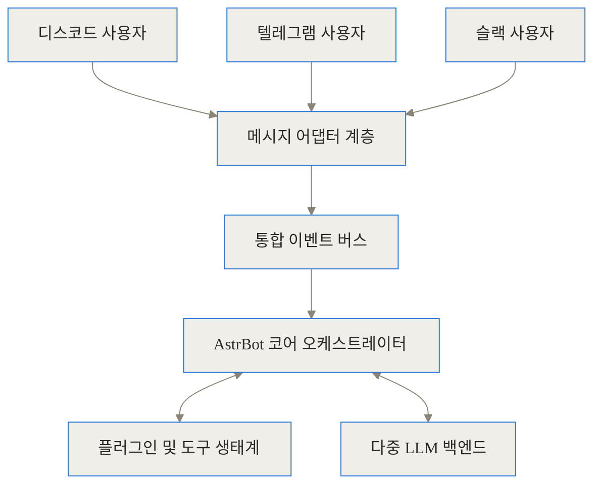
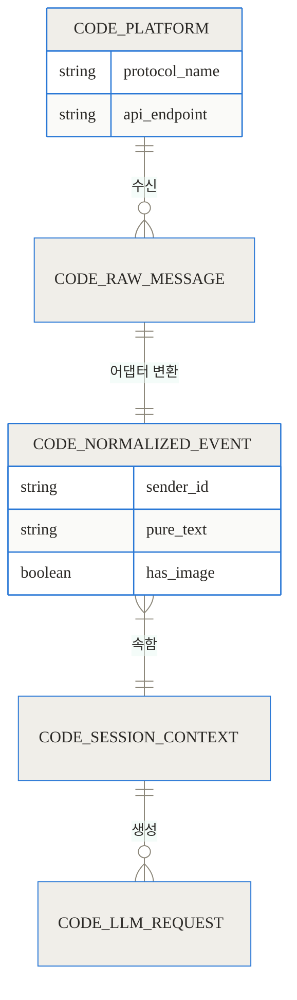
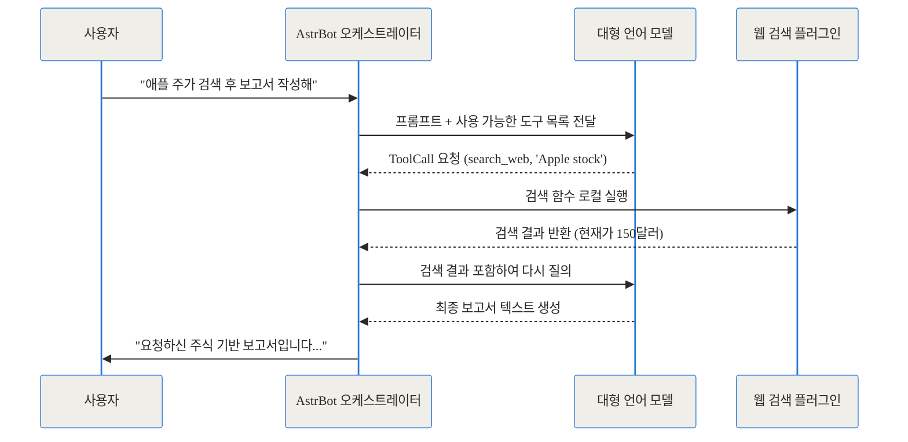
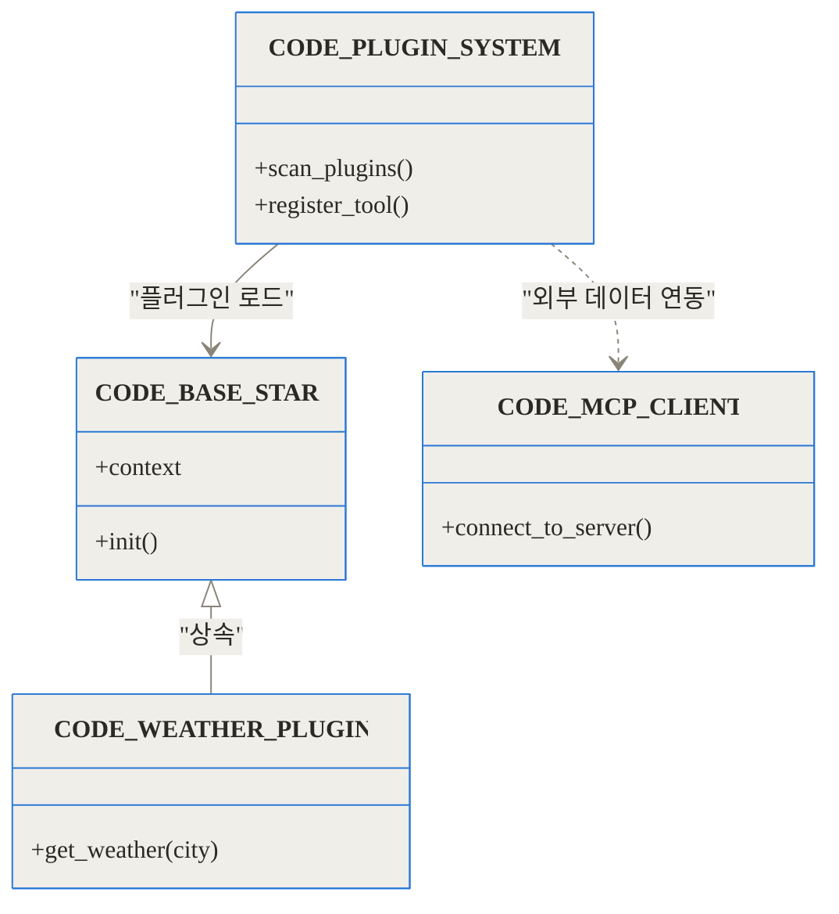
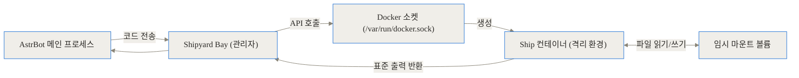
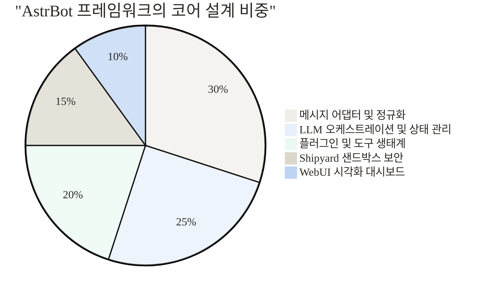

**TL;DR (한 줄 요약)**
- 메신저 플랫폼 대통합: 카카오톡, 텔레그램, 디스코드, 슬랙 등 파편화된 인터페이스를 단일 규격으로 묶어냅니다.
- 에이전트와 도구 호출의 추상화: 복잡한 API 연동 없이 파이썬 데코레이터 하나로 LLM에게 능력을 부여할 수 있습니다.
- 격리된 코드 인터프리터: 자체 샌드박스 엔진인 Shipyard를 통해 인공지능이 생성한 코드를 안전하게 실행하고 검증합니다.

---

## 1. 시작하며: 챗봇 파편화 시대의 종말

### 기존 챗봇 개발이 고통스러웠던 구체적인 이유
인공지능을 실제 업무나 일상에 적용하려 할 때, 가장 먼저 마주하는 장벽은 바로 '메신저 플랫폼의 파편화'입니다. 디스코드에서 작동하는 멋진 AI 어시스턴트를 만들었다고 가정해 봅시다. 며칠 뒤 팀원 중 누군가가 묻습니다. "이거 텔레그램이나 슬랙에서도 쓸 수 있나요?"

이 단순한 질문은 개발자에게 악몽과도 같습니다. 디스코드는 웹소켓을 기반으로 이벤트를 수신하지만, 텔레그램은 롱폴링이나 웹훅 방식을 사용합니다. 슬랙은 또 다른 자체 이벤트 API 구조를 가지고 있습니다. 메신저마다 메시지를 받는 방식, 이미지를 첨부하는 방식, 스레드를 이어가는 방식이 전부 다릅니다. 이들을 각각 구현하다 보면, 정작 인공지능의 본질적인 프롬프트 최적화나 도구 개발보다 인프라를 연결하는 데 80퍼센트 이상의 시간을 쏟게 됩니다.

### 대형 언어 모델(LLM) 교체의 어려움
플랫폼 문제뿐만이 아닙니다. 어제까지는 OpenAI의 GPT-4를 사용하다가, 오늘 더 저렴하고 빠른 DeepSeek나 오픈소스 로컬 모델인 Ollama로 교체하고 싶을 수 있습니다. 기존의 챗봇 코드베이스는 특정 API의 규격에 강하게 결합되어 있어, 모델을 하나 바꾸려면 도구 호출(Tool Calling) 스키마부터 컨텍스트 관리 로직까지 전부 새로 짜야 하는 경우가 허다합니다.

이러한 구조적 고통을 완전히 해결하기 위해 등장한 것이 바로 **AstrBot**입니다. 오픈소스 에이전트 챗봇 플랫폼이자 개발 프레임워크인 AstrBot은 이 모든 파편화를 단일 계층에서 흡수합니다.

---

## 2. AstrBot이란 무엇인가?

### 프로젝트 매니저이자 다국어 통역사
이해를 돕기 위해 AstrBot을 일상적인 비유로 설명해 보겠습니다. AstrBot은 마치 글로벌 무역 회사의 **유능한 프로젝트 매니저(PM)**와 같습니다.

미국(디스코드), 중국(QQ), 유럽(텔레그램) 등 전 세계 각지에서 고객들의 요청이 쏟아집니다. 기존에는 각 나라의 언어를 할 줄 아는 직원을 별도로 고용해야 했습니다. 하지만 AstrBot이라는 PM은 모든 나라의 언어를 표준어로 완벽하게 번역해 냅니다. 그런 다음, 이 요청을 가장 똑똑한 전문가(LLM)에게 전달합니다. 전문가가 "이 문제를 해결하려면 엑셀 프로그램(도구)이 필요해"라고 하면, PM은 즉시 사내 공구함(플러그인)에서 엑셀을 꺼내어 전문가에게 쥐여줍니다. 마지막으로 전문가가 내놓은 답을 다시 각 나라의 언어로 번역해 고객에게 전달하죠.

구체적으로 AstrBot은 오픈소스로 개발된 올인원 에이전트 프레임워크입니다. QQ, 텔레그램, 디스코드, 슬랙, 위챗 등 다양한 플랫폼을 한 번의 클릭으로 연결할 수 있으며, OpenAI, 구글 Gemini, DeepSeek, Claude, 심지어 로컬 구동을 위한 Ollama와 vLLM까지 완벽하게 지원합니다.



위 다이어그램에서 볼 수 있듯, 외부의 복잡성은 어댑터 계층에서 모두 차단되며, 내부 오케스트레이터는 오직 '표준화된 이벤트'만을 다룹니다. 이것이 AstrBot이 가진 유연성의 뼈대입니다.

---

## 3. 핵심 아키텍처 심층 해부 (Under the Hood)

이제 AstrBot이 내부적으로 어떻게 작동하는지 4가지 핵심 기둥을 통해 깊이 파헤쳐 보겠습니다.

### 3.1. 통합 메시지 어댑터 패턴 (Message Adapter Pattern)

가장 먼저 살펴볼 곳은 플랫폼의 파편화를 극복하는 메시지 어댑터입니다. AstrBot은 각 플랫폼의 날것(Raw) 데이터를 자신만의 추상화된 데이터 모델로 변환합니다.

디스코드에서 전송된 JSON 페이로드와 QQ(NapCat)에서 수신된 웹소켓 프레임은 전혀 다른 형태를 띱니다. 하지만 AstrBot의 어댑터는 이를 `MessageEvent`라는 단일 객체로 정규화합니다. 이 객체 안에는 송신자의 고유 식별자, 텍스트 내용, 첨부된 이미지 객체, 그리고 '답장하기(reply)' 같은 공통 메서드가 포함되어 있습니다.



이러한 정규화 덕분에, 플러그인 개발자는 "이 메시지가 디스코드에서 왔는지, 위챗에서 왔는지" 신경 쓸 필요가 없습니다. 단순히 `event.plain_result("안녕하세요")`라는 메서드를 호출하기만 하면, AstrBot이 알아서 원래 메시지가 온 플랫폼의 통신 규격에 맞춰 응답을 포맷팅하고 전송합니다.

### 3.2. 지능형 LLM 라우팅 및 에이전트 오케스트레이션

두 번째 기둥은 단순한 챗봇을 '에이전트(Agent)'로 격상시키는 오케스트레이션 엔진입니다.

사용자가 "최신 애플 주식 가격을 찾아서, 그걸 바탕으로 보고서 초안을 작성해줘"라고 요청했다고 가정해 봅시다. 이 복잡한 지시를 수행하려면 웹 검색 도구와 문서 작성 도구가 연속적으로 호출되어야 합니다.



AstrBot은 LLM과 플러그인 사이에서 상태를 관리하며 끊임없이 핑퐁 게임을 조율합니다. 모델이 도구 호출(Tool Calling)을 요구하면, 시스템에 등록된 파이썬 함수를 매핑하여 실행한 뒤 그 결과를 다시 모델의 컨텍스트 창에 주입합니다. 개발자는 복잡한 재귀 호출 루프를 직접 짤 필요가 전혀 없습니다.

### 3.3. 플러그인 시스템과 데이터 스키마

에이전트의 팔과 다리가 되어줄 플러그인을 어떻게 추가할까요? AstrBot의 플러그인 시스템은 파이썬 생태계의 장점을 극대화하여 설계되었습니다. 클래스 기반의 구조와 데코레이터를 통해 확장이 극도로 직관적입니다.



단순한 파이썬 함수 위에 데코레이터(`@filter.command`)를 달아주고 독스토링(Docstring)으로 "이 함수는 날씨를 검색합니다"라고 적어두기만 하면 끝입니다. AstrBot이 이 독스토링과 타입 힌트를 분석해 OpenAI 호환 JSON 스키마로 자동 변환한 뒤 언어 모델에 전달합니다.
또한, 최근 화두가 되고 있는 **MCP (Model Context Protocol)** 기능 역시 내장되어 있습니다. 로컬 파일 시스템이나 사내 데이터베이스를 표준화된 MCP 서버로 열어두면, AstrBot이 MCP 클라이언트로서 이를 자동으로 인식하고 에이전트의 지식 기반으로 활용합니다.

### 3.4. 샌드박스 기반 코드 인터프리터 (Shipyard)

이 프레임워크의 가장 돋보이는 강력한 무기 중 하나는 **Shipyard(쉽야드)**라는 자체 샌드박스 엔진입니다.

LLM에게 데이터 분석을 맡기면, 모델은 종종 파이썬 코드를 작성하여 반환합니다. 이를 호스트 머신에서 그대로 실행하는 것은 매우 위험합니다. 악성 코드가 서버의 환경 변수를 탈취하거나 시스템 파일을 지워버릴 수 있기 때문입니다. 

AstrBot은 도커 데몬과 직접 통신하여 일회성 컨테이너(Ship)를 띄웁니다.



모델이 작성한 코드는 CPU와 메모리가 제한된 격리 컨테이너 내부에서만 실행됩니다. 실행이 끝나면 출력 결과물과 그래프 이미지 파일 등만 메인 프로세스로 전달되고, 컨테이너는 즉시 폐기됩니다. 이 덕분에 사용자는 보안 걱정 없이 봇에게 "이 엑셀 파일을 분석해서 시각화 그래프를 그려줘"라고 명령할 수 있습니다.

---

## 4. 실전 활용 시나리오

이러한 강력한 아키텍처를 바탕으로 현업에서 어떻게 쓰일 수 있는지 구체적인 시나리오를 살펴보겠습니다.

### 시나리오 A: 슬랙 기반의 사내 데브옵스(DevOps) 자동화 봇
서버 관리자가 인프라 상태를 체크하기 위해 매번 터미널을 열 필요가 없습니다. 슬랙에 연동된 AstrBot을 호출합니다.
- **사용자**: "현재 운영 서버의 메모리 사용량 상위 5개 프로세스를 알려줘."
- **AstrBot 동작**: 
  1. 슬랙 어댑터를 통해 메시지를 수신합니다.
  2. 오케스트레이터가 사내 모델(Ollama 기반 Llama3)에 질의합니다.
  3. 모델이 SSH 접속 및 `top` 명령어를 실행하는 파이썬 코드를 작성합니다.
  4. Shipyard 샌드박스 내부에서 코드가 실행되어 결과를 얻어옵니다.
  5. 모델이 결과를 자연스럽게 요약하여 슬랙으로 답변합니다.
이 모든 과정이 하나의 생태계 안에서 매끄럽게 이루어집니다.

### 시나리오 B: 텔레그램 기반의 어학 튜터 및 문서 기반 질의(RAG)
AstrBot은 내장된 RAG(Retrieval-Augmented Generation) 기능을 제공합니다. 사용자는 텔레그램 채팅창에 두꺼운 PDF 교재 파일을 드래그 앤 드롭으로 업로드합니다.
- 봇은 즉시 문서를 청크(Chunk) 단위로 쪼개고 임베딩하여 벡터 데이터베이스에 저장합니다.
- 사용자가 "3장의 핵심 내용을 영어로 요약해줘"라고 말하면, 봇은 문서를 검색하여 정확한 컨텍스트를 찾아내고, 영단어 검색 플러그인을 활용해 난이도에 맞는 어휘로 답변을 구성합니다. 텔레그램의 인터페이스를 활용하면서도 백엔드 로직은 완벽히 독립적으로 유지됩니다.

---

## 5. 설치 및 구현 디테일

AstrBot의 배포는 크게 두 가지 방식으로 나뉩니다. 목적에 따라 선택할 수 있습니다.

### 도커(Docker)를 활용한 표준 배포
샌드박스(Shipyard) 기능을 안전하게 사용하고 배포 환경을 깔끔하게 유지하려면 도커 컴포즈(Docker Compose)를 활용하는 것이 권장됩니다.

```yaml
version: '3.8'
services:
  astrbot:
    image: soulter/astrbot:latest
    container_name: astrbot
    restart: always
    ports:
      - "6185:6185" # AstrBot WebUI 시각화 관리 포트
    environment:
      - TZ=Asia/Seoul
    volumes:
      - ${PWD}/data:/AstrBot/data
      # 샌드박스 구동을 위해 도커 소켓을 마운트합니다.
      - /var/run/docker.sock:/var/run/docker.sock:ro 
```
터미널에서 `docker compose up -d` 명령어 하나면 백그라운드에서 시스템이 구동되며, 브라우저를 열어 `http://localhost:6185`에 접속하면 직관적인 WebUI를 통해 LLM API 키를 입력하고 플랫폼을 연동할 수 있습니다.

### 파이썬 패키지 관리자(uv)를 활용한 로컬 환경 구축
가벼운 테스트나 플러그인 개발 목적이라면 최신 파이썬 패키지 관리자인 `uv`를 사용해 단 한 줄의 명령어로 시작할 수 있습니다.

```bash
uv tool install astrbot --python 3.12
astrbot init
astrbot run
```
명령어를 실행하면 자동으로 가상 환경이 설정되고 의존성이 설치되며 시스템이 시작됩니다. 개발 진입 장벽이 극단적으로 낮아졌습니다.

---

## 6. 벤치마크 및 기존 기술과의 비교

그렇다면 기존의 전통적인 챗봇 프레임워크나 인기 있는 워크플로우 툴들과 비교했을 때, AstrBot의 포지션은 어디쯤일까요?

### 다중 플랫폼 연동 생산성 비교

```chartjs
{
  "type": "bar",
  "data": {
    "labels": ["텔레그램 연동", "디스코드 연동", "QQ 연동", "에이전트 도구 등록"],
    "datasets": [
      {
        "label": "전통적 날것의 SDK 사용 시 필요 코드량 (줄)",
        "data": [250, 300, 350, 180]
      },
      {
        "label": "AstrBot 통합 환경 사용 시 필요 코드량 (줄)",
        "data": [0, 0, 0, 15]
      }
    ]
  }
}
```
*AstrBot은 WebUI에서 토큰만 입력하면 연동이 끝나므로 플랫폼 연결을 위한 코드가 전혀 필요하지 않습니다. 도구 등록 역시 15줄 안팎의 파이썬 함수와 데코레이터만으로 충분합니다.*

### 플랫폼 기능 상세 트레이드오프 표

| 비교 항목 | 날것의 SDK (예: python-telegram-bot) | 워크플로우 툴 (예: Dify, Coze) | AstrBot 프레임워크 |
| :--- | :--- | :--- | :--- |
| **개발 난이도** | 높음 (인프라부터 직접 설계해야 함) | 매우 낮음 (노코드/로우코드) | 낮음 (파이썬 지식만 있으면 됨) |
| **메신저 플랫폼 지원** | 단일 플랫폼에 종속됨 | 제한적 (일부 API만 지원) | **매우 우수** (QQ, 위챗, 디스코드 등 폭넓음) |
| **커스텀 코드 확장성** | 무한대 (단, 유지보수가 어려움) | 다소 경직됨 | **높음** (플러그인 생태계와 샌드박스) |
| **로컬 모델 연동** | 직접 구현 필요 | 클라우드 서비스는 불가 | **완벽 지원** (Ollama, vLLM 호환) |
| **비용 및 의존성** | 무료 (오픈소스) | 벤더 락인 및 구독료 발생 가능 | 무료 (오픈소스 자체 호스팅) |

기존 노코드 기반 워크플로우 툴(Dify 등)은 시각적으로 아름답지만 내부 로직을 파이썬 코드로 자유롭게 비틀거나 샌드박스 환경을 커스텀하기 어렵습니다. 반면 AstrBot은 코드로 통제할 수 있는 유연성을 제공하면서도, 메신저 연동이라는 지루한 노동을 WebUI와 내부 어댑터로 말끔히 해결해 줍니다.

### 각 모듈별 비중 시각화



---

## 7. 솔직한 평가: 한계 및 도입 시 고려사항

아무리 훌륭한 도구라도 은탄환은 아닙니다. 도입하기 전 반드시 고려해야 할 트레이드오프가 존재합니다.

1. **인프라 종속성 문제**: 가장 강력한 기능인 '코드 인터프리터(Shipyard)'를 활용하려면 반드시 도커 데몬 소켓에 접근할 수 있는 권한이 필요합니다. 일반적인 서버리스(Serverless) 환경이나 도커 소켓 마운트가 금지된 깐깐한 사내 인프라에서는 이 기능을 사용할 수 없습니다.
2. **파이썬 생태계 의존도**: 플러그인을 개발하려면 반드시 파이썬을 다룰 줄 알아야 합니다. 자바스크립트나 고(Go) 언어를 주력으로 사용하는 팀이라면 별도의 학습 곡선이 발생합니다.
3. **오픈소스 특유의 변동성**: 활발하게 개발되는 오픈소스 프로젝트인 만큼, 버전 업데이트에 따라 플러그인 호환성이나 설정 방식이 달라질 수 있습니다. 프로덕션 환경에 배포할 때는 버전을 명시적으로 고정(Pinning)하는 것이 안전합니다.

---

## 8. 마치며: 오픈소스 AI 에이전트의 미래

과거에는 메신저에 봇을 하나 올리는 것 자체가 거대한 프로젝트였습니다. 하지만 대형 언어 모델의 추론 능력이 비약적으로 발전하면서, 이제 봇은 단순한 '버튼 누르기 기계'를 넘어 스스로 판단하고 도구를 사용하는 '에이전트'로 진화했습니다.

AstrBot은 이러한 시대적 변화의 중심을 정확히 관통하고 있습니다. 파편화된 메신저들을 하나의 허브로 통합하고, LLM을 그 중심 뇌로 배치하며, 샌드박스를 통해 신체적 행동(코드 실행)의 안전을 보장합니다. 

단 하나의 코드베이스로 당신만의 강력한 AI 에이전트를 모든 팀원, 모든 커뮤니티, 모든 메신저에 배치하고 싶다면, 주저 없이 AstrBot을 로컬 환경에 띄워보시길 권장합니다. 복잡한 API 문서를 뒤적이는 대신, 프롬프트와 비즈니스 로직 그 자체에 집중할 수 있는 진정한 자유를 경험하게 될 것입니다.

## 자주 묻는 질문 (FAQ)

### AstrBot을 도입하면 기존 챗봇 프레임워크와 비교해 무엇이 가장 달라지나요?

다중 플랫폼 연동과 LLM 연동이 하나의 시스템으로 완벽히 통합됩니다. 기존에는 텔레그램, 디스코드 등 플랫폼마다 각기 다른 API를 개별적으로 구현해야 했으나, AstrBot은 이를 단일 인터페이스로 추상화하여 한 번의 플러그인 개발로 모든 메신저에서 동일한 에이전트 기능을 사용할 수 있게 해줍니다.

### LLM이 생성한 코드를 실행할 때 보안 위험은 없나요?

Shipyard라는 전용 샌드박스 환경을 통해 보안 문제를 근본적으로 해결합니다. 인공지능이 작성한 파이썬 스크립트나 쉘 명령어는 호스트 머신이 아닌 리소스가 제한된 격리된 도커(Docker) 컨테이너 내부에서만 일회성으로 실행된 후 즉시 폐기됩니다.

### 기업 내부망이나 오프라인 환경을 위해 로컬 모델로도 구동이 가능한가요?

네, 완벽하게 지원합니다. Ollama, LM Studio, vLLM 등의 로컬 백엔드 서비스와 자연스럽게 연동할 수 있습니다. 데이터 유출이 우려되는 기업 환경에서도 외부 인터넷 연결 없이 안전한 사내 전용 AI 어시스턴트를 구축할 수 있습니다.

### 챗봇에 커스텀 기능을 추가하는 과정은 얼마나 복잡한가요?

파이썬 데코레이터를 기반으로 매우 직관적으로 설계되어 있습니다. 파이썬 함수 위에 `@filter.command` 데코레이터를 붙이고 독스토링(Docstring)으로 설명을 달아두면, AstrBot이 이를 자동으로 분석해 LLM이 이해하고 사용할 수 있는 도구(Tool) 명세로 변환해 줍니다.

### 도커(Docker) 없이 파이썬 환경으로만 배포할 수도 있나요?

가능합니다. `uv` 패키지 관리자를 활용해 `uv tool install astrbot` 명령어로 손쉽게 로컬 파이썬 환경에 설치하고 실행할 수 있습니다. 다만, 외부 코드를 실행하는 코드 인터프리터 기능을 안전하게 사용하려면 가급적 도커 샌드박스 환경을 함께 구성하는 것을 강력히 권장합니다.


## References
- [https://github.com/Soulter/AstrBot](https://github.com/Soulter/AstrBot)
- [https://github.com/AstrBotDevs/AstrBotLauncher](https://github.com/AstrBotDevs/AstrBotLauncher)
- [https://github.com/Soulter/shipyard-bay](https://github.com/Soulter/shipyard-bay)
