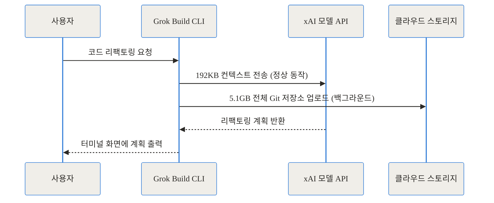
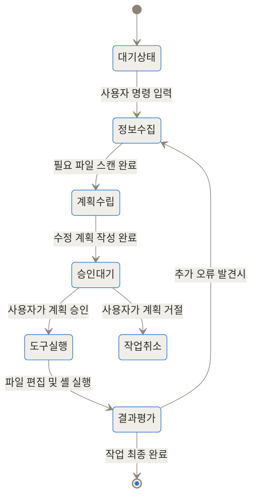
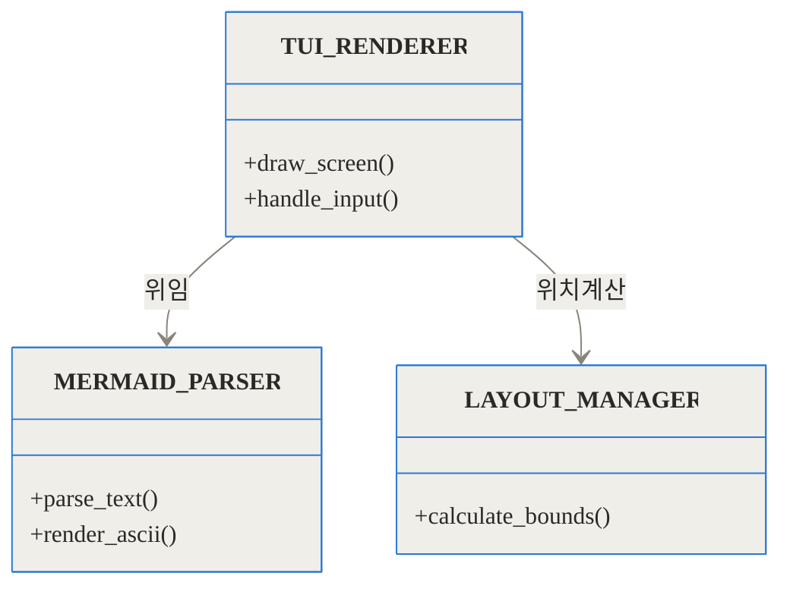
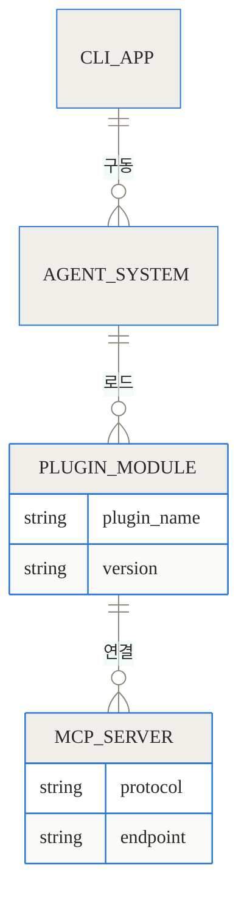
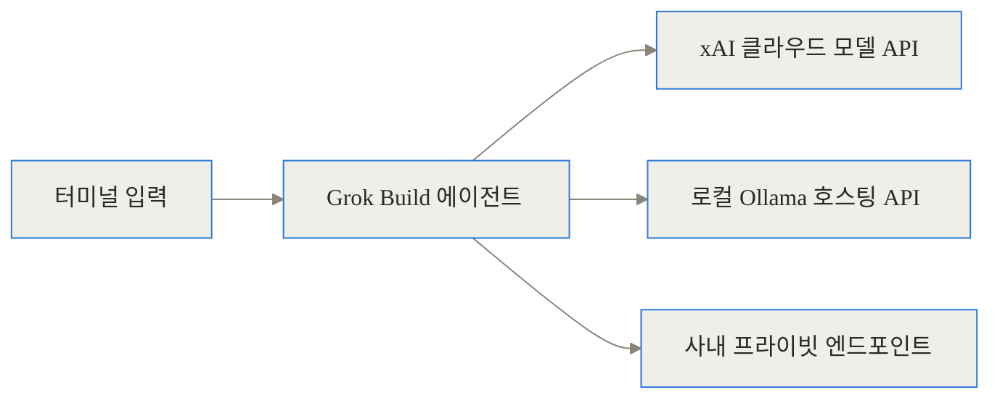

## 공식 링크 및 참고 자료

- 공식 GitHub 저장소: [xai-org/grok-build](https://github.com/xai-org/grok-build)
- 플러그인 생태계: [xai-org/plugin-marketplace](https://github.com/xai-org/plugin-marketplace)
- 제품 공식 웹사이트: [Grok Build](https://grok.com)

## 도입 및 3줄 요약 (TL;DR)

> - **무엇인가:** xAI(현 SpaceXAI)가 개발한 터미널 전용 AI 코딩 에이전트로, 84만 줄 이상의 Rust 언어로 짜여진 강력한 CLI 도구입니다.
> - **왜 화제인가:** 초기 버전에서 사용자의 전체 Git 저장소를 무단으로 클라우드에 업로드하는 프라이버시 침해 논란이 있었고, 이를 수습하기 위해 코드를 전면 오픈소스화했습니다.
> - **어떻게 작동하나:** MCP(Model Context Protocol)를 지원하여 로컬 파일 시스템, 터미널 셸, 외부 플러그인과 직접 상호작용하며 복잡한 터미널 UI(TUI)를 자체 렌더링합니다.

현업 개발자와 기획자 여러분, 우리가 매일 사용하는 코드 에디터의 지형이 터미널 속으로 다시 이동하고 있습니다. 데스크톱 기반의 무거운 통합 개발 환경(IDE)을 벗어나, 개발자가 가장 익숙한 흑백의 셸 환경에서 직접 코드를 읽고 편집하는 AI 에이전트가 등장했습니다. 그 중심에 서 있는 프로젝트가 바로 xai-org/grok-build입니다.

이 도구는 단순히 터미널에서 챗봇을 띄워주는 스크립트가 아닙니다. 터미널 환경 자체를 하나의 거대한 캔버스로 삼아 인라인 코드 리뷰, Mermaid 다이어그램 렌더링, 자율적인 셸 명령어 실행까지 수행하는 완전한 에이전트 루프를 갖추고 있습니다. 이 글에서는 Grok Build가 어떻게 100만 줄에 달하는 Rust 코드로 터미널의 한계를 극복했는지, 그리고 오픈소스 커뮤니티에 공개되기까지 어떤 극적인 배경이 있었는지 하나하나 짚어보겠습니다.

## 배경과 문제 정의: 프라이버시 논란에서 오픈소스로의 전환

Grok Build가 지금의 Apache 2.0 라이선스로 GitHub에 공개된 배경을 이해하려면, 2026년 7월에 발생한 매우 이례적인 보안 논란을 살펴봐야 합니다. 이 도구가 처음 비공개 베타로 등장했을 때, 뛰어난 성능 덕분에 많은 기대를 모았습니다. 하지만 구체적인 네트워크 패킷을 뜯어본 한 보안 연구자의 폭로로 인해 상황이 급반전되었습니다.

### 과도한 백그라운드 데이터 전송의 발견

'cereblab'이라는 이름으로 활동하는 연구자는 mitmproxy라는 네트워크 가로채기 도구를 사용해 Grok Build CLI(버전 0.2.93)의 통신 내역을 분석했습니다. 분석 결과는 당혹스러웠습니다. 사용자가 코딩 작업을 요청할 때마다 CLI는 두 개의 독립적인 네트워크 채널을 열고 있었습니다.

첫 번째 채널은 정상적인 모델 통신 채널이었습니다. 사용자의 프롬프트와 에이전트가 읽은 소수의 파일 컨텍스트가 이 채널을 통해 전송되었습니다. 문제는 두 번째 채널이었습니다. 이 스토리지 채널은 사용자의 현재 작업 디렉토리 전체를 Git 번들 형태로 압축하여 구글 클라우드 스토리지의 특정 버킷(grok-code-session-traces)으로 전송하고 있었습니다.



실제로 12GB 크기의 저장소에서 테스트한 결과, 모델이 작업을 수행하는 데 필요한 텍스트 데이터는 약 192KB에 불과했습니다. 그러나 백그라운드에서는 75MB씩 73개의 청크로 나뉘어 무려 5.10GB의 데이터가 서버로 넘어갔습니다. 이는 모델이 요구한 데이터의 약 27,800배에 달하는 분량이었습니다.

```chartjs
{
  "type": "bar",
  "data": {
    "labels": ["모델 요구 컨텍스트 (정상)", "실제 백그라운드 업로드 (논란)"],
    "datasets": [
      {
        "label": "데이터 전송량 (KB)",
        "data": [192, 5340000]
      }
    ]
  },
  "options": {
    "responsive": true,
    "plugins": {
      "title": {
        "display": true,
        "text": "와이어 레벨 분석: 실제 컨텍스트 사용량 대비 스토리지 업로드량 비교"
      }
    }
  }
}
```

### 프라이버시 토글의 오해와 신뢰 회복을 위한 결단

더욱 큰 문제는 개발자들이 에이전트가 읽어서는 안 될 파일(예: 환경 변수가 담긴 .env 파일이나 개인 SSH 키)을 명시적으로 제한했음에도, Git 저장소 전체가 번들링되면서 이러한 민감한 파일과 과거의 전체 커밋 히스토리까지 함께 전송되었다는 점입니다. 설정에 있던 '모델 학습 개선을 위한 데이터 제공' 옵션을 꺼도 이 전송은 멈추지 않았습니다. 해당 옵션은 단순히 서버 측에서 데이터를 학습에 쓸지 말지를 결정하는 플래그였을 뿐, 전송 자체를 막는 기능이 아니었기 때문입니다.

이 사실이 Hacker News와 Reddit 등을 통해 퍼지자 커뮤니티는 강하게 반발했습니다. 사태의 심각성을 인지한 xAI 측은 즉각적인 조치를 취했습니다. 원격 텔레메트리와 데이터 보관 기능을 완전히 비활성화하고, 기존에 수집된 모든 사용자 데이터를 영구적으로 삭제했다고 발표했습니다. 그리고 가장 확실한 신뢰 회복의 수단으로, 7월 15일에 내부 저장소의 전체 코드를 xai-org/grok-build라는 이름으로 대중에 공개했습니다. 누구나 코드를 읽어보고 데이터 흐름을 검증할 수 있게 만든 것입니다.

## 개념 쉽게 이해하기: 터미널 속의 동료 개발자

Grok Build가 무엇인지 이해하기 위해 일상적인 비유를 들어보겠습니다. 기존의 AI 챗봇(예: 웹 브라우저 기반의 챗봇)은 외부 컨설턴트와 같습니다. 내가 파일의 내용을 복사해서 이메일로 보내면, 컨설턴트가 읽어보고 수정된 코드를 다시 이메일로 보내줍니다. 나는 그것을 받아서 직접 파일에 붙여넣어야 합니다.

반면 Grok Build는 내 책상 옆에 앉아 내 모니터를 함께 보고 키보드를 공유하는 숙련된 시니어 개발자와 같습니다. 내가 터미널에서 "데이터베이스 연결 구조 좀 개선해줘"라고 말하면, 이 동료는 내 프로젝트 폴더를 직접 뒤져서 관련 파일을 찾아 읽습니다. 그리고 "이렇게 고치면 될 것 같은데, 수정할까?"라고 묻고, 내가 고개를 끄덕이면 직접 타자를 쳐서 파일을 수정하고 테스트 스크립트까지 돌려봅니다. 

이 모든 과정이 무거운 별도의 프로그램 창을 띄울 필요 없이, 평소에 Git 명령어를 치고 서버를 실행하던 그 터미널 창 안에서 그대로 이루어집니다.

## 작동 원리 심층 분석 (Under the Hood)

Grok Build의 내부 구조는 단일 스크립트가 아닙니다. 844,530줄이라는 거대한 규모의 Rust 언어로 작성된 견고한 시스템입니다. 이 코드는 크게 에이전트 루프, 터미널 UI(TUI) 렌더러, 그리고 확장 플러그인 시스템으로 나뉩니다.

### 1. 에이전트 루프와 상태 전이

에이전트 루프는 Grok Build의 두뇌 역할을 합니다. 사용자가 명령을 내리면, 에이전트는 즉각적으로 코드를 토해내는 것이 아니라 정해진 생명주기(Lifecycle)를 따라 신중하게 움직입니다.



이 상태 전이 구조의 가장 중요한 부분은 '계획 수립(Planning)'과 '승인 대기' 단계입니다. Grok Build는 파일을 함부로 수정하지 않습니다. `--permission-mode plan` 옵션이 켜져 있으면, 에이전트는 앞으로 자신이 어떤 파일의 몇 번째 줄을 삭제하고 무엇을 추가할지, 어떤 셸 명령어를 실행할지를 깔끔한 표 형태로 터미널에 먼저 보여줍니다. 사용자가 이 계획을 읽고 엔터를 쳐야만 실제 '도구 실행(Tool Execution)' 단계로 넘어갑니다.

### 2. 터미널 UI (TUI) 렌더러의 독립성

놀랍게도 Grok Build는 시중의 흔한 TUI 라이브러리를 그대로 가져다 쓰지 않고, 자신만의 독자적인 렌더링 엔진을 Rust로 밑바닥부터 구현했습니다. 소스 코드의 `crates/codegen/xai-grok-shell` 디렉토리를 보면 이 화면을 그리기 위한 레이아웃 매니저와 파서들이 존재합니다.



특히 해커 커뮤니티에서 가장 화제가 된 부분은 바로 `MERMAID_PARSER`입니다. 웹 브라우저에서나 볼 수 있던 화려한 Mermaid 다이어그램을, 유니코드의 선 긋기(Box-drawing) 문자를 조합하여 터미널의 흑백 텍스트 환경에 완벽하게 그려냅니다. 복잡한 시스템 아키텍처를 AI가 다이어그램으로 설계하면, 터미널 창 안에서 곧바로 그 구조도를 시각적으로 확인할 수 있습니다.


### 3. 확장 시스템: MCP (Model Context Protocol)

Grok Build는 자체적인 기능에 만족하지 않고, 최신 산업 표준인 MCP를 적극적으로 도입했습니다. MCP는 AI 모델이 외부의 데이터베이스, API, 또는 로컬 파일 시스템과 대화하기 위해 사용하는 공용 언어(프로토콜)입니다.



이 구조 덕분에, 사용자는 `xai-org/plugin-marketplace`에서 수많은 플러그인을 다운로드하여 Grok Build의 능력을 확장할 수 있습니다. 예를 들어, 데이터베이스를 쿼리하는 MCP 서버를 연결하면, 터미널 에이전트에게 "운영 DB에서 최근 가입한 유저 10명의 스키마 패턴을 보고, 이 프로젝트의 ORM 코드를 거기에 맞춰서 업데이트해줘"라는 고차원적인 지시가 가능해집니다.

## 구현 및 사용 디테일: 어떻게 설치하고 실행하는가

오픈소스화된 이후, Grok Build를 실행하는 방법은 완전히 투명해졌습니다. 로컬 컴퓨터에 Rust의 패키지 매니저인 Cargo가 설치되어 있다면 단 몇 줄의 명령어로 이 거대한 시스템을 빌드하고 실행할 수 있습니다.

소스 코드를 클론한 뒤 프로젝트 루트 디렉토리에서 다음 명령어를 실행합니다.

```bash
# 프로젝트 빌드 및 실행
cargo run -p xai-grok-pager-bin

# 코드 린팅 및 검증
cargo check -p xai-grok-pager-bin
cargo clippy -p xai-grok-pager-bin
```

바이너리가 빌드되어 시스템 경로에 등록되면 `grok` 명령어 하나로 모든 기능을 호출할 수 있습니다. 가장 권장하는 안전한 사용법은 탐색 모드와 계획 승인 모드를 조합하는 것입니다.

```bash
# 현재 디렉토리에서 탐색 에이전트를 켜고, 반드시 사용자의 승인을 받도록 설정
grok --agent explore --permission-mode plan --cwd .
```

이 명령어를 치면 터미널 전체가 Grok Build의 UI로 덮이면서 대화형 프롬프트가 나타납니다. 여기서 원하는 작업을 자연어로 입력하면 됩니다.

### 로컬 퍼스트(Local-First) 구조

또한, 이 도구는 설정 파일(`config.toml`)을 수정하여 외부 클라우드와의 연결을 완전히 끊어버릴 수 있습니다.



위 다이어그램처럼, xAI의 서버 대신 내 컴퓨터에 띄워둔 Ollama의 로컬 모델(예: Llama 3 또는 자체 파인튜닝 모델)을 향하도록 API 엔드포인트를 변경할 수 있습니다. 이렇게 하면 코드가 내 컴퓨터 밖으로 단 한 줄도 나가지 않는 완벽한 프라이버시 환경을 구축할 수 있습니다.

## 실전 활용 시나리오

현업 개발자들이 이 도구를 어떻게 활용하여 시간을 절약할 수 있는지 구체적인 시나리오를 살펴보겠습니다.

### 시나리오 1: 복잡한 의존성 충돌 및 빌드 에러 해결

거대한 모노레포(Monorepo)에서 라이브러리 버전을 올렸더니 빌드가 깨지는 상황을 가정해봅시다. 에러 로그가 터미널 화면을 수백 줄 채우고 넘어갑니다. 기존에는 이 로그를 복사해서 웹 브라우저의 AI에게 물어봐야 했습니다.

Grok Build 환경에서는 오류가 난 터미널 상태 그대로 에이전트를 호출합니다. 

> "방금 발생한 빌드 에러 로그를 읽고, 관련된 package.json 파일들을 모두 찾아서 의존성 충돌을 해결하는 계획을 세워줘."

에이전트는 즉시 프로젝트 내의 여러 `package.json` 파일을 스캔하고, 호환되는 버전을 찾아내어 변경할 파일 목록과 수정 내역(Diff)을 화면에 띄웁니다. 계획이 완벽하다면 엔터 한 번으로 모든 파일을 수정하고 재빌드까지 수행합니다.

### 시나리오 2: Claude Code와의 협업 플러그인

최근 GitHub에 공개된 `xai-org/grok-build-plugin-cc` 저장소를 보면 아주 흥미로운 생태계 연동 사례를 찾을 수 있습니다. 경쟁사의 AI 도구인 Anthropic의 Claude Code와 Grok Build를 하나로 묶어주는 플러그인입니다.

터미널에서 Claude Code를 사용하다가 매우 복잡한 시스템 아키텍처 리뷰나 대규모 리팩토링처럼 더 강력한 엔진이 필요한 순간, 다음과 같이 명령을 내립니다.

```bash
/grok-build:critique --base main challenge whether this was the right caching and retry design
```

이 명령은 백그라운드에서 즉시 Grok Build CLI를 호출하여 현재 작업 중인 브랜치와 `main` 브랜치의 차이를 분석하게 하고, 캐싱 메커니즘에 대한 구조적 비판을 담은 JSON 리포트를 생성해 다시 Claude Code에게 전달합니다. 두 AI 에이전트가 터미널 안에서 서로 협력하는 파이프라인이 완성되는 것입니다.

## 벤치마크 및 기존 도구와의 비교

그렇다면 시중에 나와 있는 다른 AI 코딩 도구들과 비교했을 때 Grok Build의 위치는 어디쯤일까요?

| 비교 항목 | Grok Build (오픈소스) | Cursor (GUI 에디터) | GitHub Copilot CLI |
| :--- | :--- | :--- | :--- |
| **주요 인터페이스** | 터미널 (TUI) | 데스크톱 에디터 (포크된 VS Code) | 터미널 (단순 명령어 제안 중심) |
| **구현 언어** | Rust (약 84만 줄) | TypeScript / C++ | TypeScript / Go |
| **소스코드 공개 여부**| 전체 공개 (Apache 2.0) | 비공개 (일부 컴포넌트만 공개) | 비공개 |
| **작업 자율성** | 높음 (자율 파일 탐색 및 편집) | 중간 (사용자 개입 필요) | 낮음 (단편적 스니펫 중심) |
| **로컬 모델 지원** | 완전 지원 (엔드포인트 변경 가능) | 제한적 지원 | 미지원 (클라우드 강제) |

가장 눈에 띄는 차이는 **응답 속도와 초기 로딩 속도**입니다. 무거운 크로미움(Chromium) 기반의 일렉트론(Electron) 앱을 띄워야 하는 GUI 도구들과 달리, Rust로 네이티브 컴파일된 단일 바이너리는 거의 순간적으로 실행됩니다.

```chartjs
{
  "type": "bar",
  "data": {
    "labels": ["Cursor (GUI)", "VS Code Copilot (GUI)", "Grok Build (TUI)"],
    "datasets": [
      {
        "label": "도구별 초기 실행 및 준비 완료 소요 시간 (ms)",
        "data": [2500, 3100, 850]
      }
    ]
  },
  "options": {
    "responsive": true,
    "plugins": {
      "title": {
        "display": true,
        "text": "네이티브 터미널 앱과 GUI 에디터의 실행 속도 비교"
      }
    }
  }
}
```

터미널 환경에 이미 익숙한 백엔드 개발자나 데브옵스 엔지니어에게, 1초 미만의 실행 속도와 화면 전환 없는 작업 흐름은 엄청난 생산성 향상으로 다가옵니다.

## 솔직한 평가: 장점과 숨겨진 트레이드오프

모든 기술에는 양면성이 존재합니다. 테크 에디터의 시각에서 이 도구의 장점과 한계를 냉정하게 평가해 보겠습니다.

**구체적인 장점:**
1. **압도적인 퍼포먼스와 최적화:** Rust 특유의 메모리 안전성과 속도 덕분에, 수백 개의 파일을 스캔하는 과정에서도 터미널이 버벅거리지 않습니다.
2. **완전한 오프라인 통제권:** 논란 이후 도입된 철저한 로컬 우선(Local-First) 정책 덕분에, 사내 보안 규정상 코드를 외부 클라우드로 보낼 수 없는 금융권이나 방산 기업에서도 안전하게 세팅할 수 있습니다.
3. **MCP를 통한 무한한 확장성:** 단순히 코드를 짜는 것을 넘어, Jira 티켓을 읽어오거나 슬랙(Slack) 메시지를 분석해 버그를 수정하는 수준으로 진화할 수 있습니다.

**명확한 한계와 리스크:**
1. **가파른 학습 곡선:** 마우스를 클릭해 줄 단위로 수정 내역을 비교하는 GUI 환경에 익숙한 주니어 개발자에게는 텍스트 기반의 TUI가 매우 불친절하게 느껴질 수 있습니다.
2. **거대한 코드베이스의 복잡성:** 100만 줄에 가까운 코드가 한 번에 공개되다 보니, 일반 오픈소스 기여자가 코드의 흐름을 파악하고 PR(Pull Request)을 올리기가 쉽지 않습니다. 커뮤니티 주도의 개발보다는 기업 주도의 일방적 코드 공개에 머무를 위험도 존재합니다.
3. **신뢰의 상처:** 아무리 코드를 공개하고 데이터를 지웠다 하더라도, 초기 베타 버전에서 보여준 5GB 대규모 데이터 업로드 사건은 개발자 커뮤니티에 깊은 불신을 남겼습니다. 이 도구를 팀 단위로 도입하려면 동료들을 설득하는 과정이 필요할 것입니다.


## 마무리: 개발 환경의 패러다임이 다시 터미널로

수십 년 전 개발자들은 터미널 안의 Vim이나 Emacs에서 모든 작업을 해결했습니다. 이후 화려한 그래픽을 자랑하는 IDE의 시대로 넘어왔지만, 이제 AI 에이전트라는 강력한 무기를 달고 다시 터미널로 돌아가려는 움직임이 관측됩니다. 

xai-org/grok-build는 그 궤적의 최전선에 있는 프로젝트입니다. 비록 프라이버시라는 거대한 암초에 부딪혀 강제적으로 오픈소스화되는 홍역을 치렀지만, 역설적으로 그 덕분에 우리는 세계 최고 수준의 AI 기업이 개발한 정교한 에이전트 아키텍처를 무료로 뜯어보고 분석할 수 있게 되었습니다.

단순히 코드를 자동 완성해 주는 수준을 넘어, 프로젝트의 맥락을 이해하고 스스로 계획을 세우며 터미널을 제어하는 이 도구가 향후 개발 생태계에 어떤 새로운 흐름을 만들어낼지 지켜보는 것은 무척 흥미로운 일이 될 것입니다.

## 자주 묻는 질문 (FAQ)

### 논란이 되었던 데이터 무단 업로드 문제는 현재 어떻게 해결되었나요?

2026년 7월 논란이 발생한 직후, xAI 측은 백그라운드 텔레메트리 전송을 완전히 비활성화하고 수집된 모든 사용자 데이터를 영구 삭제했습니다. 현재는 전체 코드가 Apache 2.0으로 공개되어 누구나 네트워크 전송 로직이 투명하게 제거되었음을 직접 검증할 수 있습니다.

### Cursor나 GitHub Copilot 같은 기존 GUI 기반 에디터 대신 Grok Build(TUI)를 쓸 때의 구체적인 장점은 무엇인가요?

가장 큰 장점은 실행 속도와 맥락의 연속성입니다. 무거운 크로미움 기반 앱을 띄울 필요 없이 터미널에서 즉각적으로 실행되며, 사용자가 셸에서 발생한 에러 로그나 테스트 결과를 복사할 필요 없이 에이전트가 해당 터미널 세션의 맥락을 바로 읽고 대처할 수 있습니다.

### 클라우드 통신 없이 완전히 로컬(오프라인) 모델로만 작동시킬 수 있나요?

네, 가능합니다. Grok Build는 처음부터 로컬 퍼스트(Local-First)를 염두에 두고 설계되었습니다. 구성 파일(config.toml)에서 모델 추론 API 엔드포인트를 로컬에 띄워둔 Ollama나 Llama-cpp 인스턴스로 변경하면 외부 인터넷 연결 없이 안전하게 프라이빗 코딩 에이전트로 활용할 수 있습니다.

### Mermaid 다이어그램을 텍스트 기반 터미널에서 어떻게 렌더링하나요?

Grok Build 내부에는 Rust로 바닥부터 작성된 독자적인 텍스트 렌더링 엔진이 포함되어 있습니다. 이 엔진이 Mermaid 문법을 파싱한 뒤, 유니코드의 특수 선 긋기(Box-drawing) 문자들을 정교하게 조합하여 터미널 창 안에 차트와 다이어그램을 시각적으로 구현해냅니다.

### 방대한 100만 줄의 Rust 코드베이스 중, 기여하거나 구조를 파악하기 좋은 시작점은 어디인가요?

가장 핵심이 되는 로직은 소스 트리의 'crates/codegen' 디렉토리 아래에 모여 있습니다. 에이전트의 상태 전이를 관리하는 루프 로직과 사용자 권한 제어(plan 모드 승인 등)를 담당하는 모듈부터 살펴보는 것이 전체 아키텍처를 이해하는 데 큰 도움이 됩니다.


## References
- [https://github.com/xai-org/grok-build](https://github.com/xai-org/grok-build)
- [https://grok.com](https://grok.com)
- [https://github.com/xai-org/plugin-marketplace](https://github.com/xai-org/plugin-marketplace)
- [https://github.com/xai-org/grok-build-plugin-cc](https://github.com/xai-org/grok-build-plugin-cc)
