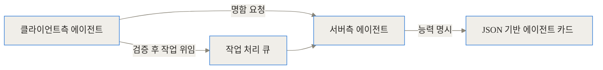
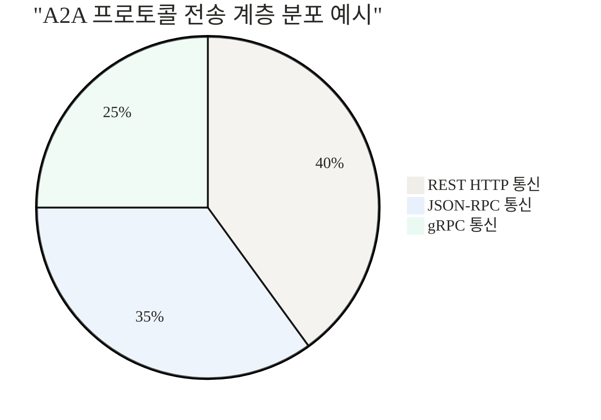
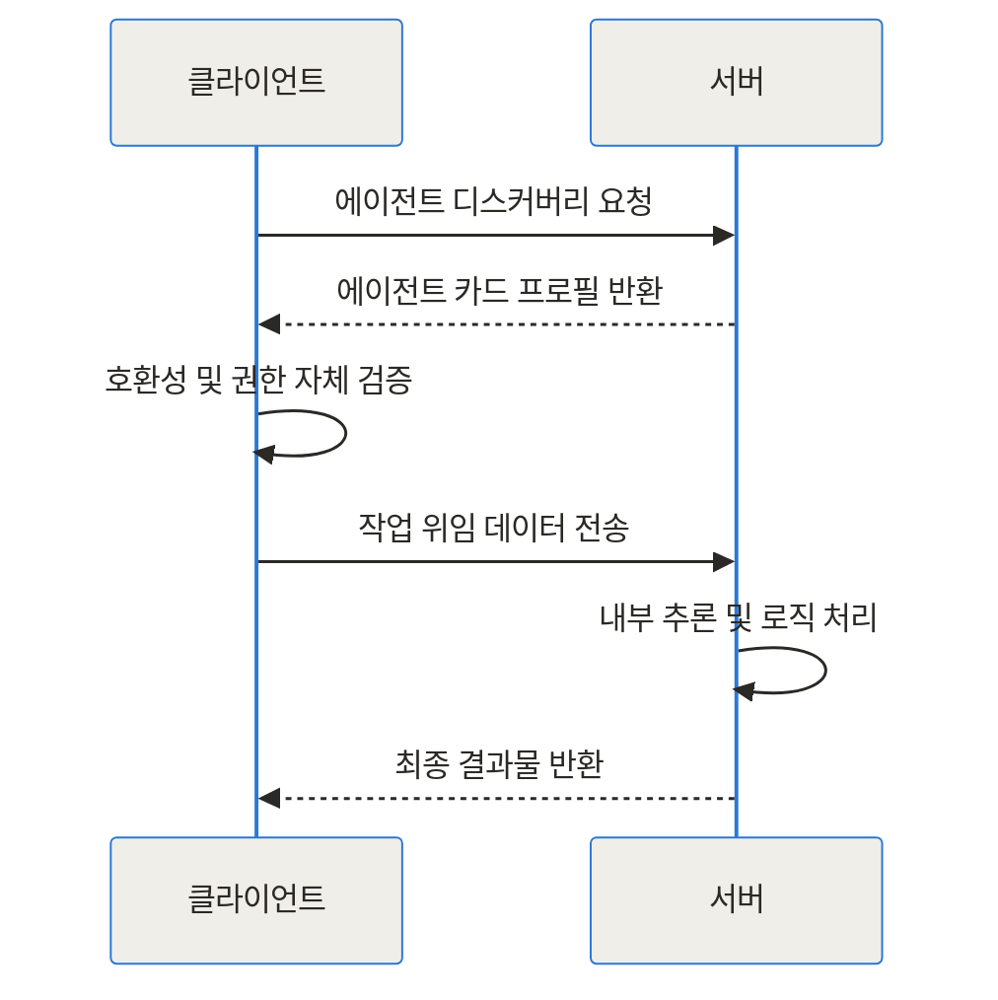
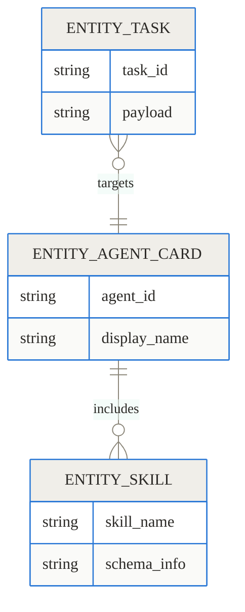
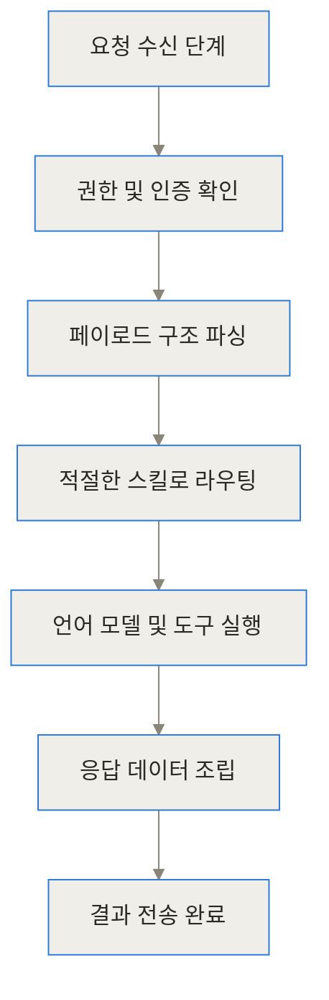
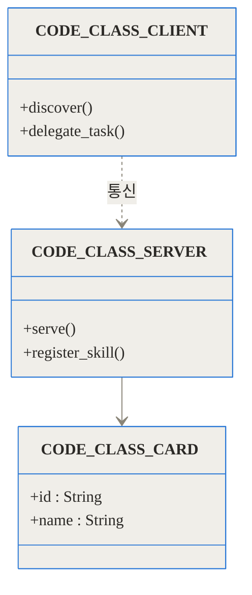
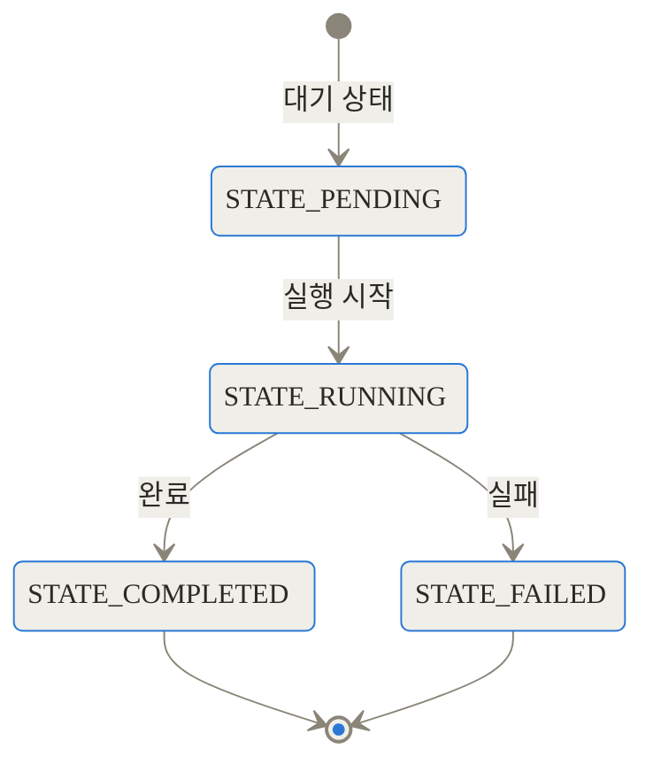

## 상단 참조 링크

- 공식 GitHub 저장소: [a2aproject/A2A](https://github.com/a2aproject/A2A)
- 파이썬 공식 SDK: [a2aproject/a2a-python](https://github.com/a2aproject/a2a-python)
- 샘플 코드 및 예제: [a2aproject/a2a-samples](https://github.com/a2aproject/a2a-samples)

## 도입 및 세 줄 요약

독립적으로 만들어진 인공지능 에이전트들이 서로 대화하며 작업을 넘길 수 있다면 어떨까요? 현업에서 다양한 벤더사와 프레임워크로 구축된 에이전트들은 서로 소통하지 못한 채 각각 고립되어 운영되고 있습니다. 구글이 주도하여 시작하고 리눅스 재단이 이끌어가고 있는 A2A(Agent-to-Agent) 프로젝트는 이 파편화된 다중 에이전트 생태계를 표준화된 규격으로 연결하기 위해 등장했습니다.

> **TL;DR (한 줄 요약)**
> - A2A는 서로 다른 프레임워크와 프로그래밍 언어로 만들어진 인공지능 에이전트들이 공통의 규칙으로 통신하고 작업을 위임할 수 있게 해주는 표준 프로토콜입니다.
> - 에이전트 카드라는 공통 데이터 규격을 통해 자신의 능력과 연결 방식을 외부에 명시하고, JSON-RPC, REST, gRPC 등 유연한 전송 계층을 활용합니다.
> - 복잡한 다중 에이전트 환경에서 벤더 종속성을 없애고, 위임 체인 컨텍스트를 통해 권한 관리를 투명하게 유지하면서 상호운용성을 크게 높여줍니다.

## 배경과 문제 정의: 고립된 에이전트들의 섬

최근 기업들은 다양한 업무를 자동화하기 위해 거대 언어 모델을 기반으로 한 자율 에이전트를 도입하고 있습니다. 부서의 특성과 목적에 따라 데이터 분석팀은 파이썬과 랭체인을 사용하기도 하고, 백엔드 서비스팀은 자바나 C#을 기반으로 자체 에이전트를 구축합니다. 문제는 이 뛰어난 능력을 갖춘 에이전트들이 서로 소통할 방법이 기본적으로 존재하지 않는다는 점입니다.

기존의 방식에서는 A 에이전트가 B 에이전트의 데이터나 추론 결과를 활용하려면, 개발자가 중간에 커스텀 API를 만들고 두 시스템의 입출력 데이터 형태를 일일이 맞추어 주어야 했습니다. 연동해야 할 사내외 에이전트가 10개, 100개로 늘어난다면 스키마 관리와 유지보수는 끔찍한 악몽이 됩니다.

도구 호출 표준으로는 모델 컨텍스트 프로토콜(MCP)이 등장하여 널리 쓰이고 있지만, 이는 언어 모델과 수동적인 도구 사이의 연결에 집중합니다. 스스로 판단하고 행동하는 불투명한 외부 에이전트에게 통째로 작업을 위임하고, 그 결과를 안전하게 받아오는 데에는 한계가 존재했습니다. 바로 이 지점에서 단순한 함수 호출이 아닌, 지능을 가진 에이전트 간의 통신 표준인 A2A가 필요해졌습니다.

## 개념 쉽게 이해하기: 명함과 이력서를 교환하는 AI

A2A 프로토콜의 중심 아이디어는 매우 직관적입니다. 사람으로 비유하자면, 서로 처음 만난 각 분야의 전문가들이 명함과 이력서를 주고받으며 협업하는 방식과 동일합니다.

이를 시스템적으로 구현하기 위해 A2A는 에이전트 카드라는 개념을 사용합니다. 에이전트 카드는 이 에이전트의 고유 식별자가 무엇인지, 어떤 전문 능력을 갖추고 있는지, 어떤 데이터를 주고받을 수 있는지, 그리고 보안 인증은 어떻게 해야 하는지를 적어둔 공개된 프로필 문서입니다.

클라이언트 에이전트는 상대 서버 에이전트의 에이전트 카드를 먼저 읽고, 자신이 넘겨야 할 작업이 상대방의 전문 분야에 맞는지 자체적으로 판단합니다. 조건이 맞다면 상대가 요구하는 정확한 데이터 형식으로 작업을 위임하고 결과를 기다리게 됩니다.



이 모든 과정이 플랫폼, 운영체제, 언어에 종속되지 않고 이루어집니다. 구글이 주도하여 리눅스 재단에 기증한 이 프로젝트는 어느 한 기업의 클라우드나 기술에 묶이지 않는 완전한 중립성을 바탕으로 생태계를 확장하고 있습니다.

## 작동 원리 심층 파헤치기

A2A 프로토콜이 실제로 어떻게 작동하는지 내부 아키텍처와 데이터 흐름을 단계별로 들여다보겠습니다.

### 다중 전송 계층 지원

A2A 프로토콜은 단일한 네트워크 통신 방식만 강제하지 않습니다. 상황과 네트워크 환경에 맞춰 최적의 방식을 선택할 수 있도록 주요 전송 계층 세 가지를 공식 지원하고 있습니다.



외부 파트너사에게 노출되는 대중적인 인터페이스라면 방화벽 통과가 쉬운 HTTP 기반의 REST 방식을 사용합니다. 반면 기업의 내부망에서 수많은 마이크로서비스 에이전트들이 초고속으로 통신해야 한다면 직렬화 성능이 뛰어난 gRPC를 선택할 수 있습니다. JSON-RPC는 양방향 통신이나 웹소켓 기반의 실시간 스트리밍에 유리한 구조를 제공합니다.

### 컴포넌트 상호작용과 요청 흐름

에이전트가 다른 에이전트에게 작업을 위임하는 전체 생명주기를 시간 순서대로 살펴보면 다음과 같습니다.



가장 먼저 디스커버리 단계를 거치며 클라이언트는 서버가 어떤 스킬을 제공하는지 확인합니다. 대상 에이전트가 내부적으로 어떤 복잡한 프레임워크를 사용하는지 블랙박스처럼 숨기고 있더라도, 이 명시된 프로토콜 규격 덕분에 입출력 데이터를 정확하게 맞추어 통신할 수 있습니다.


### 데이터 모델과 스키마 관계

프로토콜의 기반이 되는 데이터 구조를 살펴보면, 에이전트 카드와 스킬, 그리고 위임되는 작업 사이의 관계를 명확히 이해할 수 있습니다.



하나의 에이전트 카드는 여러 개의 세부 스킬을 포함할 수 있으며, 외부에서 전달되는 작업 요청은 특정 에이전트 카드에 정의된 스키마 규칙을 완벽하게 따라야만 수락됩니다.

### 서버 내부의 처리 흐름

A2A 서버가 외부로부터 작업 위임 요청을 받았을 때, 내부적으로 처리하는 파이프라인 구조입니다.



이러한 정형화된 파이프라인 덕분에 개발자는 네트워크 로직이나 인증 로직에 신경 쓰지 않고, 오직 에이전트의 핵심 지능을 고도화하는 데에만 집중할 수 있습니다.

### 위임 체인과 단조적 능력 축소

A2A가 특히 엔터프라이즈 환경에서 주목받는 이유는 보안과 감사 추적 기능 때문입니다. 에이전트 A가 B에게, B가 다시 C에게 작업을 연쇄적으로 위임하는 상황을 생각해 보십시오. 누가 이 복잡한 작업의 최종 책임자이고 토큰 예산을 소모하고 있는지 추적하기는 매우 까다롭습니다.

A2A는 위임 체인 컨텍스트를 지원하여 모든 API 호출의 뿌리를 역추적합니다. 또한 단조적 능력 축소 개념을 프로토콜 설계에 반영하였습니다. 상위 에이전트가 하위 에이전트를 호출할 때, 자신이 가진 예산이나 권한의 범위를 엄격하게 제한하여 넘겨줍니다. 권한이 아래로 내려갈수록 축소되기만 할 뿐 절대 늘어나지 않으므로, 악의적인 프롬프트 인젝션 등으로 인한 보안 사고의 피해 범위를 안전하게 격리할 수 있습니다.

## 구현 및 사용 디테일: 코드로 보는 A2A

공식 파이썬 SDK를 통해 실제 에이전트를 구성하고 통신하는 방법을 구체적으로 알아보겠습니다.

### 설치 및 환경 구성

A2A SDK는 최신 파이썬 환경에서 비동기 기반으로 빠르고 효율적으로 동작합니다. 패키지 관리자를 통해 필요한 통신 계층 확장 모듈과 함께 손쉽게 설치할 수 있습니다.

```bash
# 핵심 SDK 및 FastAPI 기반 서버 확장 모듈 설치
uv add "a2a-sdk[fastapi]"
```

### SDK 클래스 구조

내부적으로 SDK는 서버 구동을 전담하는 유틸리티와 통신을 담당하는 클라이언트 클래스로 깔끔하게 역할이 분리되어 있습니다.



### 서버 에이전트 만들기

특정 작업을 수행하고 결과를 반환하는 수동적인 서버 에이전트를 띄워보겠습니다. 코드는 불필요한 장식 없이 명확합니다.

```python
import asyncio
from a2a_sdk import AgentCard, Skill
from a2a_sdk.server import A2AServer

async def weather_skill(location: str):
    # 내부 추론 엔진이나 외부 API를 호출하여 결과를 생성합니다.
    return f"{location}의 현재 날씨는 맑음이며, 온도는 22도입니다."

async def main():
    # 1. 에이전트 카드 정의: 자신의 정체성을 선언합니다.
    card = AgentCard(
        id="weather-expert-agent",
        name="Weather Analysis Agent",
        description="지역 날씨 정보를 분석하여 기상 상황을 제공하는 에이전트입니다."
    )
    
    # 2. 스킬 등록 및 서버 초기화
    server = A2AServer(agent_card=card)
    server.register_skill(Skill(name="get_weather", func=weather_skill))
    
    # 3. HTTP 서버 실행 (포트 8080)
    print("A2A 기상 에이전트 서버가 실행 대기 중입니다.")
    await server.serve(port=8080)

if __name__ == "__main__":
    asyncio.run(main())
```

### 클라이언트 에이전트가 작업 위임하기

이제 다른 외부 에이전트가 방금 띄운 서버 에이전트에게 날씨 분석 작업을 위임하는 코드입니다.

```python
import asyncio
from a2a_sdk.client import A2AClient

async def main():
    # 원격 에이전트의 주소를 지정하여 클라이언트 인스턴스 생성
    client = A2AClient(endpoint="http://localhost:8080")
    
    # 1. 디스커버리: 상대방의 카드를 읽어 능력을 확인합니다.
    card = await client.discover()
    print(f"발견된 에이전트: {card.name}")
    
    # 2. 작업 위임: 조건에 맞춰 데이터를 전달합니다.
    response = await client.delegate_task(
        skill_name="get_weather",
        payload={"location": "Seoul"}
    )
    
    print(f"최종 반환된 결과: {response.result}")

if __name__ == "__main__":
    asyncio.run(main())
```

이처럼 개발자는 네트워크 수준의 복잡한 패킷 처리나 스키마 검증 로직을 작성할 필요 없이, 단 몇 줄의 코드만으로 에이전트 간의 작업을 매끄럽게 연동할 수 있습니다.

### 작업 생명주기 관리

실제 실무 환경에서 언어 모델이 코드를 작성하거나 데이터를 분석하는 작업은 수 분에서 길게는 수십 분까지 걸릴 수 있습니다. 따라서 위임한 작업의 상태를 지속적으로 추적하는 상태 전이 관리가 필수적입니다.



A2A 클라이언트는 서버 센트 이벤트(SSE) 기반의 스트리밍 방식을 활용하거나 주기적인 비동기 폴링을 통해 작업의 진척도와 상태 변화를 실시간으로 모니터링할 수 있도록 설계되어 있습니다.

## 실전 활용 시나리오

A2A 프로토콜이 도입되었을 때 실제 산업 현장에서 어떻게 문제를 해결할 수 있는지 구체적인 시나리오 두 가지를 제시합니다.

### 1. 기업용 구매 비서와 원격 판매자 에이전트 간의 협상
사내 슬랙에서 동작하는 B2B 구매 비서 에이전트가 있습니다. 사용자가 "사내 휴게실용 의자 10개를 100만 원 예산 안에서 주문해 줘"라고 요청합니다. 이 에이전트는 직접 재고를 검색하는 것이 아니라, 외부 가구 업체의 원격 판매자 에이전트와 A2A 프로토콜로 직접 소통합니다. 구매 비서는 회사의 예산 한도를 단조적 능력 축소 규격에 담아 판매자 에이전트에게 넘깁니다. 판매자 에이전트는 부여받은 한도 내에서 최적의 상품을 찾아 구매 비서에게 제안하고, 비서가 이를 승인하면 최종 결제가 이루어지는 식입니다.

### 2. 언어의 장벽을 넘는 에이전트 파이프라인
사내 데이터 분석팀은 파이썬과 랭체인을 결합하여 방대한 로그 데이터를 분석하는 에이전트를 만들었습니다. 반면 백엔드 개발팀은 자바(Java) 생태계 기반으로 사내 위키에 문서를 구조화하여 등록하는 에이전트를 운영합니다. A2A 프로토콜이 없다면 두 팀은 몇 주에 걸쳐 커스텀 API를 설계하고 보안 검토를 받아야 합니다. 하지만 A2A를 적용하면 파이썬 에이전트는 분석 결과 요약본을 정해진 페이로드에 담아 자바 에이전트에게 전송하기만 하면 됩니다. 자바 SDK가 규격에 맞게 데이터를 안전하게 수신하고 문서화 작업을 독립적으로 완수합니다.

## 벤치마크 및 트레이드오프 비교

새로운 프로토콜이나 기술을 현업에 도입할 때는 얻게 되는 생산성과 잃게 되는 비용을 객관적으로 비교해 보아야 합니다. 개발팀이 서로 다른 벤더로 구성된 에이전트 5개를 하나의 파이프라인으로 연결할 때, 기존 커스텀 연동 방식과 A2A 프로토콜을 사용했을 때의 소요 시간을 측정한 참고 지표입니다.

```chartjs
{
  "type": "bar",
  "data": {
    "labels": ["기존 커스텀 API 방식", "A2A 프로토콜 도입 후"],
    "datasets": [
      {
        "label": "신규 에이전트 연동 소요 시간 (시간)",
        "data": [48, 4]
      }
    ]
  }
}
```

결과에서 나타나듯, 스키마 정의, 에러 처리 규격 협의, 인증 로직 구현을 매 연동마다 새로 할 필요가 없으므로 통합에 걸리는 시간이 획기적으로 줄어듭니다.

아래 표는 기존에 사용하던 접근 방식들과 A2A 프로토콜을 다각도에서 비교한 내용입니다.

| 비교 항목 | 기존 커스텀 API 방식 | 랭체인/오토젠 내부 통신 | 모델 컨텍스트 프로토콜 (MCP) | A2A 프로토콜 |
| :--- | :--- | :--- | :--- | :--- |
| **주요 목적** | 일반적인 시스템 간 데이터 전송 | 단일 프레임워크 내 컴포넌트 협력 | 언어 모델과 외부 도구(데이터) 간의 연결 | 독립된 외부 지능 에이전트 간의 완전한 협력 |
| **상호 운용성** | 매우 낮음 (매번 개발 공수 발생) | 낮음 (특정 프레임워크에 강하게 종속) | 높음 (데이터 소스 제공에 특화) | 매우 높음 (언어와 프레임워크에 전혀 무관) |
| **발견(Discovery)** | 수동 문서 확인 및 스웨거(Swagger) 의존 | 내부 레지스트리 및 객체 참조 의존 | MCP 서버 스키마 기반 | JSON 에이전트 카드 기반의 자동 발견 |
| **추적 및 권한 통제** | 각 서비스별 개별 구현 필요 | 프레임워크 내장 기능 사용 | 도구 호출 권한만 제한적으로 제어 | 위임 체인 추적 및 단조적 권한 축소 규격 지원 |
| **언어 지원 범위** | 제한 없음 | 파이썬, 자바스크립트 등 일부 언어 위주 | 다양한 언어 지원 중 | 파이썬, 자바, Go, 러스트 등 광범위한 공식 지원 |

## 솔직한 평가: 한계와 고려해야 할 점

A2A 프로토콜이 모든 개발 과제를 해결해 주는 마법의 지팡이는 아닙니다. 실제 현업 도입을 검토할 때 반드시 짚고 넘어가야 할 냉정한 평가입니다.

첫째, 인프라 생태계가 이제 막 태동하는 단계입니다. 구글이 프로젝트를 공개하고 리눅스 재단에 기증하여 공식 출범한 것이 2025년 중순의 일입니다. 표준 규격 제정과 주요 언어 SDK는 훌륭하게 갖추어졌으나, 실무에서 바로 가져다 쓸 수 있는 방대한 오픈소스 플러그인이나 서드파티 기업들의 실제 상용 레퍼런스는 아직 쌓여가는 중입니다.

둘째, 단순한 작업에는 오버엔지니어링의 위험이 따릅니다. 스스로 복잡한 추론을 할 필요 없이 단순히 날씨 API를 호출하거나 사내 데이터베이스를 정해진 쿼리로 조회하는 것이 목적이라면, 가벼운 REST API나 MCP를 사용하는 것이 시스템 복잡도를 낮추는 데 훨씬 유리합니다. A2A는 에이전트가 스스로 판단을 내리는 불투명한 외부 지능에게 작업을 온전히 위임할 때 그 진정한 가치를 발휘합니다.

셋째, 외부 시스템 불투명성으로 인한 신뢰의 문제입니다. 통신 프로토콜 자체가 표준화되고 위임 체인 보안이 적용되었다고 해서, 상대 에이전트가 내린 내부 판단까지 완벽히 신뢰할 수 있는 것은 아닙니다. 잘못된 추론이나 환각(Hallucination) 현상이 포함된 결과가 반환될 리스크는 여전히 존재하므로, 클라이언트 측에서 수신된 데이터를 최종적으로 검증하는 방어적 프로그래밍 로직은 반드시 동반되어야 합니다.

## 마무리

인공지능 에이전트가 점점 더 전문화되고 기능이 고도화되면서, 하나의 거대한 모놀리식 에이전트가 세상의 모든 일을 처리하는 시대는 저물고 있습니다. 과거 소프트웨어 생태계에서 마이크로서비스 아키텍처가 거대한 단일 시스템을 대체했듯, 앞으로의 AI 생태계 역시 작고 특화된 에이전트들이 네트워크를 통해 긴밀하게 협력하는 다중 에이전트 사회로 진화할 것입니다.

A2A 프로젝트는 서로 다른 개발 언어와 프레임워크라는 거대한 장벽을 허물고, 에이전트들이 공통의 언어로 명함을 교환하고 소통할 수 있는 튼튼한 도로망을 닦고 있습니다. 리눅스 재단의 투명한 중립성과 폭넓은 공식 언어 지원 덕분에 특정 플랫폼에 묶이지 않는 진정한 오픈 표준으로 안착할 가능성이 높습니다. 다가올 멀티 에이전트 자동화 시대를 발 빠르게 준비하고 있다면, A2A 프로토콜의 설계 철학과 발전 과정을 주의 깊게 살펴보고 선제적으로 사내 파이프라인에 적용해 볼 시점입니다.

## 자주 묻는 질문 (FAQ)

### A2A 프로토콜은 MCP(Model Context Protocol)와 무엇이 다른가요?

MCP는 거대 언어 모델(LLM)과 정적인 데이터 출처, 외부 도구를 연결하는 데 집중된 표준입니다. 반면 A2A는 이미 독립적으로 작동하고 있는 인공지능 에이전트들이 서로의 능력을 파악하고 능동적으로 작업을 위임하며 협력하기 위한 에이전트 간 통신 표준입니다. 즉, 도구 연동과 지능을 가진 에이전트 연동이라는 명확한 목적의 차이가 있습니다.

### 어떤 프로그래밍 언어와 통신 방식을 지원하나요?

파이썬, 자바, 자바스크립트, Go, C#/.NET, 러스트 등 실무에서 쓰이는 주요 언어용 SDK를 모두 제공합니다. 통신 방식 또한 환경에 맞춰 유연하게 선택할 수 있도록 대중적인 HTTP 기반의 REST는 물론, 성능이 뛰어난 JSON-RPC와 gRPC를 모두 공식적으로 지원하여 범용성을 높였습니다.

### 기존에 이미 구축해 둔 사내 내부 에이전트에도 A2A를 적용할 수 있나요?

네, 적용 가능합니다. 기존에 구축된 에이전트 시스템 앞단에 A2A 서버 인터페이스를 래핑(Wrapping)하는 형태로 가볍게 통합할 수 있습니다. 이를 통해 외부 에이전트가 표준화된 규격(에이전트 카드)을 바탕으로 기존 사내 에이전트의 기능을 호출하고 협업하도록 만들 수 있습니다.

### 외부 에이전트에 작업을 넘길 때 보안이나 권한 남용 문제는 어떻게 방지하나요?

A2A 프로토콜은 위임 체인 컨텍스트(Delegation chain context)와 단조적 능력 축소(Monotonic capability narrowing)라는 강력한 보안 개념을 내장하고 있습니다. 이를 통해 작업의 최초 호출 주체를 명확히 추적하고, 하위 에이전트에게 작업을 넘길 때 토큰 예산이나 접근 권한을 엄격하게 제한함으로써 보안 사고를 사전에 차단합니다.

### 특정 대기업의 클라우드나 기술 생태계에 종속되는 것은 아닌가요?

초기에는 구글이 기획하고 개발을 주도하였으나, 2025년 중순에 리눅스 재단에 프로젝트가 정식으로 기증되었습니다. 현재는 특정 벤더나 클라우드 제공자에 종속되지 않는 완전히 독립적이고 중립적인 오픈 소스 거버넌스 하에 관리되고 있으므로 락인(Lock-in) 걱정 없이 도입할 수 있습니다.


## References
- [A2A 프로젝트 공식 GitHub 저장소](https://github.com/a2aproject/A2A)
- [A2A 공식 파이썬 SDK 저장소](https://github.com/a2aproject/a2a-python)
- [A2A 샘플 프로젝트 및 튜토리얼](https://github.com/a2aproject/a2a-samples)
