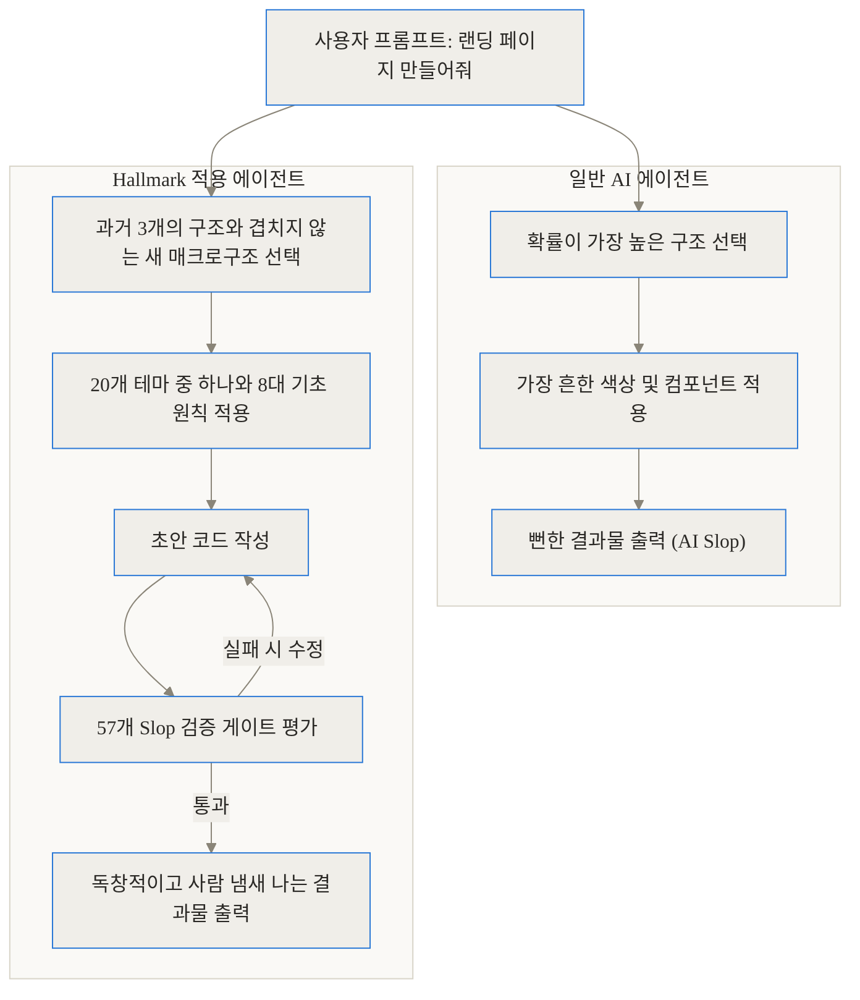
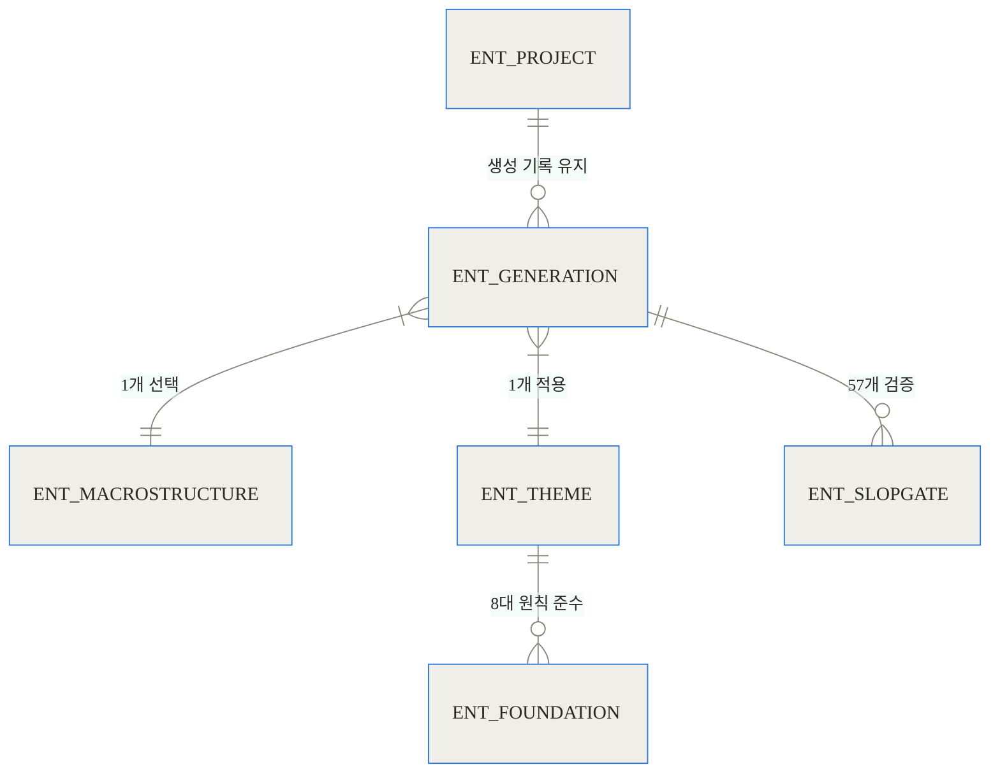
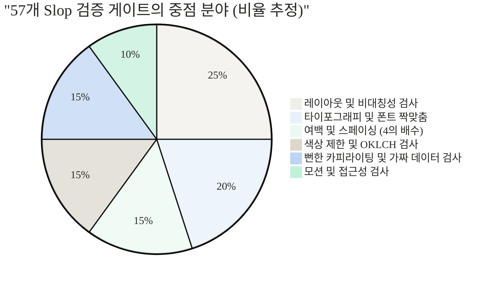
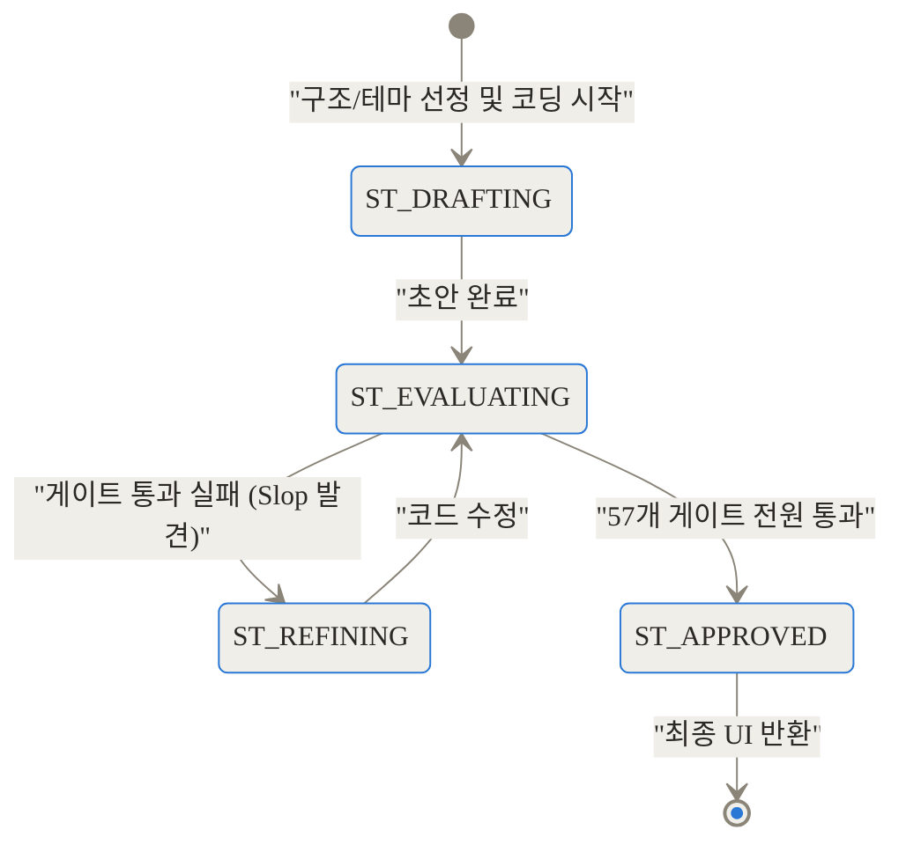
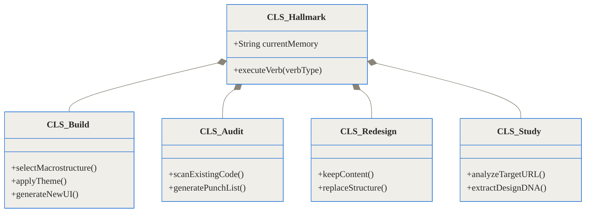
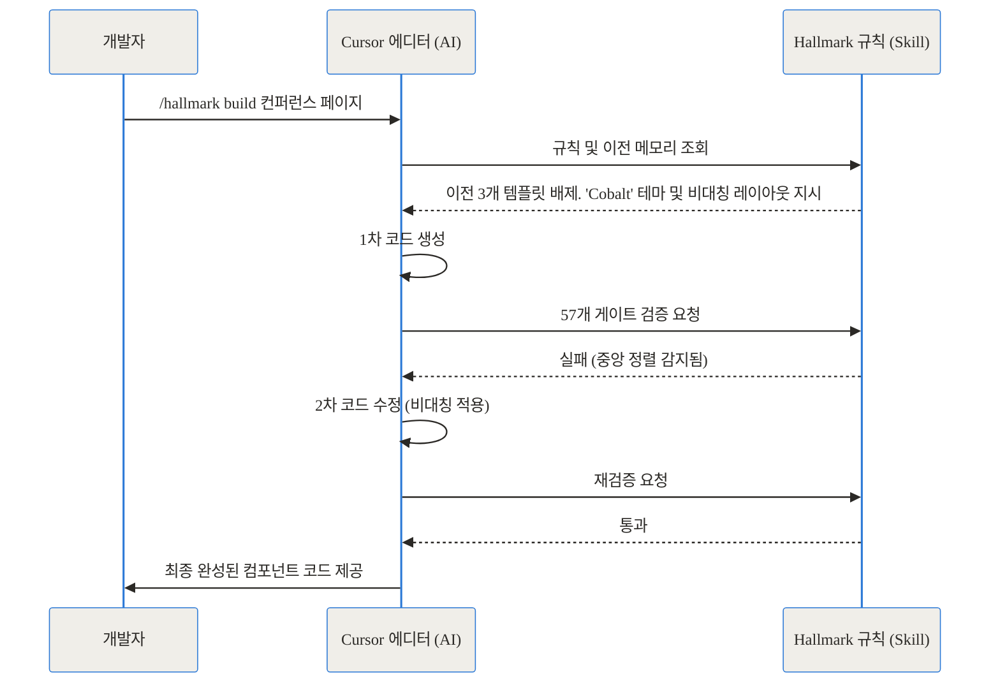

> **TL;DR (한 줄 요약)**
> - **무엇인가요?** AI 코딩 에이전트(Claude Code, Cursor 등)가 똑같은 형태의 기계적인 웹 디자인을 뱉어내지 못하게 막는 강력한 가이드라인 스킬입니다.
> - **어떻게 작동하나요?** 20개의 테마, 8개의 디자인 기초 원칙, 57개의 자체 검증 게이트를 통해 구조적 다양성을 강제합니다.
> - **왜 필요한가요?** 명령어 한 줄로 설치하면, AI가 더 이상 보라색 그라데이션과 3단 카드로 도배된 '공장형 UI'를 만들지 않고 사람이 직접 고민한 듯한 결과물을 냅니다.

---

## 시작하며: 왜 AI가 만든 웹사이트는 다 똑같이 생겼을까?

개발자나 기획자라면 최근 AI 코딩 에이전트에게 랜딩 페이지나 대시보드 제작을 맡겨본 경험이 있을 것입니다. 결과물을 받아보면 코드는 훌륭하게 작동합니다. 하지만 브라우저를 띄우는 순간 어디서 많이 본 듯한 기시감에 휩싸이게 되죠.

화면 정중앙에 위치한 커다란 제목, 보라색과 분홍색이 섞인 모호한 그라데이션 배경, 그 아래 나란히 놓인 세 개의 기능 설명 카드, 그리고 출처를 알 수 없는 가짜 고객 후기 띠까지. 모델의 종류와 상관없이 AI가 만들어내는 디자인은 놀랍도록 비슷합니다. 

이러한 현상을 업계에서는 **AI Slop(AI가 학습 데이터의 평균값에 수렴하여 만들어내는, 특색 없고 뻔한 결과물)**이라고 부릅니다. 인공지능은 방대한 인터넷 데이터를 학습합니다. 그리고 가장 '안전하고 확률이 높은' 구조를 선택하는 경향이 있습니다. 그 결과, 수천만 개의 평범한 템플릿들을 평균 낸 가장 지루한 뼈대만을 반복해서 꺼내놓는 것입니다.

색상을 바꾸고 폰트를 조금 수정한다고 해서 이 문제가 해결되지는 않습니다. 근본적인 '골격'이 같기 때문입니다. 이 답답한 상황을 타개하기 위해 Together AI의 개발자 Hassan El Mghari(Nutlope)와 Youssef E.가 내놓은 해답이 바로 오늘 살펴볼 프로젝트, **Hallmark**입니다.

---

## Hallmark란 무엇인가: 페인트를 바꾸는 대신, 설계도를 바꾸다

Hallmark는 프론트엔드 프레임워크나 UI 라이브러리가 아닙니다. Claude Code, Cursor, OpenAI Codex 등 우리가 일상적으로 사용하는 AI 코딩 에이전트에게 주입하는 **'강력한 디자인 규칙 셋(Skill)'**입니다.

이것은 마치 AI에게 새로운 물감을 쥐여주는 것이 아니라, 깐깐한 수석 아트 디렉터를 AI의 머릿속에 상주시키는 것과 같습니다. 

Hallmark의 가장 중심이 되는 철학은 시각적 다양성(Visual Variety)보다 **구조적 다양성(Structural Variety)**을 우선한다는 점입니다. AI가 습관적으로 중앙 정렬 레이아웃을 꺼내려 할 때, Hallmark는 그 손을 쳐내고 "이번에는 비대칭 레이아웃을 사용하고, 타이포그래피로 위계를 잡아라"라고 명령합니다. 

아래의 파이프라인 다이어그램을 통해 일반적인 AI와 Hallmark를 탑재한 AI의 작업 흐름 차이를 확인할 수 있습니다.



결과적으로 Hallmark를 통해 생성된 두 개의 서로 다른 프로젝트는, 단순히 색상만 바꾼 똑같은 사이트가 아니라 완전히 다른 사람이 설계한 것처럼 보이게 됩니다.

---

## 작동 원리 심층 해부 (Under the Hood)

Hallmark가 단순히 "예쁘게 만들어줘"라는 프롬프트와 차원을 달리하는 이유는 그 내부 구조의 치밀함에 있습니다. 데이터를 어떻게 다루고, 어떤 원칙을 강제하는지 단계별로 깊이 파헤쳐 보겠습니다.

### 1. 매크로구조와 프로젝트 메모리

AI가 매번 똑같은 레이아웃을 내놓는 것을 막기 위해, Hallmark는 **프로젝트 메모리(최근 생성한 디자인의 뼈대 기록)**를 유지합니다. AI는 새로운 페이지를 만들 때마다 이 메모리를 확인하고, 최근 사용된 3개의 매크로구조(페이지 전체의 뼈대를 이루는 큰 틀과 요소들의 배치 방식)를 강제로 배제합니다.

아래 다이어그램은 이 구조들이 어떻게 관계를 맺고 있는지 보여줍니다.



### 2. 절대 타협하지 않는 8개의 기초 원칙 (Foundations)

Hallmark는 어떤 테마를 선택하든 반드시 지켜야 하는 8가지 뼈대 규칙을 AI에게 각인시킵니다. 이 규칙들은 단순한 옵션이 아니라 절대적인 강제 사항입니다.

1. **Type (타이포그래피)**: 제목용 폰트와 본문용 폰트를 반드시 분리합니다. 하나의 폰트로 모든 역할을 덮어쓰지 않습니다.
2. **Color (색상)**: OKLCH 팔레트(인간의 시각 인지에 맞춰 밝기, 채도, 색상을 균일하게 조절하는 최신 색상 체계)를 사용합니다. 메인 색상은 하나만 두고 강조 색은 전체의 5% 미만으로 제한합니다.
3. **Space (여백)**: 여백은 무조건 4의 배수로 설정합니다. 17px 같은 임의의 숫자를 허용하지 않습니다.
4. **Motion (모션)**: 애니메이션은 반드시 지수형 감속(Exponential ease-out)을 사용하며, 접근성을 위해 모션 축소(Reduced-motion) 대안을 함께 코딩합니다.
5. **Voice (어조)**: 평이하고 기계적인 SaaS 기본 어투를 금지합니다. 테마에 맞는 고유한 목소리를 강제합니다.
6. **Layout (레이아웃)**: 의도적인 비대칭을 추구합니다. 모든 것을 정중앙에 배치하는 것은 AI의 가장 흔한 버릇이므로 철저히 배제합니다.
7. **Hierarchy (위계)**: 제목, 본문, 라벨의 두께 계층을 명확히 하여 사용자가 2초 안에 구조를 파악하게 합니다.
8. **Restraint (절제)**: 억지로 꾸민 무언가보다 차라리 아무것도 없는 빈 공간이 낫습니다. 과도한 장식을 쳐냅니다.

### 3. 57개의 Slop 테스트 게이트

AI가 코드를 작성했다고 해서 바로 사용자에게 보여주지 않습니다. Hallmark는 코드가 최종 출력되기 전, 자체적으로 57개의 체크리스트를 통과하도록 만듭니다. 이는 흔히 발생하는 AI의 나쁜 습관을 족집게처럼 잡아내는 과정입니다.



만약 AI가 습관적으로 그라데이션 버튼이나 "10x faster" 같은 허풍 섞인 가짜 카피라이팅을 넣었다면, 게이트에서 탈락하고 코드를 다시 수정해야 합니다.

이러한 내부 평가 생명주기는 다음과 같이 표현할 수 있습니다.



---

## 구체적인 설치와 4가지 핵심 명령어 (Verbs)

이 훌륭한 기능을 어떻게 사용할 수 있을까요? Hallmark의 설치는 허무할 정도로 간단합니다.

### 설치 방법

터미널에서 아래 명령어를 실행하기만 하면 됩니다.

```bash
npx skills add nutlope/hallmark
```

이 명령어는 프로젝트 루트에 있는 특정 폴더(Claude Code의 경우 `~/.claude/skills/hallmark/`, Cursor의 경우 `.cursor/rules/hallmark.mdc`)에 규칙을 복사합니다. 이제 에디터의 AI가 코드를 짤 때 자동으로 이 규칙을 읽어 들이게 됩니다.

### 4가지 동작 모드 (Verbs)

Hallmark는 단순히 새로운 화면을 만드는 것 외에도 상황에 맞는 4가지 강력한 명령(Verb)을 제공합니다.



1. **Build (기본 동작)**
   - 명령: `/hallmark build [요청 내용]`
   - 가장 많이 쓰이는 모드입니다. 새로운 UI를 요청하면, 앞서 설명한 매크로구조와 테마를 선택하고 57개의 게이트를 거쳐 완벽한 페이지를 만들어 냅니다.

2. **Audit (감사)**
   - 명령: `/hallmark audit [대상 파일]`
   - 코드를 수정하지 않고, 현재 존재하는 코드가 얼마나 'AI스러운지' 채점합니다. 고쳐야 할 안티 패턴 목록(Punch list)만 반환하므로 리팩토링 계획을 세울 때 유용합니다.

3. **Redesign (재설계)**
   - 명령: `/hallmark redesign [대상 파일]`
   - 텍스트 카피, 브랜드 정체성, 정보 구조(IA)는 그대로 유지하면서 페이지의 뼈대와 느낌만 완전히 새롭게 갈아엎습니다.

4. **Study (학습)**
   - 명령: `/hallmark study [URL 또는 스크린샷]`
   - 당신이 평소 멋지다고 생각했던 특정 웹사이트의 URL을 주면, Hallmark가 그 사이트의 표면적인 픽셀이 아니라 '구조적 DNA'(여백 방식, 폰트 위계, 매크로구조)를 추출해 냅니다. 이후 이 DNA를 바탕으로 새로운 페이지를 구축할 수 있습니다.

---

## 실전 활용 시나리오: 현업에서는 어떻게 쓰일까?

이론적인 설명을 넘어, 실제 개발 현장에서 Hallmark가 어떻게 쓰일 수 있는지 두 가지 시나리오를 살펴보겠습니다.

### 시나리오 1: 사내 백오피스 대시보드의 대대적인 리팩토링
스타트업의 시니어 개발자 김현업 씨는 기존 사내 대시보드가 너무 낡았다고 느낍니다. 하지만 처음부터 다시 짜기엔 시간이 부족합니다. Cursor 에디터를 열고 기존 대시보드 코드를 띄운 뒤, `redesign` 명령을 내립니다.

> **사용자**: `/hallmark redesign dashboard.tsx. 기존의 데이터 흐름과 텍스트는 건드리지 말고, 구조만 세련되게 바꿔줘.`

AI는 기존의 지루한 표(Table) 위주의 레이아웃을 폐기합니다. 대신 Hallmark의 규칙에 따라 비대칭 분할 레이아웃을 도입하고, OKLCH 색상계로 눈이 편안한 여백(4의 배수)을 적용한 완전히 새로운 대시보드 코드를 토해냅니다. 데이터 로직은 그대로 유지되었기 때문에 복잡한 수정 없이 바로 배포가 가능해집니다.

### 시나리오 2: 개발자 컨퍼런스 랜딩 페이지 제작
기획자 이혁신 씨는 급하게 컨퍼런스 랜딩 페이지를 만들어야 합니다. 일반 AI에게 맡겼더니 여지없이 흔해 빠진 그라데이션 페이지가 나왔습니다. 이번엔 Hallmark를 탑재한 Claude Code에 명령합니다.

> **사용자**: `/hallmark build 프론트엔드 개발자 컨퍼런스 랜딩 페이지를 만들어줘.`

AI는 스스로 'Cobalt(정밀하고 기술적인 느낌)' 테마를 선택합니다. 중앙 정렬을 피하기 위해 화면을 대각선으로 분할하는 구조를 잡고, 제목과 본문에 명확히 대비되는 폰트를 적용합니다. '10배 빠른' 같은 가짜 수치는 삭제하고 실제 입력 가능한 정보 구조로 대체합니다. 이 모든 과정이 프롬프트 한 번에 이루어집니다.



---

## 벤치마크 및 비교: 무엇이 얼마나 달라지는가?

기존 프롬프트 엔지니어링이나 테일윈드(Tailwind) 템플릿을 사용하는 것과 비교했을 때, Hallmark는 수치적으로나 질적으로 확연한 차이를 보입니다.

아래 그래프는 일반 AI 에이전트와 Hallmark가 적용된 에이전트가 100번의 랜딩 페이지 생성을 시도했을 때, 구조적 다양성과 판에 박힌 디자인(Slop) 발생률을 비교한 추정 데이터입니다.

```chartjs
{
  "type": "bar",
  "data": {
    "labels": ["일반 기본 AI 에이전트", "Hallmark 적용 에이전트"],
    "datasets": [
      {
        "label": "고유한 레이아웃 생성 비율 (%)",
        "data": [12, 95],
        "backgroundColor": "rgba(54, 162, 235, 0.6)"
      },
      {
        "label": "전형적 AI Slop 발생률 (%)",
        "data": [85, 3],
        "backgroundColor": "rgba(255, 99, 132, 0.6)"
      }
    ]
  },
  "options": {
    "responsive": true,
    "scales": {
      "y": {
        "beginAtZero": true,
        "max": 100
      }
    }
  }
}
```

그래프에서 볼 수 있듯, 일반 AI는 85% 확률로 기존에 우리가 알고 있던 뻔한 페이지를 만들어냅니다. 반면 Hallmark는 구조적 다양성을 강제하여 95%의 상황에서 새로운 골격을 짜냅니다.

이 차이를 마크다운 표로 조금 더 명확히 비교해 보겠습니다.

<br>

| 비교 지표 | 일반 AI 코딩 에이전트 | 기존 UI 템플릿 라이브러리 | Hallmark 적용 에이전트 |
|---|---|---|---|
| **구조 결정 방식** | 모델이 학습한 가장 흔한(평균적인) 확률 구조 의존 | 미리 만들어진 고정 템플릿 복사 후 내용만 수정 | 매크로구조 메모리를 통해 매번 다른 비대칭/독창적 골격 생성 |
| **디자인 다양성** | 낮음 (대부분 중앙 정렬, 상단 히어로, 하단 3단 카드) | 중간 (준비된 템플릿 개수 내에서만 다양성 존재) | 매우 높음 (20개 테마 × 수많은 구조 조합) |
| **품질 통제 (Quality Control)** | 없음. 환각이나 기계적인 레이아웃 그대로 노출 | 템플릿 제작자의 초기 품질에 의존. 커스텀 시 망가짐 | 57개의 엄격한 자체 검증 게이트가 코드 출력 전 필터링 |
| **에디터 통합성** | 기본적으로 프롬프트 창에 텍스트로만 요구해야 함 | 패키지를 설치하고 수동으로 컴포넌트를 조립해야 함 | Cursor, Claude Code 등의 AI 컨텍스트에 직접 주입되어 자동 적용 |

<br>

---

## 솔직한 평가: Hallmark가 항상 정답일까? (한계와 트레이드오프)

이렇게 훌륭해 보이는 기술도 만능은 아닙니다. 현업에 도입하기 전에 반드시 고려해야 할 솔직한 한계와 리스크들이 존재합니다.

**첫째, 뛰어난 추론 능력을 가진 모델이 필수적입니다.**
Hallmark는 수십 개의 규칙과 게이트를 프롬프트 컨텍스트(AI가 코드를 작성할 때 참고하는 배경 지식)로 주입하는 방식입니다. Claude 3.5 Sonnet이나 GPT-4o 수준의 똑똑한 모델이 아니라면, 이 복잡한 지시사항을 무시하고 원래 하던 대로 Slop 디자인을 내뱉을 확률이 높습니다. 비용이 저렴한 소형 모델에서는 제대로 작동하지 않을 수 있습니다.

**둘째, 컨텍스트 윈도우(토큰)를 상당히 소모합니다.**
규칙을 정의하는 `.mdc` 파일 자체가 상당한 분량의 텍스트입니다. 즉, AI에게 매번 무거운 디자인 가이드북을 먼저 읽게 한 뒤 코딩을 시키는 셈이므로, API를 직접 호출하는 환경이라면 토큰 비용이 상승할 수 있습니다.

**셋째, 지나치게 확고한 의견(Opinionated)을 가지고 있습니다.**
Hallmark는 비대칭을 사랑하고 중앙 정렬을 혐오합니다. 만약 여러분의 상사가 "그냥 흔하게 쓰는 일반적인 중앙 정렬 템플릿으로 만들어 줘"라고 요구한다면, Hallmark는 오히려 방해물이 됩니다. 의도적으로 평범하고 무난한 기업형 사이트를 원한다면 Hallmark의 규칙과 계속 싸워야 할 것입니다.

---

## 마무리: 에이전트의 시대, 디자인의 미래를 묻다

AI가 코드를 짜주는 시대가 오면서 개발 속도는 폭발적으로 빨라졌지만, 역설적으로 웹 공간은 점점 더 단조로워지고 있었습니다. 효율성이라는 이름 아래 모두가 평균적인 디자인에 수렴해 가고 있었죠.

Nutlope의 Hallmark는 이 흐름에 제동을 거는 신선한 시도입니다. AI에게 단순히 '그리는 법'을 가르치는 것이 아니라, '진부함을 피하는 법'과 '구조를 기획하는 법'을 가르쳤다는 점에서 큰 의미가 있습니다. 

앞으로 코딩 에이전트는 더 강력해질 것입니다. 그럴수록 Hallmark처럼 에이전트의 '취향'을 날카롭게 다듬어주는 규칙 셋(Skill) 생태계는 점점 더 중요해질 것입니다. 오늘 여러분의 사이드 프로젝트에 이 깐깐한 아트 디렉터를 한 번 초대해 보는 것은 어떨까요? 아마도 평소에 보지 못했던, 사람의 온기가 느껴지는 코드를 만나게 될 것입니다.

---

## FAQ (자주 묻는 질문)

**Q1. Hallmark는 어떤 에디터에서 사용할 수 있나요?**
현재 Claude Code, Cursor, 그리고 OpenAI Codex와 같이 로컬 프로젝트 폴더의 규칙 파일을 읽을 수 있는 주요 AI 코딩 어시스턴트에서 모두 사용 가능합니다. `.cursor/rules`나 `.claude/skills` 폴더에 설정 파일을 넣어두면 자동으로 인식합니다.

**Q2. 내부적으로 프론트엔드 프레임워크 제약이 있나요? (예: React만 가능한가요?)**
아닙니다. Hallmark는 디자인의 '구조와 원칙'을 AI에게 강제하는 프롬프트 기반의 스킬입니다. 따라서 React, Vue, Svelte, 심지어 순수 HTML/CSS를 사용할 때도 AI가 해당 언어에 맞춰 Hallmark의 원칙(비대칭, 여백 등)을 적용해 코드를 작성합니다.

**Q3. '57개의 게이트'는 실제로 코드를 컴파일해서 테스트하는 건가요?**
아닙니다. Hallmark는 AI가 자신의 결과물을 출력하기 전에 내부 추론 과정(Self-critique)을 거치도록 강제하는 프롬프트 엔지니어링 기술입니다. AI 모델 스스로 57개의 체크리스트를 바탕으로 자신이 짠 코드를 리뷰하고, 위반 사항이 있으면 수정 후 최종 답변을 내놓는 방식입니다.

**Q4. 기존에 작업하던 프로젝트에 도입하면 코드가 전부 망가지지 않을까요?**
기본 `build` 명령을 쓰면 충돌이 있을 수 있지만, Hallmark는 이를 대비해 `audit`과 `redesign`이라는 명령어를 제공합니다. `audit`을 사용하면 기존 코드를 건드리지 않고 평가만 받을 수 있으며, `redesign`을 통해 기존 데이터와 텍스트를 보존한 채 스타일만 안전하게 바꿀 수 있습니다.

**Q5. 회사 상업용 프로젝트에 무료로 사용해도 되나요?**
네, Hallmark는 GitHub에 오픈소스로 공개되어 있으며 MIT 라이선스를 따르고 있습니다. 개인 프로젝트는 물론 기업의 상업용 제품 개발에도 자유롭게 도입하여 사용할 수 있습니다.

## 자주 묻는 질문 (FAQ)

### Hallmark는 어떤 에디터에서 사용할 수 있나요?

현재 Claude Code, Cursor, 그리고 OpenAI Codex와 같이 로컬 프로젝트 폴더의 규칙 파일을 읽을 수 있는 주요 AI 코딩 어시스턴트에서 모두 사용 가능합니다. `.cursor/rules`나 `.claude/skills` 폴더에 설정 파일을 넣어두면 자동으로 인식합니다.

### 내부적으로 프론트엔드 프레임워크 제약이 있나요? (예: React만 가능한가요?)

아닙니다. Hallmark는 디자인의 '구조와 원칙'을 AI에게 강제하는 프롬프트 기반의 스킬입니다. 따라서 React, Vue, Svelte, 심지어 순수 HTML/CSS를 사용할 때도 AI가 해당 언어에 맞춰 Hallmark의 원칙(비대칭, 여백 등)을 적용해 코드를 작성합니다.

### '57개의 게이트'는 실제로 코드를 컴파일해서 테스트하는 건가요?

아닙니다. Hallmark는 AI가 자신의 결과물을 출력하기 전에 내부 추론 과정(Self-critique)을 거치도록 강제하는 프롬프트 엔지니어링 기술입니다. AI 모델 스스로 57개의 체크리스트를 바탕으로 자신이 짠 코드를 리뷰하고, 위반 사항이 있으면 수정 후 최종 답변을 내놓는 방식입니다.

### 기존에 작업하던 프로젝트에 도입하면 코드가 전부 망가지지 않을까요?

기본 `build` 명령을 쓰면 충돌이 있을 수 있지만, Hallmark는 이를 대비해 `audit`과 `redesign`이라는 명령어를 제공합니다. `audit`을 사용하면 기존 코드를 건드리지 않고 평가만 받을 수 있으며, `redesign`을 통해 기존 데이터와 텍스트를 보존한 채 스타일만 안전하게 바꿀 수 있습니다.

### 회사 상업용 프로젝트에 무료로 사용해도 되나요?

네, Hallmark는 GitHub에 오픈소스로 공개되어 있으며 MIT 라이선스를 따르고 있습니다. 개인 프로젝트는 물론 기업의 상업용 제품 개발에도 자유롭게 도입하여 사용할 수 있습니다.


## References
- [Hallmark GitHub 저장소](https://github.com/Nutlope/hallmark)
- [Hassan El Mghari (Nutlope) GitHub](https://github.com/nutlope)
