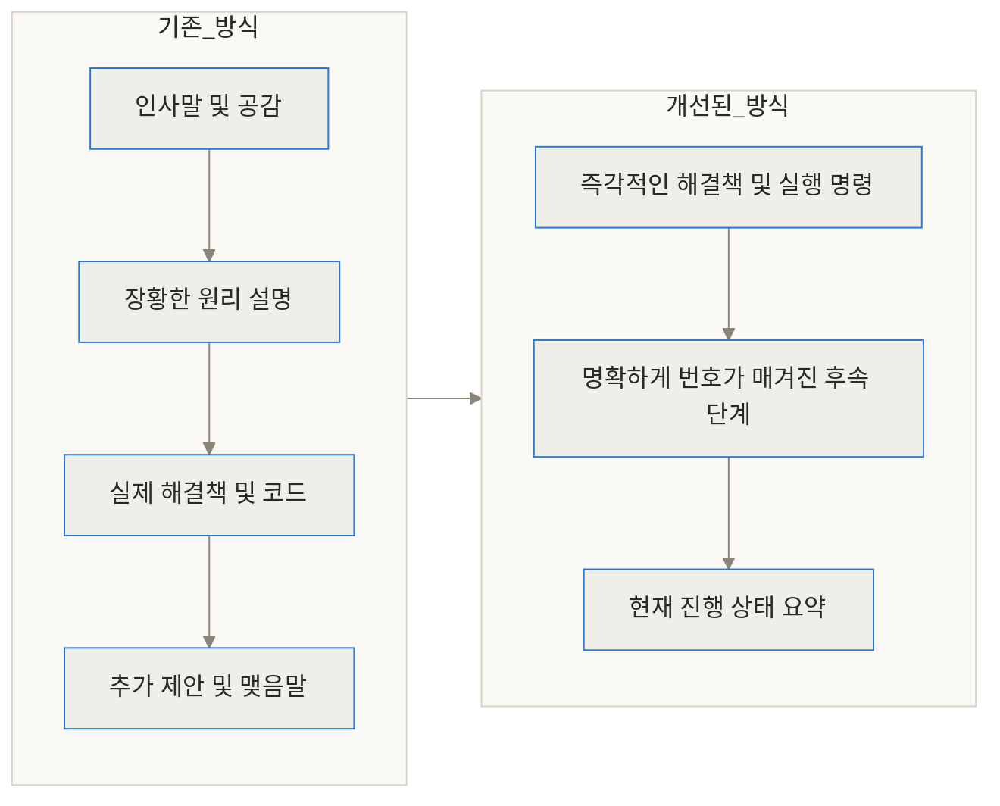
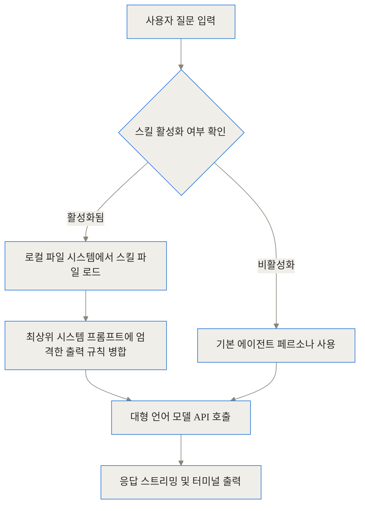
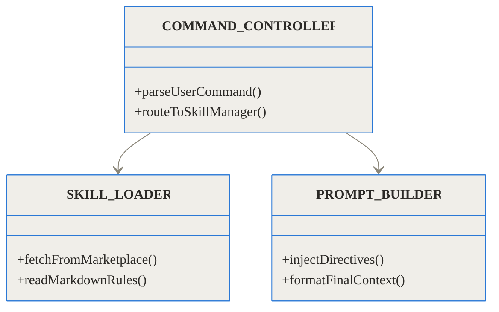
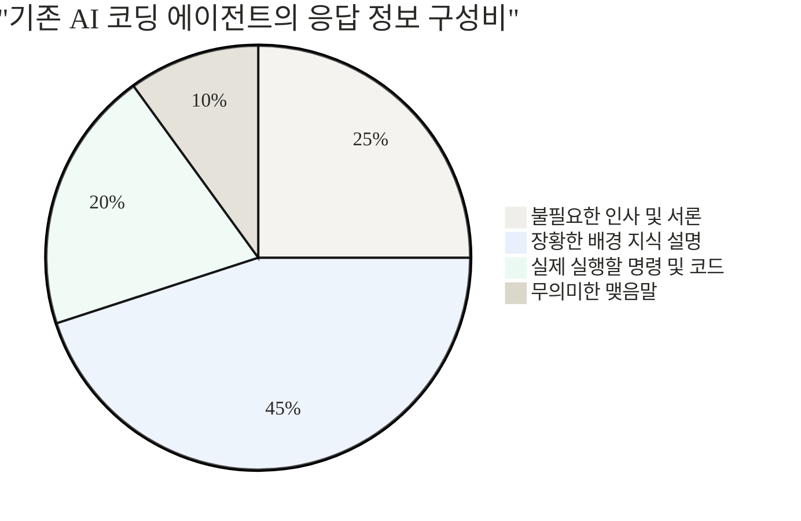
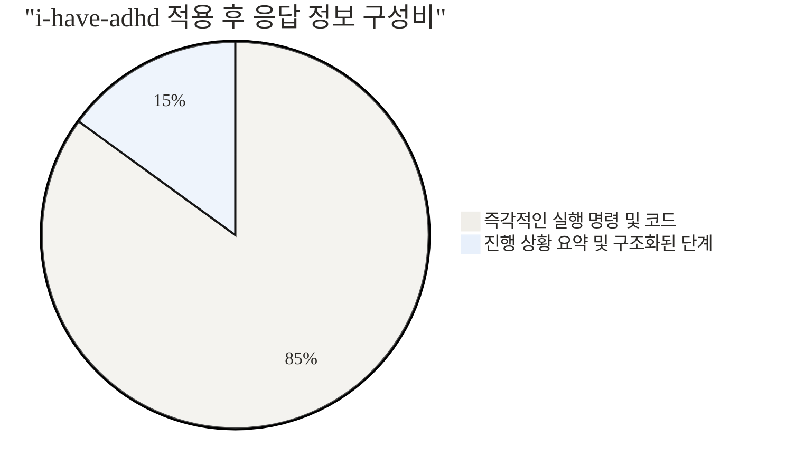
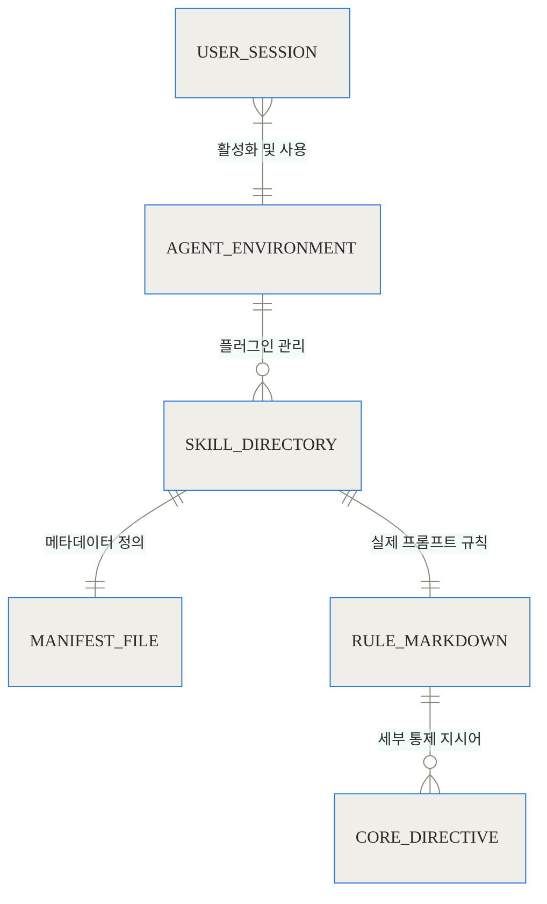
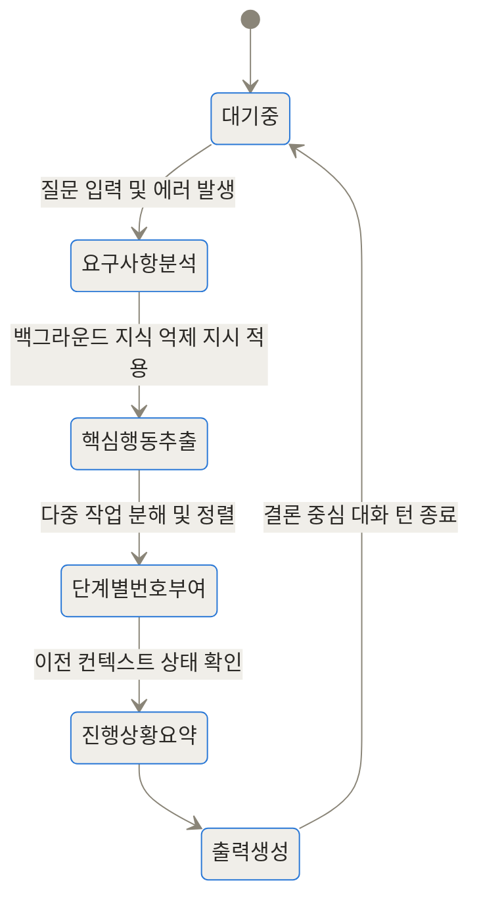
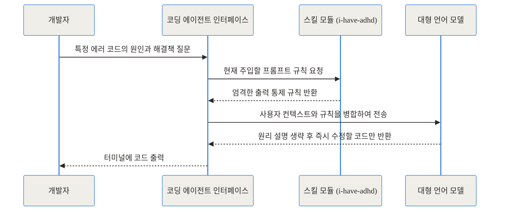

## 상단 링크 블록

- [ayghri/i-have-adhd GitHub 공식 저장소](https://github.com/ayghri/i-have-adhd)
- [Claude Code Plugins 정보 모음](https://github.com/ccplugins/awesome-claude-code-plugins)

## 한 줄 요약 (TL;DR)
> 인공지능 코딩 에이전트가 쏟아내는 장황한 인사말과 불필요한 배경 설명을 강제로 차단하고 행동 중심의 출력을 유도합니다.
> 오직 즉각적인 실행 명령과 명확하게 번호가 매겨진 핵심 단계만을 출력하도록 언어 모델의 응답 구조를 근본적으로 교정합니다.
> 복잡한 설치나 백그라운드 프로세스 없이, 단순한 시스템 프롬프트 주입만으로 개발자의 인지적 과부하와 토큰 비용을 획기적으로 줄여줍니다.

## 도입: 우리는 왜 인공지능의 답변을 읽다 지치는가?

최근 몇 년간 개발자들의 작업 방식은 대형 언어 모델 기반의 코딩 에이전트에 의해 근본적으로 변화했습니다. 하지만 코딩을 하다 보면 다들 한 번쯤 이런 답답한 상황을 겪어보셨을 겁니다. 터미널에서 발생하는 권한 오류를 해결하기 위해 에이전트에게 간단한 질문을 던졌는데, 화면을 가득 채우는 장문의 답변이 돌아오는 상황 말입니다. 

기본적으로 설정된 인공지능은 지나치게 친절합니다. 질문에 대한 답변을 시작할 때 항상 긍정적인 인사말을 건네고, 이 오류가 왜 발생했는지에 대한 운영체제의 역사와 권한 구조를 세 문단에 걸쳐 설명한 뒤, 정작 내가 지금 당장 터미널에 복사해서 붙여넣어야 할 한 줄의 코드는 답변의 가장 맨 마지막에 숨겨둡니다. 

이러한 현상은 언어 모델이 학습 과정에서 거친 강화학습(RLHF) 때문입니다. 인간 피드백을 통한 강화학습 과정에서 인공지능은 무조건 친절하고, 자세하게 설명하며, 논리적 비약 없이 친절한 어투를 유지하도록 훈련받았습니다. 하지만 촌각을 다투는 개발 현장에서, 특히 연속된 여러 개의 버그를 추적하고 있는 개발자의 작업 기억(Working Memory) 공간에 이러한 장황한 설명은 극심한 피로를 유발합니다. 정답을 찾기 위해 불필요한 텍스트의 바다를 스크롤하며 헤엄쳐야 하는 이 문제를 해결하기 위해 등장한 도구가 바로 ayghri/i-have-adhd 프로젝트입니다.

## 개념 쉽게: i-have-adhd는 무엇인가?

프로젝트의 이름만 보면 의학적인 도구나 특정 진단을 받은 사람만을 위한 접근성 도구처럼 보일 수 있습니다. 하지만 이 프로젝트는 질환의 유무와는 전혀 관계가 없습니다. 그보다는 복잡한 정보 속에서 핵심만을 빠르게 짚어내야 하는, 즉 집중력이 극한으로 필요한 모든 개발자를 위한 출력 교정 도구에 가깝습니다.

이 도구는 마치 장황하게 이론을 설명하는 대학교수님을, 옆자리에서 모니터를 손가락으로 가리키며 당장 쳐야 할 명령어만 딱딱 짚어주는 실전파 시니어 개발자로 바꿔주는 역할을 합니다. 새로운 인공지능 모델을 다운로드하는 것도 아니고, 컴퓨터의 자원을 갉아먹는 무거운 백그라운드 프로그램도 아닙니다. 이 프로젝트의 정체는 매우 정교하게 깎인 몇 가지의 규칙을 담은 텍스트 파일(마크다운)이자, 코딩 에이전트 생태계에서 말하는 스킬(Skill)입니다.

개발자가 질문을 던지면, 코딩 에이전트는 대형 언어 모델에 이 질문을 전달하기 직전에 i-have-adhd의 규칙들을 시스템 프롬프트(가장 강력한 기본 지시어)로 몰래 끼워 넣습니다. 그 결과 언어 모델은 자신의 친절한 본성을 억누르고 아주 건조하고 기계적인, 하지만 당장 실행할 수 있는 액션 위주의 답변만을 내놓게 됩니다.



## 작동 원리 심층: 에이전트의 뇌 구조를 바꾸는 프롬프트 엔지니어링

단순한 텍스트 쪼가리가 어떻게 세계 최고 수준의 언어 모델의 출력을 완벽하게 통제할 수 있을까요? 이를 이해하기 위해서는 최신 AI 코딩 에이전트(예: Claude Code, Codex 등)의 내부 파이프라인을 들여다보아야 합니다. 코딩 에이전트는 사용자의 입력을 받으면 이를 그대로 언어 모델에 던지지 않습니다. 에이전트는 현재 작업 중인 코드베이스의 컨텍스트, 사용 중인 운영체제 정보, 그리고 확장 기능인 스킬(Skill)들을 하나로 엮어 거대한 컨텍스트 창을 구성합니다.



i-have-adhd 프로젝트는 에이전트의 스킬 디렉토리에 설치되어, 사용자가 명시적으로 호출하거나 전역 설정으로 활성화할 때 시스템 프롬프트의 최상단에 주입됩니다. 최신 언어 모델들은 시스템 프롬프트의 지시를 절대적으로 따르도록 미세조정(Fine-tuning)되어 있기 때문에, 이 영역에 강력한 제약 조건을 걸어두면 일반적인 대화형 응답 패턴을 완전히 무력화할 수 있습니다.

시스템 구조 관점에서 보면 이 스킬은 복잡한 논리를 실행하는 코드가 아니라, 선언적인 규칙의 집합체입니다.



### 핵심 규칙 5가지: 무엇을 어떻게 차단하는가?

이 프로젝트의 GitHub 저장소에 정의된 SKILL.md 파일 내부를 살펴보면, 인지 심리학과 인간-컴퓨터 상호작용(HCI) 원칙에 기반한 5가지 핵심 규칙을 발견할 수 있습니다.

1. 행동 우선 (Action First): 절대로 서론을 깔지 않습니다. 언어 모델이 추론하는 과정(Thought Process)은 모델 내부에서만 처리하거나 숨김 영역에 두고, 사용자에게 보여지는 텍스트의 첫 줄은 반드시 사용자가 지금 즉시 복사해서 터미널에 붙여넣을 수 있는 명령어이거나 코드여야 합니다.
2. 단계별 번호 부여 (Steps Numbered): 여러 작업을 수행해야 할 때 산문 형태의 줄글로 쓰지 못하게 합니다. 오직 1번, 2번, 3번과 같이 순차적인 번호 목록으로만 출력하게 하여 독해에 드는 뇌의 에너지를 최소화합니다.
3. 진행 상황 요약 (Recap Status): 길고 복잡한 디버깅 세션에서는 사용자와 에이전트 모두 길을 잃기 쉽습니다. 이 규칙은 매 턴의 응답마다 우리가 지금까지 완료한 것은 무엇이고, 지금 해야 할 것은 무엇인지 상태를 요약하도록 강제합니다.
4. 곁가지 억제 (Control Branch Line): 좋은 의도에서 나오는 추천이나 대안 제시를 막습니다. 해결책을 제시하면서 만약 원한다면 이런 다른 라이브러리도 써볼 수 있어요 식의 부가 정보는 집중력을 흩트리는 주범입니다. 묻지 않은 내용은 절대 답하지 않도록 통제합니다.
5. 무의미한 맺음말 제거 (No Fluff): 도움이 필요하면 언제든 말씀해주세요, 행운을 빕니다! 와 같은 고객 센터 직원의 대본 같은 맺음말을 생성 단계부터 차단합니다.

이러한 규칙들이 적용되었을 때, 응답을 구성하는 정보의 비율은 극적으로 변화합니다.





위의 차이에서 볼 수 있듯이, 정보의 순도 자체가 완전히 달라집니다. 사용자는 화면을 스크롤할 필요 없이 눈을 돌리자마자 바로 코드를 복사할 수 있습니다.

## 구현 및 사용 디테일: 내 터미널에 장착하기

이 훌륭한 기능을 내 로컬 환경에 적용하는 방법은 매우 간단합니다. 최신 코딩 에이전트들은 마켓플레이스나 플러그인 시스템을 갖추고 있어 명령어 몇 줄로 바로 주입이 가능합니다. 가장 널리 쓰이는 Claude Code를 기준으로 설치 과정을 살펴보겠습니다.

1. 터미널을 열고, 스킬을 추가하려는 프로젝트 디렉토리로 이동합니다.
2. 마켓플레이스에서 스킬을 추가하고 설치하는 명령어를 차례로 입력합니다.

명령어 실행 흐름은 다음과 같습니다.

```bash
claude plugin marketplace add ayghri/i-have-adhd
claude plugin install i-have-adhd@i-have-adhd
```

또는 npx 도구를 사용하여 한 번에 설치할 수도 있습니다.

```bash
npx -y skills add ayghri/i-have-adhd --skill i-have-adhd --agent claude-code
```

설치가 완료되었다면 해당 프로젝트 내의 숨김 폴더에 스킬 규칙 파일이 자리 잡게 됩니다. 그 구조를 살펴보면 다음과 같은 개체 관계를 가집니다.



설치 후 현재 대화 세션에서 이 규칙을 켜고 싶다면 입력창에 단순히 `/i-have-adhd` 라고 입력하면 됩니다. 에이전트는 즉시 Ready. What do you want to work on? 이라며 불필요한 장식이 싹 빠진 응답을 반환할 것입니다. 만약 매번 명령어를 치는 것조차 귀찮고 모든 세션에서 이 딱딱하지만 실용적인 페르소나를 유지하고 싶다면, 홈 디렉토리에 `~/.claude/.i-have-adhd-always` 라는 빈 파일을 생성해두면 됩니다. 에이전트 구동 시 이 파일의 존재를 확인하고 전역적으로 스킬을 활성화하게 됩니다.

## 실전 활용 시나리오: 장황함이 사라진 개발 현장

이 스킬이 실제 현업에서 어떻게 빛을 발하는지 구체적인 시나리오를 통해 알아보겠습니다.

**시나리오 1: 복잡한 의존성 충돌 해결**
오래된 Node.js 프로젝트를 최신 버전으로 마이그레이션하면서 수많은 패키지 의존성 충돌이 발생했습니다. 기존 에이전트에게 에러 로그를 주면, Webpack의 역사부터 시작해 각 패키지의 버전 호환성 표를 장황하게 그려준 뒤 패키지 삭제 명령어를 알려주었습니다.
i-have-adhd를 켠 상태에서는 응답이 완전히 다릅니다.
1. `rm -rf node_modules package-lock.json` 실행
2. `package.json`의 react 버전을 18.2.0으로 수정
3. `npm install --legacy-peer-deps` 실행
이처럼 당장 타이핑해야 할 3가지 단계만 명확히 찍어주어, 개발자는 1분 안에 문제를 해결하고 다음 작업으로 넘어갈 수 있었습니다.

**시나리오 2: 긴 호흡의 기능 개발**
결제 모듈을 연동하는 과정은 여러 단계(API 키 발급, 웹훅 설정, 데이터베이스 스키마 추가, 프론트엔드 연동)를 거칩니다. 작업이 길어지면 에이전트는 이전 맥락을 잊거나 엉뚱한 설명을 덧붙입니다. 하지만 i-have-adhd 스킬의 진행 상황 요약 규칙 덕분에, 5번째 턴의 대화에서도 에이전트는 완료됨: DB 스키마 추가 완료, 다음 단계: 웹훅 엔드포인트 라우팅 코드 작성 이라고 상태를 짚어주어 개발자가 궤도를 이탈하지 않게 꽉 잡아줍니다.



## 벤치마크 및 수치 비교: 얼마나 더 효율적인가?

불필요한 텍스트를 생성하지 않는다는 것은 단순히 읽기 편하다는 것 이상의 이점을 제공합니다. 토큰 기반으로 과금되는 언어 모델의 특성상, 출력 토큰의 극적인 감소는 곧바로 비용 절감과 응답 속도 향상으로 이어집니다.

```chartjs
{
  "type": "bar",
  "data": {
    "labels": ["서론 및 인사말", "배경 설명 및 대안", "핵심 코드 및 명령", "맺음말"],
    "datasets": [
      {
        "label": "기본 코딩 에이전트 토큰 소비량",
        "data": [120, 450, 200, 80],
        "backgroundColor": "rgba(201, 203, 207, 0.5)"
      },
      {
        "label": "i-have-adhd 적용 후 토큰 소비량",
        "data": [0, 50, 250, 0],
        "backgroundColor": "rgba(54, 162, 235, 0.5)"
      }
    ]
  },
  "options": {
    "responsive": true,
    "plugins": {
      "title": {
        "display": true,
        "text": "동일한 질문에 대한 출력 토큰 소비량 비교"
      }
    }
  }
}
```

이러한 토큰 낭비 제거는 개발자의 인지적 과부하 측면에서도 엄청난 차이를 만듭니다. 아래 표는 두 가지 페르소나의 차이를 극명하게 보여줍니다.


| 비교 항목 | 기본 코딩 에이전트 | i-have-adhd 적용 |
| --- | --- | --- |
| 응답의 시작 | 장황한 인사말, 문제에 대한 철학적 공감 | 즉시 터미널에 붙여넣을 수 있는 코드/명령어 |
| 작업 분할 방식 | 문단 속에 행동이 산문체로 섞여 있음 | 짧고 명확하게 번호가 부여된 리스트 형식 |
| 상태 추적 | 사용자가 대화 로그를 위로 스크롤하며 직접 파악 | 에이전트가 현재 완료된 작업과 남은 작업을 요약 제시 |
| 추가 정보 제공 | 묻지 않은 대안 라이브러리나 구조 변경 제안 | 질문 받은 핵심 문제 해결에만 극도로 집중 |
| 생성 속도 및 비용 | 출력 내용이 길어 생성 지연 발생 및 비용 증가 | 텍스트 생성이 매우 짧아 빠르고 비용이 저렴함 |


## 솔직한 평가: 한계와 트레이드오프

어떤 도구든 은탄환은 없습니다. i-have-adhd 역시 명확한 장점만큼이나 뚜렷한 한계를 가지고 있으며, 특정 상황에서는 오히려 독이 될 수 있습니다. 에이전트와 사용자의 상호작용 흐름을 묘사한 아래 시퀀스 다이어그램에서 볼 수 있듯이, 모델은 오직 정답만 도출해야 하는 압박을 받습니다.



가장 큰 단점은 학습 기회의 상실입니다. 만약 당신이 특정 언어나 프레임워크에 갓 입문한 주니어 개발자라면, 코드가 왜 그렇게 작성되어야 하는지, 내부적으로 어떤 원리에 의해 에러가 해결되었는지 깊이 있게 이해하는 과정이 필수적입니다. 하지만 이 스킬을 활성화하면 모델은 왜? 에 대한 설명을 극도로 아끼기 때문에, 개발자는 코드를 복사해서 붙여넣고 문제가 해결되었다는 사실만 알게 될 뿐 깊이 있는 통찰을 얻기 힘듭니다.

또한, 대화의 어투가 매우 건조하고 지시적이기 때문에 인공지능과 대화하며 아이디어를 브레인스토밍하거나 친절한 코드 리뷰를 받고 싶을 때는 이 딱딱한 로봇 같은 페르소나가 이질적으로 느껴질 수 있습니다. 따라서 이 도구는 원리를 이미 어느 정도 알고 있고 단순히 타자기 치는 시간과 문서 찾는 시간을 줄이고 싶은 숙련된 개발자에게 최적화되어 있다고 볼 수 있습니다.

## 마무리: 지능을 넘어선 출력 구조의 중요성

ayghri/i-have-adhd 프로젝트가 GitHub에서 단기간에 수천 개의 별을 받으며 인기를 끈 이유는 단순히 코드를 잘 짜는 인공지능을 넘어서, 인공지능이 인간과 어떻게 소통해야 하는가에 대한 본질적인 고민을 건드렸기 때문입니다. 

모델의 파라미터 수가 커지고 지능이 높아지는 것만큼이나, 그 지능을 개발자의 작업 기억 범위 내에 얼마나 매끄럽고 압축적으로 전달할 수 있느냐가 생산성의 핵심입니다. 여러분이 평소 화면을 가득 채우는 AI의 설명을 보며 조금이라도 답답함을 느끼셨다면, 당장 터미널에 이 작은 스킬을 설치해 보시길 권합니다. 불필요한 친절함이 사라진 자리에, 진정한 의미의 초고속 코딩 파트너가 나타날 것입니다.

## 자주 묻는 질문 (FAQ)

### 진짜 ADHD 진단을 받은 사람에게만 유용한 도구인가요?

전혀 그렇지 않습니다. 프로젝트 이름은 작업 기억에 과부하를 주는 장황한 텍스트를 읽기 힘들어하는 뇌의 특성에서 영감을 받은 것일 뿐입니다. 정보를 처리하고 핵심을 파악하는 데 드는 인지적 피로를 줄이고 싶은 모든 일반 개발자에게 유용합니다.

### Claude Code에서만 사용할 수 있나요? Cursor나 다른 툴은 지원하지 않나요?

기본적으로 Claude Code의 플러그인 생태계를 타겟으로 만들어졌지만, Codex나 OpenClaw 같은 에이전트에서도 호환 가능한 형태로 지원됩니다. 프롬프트 규칙이 적힌 마크다운 파일 형태이므로, Cursor의 .cursorrules 파일에 규칙을 그대로 복사해 넣는 방식으로도 동일한 효과를 낼 수 있습니다.

### 이 스킬을 켜두면 항상 뒤에서 컴퓨터 자원을 소모하나요?

아닙니다. 이 도구는 백그라운드에서 실행되는 프로세스나 데몬이 아닙니다. 언어 모델에 질문을 보낼 때 같이 덧붙여지는 몇 줄의 텍스트 지시어(시스템 프롬프트)일 뿐이므로 로컬 컴퓨터의 CPU나 메모리 자원을 전혀 소모하지 않습니다.

### 너무 짧게 대답해서 오히려 코드가 작동하는 원리를 모른 채 넘어갈까 봐 걱정입니다.

그 점이 이 스킬의 가장 큰 트레이드오프입니다. 오직 정답과 행동만을 출력하도록 강제하기 때문에 기술의 원리를 학습하려는 목적이라면 이 스킬을 비활성화하는 것이 좋습니다. 문제 해결의 속도가 가장 중요한 실무 환경에서 켜는 것을 권장합니다.

### 이 스킬이 내 로컬 프로젝트의 코드를 마음대로 삭제하거나 변경할 위험은 없나요?

이 스킬 자체는 어떠한 코드 실행 권한도 가지고 있지 않은 단순한 텍스트 규칙 묶음입니다. 코드를 읽고 쓰는 권한은 전적으로 코딩 에이전트(Claude Code 등) 본체에 있으며, 이 스킬은 에이전트가 어떤 형식으로 말을 할지 어투와 구조만 교정할 뿐입니다.


## References
- [https://github.com/ayghri/i-have-adhd](https://github.com/ayghri/i-have-adhd)
- [https://github.com/ccplugins/awesome-claude-code-plugins](https://github.com/ccplugins/awesome-claude-code-plugins)
- [https://github.com/jafshare/GithubTrending](https://github.com/jafshare/GithubTrending)
- [https://vertexaisearch.cloud.google.com/](https://vertexaisearch.cloud.google.com/)
