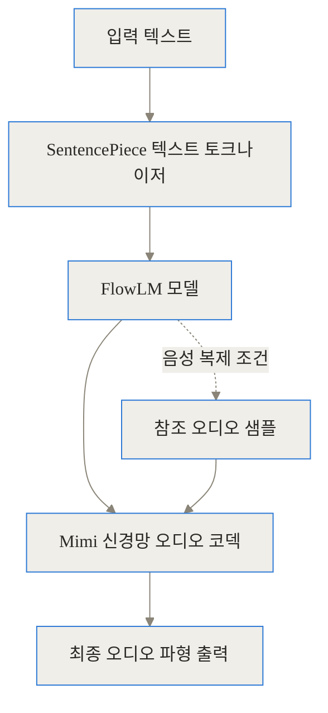
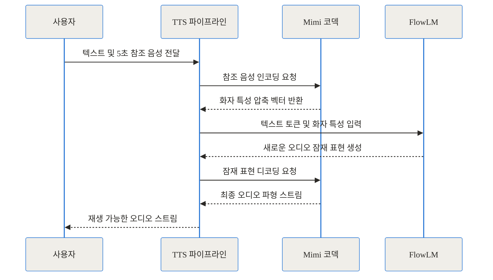
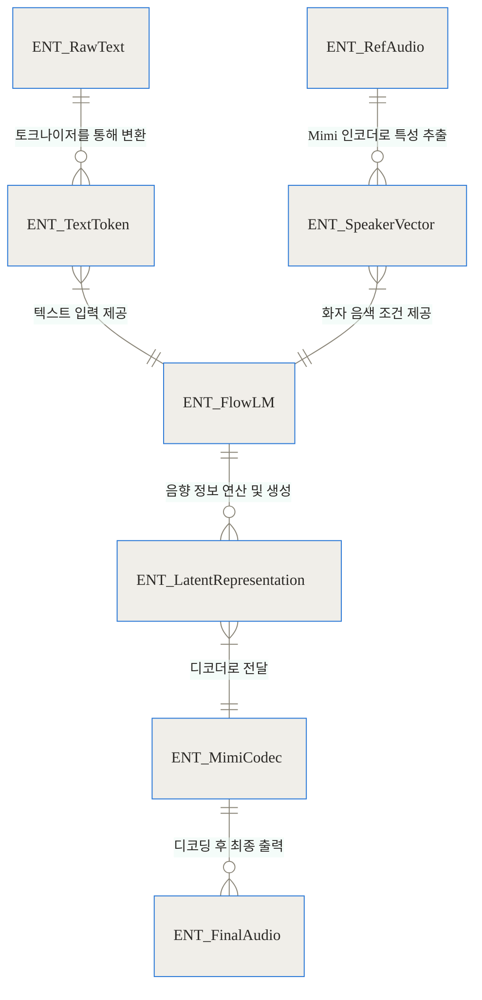
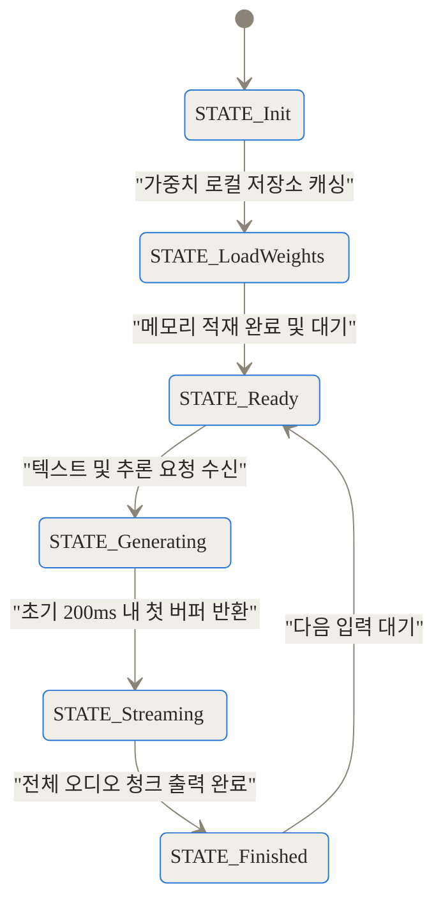
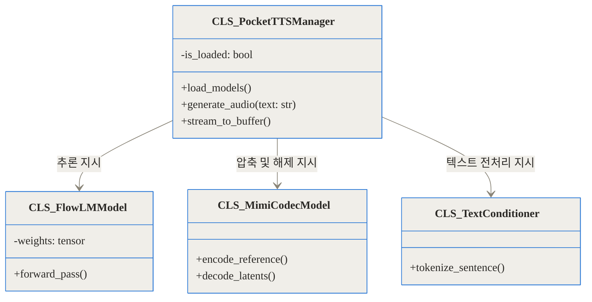
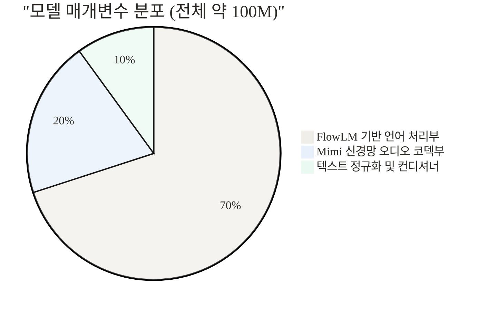

[상단 참조 링크]
- [Pocket TTS GitHub 저장소](https://github.com/kyutai-labs/pocket-tts)
- [Hugging Face 모델 카드](https://huggingface.co/kyutai/pocket-tts)
- [Kyutai 기술 블로그 및 데모](https://kyutai.org/tts)

---

## TL;DR (세 줄 요약)
- 텍스트를 음성으로 변환(TTS)할 때 무거운 GPU나 유료 클라우드 API에 의존해야만 했던 기존의 고질적인 문제를 정면으로 해결한 초경량 오픈소스 프로젝트입니다.
- 단 1억 개의 매개변수와 자체 개발한 신경망 오디오 코덱을 활용해, 일반 노트북의 CPU 환경에서도 200밀리초 이내의 응답 속도로 실시간 스트리밍이 가능합니다.
- 5초에서 20초 분량의 짧은 오디오만으로 화자의 목소리를 즉각 복제할 수 있어, 인터넷 연결 없이 프라이버시가 완벽히 보장되는 로컬 AI 비서 구축에 적합합니다.

---

자연스러운 대화형 인터페이스나 AI 에이전트를 개발하다 보면 항상 마주치는 거대한 장벽이 하나 있습니다. 바로 음성 합성 단계에서 발생하는 지연 시간과 막대한 연산 자원 요구량입니다. 사용자가 사람과 대화하는 듯한 자연스러운 느낌을 받으려면 대답이 나오기까지의 딜레이가 0.5초 이내여야 합니다. 그러나 기존의 고품질 TTS 모델들은 고가의 외장 그래픽 카드(GPU)를 요구하거나 외부 클라우드 API를 호출해야만 이 속도를 맞출 수 있었습니다.

외부 서버로 데이터를 보내는 클라우드 방식은 치명적인 단점들을 동반합니다. 사용자의 민감한 대화 내용이 외부로 전송되는 프라이버시 문제를 일으키고, 네트워크 상태에 따라 지연 시간이 들쭉날쭉해져 사용자 경험을 해칩니다. 그렇다고 무거운 AI 모델을 로컬 환경으로 가져오자니, 일반적인 노트북 CPU만으로는 1초 분량의 오디오를 만드는 데 수 초 이상이 걸려 실시간 대화가 불가능에 가까웠습니다.

이러한 현장의 고충을 해결하기 위해 등장한 것이 바로 프랑스의 비영리 오픈사이언스 연구소 Kyutai Labs가 공개한 Pocket TTS입니다. 프로젝트 이름에서 직관적으로 알 수 있듯, 주머니에 들어갈 만큼 가볍고 작지만 실시간 처리에 필요한 모든 것을 갖춘 CPU 친화적인 독립형 시스템입니다.

## 기존 방식이 겪던 구체적인 고통과 배경

왜 우리는 그동안 CPU에서 매끄럽게 구동되는 고품질 TTS를 만나기 어려웠을까요? 이를 이해하려면 기존 음성 합성 기술의 발전 방향과 한계를 살펴볼 필요가 있습니다.

과거의 음성 합성 모델들은 주로 두 가지 극단적인 양상을 보였습니다. 하나는 전통적인 접합 합성이나 가벼운 통계적 모델로, 처리 속도는 빠르지만 기계음이 너무 강해 자연스러운 대화에 쓰기 어려운 경우입니다. 다른 하나는 최근 유행하는 대규모 언어 모델(LLM) 및 확산(Diffusion) 기반의 TTS로, 음질과 억양은 사람과 구분이 안 갈 정도로 뛰어나지만 수억에서 수십억 개의 매개변수를 가지고 있어 연산량이 너무 많다는 것입니다.

1. **하드웨어의 절대적 제약**: 고품질 모델을 로컬 환경에서 돌리려면 VRAM이 풍부한 최신 Nvidia GPU가 필수적이었습니다. GPU가 없는 일반 사무용 노트북, 라즈베리파이 같은 소형 엣지 디바이스에서는 심각한 병목 현상이 발생했습니다.
2. **비용과 종속성의 함정**: 하드웨어 제약을 피하기 위해 많은 개발자가 대형 클라우드 서비스의 유료 API를 도입합니다. 이는 호출할 때마다 과금되는 구조이므로, 대화량이 많아질수록 서버 유지 비용이 기하급수적으로 늘어납니다.
3. **물리적인 네트워크 지연**: API 방식은 텍스트를 서버로 보내고 오디오 파일을 다시 다운로드하는 과정을 거칩니다. 아무리 서버 성능이 최상이어도 물리적인 네트워크 지연(Latency)과 패킷 손실 위험이 항상 존재합니다.

Pocket TTS는 처음부터 GPU 없는 환경을 목표로 설계되어, 위와 같은 고통들을 실질적으로 해소합니다.

## Pocket TTS란 무엇인가?

간결하게 정리하자면, 매우 효율적으로 압축된 오디오 지식과 문맥 해석 능력을 1억 개의 매개변수 안에 구겨 넣은 경량화 AI 모델입니다. 

이 기술을 일상적인 비유로 설명해 보겠습니다. 무거운 GPU를 요구하는 기존의 거대 TTS 모델이 엄청난 양의 연료를 소모하며 달리는 대형 트럭이라면, Pocket TTS는 작고 가벼운 차체에 고효율 전기 모터를 달아 좁은 도심(CPU 환경)에서도 민첩하게 움직일 수 있는 소형 경차와 같습니다. 무거운 화물(수백 시간에 달하는 스튜디오 품질의 복잡한 감정 연기 등)을 한 번에 실어 나르지는 못할 수 있지만, 일상적인 출퇴근이나 빠른 퀵 배달(실시간 음성 대화)에는 훨씬 효율적이고 적합합니다.

이 프로젝트는 원래 Kyutai Labs가 개발한 실시간 대화형 AI 'Moshi'의 내부 도구로 시작되었습니다. Moshi 개발 과정에서 극도로 짧은 지연 시간을 달성해야 했고, 그 과정에서 축적된 오디오 압축 기술과 언어 모델링 기술을 독립적인 TTS 파이프라인으로 분리해낸 결과물이 바로 Pocket TTS입니다. 가장 주목받는 특징 중 하나는 제로샷 목소리 복제(Zero-shot Voice Cloning) 기능입니다. 사용자가 5초에서 20초 사이의 아주 짧은 음성 파일만 제공하면, 시스템이 별도의 파인튜닝(재학습) 과정 없이 해당 화자의 목소리 톤과 억양을 즉시 파악하여 텍스트를 읽어냅니다.

## 기술의 심층 작동 원리 (Under the Hood)

이토록 가벼우면서도 높은 품질을 유지할 수 있는 이유는 단순히 모델 크기를 줄인 것을 넘어, 세 가지 주요 구성 요소가 유기적이고 혁신적인 방식으로 결합되었기 때문입니다. 내부 구조를 단계별로 깊게 파헤쳐 보겠습니다.

### 전체 아키텍처와 파이프라인 흐름

텍스트가 입력되어 최종 오디오로 출력되기까지의 전체 과정을 시각화하면 다음과 같습니다.



이 파이프라인에서 입력된 문장은 가장 먼저 모델이 이해할 수 있는 작은 조각(Sub-word 토큰)으로 쪼개집니다. 이후 핵심 언어 모델인 FlowLM이 텍스트의 맥락과 발음 규칙을 분석하여 음향적 잠재 정보로 바꾸고, 오디오 코덱이 이를 실제 사람이 들을 수 있는 소리로 변환합니다.

### 텍스트를 이해하는 뇌, FlowLM 모델

Pocket TTS의 중심에는 텍스트를 오디오의 잠재적인 형태(Latent)로 변환하는 FlowLM 모델이 있습니다. 이 모델은 트랜스포머 아키텍처를 기반으로 하며, 매개변수가 약 7천만 개 수준으로 극단적으로 경량화되어 있습니다.

여기서 속도를 끌어올린 중요한 알고리즘은 LSD(Lagrangian Self Distillation)라는 특수한 기법입니다. 일반적인 확산(Diffusion) 모델은 노이즈에서 점진적으로 소리를 깎아내는 과정을 수십 번 반복해야 하므로 CPU에서 매우 느립니다. 반면 LSD는 복잡하고 무거운 원본 교사 모델이 오디오를 생성하는 궤적을, 더 가벼운 학생 모델이 단 몇 번의 단계만으로 모방하도록 학습시키는 기술입니다. 수학적으로 복잡한 경로를 단축하여 모델 크기를 대폭 줄이면서도 추론 속도를 실시간 이상으로 끌어올릴 수 있었습니다.


### 소리를 압축하고 푸는 마술사, Mimi 오디오 코덱

텍스트가 잠재 벡터로 변환되었다고 해서 컴퓨터가 바로 소리를 낼 수 있는 것은 아닙니다. 여기서 Kyutai Labs가 자체 개발한 신경망 오디오 코덱인 'Mimi'가 등장합니다. 보통 오디오는 1초에 24,000번(24kHz) 진동하는 방대한 데이터입니다. 모델이 이 모든 점을 직접 예측하려면 연산량이 폭발합니다.

Mimi 코덱은 이 방대한 오디오 파형을 초당 수십 개의 의미 있는 토큰(프레임)으로 압축합니다. 마치 고해상도 이미지를 JPEG 포맷으로, 원음 오디오를 MP3 포맷으로 압축하는 것과 비슷하지만, 단순한 주파수 분석이 아니라 신경망을 이용해 음성의 '의미적 특성'과 '음향적 특성'을 분리하여 고도로 압축하고 복원합니다.

목소리 복제 시연 시 내부 컴포넌트 간의 상호작용은 다음과 같이 이루어집니다.



이 시퀀스 다이어그램에서 알 수 있듯, 목소리를 복제할 때 사용자가 입력한 짧은 참조 음성 역시 Mimi 코덱을 거쳐 매우 작은 벡터 형태로 변환됩니다. FlowLM은 이 벡터를 나침반 삼아, 새롭게 주어지는 텍스트를 해당 목소리의 특성에 맞게 그려냅니다.

### 데이터 모델 간의 구조적 관계

시스템 내부에서 관리되는 데이터 구조와 엔티티 간의 관계를 정리하면 다음과 같습니다.



## 구현과 사용 디테일

Pocket TTS의 또 다른 매력은 복잡한 환경 설정 없이 일반적인 파이썬 환경에서 즉각적으로 설치하고 사용할 수 있다는 점입니다.

### 환경 준비와 모델 설치

이 프로젝트는 Python 3.10부터 최신 3.14 버전까지 폭넓게 지원합니다. 무거운 C++ 빌드 도구나 CUDA 환경을 억지로 구성할 필요가 없으며, CPU 전용으로 컴파일된 일반적인 PyTorch(2.5 이상)만 있으면 원활하게 구동됩니다.

터미널에서 아래 명령어를 통해 패키지를 설치합니다. 속도를 높이기 위해 `uv` 패키지 관리자를 사용하는 것을 권장하기도 합니다.

```bash
# 표준 pip를 이용한 설치
pip install pocket-tts
```

목소리 복제 기능을 활용하기 위해서는 기반이 되는 AI 모델 가중치(Weights) 파일이 필요합니다. 가중치는 Hugging Face에 보관되어 있으며, 악용을 방지하기 위해 라이선스 동의 후 권한을 부여받는 Gated 모델로 설정되어 있습니다. 따라서 터미널에서 Hugging Face 계정으로 로그인하는 과정이 선행되어야 합니다.

```bash
# Hugging Face 토큰을 이용한 인증
huggingface-cli login
```

### 상태 전이와 생명주기

소프트웨어 내부에서 모델이 어떻게 초기화되고 실제 오디오를 스트리밍하기까지 상태가 변하는지 살펴보겠습니다.



초기화가 끝나고 Ready 상태에 진입하면, 이후의 요청들은 모델 로딩 과정 없이 매우 빠르게 스트리밍 모드로 전환됩니다.

### 파이썬 API 사용 예시 및 CLI

가장 기본적인 코드 사용법은 직관적입니다. 별도의 장치 지정 없이도 CPU 백엔드로 훌륭히 작동합니다.

```python
import pocket_tts

# 모델 초기화 (최초 1회 실행, 백그라운드에서 캐싱된 모델 로드)
model = pocket_tts.load_model()

text_input = "안녕, 이것은 CPU에서 실행되는 초경량 텍스트 투 스피치 모델이야."
output_path = "output.wav"

# 즉각적인 오디오 파일 생성
model.generate(text_input, output_path)
print("생성 완료! CPU 환경에서도 매우 빠릅니다.")
```

코드를 직접 작성하지 않아도, 커맨드 라인(CLI) 환경에서 파이프 연산자(`|`)를 통해 텍스트를 바로 던져 음성 파일을 만들 수도 있습니다.

```bash
echo "복잡한 코딩 없이 터미널에서 바로 사용할 수 있습니다." | pocket-tts generate result.wav
```

## 실전 활용 시나리오

현업 개발 환경이나 개인의 생산성 도구에 Pocket TTS를 어떻게 연동할 수 있을지, 구체적인 시나리오 두 가지를 제시합니다.

### 시나리오 1: 로컬 기반의 민감 정보 대응 AI 비서
법률 상담, 의료 데이터 정리, 혹은 사내 기밀 문서를 다루는 기업 환경에서는 외부 네트워크로 텍스트 한 줄도 나가서는 안 됩니다. 최근 Llama 3이나 Mistral 같은 소형 언어 모델(sLLM)을 로컬에 구축하는 사례가 많은데, 정작 대답을 음성으로 들려주기 위해 클라우드 TTS를 쓰면 보안 체계가 무너집니다. Pocket TTS를 LangChain 체인 끝단에 연결하면, sLLM이 생성한 텍스트 청크를 실시간으로 받아 CPU만으로 음성으로 변환해 스피커로 내보내는 완전한 오프라인 루프를 구축할 수 있습니다.

### 시나리오 2: 인디 게임의 동적 NPC 음성 시스템
게임 개발, 특히 Unity 기반의 모바일이나 인디 게임에서 모든 캐릭터의 대사를 성우에게 맡겨 미리 녹음(Pre-record)하는 것은 예산과 용량 측면에서 낭비가 큽니다. 매개변수가 약 1억 개에 불과한 Pocket TTS는 게임이 실행 중인 사용자 기기의 백그라운드 스레드에서 즉각적으로 음성을 생성해낼 수 있습니다. 사용자의 선택이나 날씨, 시간 등 변수에 따라 무한히 달라지는 텍스트 대사를 끊김 없이 읽어주는 동적 상호작용 시스템을 비교적 쉽게 만들어낼 수 있습니다.

이러한 애플리케이션 통합 시 코드베이스 수준에서의 클래스 관계는 대체로 아래와 같이 구성됩니다.



## 벤치마크 및 비교

Pocket TTS가 기존 대안들과 비교했을 때 구체적으로 어느 정도의 성능적 이점을 주는지 정량적 지표와 표로 살펴보겠습니다.

우선, 모델을 구성하는 약 1억 개의 매개변수가 내부적으로 어떻게 분배되어 있는지 보여줍니다.



연산의 대부분은 문맥을 이해하고 화자의 특성을 입히는 언어 모델링에 할당되어 있으며, 코덱 자체는 놀라울 정도로 가볍습니다.

가장 중요한 속도 지표인 '첫 오디오 출력 지연 시간(Time To First Audio, TTFA)'을 비교해 보면 Pocket TTS의 강점이 여실히 드러납니다.

```chartjs
{
  "type": "bar",
  "data": {
    "labels": ["Tortoise TTS (로컬 GPU)", "대형 클라우드 API", "Pocket TTS (로컬 CPU)"],
    "datasets": [{
      "label": "첫 출력 지연 시간 (밀리초, 수치가 낮을수록 즉각적임)",
      "data": [2500, 450, 180],
      "backgroundColor": ["rgba(255, 99, 132, 0.6)", "rgba(54, 162, 235, 0.6)", "rgba(75, 192, 192, 0.8)"]
    }]
  },
  "options": {
    "responsive": true
  }
}
```

클라우드 API의 경우 네트워크 왕복 시간이 포함되어 어쩔 수 없는 딜레이가 발생하며, Tortoise와 같은 무거운 고품질 로컬 모델은 VRAM이 받쳐주더라도 처리 절차로 인해 초기 지연이 큽니다. 반면 Pocket TTS는 200밀리초 이하의 속도를 달성하여 인간이 느끼기에 지연이 거의 없는 수준의 쾌적함을 줍니다.

다른 주요 기술들과 구체적인 특성을 비교한 표는 다음과 같습니다.

| 솔루션 이름 | 주요 구동 환경 | 응답 지연 시간 | 목소리 복제(Cloning) | 과금 및 비용 | 프라이버시 유지 | 비고 |
| --- | --- | --- | --- | --- | --- | --- |
| **Pocket TTS** | **로컬 CPU** | **<200ms (매우 빠름)** | **지원 (5~20초 분량)** | **오픈소스 무료** | **완벽히 보장** | 모바일 및 엣지 호환성 탁월 |
| ElevenLabs | 클라우드 | 보통 (네트워크 의존) | 지원 | 구독형 유료 | 불가 (서버 전송) | 상용 스튜디오급 품질 |
| Tortoise TTS | 로컬 GPU 필수 | 매우 느림 | 지원 | 오픈소스 무료 | 보장 | 실시간 대화에 부적합 |
| VALL-E | 클라우드/연구용 | 알 수 없음 | 지원 (Zero-shot) | 비공개 | 알 수 없음 | 마이크로소프트 연구 모델 |
| Kokoro TTS | 로컬 CPU/GPU | 빠름 | 제한적 지원 | 오픈소스 무료 | 보장 | 경량 TTS의 강력한 대안 |

<br>

## 솔직한 평가: 한계와 트레이드오프

강력한 도구지만, 모든 목적에 들어맞는 만능 열쇠는 아닙니다. Pocket TTS가 경량화와 속도를 확보하기 위해 어떤 부분을 양보했는지 실무자의 시선에서 냉정하게 짚어봅니다.

1. **초고해상도 감정 표현과 억양의 한계**: 극적인 연기력, 슬플 때 미세하게 떨리는 숨소리, 대본의 복잡한 뉘앙스를 재현하는 데 있어서는 매개변수가 수십억 개에 달하는 거대 상용 서비스를 완전히 대체하기 어렵습니다. 주로 명확한 정보 전달이나 일정한 톤의 일상 대화에 최적화되어 있습니다.
2. **다국어 처리의 세밀함 부족**: 영어권에서 가장 탁월한 성능을 보이며, 업데이트를 통해 다른 언어를 지원하기 시작했지만 언어 간 품질 편차가 아직 존재합니다. 특정 비영어권 언어에서는 복잡한 숫자를 읽거나 동음이의어를 구분할 때 문장 정규화(Normalization) 과정에서 약간의 오류가 발생할 수 있습니다.
3. **순간적인 CPU 점유율 급증**: GPU를 쓰지 않는다는 것은 역으로 CPU를 강하게 혹사한다는 뜻입니다. 비록 짧은 시간이지만 오디오를 생성하는 순간에는 CPU 자원을 한계치까지 활용합니다. 저전력 노트북이나 백그라운드 작업이 많은 서버에서는 열 관리(Throttling)로 인해 생성 속도가 간헐적으로 떨어지는 현상을 겪을 수 있습니다.

## 마무리 및 생태계 전망

Kyutai Labs가 세상에 내놓은 Pocket TTS는 '실시간 고음질 오디오 생성에는 반드시 막대한 하드웨어 비용이나 클라우드 종속이 뒤따른다'는 오랜 고정관념을 실질적으로 허물고 있습니다. 1억 개의 작은 매개변수와 고도로 압축된 신경망 코덱의 우아한 설계 덕분에, 누구든 평범한 노트북만 열면 즉시 프라이버시가 보장되는 고품질 음성 비서를 구동할 수 있게 되었습니다.

앞으로 수많은 오픈소스 개발자와 기획자들이 이 효율적인 구조를 바탕으로 파생 프로젝트를 만들어낼 것입니다. 유니티를 위한 에셋 플러그인, 운영체제 백그라운드에 상주하는 시각 장애인용 접근성 도구, 또는 라즈베리파이 기반의 장난감 로봇 등 활용 분야는 무궁무진합니다. AI가 거대한 데이터센터를 벗어나 우리의 개인 기기 안착하는 흐름 속에서, Pocket TTS는 작지만 가장 뚜렷하고 중요한 발자취를 남기고 있습니다.

## 자주 묻는 질문 (FAQ)

### GPU 없이 CPU로만 정말 실시간 처리가 가능한가요?

네, Pocket TTS는 1억 개의 매개변수라는 초경량 모델 구조(FlowLM)와 최적화된 오디오 코덱(Mimi)을 결합하여, 최신 일반 CPU 환경에서도 200밀리초 이내에 첫 오디오 스트리밍을 시작합니다. 일반적인 작업 환경이라면 실시간보다 빠르게 음성을 생성할 수 있습니다.

### 목소리 복제(Voice Cloning)를 하려면 얼마나 긴 오디오가 필요한가요?

약 5초에서 20초 사이의 짧은 참조 오디오 샘플만 있으면 충분합니다. 별도의 재학습(파인튜닝)이나 복잡한 설정 없이, 즉각적으로 화자의 목소리 음색과 기본적인 특성을 파악하여 텍스트를 읽어냅니다.

### 상용 클라우드 서비스(예: ElevenLabs)와 비교했을 때 음질은 어떤가요?

대형 상용 서비스와 비교하면 완벽한 스튜디오 품질이나 감정선의 미세한 연기 조절에서는 다소 한계가 있습니다. 하지만 일상적인 AI 에이전트, 로컬 챗봇, 정보 전달 도구 등에 활용하기에는 사람이 듣기에 충분히 자연스럽고 깨끗한 품질을 제공합니다.

### 라이선스는 어떻게 되며 바로 사용할 수 있나요?

코드베이스는 GitHub에 오픈소스로 공개되어 있으나, 목소리 복제와 합성을 위한 핵심 모델 가중치(Weights) 파일은 Hugging Face를 통해 관리됩니다. 악용 방지를 위해 제한적 접근(Gated) 모델로 등록되어 있으므로, 사용 전 라이선스 조항을 확인하고 계정 연동을 거쳐야 온전히 사용할 수 있습니다.

### 다국어를 지원하나요?

2026년 1월 첫 공개 당시를 기점으로 지속적으로 업데이트되어, 이후 영어 외에도 5개 이상의 다국어 음성 합성을 지원하기 시작했습니다. 오픈소스 커뮤니티의 활발한 참여로 언어별 자연스러움과 지원 범위가 계속 넓어지고 있습니다.


## References
- [https://github.com/kyutai-labs/pocket-tts](https://github.com/kyutai-labs/pocket-tts)
- [https://huggingface.co/kyutai/pocket-tts](https://huggingface.co/kyutai/pocket-tts)
- [https://kyutai.org/blog/2026-01-13-pocket-tts](https://kyutai.org/blog/2026-01-13-pocket-tts)
- [https://kyutai.org/tts](https://kyutai.org/tts)
