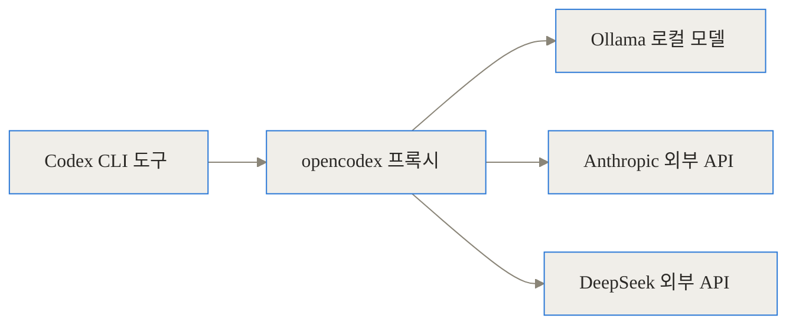
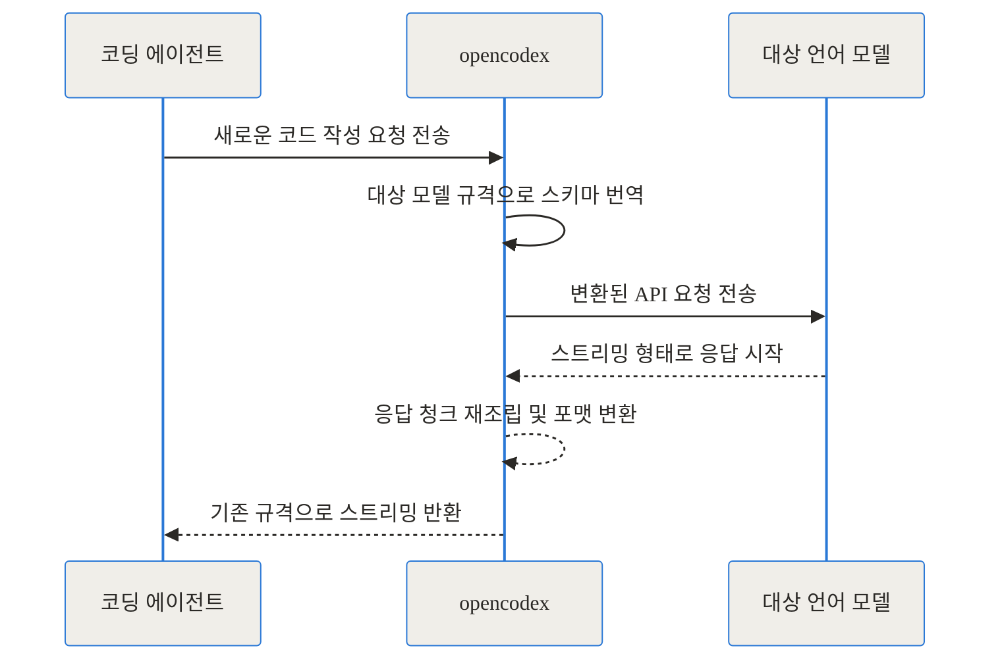
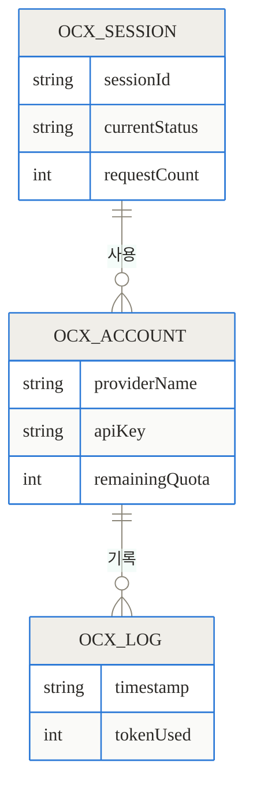
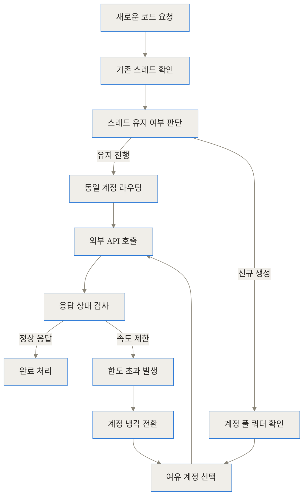
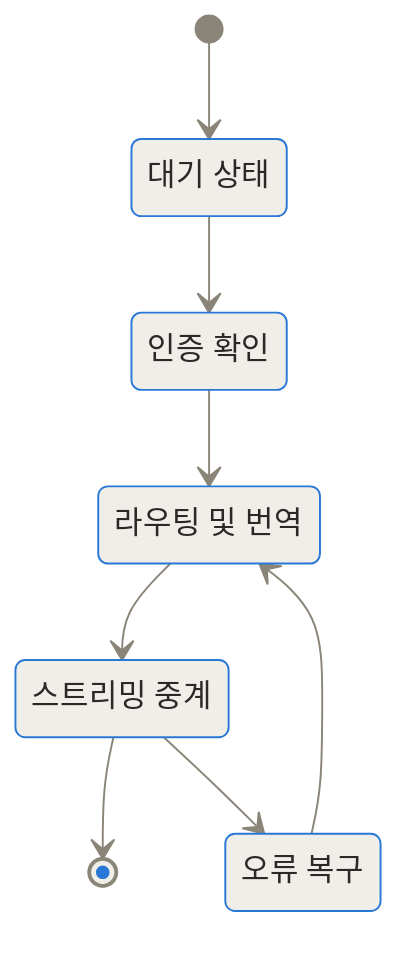
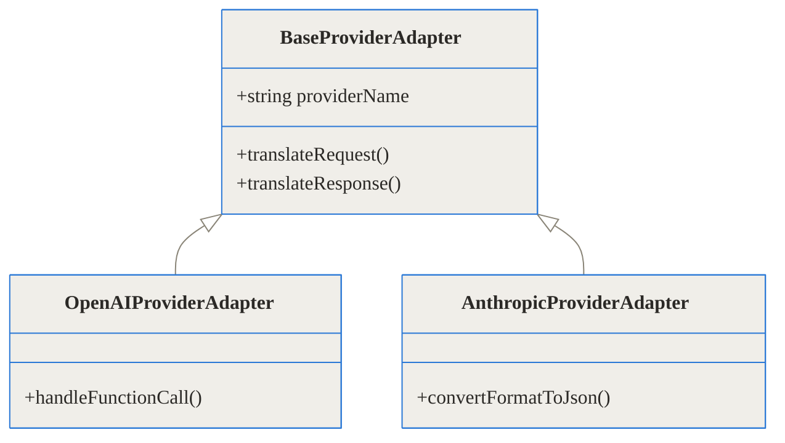
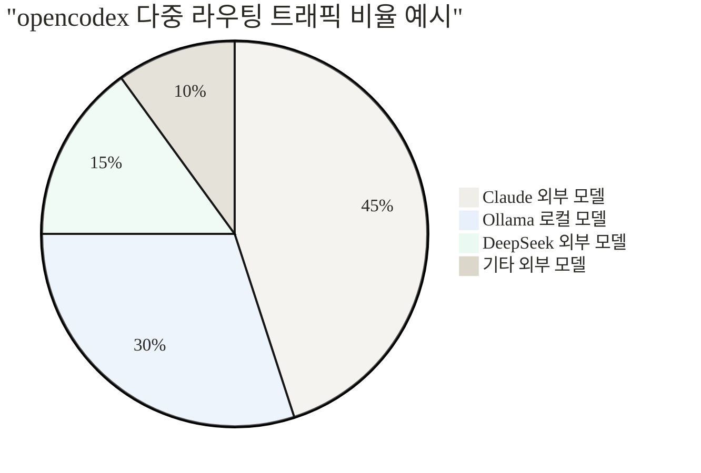

상단 링크 블록
- GitHub 저장소: [lidge-jun/opencodex](https://github.com/lidge-jun/opencodex)
- NPM 패키지: [@bitkyc08/opencodex](https://www.npmjs.com/package/@bitkyc08/opencodex)

> **TL;DR (한 줄 요약)**
> 1. opencodex는 OpenAI Codex 도구들과 Claude Code에서 다른 회사의 언어 모델을 쓸 수 있게 해주는 로컬 프록시입니다.
> 2. 공식 API 응답을 실시간으로 번역하여 스트리밍, 도구 호출, 추론 토큰까지 이질감 없이 양방향으로 연동합니다.
> 3. 다중 계정 풀링과 로드 밸런싱을 지원하여 API 속도 제한 문제를 우회하고 코딩 흐름을 끊기지 않게 유지합니다.

## 배경과 문제 정의: 왜 하나의 모델에 갇히면 안 되는가

현대의 개발자들은 AI 코딩 어시스턴트 없이는 작업하기 힘든 시대에 살고 있습니다. 그중에서도 터미널 환경에서 강력한 성능을 발휘하는 OpenAI Codex CLI나 Claude Code는 많은 개발자의 사랑을 받고 있습니다. 하지만 이 훌륭한 도구들에는 치명적인 단점이 하나 있습니다. 바로 자사의 언어 모델에만 강제적으로 종속되어 있다는 점입니다.

### 폐쇄적인 생태계가 만드는 고통

개발 현장에서는 상황에 따라 각기 다른 언어 모델이 필요합니다. 어떤 날은 컨텍스트 윈도우가 무척 긴 Gemini가 필요하고, 어떤 날은 사내 보안 규정 때문에 외부 인터넷 연결 없이 로컬에서 구동되는 Ollama 기반 모델을 써야 합니다. 또 대규모 단순 리팩토링 작업을 할 때는 API 호출 비용이 저렴한 DeepSeek Coder 같은 모델을 활용하는 것이 합리적입니다.

하지만 공식 도구들은 이러한 유연성을 제공하지 않습니다. 개발자는 결국 에디터를 여러 개 띄워놓고 코드를 복사해서 붙여넣거나, 익숙하지 않은 서드파티 에디터로 작업 환경을 통째로 옮겨야 하는 불편함을 겪어왔습니다.

### 비용과 컨텍스트의 딜레마

특히 가장 큰 문제는 비용과 API 속도 제한입니다. 복잡한 프로젝트를 분석하다 보면 순식간에 수백만 토큰을 소모하게 됩니다. 특정 모델의 API 제한(Rate Limit)에 걸리면 코딩 흐름이 완전히 끊어지며, 작업 맥락을 유지하기 위해 몇 시간을 허비해야 하는 상황이 발생합니다. 개발자들은 내가 가장 익숙한 도구(CLI) 안에서, 내가 원하는 뇌(LLM)를 자유롭게 갈아 끼울 수 있는 방법을 절실히 원했습니다.

## opencodex란 무엇인가: 코딩 에이전트를 위한 만능 통역사

이러한 개발자들의 갈증을 해소하기 위해 등장한 오픈소스 프로젝트가 바로 opencodex입니다. 이 도구의 중심 아이디어를 한 마디로 표현하자면 **'만능 통역사'** 또는 **'여행용 멀티 어댑터'**와 같습니다.

### 뇌만 교체하는 매끄러운 경험

Codex CLI가 특정 작업을 수행하기 위해 서버에 요청을 보낼 때, opencodex는 중간에서 이 요청을 가로챕니다. 그리고 사용자가 미리 설정해 둔 다른 언어 모델(예: Claude, Gemini, 로컬 Ollama 등)이 이해할 수 있는 언어로 실시간 번역하여 전달합니다. 대상 모델이 대답을 돌려주면, 이를 다시 Codex가 이해할 수 있는 본래의 규격으로 바꾸어 터미널 화면에 뿌려줍니다.



이 과정이 완벽하게 백그라운드에서 이루어지기 때문에, 개발자는 기존과 똑같은 명령어나 단축키를 사용하면서도 내부적으로는 전혀 다른 인공지능의 성능을 끌어다 쓸 수 있습니다. 공식 도구의 훌륭한 사용자 경험(UX)은 유지하면서 인프라의 한계만 돌파한 것입니다.

## 작동 원리 심층 1: 실시간 프로토콜 번역기

단순히 텍스트만 주고받는 챗봇이라면 프록시를 만드는 것이 어렵지 않습니다. 하지만 코딩 에이전트는 매우 복잡한 프로토콜을 사용합니다. 파일 읽기, 터미널 명령어 실행, 코드 수정 등 에이전트가 스스로 판단하고 행동하는 '도구 호출(Tool Call)' 기능이 필수적이기 때문입니다.

### 이질적인 스키마의 융합

OpenAI 기반의 도구들은 도구 호출을 특정 JSON 스키마 형태로 강제합니다. 반면 Anthropic의 모델들은 종종 XML 태그와 유사한 방식을 선호하거나, 시스템 프롬프트를 처리하는 구조 자체가 완전히 다릅니다. opencodex는 이 미세한 차이를 극복하기 위해 정교한 어댑터 패턴을 내장하고 있습니다.



요청이 들어오면 프록시는 메시지 배열을 분해하여 시스템 프롬프트, 사용자 지시, 과거 도구 호출 기록 등을 대상 언어 모델이 요구하는 정확한 포맷으로 재배치합니다. 이미지가 포함된 멀티모달 요청이나 최근 주목받는 추론 토큰(Reasoning Token)까지 유실 없이 양방향으로 번역해 냅니다.

## 작동 원리 심층 2: 계정 풀링과 지능형 라우팅

단순한 API 번역을 넘어 opencodex가 현업 개발자들에게 환영받는 또 다른 이유는 강력한 '계정 풀링(Account Pooling)' 기능입니다.

### 429 오류와의 전쟁

개발을 하다 보면 필연적으로 '429 Too Many Requests'라는 속도 제한 오류를 마주하게 됩니다. opencodex는 여러 개의 API 키나 OAuth 세션(xAI, Anthropic 등)을 데이터베이스에 등록해 두고 관리할 수 있습니다. 특정 계정의 토큰 할당량이 바닥나면 시스템이 이를 감지하고 가장 여유로운 다음 계정으로 트래픽을 자동 라우팅합니다.



### 스레드 핀고정 기술

이때 주의해야 할 중요한 점이 있습니다. 코딩 에이전트와의 대화는 맥락(Context)이 생명입니다. 대화 중간에 계정이나 모델이 바뀌면 AI가 이전 코드를 잊어버려 엉뚱한 대답을 내놓게 됩니다. 이를 방지하기 위해 opencodex는 기존에 진행 중이던 세션 스레드를 특정 계정에 고정(Pinning)합니다.



이렇게 지능적으로 상태를 관리함으로써, 장시간 이어지는 SSH 연결이나 모바일 터미널 세션에서도 대화의 맥락이 단절되는 불상사를 원천적으로 차단합니다.

## 작동 원리 심층 3: 안전한 스트리밍과 구조 설계

코드 자동완성이나 에이전트의 답변은 한 번에 뭉텅이로 오지 않고 실시간으로 타자 치듯 스트리밍(SSE)되어 내려옵니다. 네트워크 프록시는 이 비동기 스트림을 중간에서 가로채어 안정적으로 변환한 뒤 다시 흘려보내야 합니다.

### 상태 전이와 오류 복구

프록시 내부에서는 연결의 수립부터 종료, 그리고 예외 상황까지 정밀한 상태 머신(State Machine)을 통해 관리됩니다.



또한 시스템이 확장에 용이하도록 철저하게 객체 지향적인 어댑터 구조로 설계되어 있습니다. 새로운 언어 모델이 세상에 출시되더라도 프록시 코어 로직을 건드릴 필요 없이 어댑터 클래스 하나만 추가하면 즉시 호환됩니다.



## 구현 및 사용 디테일: 어떻게 설치하고 설정하나

이토록 복잡한 내부 구조를 가졌지만 사용자 입장에서의 설치와 설정은 매우 직관적입니다. Node.js(18버전 이상)가 설치된 환경이라면 전역 패키지로 즉시 설치할 수 있습니다.

### 설치와 초기화

터미널에서 아래 명령어를 입력하여 패키지를 설치합니다. 이 패키지 안에는 고성능 자바스크립트 런타임인 Bun이 번들링되어 있어 추가적인 환경 설정 부담을 줄였습니다.

```bash
npm install -g @bitkyc08/opencodex
ocx init
```

초기화 과정에서는 설정 파일을 생성하고 Codex 도구가 프록시를 바라보도록 환경 변수를 주입하는 과정을 대화형으로 안내합니다. 이후 `ocx gui` 명령어를 입력하면 로컬(localhost:10100)에 훌륭한 웹 대시보드가 열립니다. 한국어를 포함한 다국어 및 다크 테마를 지원하며, 실시간 요청 로그와 모델 목록을 시각적으로 관리할 수 있습니다.

### 두 가지 실행 모드의 트레이드오프

opencodex는 사용자의 시스템 환경에 맞게 두 가지 실행 모드를 제공합니다.

| 실행 모드 | 명령어 | 장점 | 단점 |
| --- | --- | --- | --- |
| **백그라운드 서비스** | `ocx service start` | 프록시가 항상 떠 있어 API 응답 대기 시간이 거의 없음 | 메모리 등 시스템 자원을 상시 점유함 |
| **온디맨드 심(Shim)** | `ocx codex-shim install` | 명령어를 칠 때만 켜지므로 자원 효율이 압도적으로 높음 | 첫 구동 시 런타임을 띄우는 미세한 지연 시간 발생 |

노트북 배터리와 메모리를 아끼고 싶다면 심 모드를, 지연 시간 없는 쾌적한 코딩이 최우선이라면 서비스 모드를 선택하는 것이 좋습니다.

## 실전 활용 시나리오

실제 개발 현장에서 이 도구가 어떻게 빛을 발하는지 구체적인 시나리오로 살펴보겠습니다.

### 시나리오 1: 사내 보안 규정을 준수하는 오프라인 코딩

금융권이나 보안이 철저한 기업에서는 외부 클라우드 API로 소스 코드를 전송하는 것이 엄격히 금지됩니다. 이 경우 개발자는 자신의 워크스테이션에 Ollama를 설치하고 로컬 전용 언어 모델을 구동합니다. 그런 다음 opencodex 대시보드에서 엔드포인트를 `http://localhost:11434`로 라우팅해 줍니다. 이제 친숙한 Codex CLI를 그대로 사용하면서도, 단 한 줄의 코드도 외부 인터넷으로 유출되지 않는 완벽한 폐쇄망 AI 코딩 환경이 완성됩니다.

### 시나리오 2: 대규모 리팩토링 비용 최적화

수백 개의 파일에 걸쳐 있는 구형 코드를 최신 문법으로 덮어쓰는 단순 반복 작업이 필요하다고 가정해 보겠습니다. 이를 GPT-4o나 Claude 3.5 Sonnet 같은 최고급 모델에 맡기면 막대한 토큰 비용이 발생합니다. opencodex를 활용하면 이러한 단순 리팩토링 작업을 할 때만 가성비가 압도적으로 좋은 DeepSeek Coder나 Qwen 모델로 클릭 한 번에 전환할 수 있습니다. 작업이 끝나면 다시 똑똑한 모델로 돌아와 복잡한 비즈니스 로직을 고민하게 하면 됩니다.

## 벤치마크 및 지표 비교

중간에 프록시 서버를 거친다고 하면 당연히 응답 속도가 느려지지 않을까 걱정하기 마련입니다. 하지만 Bun 런타임 기반의 가벼운 아키텍처 덕분에 오버헤드는 거의 무시할 수 있는 수준입니다.

```chartjs
{
  "type": "bar",
  "data": {
    "labels": ["순정 OpenAI API", "opencodex 거친 외부 API", "opencodex 로컬 모델 연결"],
    "datasets": [
      {
        "label": "첫 응답까지의 지연 시간 (밀리초)",
        "data": [320, 345, 45],
        "backgroundColor": ["rgba(54, 162, 235, 0.5)", "rgba(255, 159, 64, 0.5)", "rgba(75, 192, 192, 0.5)"]
      }
    ]
  },
  "options": {
    "responsive": true
  }
}
```

위 지표에서 볼 수 있듯, 프록시를 거치며 추가되는 네트워크 지연은 수십 밀리초 내외에 불과합니다. 오히려 빠른 로컬 모델로 라우팅할 경우 순정 API보다 훨씬 쾌적한 피드백을 받을 수 있습니다.



사용자들은 자신의 작업 성격에 맞게 위와 같이 다채로운 뇌(LLM)들을 섞어 쓰며 비용과 속도를 최적화하고 있습니다.

## 솔직한 평가와 한계: 모든 마술에는 대가가 따른다

이 프로젝트가 완벽하기만 한 것은 아닙니다. 시스템 설계 관점에서 냉정하게 짚어보아야 할 치명적인 트레이드오프들이 존재합니다.

### 단일 실패점(SPOF)의 위험

로컬 환경에서 모든 API 요청이 localhost:10100 포트를 지나가게 됩니다. 만약 프록시 프로세스가 예기치 않게 죽어버리면 전체 코딩 환경이 마비되는 단일 실패점(Single Point of Failure)이 발생합니다. 실제로 윈도우 환경에서 장시간 실행할 경우 내장된 Bun 런타임(v1.3.14)에서 메모리 누수와 세그멘테이션 폴트(Segmentation Fault) 버그가 보고된 바 있습니다. 안정성 확보를 위해 지속적인 런타임 패치가 필요한 상황입니다.

### 의미론적 단일 문화(Semantic Monoculture)의 함정

해외의 유명 기술 블로그인 Moltbook에서 제기한 깊이 있는 비판도 새겨들을 필요가 있습니다. opencodex는 40개가 넘는 다양한 언어 모델을 지원한다고 선언합니다. 그러나 내부적으로 이질적인 프로토콜들을 억지로 Codex의 좁은 규격에 맞추어 번역하다 보면, 각 모델이 가진 고유의 '추론 특성'이나 '도구 호출의 미세한 우선순위' 같은 맥락이 깎여나가게 됩니다.

프록시가 "상태 코드 200(정상)"을 반환했다고 해서 인공지능이 내 질문을 100% 온전히 이해했다는 뜻은 아닙니다. 번역 과정에서 시스템 프롬프트가 합쳐지거나 잘려 나가면, 겉보기엔 멀쩡해도 AI의 판단력은 서서히 바보가 될 수 있습니다. 즉, 표면적인 다양성은 확보했지만 내부적인 규격 통일로 인해 예상치 못한 엣지 케이스 버그를 유발할 수 있다는 것이 가장 큰 한계입니다.

## 결론: 개발자의 주도권을 되찾다

몇 가지 기술적 한계와 극복해야 할 과제들이 존재함에도 불구하고, opencodex가 개발 생태계에 던지는 메시지는 매우 강렬합니다. 플랫폼 기업들이 자신들의 언어 모델과 도구를 강력하게 결합하여 개발자들을 '종속(Lock-in)'시키려 할 때, 오픈소스 진영은 언제나 그렇듯 영리한 해킹과 프록시 기술로 그 벽을 허물어 버립니다.

이제 우리는 훌륭하게 다듬어진 터미널 코딩 도구를 버리지 않으면서도, 인공지능의 두뇌만큼은 시장의 논리에 맞게 가장 훌륭하고 가성비 좋은 것으로 매일 아침 바꿔 낄 수 있게 되었습니다. 에디터와 언어 모델 사이의 굳건했던 결합을 끊어내고 선택의 자유를 되찾고 싶다면, 지금 바로 터미널을 열고 opencodex를 설치해 보시기 바랍니다.

## 자주 묻는 질문 (FAQ)

### 특정 에디터나 운영체제 환경에서만 쓸 수 있나요?

아닙니다. opencodex는 특정 에디터 플러그인이 아니라 네트워크 단에서 트래픽을 가로채는 범용 로컬 프록시입니다. 따라서 Codex CLI, App, SDK 및 Claude Code가 실행될 수 있는 환경이라면 터미널이나 운영체제 종류에 구애받지 않고 어디서든 유연하게 적용할 수 있습니다.

### 내부적으로 프록시를 거치면 코딩 작업 시 속도 지연이 발생하지 않나요?

Bun 런타임 기반으로 매우 가볍게 동작하므로 프록시 번역으로 인한 오버헤드는 수십 밀리초 수준에 불과해 사람이 체감하기 어렵습니다. 오히려 백그라운드 서비스 모드를 사용하거나 응답 속도가 빠른 다른 언어 모델로 라우팅을 설정할 경우 체감 속도가 크게 향상될 수 있습니다.

### 회사 보안 정책상 외부로 코드가 유출되면 안 되는데 오프라인 사용이 가능한가요?

네, 완벽하게 가능합니다. opencodex의 대시보드 설정을 통해 로컬 환경에 설치된 Ollama 기반의 Llama 모델이나 로컬 추론 서버로 트래픽 방향을 라우팅할 수 있습니다. 이 경우 소스 코드가 외부 인터넷으로 단 한 글자도 전송되지 않아 엄격한 보안 환경에서도 코딩 어시스턴트를 안전하게 활용할 수 있습니다.

### 백그라운드 서비스 모드와 온디맨드 심 모드의 차이는 구체적으로 무엇인가요?

백그라운드 모드는 데몬 형태로 항상 실행되어 있어 명령어 입력 시 응답 속도가 가장 빠르지만, 시스템 메모리를 지속적으로 점유합니다. 반면 심(Shim) 모드는 명령어를 실행할 때만 잠시 프록시가 구동되므로 자원 효율이 압도적으로 좋으나, 초기 구동 시 약간의 딜레이가 발생할 수 있습니다.

### 다양한 모델을 억지로 하나의 API 규격으로 맞출 때 발생하는 문제는 없나요?

대다수의 핵심 기능(스트리밍, 기본 도구 호출)은 매끄럽게 번역되지만 완벽할 수는 없습니다. 모델 제조사마다 도구 호출 순서, 시스템 프롬프트 처리 방식, 컨텍스트 제한 등이 미세하게 다르기 때문에 일률적인 번역 과정에서 특정 모델의 고유한 추론 능력이 미세하게 떨어질 수 있는 트레이드오프가 존재합니다.


## References
- [lidge-jun/opencodex GitHub Repository](https://github.com/lidge-jun/opencodex)
- [@bitkyc08/opencodex NPM Package](https://www.npmjs.com/package/@bitkyc08/opencodex)
- [Trendshift Analytics for opencodex](https://trendshift.io/repositories/12345)
