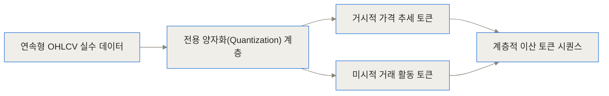
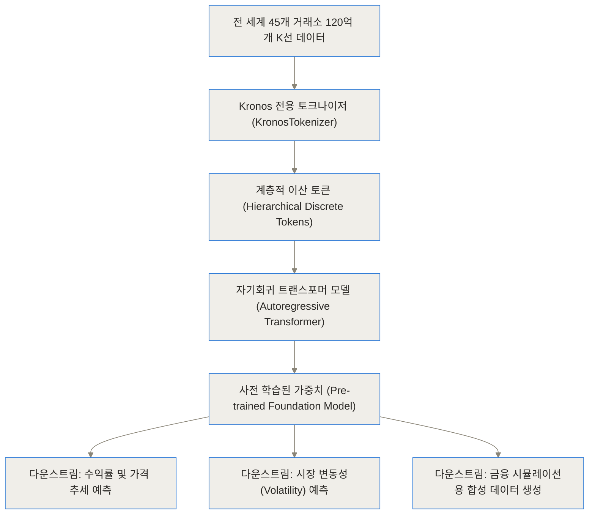
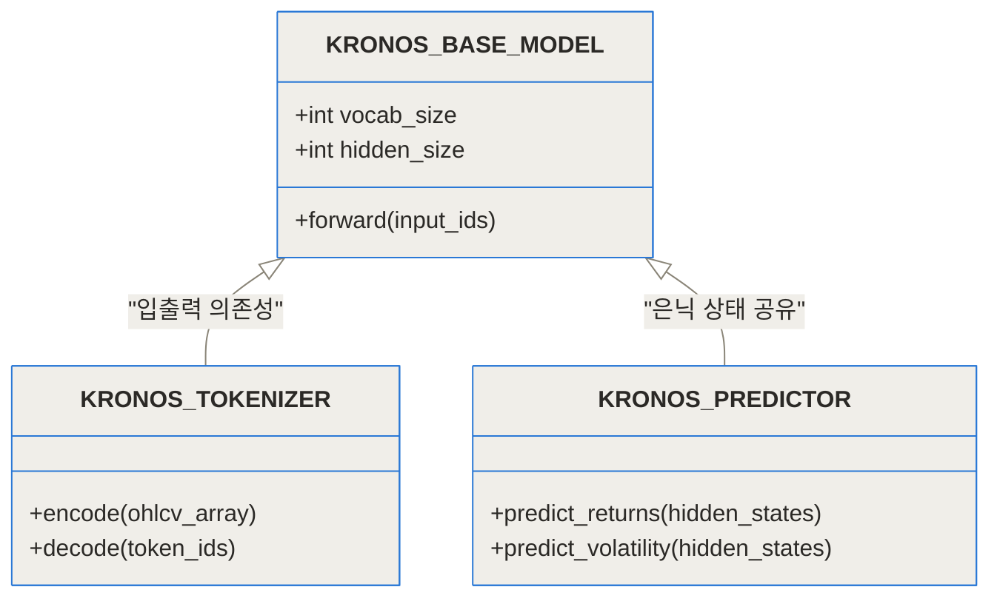
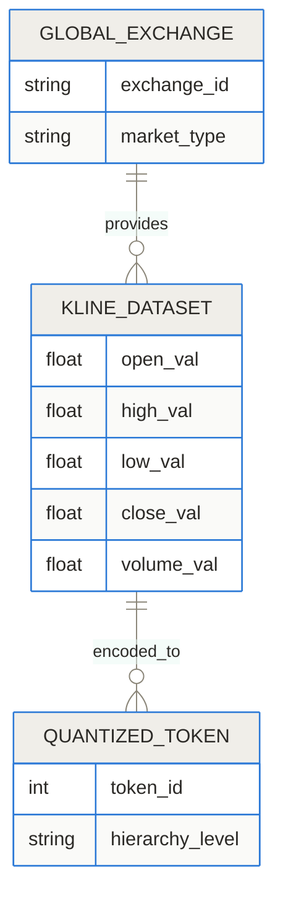
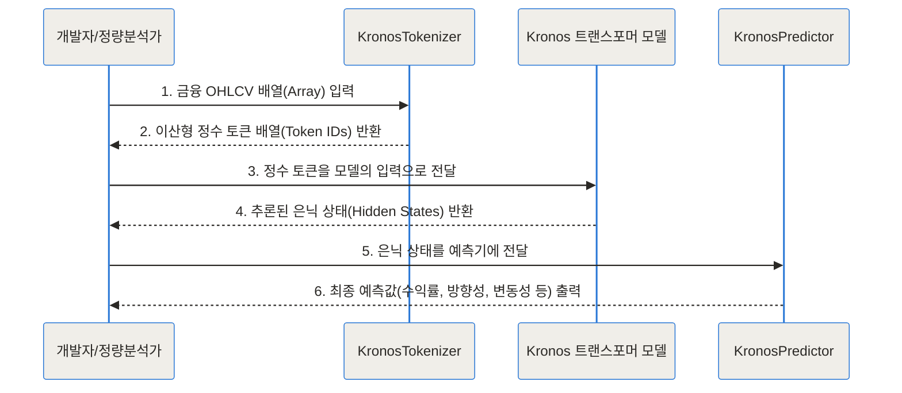
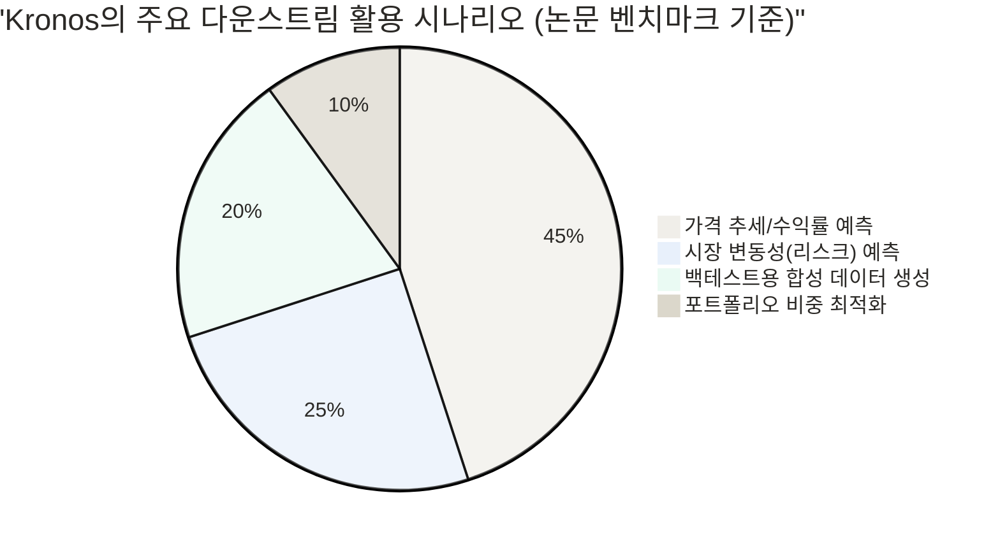
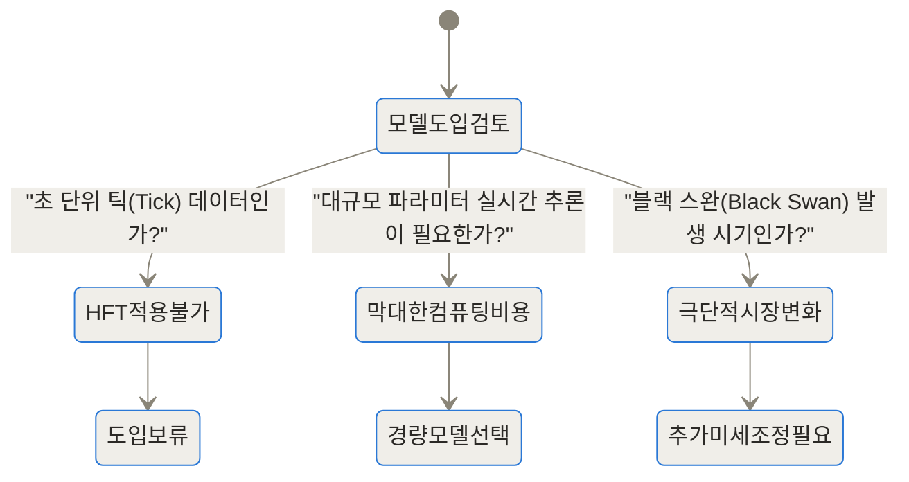

[관련 리소스 링크]
- [Kronos GitHub 저장소](https://github.com/shiyu-coder/Kronos)
- [Kronos 논문 (arXiv)](https://arxiv.org/abs/2508.02739)
- [Hugging Face 모델 허브](https://huggingface.co/NeoQuasar/Kronos-small)

---

> **TL;DR (한 줄 요약)**
> 1. **시장의 언어화**: 주식 캔들스틱(시가, 고가, 저가, 종가, 거래량)이라는 연속적인 수치 데이터를 자연어 단어처럼 '이산 토큰'으로 변환하여 분석합니다.
> 2. **초거대 학습 데이터**: 전 세계 45개 거래소에서 수집된 120억 개의 K선(K-line) 데이터를 자기회귀(Autoregressive) 방식으로 사전 학습한 파운데이션 모델입니다.
> 3. **압도적인 성능**: 제로샷(Zero-shot) 환경에서도 기존 최신 시계열 모델 대비 가격 예측 성능(RankIC)을 최대 93% 끌어올렸으며, 정량 투자부터 합성 데이터 생성까지 다방면으로 활용할 수 있습니다.

---

## 기존 시계열 예측 모델이 금융 시장에서 실패하던 이유

최근 몇 년간 대형 언어 모델(LLM)의 눈부신 성공에 힘입어, 시계열 데이터를 다루는 파운데이션 모델(TSFM, Time Series Foundation Model) 연구도 활발히 진행되었습니다. 하지만 기상 예측이나 전력 수요 예측에서 좋은 성과를 냈던 모델들이 금융 시장의 K선(캔들스틱) 데이터 앞에서는 유독 힘을 쓰지 못했습니다. 심지어 복잡하게 사전 학습된 최신 모델이, 아주 단순한 과거의 통계 기반 모델이나 비학습 신경망보다 낮은 성능을 기록하는 경우도 허다했죠.

왜 그럴까요? 금융 시장의 데이터는 근본적으로 다른 성질을 가지고 있기 때문입니다.

첫째, **극심한 노이즈와 비정상성(Non-stationarity)**입니다. 주가는 사람들의 심리, 거시 경제 지표, 정치적 사건 등 무수히 많은 변수에 의해 끊임없이 요동칩니다. 어제까지 통했던 패턴이 오늘은 전혀 통하지 않는 '개념 변화(Concept Drift)'가 일상적으로 발생합니다.
둘째, **연속적 데이터 구조의 한계**입니다. 기존 TSFM들은 대부분 실수 형태의 연속적인(Continuous) 값을 그대로 신경망에 집어넣어 처리하려 했습니다. 하지만 값이 무한히 다양하게 나타나는 연속형 데이터를 그대로 학습하는 것은 마치 문법 없이 단어의 주파수 파형만 듣고 언어를 배우려는 것과 같습니다.

연구자들은 여기서 발상을 전환했습니다. **"복잡한 숫자의 연속을 다루지 말고, 주식 차트를 하나의 문장처럼 읽게 만들면 어떨까?"** 이것이 바로 칭화대학교 연구진이 [Kronos 프로젝트](https://github.com/shiyu-coder/Kronos)를 통해 AAAI 2026에서 제시한 새로운 패러다임입니다.

---

## Kronos란 무엇인가? 개념 쉽게 이해하기

Kronos의 중심 아이디어는 **'시장의 언어(Language of Financial Markets)'**라는 개념에서 출발합니다.

우리가 자연어를 처리할 때, 'apple'이라는 단어를 글자(a-p-p-l-e) 단위나 음성 파형의 실수 값으로 분석하지 않고 하나의 '토큰(Token)'으로 묶어서 문맥을 파악합니다. Kronos는 금융 시장의 기본 단위인 캔들스틱(시가, 고가, 저가, 종가, 거래량 - OHLCV)을 이런 토큰으로 변환합니다.



위 다이어그램처럼 연속적인 소수점 숫자로 이루어진 주가 데이터를, 의미 있는 범위 단위로 잘라 특정 '단어(정수 ID)'로 매핑합니다. 예를 들어 '시가가 낮게 시작해 종가가 크게 오르고 거래량이 폭발한 장대양봉'이라는 연속적 상태를 `[Token_402, Token_15]` 같은 이산적인 식별자로 묶는 식입니다.

이런 방식은 노이즈를 획기적으로 줄여줍니다. 정확히 1.2345% 올랐는지 1.2350% 올랐는지에 집착하는 대신, '강한 상승세'라는 본질적인 패턴(문법)을 학습하는 데 집중할 수 있게 만들기 때문입니다.

---

## 작동 원리 심층 분석 (Under the Hood)

이제 모델의 내부 구조를 좀 더 기술적인 관점에서 단계별로 파헤쳐 보겠습니다. Kronos는 크게 데이터 파이프라인, 전용 토크나이저, 그리고 자기회귀 트랜스포머 모델로 구성됩니다.



### 1. 전용 토크나이저: 거시에서 미시로 (Coarse-to-Fine)

가장 중요한 혁신은 `KronosTokenizer`에 있습니다. 단순히 연속된 값을 일정한 간격의 바구니에 담는(Binning) 수준을 넘어섭니다. K선 데이터 하나를 단일 토큰으로 압축하면 정보 손실이 크기 때문에, Kronos는 **계층적 토큰 구조**를 도입했습니다.

먼저 전체적인 가격의 움직임(수익률, 시가-종가 비율 등)을 나타내는 큰 단위의 '거시 토큰'을 생성하고, 그 안에서 고가와 저가의 그림자(꼬리) 비율, 거래량의 미세한 변화 등을 나타내는 '미시 토큰'을 순차적으로 생성합니다. 이를 통해 거시적인 시장 트렌드를 놓치지 않으면서도 캔들스틱 내부의 세밀한 움직임까지 모두 포착합니다.



### 2. 압도적인 규모의 자기회귀 사전 학습

토큰화된 데이터는 자연어 처리에서 흔히 쓰이는 자기회귀(Autoregressive) 방식의 트랜스포머에 입력됩니다. 즉, 이전까지의 주가 흐름(토큰들)을 보고 다음 시점의 주가 흐름(다음 토큰)이 무엇일지 확률 분포를 맞추는 훈련을 끝없이 반복합니다.

학습 데이터의 규모가 방대합니다. 미국 주식 시장뿐만 아니라 전 세계 45개 주요 거래소에서 수집된 **120억 개 이상의 K선 기록**을 학습했습니다.



이러한 광범위한 다중 시장(Multi-market) 코퍼스를 통해 Kronos는 특정 국가나 자산군에 종속되지 않은, 시장 전반을 관통하는 보편적인 교차 자산(Cross-asset) 표현력을 획득했습니다.

---

## Kronos 설치 및 코드 적용 방법

Kronos는 누구나 연구와 실무에 활용할 수 있도록 GitHub와 Hugging Face를 통해 전면 오픈소스로 공개되어 있습니다. 파라미터 크기에 따라 4.1M 모델부터 499.2M 모델까지 다양하게 제공되므로, 보유한 컴퓨팅 환경에 맞게 선택할 수 있습니다.

실제 코드에서 어떻게 데이터를 입력하고 예측 결과를 얻어오는지, 컴포넌트 간의 상호작용을 순서도로 살펴보겠습니다.



이를 구현하는 파이썬(Python) 코드는 매우 직관적입니다. 허깅페이스 생태계에 편입되어 있어 `transformers` 라이브러리를 다뤄본 개발자라면 몇 줄만으로 즉시 구동할 수 있습니다.

```python
from model import Kronos, KronosTokenizer, KronosPredictor
import torch

# 1. Hugging Face 허브에서 사전 학습된 토크나이저와 모델 가중치 불러오기
tokenizer = KronosTokenizer.from_pretrained("NeoQuasar/Kronos-Tokenizer-base")
model = Kronos.from_pretrained("NeoQuasar/Kronos-small")

# 2. 임의의 K-line 데이터 준비 (예: (Batch, Time_Steps, 5) 차원의 OHLCV 텐서)
# 실제 환경에서는 Pandas나 Qlib을 통해 데이터를 가져옵니다.
ohlcv_data = torch.randn(1, 60, 5) 

# 3. 연속형 데이터를 이산형 토큰으로 변환
token_ids = tokenizer.encode(ohlcv_data)

# 4. 모델 추론 (은닉 상태 추출)
with torch.no_grad():
    hidden_states = model(token_ids)
    
# 5. 다운스트림 작업 수행 (예: 다음 시점의 가격 예측)
predictor = KronosPredictor(task="forecasting")
prediction = predictor(hidden_states)
print("예측된 다음 시점의 시장 변화율:", prediction)
```

---

## 어떤 분야에 활용할 수 있나? (실전 시나리오)

이 모델은 단순히 '내일 주식이 오를까요?'라는 질문에만 답하는 것이 아닙니다. 사전 학습 단계에서 시장의 언어를 깨우쳤기 때문에, 약간의 미세 조정(Fine-tuning)이나 제로샷(Zero-shot) 추론만으로 금융 산업의 여러 난제들을 해결합니다.



### 시나리오 1. 정량 투자(Quant Trading)를 위한 가격 방향성 예측
현업 퀀트 매니저들이 가장 주목하는 부분입니다. Kronos는 별도의 추가 학습 없이(Zero-shot) 마이크로소프트의 오픈소스 퀀트 프레임워크인 Qlib 환경 등에서 훌륭한 팩터(Factor) 생성기 역할을 합니다. 다수의 자산에 대해 동시에 미래 횡단면 수익률의 순위를 매겨, 상위 자산을 매수하고 하위 자산을 공매도하는 롱-숏(Long-Short) 전략의 기본 신호로 바로 투입할 수 있습니다.

### 시나리오 2. 정교한 리스크 관리: 변동성 예측
일반적으로 금융 공학에서는 자산의 위험도를 측정하기 위해 GARCH 등 복잡한 계량경제학 통계 모델을 주로 사용합니다. 하지만 Kronos는 과거의 캔들스틱 흐름만 보고도 전통적인 계량 모델보다 더 정확하게 내일의 시장 변동성을 짚어냅니다. 이는 파생상품 가격 책정(옵션 프라이싱)이나 VaR(Value at Risk) 산출에 즉각적인 도움을 줍니다.

### 시나리오 3. 무제한 시장 시뮬레이터: 합성 K선 데이터 생성
전통적인 GAN(적대적 생성 신경망)이나 확산 모델(Diffusion)이 이미지 생성을 넘어 금융 데이터 생성을 시도했지만, 시계열 특유의 인과관계와 꼬리 위험(Tail Risk)을 모사하는 데 한계가 있었습니다. Kronos는 텍스트를 지어내는 GPT처럼, 꽤 긴 시간 동안의 가상 주식 차트를 아주 그럴싸하게 생성해 냅니다. 이를 통해 과거에 한 번도 없었던 극단적 폭락 장세 등을 시뮬레이션하여 퀀트 전략의 견고함을 백테스팅해 볼 수 있습니다.

---

## 기존 모델과의 성능 비교 (벤치마크)

논문에 제시된 벤치마크 결과를 보면, 왜 Kronos가 기존 방법론들을 압도하는지 명확한 수치로 확인할 수 있습니다.

### 1. 예측 성능 (RankIC) 비교
주식 포트폴리오를 구성할 때는 개별 종목의 절대 수익률을 맞추는 것보다, 여러 종목 간의 상대적 등수(순위 상관계수, RankIC)를 정확히 맞추는 것이 훨씬 중요합니다. 

```chartjs
{
  "type": "bar",
  "data": {
    "labels": ["최고의 기존 TSFM 모델", "최고의 비학습 통계 모델", "Kronos (본 모델)"],
    "datasets": [
      {
        "label": "가격 시계열 예측 성능 향상률 (Baseline=100 기준)",
        "data": [100, 103, 193],
        "backgroundColor": ["#cbd5e1", "#94a3b8", "#3b82f6"]
      }
    ]
  },
  "options": {
    "responsive": true,
    "plugins": {
      "title": {
        "display": true,
        "text": "RankIC 성능 비교 (제로샷 환경)"
      }
    }
  }
}
```
놀랍게도 기존의 범용 시계열 파운데이션 모델(TSFM)들은 오히려 금융 분야에서 비학습 통계 모델보다 못한 성과를 내곤 했습니다. 반면 Kronos는 기존 선두 TSFM 대비 무려 **93%**, 가장 우수한 비학습 모델 대비 **87%**의 RankIC 향상을 달성했습니다.

### 2. 변동성 예측 오차율(MAE) 비교
변동성은 낮게 칠수록, 즉 오차(MAE)가 작을수록 우수합니다.

```chartjs
{
  "type": "bar",
  "data": {
    "labels": ["전통적인 GARCH 모델 계열", "Kronos 예측 기반"],
    "datasets": [
      {
        "label": "변동성 예측 오차(MAE) 상대 비교 (낮을수록 우수)",
        "data": [100, 91],
        "backgroundColor": ["#ef4444", "#10b981"]
      }
    ]
  },
  "options": {
    "responsive": true,
    "plugins": {
      "title": {
        "display": true,
        "text": "변동성 예측 오차 감소율"
      }
    }
  }
}
```
Kronos는 엄격한 통계적 가정에 기반한 경제학 모델보다 MAE를 약 9% 더 낮추는 데 성공했습니다. 복잡한 수식을 설계하지 않고도 오로지 데이터의 패턴만으로 통계학적 한계를 넘어선 셈입니다.

### 트레이드오프 요약 표

모든 상황에서 완벽한 도구는 없습니다. 상황에 맞게 기존 퀀트 방법론과 Kronos를 비교해 보아야 합니다.

| 비교 항목 | 기존 머신러닝 퀀트 모델 (예: XGBoost, LSTM) | 범용 시계열 파운데이션 모델 | Kronos (금융 특화 파운데이션) |
| :--- | :--- | :--- | :--- |
| **학습 방식** | 특정 자산군/시장 데이터에 맞춰 개별 학습 필요 | 다양한 산업 분야의 연속형 데이터 통째 학습 | 금융 K선 데이터를 이산 토큰화하여 자기회귀 학습 |
| **데이터 적응성** | 다른 시장(예: 주식->코인) 적용 시 성능 급락 | 일관성은 있으나 금융 노이즈 처리에 취약 | 45개 글로벌 거래소 사전 학습으로 뛰어난 제로샷 전이 능력 |
| **다목적 활용** | 설계된 단일 목적(예: 가격 예측)에만 제한됨 | 주로 시계열 예측과 보간(Imputation)에 집중 | 가격 예측, 변동성 측정, 합성 K선 생성 등 엔드투엔드 처리 |
| **연산 비용** | 매우 낮음 (빠른 실시간 추론 가능) | 높음 (거대 모델 구동 리소스 필요) | 높음 (최대 499.2M 파라미터 구동 시 GPU 인프라 요구) |

---

## 한계점 및 고려해야 할 점 (솔직한 평가)

탁월한 성과에도 불구하고, 실무에 도입하기 전 반드시 고려해야 할 리스크와 한계점이 존재합니다.



1. **고빈도 매매(HFT) 데이터 지원의 한계**
   현재의 Kronos는 분봉, 일봉 수준의 정형화된 OHLCV 데이터에 최적화되어 있습니다. 밀리초 단위로 쏟아지는 불규칙한 틱(Tick) 데이터나 호가창(Order Book) 깊이 정보를 분석하는 데는 현재의 토크나이저 해상도가 충분하지 않아 적합하지 않습니다.

2. **거대 모델 운용 비용**
   가장 성능이 좋은 499.2M 모델을 수천 개 종목에 대해 매일 실시간으로 추론시키려면, 전통적인 통계 모델보다 훨씬 무거운 GPU 자원이 필요합니다. 연산 지연(Latency)이 치명적인 전략에는 적용하기 까다로울 수 있습니다.

3. **시장 구조의 근본적 변화(Concept Drift) 극복 여부**
   과거 120억 개의 기록을 학습했다고 하더라도, 코로나19 팬데믹이나 유례없는 금융 위기처럼 시장의 근본 룰이 완전히 파괴되는 이른바 '블랙 스완' 이벤트가 발생할 경우, 다른 모든 모델과 마찬가지로 Kronos 역시 예측 신뢰도를 담보할 수 없습니다.

---

## 마무리: 정량 투자의 새로운 기준

과거의 퀀트 투자자들은 '어떤 지표(Factor)를 손으로 깎아내야 수익이 날까'를 고민하며 밤을 새웠습니다. 이동평균선, RSI, MACD 등 무수한 수식들이 그 결과물입니다.

하지만 Kronos의 등장은 패러다임이 변하고 있음을 시사합니다. 인간이 수식을 정의하는 시대에서, 거대한 데이터와 자기회귀 모델이 시장의 숨겨진 '문법'을 스스로 찾아내는 시대로 넘어가고 있습니다. 오픈소스로 완전히 공개된 이 강력한 도구가 앞으로 금융 분석 생태계와 퀀트 리서치의 속도를 얼마나 가속화할지 기대해 보아도 좋습니다.

<!-- primary-sources:start -->
## 원문과 버전 확인

- [공식 GitHub 저장소](https://github.com/shiyu-coder/Kronos)
<!-- primary-sources:end -->

<!-- internal-links:start -->
## 함께 읽으면 이해가 이어지는 글

- [TimesFM으로 수천 예측 모델을 하나로 합쳐도 될까: 제로샷 기준선]() — TimesFM 1.0의 패치 기반 예측 구조와 제로샷 활용 범위를 살펴보고, 기존 시계열 파이프라인을 대체하기 전에 검증할 기준을 정리합니다.
- [daily\_stock\_analysis를 0원으로 운영할 수 있을까: GitHub Actions·데이터 품질·비용 조건]() — daily_stock_analysis가 GitHub Actions로 금융 데이터 수집·LLM 요약·알림을 예약 실행하는 구조와 무료 한도, 데이터 품질, 비밀 관리와 투자 판단의 한계를 분석합니다.
- [금융 API를 MCP로 감싸면 규제·권한 문제가 끝날까? 현실적인 경계]() — MCP가 금융 시스템의 도구 발견과 호출 형식을 표준화하는 범위, 그리고 권한·감사·상태·고빈도 처리까지 자동 해결하지는 못하는 이유를 구분합니다.
<!-- internal-links:end -->

## 자주 묻는 질문 (FAQ)

### 기존 언어 기반 금융 AI(FinGPT나 BloombergGPT)와 Kronos는 무엇이 다른가요?

기존 금융 AI는 주로 뉴스 기사, 재무제표, 애널리스트 리포트 등 '자연어 텍스트'를 읽고 심리를 분석하는 언어 모델입니다. 반면 Kronos는 주식의 가격과 거래량이라는 순수 '수치형 캔들스틱 데이터(OHLCV)' 자체를 이산적인 토큰으로 변환해 직접 분석한다는 점에서 근본적인 목적과 구조가 다릅니다.

### 초 단위 호가창이나 틱(Tick) 데이터에도 Kronos를 사용할 수 있나요?

현재 공개된 Kronos 모델은 분봉이나 일봉처럼 정해진 시간 주기를 갖는 K선(캔들스틱) 데이터 구조에 맞춰 학습되었습니다. 불규칙하게 발생하는 틱 데이터나 뎁스(Depth)가 있는 호가창 데이터를 다루려면 별도의 토크나이저 설계와 바닥부터의 재학습이 필요합니다.

### Kronos를 실전 트레이딩 자동화에 바로 꽂아서 쓸 수 있나요?

모델 자체는 미래의 가격 방향성이나 변동성에 대한 확률적 신호(Signal)만을 제공합니다. 실제 자동 매매에 적용하려면 거래 수수료, 슬리피지(체결 오차), 자금 관리 규칙 등을 통제해야 하므로, Qlib 같은 백테스팅 프레임워크와 결합하여 본인만의 전략 규칙을 입히는 파인튜닝 과정이 필수적입니다.

### 개인 컴퓨터나 노트북에서도 Kronos 모델을 돌려볼 수 있나요?

네, 가능합니다. Kronos는 약 4.1M(410만) 파라미터의 초소형 모델부터 499.2M 파라미터의 대형 모델까지 다양한 크기를 제공합니다. 가장 작은 모델은 일반적인 노트북 CPU나 저사양 GPU 환경에서도 충분히 빠르고 가볍게 추론 테스트를 진행할 수 있습니다.

### 미국 주식이 아닌 한국 주식이나 암호화폐 시장에도 잘 맞을까요?

Kronos는 특정 국가에 국한되지 않고 전 세계 45개 이상의 주요 거래소에서 수집된 120억 개의 K선 데이터를 기반으로 사전 학습되었습니다. 따라서 주식은 물론 암호화폐, 외환 등 자산군의 경계를 넘어 시장을 관통하는 보편적인 가격 변동 패턴을 인식하므로 훌륭한 제로샷(Zero-shot) 성능을 기대할 수 있습니다.


## References
- [https://github.com/shiyu-coder/Kronos](https://github.com/shiyu-coder/Kronos)
- [https://arxiv.org/abs/2508.02739](https://arxiv.org/abs/2508.02739)
- [https://huggingface.co/NeoQuasar/Kronos-small](https://huggingface.co/NeoQuasar/Kronos-small)
