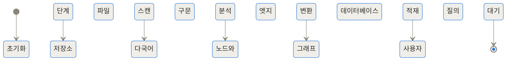
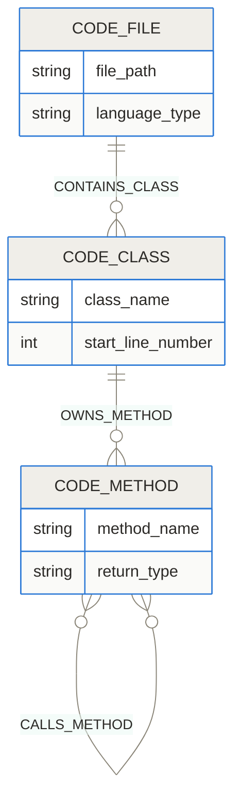
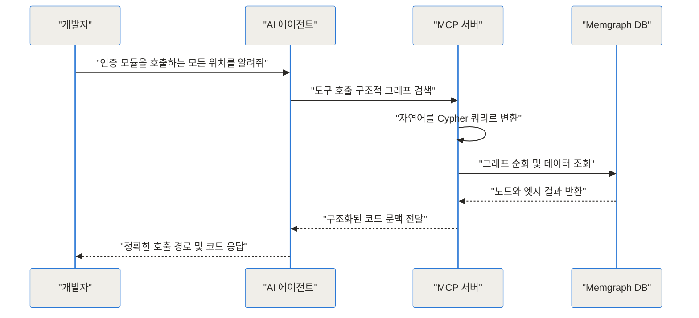
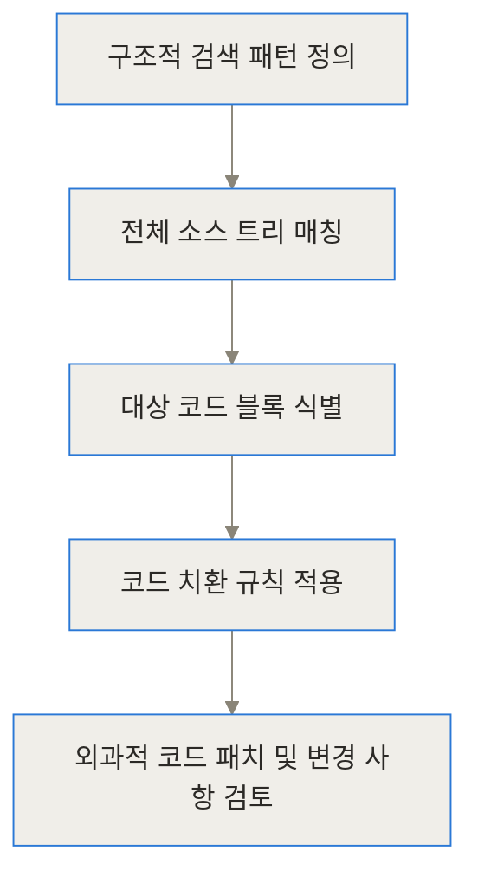
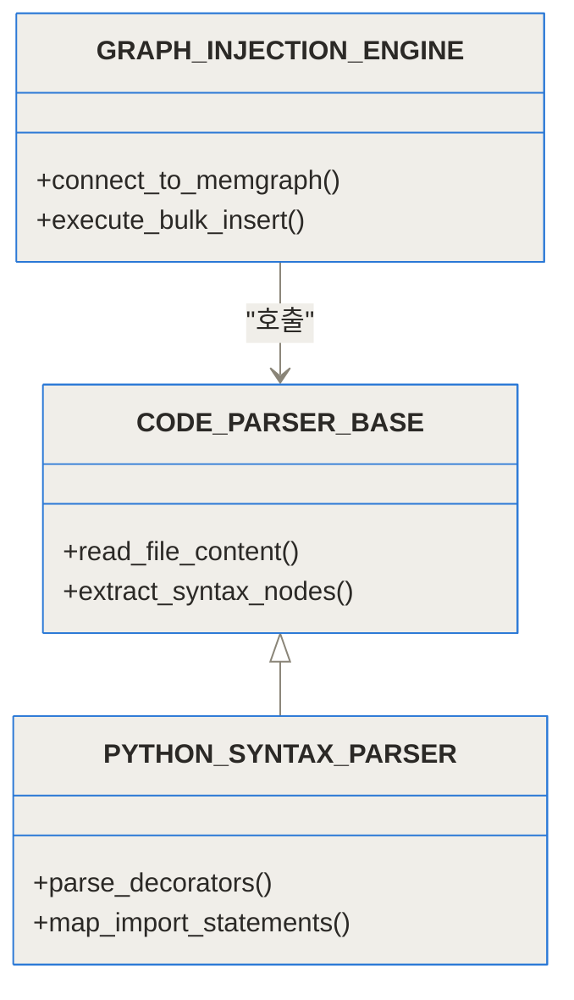
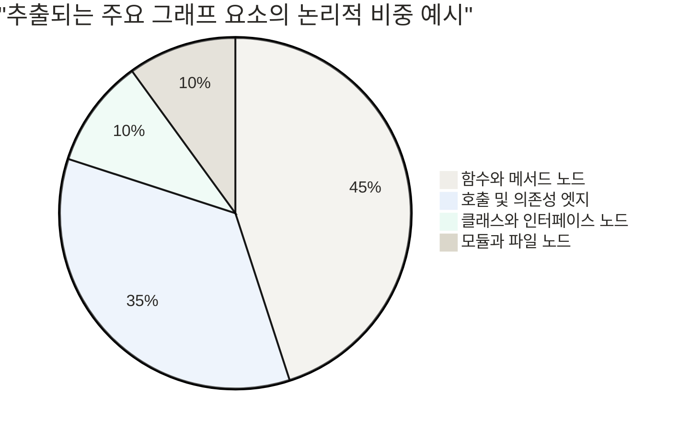

이 글의 핵심을 세 줄로 요약하면 다음과 같습니다.

> **TL;DR**
> - 일반적인 RAG(검색 증강 생성)는 코드를 단순 텍스트로 취급하여 관계를 놓치지만, 이 프로젝트는 코드를 '지식 그래프'로 만들어 구조를 보존합니다.
> - Tree-sitter로 다국어 코드를 구문 분석하고 초고속 Memgraph에 적재한 뒤, AI가 자연어로 Cypher 쿼리를 생성해 정확한 답변을 찾아냅니다.
> - 최근 도입된 MCP(Model Context Protocol) 지원과 FLOWS_TO 데이터 흐름 추적을 통해, AI 코딩 에이전트가 사람처럼 정밀하게 코드를 추적하고 수정할 수 있게 해줍니다.

---

## 들어가며

### 코드베이스의 미로 속에서 길을 잃은 AI

대규모 모노레포를 다루는 현업 개발자라면, 최근 쏟아져 나오는 AI 코딩 어시스턴트나 에이전트 도구들을 한 번쯤 프로젝트에 적용해 보셨을 것입니다. 단일 파일이나 수백 줄 남짓한 스크립트를 작성할 때 AI는 놀라운 생산성을 보여줍니다. 하지만 파일이 수천 개로 늘어나고, 여러 언어가 섞여 있으며, 수십 개의 서비스가 서로를 참조하는 거대한 코드베이스에 AI를 풀어놓으면 이야기가 완전히 달라집니다.

"이 베이스 클래스를 상속받아서 구현된 모든 데이터베이스 핸들러를 찾아주고, 그 안에서 사용자 권한을 체크하는 메서드를 수정해 줘"라고 요청하면 어떻게 될까요? 대부분의 AI 에이전트는 컨텍스트를 잃어버리고 엉뚱한 파일을 가져오거나, 심지어 존재하지도 않는 가상의 메서드를 호출하는 환각(Hallucination) 현상을 일으키곤 합니다. AI 모델의 컨텍스트 윈도우가 100만 토큰, 200만 토큰으로 늘어났다고 해도, 무작정 전체 코드를 밀어 넣는 방식은 속도가 너무 느리고 막대한 비용을 발생시키며, 정작 중요한 정보는 중간에 묻혀버리는 'Lost in the middle' 문제를 피할 수 없습니다.

이러한 문제를 근본적으로 해결하기 위해 등장한 프로젝트가 바로 vitali87이 개발한 **Code Graph RAG**입니다. 이 시스템은 AI가 코드를 인간 개발자처럼 입체적이고 구조적으로 이해할 수 있도록 돕는 튼튼한 다리를 놔줍니다.

---

## 기존 RAG 시스템의 맹점과 문제 정의

### 벡터 검색이 코드를 제대로 이해하지 못하는 이유

현재 대다수의 AI 코딩 도구는 코드를 검색하기 위해 일반적인 텍스트 문서와 동일한 벡터 기반의 RAG를 사용합니다. 코드 텍스트를 일정한 크기의 청크(Chunk)로 쪼개고, 임베딩 모델을 통해 고차원 벡터로 변환한 뒤 벡터 데이터베이스에 저장하죠. 사용자가 질문을 던지면, 질문과 가장 '의미적으로 유사한' 청크를 찾아 LLM에 전달합니다.

하지만 코드는 소설이나 기사 같은 일반 자연어 문서가 아닙니다. 코드는 엄격한 문법, 컴파일러의 논리, 명시적인 의존성, 그리고 파일과 디렉터리를 넘나드는 강력한 '관계'로 이루어져 있습니다. 벡터 검색은 `UserFactory`라는 단어와 `CustomerBuilder`라는 단어가 비슷하다는 것은 알 수 있지만, `UserFactory`가 구체적으로 어떤 인터페이스를 구현(Implements)하고 있으며, 어느 파일에 위치한 어떤 함수에 의해 실제로 호출(Calls)되는지는 확신할 수 없습니다. 

### 컨텍스트 윈도우의 환상과 한계

그렇다면 아예 전체 소스 코드를 프롬프트에 통째로 붙여 넣으면 어떨까요? 이 방법은 작은 프로젝트에서는 통할지 몰라도, 엔터프라이즈급 모노레포에서는 물리적으로 불가능합니다. 수백만 줄의 코드를 매번 전송하는 네트워크 지연과 API 토큰 비용은 감당하기 어렵습니다. 결국 AI에게 필요한 것은 전체 코드의 텍스트 덤프가 아니라, 전체 코드의 '정확한 지도'와 '요약된 이정표'입니다. 여기서 Code Graph RAG의 핵심 아이디어가 출발합니다.

---

## Code Graph RAG: 코드를 지식의 지도로 만들다

### 의미적 유사성에서 구조적 관계로의 도약

이 프로젝트는 텍스트를 버리고 '그래프(Graph)'를 선택했습니다. 마치 복잡한 대도시의 교통 상황을 파악하기 위해 도시 전체의 사진을 찍는 대신, 교차로(노드)와 도로(엣지)가 그려진 정밀한 지도를 만드는 것과 같습니다.

이 지도를 **지식 그래프(Knowledge Graph)**라고 부릅니다. 코드베이스 안의 모든 파일, 모듈, 클래스, 함수, 변수는 노드(Node)가 되고, 이들이 맺고 있는 상속 관계, 함수 호출, 모듈 임포트 등은 엣지(Edge)가 됩니다. 이렇게 만들어진 지식 그래프에 질의를 던지면 확률적인 근사치가 아니라 수학적으로 완벽하게 정확한 경로를 찾아낼 수 있습니다.


위 다이어그램에서 볼 수 있듯, 소스 코드는 고성능 파서를 거쳐 그래프 데이터베이스에 안착하며, AI 에이전트는 표준화된 프로토콜을 통해 이 데이터베이스와 자유롭게 소통하게 됩니다.

---

## 작동 원리 심층 분석 (Under the Hood)

이 시스템이 내부적으로 어떻게 움직이는지 단계별로 깊이 파헤쳐 보겠습니다.

### 1단계: Tree-sitter를 통한 구문 분석과 다국어 지원

그래프를 만들기 위한 첫 단추는 코드를 컴퓨터가 이해할 수 있는 트리 형태로 변환하는 것입니다. 이를 위해 Code Graph RAG는 **Tree-sitter**라는 강력한 구문 분석(Parsing) 엔진을 사용합니다. Tree-sitter는 최신 텍스트 에디터들이 실시간 구문 강조(Syntax Highlighting)를 위해 사용하는 도구로, 문법 오류가 있거나 코드를 작성하는 도중에도 멈추지 않고 유효한 추상 구문 트리(AST)를 만들어내는 데 탁월합니다.

특히 대규모 모노레포는 단일 언어로만 이루어지지 않습니다. 백엔드는 Java나 Go, 프론트엔드는 TypeScript, 데이터 파이프라인은 Python으로 작성된 경우가 흔하죠. Code Graph RAG는 11개 이상의 주요 언어(Python, Java, C, C#, Go 등)를 기본적으로 지원합니다. 

놀라운 점은 서로 다른 언어의 문법 구조를 단일하고 통일된 그래프 스키마(Schema)로 정규화한다는 것입니다. 언어가 달라도 그래프 내부에서는 모두 동일한 '클래스', '함수', '임포트' 노드로 취급됩니다. 최근에는 플러그형 `ast-grep` 계층이 추가되어, 복잡하게 파서 코드를 새로 작성할 필요 없이 단일 YAML 패턴 파일만으로 Ruby와 같은 새로운 언어의 문법을 쉽게 그래프에 편입시킬 수 있게 되었습니다.



### 2단계: Memgraph를 활용한 초고속 인메모리 지식 그래프 구축

추출된 방대한 노드와 엣지 데이터는 어디로 갈까요? 이 프로젝트는 데이터 저장소로 **Memgraph**를 채택했습니다. Memgraph는 완전한 인메모리(In-Memory) 환경에서 동작하는 C++ 기반의 초고속 그래프 데이터베이스입니다. 

일반적인 관계형 데이터베이스(RDBMS)에서는 복잡한 관계를 조회하기 위해 비용이 매우 비싼 조인(JOIN) 연산을 거쳐야 하지만, 그래프 데이터베이스는 노드 간의 포인터를 직접 따라가므로 깊이가 수십 단계에 이르는 상속 체인이나 호출 스택도 밀리초(ms) 단위로 즉시 탐색해 냅니다. 

그래프 내부의 데이터 구조는 다음과 같은 형태로 연결됩니다.



이러한 모델링을 통해 "A 클래스가 B 메서드를 가지고 있고, B 메서드는 C 메서드를 호출한다"는 구조적 사실이 명확하게 기록됩니다.

### 3단계: 자연어를 Cypher 쿼리로 변환하는 AI 계층

데이터베이스가 준비되었으니 이제 질문을 던질 차례입니다. 하지만 개발자나 AI 에이전트가 매번 복잡한 데이터베이스 질의어를 직접 작성할 수는 없겠죠. Code Graph RAG 내부에는 **Cypher 쿼리 생성 레이어**가 존재합니다.

사용자가 "데이터베이스 연결을 초기화하는 클래스를 상속받는 모든 자식 클래스를 찾아줘"라고 자연어로 질문하면, 중간에 개입하는 경량화된 AI 모델이 이 문장을 분석해 다음과 같은 Cypher(그래프 DB 표준 질의어) 코드로 변환합니다.

```cypher
MATCH (child:Class)-[:INHERITS]->(parent:Class {name: 'DatabaseConnection'})
RETURN child.name, child.file_path
```

이 쿼리가 Memgraph에서 실행된 후 정확한 결과 노드들이 반환되면, 그제야 최종 문맥이 정리되어 메인 AI 에이전트에게 전달됩니다. 쿼리 생성 모델로는 OpenAI나 Gemini 같은 외부 API를 사용할 수도 있지만, Ollama를 연결해 완전한 로컬(Local) 오프라인 환경에서 비용 없이 구동할 수도 있습니다.



### 4단계: FLOWS_TO 데이터 흐름 추적과 테인트 분석

최근 업데이트에서 가장 주목받는 기능 중 하나는 **데이터 흐름(Data-Flow) 추적**입니다. 단순한 호출 관계를 넘어, 특정 변수나 데이터가 여러 함수와 객체를 거쳐 어떻게 흘러가는지를 `FLOWS_TO`라는 특별한 엣지로 연결합니다.

이는 보안 분야에서 주로 사용하는 테인트 분석(Taint Analysis)과 유사한 개념입니다. 사용자의 입력을 받는 API 엔드포인트(Source)부터, 그 데이터가 수많은 래퍼 클래스를 거쳐 최종적으로 데이터베이스나 로그에 기록되는 지점(Sink)까지의 긴 여정을 그래프 탐색 한 번으로 추적할 수 있습니다. 현재 C#, Java, C, Go 언어 환경에서 이 강력한 데이터 흐름 엣지를 지원합니다.

### 5단계: ast-grep 기반의 구조적 검색 및 치환

그래프가 코드의 위치를 정확히 짚어냈다면, 이제 코드를 수정할 차례입니다. 일반적인 텍스트 치환(정규 표현식 등)은 괄호의 중첩이나 줄바꿈을 제대로 처리하지 못해 코드를 망가뜨리기 일쑤입니다.

이 시스템은 `ast-grep`을 에이전트 도구로 결합했습니다. 에이전트는 "모든 try-catch 블록 중 catch 구문이 비어있는 곳을 찾아서 로그를 남기는 코드로 바꿔라" 같은 복잡한 구조적 리팩토링을 안전하게 수행할 수 있습니다. AST 레벨에서 일치하는 패턴을 찾기 때문에 띄어쓰기나 주석의 위치에 영향을 받지 않으며, 실제 코드를 변경하기 전에 정밀한 Diff(차이점)를 미리 확인하게 해줍니다.



---

## 구현 및 사용 디테일

### 시스템 요구사항과 설치 방법

Code Graph RAG를 실행하기 위한 설치 과정은 체계적으로 준비되어 있습니다. Python 환경을 기반으로 하며, 의존성 관리 도구인 `uv`를 활용해 빠르고 깔끔하게 패키지를 구성합니다. 시스템 내부적으로 파싱 컴파일 등을 위해 `cmake`와 텍스트 고속 검색을 위한 `ripgrep`을 요구합니다.

기본적인 복제와 설치는 터미널에서 다음 명령어로 이루어집니다.

```bash
git clone https://github.com/vitali87/code-graph-rag.git
cd code-graph-rag
# Python 기본 지원만 필요할 경우
uv sync
# 다국어 전체 지원이 필요한 경우
uv sync --extra treesitter-full
```

내부 구조는 유지보수성과 확장성을 고려해 철저히 객체 지향적으로 설계되어 있습니다. 새로운 언어나 파서를 추가하기 쉽도록 추상화된 베이스 클래스를 제공합니다.



### MCP(Model Context Protocol) 연동

이 도구가 생태계에서 폭발적인 반응을 얻은 결정적 이유는 바로 **MCP 서버로의 완벽한 통합**에 있습니다. MCP(Model Context Protocol)는 Anthropic이 주도하는 개방형 프로토콜로, AI 모델이 외부 도구나 데이터 소스에 안전하고 표준화된 방식으로 접근할 수 있게 해줍니다.

이 시스템을 MCP 서버로 실행해두면, Claude Code나 Cursor 같은 최신 AI 에이전트들이 스스로 "아, 내가 지금 작업하는 환경에 구조적 코드 검색 도구가 있구나"라고 인식합니다. 개발자가 "이 인터페이스를 구현하는 클래스들을 리스트업해 줘"라고 말하면, 에이전트가 알아서 Code Graph RAG의 MCP 도구를 호출해 완벽한 결과를 바탕으로 코딩을 이어갑니다. 번거로운 복사 붙여넣기나 컨텍스트 주입 과정이 완전히 사라지는 셈입니다.

---

## 실전 활용 시나리오

단순한 이론을 넘어, 현업의 골칫거리를 해결하는 구체적 시나리오들을 살펴보겠습니다.

### 시나리오 1: 거미줄처럼 얽힌 데드 코드(Dead Code) 제거

수십 명의 개발자가 거쳐 간 프로젝트에는 아무도 호출하지 않지만 혹시 몰라 남겨둔 유령 코드가 넘쳐납니다. 단순 텍스트 검색으로는 특정 함수명과 우연히 일치하는 문자열 때문에 안전한 삭제 여부를 판단하기 어렵습니다.
Code Graph RAG를 활용하면 애플리케이션의 메인 진입점(Entry Point)에서 시작해 호출 엣지(`CALLS`)를 따라가는 그래프 순회를 실행할 수 있습니다. 그래프 상에서 연결이 끊겨 도달할 수 없는 모든 고립된 노드들을 찾아내면, 그것이 바로 수학적으로 100% 안전하게 지울 수 있는 데드 코드입니다.

### 시나리오 2: 구조적 리팩토링 시 사이드 이펙트 사전 파악

어느 날 핵심 결제 모듈의 인터페이스를 변경해야 하는 상황이 주어졌습니다. 이 모듈을 직간접적으로 사용하는 클래스가 백여 개에 달합니다. 일반적인 RAG 환경에서는 에이전트에게 "결제 모듈을 수정했으니 영향받는 곳을 다 고쳐줘"라고 해도 몇 군데를 빼먹기 십상입니다.
하지만 그래프 데이터베이스는 의존성 트리 전체를 한 치의 오차 없이 추출해냅니다. 추출된 노드 비율을 보면 단순 텍스트보다 관계성이 얼마나 중요한지 체감할 수 있습니다.



이 의존성 트리를 AI 에이전트에게 전달하면, 에이전트는 정확히 100개의 영향을 받는 클래스만 타겟팅하여 `ast-grep` 도구로 구조적 치환을 수행합니다.

---

## 벤치마크 및 기존 기술과의 비교

### 성능과 토큰 효율성 비교

구조적 컨텍스트를 파악할 때 벡터 RAG 방식과 Code Graph RAG의 토큰 소모량을 비교하면 극적인 차이가 나타납니다. 

```chartjs
{
  "type": "bar",
  "data": {
    "labels": ["전체 파일 로드 방식 (일반 RAG)", "정밀 추출 방식 (Code Graph RAG)"],
    "datasets": [
      {
        "label": "대규모 리팩토링 시 평균 컨텍스트 토큰 소비량",
        "data": [350000, 15000],
        "backgroundColor": ["rgba(255, 99, 132, 0.7)", "rgba(54, 162, 235, 0.7)"]
      }
    ]
  },
  "options": {
    "responsive": true,
    "plugins": {
      "title": {
        "display": true,
        "text": "AI 에이전트의 불필요한 토큰 낭비 절감 효과"
      }
    }
  }
}
```

전체 파일을 억지로 욱여넣는 방식은 35만 토큰 이상을 소비하며 처리 시간과 비용을 폭증시키지만, 그래프 RAG는 필요한 함수 시그니처와 계층 구조만을 정확히 뽑아내어 약 1만 5천 토큰 선에서 작업을 마무리합니다.

### 주요 기능 한눈에 보기

기존의 일반 RAG 시스템과 Code Graph RAG를 뚜렷하게 비교할 수 있도록 정리한 표입니다.


| 비교 항목 | 기존 벡터 기반 RAG | Code Graph RAG | 
| --- | --- | --- | 
| **데이터 이해 방식** | 평면적인 텍스트 청크 중심 | 다차원적인 관계 및 지식 그래프 중심 | 
| **검색의 기반** | 단어의 임베딩 유사도 (Semantic) | 명시적인 구문 트리 및 객체 참조 관계 | 
| **결과의 정확성** | 확률에 의존한 근사치 (가짜 환각 위험) | 수학적으로 확실한 노드 연결 결과 | 
| **토큰 낭비 여부** | 연관 없는 주변 코드까지 무분별하게 포함 | 질의에 필요한 시그니처와 엣지만 정밀 타격 | 


다양한 플러그인과 확장 기능 또한 이 도구만의 매력적인 무기입니다.


| 강력한 확장 기능 | 개발자에게 주는 이점 | 
| --- | --- | 
| **다국어 단일 스키마 통합** | Python 백엔드와 JS 프론트엔드가 섞인 레포지토리를 한 번에 질의 가능 | 
| **FLOWS_TO 테인트 분석** | 입력부터 출력까지 데이터가 오염되거나 전달되는 흐름을 시각적으로 추적 | 
| **플러그형 ast-grep 통합** | C 기반의 복잡한 파서 작성 없이, YAML 설정만으로 사내 독자 언어나 규칙 추가 | 
| **MCP (Model Context Protocol)** | Claude Code 등과 결합하여 별도 인터페이스 없이 대화형으로 즉시 활용 | 


---

## 트레이드오프와 솔직한 평가

이처럼 강력한 도구라도 맹목적으로 도입하는 것은 경계해야 합니다. 모든 기술에는 장단점이 존재하며, Code Graph RAG 역시 예외는 아닙니다.

### 도입 전 고려해야 할 한계점

첫째, 인프라 오버헤드가 발생합니다. 단순한 벡터 검색은 파일 텍스트만 읽어서 임베딩 API에 넘기면 끝나지만, 이 시스템은 완전한 로컬 환경에 Memgraph 데이터베이스 컨테이너를 띄우고 Tree-sitter로 전수 파싱을 수행하는 과정이 선행되어야 합니다.
둘째, 시스템 메모리 사용량입니다. Memgraph는 초고속 탐색을 위해 모든 데이터를 램(RAM)에 상주시키는 인메모리 방식입니다. 수천만 줄 단위의 초거대 엔터프라이즈 모노레포를 통째로 적재하려 한다면 로컬 PC의 메모리가 부족해질 수 있습니다.
셋째, 동적 언어의 한계입니다. Python이나 JavaScript처럼 런타임에 동적으로 타입이 결정되거나 메타 프로그래밍이 잦은 언어는, 정적 분석(AST 추출)만으로는 완벽한 호출 그래프를 그려내지 못할 확률이 존재합니다.

### 이 시스템이 어울리지 않는 경우

따라서 10개 미만의 파일로 이루어진 개인 토이 프로젝트나, 단일 스크립트 위주의 데이터 분석 작업에서는 굳이 이 시스템을 설정할 필요가 없습니다. 일반적인 AI 어시스턴트의 컨텍스트 윈도우에 코드를 복사해서 붙여넣는 것이 훨씬 빠르고 효율적이기 때문입니다.

---

## 마치며: AI 엔지니어링의 새로운 표준

지금까지 살펴본 vitali87의 Code Graph RAG는 우리가 코드를 다루고 AI와 소통하는 방식을 한 단계 끌어올린 뛰어난 프로젝트입니다. 코드를 단순한 글자들의 나열이 아니라 상호작용하는 거대한 유기체이자 '관계의 집합'으로 바라보는 철학이 돋보입니다.

AI가 개발자를 대체할 것이라는 섣부른 두려움 대신, 개발자가 AI에게 가장 정확한 도구를 쥐여줌으로써 어떻게 한계를 돌파할 수 있는지 보여주는 훌륭한 사례입니다. 모노레포의 복잡성에 짓눌려 환각을 내뱉는 AI 도구에 실망한 적이 있다면, 코드를 진짜로 기억하고 구조적으로 이해하는 이 새로운 패러다임을 당장 경험해 보시기를 권합니다.

<!-- primary-sources:start -->
## 원문과 버전 확인

- [공식 GitHub 저장소](https://github.com/vitali87/code-graph-rag)
<!-- primary-sources:end -->

<!-- internal-links:start -->
## 함께 읽으면 이해가 이어지는 글

- [headroom: AI 코딩 에이전트의 컨텍스트 한계를 넘는 압축 기술]() — Headroom은 대형 언어 모델(LLM)에 전달되는 방대한 도구 출력과 로그, RAG 결과물을 최대 95%까지 압축하여 토큰 비용을 줄이고 답변 정확도를 유지하는 오픈소스 기반의 컨텍스트 압축 레이어입니다.
- [codebase-memory-mcp: AI 코딩 에이전트가 코드를 진짜로 기억하는 법]() — AI 코딩 에이전트의 토큰 낭비를 최대 99퍼센트까지 줄여주는 혁신적인 구조적 지식 그래프 MCP 서버, codebase-memory-mcp의 작동 원리와 실전 활용법을 심층 분석합니다.
- [code-review-graph 심층 분석: AI 코딩 에이전트가 코드를 정확히 기억하는 원리]() — AI 코딩 도구의 토큰 낭비와 컨텍스트 한계를 해결하기 위해 등장한 로컬 기반 지식 그래프 도구인 code-review-graph의 내부 원리, 아키텍처, 성능 벤치마크, 그리고 실제 업무 적용 방법을 상세히 분석합니다.
<!-- internal-links:end -->

## 자주 묻는 질문 (FAQ)

### 대규모 모노레포에서 지식 그래프를 처음 생성하는 데 시간이 얼마나 걸리나요?

저장소의 전체 크기와 언어 복잡도에 따라 다르지만, Tree-sitter의 병렬 파싱 처리 속도 덕분에 일반적인 수만 줄의 코드도 수십 초에서 수 분 내에 처리됩니다. 한 번 그래프가 Memgraph에 적재된 이후에는 인메모리 특성상 AI의 구조적 질의에 밀리초 단위로 즉각 응답합니다.

### 벡터 데이터베이스를 사용하는 일반 RAG 방식과 무엇이 가장 다른가요?

벡터 검색은 텍스트의 '의미적 유사성'을 확률적으로 찾기 때문에 상속이나 정확한 호출 경로를 놓치기 쉽습니다. 반면 이 시스템은 클래스, 함수, 모듈 등의 '관계(Edge)'를 수학적으로 명확하게 연결하여 추적하므로 구조적인 질문에 100% 완벽한 정확도를 보장합니다.

### MCP(Model Context Protocol)를 지원하지 않는 다른 구형 에디터에서도 사용할 수 있나요?

네, 가능합니다. MCP를 통한 연동이 가장 편리하긴 하지만, 프로젝트 내부에 독립적으로 실행할 수 있는 대화형 CLI(Command Line Interface)가 내장되어 있습니다. 터미널 창에서 자연어로 질문하면 내부적으로 Cypher 쿼리를 생성해 결과를 친절하게 반환해 줍니다.

### 외부 API로 코드가 유출되는 것을 막기 위해 완전한 로컬 환경에서 무료로 구동할 수 있나요?

그렇습니다. 핵심인 파싱 엔진과 Memgraph 데이터베이스는 모두 로컬 장비에서 구동됩니다. 사용자의 자연어 질문을 Cypher 쿼리로 변환하는 AI 계층 역시 Ollama 같은 로컬 LLM을 연결하도록 설정할 수 있어, 인터넷 연결 없이 철저히 보안이 유지되는 오프라인 환경을 구축할 수 있습니다.

### 현재 어떤 프로그래밍 언어들을 지원하며, 지원하지 않는 언어는 어떻게 추가하나요?

Python, Java, C, C#, Go 등 11개 이상의 주요 언어를 즉시 지원합니다. 최근 업데이트를 통해 ast-grep 기반의 플러그인 방식이 도입되었기 때문에, 사용자가 별도의 파서 코드를 깊게 작성할 필요 없이 간단한 YAML 패턴 파일 설정만으로 Ruby와 같은 새로운 언어의 문법을 쉽게 그래프에 추가할 수 있습니다.


## References
- [https://github.com/vitali87/code-graph-rag](https://github.com/vitali87/code-graph-rag)
- [https://tree-sitter.github.io/tree-sitter/](https://tree-sitter.github.io/tree-sitter/)
- [https://memgraph.com/](https://memgraph.com/)
- [https://ast-grep.github.io/](https://ast-grep.github.io/)
- [https://modelcontextprotocol.io/](https://modelcontextprotocol.io/)
