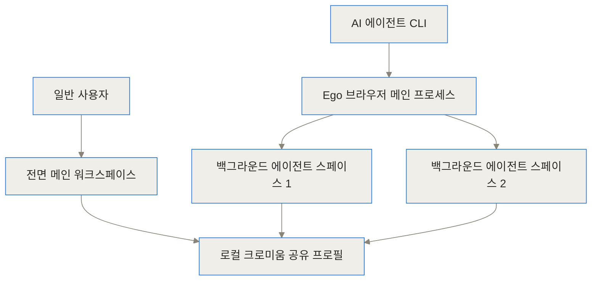
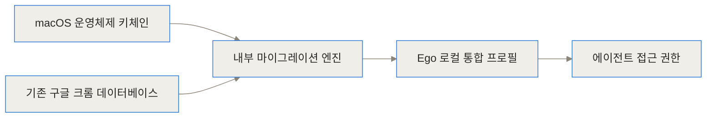
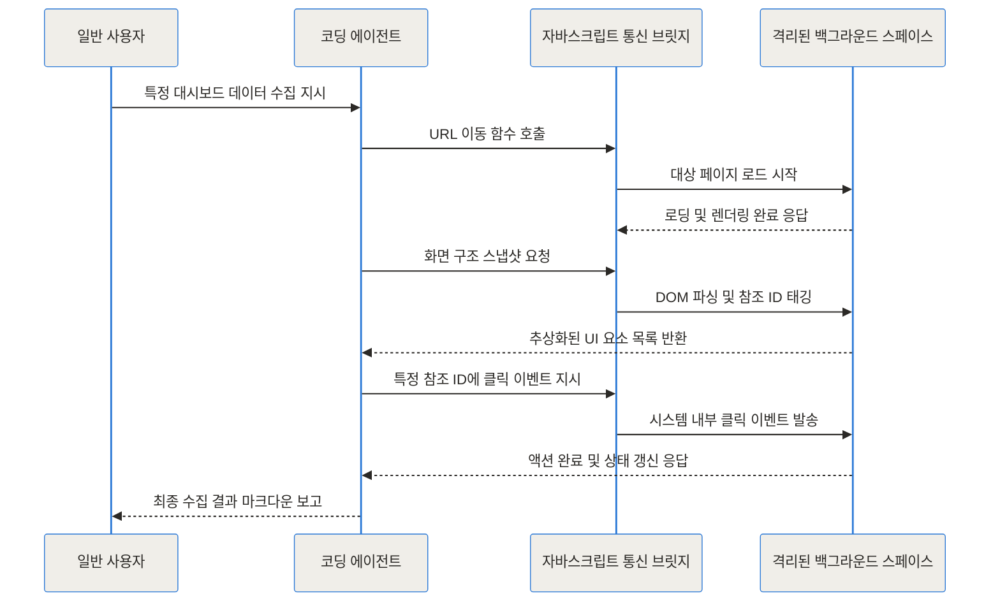
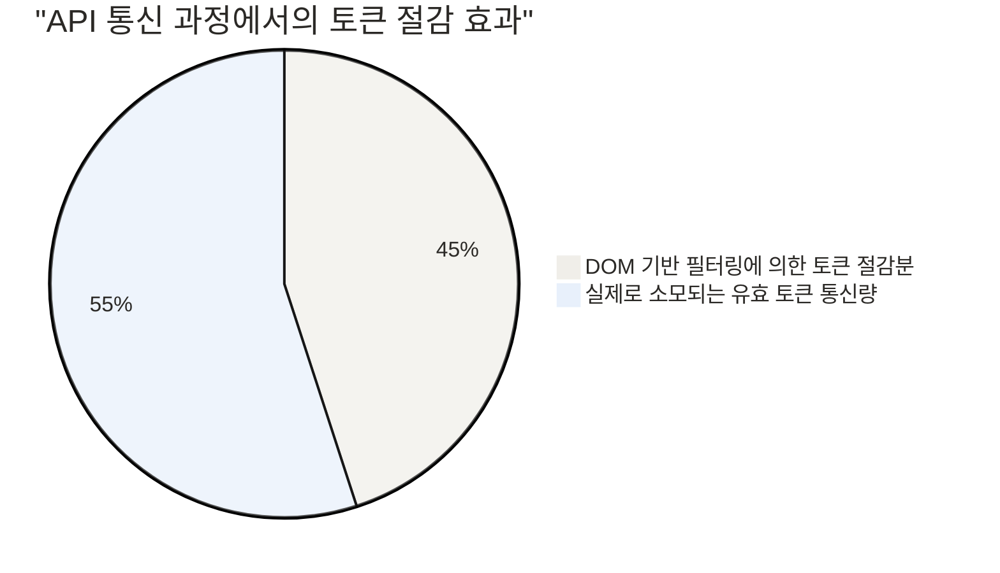
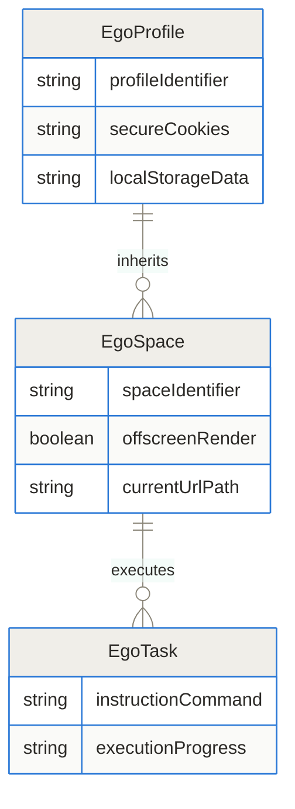
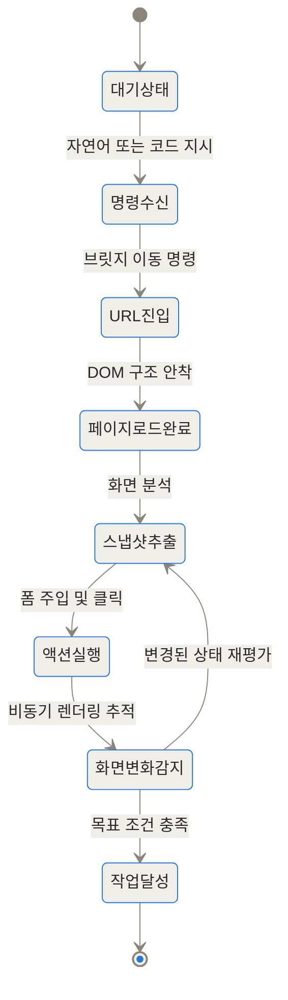
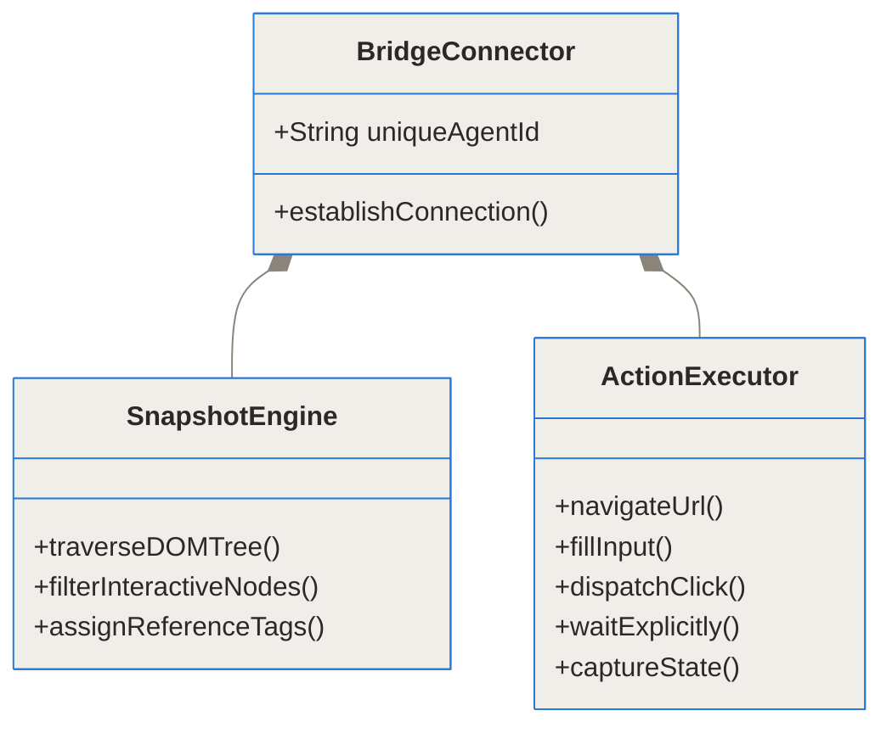

TL;DR
- Ego-lite는 사람과 AI 에이전트가 동일한 브라우저를 공유하면서도 서로 방해받지 않고 완벽하게 병렬로 작업할 수 있도록 처음부터 새롭게 설계된 도구입니다.
- 설치 직후 기존 크롬의 쿠키와 세션을 클릭 한 번으로 가져와, 캡차나 2단계 인증의 장벽 없이 AI가 곧바로 인증이 필요한 웹 작업을 수행하게 합니다.
- 마우스 커서를 빼앗거나 탭을 강제로 전환하지 않고 백그라운드의 격리된 공간에서 작업을 처리하므로, 사용자의 업무 집중력을 완벽하게 보호하고 API 토큰 비용을 크게 줄여줍니다.

## 배경과 문제 정의: 화면 탈취와 인증의 높은 벽
최근 코딩 에이전트와 웹 자동화 기술이 급격히 발전하면서, 개발자와 기획자들은 단순 반복 작업을 AI에게 위임하려는 시도를 계속하고 있습니다. 하지만 기존의 브라우저 자동화 도구들을 실무에 도입해보면 예상치 못한 커다란 장벽 두 가지에 부딪히게 됩니다. 바로 지독한 화면 탈취와 로그인 상태의 단절입니다.

기존의 브라우저 사용 프레임워크나 범용 에이전트 환경은 AI를 위해 완전히 별개의 새로운 브라우저 인스턴스를 메모리에 띄우는 방식을 사용합니다. 이 인스턴스는 아무런 방문 기록이나 쿠키가 없는 이른바 완벽한 백지 상태입니다. 만약 당신이 에이전트에게 비공개 사내 대시보드나 개인 깃허브 레포지토리의 이슈를 읽고 정리하라고 지시하면 어떤 일이 벌어질까요? 에이전트는 즉시 로그인 화면이라는 거대한 벽에 막히게 됩니다. 2026년 현재 대다수의 웹 서비스는 단순한 아이디와 비밀번호 입력을 넘어 악의적인 접근을 막기 위한 봇 방어 챌린지나 매우 복잡한 2단계 인증을 강제합니다. 스스로 스마트폰을 열어 인증 번호를 확인할 수 없는 에이전트가 이를 통과하는 것은 거의 불가능에 가깝습니다. 결국 개발자가 일일이 수동으로 개입하여 QR 코드를 스캔하거나 인증 코드를 터미널에 넘겨주어야만 겨우 작업이 시작될 수 있습니다.

게다가 이 과정에서 사이트의 봇 탐지 알고리즘을 우회하기 위해 백그라운드 모드가 아닌 실제 창을 띄우는 방식을 사용하면 더 치명적인 문제가 발생합니다. 에이전트가 마우스 커서를 이동시키고 클릭을 발생시킬 때마다 운영체제의 포커스가 에이전트의 브라우저 창으로 강제로 넘어갑니다. 사용자가 중요한 이메일을 작성하거나 코딩에 깊게 몰입하고 있던 중에 갑자기 창이 전환되며 키보드 입력이 에이전트의 브라우저로 들어가는 끔찍한 경험을 하게 됩니다. 에이전트가 일하는 동안 인간은 키보드와 마우스에서 손을 떼고 그저 멍하니 화면을 바라보며 기다려야만 했습니다. 에이전트를 도입한 근본적인 이유는 인간의 아까운 시간을 아끼기 위함인데, 정작 에이전트가 구동되는 동안 인간의 시간을 인질로 잡는 심각한 모순이 발생한 것입니다.

## 개념 쉽게 이해하기: 내 컴퓨터를 함께 쓰는 조용한 비서
이러한 고통스러운 문제를 해결하기 위해 등장한 Ego-lite의 접근 방식은 매우 명확하고 실용적입니다. 바로 에이전트와 인간이 두 개의 서로 다른 브라우저를 띄워두고 싸울 것이 아니라, 하나의 브라우저를 완벽한 로그인 상태로 함께 공유하면서 쓰게 만들자는 아이디어입니다.

이 구조는 마치 한 사무실에서 내 바로 옆자리에 앉아 내 업무를 돕는 유능한 비서와 같습니다. 이 비서는 내 컴퓨터의 사내망 접근 권한과 이미 로그인된 계정을 그대로 공유받아 사용합니다. 하지만 비서는 결코 내 모니터를 가리거나 내 키보드를 빼앗아가지 않습니다. 자신만의 보이지 않는 가상의 공간에서 내가 텍스트로 지시한 작업을 묵묵하고 빠르게 수행합니다. 나는 내 주 화면에서 기획서를 작성하거나 코딩을 계속 이어가고, 비서는 백그라운드에서 수십 개의 복잡한 API 문서를 읽고 요약본을 만들어옵니다.

Ego-lite는 구글 크롬과 동일한 크로미움 엔진 기반으로 제작되어 일반적인 웹 서핑에서 완벽하게 동일한 외관과 성능을 제공합니다. 하지만 내부적으로는 인간이 직접 보고 상호작용하는 메인 워크스페이스와 AI 에이전트 전용의 논리적 격리 공간인 에이전트 스페이스를 기술적으로 분리해 냅니다. 에이전트가 새 탭을 수십 개 열고 수많은 페이지를 넘나들어도 사용자의 메인 화면에는 단 하나의 탭도 나타나거나 깜빡이지 않습니다. 그럼에도 불구하고 이 둘은 내부적으로 정확히 같은 네트워크 스택과 세션을 공유합니다. 이것이 바로 그 어떤 복잡한 환경 설정이나 토큰 비용의 낭비 없이 에이전트가 즉각적으로 현업 실무에 투입될 수 있게 만드는 가장 중요한 원리입니다.

## 작동 원리 심층 분석 (Under the Hood)
이 놀랍도록 매끄러운 도구가 어떻게 화면 탈취 현상 없이 로그인 상태를 실시간으로 공유할 수 있는지, 그 기술적 구조와 데이터 흐름을 여러 측면에서 하나씩 깊이 파헤쳐 보겠습니다.

### 1. 듀얼 워크스페이스 아키텍처
Ego-lite의 렌더링 프로세스는 사용자 영역과 에이전트 영역으로 나뉘어 독립적으로 동작합니다. 크로미움이 자랑하는 다중 프로세스 아키텍처를 극대화하여 활용한 구조입니다.



위 다이어그램에서 명확히 알 수 있듯이, 사용자가 눈으로 보고 조작하는 전면 워크스페이스와 에이전트가 내부적으로 조작하는 스페이스 1, 스페이스 2는 시각적 렌더링 관점에서 철저히 분리되어 있습니다. 에이전트 스페이스는 모니터 화면의 프레임 버퍼에 픽셀을 그리지 않는 오프스크린 렌더러를 사용합니다. 따라서 에이전트가 특정 DOM 요소에 클릭 이벤트를 강제로 발생시켜도 운영체제 레벨의 마우스 커서가 물리적으로 이동하지 않습니다. 모든 것은 브라우저 엔진 내부의 합성 이벤트로 안전하게 처리되므로, 사용자가 타이핑 중인 입력창의 포커스를 잃어버리는 포커스 스틸링 현상이 원천적으로 차단됩니다.

### 2. 세션 마이그레이션과 상태 공유의 원리
에이전트가 인증의 장벽을 넘을 수 있도록, 초기 설치 시 Ego-lite는 매우 영리하고 사용자 친화적인 접근을 취합니다. 복잡한 환경 변수를 설정하거나 인증 토큰을 수동으로 복사해 넣는 대신, 사용자가 매일 사용하던 구글 크롬의 데이터를 그대로 안전하게 이식해 옵니다.



이 데이터 마이그레이션 과정은 전적으로 로컬 기기 내에서만 폐쇄적으로 이루어집니다. 운영체제의 정상적인 보안 권한 승인을 거쳐 기존 크롬의 SQLite 데이터베이스를 복호화하고, 이를 Ego-lite의 고유 프로필 폴더로 안전하게 이식합니다. 결과적으로 에이전트는 사용자와 완벽하게 동일한 브라우저 지문과 세션 쿠키, 그리고 로컬 스토리지 데이터를 획득하게 됩니다. X.com(구 트위터)이나 깃허브, 심지어 접근이 까다로운 사내 인트라넷 보안 페이지에 접속할 때조차 추가적인 로그인 창 없이 이미 사용자가 로그인해 둔 상태 그대로 화면을 맞이하게 됩니다.

### 3. 스킬 브릿지와 상호작용의 흐름
에이전트가 실제 브라우저를 조작하기 위해서는 양방향으로 소통할 수 있는 튼튼한 다리가 필요합니다. 이를 위해 제공되는 것이 바로 자바스크립트 기반의 브릿지인 스킬 패키지입니다.



이러한 상호작용 흐름은 철저하게 자바스크립트 함수 호출 기반으로 동작합니다. 에이전트는 사람처럼 시각적인 픽셀을 분석하여 마우스를 옮기는 대신, 브라우저가 관리하는 DOM 노드 구조에 직접적으로 접근하여 가장 오류가 적고 빠른 방법으로 이벤트를 발생시키고 데이터를 읽어옵니다.

### 4. 시각적 인지 대신 의미론적 스냅샷 활용
기존의 유행하던 웹 자동화 에이전트들은 주로 비전 언어 모델을 활용했습니다. 렌더링된 화면 전체를 무거운 이미지 파일로 캡처하여 원격 API로 전송한 뒤, 인공지능 모델에게 특정 버튼의 X와 Y 픽셀 좌표를 추론하게 하는 방식입니다. 이는 필연적으로 막대한 네트워크 대역폭과 비싼 토큰 비용, 그리고 뼈아픈 지연 시간을 발생시킵니다.

Ego-lite는 이 비효율을 의미론적 스냅샷 메커니즘으로 말끔하게 해결합니다. 에이전트가 현재 페이지의 상태를 인지해야 할 때, 통신 브릿지는 화면을 이미지로 찍거나 방대한 전체 HTML 문자열을 무식하게 던져주지 않습니다. 대신 브라우저의 DOM 트리를 순회하며 레이아웃을 위한 껍데기 태그와 숨겨진 요소들을 모두 쳐내고, 상호작용이 가능한 버튼, 텍스트 입력창, 링크 요소들만 정교하게 추려냅니다.



추려낸 요소들에는 `@1`, `@2`와 같은 짧고 직관적인 참조 번호를 부여하여 극도로 압축된 텍스트 목록으로 변환합니다. 에이전트는 이 텍스트로 된 지도만 보고도 `fill('@1', 'AI 브라우저 검색')`이라는 함수형 명령을 즉각적이고 정확하게 내릴 수 있습니다. 이러한 코드 기반 접근 덕분에 불필요한 이미지 분석 시간이 사라져 전체 작업 속도가 눈에 띄게 빨라지며, API 호출 비용은 기존 대비 최소 40퍼센트에서 최대 60퍼센트까지 극적으로 절감됩니다.

### 5. 데이터와 작업의 관계 모델
시스템 내부적으로 브라우저의 사용자 프로필과 에이전트가 파생시키는 스페이스 작업들은 다음과 같은 구조적 관계를 형성합니다.



이 다이어그램이 보여주듯, 단 하나의 통합된 프로필 데이터를 기반으로 무수히 많은 논리적 스페이스가 동시에 파생될 수 있습니다. 여러 명의 AI 에이전트가 각자의 스페이스에서 서로 다른 도메인의 작업을 수십 개 동시에 실행하더라도, 근간이 되는 로그인 상태와 세션 정보는 흔들림 없이 동일하게 유지되고 공유됩니다.

### 6. 내부 상태 전이 메커니즘
에이전트가 백그라운드 스페이스 내에서 복잡한 임무를 수행할 때, 각 단계는 엄격한 상태 머신에 의해 관리됩니다.



특히 액션 이후 화면의 미세한 변화를 감지하고 곧바로 스냅샷 추출 상태로 되돌아가는 재평가 루프가 매우 중요합니다. 최신 웹사이트들은 페이지 전체를 새로고침하지 않고 필요한 부분만 비동기적으로 업데이트하는 단일 페이지 애플리케이션 구조가 대부분입니다. 이러한 재평가 사이클 덕분에 로딩 스피너가 돌고 있거나 팝업 창이 늦게 뜨는 환경에서도 자동화 스크립트가 깨지지 않고 끝까지 목표를 달성할 수 있습니다.

### 7. 브라우저 스킬 컴포넌트 구조
에이전트가 가져다 쓰는 도구들의 내부 클래스 구조는 확장성과 명확성을 고려하여 설계되었습니다.



가장 자주 쓰이는 5가지 핵심 자바스크립트 인터페이스가 외부에 노출되며, 개발자는 복잡한 셀레니움 문법을 배울 필요 없이 이 간결한 인터페이스만으로도 거의 모든 종류의 웹 조작을 에이전트에게 위임할 수 있습니다.

## 구현 및 사용 디테일: 어떻게 설치하고 실행하는가
현재 이 혁신적인 도구는 macOS 운영체제(Apple Silicon 및 Intel 아키텍처 모두 포함)를 우선적으로 완벽하게 지원하고 있습니다.

**1. 애플리케이션 본체 설치**
먼저 공식 깃허브 저장소나 지정된 배포 채널에서 자신의 아키텍처에 맞는 DMG 디스크 이미지를 다운로드하여 시스템에 설치합니다. 앱을 처음 실행하면 텅 빈 화면 대신 기존 크롬 데이터 마이그레이션 여부를 묻는 매우 중요한 온보딩 팝업이 나타납니다. 여기서 승인을 선택하면 기존의 수많은 검색 기록과 소중한 쿠키, 활성화된 확장 프로그램 환경이 단 몇 초 만에 고스란히 복제됩니다.

**2. 에이전트 환경에 스킬 주입**
Node.js 패키지 매니저가 설치된 터미널을 열고 다음의 단순한 명령어 한 줄을 입력합니다.
`npx skills add citrolabs/ego-lite`
이 자동화된 스크립트는 시스템에 이미 설치되어 있는 여러 코딩 에이전트 도구들의 디렉토리를 스캔하여, 브라우저와 통신할 수 있는 브릿지 모듈을 알맞은 위치에 정확히 설치해 줍니다.

**3. 터미널을 통한 첫 번째 임무 하달**
설정이 끝났다면 평소 쓰던 터미널 기반 에이전트를 열고 자연어로 평범하게 지시를 내리기만 하면 모든 준비가 끝납니다.
`/ego-browser 깃허브 트렌딩 페이지에 들어가서 이번 주 가장 별을 많이 받은 자바스크립트 프로젝트 5개를 요약해 줘.`
에이전트는 백그라운드에 새로운 스페이스를 조용히 띄우고, 빠르고 정확하게 데이터를 추출하여 당신의 터미널 화면에 깔끔한 보고서를 출력해 낼 것입니다.

<br>

| 노출되는 주요 도구 | 기술적 동작 원리 및 세부 설명 | 실제 에이전트 활용 예시 |
| --- | --- | --- |
| `navigate` | 주어진 문자열 URL로 이동 요청을 보내고, DOM 트리가 완전히 구성되어 네트워크 유휴 상태가 될 때까지 안전하게 대기합니다. | 매일 확인해야 하는 외부 트래픽 분석 대시보드나 경쟁사 기사 페이지로 진입할 때 호출 |
| `capture` | 현재 렌더링된 뷰포트 내의 유효한 상호작용 요소를 추출하여 텍스트 기반의 의미론적 스냅샷으로 가볍게 변환합니다. | 복잡한 화면 내에 어떤 클릭 가능한 버튼이나 입력 폼이 위치해 있는지 컨텍스트를 파악할 때 호출 |
| `click` | 대상 요소에 부여된 참조 태그를 바탕으로, 운영체제의 실제 커서 이동 없이 엔진 내부적으로 완벽한 합성 마우스 이벤트를 발생시킵니다. | 회원가입 과정의 약관 동의 체크박스를 누르거나 숨겨진 드롭다운 네비게이션 메뉴를 열 때 호출 |
| `fill` | 지정된 텍스트 필드나 텍스트 에어리어에 문자열을 주입하고, 리액트나 뷰와 같은 모던 프레임워크가 상태 변화를 인지하도록 연쇄 이벤트를 트리거합니다. | 복잡한 사내 시스템의 검색창에 질의어를 입력하거나, 정형화된 데이터를 폼에 차례대로 채워 넣을 때 호출 |
| `wait` | 네트워크 비동기 요청이나 무거운 CSS 애니메이션이 끝날 때까지 스크립트 실행을 명시적으로 특정 밀리초(ms) 동안 중지합니다. | 동적 로딩과 화면 전환이 잦아 스냅샷만으로는 요소 렌더링을 확신하기 어려운 무거운 페이지를 조작할 때 호출 |

<br>

## 실전 활용 시나리오: 현업에서는 어떻게 쓰일까
이러한 강력한 백그라운드 병렬 처리 구조는 실무 개발자와 기획자의 업무 파이프라인에서 엄청난 양의 시간 단축을 이끌어냅니다.

### 시나리오 1: 보안 인증이 필수적인 내부 대시보드 데이터 수집
마케팅이나 전략 기획팀에서 최신 유입률 지표나 경쟁사 모니터링을 위해 고가의 유료 분석 툴이나 VPN 접근이 필요한 비공개 대시보드에 접근해야 할 때가 많습니다. 기존의 스크래핑 방식으로는 헤드리스 브라우저에 임시 API 키를 발급받아 먹이거나 까다로운 OAuth 연동 스크립트를 짜야만 했습니다. 하지만 이 환경에서는 이미 사용자가 메인 워크스페이스에서 2단계 인증까지 마치고 툴에 로그인되어 있습니다. 사용자는 터미널에 대고 그저 "오늘자 마케팅 캠페인 A와 B의 전환율 데이터를 표 형식으로 깔끔하게 뽑아줘"라고 자연어로 지시하기만 하면 됩니다. 에이전트가 백그라운드에서 복잡한 차트를 긁어오는 동안, 당신은 쾌적하게 엑셀이나 메신저 작업을 이어갈 수 있습니다.

### 시나리오 2: 개발 작업 중 대량의 외부 API 문서 분석 및 합성
새로운 결제 모듈이나 복잡한 클라우드 아키텍처를 연동할 때, 수십 개의 탭을 열어두고 공식 문서를 일일이 뒤적이는 것은 개발자에게 엄청난 인지적 피로를 줍니다. 이제 에이전트에게 "결제 연동에 필요한 15개의 하위 문서를 전부 다 읽고, 각 엔드포인트 URL과 파라미터 구조, 에러 코드만 하나의 마크다운 파일로 합성해서 정리해 줘"라고 지시합니다. 에이전트는 즉시 15개의 백그라운드 스페이스를 병렬로 열고 놀라운 속도로 문서들을 스크래핑한 뒤, 잘 정리된 단일 문서를 제공합니다.

### 시나리오 3: 로컬 파일에 기반한 대량의 지루한 웹 폼 입력 작업
수십 명의 고객 정보가 담긴 CSV 파일을 읽어 사내 CRM 시스템에 일일이 입력하고 등록 버튼을 눌러야 하는 지루한 작업이 주어졌다고 가정해 보겠습니다. 매크로 프로그램을 짜기에는 시간이 아깝고 직접 손으로 하기에는 너무 고통스럽습니다. 에이전트에게 로컬의 CSV 파일 경로를 알려주고, "이 파일의 내용을 읽어서 CRM 페이지의 폼에 순서대로 기입하고 등록해 줘"라고 지시합니다. 에이전트는 백그라운드 공간에서 신속하게 폼을 채우고 다음 페이지로 넘기는 작업을 반복합니다. 마우스가 강제로 움직이지 않으므로 사용자는 평화롭게 넷플릭스를 보거나 커피를 마시며 다른 코드를 짤 수 있습니다.

## 벤치마크 및 비교: 기존 방식 대비 압도적인 효율성
Ego-lite의 성능적 우위는 단순히 창이 보이지 않는다는 심리적 요인을 넘어섭니다. 무거운 화면 스크린샷 픽셀 데이터를 네트워크 밖으로 전송하지 않는다는 기술적 특징과, 매번 텅 빈 프로필을 구축하고 쿠키를 굽는 웜업 시간이 통째로 증발한다는 점에서 압도적인 수치 차이를 만들어냅니다.

```chartjs
{"type":"bar","data":{"labels":["비전 기반 화면 자동화 도구 (스크린샷 전송)","Ego-lite (DOM 요소 의미론적 필터링)"],"datasets":[{"label":"웹 자동화 단일 작업당 평균 API 토큰 소모 비율 (%)","data":[100,50],"backgroundColor":["#e74c3c","#3498db"]}]},"options":{"responsive":true,"plugins":{"title":{"display":true,"text":"대규모 모델 API 토큰 소모량 비교 (막대가 낮을수록 비용 절감됨)"}}}}
```

```chartjs
{"type":"bar","data":{"labels":["초기 사이트 인증 및 환경 설정에 버려지는 시간","에이전트 조작으로 인한 사용자 업무 강제 중단 시간","실제 유효한 에이전트 구동 및 로직 처리 시간"],"datasets":[{"label":"일반적인 레거시 자동화 프레임워크","data":[20,15,10],"backgroundColor":"#95a5a6"},{"label":"Ego-lite 상태 공유 및 완벽 병렬 처리","data":[1,0,4],"backgroundColor":"#2ecc71"}]},"options":{"responsive":true,"plugins":{"title":{"display":true,"text":"웹 에이전트 작업 파이프라인 단계별 소요 시간 비교 (단위: 분)"}}}}
```

<br>

| 핵심 비교 항목 | 레거시 웹 브라우저 자동화 도구 | Ego-lite 병렬 브라우저 |
| --- | --- | --- |
| **운영 작업 환경** | 에이전트 전용의 별도 독립된 크로미움 프로세스 강제 구동 | 일반 사용자와 동일한 메인 브라우저 내 논리적 백그라운드 공간 공유 |
| **로그인 및 세션** | 매 구동 시 새로 로그인하거나 복잡한 세션 덤프 스크립트 작성 필요 | 사용자가 유지 중인 크롬 세션을 클릭 한 번으로 자동 복사 및 즉시 반영 |
| **사용자 화면 간섭** | 마우스 커서의 물리적 이동 및 활성 창 전환으로 인한 화면 탈취 발생 | 백그라운드 오프스크린 렌더링 파이프라인으로 윈도우 화면 탈취 원천 차단 |
| **API 통신 효율성** | 화면 전체를 스크린샷으로 찍어 VLM 모델에 보내므로 통신 낭비 심각 | 필요한 DOM 스냅샷 필터링 기반 텍스트 추출로 비용 40퍼센트 이상 극적 절감 |
| **지원 운영체제** | 윈도우, 맥, 리눅스 등 데스크톱 및 서버 환경 범용 지원 | 현재는 인터랙션이 최적화된 macOS 기기 전용으로 선행 배포 (타 OS는 예정) |

<br>

## 솔직한 평가: 한계와 시스템적 트레이드오프
Ego-lite는 웹 자동화의 오래된 패러다임을 바꿀 훌륭한 대안이지만, 실무에 본격적으로 도입하기 전 반드시 고려해야 할 몇 가지 기술적 트레이드오프와 뚜렷한 한계점들도 존재합니다.

첫째, 현재 겪고 있는 **운영체제 호환성의 한계**입니다. 고도화된 로컬 마이그레이션 엔진과 백그라운드 렌더링 최적화를 위해 현재는 macOS 전용으로만 공식 릴리즈되어 있습니다. 이는 윈도우(Windows) 데스크톱이나 리눅스(Linux) 환경에서 개발을 진행하는 방대한 규모의 사용층에게는 당장 접근하기 어려운 아쉬운 요인입니다.

둘째, **공유된 세션이 가지는 보안적 양면성**입니다. 내 세션을 완벽하게 공유하기 때문에 로그인 방어막을 뚫기는 몹시 편안하지만, 반대로 생각하면 이 에이전트가 곧 '나의 막강한 권한'을 100퍼센트 위임받아 활동한다는 무거운 뜻이기도 합니다. 만약 AWS 콘솔이나 사내 결제 시스템처럼 삭제나 수정 등 치명적인 권한이 존재하는 페이지에서, 언어 모델의 일시적인 환각 현상으로 인해 에이전트가 돌발적으로 엉뚱한 삭제 버튼을 누를 위험은 언제나 존재합니다. 따라서 시스템 도입 초기에는 신뢰도가 쌓이기 전까지 철저하게 데이터 읽기 위주의 스크래핑이나 안전이 보장된 입력 폼에만 에이전트 권한을 허락하는 것이 현명한 접근입니다.

셋째, 기존 시스템을 완전히 대체하기에는 **새로운 학습 곡선**이 필요하다는 점입니다. 단순한 클릭 몇 번으로 끝나는 일반 소프트웨어와 달리, 이 도구를 100퍼센트 완벽하게 다루기 위해서는 터미널 환경에 익숙해야 합니다. Node.js 생태계를 이해하고 npx 명령어를 통해 스킬 패키지를 올바르게 연결하며, Claude Code와 같은 외부 CLI 에이전트의 내부 구조를 어느 정도 파악하고 있어야만 다양한 트러블슈팅에 유연하게 대처할 수 있습니다.

## 마무리: 사람과 AI의 진정한 웹 협업을 향해
Ego-lite는 'AI가 현대의 복잡한 웹 환경에서 인간을 돕는 올바른 방식은 무엇인가?'에 대한 근본적인 질문을 던지고 매우 명쾌하고 훌륭한 해답을 제시했습니다. AI가 우리를 돕기 위해 굳이 우리의 모니터를 인질로 잡고 방해할 이유가 없으며, 보안 문자와 씨름하며 낭비할 시간도 없다는 것을 실용적인 소프트웨어로 완벽하게 증명해 냈습니다.

초기 셋업 과정에서 클릭 단 한 번으로 내가 쌓아온 풍부한 인증 컨텍스트를 에이전트에게 흔쾌히 물려주고, 내 옆의 숨겨진 보이지 않는 공간에서 소리 없이 거대한 양의 문서를 읽고 정리해 내는 이 새로운 컴퓨팅 경험은, 향후 개인용 PC와 브라우저 환경이 진화해야 할 매우 뚜렷한 이정표를 보여주고 있습니다. 만약 당신이 지금 맥북을 사용하고 있고 매일 반복되는 웹 브라우저 작업에 지쳐 있다면, 망설이지 말고 터미널을 열어 에이전트에게 당신의 브라우저를, 당신의 흐름을 잃지 않는 선에서 나누어 주시길 바랍니다. 분명 새로운 차원의 생산성을 경험하게 될 것입니다.

<!-- primary-sources:start -->
## 원문과 버전 확인

- [공식 GitHub 저장소](https://github.com/citrolabs/ego-lite)
<!-- primary-sources:end -->

<!-- internal-links:start -->
## 함께 읽으면 이해가 이어지는 글

- [stablyai/orca: 멀티 AI 에이전트를 격리된 환경에서 병렬 실행하는 ADE 개발 플랫폼]() — stablyai/orca는 Claude Code, OpenAI Codex, Cursor CLI 등 여러 AI 코딩 에이전트를 단일 프로젝트 내에서 충돌 없이 병렬로 제어하는 오픈소스 ADE(Agent Development…
- [claude-plugins-official을 팀에 깔아도 될까: LSP 검증과 실행 권한의 경계]() — claude-plugins-official이 필요한 도구를 불러오고 LSP, 브라우저 검증을 연결하는 방식을 살펴본 뒤, 지연, 권한, 변경 범위, 벤더 종속성을 기준으로 팀 도입법을 정리합니다.
- [여러 AI 에이전트 로그를 한 화면에서 봐도 될까? Kibitz의 출처, 요약 점검]() — 여러 터미널 세션을 모으고 로그를 서사형 상태로 요약한다는 Kibitz의 장점과, 이름이 같은 저장소가 섞인 원문에서 먼저 확인할 출처, 기능 경계를 짚습니다.
<!-- internal-links:end -->

## 자주 묻는 질문 (FAQ)

### 대형 모델을 사용할 때 토큰 비용을 얼마나 절감할 수 있나요?

화면 전체를 이미지 스크린샷으로 찍어 분석하는 비전(Vision) 기반 모델과 비교했을 때 막대한 토큰을 아낄 수 있습니다. 브라우저 내부의 자바스크립트 엔진과 통신하여 현재 화면 중 클릭이나 입력이 가능한 돔(DOM) 요소만 짧은 텍스트 기호로 치환해 스냅샷을 만들기 때문입니다. 공식 벤치마크에 따르면 한 번의 작업 사이클당 평균적으로 약 40퍼센트에서 60퍼센트가량의 API 통신 비용 절감 효과가 확인되고 있습니다.

### 내 민감한 구글 계정이나 쿠키 정보를 에이전트에게 맡겨도 해킹당할 위험은 없나요?

이 시스템은 클라우드 환경이 아닌 사용자 개인의 로컬 기기 내에서만 독립적으로 실행되는 자체 크로미움 기반 브라우저입니다. 최초 실행 시 복호화하여 가져온 모든 크롬 프로필과 쿠키, 북마크 데이터는 오직 사용자 기기의 로컬 저장소에만 암호화되어 남게 됩니다. 외부의 중앙 서버로 로그인 세션이 몰래 전송되지 않는 엄격한 프라이버시 중심 구조이므로 외부 유출 관점에서는 안전하다고 볼 수 있습니다.

### 회사의 윈도우 PC나 리눅스 개발 환경에서도 설치하여 사용할 수 있나요?

매우 아쉽게도 2026년 현재는 macOS 운영체제(Apple M시리즈 실리콘 및 Intel 프로세서 모두 포함) 환경 전용으로만 빌드되어 제공되고 있습니다. 개발팀의 공식 로드맵에 따르면 윈도우와 리눅스 버전 출시가 계획되어 있으나, 당장 실무에 적용하려면 맥 운영체제가 설치된 기기가 반드시 필요합니다.

### 작업 중 화면 탈취가 없다는 것은 정확히 어떤 내부 기술을 의미하는 건가요?

과거의 자동화 스크립트 도구들은 요소에 반응하기 위해 윈도우 커서를 물리적으로 움직이거나 시스템 포커스를 강제로 빼앗았습니다. 반면 이 브라우저는 시각적으로 픽셀을 렌더링하지 않는 백그라운드 전용 오프스크린 공간을 별도로 메모리에 생성합니다. 사용자가 이메일을 쓰는 동안 에이전트가 다른 페이지의 버튼을 누르더라도, 이는 브라우저 엔진 내부의 자바스크립트 합성 이벤트(Synthetic Event)로만 얌전하게 발송되므로 사용자 화면이 깜빡이거나 끊기지 않습니다.

### 이 브라우저와 연동하여 명령을 내릴 수 있는 AI 프로그램에는 어떤 것들이 있나요?

Node.js가 설치된 터미널 환경이라면 npx 패키지 관리자를 통해 매우 쉽게 통신 모듈을 설치할 수 있습니다. 현재 Model Context Protocol(MCP)이나 유사 스킬 주입을 지원하는 Claude Code, Codex, Cursor 등의 유명 에이전트들과 매끄럽게 호환됩니다. 또한 기본적으로 제공되는 navigate, click 같은 함수 인터페이스만 지켜준다면 직접 개발한 커스텀 로컬 에이전트와도 훌륭하게 연동할 수 있습니다.


## References
- [https://github.com/citrolabs/ego-lite](https://github.com/citrolabs/ego-lite)
