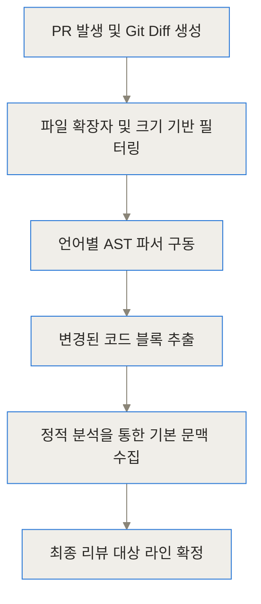
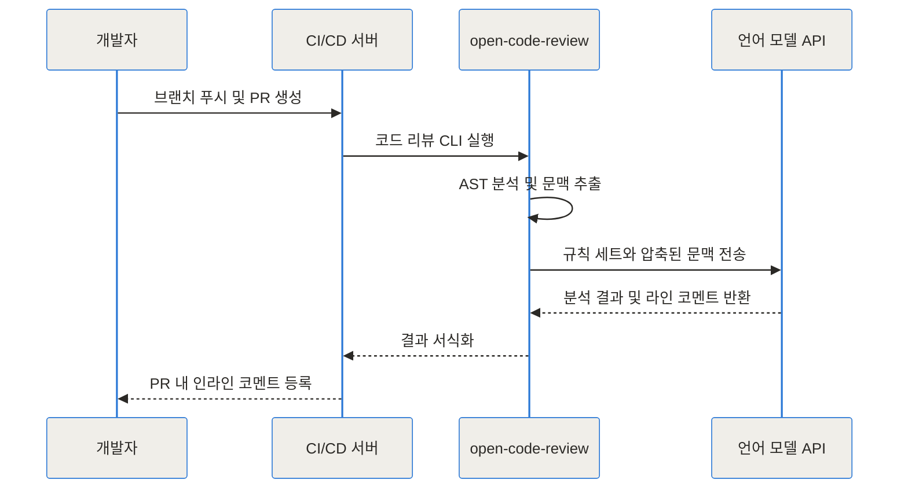
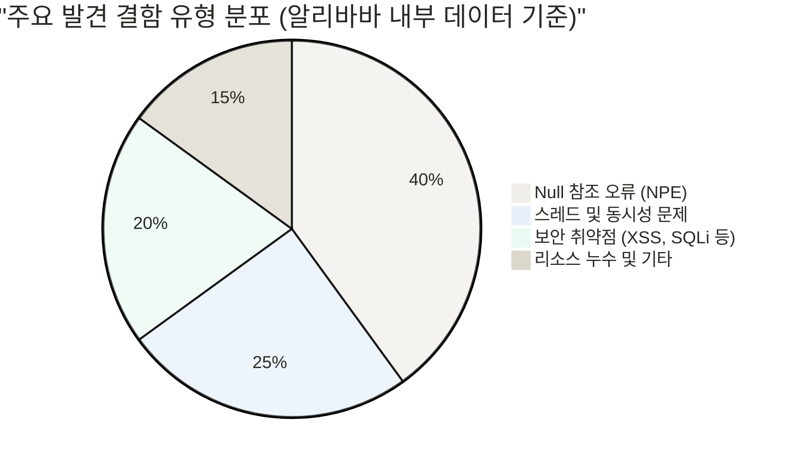
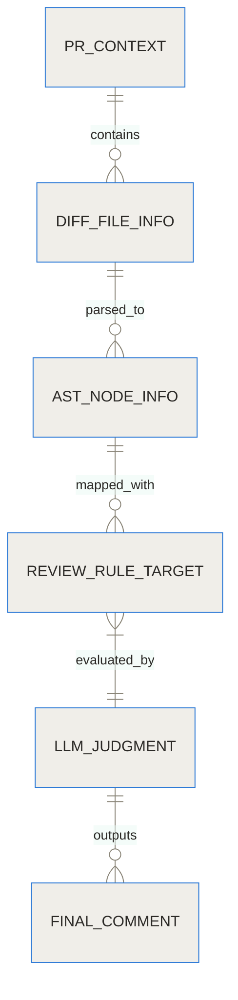
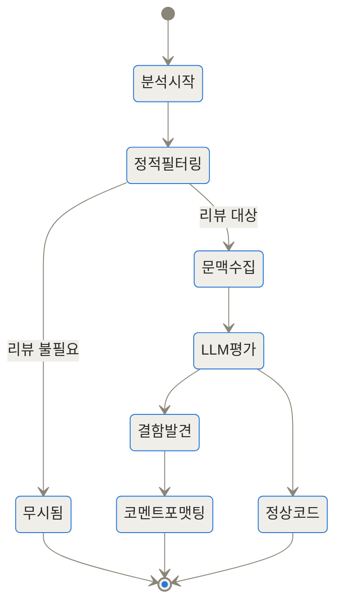
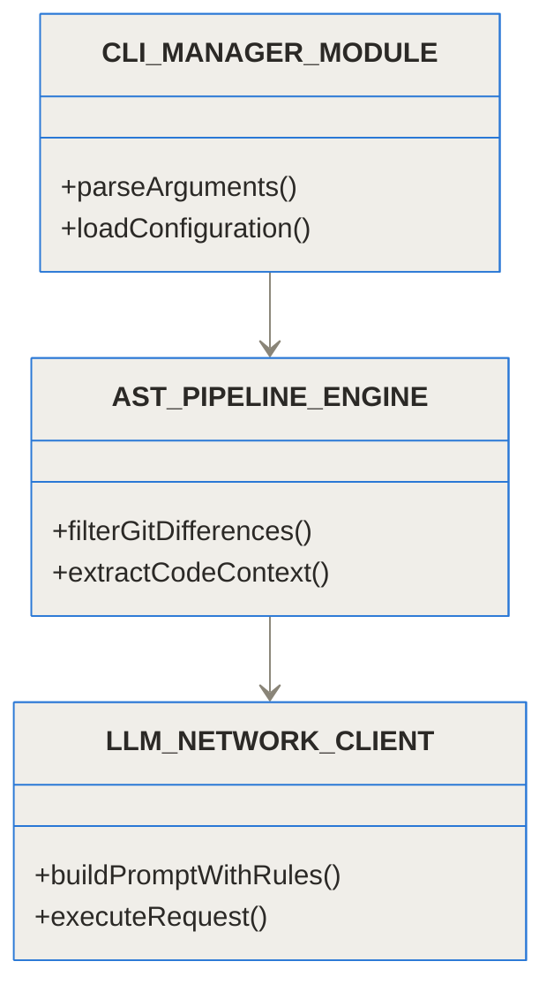

## 도입과 현실의 문제

최근 몇 년간 수많은 팀이 소프트웨어 개발 주기를 단축하기 위해 AI 코드 리뷰 도구를 도입했습니다. 하지만 현장의 반응은 엇갈립니다. 초기에는 코드를 읽어주는 AI가 신기하게 느껴지지만, 시간이 지날수록 피로감이 누적됩니다. AI가 남기는 "이 함수는 리팩토링을 고려해 보세요" 같은 모호한 코멘트, 변경 사항과 무관한 파일에서의 훈수, 그리고 눈덩이처럼 불어나는 LLM API 비용(토큰 사용량) 때문입니다.

이러한 상황에서 알리바바가 2년 동안 내부적으로 사용하며 2만 명 이상의 개발자를 지원하고 100만 개 이상의 코드 결함을 찾아낸 시스템을 오픈소스로 공개했습니다. 바로 [open-code-review](https://github.com/alibaba/open-code-review)입니다. 이 프로젝트는 기존의 단순한 프롬프트 래퍼(Prompt Wrapper) 방식에서 벗어나, 정밀한 구문 분석과 언어 모델을 결합한 하이브리드 접근법을 취하고 있습니다.

> **TL;DR (한 줄 요약)**
> 1. 전체 코드를 쏟아붓는 대신, 파이프라인이 변경된 라인과 문맥만 정확히 추출해 LLM에 전달합니다.
> 2. 이를 통해 기존 AI 리뷰 도구 대비 토큰 사용량을 5분의 1 수준으로 극적으로 절감합니다.
> 3. Null 참조, 스레드 안전성, SQL 인젝션 등 현업에서 가장 치명적인 결함을 잡아내는 미세 조정 규칙을 내장하고 있습니다.

이번 글에서는 open-code-review가 어떤 구조로 설계되었는지, 왜 이 도구가 다른 도구들보다 월등한 정확도를 보여주는지, 그리고 실제 현업 환경에 어떻게 통합할 수 있는지 아주 깊이 있게 파헤쳐 보겠습니다.

## 배경과 문제 정의: 기존 AI 코드 리뷰가 실패하는 이유

AI 코드 리뷰 도구가 실무에서 외면받는 구체적인 원인을 이해하려면, 대다수 도구가 작동하는 방식을 뜯어볼 필요가 있습니다.

### 1. 무분별한 문맥 전송과 토큰 폭발
기존의 봇들은 개발자가 Pull Request(PR)를 올리면 Git Diff(변경 내역) 전체를 복사하여 거대한 프롬프트를 만듭니다. "너는 시니어 개발자야. 다음 Diff를 보고 리뷰해 줘"라는 식입니다. 이 방식은 변경된 코드가 10줄이더라도, 주변 문맥을 파악하기 위해 수백 줄의 코드가 함께 전송됨을 의미합니다. 토큰 비용이 천문학적으로 치솟고, 응답 시간은 한없이 느려집니다.

### 2. 환각(Hallucination)과 오탐(False Positive)
LLM은 코드의 구조(AST, 추상 구문 트리)를 이해하는 것이 아니라 텍스트의 패턴을 유추합니다. 따라서 변수의 스코프, 외부 패키지의 의존성 등을 오해하기 쉽습니다. 멀쩡한 코드에 보안 취약점이 있다고 경고하거나, 존재하지 않는 라이브러리 함수를 추천하는 일이 빈번하게 발생합니다.

### 3. 라인 단위의 정밀도 부족
개발자가 가장 원하는 것은 "app.js의 42번째 줄에서 이 변수가 Null일 수 있습니다"라는 정확한 지적입니다. 그러나 단순 Diff를 읽은 LLM은 리뷰 코멘트를 PR의 최상단 요약에 뭉뚱그려 남기거나, 잘못된 라인 번호에 코멘트를 다는 경우가 많습니다.

open-code-review는 이러한 문제를 '하이브리드 아키텍처'라는 명확한 설계로 돌파했습니다.

## 개념 쉽게 이해하기: 하이브리드 아키텍처란?

이 시스템의 중심 아이디어를 일상적인 비유로 설명해 보겠습니다. 복잡한 법률 문서를 검토해야 하는 상황이라고 가정해 보죠.

기존 방식은 수습 변호사(LLM)에게 책상 가득 수만 장의 서류를 던져주고 "여기서 문제점 좀 찾아봐"라고 지시하는 것과 같습니다. 수습 변호사는 집중력을 잃고 엉뚱한 페이지에서 사소한 오탈자만 찾아낼 확률이 높습니다.

open-code-review의 **하이브리드 아키텍처**는 노련한 사무장(파이프라인)과 전문 변호사(LLM)가 협업하는 구조입니다.
1. **노련한 사무장(결정론적 파이프라인):** 전체 서류를 훑어보고, 내용이 변경된 조항(코드 라인)만 정확히 오려냅니다. 그리고 해당 조항을 이해하는 데 필요한 앞뒤 문맥(선언부, 종속성)만 딱 맞게 철하여 넘깁니다.
2. **전문 변호사(LLM 에이전트):** 잘 정리된 한두 장의 서류만 집중적으로 분석하여, 논리적 모순이나 법적 결함(버그)을 날카롭게 찾아냅니다.

이처럼 기계적으로 잘할 수 있는 일(검색, 구문 분석, 필터링)은 프로그램 로직이 처리하고, 고도의 추론이 필요한 일(문맥 기반 판단)만 AI에게 맡기는 것이 이 프로젝트의 철학입니다.

## 작동 원리 심층 (Under the Hood)

이제 내부로 깊이 들어가 시스템이 어떻게 코드를 분석하는지 단계별로 살펴보겠습니다.

### 1단계: 결정론적 파일 및 라인 선택 프로세스

코드가 커밋되면 시스템은 단순 정규식이 아니라 AST(Abstract Syntax Tree) 분석기를 가동합니다. 지원하는 10개 이상의 언어(Java, Go, Python 등)에 대해 구문 트리를 생성하고 변경된 노드를 식별합니다.



위 다이어그램에서 보듯, 테스트 코드나 자동 생성된 파일은 B 단계에서 일차적으로 걸러집니다. C 단계에서는 코드가 함수 선언부인지, 단순 주석 수정인지 구별하여 의미 없는 변경 사항은 LLM에 보내지 않습니다. 이것이 토큰을 극적으로 아끼는 첫 번째 관문입니다.

### 2단계: 문맥 추출과 프롬프트 조립

변경된 라인을 찾았다면, 해당 코드가 어떤 맥락에서 실행되는지 LLM에게 알려주어야 합니다. open-code-review의 문맥 추출 엔진은 다음을 수행합니다.

- **호출자/피호출자 식별:** 변경된 함수가 호출하는 다른 함수의 시그니처를 찾아냅니다.
- **클래스 상태:** 해당 함수가 속한 클래스의 멤버 변수를 수집합니다.

이러한 과정은 CI/CD 파이프라인 내에서 철저히 자동화되어 흐릅니다.



### 3단계: 미세 조정된 규칙 세트(Rule Set) 적용

LLM에게 "알아서 버그를 찾아라"라고 하지 않습니다. 알리바바의 방대한 데이터베이스를 바탕으로 실무에서 가장 자주 발생하는 치명적 결함 패턴을 규칙화하여 LLM의 주의를 집중시킵니다.

| 규칙 카테고리 | 대상 및 목적 | 적용 언어 예시 |
| :--- | :--- | :--- |
| **NPE (Null 참조)** | 객체 초기화 실패 및 예기치 않은 Null 반환 추적 | Java, Kotlin, TypeScript |
| **스레드 안전성** | 동시성 환경에서의 공유 자원 접근 및 락(Lock) 누락 방지 | Go, Java, C++ |
| **보안 취약점** | SQL 인젝션, XSS, 무결점 검증 없는 입력값 사용 추적 | Python, Go, Java |
| **리소스 누수** | 파일, 네트워크 소켓, 데이터베이스 커넥션의 미종료 확인 | C, C++, Go |

알리바바 내부에서 이 도구가 잡아낸 결함의 분포를 보면, 특정 규칙들이 얼마나 중요한 역할을 하는지 알 수 있습니다.



### 4단계: 리뷰 데이터 모델과 상태 전이

시스템 내부적으로는 분석 대상을 추적하기 위해 고도화된 데이터 모델을 유지합니다. 추출된 대상은 각각 하나의 상태를 가지며, 모든 과정이 기록됩니다.



상태 생명주기를 살펴보면, 하나의 코드 변경 사항이 코멘트가 되기까지 여러 번의 검증을 거침을 알 수 있습니다.



## 벤치마크 및 수치 비교: 얼마나 효율적인가?

가장 궁금한 부분은 역시 '비용과 성능'입니다. 전체 Diff를 모델에 통째로 던지는 기존의 일반적인 AI 코드 리뷰 봇과 open-code-review를 비교해 보았습니다.

```chartjs
{
  "type": "bar",
  "data": {
    "labels": ["전체 코드 기반 단순 AI 봇", "open-code-review 하이브리드"],
    "datasets": [
      {
        "label": "PR 1건당 평균 토큰 사용량",
        "data": [45000, 8500],
        "backgroundColor": "rgba(54, 162, 235, 0.6)"
      }
    ]
  },
  "options": {
    "responsive": true,
    "plugins": {
      "title": {
        "display": true,
        "text": "코드 리뷰 방식별 토큰 사용량 비교 (단위: 토큰)"
      }
    }
  }
}
```

위 차트에서 보듯, 파이프라인을 통한 정교한 필터링 덕분에 토큰 사용량이 5분의 1 이하로 줄어듭니다. 이는 곧 OpenAI나 Anthropic API를 사용할 때 비용이 80% 이상 절감된다는 것을 의미합니다.

| 비교 항목 | 기존 단순 AI 리뷰 봇 | open-code-review |
| :--- | :--- | :--- |
| **비용 (토큰 사용량)** | 매우 높음 (전체 Diff 전송) | 매우 낮음 (필수 문맥만 추출) |
| **리뷰 정확도** | 전반적인 구조 제안에 그침 | 라인 단위의 구체적 버그 지적 |
| **위치 지정 (Line Number)** | 부정확함 (오류 발생 잦음) | 정확함 (AST 파싱 기반 매핑) |
| **보안/규칙 집중도** | 모델 기본 지식에 의존 | 미세 조정된 특정 규칙 강제 적용 |

## 구현 및 사용 디테일: 시스템에 통합하기

이 강력한 도구를 실제 우리 팀 환경에 도입하는 방법은 생각보다 간단합니다. CLI 도구로 제공되므로 npm을 통해 전역으로 설치할 수 있습니다.

### 1. 설치 및 설정

Node.js 환경이 준비되어 있다면 아래 명령어로 설치합니다.

```bash
npm install -g @alibaba-group/open-code-review
```

설치 후에는 LLM API 연결 설정을 진행합니다. OpenAI뿐만 아니라 Anthropic(Claude), 혹은 OpenRouter를 통한 다양한 모델을 지원합니다.

```bash
# 설정 파일 디렉토리 생성
mkdir -p ~/.open-code-review

# OpenRouter 또는 OpenAI 호환 API 설정 예시
ocr config set llm.url "https://openrouter.ai/api/v1"
ocr config set llm.auth_token "YOUR_API_KEY"
ocr config set llm.model "claude-3-5-sonnet"
ocr config set llm.use_anthropic true
```

클래스나 모듈 간의 내부 동작을 이해하려면 CLI 구조를 엿볼 필요가 있습니다.



### 2. GitLab CI 파이프라인 연동 예시

CI 환경에서는 리뷰 프로세스를 자동화할 수 있습니다. 예를 들어, GitLab 파이프라인의 `.gitlab-ci.yml` 파일에 다음과 같은 단계를 추가할 수 있습니다.

```yaml
stages:
  - code_review

code-review-job:
  stage: code_review
  image: cimg/python:3.11-node
  rules:
    - if: '$CI_PIPELINE_SOURCE == "merge_request_event"'
  script:
    - npm install -g @alibaba-group/open-code-review
    - python3 -m pip install python-gitlab
    - ocr config set llm.auth_token "$API_KEY"
    - ocr run --pr $CI_MERGE_REQUEST_IID
```

이 스크립트는 PR이 열릴 때마다 open-code-review를 실행하여, 결함이 발견된 특정 코드 라인에 직접 코멘트를 남깁니다.

## 실전 활용 시나리오: 현업 트러블슈팅

구체적으로 이 도구가 어떻게 개발자를 구하는지 두 가지 시나리오를 살펴보겠습니다.

### 시나리오 1: 보이지 않는 NullPointerException(NPE) 방어
Java 백엔드 팀의 주니어 개발자가 사용자 정보를 조회하는 로직을 수정했습니다. 데이터베이스 조회 결과가 없을 경우 예외를 던지는 대신 `null`을 반환하도록 바꾸었는데, 이 값을 사용하는 상위 계층 코드에서는 `null` 체크를 누락했습니다.
기존의 정적 분석기(SonarQube 등)는 메서드 경계를 넘나드는 데이터 흐름을 추적하는 데 한계가 있어 이를 놓쳤습니다. 반면 open-code-review는 변경된 함수의 리턴 타입이 `null`을 포함할 수 있게 된 것을 파악하고, 호출자(Caller) 문맥을 수집해 LLM에 전달했습니다. LLM은 "호출부에서 NPE가 발생할 수 있으니 `Optional`을 사용하거나 널 체크를 추가하라"는 정확한 인라인 코멘트를 남겼습니다.

### 시나리오 2: 고루틴(Goroutine) 데이터 경쟁(Race Condition) 감지
Go 언어 프로젝트에서 전역 맵(Map) 자료구조에 여러 고루틴이 동시에 쓰기를 시도하는 코드가 PR로 올라왔습니다. 개발자는 로직의 결과물에 집중하느라 뮤텍스(Mutex) 락을 걸지 않았습니다.
open-code-review의 '스레드 안전성' 파이프라인은 동시성 키워드(`go func`)와 공유 상태 접근을 감지하고, 해당 문맥만 도려내어 LLM에 질의했습니다. 그 결과 "동시에 맵에 접근하면 패닉(Panic)이 발생할 수 있습니다. `sync.Mutex` 또는 `sync.Map`을 도입하십시오"라는 경고를 즉각 반환했습니다.

## 솔직한 평가: 한계와 트레이드오프

이 도구가 완벽한 은탄환은 아닙니다. 도입 전 다음과 같은 한계를 인지해야 합니다.

1. **초기 설정의 허들:** 단순한 웹 기반 PR 봇을 설치하는 것에 비해, 환경 변수를 세팅하고 CI 스크립트를 작성해야 하는 초기 엔지니어링 작업이 요구됩니다.
2. **LLM 성능에 종속적:** 아무리 파이프라인이 문맥을 잘 추출해도, 최종 판단은 연결된 LLM이 내립니다. 테스트 결과 Claude 3.5 Sonnet이나 GPT-4o 같은 고성능 모델에서는 훌륭한 결과를 내지만, 성능이 낮은 소형 오픈소스 모델을 연결할 경우 오탐률이 다소 상승할 수 있습니다.
3. **복잡한 비즈니스 로직의 이해 부족:** 시스템이 기술적 버그(NPE, 보안 등)를 잡는 데는 탁월하지만, "이 로직이 우리 회사의 환불 정책과 맞지 않는다" 같은 비즈니스 도메인 지식이 필요한 리뷰는 여전히 인간의 몫입니다.

## 마무리

알리바바의 open-code-review는 AI를 소프트웨어 공학에 접목할 때 우리가 나아가야 할 방향을 정확히 짚어줍니다. 무작정 AI에게 많은 데이터를 주고 기적을 바라는 대신, 컴퓨터 과학의 전통적인 무기(AST, 구문 분석)로 데이터를 정제한 뒤 AI의 추론 능력을 극대화하는 방식입니다.

토큰 비용 때문에 AI 코드 리뷰 도입을 망설였거나, 의미 없는 "LGTM" 코멘트를 쏟아내는 AI 봇에 지쳤다면, 지금 당장 팀의 CI/CD 파이프라인에 이 하이브리드 아키텍처를 이식해 보시길 권합니다. 2만 명의 개발자가 100만 번의 실패를 거듭하며 다듬어낸 노하우가, 여러분의 코드베이스를 한층 더 견고하게 지켜줄 것입니다.

## 자주 묻는 질문 (FAQ)

### 토큰 사용량을 구체적으로 얼마나 절감하나요?

기존 방식처럼 전체 PR 변경 사항을 통째로 LLM에 전송하는 대신, 결정론적 파이프라인이 변경된 라인과 필수 문맥(호출부, 선언부)만 정밀하게 추출합니다. 이를 통해 기존 도구 대비 약 5분의 1(20%) 수준으로 토큰 사용량과 API 비용을 극적으로 줄일 수 있습니다.

### 오픈소스 LLM이나 로컬 모델과도 연동할 수 있나요?

네, 가능합니다. OpenAI 호환 API 인터페이스를 완벽하게 지원하므로 vLLM이나 Ollama 같은 추론 서버를 통해 자체 호스팅하는 로컬 모델을 연결할 수 있습니다. 이는 기업 내부 코드가 외부 서버로 유출되는 것을 엄격히 방지해야 하는 환경에서 매우 유용합니다.

### 이 도구는 어떤 프로그래밍 언어를 지원하나요?

Java, TypeScript, Go, Python, C++, Kotlin, C 등 10개 이상의 주요 프로그래밍 언어를 깊이 있게 지원합니다. 특히 정규식이 아닌 구문 분석(AST)을 통해 코드를 이해하기 때문에, 지원되는 언어일수록 라인 단위 리뷰의 정확도가 기하급수적으로 높아집니다.

### GitHub이나 GitLab 같은 CI/CD 환경에 통합하기 쉬운가요?

매우 간편하게 통합할 수 있습니다. npm으로 설치 가능한 CLI 도구 형태를 띠고 있어 GitHub Actions나 GitLab CI 파이프라인의 하나의 단계(Step)로 간단히 추가하면 됩니다. 환경 변수를 통해 API 키와 모델 정보만 주입하면 자동화된 리뷰 봇으로 즉시 작동합니다.

### 기존의 정적 분석 도구(SonarQube 등)와 무엇이 다른가요?

정적 분석 도구는 미리 정의된 패턴만 기계적으로 찾아내므로 앞뒤 문맥을 파악하지 못해 오탐(False Positive)이 매우 많습니다. open-code-review는 정적 분석의 빠른 필터링 방식을 차용하되, 최종 판단을 LLM이 문맥을 기반으로 수행하여 훨씬 유연하고 인간과 가까운 정확한 리뷰를 제공합니다.


## References
- [https://github.com/alibaba/open-code-review](https://github.com/alibaba/open-code-review)
- [https://alibaba.github.io/open-code-review/](https://alibaba.github.io/open-code-review/)
