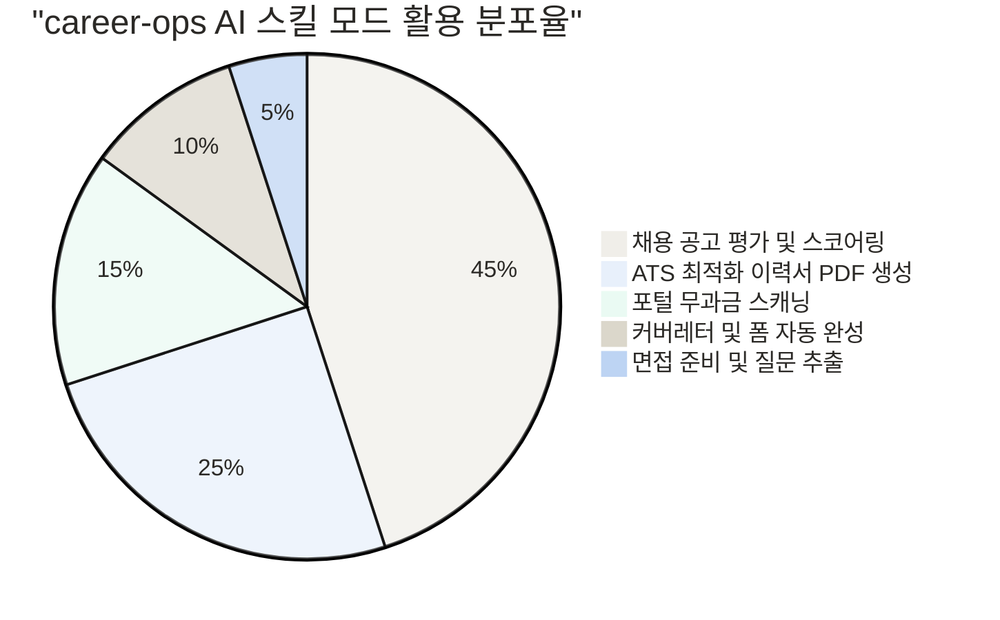
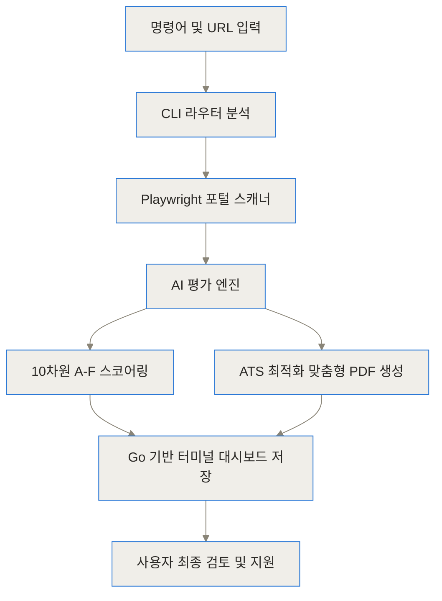
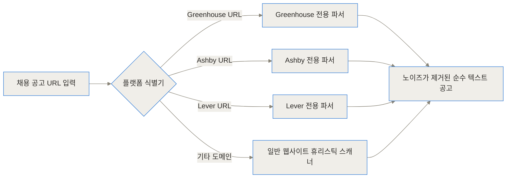
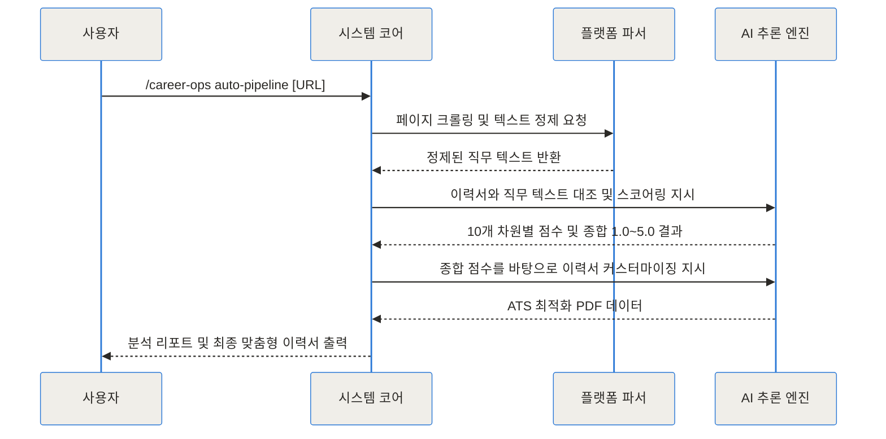
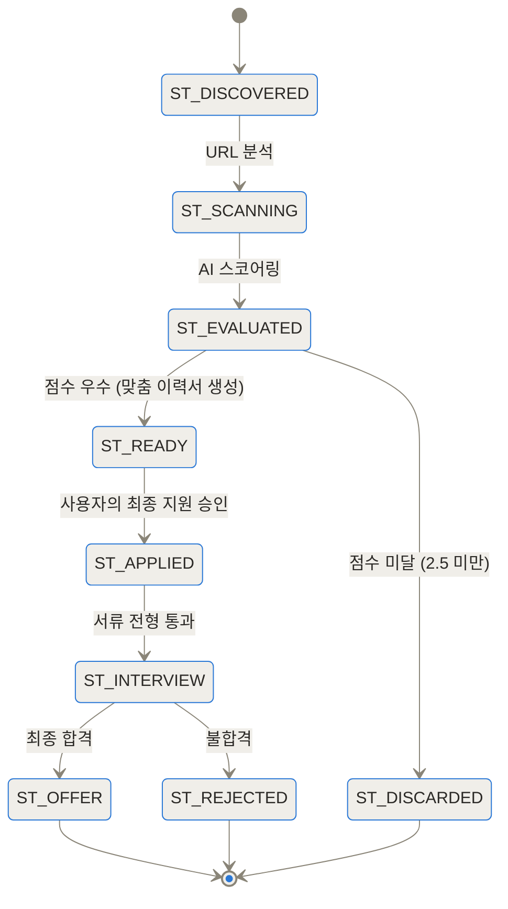
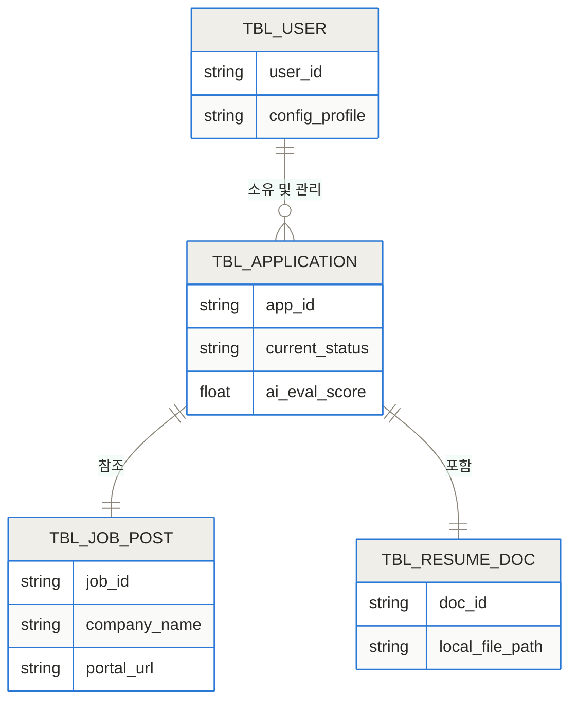
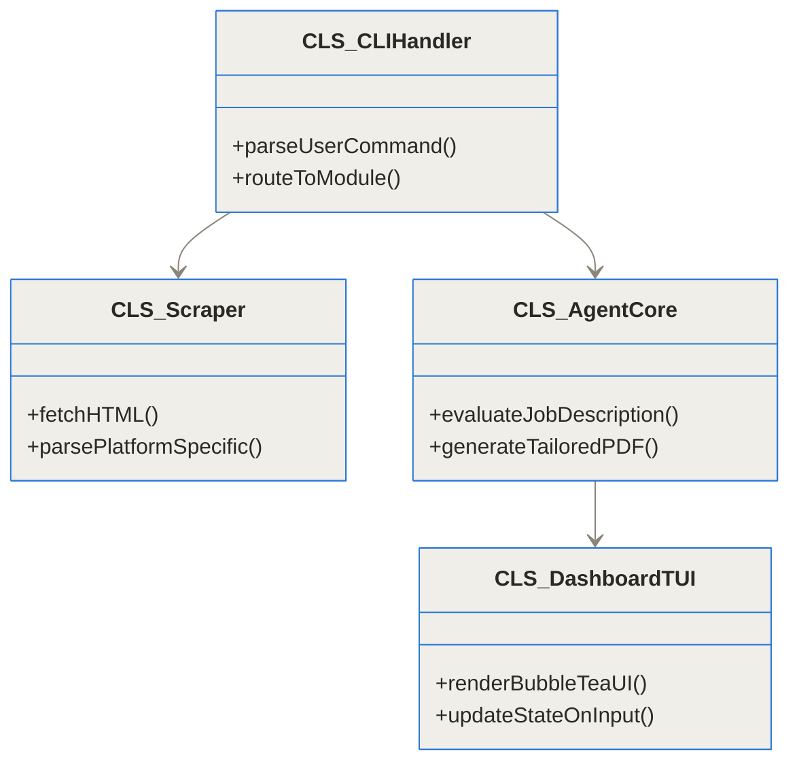

**TL;DR (한 줄 요약)**
- career-ops는 개발자 산티아고(Santiago)가 고안한 오픈소스 AI 구직 자동화 파이프라인으로, 14개의 전용 에이전트 스킬을 활용해 채용 공고를 낱낱이 분석합니다.
- 단순한 공고 스크래핑을 넘어 10개 차원의 가중치 기반 A-F 평가 시스템을 통해 공고와 내 이력서의 핏(Fit)을 1.0에서 5.0 사이의 정량적 점수로 산출합니다.
- 각 공고에 맞춘 ATS 최적화 PDF 이력서를 자동 생성하며, 모든 데이터는 클라우드가 아닌 로컬 터미널과 Go 언어 기반 대시보드에 안전하게 보관됩니다.

[career-ops GitHub 저장소](https://github.com/santifer/career-ops)
[career-ops 공식 문서](https://career-ops.org)
[산티아고 블로그 개발기](https://santifer.io)

## 배경과 문제 정의: 우리가 구직할 때 겪는 진짜 고통은 무엇인가

현대의 구직 과정은 철저히 확률 게임으로 변질되었습니다. 수백 개의 채용 공고를 검색하고, 각 공고의 자격 요건을 나의 경험과 대조하며, 이력서를 수정하고 지원하는 과정은 엄청난 정신적 에너지를 소모합니다. 2026년 현재, 기업들은 이미 AI를 활용해 수천 장의 이력서를 필터링하고 있습니다. 하지만 구직자들은 여전히 낡은 엑셀 파일이나 노션 페이지에 지원 이력을 수동으로 기록하며 비대칭적인 정보 경쟁을 벌이고 있습니다.

대다수의 구직자는 두 가지 극단적인 선택지 사이에서 방황합니다. 첫째는 '스프레이 앤 기도(Spray and Pray)' 방식입니다. 하나의 범용 이력서를 수백 곳의 기업에 무작위로 뿌리고 연락이 오기를 기다리는 것입니다. 이 방식은 효율적이지만 서류 합격률이 극도로 낮습니다. 둘째는 '장인 정신' 방식입니다. 한 기업을 타겟팅하여 몇 시간 동안 이력서와 포트폴리오를 다듬는 것입니다. 정성스럽지만, 만약 해당 포지션이 이미 내정자가 있거나 채용이 동결된 상태라면 며칠의 노력이 허공으로 사라집니다.

이 프로젝트의 창시자인 산티아고(Santiago Fernández de Valderrama) 역시 16년간 운영하던 사업을 매각하고 새로운 일자리를 찾으며 이 고통을 뼈저리게 느꼈습니다. 그는 740개가 넘는 채용 공고를 분석해야 했고, 이를 수작업으로 진행하는 것은 불가능에 가깝다고 판단했습니다. 결국 그는 자신이 직접 사용하기 위해 이 도구를 만들었고, 이를 통해 631개의 공고를 AI로 평가하여 최종 66곳에 지원, 12번의 면접을 거쳐 'Head of Applied AI' 포지션에 합격했습니다. 이후 이 도구를 오픈소스로 공개하면서 전 세계 수많은 개발자들의 열광적인 지지를 받게 되었습니다.

## career-ops란 무엇인가?

이 도구를 한 마디로 정의하자면 **'내 컴퓨터 터미널에 상주하는 개인 전담 AI 리크루터'**입니다. 단순히 채용 포털의 글을 긁어모으는 크롤러가 아니라, 내가 보유한 AI 코딩 어시스턴트(Claude Code, OpenCode, Codex 등) 위에 올라타 구직 과정 전체를 하나의 파이프라인으로 관리해 주는 강력한 소프트웨어입니다.

이 시스템의 가장 큰 특징은 철저한 '로컬 퍼스트(Local-first)' 철학입니다. 사용자의 개인적인 이력서나 평가 데이터, 그리고 지원 현황은 어떠한 외부 클라우드나 텔레메트리 서버로도 전송되지 않습니다. 모든 데이터는 사용자의 기기 내부에 마크다운(Markdown)과 TSV, SQLite 형태로 저장됩니다. 기업들이 AI를 무기로 지원자를 걸러내고 있다면, 이제 지원자도 AI를 무기로 기업을 걸러내는 '무기 대칭'의 시대가 열린 것입니다.

과거에도 구직을 자동화해 준다는 AI 도구들은 많았습니다. 하지만 그 도구들의 치명적인 단점은 '무조건적인 지원(Auto-submit)'이었습니다. 유명 블로거 Ziru의 사례처럼, 봇이 설정 파일의 키워드 하나를 오해하여 본인에게 완벽히 맞는 일자리를 모조리 필터링해 버리는 사고가 발생하기도 했습니다. career-ops는 이 점을 명확히 인지하고 있습니다. 이 시스템은 철저히 '평가'와 '준비'까지만 수행합니다. 데이터를 정리하고 추천하는 것은 시스템의 몫이지만, 최종적으로 지원 버튼을 누르는 것은 오직 인간의 몫으로 남겨두었습니다.



## 작동 원리 심층 해부: 시스템은 어떻게 코드를 이해하고 기억하는가

이 시스템의 내부는 생각보다 훨씬 정교한 2계층(2-Layer) 아키텍처로 구성되어 있습니다. 단순히 프롬프트를 한 번 던지고 답변을 받는 단발성 챗봇이 아니라, 목적에 맞게 분리된 에이전트들이 유기적으로 협력하는 구조입니다.

### 1. 아키텍처 개요 (2-Layer Architecture)

시스템은 크게 '명령어 라우팅 및 데이터 수집을 담당하는 코어 모듈'과 '실제 추론을 담당하는 AI 에이전트 모듈'로 나뉩니다. 사용자가 터미널에 명령어와 URL을 입력하면, 코어 모듈이 이를 해석하여 웹 브라우저를 백그라운드에서 띄워 데이터를 긁어옵니다. 이후 이 순수한 텍스트 데이터를 AI 에이전트에게 넘겨 분석을 지시하는 방식입니다.



이러한 분리 구조는 확장성에 엄청난 이점을 가져다줍니다. 만약 새로운 구직 사이트가 등장하더라도 스캐너 모듈만 업데이트하면 되고, 새로운 AI 모델(예: Claude 3.5 Sonnet에서 향후 다른 모델로)이 나오더라도 추론 에이전트 쪽만 교체하면 전체 파이프라인을 그대로 유지할 수 있습니다.

### 2. 채용 공고 수집 및 스캐닝

사용자가 Greenhouse, Ashby, Lever 혹은 일반 기업의 자체 채용 페이지 URL을 입력하면, 시스템은 Playwright(헤드리스 브라우저 자동화 도구)를 통해 해당 페이지에 접근합니다. 이 과정의 핵심은 '제로 토큰(Zero-token)' 스캐닝입니다. 복잡한 HTML 태그나 불필요한 내비게이션 바, 푸터 등의 노이즈를 AI에게 그대로 던지면 엄청난 토큰 비용이 발생하고 환각(Hallucination) 현상을 유발할 수 있습니다.



내장된 스캐너는 페이지의 구조를 파악하고 오직 직무 설명(JD), 자격 요건, 우대 사항 등의 핵심 텍스트만을 정제하여 추출합니다. 현재 기본적으로 150여 개의 주요 채용 포털 형식을 완벽하게 파싱할 수 있도록 최적화되어 있습니다.

### 3. AI 평가 엔진 (A-F 스코어링)

추출된 직무 텍스트는 사용자의 기본 이력서(Base CV) 데이터와 함께 AI 엔진으로 전달됩니다. 이때 단순히 '나에게 어울리는 직무인가?'라고 묻는 것이 아닙니다. 시스템은 사전에 정의된 10개의 독립적인 차원을 바탕으로 각각 A부터 F까지의 등급을 매기고, 이를 가중치에 따라 종합하여 1.0에서 5.0 사이의 절대적인 실수형 점수를 산출합니다.

| 평가 차원 | 설명 | 스코어링 기준 예시 | 가중치 |
|---|---|---|---|
| 기술 스택 일치도 | 공고가 요구하는 핵심 언어 및 프레임워크와의 교집합 | 필수 기술 누락 시 심각한 감점, 초과 시 가점 | 매우 높음 |
| 연차 및 시니어리티 | 요구 연차 대비 지원자의 실제 경력 | 요구 연차보다 부족하면 감점, 과도한 오버스펙도 패널티 | 높음 |
| 도메인 전문성 | 회사의 산업군과 지원자의 과거 프로젝트 일치 여부 | 핀테크 공고에 결제 시스템 개발 경험 존재 시 가점 | 높음 |
| AI 성숙도 | 채용 기업의 AI 기술 이해도 및 적용 의지 | JD에 AI 도입이 구체적으로 명시되어 있는지 평가 | 중간 |
| 역할의 영향력 | 해당 포지션이 조직 내에서 갖는 권한과 책임 | 독립적인 의사결정 권한이 클수록 가점 부여 | 중간 |

이러한 정량적 평가는 내가 어떤 공고에 시간을 투자해야 할지 명확한 기준을 제시합니다. 4.5점 이상의 공고는 즉시 지원을 고려해야 하고, 2.0점 미만의 공고는 뒤도 돌아보지 않고 버리면 됩니다.



### 4. 맞춤형 이력서 생성 엔진

평가가 완료되고 지원할 가치가 있다고 판단되면, 시스템은 이력서를 새롭게 작성합니다. 이 과정은 마치 노련한 헤드헌터가 이력서를 다듬는 것과 같습니다. 없는 사실을 지어내는 환각(Hallucination)은 철저히 통제되며, 오직 사용자의 원본 이력서에 있는 사실만을 기반으로 하되 직무 공고에서 강조하는 키워드를 전면으로 재배치합니다.

예를 들어, 지원자가 백엔드와 프론트엔드 모두 경험이 있지만 이번 공고가 '데이터베이스 최적화'를 중요하게 여긴다면, 이력서의 서두에는 쿼리 튜닝과 인덱스 설계 경험이 강조되어 작성됩니다. 생성된 데이터는 Node.js 기반의 PDF 제너레이터를 거쳐 완벽한 포맷의 파일로 로컬에 저장됩니다. 이는 기업의 ATS(Applicant Tracking System)가 이력서를 기계적으로 파싱할 때 누락 없이 읽을 수 있도록 최적화된 마크다운 구조를 사용합니다.



### 5. 로컬 데이터베이스와 Go 기반 대시보드

수백 개의 공고를 관리하다 보면 상태 추적이 가장 큰 골칫거리가 됩니다. career-ops는 이를 위해 Node 22.5 이상 환경에서 지원하는 내장 SQLite를 활용해 초고속 인덱싱을 수행합니다. 모든 지원 기록, 점수, 회사명, 파일 경로 등은 로컬에 구조화되어 저장됩니다.



저장된 데이터는 Go 언어로 작성된 터미널 대시보드를 통해 시각화됩니다. 이 대시보드는 Elm 아키텍처를 차용한 Bubble Tea 프레임워크로 만들어져 반응성이 뛰어나고, 마우스 없이 키보드 방향키만으로 수백 개의 지원 내역을 순식간에 필터링하고 조회할 수 있게 해줍니다.

### 6. 시스템 클래스와 모듈 구조

전체 시스템을 지탱하는 코드베이스는 명확한 관심사 분리(Separation of Concerns) 원칙을 따르고 있습니다.



## 설치 및 설정: 내 컴퓨터에서 어떻게 시작하는가?

이 훌륭한 시스템을 도입하는 과정은 생각보다 매우 간단합니다. 복잡한 코딩 지식이 없더라도 터미널 명령어 몇 번이면 충분합니다.

**필수 전제 조건**
1. **AI 코딩 어시스턴트**: Claude Code, Codex, OpenCode, 혹은 GitHub Copilot CLI 중 하나가 설치되어 있고 로그인이 완료된 상태여야 합니다.
2. **Node.js**: 최소 18 버전 이상이 필요하며, 내장 SQLite 트래커 인덱스 기능을 온전히 활용하기 위해서는 22.5 이상의 버전을 강력히 권장합니다.
3. **Git**: 스캐폴딩 도구가 내부적으로 사용하므로 필수적으로 설치되어 있어야 합니다.

**설치 명령어**
작업을 원하는 디렉토리에서 터미널을 열고 아래 명령어를 실행합니다.

```bash
npx @santifer/career-ops init
```

명령어를 실행하면 시스템이 자동으로 필요한 의존성을 다운로드하고 초기 설정 마법사를 시작합니다. 내 기본 이력서(Base CV) 경로를 묻는 프롬프트가 나타나면 파일의 위치를 지정해 줍니다. 이후 내장된 Playwright가 초기 구동을 위해 백그라운드 브라우저 바이너리를 설치하는 과정이 한 번 진행됩니다.

모든 설치가 끝나면, 사용 중인 AI CLI를 열어 `/career-ops --describe` 명령어를 입력해 봅니다. 도구가 정상적으로 연동되었다면 14개의 스킬 모드에 대한 상세한 설명이 터미널에 출력될 것입니다.

## 실전 활용 시나리오: 현업 구직에서의 트러블슈팅

실제로 구직 활동을 하다 보면 여러 변수에 부딪히게 됩니다. 이 도구가 실전에서 어떻게 빛을 발하는지 구체적인 시나리오로 살펴보겠습니다.

### 시나리오 1: 여러 공고를 한 번에 처리해야 할 때 (배치 처리)
링크드인에서 맘에 드는 공고 10개를 발견했습니다. 이를 하나하나 확인하려면 반나절이 걸립니다. 이럴 때는 터미널에 공고 URL들을 스페이스바 단위로 띄워 한 번에 입력합니다. 시스템은 서브 에이전트들을 병렬로 띄워 10개의 공고를 동시에 분석합니다. 약 2~3분 뒤, 터미널에는 10개 기업에 대한 점수(예: 4.8, 3.2, 1.5 등)가 랭킹 순으로 정렬되어 출력됩니다. 4.0이 넘는 상위 3곳의 PDF 파일만 확인하고 지원하면 됩니다.

### 시나리오 2: 예산 부족 또는 토큰 한도 초과 시
수십 개의 공고를 돌리다 보면 Claude Pro와 같은 월 구독제 모델의 토큰 제한에 걸릴 수 있습니다. 이 시스템은 특정 AI 모델에 종속되지 않습니다. 만약 토큰이 바닥났다면, Ollama를 활용해 로컬 모델(예: Gemma 2 또는 Llama 3)로 엔진을 즉각 스위칭할 수 있습니다. 로컬 모델을 사용하면 API 비용이 발생하지 않으므로 무제한으로 공고를 평가할 수 있습니다. 혹은 OpenRouter를 연동하여 사용한 만큼만 지불하는 종량제 모델로 쉽게 전환할 수도 있습니다.

## 벤치마크 및 비교: 얼마나 더 압도적으로 효율적인가?

도구를 사용할 때 가장 체감되는 것은 시간의 단축과 질의 향상입니다. 아래는 한 건의 채용 공고에 지원하기 위해 소요되는 평균 시간을 비교한 차트입니다.

```chartjs
{"type":"bar","data":{"labels":["이력서 분석 및 작성","PDF 포맷팅","파이프라인 기록","합계(건당 소요 분)"],"datasets":[{"label":"기존 수동 지원","data":[30,10,5,45],"backgroundColor":"rgba(200,200,200,0.7)"},{"label":"career-ops 자동화","data":[1,1,0,2],"backgroundColor":"rgba(54,162,235,0.7)"}]},"options":{"responsive":true,"plugins":{"title":{"display":true,"text":"지원 방식별 건당 평균 소요 시간 비교"}},"scales":{"y":{"beginAtZero":true,"title":{"display":true,"text":"시간 (분)"}}}}}
```

시간뿐만 아니라 품질 면에서도 큰 차이를 보입니다. 일반적인 챗봇에 의존하는 방식과 어떻게 다른지 표로 정리했습니다.

| 비교 항목 | 기존 수동 지원 | 일반 AI 챗봇 (ChatGPT 등) | career-ops 시스템 |
|---|---|---|---|
| **공고 분석 방식** | 구직자가 직접 J/D를 읽고 감으로 판단 | 텍스트를 수동 복사/붙여넣기 후 단순 요약 | URL만 입력하면 스캐너가 자동 크롤링 및 10개 차원 정량 평가 |
| **이력서 작성** | 매번 파일을 열어 수정하거나 공통본 사용 | 텍스트만 생성되어 복사 후 워드나 디자인 툴에서 재작업 필요 | 터미널에서 즉시 ATS 최적화 PDF 포맷으로 렌더링 및 자동 저장 |
| **파이프라인 관리** | 엑셀, 구글 시트, 노션 등에 수동 기록 | 세션이 종료되면 기록이 유실되며 체계적 관리 불가 | 로컬 SQLite 인덱스와 Go 언어 기반 TUI 대시보드로 영구 관리 |
| **평균 소요 시간(건당)** | 45분 이상 | 15~20분 내외 | **2~3분 내외** |
| **서류 합격률 기대치** | 낮음 (비표적화된 대량 지원 시) | 중간 (포맷 오류 및 환각 리스크 존재) | **매우 높음** (정밀한 스코어링 기반 맞춤형 작성) |

## 솔직한 평가: 한계와 트레이드오프

이 시스템은 훌륭하지만 무결점의 만능 도구는 아닙니다. 도입하기 전 반드시 고려해야 할 몇 가지 한계점이 존재합니다.

첫째, 완전 자동 지원(Auto-submit) 기능의 부재입니다. 스위치를 켜두고 자고 일어나면 수백 곳에 지원되어 있는 '마법'을 기대했다면 실망할 수 있습니다. 작성자는 시스템이 치명적인 실수를 저지르는 것을 막기 위해 마지막 제출 권한을 의도적으로 인간에게 남겨두었습니다.

둘째, 터미널 환경에 대한 진입 장벽입니다. 프론트엔드 개발자나 시스템 엔지니어에게 터미널은 일상이지만, 비개발 직군이나 명령어 인터페이스가 낯선 사용자에게는 초기 설정부터 큰 부담으로 다가올 수 있습니다. GUI 창이 따로 존재하는 형태가 아니기 때문입니다.

셋째, LLM API 비용 또는 하드웨어 리소스 문제입니다. 제대로 된 분석과 양질의 PDF를 얻기 위해서는 Claude 3.5 Sonnet이나 GPT-4o 수준의 지능이 필요합니다. 이를 API로 호출하면 건당 비용이 발생하며, 비용을 아끼기 위해 로컬 모델을 구동하려면 상당한 스펙의 GPU가 탑재된 PC가 필요합니다.

## 마무리: 채용 시장의 정보 비대칭을 깨다

채용 시장은 오랫동안 기울어진 운동장이었습니다. 기업은 자동화된 ATS와 AI 알고리즘을 사용해 수만 명의 지원자를 눈 깜짝할 새에 필터링해 왔지만, 구직자는 여전히 밤을 새워가며 글을 다듬어야 했습니다.

career-ops는 이 기울어진 운동장의 균형을 맞추기 위한 강력한 시도입니다. 산티아고가 이야기했듯, "기업들이 AI를 사용해 후보자를 걸러낸다면, 우리 후보자들도 AI를 사용해 기업을 걸러내야 합니다." 이 오픈소스 프로젝트는 단순한 기술적 도구를 넘어 구직자가 스스로의 권리와 시간을 지키기 위한 중요한 선언과도 같습니다. 지금 바로 터미널을 열고 여러분만의 전담 에이전트를 고용해 보시기 바랍니다.

## 자주 묻는 질문 (FAQ)

### career-ops를 실행하려면 반드시 유료 AI 구독이 필요한가요?

그렇지 않습니다. Claude Pro나 Max 요금제를 활용하는 것이 가장 원활하지만, 토큰 한도에 제약받지 않으려면 Ollama를 통한 로컬 모델 구동이 가능합니다. 또한 OpenRouter를 통한 종량제 API를 통해서도 충분히 비용 효율적으로 실행할 수 있습니다.

### 모든 구직 사이트에서 정상적으로 동작하나요?

Greenhouse, Ashby, Lever 등 150여 개의 주요 글로벌 채용 포털의 형식을 기본적으로 지원합니다. 또한 Playwright 기반의 휴리스틱 스캐너가 웹페이지의 텍스트 구조를 분석하므로, 대부분의 기업 자체 채용 페이지에서도 정상적으로 핵심 데이터를 추출할 수 있습니다.

### 직무별로 이력서를 미리 여러 개 만들어 두어야 하나요?

아닙니다. 단 하나의 뼈대가 되는 기본 이력서(Base CV)만 로컬에 준비하시면 됩니다. 시스템이 개별 채용 공고의 요구사항을 분석하여 매번 해당 직무의 키워드와 포지션에 가장 적합한 맞춤형 PDF 이력서를 새롭게 생성해 줍니다.

### 공고 분석 후 지원서 자동 제출 기능도 지원하나요?

시스템은 보안과 신뢰성 문제로 자동 제출을 지원하지 않습니다. 개발자는 채용 공고 스캐닝, 정량적 평가, 맞춤형 이력서 생성까지만 철저히 자동화하고, 최종 지원 여부의 결정과 제출 버튼을 누르는 행위는 오직 사람의 판단에 맡기도록 시스템을 설계했습니다.

### 내 이력서와 개인 정보가 클라우드나 외부 서버로 전송되지는 않나요?

이 프로젝트는 철저히 로컬 환경에서 구동됩니다. 사용자의 이력서, 평가 기록, 대시보드 상태 등 모든 데이터는 사용자 기기의 로컬 저장소에 마크다운 및 SQLite 형태로 보관됩니다. 단, 텍스트 추론을 위해 연결한 AI 모델 API 서버로는 데이터가 전송되므로 해당 AI 제공자의 프라이버시 정책을 참고해야 합니다.


## References
- [https://github.com/santifer/career-ops](https://github.com/santifer/career-ops)
- [https://career-ops.org](https://career-ops.org)
