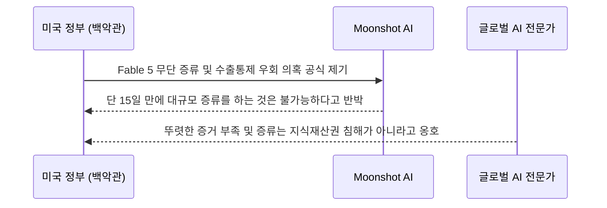

인용된 자료는 Moonshot AI의 Kimi K3 공개와 미국 측의 모델 증류 의혹 제기를 함께 다룹니다. 모델 규모와 공개 형태는 기술 사양으로 확인할 수 있지만, 무단 증류 여부는 주장과 반박을 구분해야 하며 현재 글의 자료만으로 확정할 수 없습니다. 도입자는 모델 카드, 라이선스, 평가 조건을 확인하고 논란 자체를 성능이나 합법성의 증거로 사용하지 않아야 합니다.

## 무슨 일이 벌어진 걸까?

Moonshot AI는 2026년 7월 16일, 무려 2.8조 개의 엄청난 파라미터와 100만 토큰의 컨텍스트 윈도우를 갖춘 초대형 오픈 가중치(open-weight) AI 모델인 Kimi K3를 전격 출시했습니다 <a href="#source-2" aria-label="Forbes 출처">[2]</a>. 100만 토큰이라면 책 수십 권에 달하는 방대한 텍스트를 한 번에 입력하고 분석할 수 있다는 뜻이니, 이 모델의 엄청난 규모와 성능을 쉽게 짐작하실 수 있습니다.

하지만 놀라움도 잠시, 미국 백악관이 이 모델의 개발 과정에 심각한 의혹을 제기하면서 국제적인 논란으로 번졌습니다. 백악관 과학기술 고문인 Michael Kratsios는 Moonshot AI가 비밀스러운 내부 플랫폼을 통해 미국 Anthropic의 최신 모델 'Fable 5'를 대규모로 증류(distillation)했다고 공식 비난했습니다 <a href="#source-3" aria-label="South China Morning Post 출처">[3]</a>. 증류 기술을 일상적인 비유로 설명하자면, 이미 1등을 한 모범생(큰 모델)이 풀어놓은 답안지와 풀이 과정을 보고 일반 학생(작은 모델 또는 후발 모델)이 그 요령을 재빨리 베껴 배워서 실력을 키우는 기법입니다. 효율적으로 AI를 똑똑하게 만드는 방법이지만, 미국 정부는 이를 명백한 지식재산권 탈취로 규정한 것입니다. 자체적인 기술력과 엄청난 자본으로 이룬 혁신인지, 아니면 꼼수로 남의 성과를 훔친 것인지를 두고 양국 간의 팽팽한 대립이 시작되었습니다.

<figure class="news-source-image">
  
  <figcaption>NIST가 원문과 함께 공개한 이미지입니다. <a href="https://www.nist.gov/news-events/news/2026/07/uk-aisi-caisi-preliminary-assessment-kimi-k3s-cyber-capabilities" target="_blank" rel="noopener noreferrer">출처: NIST</a></figcaption>
</figure>

## 왜 지금 다들 이 이야기를 할까?

미국 정부는 단순한 기술 도용을 넘어, 미국의 핵심 안보 전략인 첨단 반도체 수출 통제망이 완전히 뚫렸을 가능성까지 심각하게 의심하고 있기 때문입니다. 단순히 남의 모델을 베낀 것에 그치지 않고, 거대한 모델을 학습시키기 위한 물리적인 하드웨어 인프라까지 부정한 방법으로 조달했다는 것이죠. Kratsios 고문은 Moonshot AI가 미국의 강력한 수출 통제를 피하기 위해, 태국에 있는 Nvidia GB300 칩이 장착된 서버를 확보하고 이에 우회 접속하여 모델 훈련에 사용했다고 주장했습니다 <a href="#source-3" aria-label="South China Morning Post 출처">[3]</a>.

여기서 눈여겨볼 점은 두 모델의 출시 시점을 비교할 때 나타나는 시간적 한계입니다. 아래 타임라인을 함께 보실까요?

타임라인을 보면 Moonshot AI 직원들이 왜 그렇게 강하게 억울함을 호소하는지 이해가 갑니다. Anthropic의 Fable 5가 7월 1일에 출시되었고 Kimi K3가 7월 16일에 세상에 나왔습니다. 단 15일이라는 좁은 시간 안에 Fable 5를 철저히 분석하고 대규모 증류 작업을 진행해 2.8조 파라미터급 모델을 새롭게 학습시키고 테스트까지 마치는 것은 현실적으로 불가능에 가깝다는 것이 그들의 확고한 주장입니다 <a href="#source-3" aria-label="South China Morning Post 출처">[3]</a>.

게다가 글로벌 AI 전문가들 역시 미국 정부의 행보에 의문을 표하고 있습니다. 뚜렷한 물증이나 명확한 로그 기록 같은 증거가 제시되지 않았다는 점, 그리고 증류라는 기법 자체가 학계와 산업계에서 널리 쓰여왔기에 이를 곧바로 지식재산권 침해로 규정하기에는 무리가 있다는 의견입니다 <a href="#source-3" aria-label="South China Morning Post 출처">[3]</a>. 결국 이번 논란은 단순히 하나의 저작권 싸움이 아니라, AI 기술 패권을 굳건히 지키려는 미국과 이를 뛰어넘어 글로벌 영향력을 키우려는 진영 간의 지정학적 기술 전쟁이 본격화된 것으로 볼 수 있습니다.

<figure class="news-source-image">
  
  <figcaption>NIST가 원문과 함께 공개한 이미지입니다. <a href="https://www.nist.gov/news-events/news/2026/07/uk-aisi-caisi-preliminary-assessment-kimi-k3s-cyber-capabilities" target="_blank" rel="noopener noreferrer">출처: NIST</a></figcaption>
</figure>

## 그래서 우리에게 뭐가 달라질까?

가장 크게 와닿을 변화는, 최고 수준의 성능을 자랑하는 AI 모델을 적은 비용으로 우리의 프로젝트에 직접 가져다 쓸 수 있는 선택지가 크게 늘어났다는 점입니다. Kimi K3는 2.8조 파라미터라는 거대한 규모와 100만 토큰을 한 번에 처리할 수 있는 성능을 '오픈 가중치' 형태로 시원하게 공개했습니다. 폐쇄적인 API에 의존하며 매번 쿼리당 비싼 사용료를 내야 했던 수많은 개발자와 스타트업들에게는 가뭄의 단비 같은 소식입니다. 글로벌 시장에 이렇게 저렴하면서도 유능한 모델들이 풀리게 되면, AI를 활용한 서비스 제작 비용은 극적으로 낮아지게 됩니다.

제가 보기엔, 이번 Kimi K3 출시는 미국 소수 기업들이 꽉 잡고 있던 독점적 AI 생태계에 큰 균열을 냈다는 점에서 의미가 큽니다. 당장 우리가 일상적으로 사용하는 다양한 앱, 실시간 번역기, 문서 요약 도구, 고객 응대 챗봇 서비스 뒤에 Kimi K3와 같은 가성비 좋은 모델들이 탑재될 수 있습니다. 비싼 뇌를 계속 빌려 쓰지 않고도, 각 기업이 자체 서버에 강력한 뇌를 직접 심을 수 있게 되는 것이죠. 결과적으로 시장 내 경쟁이 치열해지면서 서비스 고도화 속도는 더욱 빨라지고, 최종 사용자인 우리가 누리는 편의성은 눈에 띄게 개선될 수 있습니다.

## 직접 써보거나 지켜볼 포인트

당장 Kimi K3를 회사 업무나 핵심 서비스에 도입하기 전에, 이 모델의 실제 보안 역량과 글로벌 규제 리스크가 어떻게 흘러가는지 유심히 지켜봐야 합니다. 초대형 AI를 직접 호스팅할 때 가장 우려되는 점이 바로 보안 취약점입니다만, 다행스럽게도 초기 평가는 긍정적입니다. 영국 인공지능 안전 연구소(UK AISI)와 미국 인공지능 안전 연구소(U.S. CAISI)가 실시한 예비 합동 평가에 따르면, Kimi K3의 사이버 익스플로잇(취약점 공격) 개발 능력은 최신 프론티어급 모델들에 비해 현저히 낮다고 결론 났습니다 <a href="#source-1" aria-label="NIST 출처">[1]</a>. 쉽게 말해, 이 모델이 악의적인 해커의 손에 들어가 복잡한 해킹 코드를 척척 짜내거나 사이버 공격에 악용될 위험성은 상대적으로 낮다는 뜻이니 보안 측면에서는 조금 안심하셔도 되겠습니다.

하지만 더 중요한 쟁점은 다른 곳에 있습니다. 의혹의 중심에 있는 '모델 증류' 방식을 둘러싼 글로벌 합의 과정입니다. 이 논쟁의 전개 과정을 아래 흐름도로 살펴보겠습니다.

앞서 언급했듯, 다른 모델의 출력값을 바탕으로 내 모델을 가르치는 방식이 정말로 불법이자 기술 탈취로 굳어질지, 아니면 AI 업계에서 널리 통용되는 합법적인 개발 기법으로 남을지가 향후 핵심 관전 포인트입니다. 이 논란이 미국 법원이나 국제 규제 기관에서 어떻게 결론 나느냐에 따라, 앞으로 AI 스타트업들의 모델 개발 방식과 비용 구조가 완전히 뒤바뀔 수 있습니다. 우리가 계속해서 관련 뉴스를 주시해야 하는 이유입니다.

## 아직은 선을 그어야 할 부분

미국 정부의 거센 비난과 언론의 쏟아지는 보도에도 불구하고, Moonshot AI가 실제로 Anthropic의 Fable 5를 모델 증류에 사용했는지는 아직 명확히 검증되지 않았습니다. 현재로서는 거물급 인사들의 의혹 제기와 정황 주장만 있을 뿐, 확정된 사실이나 명백한 로그 기록이 대중에게 공개된 것이 아니기 때문에 어느 한쪽이 확실히 잘못했다고 섣부른 판단을 내리는 것은 피해야 합니다.

또한, 미국 재무부가 Nvidia GB300 칩 우회 확보 의혹과 관련하여 Moonshot AI나 태국에 위치한 관련 법인들을 공식적으로 경제 제재 대상에 올릴지 여부도 아직 전혀 확실치 않습니다. 현재로서는 공식적인 제재안이 확정되지 않았으므로, 이 모델을 다운로드하거나 연구 및 실무 목적으로 사용하는 것 자체가 당장 심각한 법적 리스크를 초래한다고 단정 짓기에는 이릅니다. 앞으로 추가적인 증거가 대중에게 공개되거나, 미국 재무부의 공식적인 제재 조치가 발표될 때까지는 조금 거리를 두고 양측의 팽팽한 입장을 객관적으로 지켜보는 것이 가장 현명한 선택입니다.

<!-- primary-sources:start -->
## 원문과 버전 확인

- [발표 원문](https://www.nist.gov/news-events/news/2026/07/uk-aisi-caisi-preliminary-assessment-kimi-k3s-cyber-capabilities)
- [Forbes](https://www.forbes.com/sites/tyroush/2026/07/17/chinese-ai-startup-moonshot-unveils-kimi-k3-modelwill-it-challenge-openai-and-anthropic)
- [South China Morning Post](https://www.scmp.com/tech/tech-war/article/3271701/global-ai-experts-push-back-us-distillation-claims-against-moonshots-kimi-k3-model)
<!-- primary-sources:end -->

<!-- internal-links:start -->
## 함께 읽으면 이해가 이어지는 글

- [Anthropic 위험 보고서 공개, Claude Mythos 5 넘어서는 미공개 Model 2와 정렬 위험 등급 상향]() — Anthropic이 2026년 8월 14일 발표한 186페이지 위험 보고서에서 Claude Mythos 5를 넘어서는 미공개 모델 'Model 2'의 존재를 밝혔습니다. 자율 에이전트 기능의 고도화와 사이버 보안 평가 사례를 반영해…
- [Claude Opus 5 가격과 도구 변경 시 캐시 유지 베타: 전환 전 확인할 것]() — 앤스로픽이 최고 수준 모델인 Claude Fable 5에 근접한 성능을 내면서도 가격은 절반으로 낮춘 Claude Opus 5를 공식 출시했습니다. 특히 대화 도중 도구를 변경해도 프롬프트 캐시가 유지되는 새로운 베타 기능을 도입해…
- [Nvidia, Poolside와 70억 달러 계약 체결하여 Nemotron AI 경쟁력 강화]() — Nvidia가 AI 스타트업 Poolside의 Model Factory 소프트웨어 라이선스 대금으로 60억 달러를 지급하고 10억 달러의 지분 투자를 단행했습니다. 이번 거래를 통해 Poolside의 핵심 엔지니어 109명이…
<!-- internal-links:end -->

## 자주 묻는 질문

### Kimi K3 모델은 누구나 무료로 사용할 수 있나요?

네, 모델의 파라미터를 그대로 가져다 쓸 수 있는 오픈 가중치(open-weight) 형태로 제공되어 자유롭게 활용할 수 있습니다. 단, 실제 상업적 서비스에 깊이 적용하기 전에는 앞으로의 글로벌 규제나 제재 동향을 함께 살펴보시는 것이 좋습니다.

### Kimi K3가 미국 Anthropic의 모델을 훔쳤다는 게 사실인가요?

아직 명확히 검증되지 않은 백악관의 의혹 제기일 뿐입니다. Moonshot AI 측은 단 15일이라는 짧은 시간 내에 대규모로 베끼는 것은 불가능하다고 강하게 반박했고, 글로벌 전문가들 역시 증거 부족을 지적하고 있어 아직 확정된 사실은 아닙니다.

### 이 모델을 직접 우리 서버에 설치했을 때 보안상 위험은 없을까요?

다행히 현재까지의 평가는 긍정적입니다. 영국과 미국의 인공지능 안전 연구소 예비 평가에 따르면, Kimi K3의 사이버 해킹 공격 능력은 최신 최고급 모델들보다 현저히 낮아 보안 측면에서 상대적으로 안전하다고 평가받고 있습니다.

## 직접 확인한 원문

<ol class="checked-source-list">
  <li id="source-1"><a href="https://www.nist.gov/news-events/news/2026/07/uk-aisi-caisi-preliminary-assessment-kimi-k3s-cyber-capabilities" target="_blank" rel="noopener noreferrer">NIST — UK AISI / CAISI Preliminary Assessment of Kimi K3&#x27;s Cyber Capabilities</a> (2026-07-23)</li>
  <li id="source-2"><a href="https://www.forbes.com/sites/tyroush/2026/07/17/chinese-ai-startup-moonshot-unveils-kimi-k3-modelwill-it-challenge-openai-and-anthropic" target="_blank" rel="noopener noreferrer">Forbes — Chinese AI Startup Moonshot Unveils Kimi K3 Model—Will It Challenge OpenAI And Anthropic?</a> (2026-07-17)</li>
  <li id="source-3"><a href="https://www.scmp.com/tech/tech-war/article/3271701/global-ai-experts-push-back-us-distillation-claims-against-moonshots-kimi-k3-model" target="_blank" rel="noopener noreferrer">South China Morning Post — Global AI experts push back on US &#x27;distillation&#x27; claims against Moonshot&#x27;s Kimi K3 model</a> (2026-07-23)</li>
</ol>

> 이 글은 위 원문을 직접 확인해 작성했습니다. 가격, 기능 범위, 지역별 제공 여부는 게시 후 바뀔 수 있으니 실제 도입 전 공식 문서를 다시 확인하세요.
