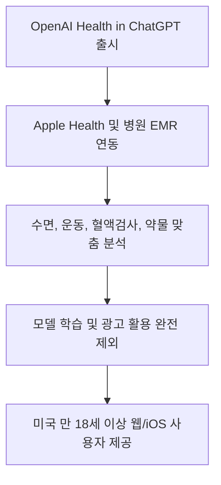
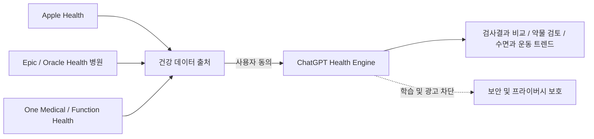
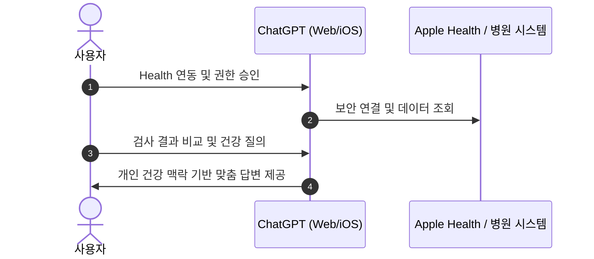
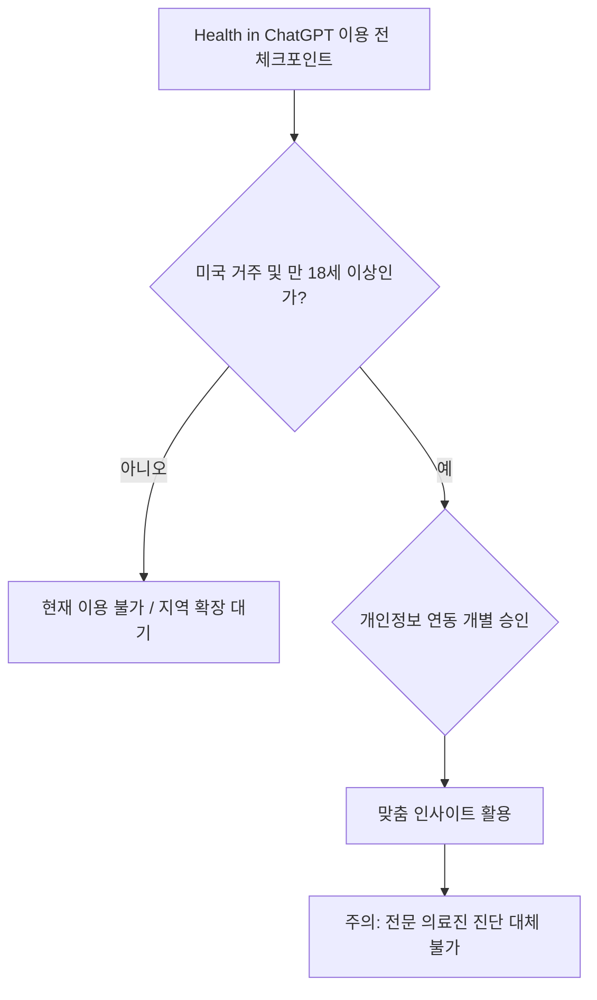

인용된 OpenAI 발표에 따르면 Health in ChatGPT는 사용자가 Apple Health와 의료 기록을 연결해 자신의 건강 데이터를 대화에서 참고하도록 하는 기능입니다. 이 기능은 진단이나 치료를 자동 승인하는 의료기기가 아니며 제공 지역, 연결 기관, 데이터 정책은 사용 시점에 다시 확인해야 합니다. 연동 전에는 어떤 기록을 읽는지, 모델 학습 제외와 보존, 삭제가 각각 무엇을 뜻하는지, 연결 해제 뒤 파생 대화가 남는지를 점검하세요.

## 무슨 일이 벌어진 걸까?

OpenAI가 2026년 7월 23일 개인의 건강 데이터와 전자의무기록(EHR)을 ChatGPT에 직접 연동할 수 있는 'Health in ChatGPT' 기능을 공식 출시했습니다 <a href="#source-1" aria-label="Launching Health in ChatGPT - OpenAI 출처">[1]</a>. 이제 사용자는 본인의 스마트폰에 기록된 건강 정보나 병원의 진료와 검사 기록을 ChatGPT와 연결하여 내 몸 상태에 딱 맞춘 건강 인사이트를 받아볼 수 있게 되었습니다 <a href="#source-3" aria-label="OpenAI Once Again Makes The Case For Giving ChatGPT Your Health Records 출처">[3]</a>.

이 서비스는 미국 내 만 18세 이상의 로그인한 사용자들을 대상으로 먼저 시작되었습니다 <a href="#source-4" aria-label="ChatGPT&#x27;s Apple Health Integration Now Rolling Out to U.S. Users 출처">[4]</a>. 무료 계정인 Free부터 Go, Plus, Pro 등 모든 요금제 등급에서 웹과 iOS 앱을 통해 이용할 수 있습니다 <a href="#source-1" aria-label="Launching Health in ChatGPT - OpenAI 출처">[1]</a>. 단순히 일반적인 건강 상식을 물어보던 대화형 AI가 내 실제 검사 수치와 수면 데이터를 읽고 답변하는 개인 맞춤형 건강 가이드로 한 단계 진화한 셈입니다.

<figure class="news-source-image">
  
  <figcaption>OpenAI가 원문과 함께 공개한 이미지입니다. <a href="https://openai.com/index/health-in-chatgpt" target="_blank" rel="noopener noreferrer">출처: OpenAI</a></figcaption>
</figure>

## 왜 지금 다들 이 이야기를 할까?

그동안 AI에게 건강 관련 질문을 할 때는 내 피검사 수치나 약물 정보를 직접 복사해서 붙여넣어야 하는 번거로움이 있었습니다. 하지만 이번 연동을 통해 ChatGPT가 연동된 시스템의 건강 맥락을 직접 파악하고 한층 정교한 대화를 제공하게 되었습니다 <a href="#source-2" aria-label="OpenAI rolls out Health in ChatGPT to integrate medical records 출처">[2]</a>.

가장 눈여겨볼 점은 연동되는 건강 데이터의 범위와 강력한 프라이버시 보호 정책입니다. 연동 대상에는 Apple Health 데이터를 포함해 Epic, Oracle Health 솔루션을 사용하는 주요 병원 시스템, 그리고 One Medical, Function Health 등이 포함됩니다 <a href="#source-2" aria-label="OpenAI rolls out Health in ChatGPT to integrate medical records 출처">[2]</a>. 연동된 의료 기록 및 건강 정보는 모델 학습에 전혀 활용되지 않으며, 광고 타게팅 용도로도 절대 사용되지 않도록 전격 제외되었습니다 <a href="#source-1" aria-label="Launching Health in ChatGPT - OpenAI 출처">[1]</a>.

<figure class="news-source-image">
  
  <figcaption>OpenAI가 원문과 함께 공개한 이미지입니다. <a href="https://openai.com/index/health-in-chatgpt" target="_blank" rel="noopener noreferrer">출처: OpenAI</a></figcaption>
</figure>

## 그래서 우리에게 뭐가 달라질까?

ChatGPT가 내 수면 패턴, 운동 기록, 약물 처방 내역, 피검사 결과지 등을 종합적으로 파악한 상태에서 답변을 주게 됩니다. 예를 들어 최근 수면 시간이 줄어들었을 때 운동량 수치와 연동하여 내 생활 패턴을 고려한 구체적인 조언을 요청할 수 있습니다 <a href="#source-2" aria-label="OpenAI rolls out Health in ChatGPT to integrate medical records 출처">[2]</a>.

또한 병원에서 받은 복잡한 피검사 수치를 이전 수치와 비교 분석하거나, 현재 복용 중인 약물 목록을 기반으로 주의해야 할 점이 있는지 점검할 때도 ChatGPT가 연동된 맥락을 활용해 답변을 제공합니다 <a href="#source-1" aria-label="Launching Health in ChatGPT - OpenAI 출처">[1]</a>. 수많은 숫자로 가득 찬 검사지 표를 혼자 읽으며 답답해할 필요 없이, AI가 내 기록의 흐름을 파악하여 설명해 주는 환경이 마련된 것입니다.

<figure class="news-source-image">
  
  <figcaption>Fierce Healthcare가 원문과 함께 공개한 이미지입니다. <a href="https://www.fiercehealthcare.com/ai-and-machine-learning/openai-makes-health-chatgpt-widely-available-moving-deeper-consumer-health" target="_blank" rel="noopener noreferrer">출처: Fierce Healthcare</a></figcaption>
</figure>

## 사용 전에 무엇을 검증할까?

Health in ChatGPT 기능이 어떤 흐름으로 작동하며 어떻게 활용 가능한지 정리해보면 다음과 같습니다.

사용자는 ChatGPT 내에서 혈액검사 수치 비교, 처방 약물 복용 시 주의사항 검토, 수면 및 운동 트렌드 분석 등 다양한 작업을 수행할 수 있습니다 <a href="#source-1" aria-label="Launching Health in ChatGPT - OpenAI 출처">[1]</a>. 무엇보다 AI가 내 의료 데이터를 무단으로 학습할까 봐 불안해할 필요가 없도록 명시적인 보안 프레임워크가 적용되어 있다는 점에서 실질적인 이용 문턱이 크게 낮아졌습니다 <a href="#source-4" aria-label="ChatGPT&#x27;s Apple Health Integration Now Rolling Out to U.S. Users 출처">[4]</a>.

## 아직은 선을 그어야 할 부분

아무리 편리해졌다고 해도 몇 가지 한계와 주의할 점은 명확히 확인해야 합니다.

현재 이 서비스는 미국에 거주하는 만 18세 이상의 로그인된 사용자에게만 배포되고 있어, 국내를 비롯한 타 국가 사용자들은 아직 이용할 수 없습니다 <a href="#source-4" aria-label="ChatGPT&#x27;s Apple Health Integration Now Rolling Out to U.S. Users 출처">[4]</a>. 또한 ChatGPT가 건강 맥락 데이터를 활용할 때는 매번 사용자의 명확한 승인이 필요합니다 <a href="#source-1" aria-label="Launching Health in ChatGPT - OpenAI 출처">[1]</a>. 마지막으로 AI의 분석과 답변은 의사의 정식 진단을 대체할 수 없으므로 실제 치료나 약물 처방 관련 결정은 반드시 전문 의료진과 상의해야 합니다.

## 의료 기록 연결 권한은 어디까지 허용할까?

처음에는 필요한 기간과 데이터 유형만 선택할 수 있는지 확인합니다. 수면, 운동 기록을 설명받는 데 전체 병력과 약물 기록까지 제공할 이유는 없을 수 있습니다. 읽기 권한과 쓰기 권한을 구분하고, 계정 연결 화면에 표시된 공급자와 실제 데이터 흐름이 일치하는지 확인해야 합니다.

연결 뒤에는 원문 기록과 답변을 표본 대조합니다. 검사 단위, 날짜, 정상 범위와 약 이름을 잘못 읽지 않는지 보고, 서로 다른 병원의 중복 항목을 한 사건처럼 합치지 않는지도 살핍니다. 모델이 기록에 없는 원인을 단정하거나 응급 증상을 일반 조언으로 낮추면 실패로 처리합니다.

## 학습 제외와 데이터 삭제는 같은 뜻일까?

모델 학습에 사용하지 않는다는 정책은 서비스 제공을 위해 저장, 처리하지 않는다는 뜻과 같지 않습니다. 대화 기록, 연결 토큰, 가져온 원문과 파생 요약이 각각 어디에 얼마나 오래 남는지 정책에서 구분해야 합니다. 계정 연결을 해제하고 대화를 삭제했을 때 어떤 데이터가 즉시 사라지고 법적, 보안상 보관되는 항목이 있는지도 확인합니다.

공유 기기와 조직 계정에서는 다른 사람이 건강 대화를 볼 수 있는지도 점검합니다. 알림 미리보기, 브라우저 세션, 대화 내보내기와 지원 로그는 원문 EHR 외의 노출 경로가 될 수 있습니다. 민감한 기록을 연결하기 전에 계정 보안과 기기 잠금을 먼저 정비해야 합니다.

## 어떤 답변까지 의사결정에 써도 될까?

기록의 쉬운 설명, 다음 진료에서 물을 질문, 생활 기록의 경향 요약은 사람 검토를 전제로 시험할 수 있습니다. 반면 약을 중단하거나 용량을 바꾸고, 증상을 진단하며, 응급 여부를 확정하는 결론은 답변만으로 실행해서는 안 됩니다. 답에 출처가 되는 기록 날짜와 항목이 보이지 않으면 사용자도 근거를 확인하기 어렵습니다.

도입 평가는 편의성뿐 아니라 위험 답의 처리로 합니다. 일부러 상충하는 검사값, 오래된 기록, 누락된 단위를 넣고 모델이 불확실성을 표시하는지 확인합니다. 중요한 기록을 잘못 합치거나 확신 있게 치료를 제안한다면 기능 범위를 기록 요약으로 제한하는 것이 안전합니다.

의료진에게 보여 줄 때는 원문 기록과 모델 요약을 함께 제시해 수정 가능한 초안임을 분명히 하고, 모델 답만 환자 기록으로 다시 저장하지 않아야 합니다.

같은 기록에 질문 표현만 바꿔 답이 달라지는지도 확인합니다. 핵심 수치와 날짜가 반복 질문에서 흔들리거나 근거 기록을 찾지 못한다면, 개인 맞춤 조언보다 원문 검색과 쉬운 설명처럼 검증 가능한 범위로 용도를 좁혀야 합니다. 오류 사례와 수정 결과를 남겨 연결 데이터나 모델이 바뀔 때 같은 시험을 다시 수행하는 것이 안전합니다.

<!-- primary-sources:start -->
## 원문과 버전 확인

- [발표 원문](https://openai.com/index/health-in-chatgpt)
- [Fierce Healthcare](https://www.fiercehealthcare.com/ai-and-machine-learning/openai-makes-health-chatgpt-widely-available-moving-deeper-consumer-health)
- [Engadget](https://www.engadget.com/2222059/openai-once-again-makes-the-case-for-giving-chatgpt-your-health-records)
- [MacRumors](https://www.macrumors.com/2026/07/23/chatgpt-apple-health-integration)
<!-- primary-sources:end -->

<!-- internal-links:start -->
## 함께 읽으면 이해가 이어지는 글

- [OpenAI 프론티어 API 제로 데이터 보존 발표, Private Safety Processing으로 기업 보안 강화]() — OpenAI가 2026년 8월 19일 프론티어 모델 API 사용자를 대상으로 제로 데이터 보존(ZDR) 옵션을 발표하고 Private Safety Processing을 미리보기로 공개했습니다. ZDR을 적용하면 프롬프트와 모델 출력…
- [MedXIAOHE는 의료 멀티모달 모델을 어떻게 학습하나: 구조와 검증 한계]() — MedXIAOHE의 네이티브 해상도 처리, 의료 개체 중심 사전학습과 추론 데이터 구축, 임상 적용 전 검증해야 할 한계를 분석합니다.
- [UA-VLS의 불확실성 점수는 의료 판단을 안전하게 할까: SEU Loss와 Dice 3~5% 향상]() — 임상 텍스트와 영상을 SSMix로 결합하는 UA-VLS의 계산 이득, SEU Loss의 보정 의미와 임상 적용 전 한계를 설명합니다.
<!-- internal-links:end -->

## 자주 묻는 질문

### Health in ChatGPT는 누구나 바로 사용할 수 있나요?

아니요, 현재는 미국에 거주하는 만 18세 이상의 로그인한 사용자에게만 배포되고 있습니다. 무료 계정(Free)부터 Go, Plus, Pro 등 모든 요금제 사용자가 웹과 iOS 앱에서 이용할 수 있습니다.

### 내 개인 의료 기록이나 Apple Health 데이터가 AI 학습에 사용되나요?

아니요, 연동된 병원 의료 기록과 Apple Health 데이터는 ChatGPT 모델 학습에서 완전히 제외됩니다. 또한 해당 정보는 광고 타게팅 목적으로도 절대 활용되지 않습니다.

### Health in ChatGPT로 연동할 수 있는 데이터 출처는 어디인가요?

Apple Health 데이터를 비롯해 Epic 및 Oracle Health 기반의 병원 시스템, One Medical, Function Health의 의료 기록을 연동할 수 있습니다. 연동 후에는 수면과 운동 트렌드 분석, 검사 결과 비교, 약물 리뷰가 가능합니다.

## 직접 확인한 원문

<ol class="checked-source-list">
  <li id="source-1"><a href="https://openai.com/index/health-in-chatgpt" target="_blank" rel="noopener noreferrer">OpenAI — Launching Health in ChatGPT - OpenAI</a> (2026-07-23)</li>
  <li id="source-2"><a href="https://www.fiercehealthcare.com/ai-and-machine-learning/openai-makes-health-chatgpt-widely-available-moving-deeper-consumer-health" target="_blank" rel="noopener noreferrer">Fierce Healthcare — OpenAI rolls out Health in ChatGPT to integrate medical records</a> (2026-07-24)</li>
  <li id="source-3"><a href="https://www.engadget.com/2222059/openai-once-again-makes-the-case-for-giving-chatgpt-your-health-records" target="_blank" rel="noopener noreferrer">Engadget — OpenAI Once Again Makes The Case For Giving ChatGPT Your Health Records</a> (2026-07-23)</li>
  <li id="source-4"><a href="https://www.macrumors.com/2026/07/23/chatgpt-apple-health-integration" target="_blank" rel="noopener noreferrer">MacRumors — ChatGPT&#x27;s Apple Health Integration Now Rolling Out to U.S. Users</a> (2026-07-23)</li>
</ol>

> 이 글은 위 원문을 직접 확인해 작성했습니다. 가격, 기능 범위, 지역별 제공 여부는 게시 후 바뀔 수 있으니 실제 도입 전 공식 문서를 다시 확인하세요.
