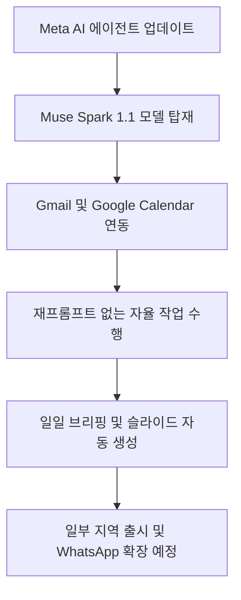
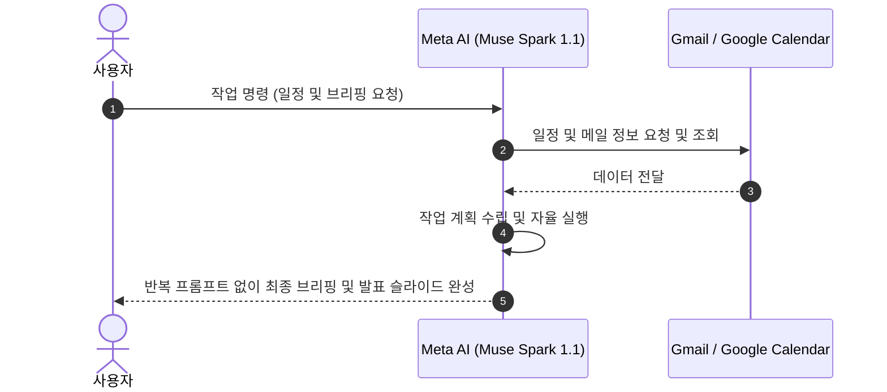
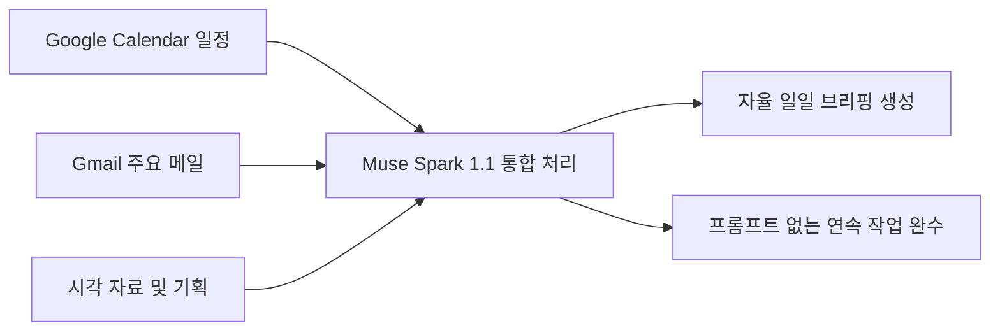
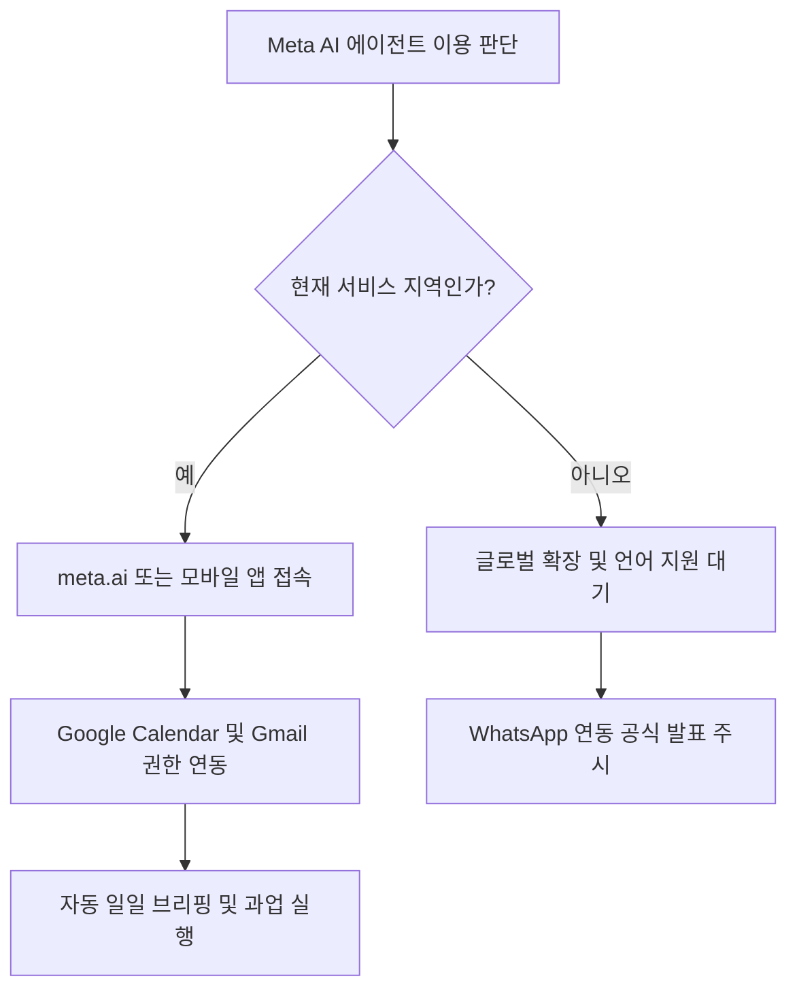

인용된 Meta 자료는 Muse Spark 1.1 기반 Meta AI가 Gmail·Google Calendar 연결과 여러 단계 작업을 지원한다고 설명합니다. 제공 지역과 계정별 기능은 다를 수 있고, 메일·일정 접근은 편의만큼 큰 개인정보 권한을 요구합니다. 연결 전 읽기 범위, 외부 메시지·일정 생성 승인, 작업 로그와 연결 해제 절차를 확인하세요.

Meta가 단순한 묻고 답하는 인공지능 대화창을 넘어 독자적으로 업무를 처리하는 에이전트 시대로 대전환을 시작했습니다. 이제 메일함과 일정표를 스스로 확인하고 하루 업무를 종합해서 알려주는 인공지능 비서가 현실로 다가왔습니다.

## 무슨 일이 벌어진 걸까?

Meta는 2026년 7월 24일 웹과 모바일 앱 서비스 전반에 걸쳐 Meta AI의 대규모 기능 업데이트를 공식 발표했습니다 <a href="#source-1" aria-label="Meta Newsroom 출처">[1]</a>. 이번 업데이트의 핵심은 단순 대화형 AI를 넘어 사용자를 대신해 구체적인 과업을 실행하는 에이전트 형태의 변화입니다. 새롭게 개편된 Meta AI는 최신 두뇌 역할을 하는 Muse Spark 1.1 모델을 기반으로 작동합니다 <a href="#source-1" aria-label="Meta Newsroom 출처">[1]</a>.

가장 주목할 점은 외부 생산성 애플리케이션과의 직접적인 연동 능력입니다. Meta AI는 이제 사용자의 Google Calendar 및 Gmail 계정과 연결되어 수신된 메일 내용을 요약하고 하루 일정을 종합한 일일 브리핑을 생성할 수 있습니다 <a href="#source-3" aria-label="SiliconANGLE 출처">[3]</a>. 특히 기존 생성형 AI처럼 매 단계마다 사용자가 추가 지시나 프롬프트를 다시 입력할 필요 없이 연속된 작업을 직접 완료한다는 점이 핵심입니다 <a href="#source-1" aria-label="Meta Newsroom 출처">[1]</a>.

<figure class="news-source-image">
  
  <figcaption>Meta Newsroom가 원문과 함께 공개한 이미지입니다. <a href="https://about.fb.com/news/2026/07/meta-ai-muse-spark-doesnt-just-think-it-acts" target="_blank" rel="noopener noreferrer">출처: Meta Newsroom</a></figcaption>
</figure>

## 왜 지금 다들 이 이야기를 할까?

Muse Spark 1.1 모델로 업그레이드된 Meta AI는 단순 대화형 AI를 넘어 사용자를 대신해 다단계 작업을 자율적으로 실행하는 에이전트로 진화했습니다 <a href="#source-1" aria-label="Meta Newsroom 출처">[1]</a>. 지금까지의 AI 서비스는 질문을 던지면 답변을 적어주는 방식에 머물렀지만, 인공지능이 질문을 받은 뒤 여러 단계를 스스로 계산하고 외부 서비스를 제어하는 단계로 발돋움한 것입니다 <a href="#source-1" aria-label="Meta Newsroom 출처">[1]</a>.

Muse Spark 1.1로 업그레이드된 Meta AI는 사용자가 하나하나 가이드라인을 주지 않아도 전체적인 계획을 세우고 이를 실행으로 옮깁니다 <a href="#source-3" aria-label="SiliconANGLE 출처">[3]</a>. 예를 들어 행사 계획을 짜거나 발표용 슬라이드 덱, 분위기를 보여주는 무드보드 형태의 시각적 콘텐츠를 만들어내는 작업을 스스로 다단계로 나눠 처리합니다 <a href="#source-1" aria-label="Meta Newsroom 출처">[1]</a>. 끊임없이 추가 입력을 받아야 했던 프롬프트 피로감을 크게 줄여준다는 점에서 시장의 주목을 받고 있습니다.

<figure class="news-source-image">
  
  <figcaption>Meta Newsroom가 원문과 함께 공개한 이미지입니다. <a href="https://about.fb.com/news/2026/07/meta-ai-muse-spark-doesnt-just-think-it-acts" target="_blank" rel="noopener noreferrer">출처: Meta Newsroom</a></figcaption>
</figure>

## 그래서 우리에게 뭐가 달라질까?

Meta AI와 Google Calendar 및 Gmail 연동이 제공됨에 따라 사용자는 반복적인 입력 없이도 일일 브리핑과 업무 일정 정리 작업을 자동으로 수행할 수 있습니다 <a href="#source-3" aria-label="SiliconANGLE 출처">[3]</a>. 매번 캘린더 앱을 열어서 일정을 확인하고 중요한 메일을 하나씩 찾아 읽는 대신, Meta AI에게 아침 브리핑을 요청하면 간단히 해결됩니다.

구체적으로 Meta AI는 연결된 Google Calendar에서 오늘의 미팅 시간을 가져오고 Gmail에 들어온 주요 서신을 파악해 요약본을 만들어 줍니다 <a href="#source-3" aria-label="SiliconANGLE 출처">[3]</a>. 또 매일 반복되는 루틴 업무나 일정 정리, 시각 자료 구상을 한 번의 지시로 끝낼 수 있게 됩니다 <a href="#source-1" aria-label="Meta Newsroom 출처">[1]</a>.

<figure class="news-source-image">
  
  <figcaption>SiliconANGLE가 원문과 함께 공개한 이미지입니다. <a href="https://siliconangle.com/2026/07/24/meta-makes-muse-spark-1-1-available-consumers-debuts-new-facebook-features" target="_blank" rel="noopener noreferrer">출처: SiliconANGLE</a></figcaption>
</figure>

## 연결하기 전에 무엇을 검증할까?

Meta AI의 새로운 자율 작업 에이전트 기능은 웹사이트인 meta.ai와 Meta AI 모바일 앱을 통해 일부 지역에서 먼저 체험할 수 있습니다 <a href="#source-1" aria-label="Meta Newsroom 출처">[1]</a>. 초기 출시 대상 지역에 거주하는 사용자는 해당 플랫폼에서 계정을 연동해 직접 테스트를 진행해볼 수 있습니다.

제가 보기엔 메타가 이 에이전트 기능을 인스턴트 메신저 플랫폼인 WhatsApp으로 확장하겠다고 밝힌 점이 매우 유의미한 지점입니다 <a href="#source-1" aria-label="Meta Newsroom 출처">[1]</a>. 메신저 대화창 안에서 업무 브리핑을 받아보고 연속 작업을 명령할 수 있게 된다면 일상 속 AI 사용 접근성이 한층 높아질 것으로 기대됩니다.

## 아직은 선을 그어야 할 부분

Meta AI의 이번 에이전트 업데이트는 일부 우선 출시 지역 외의 글로벌 전역 확장 시기와 한국어 지원 일정이 명확히 공개되지 않은 한계가 있습니다 <a href="#source-3" aria-label="SiliconANGLE 출처">[3]</a>. 현재 작업 자동화 기능은 일부 지역 시장의 meta.ai 및 모바일 앱에서만 제한적으로 서빙되고 있습니다 <a href="#source-1" aria-label="Meta Newsroom 출처">[1]</a>.

비영어권 지원을 포함한 전체 글로벌 출시 스케줄이나 WhatsApp 연동의 정식 출시 날짜 등은 아직 베일에 가려져 있습니다 <a href="#source-3" aria-label="SiliconANGLE 출처">[3]</a>. 따라서 본인이 거주하는 지역이나 계정 설정에서 관련 기능이 오픈되었는지 먼저 확인해보시는 것이 좋습니다.

## Gmail과 Calendar 권한은 어떻게 최소화할까?

메일 요약에 필요한 읽기 권한과 메시지 전송·삭제 권한은 분리해야 합니다. 일정 조회와 일정 생성도 같은 권한이 아닙니다. 초기 시험에서는 별도 테스트 계정과 제한된 캘린더를 연결하고, 첨부파일·연락처·과거 메일까지 넓게 읽는지 확인합니다.

연결된 메일에는 외부 발신자가 넣은 명령형 문장도 포함됩니다. 에이전트가 메일 본문을 사용자 지시로 오인해 파일을 전송하거나 일정을 만들지 않는지 시험해야 합니다. 외부 행동 전에는 대상·내용·시간을 보여 주고 사람이 승인할 수 있어야 합니다.

## 자율 작업이 실제로 끝났는지는 무엇으로 확인할까?

일일 브리핑이 그럴듯한지만 보지 말고 포함돼야 할 일정과 중요 메일의 정답표를 만듭니다. 누락, 중복, 오래된 스레드 혼합과 시간대 오류를 따로 셉니다. 슬라이드나 문서를 만들었다면 사용한 출처와 생성 파일을 열어 확인할 수 있어야 합니다.

재시도와 중단 조건도 필요합니다. 권한이 없거나 서비스가 응답하지 않을 때 같은 호출을 반복하지 않는지, 일부 단계만 성공했을 때 완료로 표시하지 않는지 봅니다. 지역 또는 언어 지원이 불분명하면 발표 문구보다 현재 계정의 기능 표시와 공식 지원 문서를 우선해야 합니다.

## 연결을 해제하면 무엇이 남을까?

Google 권한을 철회한 뒤 Meta 쪽에 저장된 브리핑, 작업 로그, 파생 요약이 함께 삭제되는지는 별도 문제입니다. 각 서비스의 연결 관리 화면과 데이터 삭제 경로를 확인하고, 조직 계정이라면 관리자의 보존 정책도 적용되는지 봅니다. 연결을 다시 설정했을 때 과거 데이터가 복원된다면 실제 삭제 범위를 다시 점검해야 합니다.

처음부터 실제 업무 계정을 연결하지 말고, 가짜 일정과 메일이 있는 시험 계정으로 시작합니다. 정상 요청뿐 아니라 취소된 일정, 중복 초대, 시간대가 다른 회의와 외부 발신자의 명령형 메일을 넣어 결과를 확인합니다. 브리핑이 중요한 항목을 빠뜨리거나 외부 행동을 승인 없이 수행하면 연결 범위를 줄이고 자동 실행을 중단해야 합니다.

운영 여부는 기능이 한 번 동작했다는 사실보다 반복 정확도와 복구 가능성으로 결정합니다. 작업마다 사용한 데이터 출처, 실행한 도구, 변경된 일정이나 파일을 추적할 수 있어야 하며, 사용자가 되돌릴 방법도 제공돼야 합니다. 이 기록이 없다면 편리한 요약 기능과 자율 행동 기능을 분리해 후자만 비활성화하는 편이 안전합니다.

<!-- primary-sources:start -->
## 원문과 버전 확인

- [발표 원문](https://about.fb.com/news/2026/07/meta-ai-muse-spark-doesnt-just-think-it-acts)
- [Axios](https://www.axios.com/2026/07/24/meta-muse-spark-agents)
- [SiliconANGLE](https://siliconangle.com/2026/07/24/meta-makes-muse-spark-1-1-available-consumers-debuts-new-facebook-features)
<!-- primary-sources:end -->

<!-- internal-links:start -->
## 함께 읽으면 이해가 이어지는 글

- [Rowboat는 정말 로컬 AI 동료일까: Markdown 기억과 외부 API 경계]() — Rowboat가 업무 기억을 Markdown으로 남기는 방식과 Gmail·OAuth·LLM API를 연결할 때 달라지는 프라이버시 경계를 살펴봅니다.
- [Composio는 에이전트 인증을 얼마나 줄여 주나: 권한과 실행 검증]() — AI 에이전트 개발의 가장 큰 장벽인 '인증(Auth)'과 '도구 연동(Integration)'을 한 번에 해결해주는 Composio를 상세히 분석합니다. LangChain, AutoGen 등 주요 프레임워크와의 연동법과 실전…
- [Agentic Inbox가 Gmail Polling을 대체할까: Durable Object·SQLite의 상태 경계]() — Agentic Inbox의 이벤트 기반 수신과 Durable Object·SQLite·R2 상태 구조를 분석하고, 중복 처리·승인·MIME·벤더 종속성까지 도입 전에 정할 경계를 설명합니다.
<!-- internal-links:end -->

## 자주 묻는 질문

### Meta AI의 새로운 에이전트 기능은 어떤 모델로 동작하나요?

Meta AI의 새로운 에이전트 기능은 Meta의 최신 모델인 Muse Spark 1.1을 기반으로 동작합니다. 이를 통해 지속적인 추가 프롬프트 입력 없이도 복잡한 과업과 계획을 자율적으로 실행할 수 있습니다.

### Meta AI를 Google Calendar나 Gmail과 연동할 수 있나요?

네, Google Calendar 및 Gmail 계정을 연동해 이메일 요약 및 일일 브리핑을 생성할 수 있습니다. 다만 초기 출시 시점에는 일부 대상 지역의 meta.ai 및 모바일 앱 사용자에게 우선 제공됩니다.

### Meta AI 에이전트 기능은 WhatsApp에서도 사용할 수 있나요?

현재는 meta.ai 웹사이트 및 Meta AI 모바일 앱에서 우선적으로 탑재되었으며 WhatsApp으로의 확장이 예정되어 있습니다. 구체적인 WhatsApp 연동 출시 일정은 아직 공식적으로 발표되지 않았습니다.

### 한국어 지원 및 전체 글로벌 출시 일정은 어떻게 되나요?

비영어권 지역 및 한국어 지원을 포함한 정확한 글로벌 출시 일정은 아직 밝혀지지 않았습니다. 메타는 일부 주요 지역 시장을 시작으로 순차적 확장을 진행할 계획입니다.

## 직접 확인한 원문

<ol class="checked-source-list">
  <li id="source-1"><a href="https://about.fb.com/news/2026/07/meta-ai-muse-spark-doesnt-just-think-it-acts" target="_blank" rel="noopener noreferrer">Meta Newsroom — Meta AI Doesn&#x27;t Just Think, It Acts</a> (2026-07-24)</li>
  <li id="source-2"><a href="https://www.axios.com/2026/07/24/meta-muse-spark-agents" target="_blank" rel="noopener noreferrer">Axios — Meta&#x27;s Muse Spark agents connects to Google Calendar and Gmail</a> (2026-07-24)</li>
  <li id="source-3"><a href="https://siliconangle.com/2026/07/24/meta-makes-muse-spark-1-1-available-consumers-debuts-new-facebook-features" target="_blank" rel="noopener noreferrer">SiliconANGLE — Meta makes Muse Spark 1.1 available to consumers, debuts new Facebook features</a> (2026-07-24)</li>
</ol>

> 이 글은 위 원문을 직접 확인해 작성했습니다. 가격, 기능 범위, 지역별 제공 여부는 게시 후 바뀔 수 있으니 실제 도입 전 공식 문서를 다시 확인하세요.
